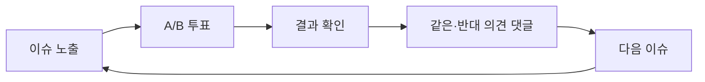

# WHICH 제품 비전 및 설계 원칙 v2.0

- **문서 상태:** 상세 기획 검토본
- **버전:** 2.0
- **기준일:** 2026-08-17
- **기준 문서:** `01_PRODUCT_VISION_AND_PRINCIPLES.md` v1, `12_DECISION_LOG.md`, `13_GLOSSARY_AND_STATUS_MODEL.md`
- **연관 문서:**
  - `02_CORE_UX_AND_USER_JOURNEYS.md`
  - `03_ISSUE_SUPPLY_AND_CONTENT_PIPELINE.md`
  - `04_ISSUE_TAXONOMY_QUALITY_AND_CONTROVERSY.md`
  - `05_IDENTITY_AND_VOTE_INTEGRITY.md`
  - `06_INTEREST_ONBOARDING_AND_PERSONALIZATION.md`
  - `07_RECOMMENDATION_AND_ML_ARCHITECTURE.md`
  - `08_SOCIAL_AND_COMMUNITY.md`
  - `09_MODERATION_AND_GOVERNANCE.md`
  - `10_METRICS_ANALYTICS_AND_EXPERIMENTS.md`
  - `11_MVP_ROADMAP_AND_OPEN_DECISIONS.md`
- **문서 목적:** WHICH가 해결할 문제, 대상 사용자, 핵심 가치, 제품 정체성, 성장 구조, 제품 의사결정 원칙과 금지선을 정의한다.
- **문서 비범위:** 화면별 상세 UI, API, DB 스키마, 추천 모델 구현, 운영자 화면 세부, 법률 검토 결과는 각 연관 문서에서 다룬다.

---

## 0. 결정 상태 표기

| 표기 | 의미 |
|---|---|
| **[확정]** | 후속 설계와 구현의 기본 전제로 사용한다. |
| **[설계 기준]** | 원칙은 채택하되 세부 구현은 실험과 검증을 통해 조정할 수 있다. |
| **[초기안]** | 아직 실제 사용자 데이터나 운영 검증이 없어 변경 가능성이 높다. |
| **[미정]** | 별도의 명시적 의사결정이 필요하다. |
| **[금지]** | 제품 정체성, 신뢰 또는 안전을 해치므로 채택하지 않는다. |

### 0.1 v2 주요 보강 내용

| 영역 | v1 | v2 보강 내용 |
|---|---|---|
| 제품 정의 | 이슈 소비형 의견 플랫폼 | 한 줄 정의, 제품 약속, 핵심 단위, 범주 경계 명확화 |
| 문제 정의 | 사용자 참여 비용과 콘텐츠 부족 | 참여자·작성자·운영자·신뢰 관점으로 구조화 |
| 사용자 | 역할별 권한 중심 | 상황, 동기, Job-to-be-Done, 성공 상태 추가 |
| 가치 제안 | 역할별 주요 효익 | 기능적·감정적·사회적 가치로 확장 |
| 성장 구조 | 소비·생산·유입·학습 루프 | 루프별 입력·보상·병목·가드레일 추가 |
| 제품 원칙 | 핵심 원칙 8개 | 실제 기능 의사결정에 적용할 판단 기준으로 구체화 |
| 제품 가설 | 가설과 지표 | 실패 신호와 검증 순서 추가 |
| 성공 기준 | 지표 문서 참조 | North Star 후보, Guardrail, 단계별 성공 조건 연결 |
| 위험 | 여러 문서에 분산 | 제품 수준의 구조적 위험과 대응 원칙 통합 |
| 문서 연결 | 일부 연관 문서 | 원칙별 상세 설계 문서 추적표 추가 |

---

# 1. 제품 요약

## 1.1 한 줄 정의

**[확정]** WHICH는 사용자가 짧은 이슈를 보고 A/B 중 하나를 선택한 뒤, 전체 결과와 양쪽의 이유를 확인하고 다음 질문으로 이어지는 **이슈 소비형 의견 플랫폼**이다.

## 1.2 제품 정체성

```text
이슈 소비 플랫폼
+
이지선다 의견 플랫폼
+
SNS 기반 참여 콘텐츠 플랫폼
+
개인화된 연속 질문 피드
```

WHICH의 중심은 설문지를 만드는 기능이 아니라 **질문을 콘텐츠처럼 소비하는 경험**이다.

사용자는 긴 글을 작성하지 않아도 되고, 특정 커뮤니티에 가입하지 않아도 되며, 하나의 질문을 이해하고 선택하는 데 드는 비용이 낮아야 한다.

## 1.3 핵심 제품 약속

**[설계 기준]** WHICH가 사용자에게 제공해야 하는 최소 약속은 다음과 같다.

> 짧은 질문 하나에 선택하면, 사람들이 어떻게 생각하는지 즉시 확인하고, 같은 의견과 다른 의견의 이유까지 살펴볼 수 있다.

이 약속은 다음 네 단계로 구현된다.

```text
질문 이해
→ A/B 선택
→ 결과 확인
→ 이유와 다음 질문 탐색
```

## 1.4 핵심 콘텐츠 단위

**[확정]** WHICH의 기본 콘텐츠 단위는 `Issue`다.

하나의 Issue는 최소한 다음으로 구성된다.

1. **질문**: 사용자가 판단해야 할 단일 논점
2. **선택지 A**: 현실적으로 선택 가능한 하나의 입장
3. **선택지 B**: A와 대등한 수준의 다른 입장
4. **배경 정보**: 필요한 경우에만 제공하는 짧고 검증 가능한 맥락
5. **출처**: 외부 사실이나 사건에 기반한 경우 연결되는 원자료
6. **투표 결과**: 정상 집계된 A/B 비율과 참여 수
7. **댓글**: 해당 Issue에서 사용자가 선택한 A/B와 연결된 이유
8. **다음 행동**: 다음 이슈, 댓글 탐색, 공유 중 하나로 이어지는 경로

상세 데이터 구조는 후속 DB 문서에서 정의한다.

## 1.5 제품이 제공하는 핵심 보상

| 사용자 행동 | 즉시 보상 | 누적 보상 |
|---|---|---|
| 투표 | 결과 공개, 다수·소수 피드백 | 내 투표 기록과 관심 프로필 |
| 댓글 열람 | 같은 입장과 반대 입장의 이유 확인 | 주제 이해와 반복 참여 |
| 다음 이슈 이동 | 새로운 선택 기회 | 개인화 피드 개선 |
| 공유 | 다른 사람에게 질문 제시 | 유입·확산과 참여 성과 |
| 이슈 생성 | 다른 사람의 반응 확인 | 작성자 성과, 배지, 평판 |

---

# 2. 해결하려는 문제

## 2.1 참여자 관점의 문제

기존 SNS, 뉴스, 커뮤니티에서 이슈에 참여하려면 다음과 같은 비용이 발생한다.

### 2.1.1 참여까지의 정보 비용

- 긴 기사나 게시물을 읽어야 논점을 이해할 수 있다.
- 댓글 맥락을 따라가야 쟁점을 파악할 수 있다.
- 같은 사건이 여러 채널에 흩어져 있다.
- 핵심 질문이 무엇인지 불명확한 경우가 많다.

### 2.1.2 표현 비용

- 자신의 의견을 글로 정리해야 한다.
- 공개 댓글 작성에 심리적 부담이 있다.
- 커뮤니티 문화나 기존 참여자 분위기를 의식하게 된다.
- 짧게 의견만 표현하고 싶은 사람도 침묵하게 된다.

### 2.1.3 의견 분포 확인의 어려움

- 좋아요 수는 의견 비율을 의미하지 않는다.
- 댓글 수가 많아도 참여자 전체의 선택을 알 수 없다.
- 알고리즘이 특정 의견만 반복 노출할 수 있다.
- 댓글 참여자와 실제 선택자의 관계가 분리되어 있다.

### 2.1.4 연속 탐색의 비효율

- 한 이슈를 본 뒤 다음 관련 이슈로 자연스럽게 이어지지 않는다.
- 검색하거나 홈으로 돌아가야 한다.
- 관심 주제와 현재 트렌드를 균형 있게 소비하기 어렵다.

## 2.2 이슈 작성자 관점의 문제

좋은 질문을 가진 사용자도 기존 서비스에서는 다음 한계가 있다.

- 질문을 던져도 체계적인 A/B 결과를 얻기 어렵다.
- 댓글 반응은 얻을 수 있지만 실제 선택 분포는 불명확하다.
- 질문 자체의 성과가 별도 자산으로 축적되지 않는다.
- 좋은 질문 작성자와 자극적 게시물 작성자를 구분하기 어렵다.
- 질문을 중립적이고 대등한 선택지로 다듬을 지원이 부족하다.

## 2.3 운영자 관점의 문제

새로운 참여형 플랫폼은 초기부터 다음 운영 난제를 가진다.

- 사용자가 없으면 콘텐츠가 생기지 않고, 콘텐츠가 없으면 사용자가 남지 않는다.
- 외부 자료를 그대로 복제하면 저작권·품질·신뢰 문제가 생긴다.
- 같은 논점의 중복 질문이 빠르게 늘어날 수 있다.
- 자극적인 갈등 이슈가 단기 반응을 독점할 수 있다.
- 정치·젠더·사건사고 등 고위험 주제가 서비스 전체를 규정할 수 있다.
- 비회원 투표는 진입 장벽을 낮추지만 중복·봇·좌표찍기 위험을 높인다.
- 신고 기능도 조직적인 공격 수단으로 악용될 수 있다.

## 2.4 신뢰 관점의 문제

의견 플랫폼의 결과는 쉽게 다음과 같이 오해되거나 조작될 수 있다.

- 참여자 투표를 전체 사회의 대표 여론처럼 해석
- 특정 집단의 외부 유입으로 결과 왜곡
- 다중 계정·봇을 이용한 반복 투표
- 질문 문장이나 선택지 강도를 이용한 응답 유도
- 추천 알고리즘을 통한 갈등 콘텐츠 자동 증폭
- 공개 투표 기록을 이용한 정치·이념 성향 추적

## 2.5 구조화된 문제 정의

**[확정]** WHICH가 해결하려는 핵심 문제는 다음과 같다.

> 사람들은 다양한 이슈에 대해 가볍게 선택하고 다른 사람들의 의견을 확인하고 싶지만, 기존 서비스에서는 참여 비용이 높고, 선택 분포와 이유가 분리되어 있으며, 다음 이슈로 이어지는 구조와 신뢰 가능한 운영 체계가 부족하다.

## 2.6 문제 해결 방식

WHICH는 위 문제를 다음 구조로 해결한다.

| 문제 | WHICH의 해결 방식 |
|---|---|
| 참여 비용이 높음 | 한 질문과 두 선택지로 참여 단위를 축소 |
| 결과를 알기 어려움 | 투표 직후 A/B 결과 공개 |
| 댓글과 선택이 분리됨 | 해당 Issue 안에서 댓글과 A/B 선택 연결 |
| 다음 콘텐츠 탐색이 번거로움 | 세로 피드·다음 이슈 구조 |
| 초기 콘텐츠 부족 | 외부 토대 자료를 WHICH 형식으로 편집한 Issue Pool |
| 개인화 데이터 부족 | 관심사 온보딩과 콘텐츠 임베딩 기반 Cold Start |
| 자극적 콘텐츠 과다 노출 | 품질·다양성·안전·무결성 정책 재정렬 |
| 정치 여론조작 위험 | RESTRICTED 파이프라인과 인간 검수, 강화된 투표 정책 |
| 대표 여론 오해 | 비대표 표본 고지와 결과 표현 제한 |

---

# 3. 목표 사용자와 사용 상황

## 3.1 사용자 역할과 제품 역할의 구분

한 사람은 상황에 따라 여러 역할을 가질 수 있다.

예를 들어 일반 `Member`가 이슈를 만들면 `Creator` 역할도 갖는다. `Guest`가 가입하면 기존 익명 활동을 회원 활동과 연결할 수 있다. 역할은 계정 등급만이 아니라 **현재 제품에서 수행하는 Job**을 구분하기 위한 개념이다.

## 3.2 Guest

### 주요 상황

- SNS에서 특정 질문 링크를 발견했다.
- 검색 결과나 공유 링크를 통해 처음 WHICH에 들어왔다.
- 가입 없이 빠르게 결과만 확인하고 싶다.

### Job-to-be-Done

> 지금 본 질문에 내 선택을 표시하고, 다른 사람들은 무엇을 선택했는지 즉시 확인하고 싶다.

### 핵심 불편

- 가입 요구
- 결과를 보기 위한 불필요한 단계
- 서비스 설명이 긴 첫 화면
- 투표 후 다음 행동이 불명확한 구조

### 성공 상태

- 첫 화면에서 질문을 이해한다.
- 별도 가입 없이 투표한다.
- 결과와 다수·소수 피드백을 확인한다.
- 최소 한 번 이상 다음 이슈로 이동한다.

### 기본 권한

- 일반 이슈 투표
- 결과 확인
- 댓글 읽기
- 다음 이슈 이동
- 공유

정치·고위험 이슈 권한은 일반 Guest 권한과 분리한다.

## 3.3 Member

### 주요 상황

- 여러 이슈에 반복 참여하고 있다.
- 투표 기록을 저장하고 싶다.
- 댓글을 작성하거나 관심 주제를 관리하고 싶다.

### Job-to-be-Done

> 내가 참여한 기록을 보존하고, 관심 있는 질문을 더 잘 추천받으며, 필요한 경우 내 이유도 남기고 싶다.

### 성공 상태

- 관심 주제를 설정한다.
- 기기나 세션이 달라도 기록이 유지된다.
- 내 투표 기록과 참여 통계를 확인한다.
- 댓글·공감·신고 등 커뮤니티 기능을 사용한다.

### 기본 권한

- Guest 기능 전체
- 투표 기록 저장
- 관심사 관리
- 댓글 작성
- 이슈 생성
- 작성자·Topic 팔로우
- 개인 통계
- 신고·차단

## 3.4 Verified Member

### 주요 상황

- 일반 회원보다 높은 신뢰가 필요한 기능에 참여한다.
- 정치·선거·고위험 이슈에서 강화된 참여 조건을 충족해야 한다.

### Job-to-be-Done

> 추가적인 신뢰 확인이 필요한 이슈에도 참여하면서 내 계정의 정상 사용자 상태를 증명하고 싶다.

### 설계 원칙

- **[설계 기준]** 모든 회원에게 일괄적으로 본인 인증을 강제하지 않는다.
- **[설계 기준]** 위험 수준이 높은 기능에서만 단계적으로 요구한다.
- **[미정]** 인증 방식, 인증 수준, 보존 정보와 정치 이슈 참여 권한은 별도 확정이 필요하다.

## 3.5 Creator

### 주요 상황

- 다른 사람에게 물어보고 싶은 명확한 질문이 있다.
- 내가 만든 이슈가 얼마나 반응을 얻었는지 보고 싶다.
- 좋은 질문을 만드는 사람으로 인식되고 싶다.

### Job-to-be-Done

> 사람들이 실제로 선택하고 토론할 만한 질문을 만들고, 그 결과와 성과를 확인하고 싶다.

### 성공 상태

- 중립적이고 명확한 질문을 작성한다.
- 품질·중복·안전 검사를 이해하고 수정할 수 있다.
- 조회, 정상 투표, 댓글, 공유, 순위 등 성과를 확인한다.
- 다음 이슈를 다시 만들 동기를 얻는다.

### 핵심 보상

- 참여 수
- 댓글과 공유
- 인기·논쟁·급상승 노출
- 배지와 기록
- 작성자 팔로우

**[확정]** 초기에는 직접적인 현금 보상을 제공하지 않는다.

## 3.6 Editorial Operator

### 주요 상황

- 초기 Issue Pool이 충분하지 않다.
- 뉴스, 공식 발표, SNS 트렌드, 커뮤니티 화제 등에서 후보를 찾는다.
- 원자료를 WHICH용 질문으로 변환하고 예약 게시한다.

### Job-to-be-Done

> 외부에 이미 존재하는 토대 자료를 복제하지 않고, 출처와 맥락을 보존한 고품질 A/B 이슈로 지속적으로 공급하고 싶다.

### 성공 상태

- Source Item과 Issue Candidate가 분리되어 관리된다.
- 중복·편향·위험도가 게시 전 탐지된다.
- 카테고리별 Issue Pool이 고갈되지 않는다.
- Current, Trend, Evergreen의 비중을 조정할 수 있다.

## 3.7 Moderator

### 주요 상황

- 사용자 생성 이슈와 댓글을 검수한다.
- 신고, 이상 투표, 정치 이슈, 출처 문제를 처리한다.
- 제한·삭제·복구 결정을 설명 가능하게 남겨야 한다.

### Job-to-be-Done

> 의견 자체를 억압하지 않으면서, 유도성 질문·허위 전제·괴롭힘·조작·정치 위험을 일관된 정책으로 통제하고 싶다.

### 성공 상태

- 위험도와 증거를 빠르게 파악한다.
- 조치의 이유와 변경 이력을 남긴다.
- 오탐과 조직적 신고 공격을 줄인다.
- 이의 제기와 복구가 가능하다.

## 3.8 초기 핵심 사용자 우선순위

| 우선순위 | 사용자 | 이유 |
|---:|---|---|
| 1 | Guest 참여자 | 외부 유입 후 첫 투표와 연속 참여가 MVP 핵심 가설이기 때문 |
| 2 | Editorial Operator | 초기 콘텐츠 공급이 사용자 생성만으로 해결되지 않기 때문 |
| 3 | Member 참여자 | 기록·관심사·댓글을 통해 재방문과 학습 데이터를 만들기 때문 |
| 4 | Moderator | 초기부터 품질·정치·조작 위험을 통제해야 하기 때문 |
| 5 | Creator | 핵심 루프 검증 후 사용자 생산 비중을 확대하기 때문 |
| 6 | Verified Member | 고위험 기능을 본격 운영할 때 중요도가 커지기 때문 |

이 우선순위는 기능 가치의 순위가 아니라 **MVP 구축 의존성**을 나타낸다.

---

# 4. 핵심 가치 제안

## 4.1 참여자 가치

### 기능적 가치

- 긴 글을 작성하지 않고 의견을 표현한다.
- 다른 사람의 선택 분포를 즉시 확인한다.
- 같은 선택과 반대 선택의 댓글을 나누어 읽는다.
- 짧은 시간에 여러 주제를 연속 탐색한다.
- 관심사와 행동에 맞는 이슈를 추천받는다.

### 감정적 가치

- “나만 이렇게 생각하는가?”라는 궁금증을 해소한다.
- 다수 의견에 속했을 때 공감과 안도감을 얻는다.
- 소수 의견에 속했을 때 새로운 관점이나 정체성을 발견한다.
- 내 선택이 즉시 결과에 반영되는 참여감을 얻는다.

### 사회적 가치

- 다른 사람의 입장을 짧고 구조화된 방식으로 비교한다.
- 의견 차이를 댓글의 선택 맥락과 함께 이해한다.
- 질문을 공유해 다른 사람의 참여를 유도한다.

## 4.2 Creator 가치

### 기능적 가치

- 질문의 참여 성과를 수치로 확인한다.
- 질문 작성 보조와 수정 제안을 받는다.
- 내 이슈의 댓글과 공유 반응을 모아본다.

### 감정적 가치

- “내가 던진 질문에 사람들이 반응했다”는 성취를 얻는다.
- 좋은 질문을 만드는 사람으로 인정받는다.

### 사회적 가치

- 특정 입장의 선동자가 아니라 흥미로운 질문의 생산자로 팔로우받는다.
- 이슈를 통해 다른 사용자의 대화를 시작한다.

## 4.3 운영자 가치

- 외부 자료를 체계적으로 후보화하고 게시한다.
- 카테고리별 Issue Pool과 게시 일정을 관리한다.
- 사용자 반응과 안전 지표를 함께 본다.
- ML 추천을 위한 신뢰 가능한 Impression과 행동 로그를 축적한다.
- 정치·조작·신고 위험을 별도 정책으로 통제한다.

## 4.4 WHICH의 가치 우선순위

기능 충돌이 발생하면 다음 우선순위를 기본으로 한다.

```text
1. 안전과 신뢰 유지
2. 질문과 선택의 명확성
3. 첫 참여의 단순성
4. 결과 보상의 즉시성
5. 연속 참여
6. 개인화와 발견
7. 소셜 확장
8. 수익화
```

수익모델이 확정되더라도 상위 원칙을 훼손해서는 안 된다.

---

# 5. 핵심 제품 메커니즘

## 5.1 투표 전 상태

사용자가 처음 Issue를 접했을 때 가장 먼저 이해해야 할 것은 다음 두 가지다.

1. 무엇을 판단해야 하는가?
2. A와 B는 각각 무엇을 의미하는가?

투표 전에는 결과 비율을 숨긴다.

**[확정]** 결과 미노출은 단순한 게임화가 아니라 다음 목적을 가진다.

- 다른 사람의 선택에 휩쓸리기 전에 자신의 판단을 하게 한다.
- 결과 확인을 투표의 즉시 보상으로 만든다.
- 보기만 하는 사용자보다 참여 사용자를 늘린다.

단, 배경 정보나 출처를 숨겨 판단을 왜곡해서는 안 된다.

## 5.2 투표 순간

투표는 다음 조건을 만족해야 한다.

- 일반 이슈에서 한 번의 명확한 선택으로 완료
- 선택 성공·실패 상태가 즉시 전달
- 중복이나 위험 요청이 아니면 불필요한 인증 없음
- 서버 정상 집계 여부와 사용자 화면 상태가 일관됨
- A/B 선택을 바꾸는 정책은 별도 결정

## 5.3 투표 후 상태

투표 후 최소한 다음을 제공한다.

- A/B 비율
- 정상 집계된 총 참여 수
- 사용자가 선택한 항목 표시
- 다수·소수 여부 또는 같은 선택을 한 비율
- 댓글 진입
- 다음 이슈 진입
- 공유

**[확정]** 투표 직후 자동으로 다음 이슈로 넘기지 않는다. 사용자가 결과를 충분히 확인한 뒤 직접 이동한다.

## 5.4 댓글의 역할

댓글은 독립적인 커뮤니티 게시판이 아니라 **선택의 이유를 설명하는 보조 콘텐츠**다.

따라서 댓글은 해당 Issue 안에서만 A/B 선택과 연결한다.

```text
[A] 사용자의 이유
[B] 사용자의 이유
```

**[확정]** 사용자의 전체 투표 방향을 프로필에서 공개하지 않는다.

## 5.5 다음 이슈의 역할

다음 이슈는 단순한 추천 카드가 아니라 WHICH의 핵심 체류 장치다.

- 투표하지 않은 채 넘김: `SKIP`
- 투표와 결과 확인 후 이동: `NEXT_ISSUE`

두 행동을 구분해 추천과 제품 지표에 사용한다.

## 5.6 이지선다 형식의 장점과 제한

### 장점

- 판단과 행동이 빠르다.
- 모바일 한 화면에 적합하다.
- 결과를 직관적으로 비교할 수 있다.
- 댓글을 선택별로 구조화하기 쉽다.
- 연속 소비에 유리하다.

### 제한

- 현실의 복잡한 입장을 지나치게 단순화할 수 있다.
- 조건부·중립·기타 선택이 필수인 질문에는 적합하지 않다.
- 선택지 설계가 편향되면 결과 전체가 왜곡된다.

**[확정]** 모든 주제를 억지로 A/B로 만들지 않는다. 이지선다에 적합하지 않은 질문은 게시하지 않거나 논점을 분리한다.

---

# 6. 제품 성장 구조

## 6.1 소비 루프



### 사용자 동기

- 결과가 궁금하다.
- 다른 사람의 이유가 궁금하다.
- 다음 질문도 빠르게 판단해보고 싶다.

### 핵심 보상

- 즉시 결과
- 다수·소수 피드백
- 반대 의견 발견

### 주요 병목

- 질문이 이해되지 않음
- 선택지가 편향되거나 겹침
- 결과 신뢰도가 낮음
- 댓글이 공격적임
- 다음 이슈가 반복적이거나 무관함

### 핵심 지표

- Issue View → Vote Conversion
- Result View Rate
- Comment Open Rate
- Opposite-side Comment Open Rate
- Next Issue Rate
- Qualified Votes per Session

## 6.2 생산 루프

```text
다른 이슈 참여
→ 새로운 질문 아이디어
→ 이슈 작성
→ 품질·안전 검수
→ 게시
→ 투표·댓글·공유 성과
→ 작성자 보상
→ 다시 이슈 작성
```

### 핵심 보상

- 내가 만든 이슈의 정상 투표 수
- 인기·논쟁·급상승 노출
- 댓글과 공유
- 배지와 작성자 팔로우

### 주요 병목

- 작성 형식이 어렵다.
- 검수 이유를 이해하지 못한다.
- 게시까지 오래 걸린다.
- 반응이 없는 이슈가 반복된다.
- 자극적 제목이 더 유리하다고 느낀다.

### 가드레일

- 조회수만으로 작성자 보상하지 않는다.
- 신고·중복·삭제·수정 이력을 평판에 반영한다.
- 정치·고위험 이슈의 사용자 자동 게시를 허용하지 않는다.

## 6.3 유입·확산 루프

```text
YouTube / X / Instagram / Threads
→ 특정 Issue URL
→ 비회원 즉시 투표
→ 결과 확인
→ 결과 카드·링크 공유
→ 외부 SNS 재노출
→ 신규 사용자
```

### 주요 병목

- 링크 클릭 후 가입 장벽
- 외부 게시물과 실제 Issue의 불일치
- 공유 카드가 결과를 과도하게 노출해 투표 동기를 제거
- 특정 외부 집단의 조직적 유입

### 가드레일

- 일반 유입과 좌표찍기를 행동 패턴으로 구분한다.
- 외부 유입이 급증해도 추천이 자동 폭발하지 않게 한다.
- 정치 이슈는 일반 공유·급상승 정책과 분리한다.

## 6.4 학습 루프

```text
관심사 온보딩
→ ML v0 추천
→ Impression
→ Vote / Skip / Comment / Share / Next
→ 사용자·이슈 피처 갱신
→ 후보 검색과 랭킹 개선
→ 더 적합한 피드
```

### 주요 병목

- Impression 누락
- 위치 편향
- 추천이 만든 행동을 순수 취향으로 오해
- 초기에 선택한 관심사에 사용자를 고정
- 자극적인 콘텐츠가 모델 보상을 독점

### 가드레일

- Exploration과 다양성을 유지한다.
- A/B 의견 방향을 정치·이념 프로파일링에 사용하지 않는다.
- 추천 모델과 무결성 모델을 분리한다.
- 안전·정치 정책이 모델 점수보다 우선한다.

## 6.5 신뢰 루프

**[설계 기준]** v2에서는 기존 4대 루프를 보호하는 기반으로 `신뢰 루프`를 명시한다.

```text
명확한 질문과 출처
→ 정상 투표 집계
→ 설명 가능한 결과
→ 공정한 모더레이션
→ 사용자 신뢰
→ 반복 참여와 양질의 생성
→ 더 안정적인 데이터
```

신뢰 루프가 무너지면 소비·생산·확산·학습 루프의 수치가 단기적으로 유지되더라도 제품은 장기적으로 실패한 것으로 본다.

---

# 7. 제품 설계 원칙

## 7.1 첫 가치 도달 시간을 최소화한다

**[확정]** 외부 링크로 들어온 사용자는 일반 이슈에 회원가입 없이 즉시 투표할 수 있어야 한다.

### 의사결정 적용

- 첫 화면에서 가입 팝업을 띄우지 않는다.
- 서비스 소개보다 질문과 선택지를 우선한다.
- 일반 이슈에 CAPTCHA를 기본 노출하지 않는다.
- 배경 정보는 필요할 때 짧고 명확하게 제공한다.

## 7.2 결과는 투표의 보상이다

**[확정]** 투표 전 결과를 숨기고 투표 직후 공개한다.

### 의사결정 적용

- 결과 미리보기로 선택을 유도하지 않는다.
- 투표 성공 후 결과 표시가 지연되지 않게 한다.
- 투표 직후 다른 화면으로 자동 이동시키지 않는다.

## 7.3 한 이슈의 조회보다 연속 참여를 우선한다

**[확정]** 핵심 성공은 한 번의 바이럴 조회수가 아니라 한 세션에서 여러 이슈에 정상적으로 참여하는 것이다.

### 의사결정 적용

- 다음 이슈 경로를 결과 화면 안에 둔다.
- 단일 Issue 페이지도 피드의 시작점이 되게 한다.
- 페이지뷰보다 Qualified Votes per Session과 Next Issue Rate를 우선 측정한다.

## 7.4 질문이 사람보다 먼저 보인다

**[확정]** WHICH는 일상형 개인 SNS가 아니다.

### 의사결정 적용

- 작성자 프로필보다 질문을 화면 중심에 둔다.
- 팔로우는 “같은 편”보다 “좋은 질문 작성자” 중심으로 설계한다.
- 팔로워 수만으로 피드 노출을 결정하지 않는다.

## 7.5 A와 B는 대등해야 한다

**[확정]** 선택지의 강도, 구체성, 감정적 표현 수준을 맞춘다.

### 의사결정 적용

- 유도성 수식어를 제거한다.
- 서로 겹치거나 동시에 참인 선택지를 피한다.
- 사실 확인과 가치 판단을 구분한다.
- 조건부 답변이 필수인 질문은 분리하거나 거절한다.

## 7.6 마찰은 위험에 비례해야 한다

**[설계 기준]** 모든 사용자에게 동일한 강도의 인증과 검사를 적용하지 않는다.

```text
LOW 일반 이슈
→ 최소 마찰

HIGH/RESTRICTED 이슈
→ 강화된 검수·인증·무결성
```

### 의사결정 적용

- 일반 투표의 간편함을 정치 조작 방어 방식에 맞춰 희생하지 않는다.
- 정치 이슈의 높은 위험을 일반 이슈 정책으로 완화하지 않는다.
- Risk-based Challenge를 사용한다.

## 7.7 참여 결과와 대표 여론을 구분한다

**[확정]** WHICH의 결과는 참여자 집계이며 무작위 표본 여론조사가 아니다.

### 의사결정 적용

- “국민의 ○%” 같은 표현을 사용하지 않는다.
- 정치·공공정책에는 비대표성 고지를 강화한다.
- 참여 수, 집계 기준, 이상표 처리 상태를 가능한 범위에서 설명한다.

## 7.8 관심과 의견 방향을 구분한다

**[설계 기준]** 어떤 주제에 참여했는지는 관심 신호가 될 수 있으나, 선택한 A/B를 이용해 정치·이념 성향을 과도하게 추론하지 않는다.

### 의사결정 적용

- 정치 선택 방향으로 유사 사용자 군집을 만들지 않는다.
- 같은 입장만 반복 추천하는 진영 피드를 만들지 않는다.
- 전체 투표 기록을 기본 공개하지 않는다.

## 7.9 추천 모델보다 정책이 우선한다

**[확정]** ML이 높은 참여를 예측해도 안전·다양성·정치·무결성 정책을 우회할 수 없다.

### 의사결정 적용

- 추천 가능한 콘텐츠를 먼저 Eligibility Filter로 제한한다.
- 정치 Exposure Cap과 이상 유입 페널티를 별도 계층으로 둔다.
- 모델 승격 시 Engagement와 Guardrail을 함께 평가한다.

## 7.10 개인화와 발견을 함께 제공한다

**[설계 기준]** 관심사에 맞는 피드를 제공하되 사용자를 초기 선택이나 기존 행동에 고정하지 않는다.

### 의사결정 적용

- 관심사 온보딩을 Cold Start에 사용한다.
- Exploration Slot을 유지한다.
- 같은 카테고리·작성자·유사 이슈의 반복 노출을 제한한다.
- 사용자가 `관심 없음`, `덜 보기`를 직접 제어할 수 있게 한다.

## 7.11 외부 자료는 복제하지 않고 질문으로 변환한다

**[확정]** 외부 뉴스·커뮤니티·SNS·공식 자료는 Issue Seed의 토대이며, 원문 전체를 대량 복제하지 않는다.

### 의사결정 적용

- Source Item과 Published Issue를 분리한다.
- 필요한 배경만 요약하고 출처를 연결한다.
- 사실과 의견 질문을 분리한다.
- 출처 정정·삭제 시 이슈를 재검토한다.

## 7.12 금전보다 명예와 성과를 먼저 보상한다

**[확정]** 초기 Creator 보상은 랭킹, 배지, 노출, 참여 성과다.

### 의사결정 적용

- 투표당 현금·포인트를 지급하지 않는다.
- 자극적 이슈 생산을 직접 보상하지 않는다.
- 품질·신고·중복·삭제율을 작성자 평판에 함께 반영한다.

## 7.13 운영 결정은 추적 가능해야 한다

**[확정]** 제한·삭제·복구·결과 잠금 등 주요 조치는 이유와 이력을 남긴다.

### 의사결정 적용

- Moderator Action에 Audit Log를 남긴다.
- 정치 이슈는 검수 근거와 상태 변경을 강화 보존한다.
- 사용자 이의 제기와 복구 경로를 둔다.

## 7.14 의견은 허용하되 피해 행동은 제한한다

**[설계 기준]** 특정 의견이 인기 없거나 불편하다는 이유만으로 제거하지 않는다. 다만 허위 전제, 괴롭힘, 혐오, 개인정보 노출, 조직적 조작, 위협 등의 표현과 행동은 제한한다.

---

# 8. 제품 범위와 경계

## 8.1 WHICH가 하는 것

- 짧은 질문과 두 선택지로 의견 참여를 낮은 비용으로 만든다.
- 투표 후 참여자 결과를 공개한다.
- 선택별 댓글을 통해 이유를 비교한다.
- 다음 이슈로 연속 소비를 유도한다.
- 외부 자료와 사용자 아이디어를 이슈로 구조화한다.
- 관심사와 행동을 이용해 개인화된 이슈 피드를 제공한다.
- 품질·안전·정치·투표 무결성을 별도 정책으로 관리한다.

## 8.2 WHICH가 하지 않는 것

- **[금지]** 대표 표본을 전제로 한 공식 여론조사 서비스라고 주장하지 않는다.
- **[금지]** 기사·SNS·커뮤니티 원문을 대량 복제하는 뉴스 미러링 서비스를 만들지 않는다.
- **[금지]** 사용자 전체 투표 이력을 공개해 정치·사회 성향을 추적하게 하지 않는다.
- **[금지]** 특정 의견 진영끼리만 묶는 추천 그래프를 만들지 않는다.
- **[금지]** 댓글 분노·신고 수·투표 급증만으로 노출을 자동 확대하지 않는다.
- **[금지]** 모든 주제를 억지로 A/B로 단순화하지 않는다.
- **[금지]** 모든 일반 사용자에게 강한 인증과 CAPTCHA를 상시 요구하지 않는다.
- **[금지]** 신고 수만으로 콘텐츠를 자동 삭제하지 않는다.
- **[금지]** 초기 Creator에게 직접 금전 보상을 지급해 자극적 생산을 유도하지 않는다.

## 8.3 정치·선거 영역

**[확정]** 정치·선거는 `RESTRICTED` 영역으로 일반 카테고리와 분리한다.

제품 수준의 원칙은 다음과 같다.

- 자동 게시 금지
- 인간 승인 필수
- 출처·날짜·질문 중립성 검토
- 강화된 투표·댓글 권한
- 좌표찍기·봇·다중계정·외부 유입 감시
- 일반 급상승·인기 알고리즘과 분리
- 대표 여론이 아니라는 명시
- 결과·랭킹 잠금과 감사 로그 지원

세부 권한과 선거 기간 정책은 별도 결정한다.

---

# 9. 제품 포지셔닝

## 9.1 범주별 차이

아래는 경쟁사 목록이 아니라 WHICH의 제품 경계를 명확히 하기 위한 포지셔닝 프레임이다.

| 기존 범주 | 일반적 중심 단위 | WHICH와의 차이 |
|---|---|---|
| 설문조사 도구 | 설문 작성·배포·응답 수집 | WHICH는 질문을 피드형 콘텐츠로 연속 소비하게 한다. |
| SNS | 사람·게시물·팔로우 관계 | WHICH는 사람보다 Issue와 선택을 우선한다. |
| 온라인 커뮤니티 | 글·댓글·토론 | WHICH는 A/B 선택 결과와 댓글 이유를 결합한다. |
| 뉴스 서비스 | 기사·사실 전달 | WHICH는 원자료를 복제하지 않고 판단 가능한 질문으로 구조화한다. |
| 여론조사 | 대표성 있는 표본과 조사 방법 | WHICH는 자발적 참여 결과이며 대표성을 주장하지 않는다. |
| 예측 시장 | 미래 사건의 확률·금전적 포지션 | WHICH는 가치·선호·판단을 묻고 금전 베팅을 하지 않는다. |

## 9.2 차별화 요소

**[설계 기준]** WHICH의 차별화는 단일 기능이 아니라 다음 조합에서 발생한다.

1. 질문 자체가 핵심 콘텐츠다.
2. 결과를 투표 전 숨기고 투표 후 보상으로 공개한다.
3. 댓글이 해당 Issue의 A/B 선택과 연결된다.
4. 특정 링크로 들어와도 다음 Issue 피드로 이어진다.
5. 운영자가 외부 토대 자료를 고품질 Issue Pool로 시딩한다.
6. 관심사 온보딩과 임베딩을 통해 초기부터 개인화한다.
7. 추천·정치·무결성·모더레이션을 분리된 정책 계층으로 운영한다.
8. 작성자를 의견 진영이 아니라 질문 생산자로 팔로우한다.

## 9.3 작업용 메시지

**[초기안]** 내부 제품 설명:

> WHICH는 사람들이 세상의 질문에 빠르게 선택하고, 다른 사람들의 결과와 이유를 연속해서 탐색하는 플랫폼이다.

**[미정]** 외부 브랜드 슬로건, 한국어·영문 표기, 최종 도메인과 브랜드 의미는 별도 브랜드 문서에서 확정한다.

---

# 10. 핵심 제품 가설

## 10.1 최상위 가설

**H0 — 핵심 루프 가설**

> 외부에서 특정 이슈로 들어온 사용자는 가입 없이 투표하고, 결과와 댓글을 확인한 뒤 다음 이슈에도 반복 참여할 것이다.

### 성공 신호

- 첫 Issue Vote Conversion이 의미 있는 수준으로 유지된다.
- 투표 후 Next Issue Rate가 발생한다.
- Qualified Votes per Session이 1회성 참여를 넘어 증가한다.
- 다음날 또는 이후 재방문이 발생한다.

### 실패 신호

- 사용자가 결과만 보고 즉시 이탈한다.
- 한 세션당 정상 투표가 거의 1개에 머문다.
- 다음 이슈 이동이 있어도 투표 전환이 급격히 낮아진다.
- 외부 바이럴이 끝나면 활성 사용이 사라진다.

## 10.2 세부 가설 지도

| ID | 가설 | 핵심 지표 | 주요 실패 신호 | 최초 검증 |
|---|---|---|---|---|
| H1 | 결과를 숨기면 투표 전환이 증가한다. | View → Vote | 사용자가 결과 미노출을 불신하거나 이탈 | 결과 공개 방식 실험 |
| H2 | 투표 직후 결과 공개가 만족감을 만든다. | Result View, 체류 | 결과 확인 직후 즉시 이탈 | 결과 화면 행동 분석 |
| H3 | 다음 이슈 제시가 연속 참여를 높인다. | Next Issue Rate, Votes/Session | 이동은 하지만 다음 투표 없음 | 버튼·스와이프 비교 |
| H4 | A/B 댓글 분리가 이유 탐색을 늘린다. | Comment Open, Opposite-side Open | 같은 편 댓글만 소비 | 댓글 기본 탭 실험 |
| H5 | 관심사 3개 선택이 Cold Start를 개선한다. | Early Vote Rate, Session Depth | 온보딩 이탈이 추천 효과보다 큼 | 시점·선택 수 실험 |
| H6 | 외부 SNS 공유가 반복 유입을 만든다. | Share-to-Visit, Visit-to-Vote | 공유는 많지만 신규 투표가 낮음 | 채널별 딥링크 분석 |
| H7 | 운영자 Issue Pool이 초기 콘텐츠 부족을 해결한다. | Pool Size, Exhaustion Rate | 품질 낮은 대량 콘텐츠로 Skip 증가 | 카테고리별 시딩 운영 |
| H8 | 비금전적 성과 보상이 Creator 반복 생산을 만든다. | Creator Repeat Rate | 자극적 질문만 반복 | 배지·성과 페이지 실험 |
| H9 | 콘텐츠 기반 ML v0가 비개인화 피드보다 낫다. | Cold-start Vote/Next | 추천이 카테고리 반복을 강화 | 개인화 대 인기 피드 비교 |
| H10 | 안전 정책을 적용해도 핵심 참여성을 유지할 수 있다. | Engagement + Guardrail | 마찰로 일반 사용자가 이탈 | Risk-based Challenge 분석 |
| H11 | 정치 영역을 분리하면 일반 서비스 신뢰를 보호한다. | 정치 사고율, 일반 Retention | 정치 이슈가 전체 피드를 지배 | 제한 노출·별도 운영 |
| H12 | 좋은 질문 중심 팔로우가 의견 진영화보다 건강한 생산을 만든다. | Creator Follow, Report Rate | 인기 작성자가 특정 진영 중심으로 고착 | Creator Profile 관찰 |

## 10.3 가설 검증 순서

1. **핵심 투표 루프:** H1, H2, H3
2. **초기 콘텐츠 공급:** H7
3. **Cold Start와 추천:** H5, H9
4. **댓글과 깊은 참여:** H4
5. **유입·확산:** H6
6. **Creator 생산:** H8, H12
7. **신뢰·고위험 정책:** H10, H11

정치 기능은 일반 핵심 루프가 검증되기 전에 성장 수단으로 사용하지 않는다.

---

# 11. 제품 성공 정의

## 11.1 North Star 후보

**[초기안]** 다음 두 지표를 함께 사용한다.

```text
Qualified Votes per Session
+
Next Issue Rate
```

단일 지표로 합치지 않는 이유:

- 투표 수만 높으면 결과 확인 없이 빠르게 누르는 저품질 참여일 수 있다.
- 다음 이동률만 높으면 투표하지 않고 넘기는 피드일 수 있다.
- 정상 투표와 연속 참여를 같이 봐야 핵심 루프를 평가할 수 있다.

## 11.2 제품 건강 지표

| 영역 | 핵심 질문 | 대표 지표 |
|---|---|---|
| Acquisition | 외부 유입이 실제 참여로 이어지는가? | Visit-to-Vote, 채널별 Votes/Session |
| Activation | 첫 세션에서 핵심 가치를 경험하는가? | 첫 투표, 결과 확인, 다음 이슈, 3표 달성률 |
| Engagement | 한 세션에서 반복 참여하는가? | Qualified Votes/Session, Comment Open |
| Retention | 다시 돌아오는가? | D1/D7/D30 Return |
| Supply | 충분하고 다양한 이슈가 공급되는가? | Active Issue Pool, Exhaustion, Coverage |
| Recommendation | 개인화가 참여와 발견을 개선하는가? | For You Vote Rate, Diversity, Exploration Success |
| Trust | 결과와 운영을 신뢰할 수 있는가? | Accepted Vote Rate, Report Rate, Appeal Restore |
| Creator | 좋은 질문 생산이 반복되는가? | Creator Repeat, Candidate-to-Publish, Quality |

## 11.3 성공의 Guardrail

다음 지표가 악화되면 참여 증가만으로 성공으로 보지 않는다.

- Duplicate Attempt Rate
- Invalidated Vote Share
- Brigading Incident
- HIGH/RESTRICTED 과다 노출
- Model-induced Report Rate
- 조직적 신고 오탐
- 정치 이슈 이상 유입
- 카테고리 다양성 저하
- 사용자 투표 기록 노출 사고
- 모더레이션 이의 제기 복구율 급증

## 11.4 단계별 성공 조건

### Phase A — Core Loop Validation

- 외부 딥링크에서 첫 투표가 발생한다.
- 결과 확인 후 다음 Issue 이동이 발생한다.
- 한 세션에 복수 정상 투표가 발생한다.

### Phase B — Repeat Use Validation

- 관심사 또는 행동 기반 추천이 세션 깊이를 개선한다.
- 사용자가 다시 방문한다.
- 댓글 열람과 반대 의견 소비가 발생한다.

### Phase C — Supply Validation

- 운영자 시딩으로 Issue Pool 고갈이 통제된다.
- 사용자 생성 이슈가 품질 기준을 통과하며 증가한다.
- Creator가 반복 생성한다.

### Phase D — Trust Validation

- 비회원 투표가 유지되면서 대량 조작이 통제된다.
- 정치·고위험 이슈가 일반 피드를 장악하지 않는다.
- 운영 조치가 설명 가능하고 복구 가능하다.

구체적인 목표 수치는 초기 트래픽과 실험 설계 후 확정한다.

---

# 12. MVP 제품 약속과 범위 경계

## 12.1 MVP가 반드시 증명해야 하는 것

> 사용자는 특정 질문에 반응해 WHICH에 들어오고, 가입 없이 선택하고, 결과를 확인한 뒤, 다음 질문에도 참여한다.

## 12.2 MVP에 필요한 제품 능력

### 사용자 경험

- 독립 Issue URL
- 명확한 질문과 A/B
- 비회원 일반 이슈 투표
- 투표 전 결과 숨김
- 투표 후 결과·다수/소수 피드백
- 댓글 읽기
- 다음 이슈
- SNS 공유

### 콘텐츠

- 운영자 Issue Seed Pipeline
- Source Item과 Issue Candidate 분리
- 품질·중복·Risk 분류
- 충분한 초기 Issue Pool

### 데이터·추천

- 관심사 선택
- Issue Embedding
- 콘텐츠 기반 ML v0
- Impression, Vote, Skip, Result, Next 이벤트
- 인기·최신·논쟁·탐색 후보

### 안전·운영

- Guest 중복 투표 기본 방어
- Rate Limit과 Risk Score
- 신고와 Moderation Queue
- 정치 이슈 자동 게시 금지
- 주요 운영 액션과 Audit Log 기반

## 12.3 MVP에서 의도적으로 제한할 것

- 정치 이슈 대규모 운영
- 현금·포인트 보상
- 복잡한 소셜 그래프
- 의견 성향 기반 사용자 군집
- 실시간 딥러닝 추천
- 깊은 댓글 스레드
- B2B 데이터 판매
- 공식 여론조사 기능
- 고급 수익화

## 12.4 MVP 범위 추가 판단 질문

새 기능을 MVP에 넣기 전 다음 질문에 답해야 한다.

1. 첫 투표 성공률을 직접 높이는가?
2. 결과 확인과 다음 이슈 이동을 직접 개선하는가?
3. Issue Pool 공급 또는 품질 유지에 필수인가?
4. 투표·추천·정치·개인정보의 핵심 위험을 막는가?
5. 출시 후 학습에 필요한 이벤트를 남기는가?

모두 아니라면 후순위로 분류한다.

---

# 13. 제품 의사결정 우선순위

## 13.1 주요 Trade-off

| 충돌 | 우선순위 | 적용 원칙 |
|---|---|---|
| 빠른 투표 vs 무결성 | 위험 비례 | 일반 이슈는 간편하게, 고위험 행동만 강화 검사 |
| 참여 증가 vs 안전 | 안전 우선 | Guardrail 악화 시 실험 중단 |
| 개인화 vs 다양성 | 균형 | Exploration과 재정렬을 강제 |
| 바이럴 vs 좌표찍기 | 구분 후 대응 | 외부 유입 자체가 아니라 행동 패턴을 평가 |
| 표현 자유 vs 피해 방지 | 의견 허용·행동 제한 | 비판은 허용하되 위협·혐오·허위 전제·개인정보는 제한 |
| Creator 자율성 vs 질문 품질 | 수정 기회 우선 | 즉시 거절보다 편향 탐지와 수정 제안 |
| 최신성 vs 출처 신뢰 | 신뢰 우선 | 검증되지 않은 사실을 빠르게 게시하지 않음 |
| ML 성능 vs 설명 가능성 | 초기 설명 가능성 우선 | 경량 모델과 버전 기록, 정책 분리 |
| 성장 vs 정치 노출 | 정치 제한 우선 | 정치 반응을 전체 성장 엔진으로 사용하지 않음 |
| 수익화 vs 핵심 경험 | 핵심 경험 우선 | 투표 전 광고·가입 장벽 등 가치 도달 방해 금지 |

## 13.2 기능 검토 체크리스트

새로운 기능은 다음 기준으로 평가한다.

- 질문 중심 경험을 강화하는가?
- 투표의 이해와 선택을 더 명확하게 하는가?
- 결과를 신뢰할 수 있게 하는가?
- 다음 이슈로 이어지는가?
- 개인화가 다양성을 훼손하지 않는가?
- 사용자 성향을 불필요하게 노출하거나 추론하지 않는가?
- 정치·고위험 악용 경로를 만드는가?
- 운영자가 설명하고 감사할 수 있는가?
- 필요한 이벤트와 버전이 기록되는가?
- MVP에 반드시 필요한가?

---

# 14. 구조적 위험과 대응 원칙

## 14.1 콘텐츠 고갈

### 위험

초기 사용자 생성 이슈가 부족해 피드가 빠르게 소진된다.

### 대응

- 운영자 Issue Pool 시딩
- Evergreen, Current, Trend 조합
- 카테고리 Coverage 관리
- 중복·유사 이슈 클러스터링
- 게시 캘린더와 재노출 정책

## 14.2 갈등 콘텐츠 포획

### 위험

분노와 진영 대립을 유도하는 질문이 참여 지표를 독점한다.

### 대응

- Issue Quality Score
- HIGH/RESTRICTED 노출 제한
- 다양성 재정렬
- Engagement와 Report·Safety Guardrail 동시 평가
- 논쟁 피드를 50:50 접전으로 정의하고 분노 강도와 구분

## 14.3 투표 조작

### 위험

봇, 다중 계정, 쿠키 초기화, VPN, 특정 커뮤니티 좌표찍기로 결과가 왜곡된다.

### 대응

- anonymous_id와 user_id 기반 중복 방지
- IP는 단일 식별자가 아니라 위험 신호로 사용
- Vote 상태 분리
- Risk-based Challenge
- 급격한 외부 유입과 추천 증폭 분리
- 결과·랭킹 잠금과 사후 무효화

## 14.4 정치적 오해와 개입

### 위험

WHICH 결과가 대표 여론처럼 이용되거나 정치 조직이 플랫폼을 장악한다.

### 대응

- 정치 RESTRICTED 분리
- 인간 검수
- 강화된 권한·무결성
- 비대표성 고지
- Exposure Cap
- Audit Log와 투명성 정책

## 14.5 선택지 편향

### 위험

질문과 A/B 문구가 특정 답을 유도해 결과가 구조적으로 왜곡된다.

### 대응

- 단일 논점
- 강도·구체성 대칭
- AI 편향 탐지와 인간 검토
- 수정 제안
- 출처와 배경 분리

## 14.6 추천 Feedback Loop

### 위험

모델이 노출한 주제가 다시 행동 데이터가 되어 같은 콘텐츠만 강화한다.

### 대응

- Impression과 candidate_source 기록
- Exploration 로그 분리
- 카테고리·주제 다양성
- 추천 리셋·관심 없음
- 모델과 정책 버전 관리

## 14.7 Creator 스팸과 품질 저하

### 위험

성과를 얻기 위해 중복·자극적 질문을 반복 생성한다.

### 대응

- 작성 빈도와 평판
- 중복 탐지
- Candidate-to-Publish 품질 관리
- 신고·삭제·수정 이력 반영
- 금전 보상 후순위

## 14.8 개인정보와 성향 추적

### 위험

투표 기록이 개인의 정치·사회·취향 프로필로 외부에 노출된다.

### 대응

- 전체 투표 기록 기본 비공개
- 해당 Issue의 댓글에만 A/B 표시
- 민감 선택 방향의 추천 피처 제한
- Guest·회원 데이터 보존과 삭제 정책 별도 수립

## 14.9 출처와 저작권

### 위험

외부 원문 복제, 잘못된 출처, 정정된 정보로 이슈가 유지된다.

### 대응

- Source Item 분리
- 필요한 사실만 요약
- 원문 링크와 게시 시점 보존
- 출처 신뢰도 분류
- 정정·삭제 감시와 재검토
- 출시 전 법률 검토

---

# 15. 장기 제품 방향

## 15.1 Stage 1 — 운영자 시딩형 참여 제품

- 외부 SNS 딥링크
- 운영자 중심 Issue Pool
- 비회원 즉시 투표
- 결과·댓글·다음 이슈
- 콘텐츠 기반 ML v0
- 기본 무결성·모더레이션

핵심 질문:

> 사용자가 한 번이 아니라 여러 번 투표하는가?

## 15.2 Stage 2 — 회원 기록과 사용자 생성

- 관심사와 기록 동기화
- 댓글 작성
- 사용자 Issue Candidate 생성
- Creator 성과
- 작성자·Topic 팔로우
- 경량 ML Ranker

핵심 질문:

> 사용자가 다시 방문하고, 일부 사용자가 좋은 질문을 생산하는가?

## 15.3 Stage 3 — 개인화된 질문 네트워크

- For You 고도화
- Following Feed
- Creator Reputation
- 실험 기반 Ranking
- 강화된 무결성·신고·이의 제기

핵심 질문:

> 개인화와 다양성을 유지하면서 건강한 생산·소비 생태계가 만들어지는가?

## 15.4 Stage 4 — 확장 가능성

**[미정]** 다음은 장기 검토 대상이며 현재 제품 약속에는 포함하지 않는다.

- 다국어·다지역 확장
- 기업·언론·기관용 공식 Issue 채널
- 검증된 표본 조사와의 구분된 별도 제품
- 데이터 인사이트 리포트
- 파트너 콘텐츠 공급
- 수익모델과 유료 Creator 도구

B2B 데이터 제공이나 공식 조사 기능을 검토하더라도 일반 참여 결과와 명확히 분리해야 한다.

---

# 16. 현재 미결정 사항

## 16.1 브랜드와 시장

- WHICH의 최종 브랜드 의미와 슬로건
- 출시 국가와 기본 언어
- 도메인
- 최소 이용 연령
- 앱 우선인지 모바일 웹 우선인지

## 16.2 참여 정책

- 투표 변경 허용 여부와 시간 제한
- 재투표 가능한 만료형 Issue 지원 여부
- Guest 데이터 보존 기간
- 익명 활동의 회원 계정 병합 방식
- Verified Member 인증 방식

## 16.3 콘텐츠

- 초기 Issue Pool 목표 수량
- Evergreen / Current / Trend 목표 비중
- 이미지·영상 지원 시점
- 카테고리 최종 계층
- 건강·의료·법률·금융의 별도 위험 정책

## 16.4 정치·거버넌스

- 정치 이슈를 MVP에서 완전히 제외할지 여부
- 정치 투표 권한을 Verified Member로 제한할지 여부
- 정치 댓글 권한
- 선거 기간 특별 운영 정책
- 정치 결과 표시 형식과 투명성 보고서

## 16.5 추천·데이터

- 임베딩 모델
- Exploration 초기 비율
- ML v1 전환 최소 데이터량
- North Star 최종 수치 목표
- 사용자 관심사 선택 시점과 최소 개수

## 16.6 사업

- 수익모델
- 광고 위치와 허용 범위
- Creator 유료 기능
- 기업·언론 파트너십
- 데이터 제공 정책

---

# 17. 제품 비전 문서 완료 기준

이 문서는 다음 조건을 충족할 때 `확정본`으로 승격할 수 있다.

- [ ] 제품 한 줄 정의와 핵심 약속에 합의했다.
- [ ] WHICH가 해결할 문제와 하지 않을 일이 구분됐다.
- [ ] Guest, Member, Creator, Operator, Moderator의 Job이 명확하다.
- [ ] 핵심 가치 우선순위에 합의했다.
- [ ] 소비·생산·유입·학습·신뢰 루프가 충돌하지 않는다.
- [ ] 제품 원칙이 실제 기능 의사결정에 적용 가능하다.
- [ ] 정치·여론조작·대표성에 대한 금지선이 명확하다.
- [ ] 핵심 가설과 실패 신호가 정의됐다.
- [ ] MVP 제품 약속과 후순위 기능이 분리됐다.
- [ ] 다음 UX·데이터·정책 문서에서 직접 참조할 수 있다.

---

# 18. 연관 문서 추적표

| 이 문서의 원칙 | 세부 설계 문서 |
|---|---|
| 첫 가치 도달과 핵심 투표 루프 | `02_CORE_UX_AND_USER_JOURNEYS.md` |
| 외부 자료 기반 Issue Pool | `03_ISSUE_SUPPLY_AND_CONTENT_PIPELINE.md` |
| A/B 대등성, Risk Level, 논쟁 피드 | `04_ISSUE_TAXONOMY_QUALITY_AND_CONTROVERSY.md` |
| Guest·Member·Verified와 중복·좌표찍기 | `05_IDENTITY_AND_VOTE_INTEGRITY.md` |
| 관심사 3개와 Cold Start | `06_INTEREST_ONBOARDING_AND_PERSONALIZATION.md` |
| YouTube·X·Instagram 벤치마킹과 ML | `07_RECOMMENDATION_AND_ML_ARCHITECTURE.md` |
| 투표 기록 비공개, Creator 중심 팔로우 | `08_SOCIAL_AND_COMMUNITY.md` |
| 정치 Safe Line, 신고, Audit, Appeal | `09_MODERATION_AND_GOVERNANCE.md` |
| North Star, Guardrail, 실험 | `10_METRICS_ANALYTICS_AND_EXPERIMENTS.md` |
| MVP In/Out과 구현 단계 | `11_MVP_ROADMAP_AND_OPEN_DECISIONS.md` |
| 결정 이력 | `12_DECISION_LOG.md` |
| 공통 용어와 상태 | `13_GLOSSARY_AND_STATUS_MODEL.md` |

---

# 19. 최종 제품 비전 요약

**[확정]** WHICH는 질문과 선택을 핵심 콘텐츠로 삼는다.

사용자는 특정 Issue에서 시작해 가입 없이 A/B를 선택하고, 결과를 보상으로 확인하고, 같은 의견과 반대 의견의 이유를 읽고, 다음 Issue로 이동한다.

초기에는 운영자가 외부의 토대 자료를 복제하지 않고 WHICH용 Issue로 편집해 공급한다. 이후 사용자 생성과 Creator 생태계를 확대한다.

추천은 YouTube의 연속 소비·만족, X의 실시간 발견, Instagram의 다단계 랭킹·다양성 원리를 참고하되, WHICH의 질문·투표 구조에 맞게 재설계한다.

정치·선거·고위험 콘텐츠는 일반 참여와 분리하며, 추천 모델이나 높은 참여 수가 안전·무결성·중립성 정책을 우회할 수 없다.

WHICH의 장기 경쟁력은 단순한 투표 수가 아니라 다음의 결합에서 나온다.

```text
고품질 Issue Pool
+
낮은 참여 비용
+
결과와 이유의 즉시 보상
+
연속 소비 UX
+
개인화와 다양성
+
신뢰 가능한 투표·운영 체계
```
