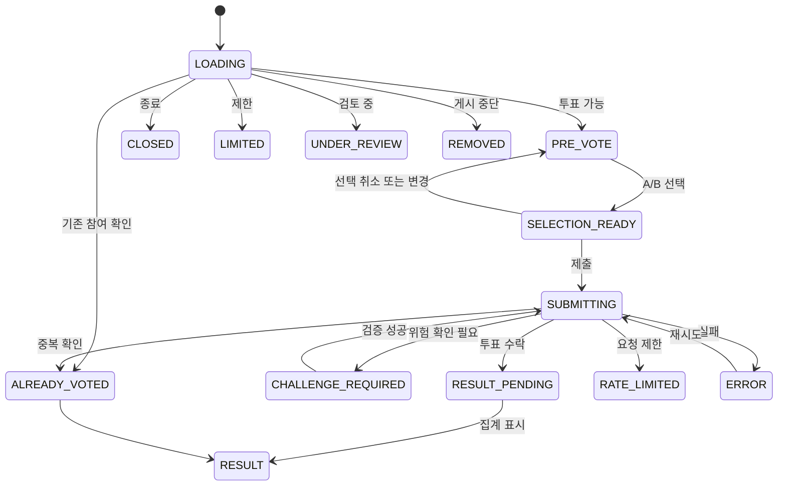

# WHICH 핵심 UX 및 사용자 여정 v2.0

- **문서 상태:** 상세 기획 검토본
- **버전:** 2.0
- **기준일:** 2026-08-17
- **기준 문서:**
  - `02_CORE_UX_AND_USER_JOURNEYS.md` v1
  - `01_PRODUCT_VISION_AND_PRINCIPLES_v2.md`
  - `05_IDENTITY_AND_VOTE_INTEGRITY.md`
  - `06_INTEREST_ONBOARDING_AND_PERSONALIZATION.md`
  - `07_RECOMMENDATION_AND_ML_ARCHITECTURE.md`
  - `08_SOCIAL_AND_COMMUNITY.md`
  - `09_MODERATION_AND_GOVERNANCE.md`
  - `10_METRICS_ANALYTICS_AND_EXPERIMENTS.md`
  - `13_GLOSSARY_AND_STATUS_MODEL.md`
- **문서 목적:** WHICH의 진입 경로별 사용자 여정, 핵심 화면 상태, 투표 전후 상호작용, 관심사 온보딩, 로그인 전환, 댓글·공유·다음 이슈 흐름, 모바일·데스크톱 UX 계약과 예외 처리를 정의한다.
- **문서 비범위:** 최종 시각 디자인, 브랜드 아이덴티티, 디자인 토큰, API·DB 상세 스키마, 추천 모델 구현, 법률 검토 결과, 운영자 콘솔의 세부 화면은 다른 문서에서 다룬다.

---

## 0. 결정 상태 표기

| 표기 | 의미 |
|---|---|
| **[확정]** | 후속 화면 설계와 구현의 기본 전제로 사용한다. |
| **[설계 기준]** | 원칙은 채택하되 세부 UI와 수치는 사용성 검증을 통해 조정할 수 있다. |
| **[초기안]** | 프로토타입 또는 출시 초기 실험을 위한 가설이다. |
| **[미정]** | 별도의 명시적 의사결정이 필요하다. |
| **[금지]** | 제품 가치, 신뢰, 안전 또는 개인정보 원칙을 해치므로 채택하지 않는다. |

### 0.1 v2 주요 보강 내용

| 영역 | v1 | v2 보강 내용 |
|---|---|---|
| 핵심 흐름 | 투표 → 결과 → 댓글 → 다음 이슈 | 가치 도달 시점, 화면 전환 조건, 상태 연속성, 성공·실패 기준 추가 |
| 진입 경로 | SNS 딥링크와 홈 | 검색·공유·알림·카테고리·작성자 등 진입별 UX 계약 확장 |
| 상태 모델 | 주요 5개 상태 | 로딩·검증·제한·오프라인·삭제·결과 지연 등 전체 상태 머신 구체화 |
| 관심사 | 3개 이상 선택 | Guest·Member별 진입 시점, 건너뛰기, 저장·병합·수정 흐름 추가 |
| 로그인 | 3~5회 후 제안 | 기능별 Just-in-time 인증, 익명 기록 병합, 취소·복귀 흐름 추가 |
| 결과 | A/B 비율과 피드백 | 저표본, 반올림, 검토 중, 비대표성, 결과 갱신 원칙 추가 |
| 댓글 | A/B 탭 | 읽기·작성·정렬·빈 상태·제한·정치 댓글 흐름 구체화 |
| 피드 | 모바일 세로 피드 | 스와이프 충돌, 브라우저 이력, 상태 복원, 프리패치, 세션 큐 정의 |
| 반응형 | 모바일/데스크톱 개요 | 화면별 정보 우선순위와 입력 방식 계약 추가 |
| 신뢰 UX | 제한 상태 안내 | 정치·고위험·출처·신고·집계 신뢰 표시 원칙 통합 |
| 측정 | 완료 기준 | 이벤트 정의, 노출 기준, 주요 퍼널, UX 실험과 가드레일 추가 |

---

# 1. UX의 역할과 핵심 약속

## 1.1 UX 한 줄 목표

**[확정]** WHICH의 핵심 UX 목표는 다음과 같다.

> 사용자가 특정 질문을 이해하고 가입 없이 한 번 선택한 뒤, 결과와 양쪽 이유를 확인하고 다음 질문까지 자연스럽게 이어지게 한다.

## 1.2 핵심 사용자 루프

```text
질문 이해
→ A/B 선택
→ 투표 집계
→ 결과 공개
→ 같은 선택과 다른 선택의 이유 확인
→ 다음 이슈 이동
→ 반복 참여
```

**[확정]** 투표 직후 자동으로 다음 이슈로 이동하지 않는다. 결과는 투표의 즉시 보상이며, 사용자가 직접 다음 행동을 선택해야 한다.

## 1.3 첫 가치 도달 시점

WHICH에서 사용자가 처음 체감하는 가치는 단순 페이지 열람이 아니라 다음 순간이다.

```text
첫 정상 투표 성공
+
첫 결과 확인
```

이를 `First Value Moment`로 정의한다.

### First Value Moment 이전에 허용되는 필수 요소

- 질문과 선택지
- 필요한 최소 배경
- 필요한 출처
- 투표 처리 상태
- 안전 또는 법적 필수 고지

### First Value Moment 이전에 기본적으로 노출하지 않을 요소

- 강제 회원가입
- 긴 서비스 소개
- 프로필 완성 요구
- 관심사 선택 강제
- 알림 권한 요청
- Creator 홍보
- 전면 광고
- 복잡한 튜토리얼

## 1.4 UX 우선순위

기능이나 화면 요소가 충돌할 때 다음 순서로 판단한다.

```text
1. 안전과 신뢰
2. 질문과 선택지의 이해
3. 투표 성공 가능성
4. 결과 보상의 명확성
5. 다음 이슈로의 연속성
6. 댓글과 공유
7. 가입·팔로우·프로필 전환
8. 부가 기능과 수익화
```

## 1.5 UX에서 하지 않을 것

- **[금지]** 첫 방문을 회원가입 화면으로 가로막지 않는다.
- **[금지]** 결과를 보기 위해 광고 시청이나 추가 행동을 강제하지 않는다.
- **[금지]** 사용자가 선택하지 않은 A/B를 시각적으로 더 유리하게 보이게 하지 않는다.
- **[금지]** 투표 성공 전에 자동으로 다음 이슈를 보여주지 않는다.
- **[금지]** 사용자의 전체 투표 성향을 공개 프로필에 노출하지 않는다.
- **[금지]** 정치·선거 결과를 대표 여론처럼 표현하지 않는다.
- **[금지]** 무한 스크롤을 이유로 브라우저 뒤로 가기와 독립 URL을 훼손하지 않는다.

---

# 2. UX 구조와 사용자 단계

## 2.1 경험 계층

WHICH의 사용자 경험은 다음 여섯 계층으로 나눈다.

```text
1. Acquisition Layer
   외부 SNS, 검색, 공유, 알림

2. Issue Consumption Layer
   질문, A/B, 결과, 다음 이슈

3. Context Layer
   배경, 출처, 카테고리, 작성자

4. Community Layer
   댓글, 공감, 답글, 신고

5. Member Layer
   관심사, 기록, 팔로우, 프로필, 알림

6. Creation & Governance Layer
   이슈 작성, 검수, 상태 확인, 운영 조치
```

핵심 소비 경험은 `Issue Consumption Layer`이며, 나머지 계층은 이를 방해하지 않고 보조해야 한다.

## 2.2 사용자 역할

| 역할 | 핵심 목적 | 기본 UX 우선순위 |
|---|---|---|
| Guest | 빠르게 투표하고 결과 확인 | 마찰 최소화 |
| Returning Guest | 이전 참여를 이어서 소비 | 익명 상태 복원 |
| Member | 기록 보존과 커뮤니티 참여 | 동기화와 개인화 |
| Verified Member | 고위험 기능 참여 | 신뢰와 명확한 인증 |
| Creator | 좋은 질문 생성과 성과 확인 | 작성·검수 상태의 투명성 |
| Editorial Operator | 초기 Issue Pool 공급 | 후보 검토와 게시 효율 |
| Moderator | 위험·신고·조작 대응 | 근거와 감사 가능성 |

## 2.3 사용자 생애주기

```text
유입
→ 첫 이슈 이해
→ 첫 투표
→ 첫 결과
→ 두 번째 이슈
→ 반복 세션
→ 관심사 선택
→ 회원 전환
→ 댓글·팔로우
→ 이슈 생성
→ 재방문
```

모든 사용자가 전 단계를 거칠 필요는 없다. WHICH는 `첫 투표 → 첫 결과 → 다음 이슈`만으로도 완결된 Guest 경험을 제공해야 한다.

## 2.4 핵심 퍼널

```text
ISSUE_VIEWABLE_IMPRESSION
→ PRE_VOTE_READY
→ VOTE_SUBMIT
→ VOTE_ACCEPTED
→ RESULT_VIEW
→ NEXT_ISSUE
→ SECOND_VOTE_ACCEPTED
```

MVP의 가장 중요한 이탈 지점은 다음 세 곳이다.

1. 질문을 봤지만 투표하지 않음
2. 투표했지만 결과를 충분히 보지 않음
3. 결과를 봤지만 다음 이슈로 이동하지 않음

---

# 3. 진입 경로별 UX 계약

## 3.1 진입 경로 개요

| 진입 경로 | 사용자의 주된 의도 | 첫 화면 | 기본 CTA |
|---|---|---|---|
| 외부 SNS 이슈 링크 | 특정 질문 참여 | 해당 Issue의 PRE_VOTE | A 또는 B |
| 결과 공유 카드 | 다른 사람 결과 확인 | 해당 Issue의 PRE_VOTE | 직접 선택 |
| 홈 직접 진입 | 서비스 탐색 | For You 또는 초기 추천 피드 | 첫 이슈 투표 |
| 검색·SEO | 특정 주제 확인 | Issue 상세 또는 검색 결과 | 투표 또는 Issue 열기 |
| 카테고리 링크 | 주제 탐색 | 카테고리 피드 | 첫 이슈 투표 |
| 알림 | 후속 행동 | 알림 대상 Issue/댓글/성과 | 문맥별 CTA |
| 작성자 프로필 | 질문 작성자 탐색 | 공개 Creator Profile | 이슈 열기·팔로우 |
| 내부 다음 이슈 | 연속 참여 | 추천된 다음 Issue | A 또는 B |

## 3.2 공통 진입 원칙

- 독립 Issue URL을 유지한다.
- 외부 진입 시 유입 대상 이슈를 다른 홈 화면으로 우회시키지 않는다.
- 로그인되지 않았다는 이유만으로 일반 Issue의 투표를 막지 않는다.
- 사용자가 이미 투표한 Issue라면 기존 선택과 최신 결과를 보여준다.
- 삭제·제한·검토 상태라면 이유 범주와 가능한 다음 행동을 제공한다.
- 유입 출처는 내부 분석에 기록하되 사용자 화면을 불필요하게 복잡하게 하지 않는다.

## 3.3 외부 SNS 딥링크

**[확정]** 외부 SNS에서 들어온 사용자는 WHICH를 탐색하러 온 것이 아니라 특정 질문에 반응해 들어온다.

```text
SNS 게시물
→ /issue/:id
→ 질문과 A/B
→ 투표
→ 결과
→ 댓글 또는 다음 이슈
```

### 첫 화면 필수 요소

1. 카테고리 또는 주제
2. 질문
3. 선택지 A
4. 선택지 B
5. 필요한 경우에만 배경·출처 진입
6. 신고 또는 더보기 진입

### 첫 화면에서 최소화할 요소

- 전체 메뉴
- 작성자 프로필 강조
- 댓글 본문
- 결과 비율
- 가입 제안
- 알림 권한
- 추천 이슈 목록

### 딥링크 상태 연속성

사용자가 투표한 뒤 새로고침하거나 브라우저를 닫았다가 다시 열어도 가능한 범위에서 다음을 복원한다.

- 해당 Issue에서 선택한 A/B
- 결과 상태
- 익명 식별자
- 유입 세션
- 마지막으로 본 이슈

## 3.4 결과 공유 카드 진입

공유 카드에는 A/B 결과가 보일 수 있지만, 링크를 눌러 WHICH에 들어온 신규 사용자는 자신의 선택을 먼저 하게 한다.

**[설계 기준]** 외부 미리보기에서 본 비율 때문에 결과 숨김 원칙이 완전히 보장되지는 않는다. 따라서 공유 카드와 서비스 본문은 다음을 구분한다.

- 공유자의 참여 결과 표현
- 신규 방문자의 투표 화면

신규 방문자는 기존 공유자의 선택을 그대로 복제하는 버튼이 아니라 자신의 A/B 선택지를 본다.

## 3.5 홈 직접 진입

홈 직접 진입자는 서비스 탐색 의도가 상대적으로 높다.

### 로그인 회원

```text
/
→ For You
→ 개인화된 첫 Issue
```

### 관심사 미설정 회원

```text
/
→ 관심사 선택 제안 또는 혼합 피드
→ 사용자가 건너뛰면 일반 추천 유지
```

### 신규 Guest

```text
/
→ 전체 인기·최신·탐색을 혼합한 초기 피드
→ 첫 투표
```

**[확정]** 홈에서도 제목 목록만 보여주는 대신 카드 안에서 바로 투표할 수 있어야 한다.

## 3.6 검색·SEO 진입

**[설계 기준]** 검색 결과로 유입된 사용자는 질문의 맥락을 확인하려는 의도가 더 강할 수 있다.

따라서 다음을 허용한다.

- 질문과 선택지 우선 노출
- 배경·출처 접근성 강화
- 현재 상태 표시
- 투표 후 관련 주제의 다음 이슈 제공

검색 스니펫이나 메타 설명에서 결과를 노출할지 여부는 SEO 정책과 함께 별도 결정한다.

## 3.7 알림 진입

알림은 알림 목적에 맞는 정확한 위치로 이동한다.

| 알림 유형 | 이동 위치 |
|---|---|
| 내 댓글에 답글 | 해당 답글이 보이는 댓글 문맥 |
| 팔로우한 Creator의 신규 이슈 | 신규 Issue PRE_VOTE |
| 내 이슈 성과 달성 | Creator 성과 화면 |
| 관심 주제 급상승 | 해당 Issue 또는 주제 피드 |
| 운영 조치 | 이슈 상태와 사유 화면 |

**[금지]** 알림 클릭을 무관한 홈이나 광고 화면으로 우회하지 않는다.

---

# 4. 정보 구조와 내비게이션

## 4.1 주요 공개 정보 구조

```text
/
├─ For You
├─ 인기
├─ 논쟁
├─ 최신
└─ 향후 팔로잉

/issue/:id
/category/:slug
/search
/user/:handle
```

## 4.2 회원 정보 구조

```text
/me
├─ votes
├─ issues
├─ comments
├─ interests
├─ following
├─ notifications
└─ settings

/create
/create/draft/:id
```

## 4.3 인증·검증 정보 구조

```text
/auth
/auth/callback
/verify
/verify/status
```

## 4.4 운영 정보 구조

운영자 화면의 세부 UX는 운영 문서에서 확정한다.

```text
/admin/candidates
/admin/moderation
/admin/reports
/admin/integrity
/admin/sources
/admin/analytics
```

## 4.5 모바일 전역 내비게이션

**[초기안]** 모바일 하단 내비게이션은 최대 4~5개 주요 항목으로 제한한다.

후보:

```text
홈
탐색
만들기
알림
내 정보
```

Guest에게는 회원 전용 항목을 숨기거나, 선택 시 기능 가치를 설명한 뒤 인증으로 연결한다.

## 4.6 데스크톱 전역 내비게이션

데스크톱은 좌측 탐색 영역을 사용할 수 있다.

```text
For You
인기
논쟁
최신
카테고리
만들기
알림
내 정보
```

좌측 내비게이션은 중앙 Issue 소비 영역보다 시각적 우선순위가 낮아야 한다.

## 4.7 브라우저 이력과 URL

**[확정]** 피드형 UX를 사용하더라도 각 Issue는 독립 URL을 가진다.

다음 동작을 보장한다.

- 다음 이슈 이동 시 URL 갱신
- 뒤로 가기 시 이전 Issue와 이전 상태 복원
- 새 탭 열기 가능
- 링크 복사 시 현재 Issue를 가리킴
- 새로고침 시 현재 Issue 유지
- 공유 시 피드 위치가 아니라 Issue URL 전달

---

# 5. Issue 화면의 정보 계층

## 5.1 Issue 화면의 기본 영역

```text
1. 상태·분류 영역
2. 질문 영역
3. 배경·출처 영역
4. 선택지 영역
5. 투표 처리 영역
6. 결과 영역
7. 댓글 진입·미리보기
8. 공유·신고·기타 행동
9. 다음 이슈 진입
```

모든 영역이 동시에 보일 필요는 없다. 화면 상태에 따라 필요한 영역만 확장한다.

## 5.2 질문 영역

질문은 화면에서 가장 높은 정보 우선순위를 가진다.

### 질문 작성·표시 원칙

- 하나의 논점만 묻는다.
- 질문과 선택지의 의미가 중복되지 않는다.
- 특정 답을 유도하는 수식어를 피한다.
- 배경을 읽지 않아도 핵심 판단 대상을 파악할 수 있게 한다.
- 배경 없이는 오해가 큰 질문은 배경 진입을 명확하게 제공한다.

### 길이 원칙

**[초기안]** 모바일 첫 화면에서 질문이 지나치게 긴 경우 다음 순서로 대응한다.

1. 편집 단계에서 질문을 축약한다.
2. 핵심 질문과 배경을 분리한다.
3. 읽기 확장 기능을 제공한다.
4. 버튼을 화면 밖으로 밀어내는 과도한 본문은 승인하지 않는다.

고정 글자 수는 실제 한글 줄바꿈과 접근성 확대 테스트 후 결정한다.

## 5.3 선택지 영역

### 필수 원칙

- A와 B를 동일한 크기와 시각적 강도로 보여준다.
- 기본 상태에서 어느 한쪽에도 브랜드 강조색을 독점적으로 사용하지 않는다.
- 순서는 시스템 또는 운영 정책에 따라 고정하되, 편향 검토가 필요하다.
- 선택지 전체 영역을 클릭·탭할 수 있게 한다.
- 선택지 텍스트 외에 불필요한 선동성 이미지나 아이콘을 사용하지 않는다.

### A/B 표기

`A`, `B`는 구분 수단이지 의미 자체가 아니다. 보조기술 사용자를 위해 버튼 이름에는 선택지 전체 문구를 포함한다.

## 5.4 배경·출처 영역

배경과 출처는 투표 결과와 달리 숨기지 않는다.

### 표시 수준

| 상황 | 표시 방식 |
|---|---|
| 순수 선호형 | 배경 없이 질문만 가능 |
| 맥락 필요 | 짧은 배경 요약 + 펼치기 |
| 사실 기반 시사형 | 배경 요약 + 출처 링크 |
| 고위험·정치 | 출처와 비대표성 고지 강화 |

### 출처 행동

- 외부 링크임을 명확히 표시한다.
- 링크 열기는 현재 선택 상태를 잃지 않아야 한다.
- 새 탭 또는 인앱 브라우저 정책은 구현 단계에서 결정한다.
- 출처가 정정·삭제된 경우 Issue 상태를 표시한다.

## 5.5 작성자 정보

**[확정]** 질문이 사람보다 먼저 보여야 한다.

작성자 정보는 다음 경우에 보조적으로 제공한다.

- 사용자 생성 Issue
- 공식·운영자 작성 구분
- 작성자 프로필 진입
- 신고·책임 소재 확인

팔로워 수나 작성자 인기 때문에 질문이 과도하게 신뢰받지 않도록 시각적 비중을 제한한다.

## 5.6 보조 메타데이터

후보:

- 카테고리
- 게시 시점
- 출처 유무
- 운영자 작성 여부
- 검토·제한 상태
- 댓글 수

투표 전에는 결과 비율과 총 투표 수를 숨긴다. 댓글 수 노출이 결과 방향을 암시하는지 실험으로 확인한다.

---

# 6. Issue 상태 머신

## 6.1 상태 목록

| 상태 | 의미 | 사용자 주요 행동 |
|---|---|---|
| `LOADING` | Issue와 사용자 상태 불러오는 중 | 대기·이탈 |
| `PRE_VOTE` | 투표 가능, 결과 비공개 | A/B 선택, 배경 확인 |
| `SELECTION_READY` | 선택했으나 서버 제출 전 | 제출·선택 변경 |
| `SUBMITTING` | 투표 요청 처리 중 | 중복 입력 방지 |
| `CHALLENGE_REQUIRED` | 위험 기반 추가 확인 필요 | 검증 수행·취소 |
| `RESULT_PENDING` | 투표 수락, 결과 집계 준비 중 | 짧은 대기 |
| `RESULT` | 결과 표시 가능 | 댓글·공유·다음 이슈 |
| `ALREADY_VOTED` | 기존 참여 확인 | 기존 선택·결과 확인 |
| `AUTH_REQUIRED` | 특정 기능에 인증 필요 | 로그인·취소 |
| `VERIFICATION_REQUIRED` | 고위험 기능에 추가 인증 필요 | 인증·취소 |
| `RATE_LIMITED` | 요청 빈도 제한 | 재시도 시점 확인 |
| `CLOSED` | 투표 종료 | 결과 확인 또는 안내 |
| `LIMITED` | 일부 기능 제한 | 허용된 범위 확인 |
| `UNDER_REVIEW` | 안전·무결성 검토 중 | 안내·다른 이슈 이동 |
| `RESULT_LOCKED` | 결과 공개 잠금 | 사유 확인·다음 이슈 |
| `REMOVED` | 게시 중단·삭제 | 사유 범주·다음 이슈 |
| `OFFLINE` | 네트워크 단절 | 재시도·저장된 화면 확인 |
| `ERROR` | 복구되지 않은 오류 | 재시도·신고 |

## 6.2 기본 상태 전이



## 6.3 선택과 제출 방식

**[미정]** A/B 버튼을 누르는 즉시 서버 제출할지, 선택 후 별도 `투표하기` 버튼을 누르게 할지는 프로토타입으로 검증한다.

### 즉시 제출 장점

- 한 번의 탭으로 빠르게 완료
- 외부 유입에 적합
- 핵심 루프가 짧음

### 확인 제출 장점

- 오투표 감소
- 선택 전환 가능
- 민감 이슈에서 숙고 유도

### 초기 설계 방향

**[초기안]** LOW·MEDIUM 일반 이슈는 버튼 탭 즉시 제출하고, HIGH·RESTRICTED 이슈는 별도 확인 또는 인증을 둘 수 있다.

## 6.4 투표 변경 정책

**[미정]** 정상 집계된 투표를 사용자가 변경할 수 있는지 결정이 필요하다.

UX는 다음 가능성을 수용하도록 상태를 분리한다.

- 변경 불가: 기존 선택과 결과만 표시
- 일정 시간 내 1회 변경
- 투표 종료 전 변경 가능, 최종 선택만 집계

정책 확정 전 화면 문구와 API 계약을 고정하지 않는다.

## 6.5 로딩 상태

- 질문 영역과 버튼 위치가 크게 이동하지 않도록 스켈레톤을 사용한다.
- 결과 비율처럼 오해를 줄 수 있는 가짜 수치는 표시하지 않는다.
- 로딩이 길어지면 재시도 또는 네트워크 안내를 제공한다.
- 이미 캐시된 Issue 본문은 보여주되 투표 가능 여부가 확인되기 전 버튼 상태를 명확히 한다.

## 6.6 제출 상태

- 선택한 버튼을 유지한다.
- 다른 선택지와 중복 클릭을 잠시 막는다.
- 화면 전체를 막는 전면 로더보다 버튼 내부 진행 상태를 우선한다.
- 네트워크 실패 시 사용자의 선택을 보존한다.
- 성공 여부가 불명확하면 무조건 재투표시키지 않고 서버 상태를 재확인한다.

---

# 7. 핵심 여정 A — 외부 SNS에서 첫 투표

## 7.1 목표

사용자가 서비스 설명이나 가입 없이 특정 Issue에 정상 투표하고 결과를 확인한다.

## 7.2 단계별 여정

| 단계 | 사용자 생각 | 화면·시스템 행동 | 핵심 이벤트 | 실패 위험 |
|---|---|---|---|---|
| 링크 클릭 | “다른 사람들은 어떻게 생각하지?” | 해당 Issue 직접 로드 | `ISSUE_OPEN` | 홈으로 잘못 이동 |
| 질문 확인 | “무엇을 고르면 되지?” | 질문·A/B 우선 표시 | `PRE_VOTE_READY` | 질문 불명확 |
| 배경 확인 | “맥락이 필요한가?” | 배경·출처 펼치기 | `BACKGROUND_OPEN` | 원문 이탈 후 상태 소실 |
| 선택 | “나는 A/B다” | 선택 즉시 피드백 | `VOTE_SELECT` | 오탭·버튼 편향 |
| 제출 | “처리됐나?” | 중복 방지와 진행 표시 | `VOTE_SUBMIT` | 응답 지연·중복 |
| 결과 | “다른 사람들은?” | 결과·개인 피드백 | `VOTE_ACCEPTED`, `RESULT_VIEW` | 결과 지연·오해 |
| 후속 행동 | “왜 그렇게 골랐지?” | 댓글·공유·다음 | `COMMENT_OPEN` 등 | 다음 행동 불명확 |
| 두 번째 이슈 | “하나 더 해볼까?” | 추천 Issue 로드 | `NEXT_ISSUE` | 피드 단절 |

## 7.3 첫 화면 와이어 구조

```text
┌────────────────────────────┐
│ 직장 · 출처 있음       ⋯   │
│                            │
│ 퇴근 후 업무 메신저에      │
│ 응답하는 것도 업무인가?    │
│                            │
│ 배경과 출처 보기            │
│                            │
│ ┌────────────────────────┐ │
│ │ A. 그렇다             │ │
│ └────────────────────────┘ │
│                            │
│ ┌────────────────────────┐ │
│ │ B. 아니다             │ │
│ └────────────────────────┘ │
│                            │
│ 댓글 381 · 공유            │
└────────────────────────────┘
```

댓글 수는 표시할 수 있으나 결과를 암시하거나 투표 버튼보다 강조하지 않는다.

## 7.4 First Value Moment 완료 조건

다음 조건을 모두 만족하면 첫 가치 도달로 본다.

1. Issue가 사용자 화면에 정상 노출됨
2. 사용자 A/B 제출 성공
3. 투표가 `ACCEPTED` 또는 정책상 정상 상태로 처리됨
4. 결과 화면이 표시됨
5. 사용자가 자신의 선택을 확인할 수 있음

## 7.5 투표 후 화면

```text
┌────────────────────────────┐
│ 퇴근 후 업무 메신저에      │
│ 응답하는 것도 업무인가?    │
│                            │
│ A. 그렇다   64%            │
│ ████████████████           │
│                            │
│ B. 아니다   36%            │
│ █████████                  │
│                            │
│ 정상 집계 14,821표          │
│ 당신은 64%와 같은 선택입니다│
│                            │
│ [댓글 보기]  [결과 공유]   │
│                            │
│ 다음 이슈 ↓                 │
└────────────────────────────┘
```

## 7.6 딥링크 세션의 가입 제안

**[확정]** 첫 투표 직후 가입을 필수로 요구하지 않는다.

가입 제안은 다음 중 하나의 가치가 발생했을 때 보여줄 수 있다.

- 여러 개의 투표 기록을 저장하려 할 때
- 댓글을 작성하려 할 때
- 작성자를 팔로우하려 할 때
- 이슈를 생성하려 할 때
- 세션 내 충분한 참여가 발생했을 때

정확한 노출 시점은 실험한다.

---

# 8. 핵심 여정 B — 홈에서 연속 소비

## 8.1 목표

사용자가 홈에서 첫 Issue를 투표하고 여러 Issue를 연속 소비한다.

## 8.2 홈의 기본 피드

초기 탭:

```text
For You
인기
논쟁
최신
```

향후:

```text
팔로잉
카테고리
```

## 8.3 For You 상태별 시작

| 사용자 상태 | 초기 후보 구성 | 상단 UX |
|---|---|---|
| 신규 Guest | 인기·최신·탐색 혼합 | 서비스 설명 최소화 |
| 관심사 선택 Guest | 선택 관심사 + 탐색 | 관심사 수정 진입 |
| 신규 Member | 온보딩 관심사 중심 | 선택 완료 후 바로 피드 |
| 기존 Member | 행동·관심·트렌드 혼합 | 추천 재설정 진입 |
| 추천 데이터 오류 | 인기·최신 폴백 | 오류를 과장하지 않음 |

## 8.4 홈 카드와 상세 화면의 관계

**[설계 기준]** 홈 카드에서도 즉시 투표할 수 있지만, 각 카드의 현재 URL은 해당 Issue를 가리켜야 한다.

두 가지 구현 패턴이 가능하다.

1. 전체 화면 피드 안에서 카드 상태 전환
2. 카드 탭 시 독립 Issue 화면으로 진입

모바일 핵심 경험은 1번을 우선 검토하고, 데스크톱에서는 중앙 상세 영역을 유지할 수 있다.

## 8.5 탭 전환

- 탭별 스크롤·현재 Issue 위치를 세션 동안 보존한다.
- `For You → 논쟁 → For You`로 돌아오면 이전 위치를 복원한다.
- 같은 Issue가 여러 탭에 포함돼도 이미 투표한 상태를 공유한다.
- 탭 전환 자체를 `SKIP`으로 기록하지 않는다.
- 피드별 추천 요청과 노출을 구분해 기록한다.

## 8.6 빈 상태

| 상태 | 메시지 목적 | 다음 행동 |
|---|---|---|
| 관심사 후보 부족 | 선택 범위를 넓힐 수 있음을 설명 | 전체 인기 보기 |
| 최신 이슈 없음 | 오류가 아니라 일시적 부족임을 설명 | 인기 보기 |
| 카테고리 비어 있음 | 해당 주제 공급 부족 표시 | 다른 카테고리 |
| 모두 본 상태 | 반복 노출보다 세션 종료를 존중 | 새로고침·다른 탭 |
| 추천 실패 | 개인화 없이도 서비스 사용 가능 | 인기 폴백 |

**[금지]** 후보가 없는데 같은 Issue를 무한 반복하거나 빈 화면으로 남기지 않는다.

---

# 9. 관심사 온보딩 UX

## 9.1 목적

관심사 온보딩은 가입 절차를 늘리는 설문이 아니라 추천의 Cold Start를 해결하는 짧은 선택 경험이다.

## 9.2 기본 원칙

- **[확정]** 관심 주제 3개 이상 선택을 기본 구조로 사용한다.
- **[확정]** 외부 딥링크 첫 투표를 관심사 온보딩으로 가로막지 않는다.
- **[설계 기준]** 사용자는 나중에 관심사를 수정·재설정할 수 있다.
- **[설계 기준]** 실제 행동 데이터가 쌓이면 명시적 선택보다 행동 신호의 비중이 커질 수 있다.
- **[금지]** 사용자가 선택한 A/B 방향을 정치·이념 관심사로 직접 변환하지 않는다.

## 9.3 회원 온보딩 흐름

```text
가입 완료
→ 관심 주제 안내
→ 3개 이상 선택
→ 선택 완료
→ For You 첫 피드
```

### 화면 구성

```text
어떤 이야기에 관심이 있나요?
관심 있는 주제를 3개 이상 선택해 주세요.

[ 연애 ]      [ 직장 ]
[ 음식 ]      [ IT·테크 ]
[ 스포츠 ]    [ 게임 ]
[ 영화·드라마 ] [ 경제 ]
[ 소비 ]      [ 교육 ]
[ 사회 ]      [ 생활 ]

선택 2/3
[선택 완료]
[나중에 하기]
```

`나중에 하기` 허용 여부는 가입 전환율과 추천 품질을 함께 보고 결정한다. 강제하더라도 외부 딥링크의 첫 투표 후에만 적용한다.

## 9.4 Guest 온보딩 흐름

```text
몇 차례 정상 투표
→ 개인화 가치 제안
→ 관심 주제 선택
→ 익명 관심사 저장
→ 다음 피드부터 반영
```

### 제안 문구 원칙

- “설문을 완료하세요”보다 추천 가치 설명
- 개인화가 선택 사항임을 명확히 함
- 건너뛰어도 일반 피드를 계속 제공

예:

> 관심 주제를 고르면 다음 질문을 더 잘 맞춰드릴 수 있습니다.

## 9.5 선택 상태

- 미선택
- 선택됨
- 최소 수 미달
- 완료 가능
- 저장 중
- 저장 실패
- 이미 설정됨

저장 실패 시 사용자가 고른 항목을 화면에서 잃지 않는다.

## 9.6 관심사 계층

### 초기

대분류 중심으로 단순하게 제공한다.

```text
생활
인간관계
직장·커리어
문화·엔터테인먼트
IT·테크
스포츠
교육
경제·소비
사회
```

### 향후

대분류를 선택한 뒤 하위 주제를 선택할 수 있다.

```text
IT·테크
├─ AI
├─ 스마트폰
├─ 게임
├─ 개발
├─ SNS
└─ 모빌리티
```

초기 온보딩에서 너무 많은 하위 항목을 강제하지 않는다.

## 9.7 관심사 수정·추천 재설정

설정에서 다음을 제공한다.

- 관심 주제 추가·삭제
- 추천 재설정
- `관심 없음` 기록 관리 후보
- 팔로우 Topic 확인

추천 재설정은 투표 기록 삭제와 동일하지 않다는 점을 설명한다.

## 9.8 Guest에서 Member로 전환할 때 병합

로그인 전 익명 관심사와 로그인 계정 관심사가 충돌할 수 있다.

**[초기안]** 다음 병합 정책을 검토한다.

1. 기존 회원 관심사를 유지
2. Guest에서 새로 선택한 관심사를 추가 후보로 제안
3. 사용자에게 최종 선택 화면 제공

자동으로 덮어써 사용자의 기존 설정을 잃지 않는다.

---

# 10. 회원가입과 인증 전환 UX

## 10.1 원칙

**[확정]** 회원가입은 첫 가치 도달 전 장벽이 아니라, 가치가 발생한 뒤 기록·참여를 확장하는 도구다.

## 10.2 Just-in-time 인증 트리거

| 행동 | 인증 필요 여부 | 로그인 전 설명할 가치 |
|---|---:|---|
| 일반 Issue 투표 | 아니오 | 해당 없음 |
| 결과 확인 | 아니오 | 해당 없음 |
| 댓글 읽기 | 아니오 | 해당 없음 |
| 결과 공유 | 아니오 | 선택 저장은 별도 |
| 댓글 작성 | 예 | 의견 작성·답글 알림 |
| 공감 | 초기 정책에 따라 | 반응 동기화 |
| Creator 팔로우 | 예 | 새 이슈 알림·동기화 |
| 투표 기록 영구 저장 | 예 | 기기 간 기록 유지 |
| 이슈 생성 | 예 | 작성·성과 관리 |
| 정치·Restricted 투표 | Verified 정책 | 무결성 강화 |

## 10.3 가입 제안 유형

### 기록 보존형

> 지금까지 참여한 이슈를 저장하고 다른 기기에서도 이어보세요.

### 댓글 작성형

> 댓글을 남기려면 계정이 필요합니다. 로그인 후 지금 작성한 내용을 이어서 등록합니다.

### 팔로우형

> 이 작성자의 새 질문을 보려면 로그인하세요.

### Creator형

> 질문을 등록하고 투표·댓글 성과를 확인하려면 계정이 필요합니다.

## 10.4 인증 중 상태 보존

로그인으로 이동하기 전 다음 문맥을 보존한다.

- 현재 Issue ID
- 현재 피드와 위치
- 기존 투표 선택
- 작성 중 댓글
- 팔로우 대상
- 생성 중인 Issue Draft
- 유입 출처

로그인 완료 후 사용자가 원래 하려던 행동으로 복귀시킨다.

**[금지]** 로그인 성공 후 무조건 홈 첫 화면으로 보내 문맥을 잃게 하지 않는다.

## 10.5 인증 취소

- 취소하면 원래 화면으로 돌아간다.
- 일반 투표·결과 읽기는 계속 가능하다.
- 작성 중 댓글은 세션 동안 보존할 수 있다.
- 반복적으로 즉시 같은 가입 팝업을 다시 띄우지 않는다.

## 10.6 익명 투표 기록 병합

Guest가 로그인하면 해당 브라우저의 익명 기록을 계정과 연결할 수 있다.

### 병합 UX에서 설명할 내용

- 어떤 기록이 저장되는지
- 기존 계정 기록과 어떻게 합쳐지는지
- 다른 사람에게 공개되지 않는다는 점
- 병합하지 않고 계속할 수 있는지

**[설계 기준]** 전체 투표 기록은 본인 전용이며 기본 공개하지 않는다.

## 10.7 Verification UX

정치·선거 등 Restricted 기능에 추가 인증이 필요한 경우:

```text
Restricted Issue 진입
→ 투표 가능 조건 설명
→ 본인 인증 시작
→ 성공·실패·취소
→ 원래 Issue로 복귀
```

인증 목적을 “당신의 정치 성향 확인”이 아니라 “조직적 중복 참여 방지”로 설명한다.

---

# 11. 투표 결과 UX

## 11.1 결과 화면의 역할

결과 화면은 다음 질문에 답해야 한다.

1. A와 B는 각각 어느 정도 선택됐는가?
2. 전체 정상 참여 수는 얼마인가?
3. 내가 고른 것은 무엇인가?
4. 나는 어느 비율과 같은 선택을 했는가?
5. 이 결과를 어느 정도로 해석해야 하는가?
6. 다음에 무엇을 할 수 있는가?

## 11.2 결과 표시 요소

필수:

- A/B 문구
- A/B 비율
- 사용자의 선택 강조
- 정상 집계된 총 참여 수
- 개인 결과 피드백
- 댓글 진입
- 다음 이슈

조건부:

- 집계 기준 안내
- 최신 갱신 시점
- 저표본 안내
- 검토 중 안내
- 비대표성 고지
- 출처 정정 안내

## 11.3 비율과 반올림

**[설계 기준]** A와 B의 표시 비율 합계가 시각적으로 100%가 되도록 반올림 규칙을 일관되게 적용한다.

- 계산 원본과 표시값을 구분한다.
- 한쪽이 0표여도 오해 없는 방식으로 표시한다.
- 애니메이션 중간값을 실제 결과처럼 읽히게 하지 않는다.
- 총 참여 수는 정상 집계 상태를 기준으로 한다.

정확한 소수점 자리수는 사용자 테스트 후 확정한다.

## 11.4 개인 결과 피드백

예:

- “당신은 64%와 같은 선택을 했습니다.”
- “당신과 같은 선택은 36%입니다.”
- “현재 두 의견이 매우 가깝습니다.”

**[설계 기준]** `다수`, `소수` 문구가 조롱이나 정답 판정처럼 느껴지지 않게 중립적으로 표현한다.

**[금지]** “정답을 골랐습니다”, “틀린 선택입니다”처럼 가치 판단을 부여하지 않는다.

## 11.5 저표본 상태

초기 참여 수가 적을 때는 비율의 안정성이 낮다.

**[초기안]** 다음과 같은 상태를 검토한다.

- `참여 초기` 라벨
- 총 참여 수를 비율보다 함께 강조
- `논쟁` 피드 후보에서 제외
- 비율은 표시하되 과도한 의미 부여 금지

최소 표본 기준은 `04_ISSUE_TAXONOMY_QUALITY_AND_CONTROVERSY.md`에서 확정한다.

## 11.6 논쟁 표시

**[확정]** `논쟁`은 기본적으로 최소 참여 기준을 충족하고 A/B가 50:50에 가까운 접전 이슈를 의미한다.

결과 화면에서 접전 배지를 표시할 수 있으나 다음을 지킨다.

- 최소 표본 미달이면 표시하지 않음
- 단순 자극 문구보다 수치 중심
- 조작·검토 상태면 배지 제거 또는 잠금
- 댓글 양쪽 균형은 향후 보조 신호

## 11.7 결과 갱신

- 사용자가 화면에 머무는 동안 결과가 바뀔 수 있다.
- 지나친 실시간 애니메이션은 주의를 분산시키므로 갱신 빈도를 제한한다.
- 초기 표시값과 크게 달라져도 사용자의 선택 상태는 유지한다.
- 결과 갱신 실패는 투표 성공 실패와 분리한다.

## 11.8 비대표성 고지

일반 Issue에도 결과가 자발적 참여 집계임을 서비스 정책에서 설명한다.

정치·공공정책 Issue에는 화면에 더 명확하게 표시한다.

> 이 결과는 WHICH 참여자들의 선택이며, 무작위 표본 여론조사가 아닙니다.

## 11.9 검토·잠금 결과

| 상태 | 결과 UX |
|---|---|
| 투표만 제한 | 기존 결과 표시 + 신규 투표 불가 안내 |
| 결과 잠금 | 비율 숨김 + 검토 사유 범주 |
| 이상표 재검토 | 잠정 집계임을 표시 |
| 게시 중단 | 결과·댓글 접근 정책에 따라 제한 |
| 복구 | 최신 정상 결과와 상태 변경 안내 |

---

# 12. 댓글 UX

## 12.1 댓글의 역할

댓글은 독립 게시판이 아니라 해당 Issue의 선택 이유를 설명하는 보조 콘텐츠다.

```text
투표
→ 결과
→ 같은 의견의 이유
→ 반대 의견의 이유
```

## 12.2 읽기 흐름

```text
결과
→ 댓글 미리보기
→ 전체 댓글
→ A 의견
→ B 의견
```

기본 탭 후보:

```text
[전체] [A 의견] [B 의견]
```

## 12.3 A/B 배지

댓글에는 해당 Issue에서 작성자가 선택한 A/B를 표시할 수 있다.

```text
[A] 사용자명
강제 참석이면 업무의 일부라고 봅니다.
```

**[확정]** 이 배지는 해당 Issue 문맥에서만 사용하며, 사용자 프로필에서 과거 모든 선택을 모아 공개하지 않는다.

## 12.4 댓글 읽기 권한

| 사용자 | 일반 Issue | Restricted Issue |
|---|---|---|
| Guest | 읽기 가능 | 정책에 따라 읽기 가능 |
| Member | 읽기·작성 | 읽기 중심 |
| Verified Member | 읽기·작성 | 정책 충족 시 작성 |

정치·Restricted 댓글 권한은 `05_IDENTITY_AND_VOTE_INTEGRITY.md`와 `09_MODERATION_AND_GOVERNANCE.md`에서 최종 확정한다.

## 12.5 댓글 작성 여정

```text
댓글 작성 선택
→ 로그인 여부 확인
→ 입력
→ 자동 안전 검사
→ 등록 중
→ 게시 또는 검토 상태
→ 댓글 위치로 복귀
```

### 입력 상태

- 빈 입력
- 작성 중
- 전송 중
- 게시 성공
- 검토 대기
- 수정 요청
- 등록 거절
- 네트워크 실패

## 12.6 로그인 전 작성

Guest가 댓글 입력을 시작할 수 있게 할지 여부는 실험 가능하다.

**[초기안]** 입력 후 등록 시점에 로그인하도록 하고, 작성한 문장은 인증 후 복원한다.

이 방식은 가치 이해를 돕지만 개인정보·저장 정책을 명확히 해야 한다.

## 12.7 댓글 정렬

단순 좋아요 순만 사용하면 다수 의견이 상단을 독점할 수 있다.

전체 탭은 다음 신호를 결합한다.

- 품질
- 공감
- 답글
- 신선도
- 작성자 신뢰
- A/B 의견 다양성
- 안전·신고 상태

A/B 전용 탭에서는 해당 선택 댓글만 보여준다.

## 12.8 댓글 미리보기

결과 화면에서 전체 댓글을 모두 펼치지 않고 양쪽 대표 댓글을 일부 보여줄 수 있다.

**[설계 기준]** 한쪽만 미리보기로 보여 결과를 해석하게 만들지 않는다.

초기 후보:

```text
A 의견 1개
B 의견 1개
[댓글 더 보기]
```

## 12.9 답글 깊이

**[초기안]** 깊은 커뮤니티 스레드보다 Issue 소비를 우선해 1~2단계 답글로 제한한다.

## 12.10 빈 상태

- 댓글이 없음: “첫 번째 이유를 남겨보세요.”
- A 댓글 없음: 해당 선택의 첫 댓글 유도
- B 댓글 없음: 해당 선택의 첫 댓글 유도
- 댓글 제한: 제한 사유와 읽기 가능 범위 표시
- 댓글 전체 중단: 신고·상태 안내와 다음 이슈 제공

## 12.11 신고·차단

댓글 메뉴에서 다음을 제공한다.

- 신고
- 사용자 차단
- 댓글 숨기기
- 작성자 이슈 덜 보기 후보

신고 수만으로 즉시 삭제됐다고 오해하지 않도록 처리 결과는 범위 내에서 안내한다.

---

# 13. 다음 이슈와 피드 전환 UX

## 13.1 다음 이슈의 역할

다음 이슈는 WHICH의 핵심 체류 장치이며 단순 추천 카드가 아니다.

## 13.2 이동 방식

모바일 후보:

- 위로 스와이프
- `다음 이슈` 버튼
- 결과 아래 다음 카드 일부 노출

데스크톱 후보:

- 아래 스크롤
- 키보드 단축키
- 다음 버튼
- 중앙 피드 이동

**[설계 기준]** 스와이프만 유일한 경로로 두지 않고 명시적 버튼을 함께 제공한다.

## 13.3 자동 이동 금지

- 투표 성공 직후 자동 이동 금지
- 결과 애니메이션 종료 후 자동 이동 금지
- 일정 시간 후 자동 이동 금지
- 광고 종료 후 강제 이동 금지

사용자가 직접 다음 이슈를 선택해야 한다.

## 13.4 SKIP과 NEXT_ISSUE 구분

- `SKIP`: 투표하지 않은 상태에서 다른 Issue로 이동
- `NEXT_ISSUE`: 투표·결과 확인 후 다음 Issue로 이동

두 이벤트를 추천 학습과 제품 지표에서 구분한다.

## 13.5 스와이프 충돌 방지

- A/B 버튼 영역에서 시작한 제스처를 즉시 피드 전환으로 해석하지 않는다.
- 배경·출처 내부 스크롤과 전체 피드 스와이프를 구분한다.
- 댓글 패널 스크롤과 Issue 전환을 구분한다.
- 가로 스와이프를 선택지 변경으로 사용하지 않는다.
- 접근성을 위해 버튼 기반 이동을 항상 제공한다.

## 13.6 이전 이슈 복원

뒤로 가기 또는 아래로 되돌릴 때 다음을 복원한다.

- PRE_VOTE 또는 RESULT 상태
- 선택한 A/B
- 댓글 탭과 스크롤 위치 후보
- 배경 펼침 여부 후보
- 피드 내 위치

정확한 복원 범위는 성능과 메모리 비용을 고려해 확정한다.

## 13.7 프리패치

**[설계 기준]** 다음 후보의 텍스트와 기본 메타데이터를 미리 불러와 전환 지연을 줄일 수 있다.

프리패치가 실제 노출로 기록돼서는 안 된다. `VIEWABLE_IMPRESSION`은 화면에 실질적으로 보인 뒤 기록한다.

## 13.8 피드 세션 큐

한 세션에서 이미 본 Issue를 우선 제외한다.

```text
추천 후보
→ Eligibility Filter
→ 이미 본 이슈 제거
→ 다양성 재정렬
→ 세션 큐
→ 화면 노출
```

정치·고위험 Issue는 일반 큐와 별도 노출 정책을 적용한다.

## 13.9 세션 종료 존중

**[설계 기준]** 사용자가 여러 번 명확히 이탈하거나 후보가 부족한 경우 끝없는 강제 소비보다 자연스러운 종료 상태를 제공한다.

예:

> 오늘 준비된 새 이슈를 대부분 확인했습니다.

후속 행동:

- 인기 다시 보기
- 관심사 수정
- 나중에 알림
- 세션 종료

---

# 14. 공유 UX

## 14.1 공유 목적

공유는 외부 유입 루프를 만든다.

```text
투표 완료
→ 결과 공유
→ 외부 SNS 노출
→ 신규 사용자 Issue 딥링크
→ 신규 투표
```

## 14.2 공유 유형

### Issue 공유

투표 전에도 질문 링크를 공유할 수 있다.

### 결과 공유

투표 후 A/B 비율과 참여 수를 포함한다.

### 내 선택 포함 공유

사용자의 A/B 선택 공개 여부를 직접 선택하게 한다.

## 14.3 결과 공유 카드 구성

후보:

- 질문
- A/B 결과
- 정상 참여 수
- 사용자의 선택 포함 여부
- WHICH 브랜드
- Issue URL 또는 QR 후보

## 14.4 내 선택 공개

**[확정]** 개인 선택 공개는 기본 비공개 또는 명시적 선택으로 처리해야 한다.

예:

```text
[ ] 내가 고른 선택도 표시
```

정치·민감 이슈에서는 기본 비공개를 더 강하게 유지한다.

## 14.5 공유 전 미리보기

공유 전에 다음을 확인할 수 있게 한다.

- 카드 이미지
- 질문 문구
- 결과 최신 시점
- 내 선택 표시 여부
- 공유 대상 채널

## 14.6 채널

초기 후보:

- X
- Instagram
- Threads
- YouTube 설명·커뮤니티용 링크 복사
- 일반 링크 복사
- 시스템 공유 시트

Instagram 등 직접 링크 제약이 있는 채널은 이미지 저장·링크 복사 등 가능한 흐름으로 설계한다.

## 14.7 검토 중 Issue 공유

| 상태 | 공유 정책 후보 |
|---|---|
| 정상 | 허용 |
| 신규 투표 제한 | 상태 라벨 포함 |
| 결과 잠금 | 결과 카드 공유 제한 |
| UNDER_REVIEW | 일반 추천 공유 비활성 후보 |
| REMOVED | 공유 불가 |

## 14.8 공유 성과 추적

공유 URL에는 개인정보를 넣지 않고 캠페인·Issue·공유 유형을 식별할 수 있는 안전한 파라미터를 사용한다.

기록 후보:

- 공유 패널 열기
- 채널 선택
- 링크 복사
- 공유 완료 추정
- 공유 유입 세션
- 공유 유입 첫 투표

---

# 15. Creator 이슈 생성 여정

## 15.1 목표

Creator가 하나의 명확한 논점을 A/B 질문으로 만들고, 검수 상태와 게시 후 성과를 이해할 수 있게 한다.

## 15.2 진입

```text
만들기
→ 로그인 확인
→ 새 Issue 또는 Draft
```

정치·선거 등 Restricted 카테고리는 사용자 직접 등록 제한 정책을 명확히 표시한다.

## 15.3 작성 필드

MVP 후보:

- 질문
- 선택지 A
- 선택지 B
- 배경 설명 선택
- 관련 링크 선택
- 카테고리

향후:

- 이미지
- 태그
- 종료일
- 지역
- 대상 범위

## 15.4 작성 단계

```text
초안 작성
→ 실시간 기본 검사
→ AI 수정 제안 선택
→ 미리보기
→ 제출
→ 검수
→ 승인·수정 요청·거절
→ 게시
```

## 15.5 AI 작성 보조

AI는 다음을 제안할 수 있다.

- 질문 축약
- A/B 강도 균형
- 유도성 표현 제거
- 중복 가능성 안내
- 카테고리 추천
- 배경과 질문 분리

**[확정]** AI가 사용자를 대신해 자동 게시하지 않는다. 사용자가 최종 문구를 확인하고 제출한다.

## 15.6 미리보기

미리보기는 실제 투표 화면과 최대한 동일하게 제공한다.

Creator가 확인할 것:

- 질문 줄바꿈
- A/B 대등성
- 배경·출처
- 모바일 화면 적합성
- 작성자 표시

## 15.7 Draft

**[설계 기준]** 입력 중 이탈에 대비해 Draft 자동 저장을 검토한다.

- 로그인 회원만 서버 저장
- Guest는 작성 시작 전 로그인
- 마지막 저장 시점 표시
- 네트워크 실패 시 로컬 임시 보존 후보

## 15.8 제출 결과

| 결과 | UX |
|---|---|
| 자동 승인 가능 | 게시 예정 또는 즉시 게시 안내 |
| 검수 대기 | 예상 시간이 아닌 현재 상태와 이유 범주 표시 |
| 수정 필요 | 문제 위치와 수정 제안 제공 |
| 중복 의심 | 유사 Issue 비교 후 수정·취소 |
| 정책 위반 | 거절 범주와 이의 제기 가능 여부 |
| Restricted | 사용자 등록 제한 또는 운영 검토 안내 |

## 15.9 게시 후 Creator 화면

표시 후보:

- 조회·노출
- 정상 투표
- 댓글
- 공유
- 다음 이슈 전환 기여 후보
- 인기·논쟁 랭크
- 신고·제한 상태

성과 수치가 자극적 제목 생산만 보상하지 않도록 품질·신고 상태를 함께 보여준다.

---

# 16. 회원 프로필·기록·팔로우 UX

## 16.1 내 정보 구조

```text
내 WHICH
├─ 내 투표
├─ 내가 만든 이슈
├─ 내 댓글
├─ 관심 주제
├─ 팔로잉
├─ 알림
└─ 설정
```

## 16.2 내 투표 기록

본인에게 제공:

- 참여한 Issue 목록
- 선택한 A/B
- 당시 또는 현재 결과
- 카테고리별 참여
- 다수·소수 비율 후보

**[확정]** 다른 사용자가 이 기록을 일괄 열람할 수 없게 한다.

## 16.3 공개 Creator Profile

공개 후보:

- 닉네임·프로필 이미지
- 작성한 Issue
- 받은 정상 투표 수
- 댓글·공유 성과
- 관심 주제 또는 전문 주제
- 배지
- 팔로우

기본 비공개:

- 전체 투표 기록
- 정치·민감 선택 이력
- 개인 추천 프로필
- 무결성 내부 점수
- 신고자 신뢰도

## 16.4 팔로우 UX

팔로우의 중심 동기는 “같은 편”이 아니라 “이 사람이 만드는 질문이 흥미롭다”이다.

```text
Creator Profile
→ 팔로우
→ 신규 Issue 알림 또는 Following Feed
```

Topic Follow도 별도로 제공할 수 있다.

## 16.5 차단

차단 시 범위 후보:

- 상대 댓글 숨김
- 상대 Creator Issue 추천 제외
- 상호작용 제한
- 기존 공개 콘텐츠 접근 정책

정확한 상호 차단 범위는 커뮤니티 정책에서 확정한다.

---

# 17. 모바일 UX 계약

## 17.1 기본 원칙

**[확정]** 모바일 기본 경험은 `한 화면 = 한 Issue`에 가까운 세로 피드다.

```text
현재 Issue
→ 투표
→ 결과·댓글 미리보기
→ 사용자가 직접 다음 Issue
```

## 17.2 화면 우선순위

1. 질문
2. A/B
3. 배경·출처 진입
4. 결과
5. 댓글·공유
6. 다음 이슈
7. 보조 내비게이션

## 17.3 화면 높이 변화

작은 화면, 큰 글자, 긴 질문에서도 선택지에 접근할 수 있어야 한다.

**[설계 기준]** `한 화면 = 한 Issue`는 모든 요소를 물리적으로 한 뷰포트에 억지로 넣는다는 뜻이 아니다. 핵심 과업이 하나의 Issue에 집중된다는 의미다.

## 17.4 터치 영역

- 선택지 전체를 충분한 터치 영역으로 제공한다.
- 인접 A/B 버튼의 오탭을 줄일 간격을 둔다.
- 작은 아이콘만으로 신고·공유를 제공하지 않는다.
- 화면 확대와 시스템 글자 크기를 지원한다.

정확한 크기는 디자인 시스템에서 접근성 기준에 맞춰 확정한다.

## 17.5 댓글 표시 방식

후보:

1. 하단 시트
2. 전체 화면 댓글 페이지
3. Issue 아래 인라인 확장

### 하단 시트 장점

- 결과 문맥 유지
- 빠른 열기·닫기

### 전체 화면 장점

- 긴 댓글 읽기
- 키보드·입력 안정성
- 브라우저 이력 명확

**[초기안]** 미리보기는 인라인, 전체 댓글은 별도 화면 또는 전체 높이 시트를 검토한다.

## 17.6 키보드와 입력

댓글 작성 시:

- 키보드가 입력창을 가리지 않음
- 현재 Issue 문맥 유지
- 전송·취소 명확
- 작성 중 뒤로 가기 확인
- 인증 이동 후 문장 복원

## 17.7 애니메이션

- 선택 성공과 결과 전환을 이해시키는 짧은 애니메이션은 허용
- A/B 비율이 조작되는 듯한 과도한 카운트업 금지
- 결과 확인 전에 화면을 밀어 올리는 전환 금지
- `prefers-reduced-motion` 또는 플랫폼 감소 설정 지원

## 17.8 Safe Area와 고정 요소

하단 내비게이션, 브라우저 UI, 기기 Safe Area 때문에 선택 버튼이나 다음 행동이 가려지지 않게 한다.

## 17.9 오프라인·불안정 네트워크

- 이미 로드된 질문은 읽을 수 있음
- 투표 버튼은 온라인 상태 확인 후 처리
- 실패한 투표를 성공처럼 보여주지 않음
- 재시도 시 중복 여부 서버 확인
- 다음 후보가 없으면 명시적 오프라인 안내

---

# 18. 데스크톱 UX 계약

## 18.1 기본 구조

```text
┌──────────────┬────────────────────────┬──────────────┐
│ 전역 탐색     │ Issue·결과·댓글 중심    │ 인기·논쟁     │
│              │                        │ 보조 패널     │
└──────────────┴────────────────────────┴──────────────┘
```

중앙 Issue 영역이 제품의 중심이며 좌우 패널은 보조적이다.

## 18.2 중앙 영역

- 질문과 A/B를 명확한 폭으로 제한
- 지나치게 넓은 행 길이 방지
- 결과 그래프와 댓글을 같은 문맥에 배치
- 다음 Issue 이동이 화면 아래에 묻히지 않게 함

## 18.3 좌측 영역

후보:

- For You
- 인기
- 논쟁
- 최신
- 카테고리
- 만들기
- 내 정보

## 18.4 우측 영역

후보:

- 현재 급상승 이슈
- 접전 이슈
- 관련 카테고리
- 다음 Issue 미리보기

**[설계 기준]** 우측 패널에서 결과 수치를 미리 노출해 중앙 PRE_VOTE를 간접적으로 오염시키지 않는다.

## 18.5 키보드 사용

후보 단축키:

- `A`: 선택지 A 포커스 또는 선택
- `B`: 선택지 B 포커스 또는 선택
- `N` 또는 아래 방향: 다음 Issue
- 위 방향: 이전 Issue
- `C`: 댓글 열기

**[초기안]** 오투표 위험 때문에 단축키는 즉시 제출보다 포커스·확인 방식부터 검토한다.

## 18.6 포커스 관리

- Issue 전환 후 질문 제목으로 포커스를 이동
- 결과 전환 시 결과 요약을 보조기술에 알림
- 댓글 패널 닫기 후 원래 버튼으로 복귀
- 모달 인증 취소 후 원래 행동으로 복귀

## 18.7 반응형 전환

정확한 breakpoint는 디자인 단계에서 확정한다.

원칙:

- 좁아질수록 우측 보조 패널부터 제거
- 그다음 좌측 탐색을 메뉴로 축소
- 중앙 Issue의 질문·A/B 우선순위 유지
- 태블릿에서 모바일 스와이프와 데스크톱 다열 구조를 혼합하지 않도록 테스트

---

# 19. 접근성 및 포용적 UX

## 19.1 기본 원칙

접근성은 출시 후 보완 기능이 아니라 핵심 투표의 정확성을 위한 필수 조건이다.

## 19.2 시각 접근성

- A/B 차이를 색상만으로 표현하지 않는다.
- 선택 상태에 텍스트·아이콘·테두리 등 복수 신호 사용
- 결과 막대에 숫자와 라벨 제공
- 충분한 대비
- 큰 글자에서 내용 잘림 방지
- 다크 모드에서도 선택 강도 대등 유지

## 19.3 키보드 접근성

- 모든 핵심 행동을 키보드로 가능하게 함
- 논리적 탭 순서
- 포커스 표시 제거 금지
- 스와이프만 필요한 기능 금지

## 19.4 스크린리더

선택지 버튼 이름 예:

```text
선택지 A, 그렇다, 투표하기
선택지 B, 아니다, 투표하기
```

결과 요약 예:

```text
전체 정상 집계 14,821표. A 그렇다 64퍼센트, B 아니다 36퍼센트. 사용자는 A를 선택했습니다.
```

## 19.5 운동·인지 접근성

- 짧은 시간 제한으로 선택을 강요하지 않는다.
- 자동 이동하지 않는다.
- 애니메이션 감소 지원
- 유도성 문구 최소화
- 어려운 정치·정책 용어에는 짧은 설명 제공
- 동일 행동의 취소·복구 가능성 명확화

## 19.6 언어와 번역

초기 한국어 기준으로 설계하되 다음을 피한다.

- A/B 문구에만 의존한 문맥
- 조사·어순 변화에 취약한 조합형 UI
- 번역 시 버튼 크기가 무너지는 고정폭 설계

향후 다국어는 질문·선택지의 의미 등가성 검수가 별도로 필요하다.

---

# 20. 신뢰·안전·Restricted UX

## 20.1 신뢰 표시 목적

사용자는 다음을 이해할 수 있어야 한다.

- 무엇을 근거로 묻는 질문인가?
- 결과는 어떤 참여자의 집계인가?
- 현재 정상 투표가 가능한가?
- 이슈가 검토 또는 제한 중인가?
- 신고·정정 경로가 있는가?

## 20.2 정치·선거 이슈

**[확정]** 정치·선거는 일반 Issue와 동일한 UX 마찰과 추천 증폭을 적용하지 않는다.

표시 후보:

- `정치·공공정책` 또는 `선거` 라벨
- 출처
- 검수 완료 상태
- 비대표성 고지
- 투표 자격
- 집계·검토 상태

## 20.3 정치 투표 접근

```text
Issue 열기
→ 질문·출처 확인
→ 투표 조건 확인
→ Member 또는 Verified 여부 확인
→ 필요 시 인증
→ 투표
→ 강화된 결과 고지
```

정확한 권한은 무결성 문서에서 확정한다.

## 20.4 조직적 유입 의심 상태

사용자에게 내부 탐지 로직이나 방어 기준을 노출하지 않으면서 현재 상태를 설명한다.

예:

> 비정상적인 참여 패턴을 확인하고 있어 결과 표시가 일시적으로 제한되었습니다.

제공 행동:

- 출처·질문 확인
- 다음 Issue
- 상태 도움말
- 신고

## 20.5 신고 UX

신고 대상:

- 질문
- 선택지
- 배경·출처
- 댓글
- 사용자

신고 사유는 대상별로 다르게 제공한다.

### Issue 신고 후보

- 허위 또는 왜곡된 전제
- 선택지 편향
- 혐오·차별
- 괴롭힘
- 개인정보
- 중복·스팸
- 출처 문제
- 기타

### 댓글 신고 후보

- 욕설·비방
- 혐오·차별
- 위협
- 개인정보
- 스팸
- 기타

## 20.6 신고 완료

- 접수 성공 표시
- 자동 삭제로 오해시키지 않음
- 같은 대상 반복 신고 방지
- 필요하면 숨기기·차단을 별도 제공

## 20.7 삭제·제한 안내

사용자에게 내부 운영 메모 전체를 공개하지 않더라도 최소한 다음을 제공한다.

- 현재 상태
- 사유 범주
- 가능한 행동
- Creator라면 이의 제기 여부
- 다음 Issue 이동

---

# 21. 오류·예외·복구 UX

## 21.1 기본 원칙

- 사용자를 비난하지 않는다.
- 기술 오류와 정책 제한을 구분한다.
- 선택·입력 문맥을 가능한 한 보존한다.
- 재시도가 안전한지 명확히 한다.
- 막힌 화면마다 다음 행동을 제공한다.

## 21.2 예외 매트릭스

| 상황 | 사용자 메시지 원칙 | 복구 행동 |
|---|---|---|
| Issue 로드 실패 | 일시적 오류 | 다시 시도·홈 |
| 투표 API 실패 | 선택 미집계 명확화 | 재시도 |
| 응답 불명확 | 서버 상태 확인 중 | 자동 확인·수동 재시도 |
| 중복 투표 | 비난 없이 기존 참여 안내 | 결과 보기 |
| Rate Limit | 잠시 후 가능 | 재시도 시점·다른 Issue |
| 인증 만료 | 작성 기능만 재인증 | 문맥 복원 |
| 결과 집계 지연 | 투표 성공과 분리 | 결과 새로고침 |
| 댓글 등록 실패 | 작성문 보존 | 재시도 |
| 공유 실패 | 채널 오류 | 링크 복사 |
| Issue 종료 | 신규 투표 불가 | 결과·다음 Issue |
| UNDER_REVIEW | 검토 상태 | 다음 Issue |
| REMOVED | 사유 범주 | 다음 Issue·이의 제기 |
| 출처 정정 | 변경 내용 표시 | 수정된 배경 확인 |
| 추천 후보 없음 | 서비스 고장처럼 보이지 않음 | 다른 탭·관심사 수정 |
| 오프라인 | 네트워크 상태 | 다시 연결 후 재시도 |

## 21.3 투표 실패 문구 예시

나쁜 예:

> 잘못된 요청입니다.

좋은 예:

> 투표를 아직 저장하지 못했습니다. 선택은 유지되어 있습니다. 다시 시도해 주세요.

## 21.4 중복 투표 문구 예시

> 이미 참여한 이슈입니다. 기존 선택과 현재 결과를 보여드릴게요.

## 21.5 제한 문구 예시

> 현재 이 이슈의 신규 투표가 일시적으로 제한되어 있습니다. 기존 내용과 출처는 확인할 수 있습니다.

## 21.6 로그아웃·세션 만료

- Guest 투표 기능은 계속 제공
- 댓글·팔로우·생성 시 재인증
- 작성 중 내용 보존
- 재인증 후 원래 화면 복귀

---

# 22. 이벤트 계측과 UX 지표

## 22.1 이벤트 원칙

ML과 UX 분석에서 기본 단위는 `무엇을 보여줬고 사용자가 무엇을 했는가`다.

프리패치와 실제 노출을 구분한다.

## 22.2 핵심 이벤트

### 노출·진입

- `ISSUE_OPEN`
- `ISSUE_VIEWABLE_IMPRESSION`
- `PRE_VOTE_READY`
- `SOURCE_OPEN`
- `BACKGROUND_OPEN`

### 투표

- `VOTE_SELECT`
- `VOTE_SUBMIT`
- `VOTE_CHALLENGE_START`
- `VOTE_ACCEPTED`
- `VOTE_DUPLICATE`
- `VOTE_REJECTED`
- `VOTE_FAILED`

### 결과

- `RESULT_VIEW`
- `RESULT_DETAILS_OPEN`
- `RESULT_REFRESH`

### 댓글

- `COMMENT_PREVIEW_VIEW`
- `COMMENT_OPEN`
- `COMMENT_SIDE_SWITCH`
- `COMMENT_COMPOSE_START`
- `COMMENT_SUBMIT`
- `COMMENT_PUBLISHED`
- `COMMENT_FAILED`

### 피드

- `SKIP`
- `NEXT_ISSUE`
- `PREVIOUS_ISSUE`
- `FEED_TAB_CHANGE`
- `NOT_INTERESTED`

### 관심사·회원

- `INTEREST_PROMPT_VIEW`
- `INTEREST_SELECT`
- `INTEREST_COMPLETE`
- `INTEREST_SKIP`
- `AUTH_PROMPT_VIEW`
- `AUTH_START`
- `AUTH_SUCCESS`
- `AUTH_CANCEL`
- `ANONYMOUS_HISTORY_MERGE`

### 공유

- `SHARE_OPEN`
- `SHARE_CHOICE_TOGGLE`
- `SHARE_CHANNEL_SELECT`
- `SHARE_LINK_COPY`
- `SHARE_COMPLETE`

## 22.3 공통 이벤트 속성

후보:

- `event_id`
- `timestamp`
- `session_id`
- `user_id` 또는 `anonymous_id`
- `issue_id`
- `feed_type`
- `position`
- `entry_source`
- `recommendation_request_id`
- `model_version`
- `policy_version`
- `issue_state`
- `risk_level`
- `device_class`

개인정보와 민감한 A/B 선택 방향의 사용 범위는 별도 정책을 따른다.

## 22.4 Viewable Impression

**[설계 기준]** 추천 후보가 다운로드됐다는 이유만으로 노출로 기록하지 않는다.

노출 기준 후보:

- 화면에 일정 비율 이상 표시
- 최소 시간 이상 보임
- 탭이 활성 상태

정확한 수치는 실험·분석 구현 단계에서 확정한다.

## 22.5 핵심 UX 지표

### Activation

- `Vote Conversion Rate`
- `First Vote Success Rate`
- `Time to First Vote`
- `First Result View Rate`

### Engagement

- `Qualified Votes per Session`
- `Next Issue Rate`
- `Second Vote Rate`
- `Result → Comment Open Rate`
- `Share Rate`
- `Skip Rate`

### Personalization

- 관심사 완료율
- 관심사 선택 후 Vote Conversion 변화
- `Not Interested` 비율
- 카테고리 다양성

### Trust Guardrail

- 중복 시도율
- 무효·검토 투표 비율
- 신고율
- 제한 Issue 노출률
- 정치 Exposure 비율
- 오류·재시도율

## 22.6 핵심 퍼널 정의

```text
Viewable Impression
→ Vote Submit
→ Vote Accepted
→ Result View
→ Next Issue
→ Second Vote Accepted
```

각 단계의 분모를 일관되게 정의해야 한다.

---

# 23. UX 실험 계획

## 23.1 실험 원칙

- 한 실험은 하나의 주요 가설을 검증한다.
- 참여 증가와 신뢰 Guardrail을 함께 본다.
- 정치·Restricted 영역은 일반 실험에서 분리한다.
- Dark Pattern을 사용하지 않는다.
- 결과가 좋더라도 접근성·오류율이 악화되면 승격하지 않는다.

## 23.2 초기 실험 후보

| 실험 | 가설 | 주요 지표 | Guardrail |
|---|---|---|---|
| 선택 즉시 제출 vs 확인 제출 | 즉시 제출이 First Vote를 높인다 | Vote Conversion | 오투표·취소 문의 |
| 배경 접힘 vs 짧은 기본 노출 | 맥락 제공이 신뢰를 높인다 | Vote·Source Open | 이탈·오해 신고 |
| 결과 피드백 문구 | 중립적 개인 피드백이 Next를 높인다 | Next Issue Rate | 불쾌감 신고 |
| 댓글 양쪽 미리보기 | 반대 의견 노출이 댓글 열람을 높인다 | Comment Open | 갈등·신고율 |
| 다음 버튼 vs 카드 일부 노출 | 다음 행동 가시성이 연속 참여를 높인다 | Second Vote Rate | 실수 Skip |
| 관심사 제안 시점 | 3~5회 후 제안이 완료율을 높인다 | Interest Complete | 세션 이탈 |
| 가입 제안 가치 문구 | 기록 보존 문구가 전환을 높인다 | Auth Success | First Value 방해 |
| 선택 포함 공유 기본값 | 기본 비공개가 신뢰를 유지한다 | Share Complete | 민감 정보 노출 |

## 23.3 금지할 실험

- 결과를 일부만 보여 가입을 강제
- A/B 버튼 크기·색을 다르게 해 선택 편향 유도
- 사용자가 거절한 가입 팝업을 즉시 반복
- 허위 참여 수나 카운트다운
- 자동으로 내 선택을 공개하는 공유 카드
- 정치 참여를 일반 바이럴 실험에 포함

---

# 24. 화면 목록과 화면별 책임

## 24.1 Public

| 화면 | 핵심 책임 |
|---|---|
| Home / For You | 첫 Issue와 연속 피드 제공 |
| 인기 | 현재 반응이 큰 Issue 탐색 |
| 논쟁 | 최소 표본을 충족한 접전 Issue 탐색 |
| 최신 | 검수 완료된 신규 Issue 탐색 |
| Issue Detail | 독립 URL에서 투표·결과·댓글 |
| Category Feed | 주제별 Issue 소비 |
| Search | 질문·주제·작성자 탐색 |
| Public Creator Profile | 작성 Issue와 팔로우 |
| Removed/Limited State | 상태와 다음 행동 안내 |

## 24.2 Member

| 화면 | 핵심 책임 |
|---|---|
| Interest Onboarding | Cold Start 관심사 선택 |
| My Votes | 비공개 투표 기록 확인 |
| My Issues | Draft·검수·게시·성과 관리 |
| My Comments | 작성 댓글 관리 |
| Following | Creator·Topic 관리 |
| Notifications | 문맥별 재진입 |
| Settings | 관심사·개인정보·알림·추천 제어 |

## 24.3 Creation

| 화면 | 핵심 책임 |
|---|---|
| Create Issue | 질문·A/B·배경·출처 입력 |
| AI Suggestion | 수정 제안 비교·선택 |
| Preview | 실제 카드 검토 |
| Submission Status | 승인·검수·수정·거절 상태 |
| Creator Analytics | 게시 후 성과 확인 |

## 24.4 Auth & Verification

| 화면 | 핵심 책임 |
|---|---|
| Login | 소셜 로그인과 가치 설명 |
| Auth Callback | 원래 문맥 복귀 |
| Merge History | Guest 기록 병합 선택 |
| Verification Intro | 강화 인증 목적 설명 |
| Verification Status | 성공·실패·재시도 |

---

# 25. MVP UX 범위

## 25.1 MVP에 반드시 포함

### 진입과 소비

- 독립 Issue URL
- SNS 딥링크
- 모바일·데스크톱 질문과 A/B
- Guest 일반 Issue 투표
- 투표 전 결과 비공개
- 투표 후 결과·개인 피드백
- 다음 Issue
- 뒤로 가기와 상태 복원

### 댓글·공유

- 댓글 읽기
- A/B 댓글 탭 또는 필터
- 결과 공유
- 링크 복사

### 개인화·회원

- 관심 주제 선택
- For You 초기 피드
- Just-in-time 로그인
- 내 투표 기록
- 댓글 작성

### 안전·예외

- 중복 투표 안내
- 기본 Rate Limit
- UNDER_REVIEW·REMOVED 상태
- 신고
- 정치·Restricted 별도 표시와 제한 기반

### 계측

- Impression
- Vote
- Result View
- Skip
- Next Issue
- Comment Open
- Share
- Interest Onboarding
- Auth Conversion

## 25.2 MVP에서 후순위

- 깊은 댓글 스레드
- 고급 알림 설정
- 복잡한 팔로잉 피드
- 공개 성향 통계
- 실시간 결과 애니메이션
- 고급 Creator 대시보드
- 다국어
- 음성 투표
- AR·영상 중심 카드
- 실시간 채팅

## 25.3 MVP 핵심 시나리오

```text
SNS 딥링크
→ Guest 첫 투표
→ 결과
→ 댓글 A/B 전환
→ 다음 Issue
→ 두 번째 투표
→ 관심사 또는 가입 제안
→ 세션 종료 또는 계속
```

---

# 26. 수용 기준과 테스트 시나리오

## 26.1 핵심 흐름 수용 기준

### 시나리오 A — 신규 Guest 첫 투표

```gherkin
Given 사용자가 외부 SNS의 정상 Issue 링크를 열었고
And 해당 Issue는 일반 투표가 가능하며
When 사용자가 A 또는 B를 선택하면
Then 회원가입 없이 투표 요청이 처리되고
And 성공 시 결과와 사용자의 선택이 표시되며
And 댓글과 다음 Issue 행동이 제공되어야 한다.
```

### 시나리오 B — 중복 투표

```gherkin
Given 사용자가 이미 해당 Issue에 참여했고
When 같은 브라우저 또는 계정으로 다시 접근하면
Then 공격적인 오류 대신 기존 참여 안내가 표시되고
And 기존 선택과 현재 결과가 제공되어야 한다.
```

### 시나리오 C — 투표 실패

```gherkin
Given 사용자가 선택지를 눌렀고
When 네트워크 오류로 투표가 저장되지 않으면
Then 선택 상태가 보존되고
And 저장되지 않았다는 점이 명확히 표시되며
And 안전한 재시도 행동이 제공되어야 한다.
```

### 시나리오 D — 다음 이슈

```gherkin
Given 사용자가 투표 후 결과를 확인했고
When 다음 이슈 버튼 또는 스와이프를 사용하면
Then 추천된 미노출 Issue가 표시되고
And URL이 변경되며
And 뒤로 가기 시 이전 결과 상태가 복원되어야 한다.
```

### 시나리오 E — 댓글 작성 로그인

```gherkin
Given Guest가 결과 화면에서 댓글 작성을 시작했고
When 등록을 위해 로그인하면
Then 인증 후 같은 Issue와 작성 문맥으로 돌아오고
And 작성 중인 문장이 보존되어야 한다.
```

### 시나리오 F — 관심사 온보딩

```gherkin
Given 신규 회원이 관심사 온보딩에 진입했고
When 최소 3개 주제를 선택해 완료하면
Then 선택이 저장되고
And 첫 For You 피드에 초기 개인화가 반영되어야 한다.
```

### 시나리오 G — 검토 중 Issue

```gherkin
Given Issue가 UNDER_REVIEW 상태이고
When 사용자가 해당 링크를 열면
Then 현재 허용된 기능과 제한 사유 범주가 표시되고
And 다음 Issue로 이동할 수 있어야 한다.
```

## 26.2 모바일 테스트

- 작은 화면에서 질문·A/B 접근 가능
- 큰 글자에서 버튼 잘림 없음
- 댓글 키보드가 입력창을 가리지 않음
- 스와이프와 버튼 오탭 충돌 없음
- 브라우저 뒤로 가기 상태 복원
- 느린 네트워크에서 중복 제출 없음
- 화면 회전 또는 앱 전환 후 상태 복원 후보

## 26.3 데스크톱 테스트

- 키보드만으로 투표·댓글·다음 이동 가능
- 중앙 Issue가 보조 패널보다 우선
- 새 탭·URL 복사 정상
- 좌우 패널 제거 시 레이아웃 유지
- 결과 전환 후 포커스 이동 정상

## 26.4 접근성 테스트

- 스크린리더 질문·선택·결과 순서
- 색상 없이 선택 상태 인지
- 포커스 표시
- 감소된 모션
- 200% 확대 후보 테스트
- 오류 메시지 읽기와 복구

---

# 27. 현재 미결정 사항

## 27.1 투표 상호작용

- A/B 탭 즉시 제출 여부
- 제출 전 확인 여부
- 정상 투표 변경 가능 여부
- 변경 가능 시간과 집계 방식

## 27.2 결과 표시

- 소수점 자리수
- 저표본 라벨 기준
- 결과 자동 갱신 주기
- 참여 수 표기 단위

## 27.3 댓글

- Guest 작성 입력 선허용 여부
- 댓글 기본 탭
- 답글 최대 깊이
- 공감 기능의 로그인 요구 여부
- 정치 댓글의 Verified 범위

## 27.4 온보딩·회원가입

- 관심사 선택을 회원가입 직후 필수로 할지
- Guest 관심사 제안 시점
- 가입 제안 기준이 투표 횟수인지 행동 의도인지
- 익명 기록 병합의 기본값

## 27.5 모바일 피드

- 스와이프 방향과 임계값
- 댓글 하단 시트 vs 전체 화면
- 하단 내비게이션 항목
- PRE_VOTE 카드의 메타데이터 노출 수준

## 27.6 데스크톱

- 2열 또는 3열 기본 구조
- 우측 보조 패널 콘텐츠
- 키보드 단축키
- 카드형 피드와 중앙 상세형 중 우선 구현

## 27.7 공유

- 공유 카드에 결과를 항상 포함할지
- 내 선택 공개 기본값
- 채널별 카드 포맷
- 검토 중 Issue 공유 정책

---

# 28. 연관 문서 추적표

| UX 영역 | 상세 정책 문서 | 본 문서의 역할 |
|---|---|---|
| 제품 우선순위 | `01_PRODUCT_VISION_AND_PRINCIPLES_v2.md` | 원칙을 화면·여정으로 변환 |
| Issue 공급 | `03_ISSUE_SUPPLY_AND_CONTENT_PIPELINE.md` | Creator·운영자 작성 진입 정의 |
| 질문 품질·논쟁 | `04_ISSUE_TAXONOMY_QUALITY_AND_CONTROVERSY.md` | 질문 표시와 논쟁 배지 적용 |
| 신원·투표 무결성 | `05_IDENTITY_AND_VOTE_INTEGRITY.md` | Guest·Member·Verified 흐름 구현 |
| 관심사 | `06_INTEREST_ONBOARDING_AND_PERSONALIZATION.md` | 온보딩과 사용자 제어 구현 |
| 추천·ML | `07_RECOMMENDATION_AND_ML_ARCHITECTURE.md` | 후보를 피드 경험으로 전달 |
| 소셜 | `08_SOCIAL_AND_COMMUNITY.md` | 댓글·프로필·팔로우 흐름 구현 |
| 모더레이션 | `09_MODERATION_AND_GOVERNANCE.md` | 제한·신고·검수 상태 표현 |
| 지표 | `10_METRICS_ANALYTICS_AND_EXPERIMENTS.md` | 이벤트와 UX 실험 정의 |
| MVP | `11_MVP_ROADMAP_AND_OPEN_DECISIONS.md` | 구현 순서와 범위 연결 |
| 용어·상태 | `13_GLOSSARY_AND_STATUS_MODEL.md` | 상태·이벤트 명칭 일치 |

---

# 29. UX 문서 완료 기준

이 문서를 확정본으로 전환하려면 다음이 결정되거나 별도 문서로 위임되어야 한다.

- [ ] 핵심 Guest 딥링크 여정 승인
- [ ] Issue 상태 머신 승인
- [ ] 투표 즉시 제출·확인 제출 정책 결정
- [ ] 투표 변경 정책 결정
- [ ] 결과 반올림·저표본 표시 원칙 결정
- [ ] Guest·Member 관심사 온보딩 시점 결정
- [ ] 로그인 후 상태 병합 원칙 결정
- [ ] 댓글 기본 구조와 정치 댓글 권한 결정
- [ ] 모바일 다음 Issue 이동 패턴 프로토타입 검증
- [ ] 데스크톱 기본 레이아웃 프로토타입 검증
- [ ] 공유 카드 개인정보 기본값 승인
- [ ] 오류·제한 문구 검토
- [ ] 접근성 핵심 흐름 검증
- [ ] 이벤트 명칭과 분석 스키마 정합성 확인
- [ ] MVP 화면 목록 승인

---

# 30. 최종 UX 요약

WHICH의 핵심 경험은 복잡한 커뮤니티 탐색이 아니라 다음 짧은 연속 행동이다.

```text
외부 SNS 또는 홈
→ 한 가지 질문
→ 대등한 A/B
→ 가입 없는 정상 투표
→ 즉시 결과
→ 같은 의견과 다른 의견의 이유
→ 사용자가 직접 다음 질문
→ 반복 참여
```

이 경험을 보호하기 위해 다음을 기본 UX 계약으로 둔다.

1. 첫 투표 전 강제 가입을 두지 않는다.
2. 투표 전 결과는 숨기되 판단에 필요한 배경과 출처는 숨기지 않는다.
3. 투표 성공·실패·중복 상태를 명확히 구분한다.
4. 결과는 투표의 보상이며 자동으로 건너뛰지 않는다.
5. 댓글은 Issue별 선택 이유를 보여주되 전체 성향 기록은 공개하지 않는다.
6. 다음 Issue는 추천되지만 사용자가 직접 이동한다.
7. 관심사 온보딩은 Cold Start를 해결하되 첫 딥링크 경험을 막지 않는다.
8. 로그인·인증 후 원래 행동과 화면 상태를 복원한다.
9. 모바일 피드와 독립 URL·브라우저 이력을 동시에 보장한다.
10. 정치·고위험 Issue는 일반 콘텐츠보다 강한 신뢰·인증·고지를 적용한다.
11. 모든 막힘 상태에는 이유와 다음 행동을 제공한다.
12. UX 성공은 첫 투표뿐 아니라 다음 Issue와 두 번째 정상 투표까지 측정한다.
