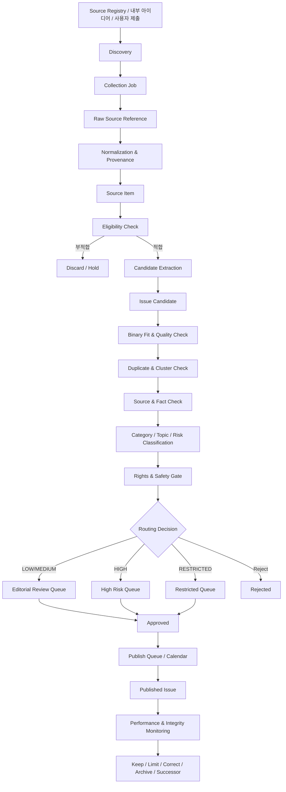

# WHICH 이슈 공급 및 콘텐츠 파이프라인 v2.0

- **문서 상태:** 상세 기획 검토본
- **버전:** 2.0
- **기준일:** 2026-08-17
- **기준 문서:**
  - `03_ISSUE_SUPPLY_AND_CONTENT_PIPELINE.md` v1
  - `01_PRODUCT_VISION_AND_PRINCIPLES_v2.md`
  - `02_CORE_UX_AND_USER_JOURNEYS_v2.md`
  - `04_ISSUE_TAXONOMY_QUALITY_AND_CONTROVERSY.md`
  - `07_RECOMMENDATION_AND_ML_ARCHITECTURE.md`
  - `09_MODERATION_AND_GOVERNANCE.md`
  - `10_METRICS_ANALYTICS_AND_EXPERIMENTS.md`
  - `11_MVP_ROADMAP_AND_OPEN_DECISIONS.md`
  - `12_DECISION_LOG.md`
  - `13_GLOSSARY_AND_STATUS_MODEL.md`
- **문서 목적:** WHICH 출시 전·초기·성장기의 이슈 공급 전략과, 외부 토대 자료 또는 내부 아이디어를 검증 가능한 `Published Issue`로 전환하는 전체 운영 파이프라인을 정의한다.
- **문서 비범위:** 물리 DB 스키마, API 상세 계약, 크롤러 구현 코드, 특정 외부 플랫폼의 최신 API 이용약관 해석, 최종 법률 의견, 운영자 콘솔의 시각 디자인은 후속 문서에서 다룬다.
- **중요 고지:** 이 문서는 제품·운영 설계안이다. 저작권, 개인정보, 선거, 언론·플랫폼 이용약관 관련 실제 운영은 출시 국가와 채널별 별도 법률·정책 검토를 거쳐야 한다.

---

## 0. 결정 상태 표기

| 표기 | 의미 |
|---|---|
| **[확정]** | 후속 운영·제품·개발 설계의 기본 전제로 사용한다. |
| **[설계 기준]** | 원칙은 채택하되 세부 구현과 수치는 운영 검증으로 조정할 수 있다. |
| **[초기안]** | 출시 초기 실험 또는 용량 계획을 위한 가설이다. |
| **[미정]** | 별도의 명시적 의사결정이나 법률·기술 검토가 필요하다. |
| **[금지]** | 제품 신뢰, 안전, 권리 또는 운영 지속성을 해치므로 채택하지 않는다. |

### 0.1 v2 주요 보강 내용

| 영역 | v1 | v2 보강 내용 |
|---|---|---|
| 공급 전략 | 외부 자료 기반 초기 시딩 | 단계별 공급 목표, 풀 용량, 카테고리·수명·위험 예산 추가 |
| Source 관리 | Source Item 필드 초안 | Source Registry, 수집 허용 방식, 출처 상태·버전·철회 관리 추가 |
| 파이프라인 | 수집→후보→검수→게시 | 발견·수집·정규화·사실 분리·중복 클러스터·게시 후 감시까지 확장 |
| 변환 규칙 | 원문을 A/B로 재가공 | Binary Fit 판정, 질문 불변성, 선택지 대등성, 거절 조건 구체화 |
| 검증 | 출처·사실 검사 | 주제 위험별 증거 요건, 다중 출처, SNS·커뮤니티의 역할 제한 추가 |
| 상태 모델 | Source/Candidate/Published 구분 | 객체별 상태·전이·실패·복구 조건 상세화 |
| 자동화 | AI 생성과 검수 | MVP 인간 최종 승인, 자동화 성숙도, 모델·프롬프트 버전 추적 추가 |
| 정치·고위험 | 자동 게시 금지 | 전용 큐, 출처 요건, 게시 권한, 추천·수명·정정 강화 |
| 게시 운영 | 즉시·예약·보류·만료 | 편집 캘린더, 재고 버퍼, 게시 슬롯, 긴급 슬롯, 중단 절차 추가 |
| 게시 후 | 만료·재검토 | 성과 감시, 전제 변경, 출처 정정·철회, 후속 Issue 연결 추가 |
| 권리·미디어 | rights_note | 이미지 기본 미사용, 라이선스·출처·삭제 대응 정책 구체화 |
| 운영 조직 | 미정 | 역할, RACI, 큐 우선순위, 일일·주간 운영 리듬 추가 |
| 측정 | 공급 KPI | 품질·신뢰·속도·다양성·풀 고갈·자동화 정확도 지표 확장 |

---

# 1. 문서의 역할과 핵심 목표

## 1.1 해결하려는 운영 문제

WHICH는 출시 초기부터 다음 순환 문제를 가진다.

```text
사용자가 적음
→ 사용자 생성 이슈가 적음
→ 볼 콘텐츠가 부족함
→ 한 세션에서 빠르게 고갈됨
→ 사용자가 남지 않음
→ 사용자 생성 이슈가 더 적어짐
```

**[확정]** 이를 해결하기 위해 초기에는 외부에 공개된 토대 자료와 운영자 아이디어를 바탕으로 `Issue Pool`을 먼저 구축한다.

그러나 단순히 많은 질문을 생성하는 것만으로는 부족하다. 다음 조건을 동시에 만족해야 한다.

1. 사용자가 짧게 이해할 수 있다.
2. A와 B가 모두 실제로 선택할 수 있는 입장이다.
3. 사실 배경과 의견 판단이 분리되어 있다.
4. 원자료와 변환 과정을 추적할 수 있다.
5. 중복·유사 질문이 과도하게 쌓이지 않는다.
6. 정치·젠더·사건사고 등 고위험 소재가 공급을 지배하지 않는다.
7. 게시 후 사실관계 변경과 출처 정정에 대응할 수 있다.
8. 추천 모델이 사용할 카테고리·주제·임베딩·품질 피처가 안정적으로 생성된다.

## 1.2 파이프라인의 한 줄 목표

> 공개된 토대 자료나 내부 아이디어를 수집한 뒤, 출처와 맥락을 보존하면서 하나의 중립적이고 대등한 A/B 질문으로 변환하고, 위험도에 맞는 인간 검수와 게시 수명주기를 거쳐 안전하게 공급한다.

## 1.3 제품과 운영에 제공해야 하는 산출물

파이프라인은 최종적으로 다음 산출물을 제공해야 한다.

| 산출물 | 주요 사용처 |
|---|---|
| 검증 가능한 Published Issue | 사용자 투표·결과·댓글 UX |
| 안정적인 Issue Pool | For You·인기·논쟁·최신 피드 |
| Source Lineage | 출처 표시, 정정, 감사, 분쟁 대응 |
| Category·Topic·Risk | 관심사, 추천, 다양성, 모더레이션 |
| Quality·Freshness | 후보 우선순위와 추천 피처 |
| Expiry·Review Schedule | 시의성 관리와 재검토 |
| Model·Prompt Version | 생성 오류 분석과 재현성 |
| Moderation Decision | 게시 근거와 운영 감사 |

## 1.4 이 문서의 성공 조건

이 문서는 다음 질문에 답할 수 있어야 한다.

- 어디에서 어떤 방식으로 자료를 발견하는가?
- 무엇을 저장하고 무엇을 저장하지 않는가?
- 토대 자료와 게시 이슈를 왜 분리하는가?
- 어떤 자료가 WHICH 질문으로 적합하지 않은가?
- A/B 질문은 어떤 절차로 생성·검수되는가?
- 중복·유사 이슈는 어떻게 묶고 차단하는가?
- 정치·고위험 후보는 어디로 분기되는가?
- 누가 어떤 권한으로 승인·수정·게시하는가?
- 게시 후 사실이 바뀌거나 출처가 철회되면 어떻게 하는가?
- 초기 Issue Pool이 충분한지 어떤 지표로 판단하는가?

---

# 2. 핵심 운영 원칙

## 2.1 원문 복제가 아니라 질문으로의 변환

**[확정]** WHICH는 뉴스·게시물·영상·공식 발표를 그대로 소비시키는 서비스가 아니다.

```text
원자료
→ 핵심 사실과 논점 추출
→ WHICH용 배경 요약
→ 하나의 판단 질문
→ 대등한 A/B 선택지
```

- 원문 제목을 그대로 질문 제목으로 사용하지 않는다.
- 기사·게시물 본문을 길게 복사하지 않는다.
- 출처가 제공하는 감정적 표현을 그대로 재사용하지 않는다.
- 원자료의 결론을 WHICH의 정답처럼 제시하지 않는다.

## 2.2 발견 신호와 사실 근거를 구분

**[확정]** 소셜·커뮤니티 화제는 `무엇이 화제인가`를 발견하는 신호가 될 수 있지만, 그 게시물 하나만으로 사실 배경을 확정하지 않는다.

```text
SNS·커뮤니티
→ Topic Discovery 가능
→ 사실 확정 근거로 단독 사용 불가
→ 공식·1차·독립 자료로 보강
```

예외는 개인 취향·생활 경험처럼 외부 사실 확인이 필요하지 않은 Evergreen 질문이다.

## 2.3 사실과 의견의 분리

하나의 Issue는 다음 두 층을 분리한다.

```text
Background
= 검증 가능한 사실·상황·조건

Question + A/B
= 사용자의 판단·선호·가치 선택
```

- 배경의 사실 오류는 수정·정정 대상이다.
- A/B 분포는 참여자의 선택 결과이며 사실 판정이 아니다.
- 특정 선택이 사실적으로 옳다고 암시하는 설명을 결과 화면에 붙이지 않는다.

## 2.4 질문보다 출처가 먼저

Current·Trend·정책·사건 기반 이슈는 질문을 먼저 만들고 출처를 나중에 끼워 맞추지 않는다.

```text
Source Item 확보
→ 핵심 사실 추출
→ 증거 수준 판정
→ 질문 생성
```

출처가 불충분하면 `SOURCE_PENDING`으로 보류하거나 후보를 폐기한다.

## 2.5 게시보다 추적 가능성이 우선

빠른 게시가 중요하더라도 다음이 추적되지 않는 후보는 게시하지 않는다.

- 무엇을 보고 만들었는가?
- 누가 또는 어떤 모델이 생성했는가?
- 어떤 버전의 규칙으로 검수했는가?
- 누가 승인했는가?
- 언제 어떤 문구가 변경됐는가?

## 2.6 위험에 비례한 마찰

```text
LOW
→ 자동 검사 + 인간 최종 승인 또는 성숙 후 자동 승인

MEDIUM
→ 자동 검사 + 표본 또는 필수 인간 검수

HIGH
→ 전문 큐 + 인간 승인

RESTRICTED
→ 전용 파이프라인 + 강화된 출처·권한·무결성 정책
```

**[설계 기준]** MVP 초기에는 모델 품질 기준선이 없으므로 외부 자료 기반 Published Issue의 최종 게시를 인간이 승인한다. LOW 자동 게시는 충분한 오프라인·온라인 품질 검증 후 단계적으로 연다.

## 2.7 게시 후 문구 불변성

**[확정]** 첫 정상 투표가 발생한 이후 질문 또는 A/B 선택지를 의미 있게 변경하지 않는다.

이유:

- 변경 전과 후의 투표가 같은 의미가 아닐 수 있다.
- 결과 분포를 해석할 수 없게 된다.
- 작성자·운영자가 결과에 맞춰 문구를 조정했다는 오해가 생길 수 있다.

물질적 변경이 필요하면 기존 Issue를 종료·보관하고 새 Issue를 생성해 연결한다.

## 2.8 양보다 고갈 방지 가능한 품질 재고

단순한 후보 수보다 다음을 만족하는 `Eligible Issue Inventory`가 중요하다.

- 현재 게시 가능 상태
- 사용자 세그먼트에 적합
- 이미 본 이슈가 아님
- 위험·다양성 제한을 통과
- 만료되지 않음
- 추천에 필요한 피처가 준비됨

## 2.9 자극성에 의존하지 않는 공급

**[금지]** 단기 반응이 높다는 이유로 정치·젠더·혐오·사건사고를 반복 생산해 공급량을 채우지 않는다.

공급 계획에는 카테고리 다양성과 위험 예산을 포함한다.

## 2.10 권리와 안전은 기능이 아니라 게이트

권리 상태가 불명확한 이미지·영상·본문은 게시 일정이 급하더라도 사용하지 않는다.

---

# 3. 콘텐츠 공급 전략

## 3.1 공급 유형

| 유형 | 정의 | 대표 원천 | 수명 | 핵심 위험 |
|---|---|---|---|---|
| Evergreen | 특정 시점에 크게 의존하지 않는 생활·취향·관계 질문 | 운영자 기획, 반복 논점, 사용자 제안 | 김 | 진부함, 중복 |
| Current | 뉴스·정책·제품 발표처럼 현재 맥락이 중요한 질문 | 공식 발표, 1차 자료, 언론 | 짧음~중간 | 사실 변경, 만료 |
| Trend | SNS·커뮤니티·검색에서 짧게 급상승한 논점 | 공개 트렌드 신호 | 매우 짧음 | 왜곡, 조작, 과열 |
| Editorial | WHICH가 특정 테마·시리즈로 직접 구성한 질문 | 편집 기획 | 중간 | 편집 편향 |
| User-generated | 회원이 직접 제안한 질문 | 사용자 제출 | 다양 | 스팸, 편향, 권리 |
| Follow-up | 이전 Issue의 결과·사건 변화에 따라 만든 후속 질문 | 기존 Issue + 신규 자료 | 중간 | 유사 중복, 결과 유도 |
| Seasonal | 명절·입학·휴가·스포츠 시즌 등 반복 시기 질문 | 캘린더 | 반복 | 시기 오판 |

## 3.2 유형별 역할

### Evergreen

- 출시 전 재고를 구축한다.
- 저활성 시간대와 신규 사용자 Cold Start를 안정화한다.
- 카테고리 다양성의 기반이 된다.
- 지나치게 상식적이거나 정답이 명백한 질문은 제외한다.

### Current

- 서비스가 현재 사회와 연결되어 있다는 감각을 제공한다.
- 게시 속도보다 출처·날짜·유효기간을 우선한다.
- 배경의 날짜를 가능한 범위에서 명시한다.

### Trend

- 발견 속도가 중요하지만 가장 높은 검증 부담을 가진다.
- 특정 커뮤니티의 조직적 화제와 전체적 관심을 구분해야 한다.
- 사실성이 약한 경우 ‘온라인에서 이런 반응이 있다’는 사실조차 단독 게시물 수로 일반화하지 않는다.

### Editorial

- 특정 주제의 균형 있는 세트를 구성할 수 있다.
- 편집자가 동일 결론을 유도하는 질문만 연속 생산하지 않도록 내부 리뷰가 필요하다.

### User-generated

- 성장기의 주요 공급원이다.
- Creator의 표현을 존중하되 게시 가능한 Issue 계약으로 변환해야 한다.
- 사용자가 제안한 원문과 Published Issue의 편집본을 모두 보존한다.

## 3.3 공급 비중의 단계적 변화

```text
출시 준비
운영·편집·외부 토대 자료 중심

초기 성장
운영 공급 + 사용자 생성 병행

활성화
사용자 생성 중심
운영 공급은 품질·공공성·카테고리 공백 보완
```

**[초기안]** 비중은 고정 목표가 아니라 `Creator Share`, 승인율, 신고율, 세션 고갈률을 함께 보고 조정한다.

## 3.4 공급 목표의 우선순위

```text
1. 피드 고갈 방지
2. 품질과 출처 신뢰
3. 카테고리·주제 다양성
4. 시의성
5. 사용자 생성 비중
6. 자동화율
```

자동화율은 독립적인 성공 지표가 아니다. 자동화가 높아져도 오류·정정·신고가 증가하면 실패다.

---

# 4. Source 계층과 역할

## 4.1 Source의 정의

`Source`는 Published Issue의 정답을 보증하는 기관이 아니라 다음을 추적하기 위한 원천이다.

- 배경 사실이 어디에서 왔는가?
- 자료가 언제 게시·수정됐는가?
- 어떤 맥락을 바탕으로 질문을 만들었는가?
- 정정·철회·삭제 여부를 어떻게 확인할 것인가?

## 4.2 Source Trust Class

| 클래스 | 설명 | 단독 사용 가능 범위 | 주의 |
|---|---|---|---|
| OFFICIAL | 정부·공공기관·공식 선거기관 등의 공식 공개 자료 | 해당 기관의 발표 사실 | 발표의 효과·평가까지 보증하지 않음 |
| PRIMARY | 기업·단체·당사자의 직접 발표·원문·데이터 | ‘당사자가 발표했다’는 사실 | 자기이해·홍보 편향 가능 |
| RESEARCH_DATA | 공개 연구·통계·데이터셋 | 연구가 실제로 보고한 범위 | 방법론·시점·표본 확인 필요 |
| MAJOR_MEDIA | 편집·책임 체계를 가진 언론 보도 | 저위험 Current의 출발점 | 단일 기사만으로 논쟁적 사실 확정 금지 가능 |
| SECONDARY | 해설·요약·전문 매체 | 후보 발견·맥락 보강 | 원자료 추적 필요 |
| COMMUNITY | 포럼·커뮤니티 게시물 | 화제·생활 논점 발견 | 사실 배경 단독 근거 금지 |
| SOCIAL | X·Instagram·YouTube·Threads 등의 공개 게시물 | 트렌드·당사자 발언 발견 | 진위·대표성·조작 위험 큼 |
| INTERNAL | WHICH 편집 아이디어·Evergreen 지식 | 외부 사실이 불필요한 질문 | 내부 편집 편향 관리 |
| USER_PROVIDED | 사용자가 제출한 설명·링크 | 제안 원문 보존 | 게시 전 독립 검증 필요 |
| UNKNOWN | 출처 성격 불명 | 없음 | 원칙적으로 보류·폐기 |

### 4.2.1 Trust Class 해석 원칙

- 높은 클래스가 항상 내용의 진실을 의미하지 않는다.
- OFFICIAL도 자기 기관의 주장·계획과 실제 효과는 구분한다.
- MAJOR_MEDIA도 오보·정정 가능성이 있다.
- COMMUNITY·SOCIAL은 사실성보다 `논점 발견`에 강하다.
- Trust Class는 검증 부담과 사용 가능 범위를 정하는 운영 메타데이터다.

## 4.3 사실 유형별 근거 요구

| 사실 유형 | 기본 근거 | 강화 조건 |
|---|---|---|
| 공식 발표가 존재함 | 공식 원문 1개 | 고위험이면 독립 보도 보강 |
| 제품·서비스 가격·사양 | 공식 페이지 또는 직접 확인 자료 | 지역·시점 명시 |
| 통계 수치 | 원 데이터·공식 통계·연구 | 조사 시점·표본·정의 보존 |
| 사건 발생 | 신뢰 가능한 보도 또는 공식 발표 | 논쟁적이면 2개 이상 독립 근거 |
| 온라인 화제 | 플랫폼 공개 신호 또는 복수 관찰 | 전체 여론처럼 표현 금지 |
| 개인 발언 | 원영상·원문·공식 계정 | 편집·맥락 누락 확인 |
| 정책 효과·인과 주장 | 연구·다중 근거 | A/B 전제에 직접 넣는 것 제한 |

**[설계 기준]** HIGH·RESTRICTED 또는 피해 가능성이 큰 사실은 가능한 범위에서 2개 이상의 독립 근거를 요구한다. 정확한 요건은 주제별 운영 정책에서 확정한다.

## 4.4 Source 역할의 분리

하나의 Issue에는 출처별 역할을 명시할 수 있다.

```text
PRIMARY_CONTEXT
= 핵심 배경의 직접 근거

CORROBORATION
= 독립 확인 또는 추가 맥락

TREND_SIGNAL
= 화제 발견 근거

DATA_SUPPORT
= 수치·통계 근거

COUNTER_CONTEXT
= 다른 관점 또는 제한 사항
```

이 분리를 통해 트렌드 신호가 사실 근거처럼 사용되는 것을 막는다.

---

# 5. Source Registry

## 5.1 목적

`Source Registry`는 수집할 수 있는 도메인·계정·피드·내부 채널을 사전에 등록하고 운영 상태를 관리하는 논리 객체다.

## 5.2 Source Registry 필드 계약

| 필드 | 설명 |
|---|---|
| source_registry_id | 등록 소스 식별자 |
| display_name | 운영자에게 표시할 이름 |
| source_class | OFFICIAL 등 Trust Class |
| channel_type | WEBSITE, RSS, API, SOCIAL_ACCOUNT, MANUAL, INTERNAL 등 |
| base_url_or_handle | 기본 URL 또는 공개 계정 식별자 |
| jurisdiction | 국가·지역·언어 범위 |
| categories | 주로 다루는 카테고리 |
| allowed_collection_mode | API, RSS, MANUAL, LINK_ONLY 등 허용 방식 |
| content_storage_mode | METADATA_ONLY, SUMMARY_ONLY, PERMITTED_EXCERPT 등 |
| rights_review_status | 권리 검토 상태 |
| terms_reviewed_at | 약관·정책 마지막 확인 시각 |
| robots_reviewed_at | robots 또는 기술 접근 정책 확인 시각 |
| rate_limit_policy | 수집 빈도 제한 메모 |
| trust_notes | 신뢰도 해석 메모 |
| owner | 내부 담당자 |
| status | ACTIVE, PAUSED, REVIEW_REQUIRED, BLOCKED |
| next_review_at | 재검토 예정일 |

## 5.3 Source Registry 상태

```text
PENDING_REVIEW
→ ACTIVE
→ PAUSED
→ ACTIVE

ACTIVE
→ REVIEW_REQUIRED
→ ACTIVE / BLOCKED

ACTIVE
→ BLOCKED
```

### 상태 의미

- `PENDING_REVIEW`: 아직 수집 방식·권리·운영 검토 전
- `ACTIVE`: 허용된 방식으로 수집 가능
- `PAUSED`: 일시 중지, 기존 자료는 유지
- `REVIEW_REQUIRED`: 약관·구조·신뢰 문제로 재검토 필요
- `BLOCKED`: 신규 수집 금지

## 5.4 수집 방식 원칙

우선순위:

```text
공식 API·공개 피드
→ RSS·정식 배포 채널
→ 운영자 수동 링크 등록
→ 허용 범위 내 자동 수집
```

**[금지]** 접근 제한을 우회하거나 로그인·유료벽·기술적 보호조치를 회피하는 방식은 사용하지 않는다.

## 5.5 채널별 재검토

다음 이벤트가 발생하면 Source Registry를 재검토한다.

- 플랫폼 이용약관 또는 API 정책 변경
- robots 또는 접근 제한 변경
- 도메인 소유자 변경
- 반복적인 오보·정정·품질 문제
- 권리자 삭제 요청
- 수집 방식 장애 또는 차단
- 정치·선거 기간 특별 정책 시작

---

# 6. 전체 End-to-End Pipeline

## 6.1 상위 흐름



## 6.2 주요 Stage

| 단계 | 입력 | 핵심 처리 | 출력 |
|---|---|---|---|
| Discovery | 등록 소스·운영자 아이디어 | 새로운 토대 자료 발견 | Discovery Record |
| Collection | Discovery Record | 허용 방식으로 메타데이터 확보 | Raw Reference |
| Normalization | 원자료 참조 | 날짜·URL·제목·언어·출처 통일 | Source Item |
| Eligibility | Source Item | 권리·중복·품질·시의성 1차 판정 | Eligible/Hold/Discard |
| Candidate Extraction | Eligible Source | 논점 후보 추출 | Candidate Draft |
| Transformation | Candidate Draft | 질문·A/B·배경 작성 | Issue Candidate |
| Validation | Issue Candidate | 품질·사실·중복·위험·안전 | Evaluation Bundle |
| Review | Evaluation Bundle | 인간 편집·승인·수정·거절 | Approved Candidate |
| Scheduling | Approved Candidate | 게시 시점·피드 공급 계획 | Publish Job |
| Publication | Publish Job | 불변 버전 생성·피처 준비 | Published Issue |
| Monitoring | Published Issue | 성과·신고·출처·무결성 감시 | 운영 조치 |

## 6.3 Fail-Closed 원칙

다음 상태에서는 자동으로 게시를 중지한다.

- 출처 역할이 불분명함
- 날짜·사건·인물 식별이 모호함
- 질문과 선택지가 원자료와 무관함
- Binary Fit 미충족
- 중대한 중복 가능성
- HIGH/RESTRICTED 분류 불확실
- 권리 검토 미완료 이미지 포함
- 모델 출력이 스키마를 충족하지 않음

---

# 7. 논리적 객체와 상태 모델

## 7.1 객체 관계

```text
Source Registry
   1
   └── N Collection Job
           └── N Source Item
                   N
                   └── M Issue Candidate
                           N
                           └── M Source Reference
                                   ↓
                           Candidate Evaluation
                                   ↓
                              Publish Job
                                   ↓
                              Published Issue
                                   ↓
                       Correction / Archive / Successor
```

한 Source Item에서 서로 다른 논점의 후보가 여러 개 나올 수 있으나, 후보 대량 생성은 제한한다.

하나의 Issue Candidate는 복수 Source Item을 참조할 수 있다.

## 7.2 Collection Job

### 필드 후보

- collection_job_id
- source_registry_id
- trigger_type
- requested_at
- started_at
- finished_at
- mode
- cursor_or_checkpoint
- discovered_count
- stored_count
- skipped_count
- error_count
- status
- error_summary
- worker_version

### 상태

```text
SCHEDULED
RUNNING
PARTIAL
COMPLETED
FAILED_RETRYABLE
FAILED_FINAL
CANCELED
```

## 7.3 Source Item

### 정의

외부 또는 내부 원자료를 WHICH가 추적할 수 있도록 정규화한 최소 단위다. Source Item 자체는 사용자에게 투표 가능한 콘텐츠가 아니다.

### 필드 계약

| 필드 | 설명 |
|---|---|
| source_item_id | 원자료 식별자 |
| source_registry_id | 등록 소스 연결 |
| canonical_url | 정규화된 대표 URL |
| source_item_type | ARTICLE, PRESS_RELEASE, VIDEO, POST, DATASET, IDEA 등 |
| original_title | 원제 |
| author_or_publisher | 공개 작성자·발행자 |
| published_at | 원자료 게시 시각 |
| updated_at_source | 원자료 수정 시각이 있으면 저장 |
| collected_at | WHICH 수집 시각 |
| language | 원문 언어 |
| region | 관련 지역 |
| short_factual_summary | 내부용 사실 요약 |
| permitted_excerpt | 허용되는 경우에만 제한적 보존 |
| content_fingerprint | 중복 탐지용 지문 |
| trust_class | 출처 클래스 |
| rights_status | 권리 검토 상태 |
| retraction_status | 정정·철회·삭제 상태 |
| status | 처리 상태 |
| provenance | 수집 경로와 버전 |

### Source Item 상태

```text
NEW
NORMALIZING
NORMALIZED
DUPLICATE_SOURCE
ELIGIBLE
HELD
DISCARDED
RETRACTED
UNAVAILABLE
```

### 상태 의미

- `DUPLICATE_SOURCE`: canonical URL·콘텐츠 지문 기준 이미 존재
- `HELD`: 출처·권리·사실 확인 대기
- `DISCARDED`: WHICH Issue로 부적합
- `RETRACTED`: 원출처가 철회·정정해 영향 검토 필요
- `UNAVAILABLE`: 404·접근 불가, 기존 lineage는 유지

## 7.4 Discovery Record

Source Item보다 앞선 가벼운 후보 신호다.

필드 후보:

- discovery_id
- source_registry_id 또는 manual_source
- discovered_url
- title_hint
- trend_signal
- discovered_at
- discovered_by
- discovery_reason
- dedupe_key
- status

Discovery 단계에서 원문 전체를 저장할 필요는 없다.

## 7.5 Issue Candidate

### 정의

WHICH 형식으로 변환됐지만 아직 투표 가능한 계약으로 확정되지 않은 편집 객체다.

### 필드 계약

| 필드 | 설명 |
|---|---|
| issue_candidate_id | 후보 식별자 |
| origin_type | EXTERNAL, EDITORIAL, USER, FOLLOW_UP |
| original_submission | 사용자·운영자의 최초 문구 |
| proposed_question | 질문 초안 |
| proposed_choice_a | A 초안 |
| proposed_choice_b | B 초안 |
| proposed_background | 배경 초안 |
| category | 대분류 |
| subcategory | 하위 분류 |
| topics | 주제 태그 |
| source_references | 출처 역할별 연결 |
| candidate_type | Evergreen, Current, Trend 등 |
| valid_from | 유효 시작 시각 |
| expires_at | 투표 종료 또는 재검토 시각 |
| risk_level | LOW/MEDIUM/HIGH/RESTRICTED |
| quality_flags | 품질 검사 결과 |
| safety_flags | 안전 검사 결과 |
| duplicate_cluster_id | 유사 후보 클러스터 |
| generation_version | 모델·프롬프트 버전 |
| editorial_version | 편집 버전 |
| status | 후보 상태 |

### Issue Candidate 상태

```text
GENERATED
EDITING
BINARY_FIT_FAILED
QUALITY_FAILED
SOURCE_PENDING
RIGHTS_PENDING
DUPLICATE_REVIEW
RISK_REVIEW
MODERATION_PENDING
CHANGES_REQUESTED
APPROVED
SCHEDULED
REJECTED
EXPIRED_BEFORE_PUBLISH
```

## 7.6 Candidate Evaluation Bundle

후보 하나에 대한 자동·인간 평가를 묶는다.

- binary_fit_result
- clarity_score
- choice_parity_score
- background_sufficiency
- source_strength
- novelty_score
- risk_classification
- safety_classification
- rights_status
- duplicate_matches
- factual_claims[]
- required_human_review
- blocker_codes[]
- warning_codes[]
- evaluator_versions[]
- reviewer_decision

## 7.7 Publish Job

### 목적

승인된 후보를 특정 시점과 정책 버전으로 불변 Published Issue로 전환한다.

### 상태

```text
QUEUED
SCHEDULED
PREPARING
PUBLISHING
PUBLISHED
FAILED_RETRYABLE
FAILED_FINAL
CANCELED
```

### 필수 사전 조건

- 승인된 editorial version
- 최소 2개 선택지 정확히 존재
- 유효 카테고리·Risk Level
- 필요한 출처 연결
- 임베딩과 기본 Issue Feature 준비 또는 동기 fallback
- 권리 상태 통과
- 만료 시간이 현재 이후
- 정책상 필요한 인간 승인 존재

## 7.8 Published Issue

Published Issue는 투표 계약이다.

첫 정상 투표 이후 다음은 불변으로 취급한다.

- 질문의 의미
- Choice A의 의미
- Choice B의 의미
- A/B 위치
- 핵심 판단 대상

변경 가능한 항목은 제한적이다.

- 오탈자처럼 의미를 바꾸지 않는 수정
- 출처 링크 추가·교체
- 배경의 비물질적 명확화
- 정정·주의 배지
- 게시·종료·노출 상태

모든 변경은 버전과 Audit Log를 남긴다.

---

# 8. Discovery: 자료 발견

## 8.1 발견 채널

### 공식·공공

- 정부·지자체·공공기관 발표
- 공식 통계·공개 데이터
- 기업·단체 공식 발표
- 규정·정책 변경 공지

### 미디어

- 주요 언론 기사
- 분야 전문 매체
- 공개 인터뷰·보도 영상
- 장문 해설과 연구 소개

### 소셜·트렌드

- YouTube의 공개 영상·댓글·화제
- X의 공개 게시물·급상승 논점
- Instagram의 공개 게시물·Reels 화제
- Threads 등 공개 대화
- 검색 트렌드

### 커뮤니티

- 대형 공개 커뮤니티의 반복 논점
- 생활·직장·관계에서 반복 등장하는 질문
- 특정 표현이 아니라 재발하는 갈등 구조

### 내부

- 편집 캘린더
- 카테고리 공백 분석
- 기존 Issue의 후속 질문
- 검색·추천 실패에서 발견된 콘텐츠 부족
- 사용자 검색어와 `NOT_FOUND` 패턴

### 사용자

- 회원의 이슈 제안
- 관련 링크 제출
- 댓글에서 파생된 후속 질문
- 신고·정정 제보

## 8.2 Discovery와 Collection의 분리

Discovery는 ‘볼 가치가 있을 수 있다’는 신호다. Collection은 실제 Source Item을 생성하는 작업이다.

```text
발견됨
≠
수집 허용
≠
사실 확인됨
≠
질문으로 적합
≠
게시 가능
```

## 8.3 발견 우선순위 점수

**[초기안]** 운영 큐 우선순위에는 다음 신호를 사용할 수 있다.

```text
Discovery Priority
= Freshness
+ Cross-source recurrence
+ Category gap value
+ Expected editorial value
+ User relevance
- Risk cost
- Rights uncertainty
- Duplicate likelihood
```

점수는 자동 게시 결정이 아니라 운영자 큐 순서에만 사용한다.

## 8.4 Trend 발견의 안전선

다음은 ‘급상승’으로 오인할 수 있다.

- 단일 계정의 대규모 팔로워 효과
- 특정 커뮤니티 좌표찍기
- 광고·프로모션
- 봇·복제 계정
- 동일 문구의 반복 게시
- 언론 보도 직후 일시적 언급 증가

따라서 Trend 후보는 가능한 범위에서 다음을 본다.

- 복수 채널에서 독립적으로 등장하는가?
- 서로 다른 작성자·커뮤니티가 논의하는가?
- 논점이 지속되는가?
- 사실 기반이 존재하는가?
- 특정 선택을 지시하는 캠페인인가?

## 8.5 카테고리 공백 기반 발견

운영 대시보드는 다음 공백을 보여준다.

- 추천 가능한 LOW Issue 부족
- 신규 사용자 관심 카테고리의 재고 부족
- 특정 언어·지역 Issue 부족
- Evergreen 재고 부족
- Current가 지나치게 많은 카테고리
- HIGH/RESTRICTED 비중 과다
- 최근 7일 같은 논점 반복

공급팀은 단순 트렌드 추종 외에 이 공백을 채우는 역할을 한다.

---

# 9. Collection: 자료 수집

## 9.1 수집 최소주의

**[설계 기준]** WHICH는 Issue 생성과 출처 추적에 필요한 최소 메타데이터를 저장한다.

기본 저장:

- canonical URL
- 제목
- 발행자·공개 작성자
- 게시·수정 시각
- 출처 클래스
- 내부 요약
- 필요한 경우 제한적 근거 메모
- 콘텐츠 지문

기본적으로 저장하지 않음:

- 기사 전문
- 영상 파일 복제본
- 전체 댓글 덤프
- 사용자 개인정보
- 로그인·유료 접근 자료
- 권리 상태가 불분명한 이미지 원본

## 9.2 Canonicalization

같은 자료가 다음 형태로 중복될 수 있다.

- 모바일·데스크톱 URL
- 추적 파라미터가 다른 URL
- 미러·재배포 페이지
- AMP·프린트 페이지
- SNS 공유용 단축 URL

정규화 단계에서:

- 추적 파라미터 제거
- 리디렉션 최종 목적지 확인
- canonical URL 우선
- 원발행자 우선
- 게시·수정 시각 보존
- 콘텐츠 지문 비교

## 9.3 언어와 번역

외국어 자료를 한국어 Issue로 변환할 수 있으나 다음을 기록한다.

- 원문 언어
- 번역 방식
- 번역 모델·버전
- 핵심 용어 원문
- 번역 검수 여부

HIGH·RESTRICTED에서 번역이 논점에 영향을 줄 수 있으면 인간 검수를 요구한다.

## 9.4 삭제·접근 불가 Source

출처가 삭제됐다고 즉시 Published Issue를 삭제하지는 않는다.

```text
Source unavailable
→ 대체 근거 탐색
→ 핵심 전제 영향 평가
→ 출처 교체 / 주의 표시 / 투표 종료 / 제거
```

단, 유일한 근거가 사라지고 사실 확인이 불가능하면 신규 투표를 제한한다.

## 9.5 Collection 오류 처리

- 일시적 네트워크 실패: 재시도
- 접근 금지·정책 변경: Source Registry `REVIEW_REQUIRED`
- 파싱 실패: 수동 검토 또는 메타데이터만 저장
- 날짜 불명: `published_at_unknown` 표시 후 Current 후보 보류
- 언어 식별 실패: 수동 라우팅
- 중복 대량 발견: 수집 Job 중단 후 규칙 점검

---

# 10. Normalization과 Provenance

## 10.1 내부 요약의 목적

`short_factual_summary`는 사용자에게 바로 노출하는 카피가 아니라 후보 생성과 사실 검수용 내부 요약이다.

요약은 다음을 구분한다.

- 누가
- 무엇을
- 언제
- 어디에서
- 어떤 상태로 발표·발생했는가
- 아직 확인되지 않은 부분은 무엇인가

## 10.2 사실 Claim 추출

Current·Trend 후보는 배경에 들어갈 문장을 `Factual Claim` 단위로 분해한다.

예:

```text
Claim 1: 서울시가 2026년 8월 15일 정책안을 발표했다.
Claim 2: 정책은 특정 구간의 운영 시간을 연장한다.
Claim 3: 연장으로 혼잡이 줄어들 것이다.
```

- Claim 1: 발표 사실
- Claim 2: 정책 내용
- Claim 3: 미래 효과 예측

Claim 3을 확정 사실처럼 배경에 쓰지 않는다.

## 10.3 Provenance 필수 요소

- 수집 방식
- 수집 시각
- canonical URL
- 원자료 게시·수정 시각
- 내부 요약 생성자 또는 모델
- 번역 여부
- content fingerprint
- Source Registry 상태
- 후속 정정·철회 확인 기록

## 10.4 Snapshot 원칙

외부 페이지 전체를 무단 보관하는 것이 아니라, 재현에 필요한 메타데이터와 허용된 범위의 근거만 보존한다.

**[미정]** 분쟁 대응을 위한 화면 캡처·웹 아카이빙 범위는 채널별 법률 검토 후 정한다.

---

# 11. Source Eligibility Gate

## 11.1 통과 조건

Source Item은 다음을 충족해야 후보 생성 단계로 이동할 수 있다.

- 수집 경로가 허용됨
- canonical URL 또는 내부 원천이 추적됨
- 출처 클래스가 UNKNOWN이 아님
- 게시 시점 또는 시의성 판단 가능
- 핵심 주제가 WHICH 범위에 포함됨
- 개인정보·권리 위험이 통제 가능
- 단순 광고·스팸·복제 자료가 아님
- 기존 Source Item과 중복 아님

## 11.2 Hold 사유

- 날짜 불명
- 원자료 찾지 못함
- 단일 SNS 주장뿐임
- 번역 의미 불확실
- 권리 상태 불명
- 특정 개인의 사생활 정보 포함
- 사건 피해자 2차 피해 우려
- 정치 여부 판정 불확실

## 11.3 Discard 사유

- 질문으로 만들 실질적 논점이 없음
- 명백한 허위·조작 자료
- 광고·홍보성 콘텐츠뿐임
- 원문 복제 없이는 의미 전달 불가
- 불법·유해 정보 노출이 핵심
- 개인 신상·사생활 침해가 중심
- 사회적으로 명백한 해악을 정상화하는 이지선다만 가능
- A/B로 줄이면 심각하게 왜곡됨

---

# 12. Candidate Extraction

## 12.1 한 자료에서 찾을 수 있는 후보

한 Source Item은 다음 중 하나 이상의 논점을 포함할 수 있다.

- 정책을 도입·확대할지
- 가격이 적절한지
- 서비스 변화가 바람직한지
- 사회적 행동이 허용 가능한지
- 새로운 기술을 사용할지
- 책임을 누구에게 둘지
- 개인 또는 조직의 선택 기준

## 12.2 Candidate Explosion 방지

**[초기안]** 하나의 Source Item에서 자동 생성하는 후보는 기본 1~3개로 제한한다.

여러 후보를 만들려면:

- 서로 다른 판단 대상이어야 한다.
- 동일한 A/B 결론을 표현만 바꾼 것이 아니어야 한다.
- 별도의 배경과 수명주기가 있어야 한다.

## 12.3 논점 카드

질문 생성 전 다음 내부 카드를 만든다.

```text
Judgment Object
사용자가 무엇을 판단하는가?

Decision Axis
찬성/반대, 허용/금지, 확대/축소, 적절/부적절 등

Known Facts
검증된 배경은 무엇인가?

Unknowns
확인되지 않은 부분은 무엇인가?

Stakeholders
누구에게 영향을 주는가?

Binary Fit Risk
조건부·다중 선택이 필수인가?

Harm Risk
질문 자체가 피해를 만들 수 있는가?
```

## 12.4 후보 우선순위

다음 질문에 `예`가 많을수록 편집 가치가 높다.

- 짧게 이해 가능한가?
- 두 입장이 현실적으로 존재하는가?
- 결과가 궁금한가?
- 현재 사용자 관심사와 연결되는가?
- 기존 Issue와 충분히 다른가?
- 배경을 1~3문장으로 설명할 수 있는가?
- 출처와 시점을 추적할 수 있는가?
- 결과가 대표 여론으로 오해될 위험을 통제할 수 있는가?

---

# 13. Binary Fit 판정

## 13.1 Binary Fit의 정의

A/B로 줄여도 핵심 판단이 과도하게 왜곡되지 않는지 판단한다.

## 13.2 통과 조건

1. 하나의 판단 축이 존재한다.
2. A와 B가 질문에 직접 답한다.
3. 두 선택지가 상호 구분된다.
4. 동시에 두 선택지가 모두 참인 구조가 아니다.
5. 대부분의 사용자가 두 선택 중 하나를 의미 있게 고를 수 있다.
6. ‘조건부’가 사실상 제3의 필수 선택지가 아니다.
7. 질문이 사실 퀴즈가 아니다.
8. 한 선택지가 불법·폭력·차별을 정상화하지 않는다.

## 13.3 실패 예시

### 다중 논점

```text
재택근무는 생산성을 높이고 행복도도 높이므로 전면 확대해야 하는가?
```

생산성, 행복도, 전면 확대가 섞여 있다.

### 조건부가 핵심

```text
모든 AI 생성물을 자유롭게 사용해도 될까?
A. 된다
B. 안 된다
```

용도·권리·표시 여부가 핵심이라 단순 A/B가 과도할 수 있다.

### 사실 확인

```text
해당 정책이 2026년에 시행됐는가?
A. 시행됐다
B. 시행되지 않았다
```

투표가 아니라 사실 조회다.

### 해악 정상화

```text
특정 집단을 차별해도 되는가?
A. 된다
B. 안 된다
```

유의미한 의견 소비보다 피해·정상화 위험이 크다.

## 13.4 실패 시 처리

```text
BINARY_FIT_FAILED
→ 질문을 더 좁혀 재작성
→ 여러 Issue로 분리
→ A/B가 아닌 다른 콘텐츠 형식 후보로 보류
→ 폐기
```

WHICH MVP는 A/B 형식만 제공하므로 Binary Fit이 낮은 주제를 억지로 게시하지 않는다.

---

# 14. WHICH 질문 변환 규칙

## 14.1 기본 구조

```text
[카테고리·시점]

배경
검증 가능한 핵심 맥락 1~3문장

질문
한 개의 판단 대상

A. 선택지 A
B. 선택지 B

출처
핵심 원자료와 보강 자료
```

## 14.2 질문 문장 규칙

- 가능한 범위에서 1문장
- 주어·대상·행동이 명확함
- 이중 부정 금지
- 감정적 수식어 제거
- 특정 선택을 칭찬·비난하지 않음
- 상대 시점 표현보다 날짜·기간 사용
- ‘당연히’, ‘아직도’, ‘무조건’, ‘개념 없는’ 등 유도 표현 금지
- 정책·제품·사건 이름을 정확히 표시
- 개인 공격 대신 행위·정책·기준을 질문

## 14.3 선택지 규칙

A와 B는 다음을 맞춘다.

- 문장 길이
- 구체성 수준
- 감정 강도
- 행위 범위
- 시간 범위
- 책임 수준

### 좋은 예

```text
질문: 퇴근 후 업무 메신저 응답을 근무로 인정해야 할까?
A. 인정해야 한다
B. 인정하지 않아도 된다
```

### 비대칭 예

```text
A. 노동자의 정당한 권리를 위해 반드시 인정해야 한다
B. 아니다
```

## 14.4 배경 규칙

배경은 질문에 답을 주기 위한 설득문이 아니다.

포함:

- 핵심 사건·정책·변경 내용
- 날짜
- 범위
- 필요한 제한 조건

제외:

- 선정적 묘사
- 출처의 사설적 결론
- 검증되지 않은 효과
- 불필요한 세부 정보
- A 또는 B를 지지하는 논거만의 나열

## 14.5 날짜 표현

Current Issue에서는 다음처럼 절대 날짜를 선호한다.

```text
2026년 8월 15일, 기관 A가 정책 B를 발표했습니다.
```

`어제`, `최근`, `곧` 같은 표현은 장기 보관 시 의미가 사라지므로 제한한다.

## 14.6 개인·집단 관련 표현

- 개인의 외모·사생활·질병·가족을 질문 소재로 삼지 않는다.
- 공적 인물도 직무·정책·공개 행위와 관련된 범위로 제한한다.
- 집단을 단일 성격으로 일반화하지 않는다.
- 범죄 피해자·미성년자 식별 가능성을 낮춘다.

## 14.7 제목과 공유 카피

Issue 질문과 SNS 공유 문구를 분리한다.

- Issue 질문: 중립성과 정확성 우선
- 공유 문구: 호기심을 줄 수 있지만 사실·선택지 왜곡 금지
- 자극적 공유 제목 때문에 본문 질문과 의미가 달라지지 않음

---

# 15. AI Candidate Generation

## 15.1 AI의 역할

AI는 다음을 보조한다.

- Source Item 요약
- Factual Claim 추출
- 논점 후보 추출
- A/B 질문 초안
- 선택지 대등성 개선
- 카테고리·Topic 제안
- 중복 후보 추천
- Risk Level 예측
- 필요한 출처 또는 사실 공백 표시

AI는 다음을 단독 결정하지 않는다.

- HIGH·RESTRICTED 게시 승인
- 권리 상태
- 논쟁적 사실의 진위
- 선거·정치 중립성 최종 판정
- 피해 가능성이 큰 개인·집단 질문의 게시

## 15.2 Structured Output

모델 출력은 자유문이 아니라 스키마를 따른다.

예시 필드:

```text
candidate_question
choice_a
choice_b
background
factual_claims[]
source_roles[]
category
subcategory
topics[]
risk_level
binary_fit
quality_flags[]
safety_flags[]
uncertainties[]
rejection_recommendation
```

스키마 누락·타입 오류·선택지 2개 미충족이면 자동 보류한다.

## 15.3 생성 버전 관리

각 후보에 다음을 기록한다.

- model_provider
- model_name
- model_version
- prompt_version
- schema_version
- generated_at
- temperature 또는 생성 정책
- source_item_ids
- human_edit_distance 또는 편집 이력

## 15.4 Hallucination 방지

- 모델이 출처에 없는 사실을 추가했는지 Claim 단위 비교
- 수치·날짜·인명은 원자료와 별도 대조
- 모델이 생성한 출처 URL은 신뢰하지 않고 Source Item에서만 연결
- 불확실한 내용은 배경에서 제거하거나 `SOURCE_PENDING`

## 15.5 MVP 자동화 수준

```text
수집·정규화 보조
→ 자동 가능

요약·후보 생성
→ 자동 가능

중복·품질·Risk 제안
→ 자동 가능

최종 편집·게시 승인
→ 인간 필수
```

LOW 자동 게시는 별도 품질 기준과 롤백 체계가 준비된 이후 검토한다.

---

# 16. Quality Gate

## 16.1 Hard Blocker

다음 중 하나라도 충족하면 점수와 관계없이 게시하지 않는다.

- 질문이 두 개 이상의 논점을 결합
- A/B가 대등하지 않음
- 사실 퀴즈
- 필수 제3 선택지가 존재
- 핵심 배경이 출처로 확인되지 않음
- 중대한 허위 전제
- 특정 개인·집단 공격 또는 사생활 침해
- 유해 행위를 정상화하는 선택지
- 기존 Published Issue와 실질적으로 동일
- 권리 상태 불명확한 미디어가 핵심
- 정치·선거 후보가 일반 큐로 들어옴
- Source Registry가 BLOCKED 상태

## 16.2 Soft Quality Score

**[초기안]** 다음 항목을 0~1 또는 등급으로 평가한다.

| 항목 | 설명 |
|---|---|
| Clarity | 짧게 이해 가능한가 |
| Binary Fit | A/B로 줄여도 왜곡이 적은가 |
| Choice Parity | 두 선택지의 강도·구체성이 비슷한가 |
| Background Sufficiency | 판단에 필요한 최소 맥락이 있는가 |
| Source Strength | 배경과 출처의 관계가 충분한가 |
| Novelty | 기존 이슈와 실질적으로 다른가 |
| Editorial Value | 사용자가 결과를 궁금해할 이유가 있는가 |
| Category Value | 공급 공백을 채우는가 |
| Freshness | 시점에 맞는가 |
| Safety | 피해 위험이 통제되는가 |

## 16.3 Quality Score 사용처

- 운영자 큐 우선순위
- 수정 요청 여부
- 게시 슬롯 선택
- 추천의 Issue Quality Feature
- 자동화 성숙도 평가

Quality Score만으로 게시 승인하지 않는다.

## 16.4 Reviewer Checklist

- 질문만 읽어도 판단 대상이 명확한가?
- 배경을 읽으면 질문의 전제가 정확해지는가?
- A와 B 중 하나가 도덕적으로 우월하게 표현됐는가?
- 사용자가 선택 후 ‘내가 무엇을 골랐는지’ 이해할 수 있는가?
- 결과 비율이 어떤 의미인지 오해할 가능성이 큰가?
- 날짜가 지나면 질문이 무효가 되는가?
- 출처가 정정되면 어떻게 대응할 것인가?

---

# 17. 중복·유사 이슈 관리

## 17.1 중복 유형

### Source Duplicate

같은 원자료가 여러 URL·채널로 수집됨.

### Wording Duplicate

문구만 약간 다르고 질문 의미는 동일함.

### Topic Duplicate

같은 사건을 다루지만 판단 축이 다름.

### Temporal Repeat

같은 질문이 다른 시점·상황에 다시 유효해짐.

### Successor

기존 Issue의 결과·사건 변화에 따른 후속 질문.

## 17.2 탐지 신호

- normalized text similarity
- embedding similarity
- 동일 entity·event·decision axis
- source overlap
- category·topic overlap
- 운영자 태그
- 사용자의 중복 신고

## 17.3 Duplicate Cluster

유사 후보와 Published Issue를 클러스터로 묶는다.

클러스터 필드 후보:

- duplicate_cluster_id
- canonical_issue_id
- member_candidate_ids
- member_published_issue_ids
- similarity_scores
- cluster_reason
- decision
- reviewer

## 17.4 처리 정책

| 상황 | 처리 |
|---|---|
| 의미가 완전히 같음 | 새 후보 거절, 기존 Issue 연결 |
| 같은 사건·다른 판단 축 | 별도 Issue 가능, 연속 노출 제한 |
| 오래된 Evergreen 재등장 | 기존 Issue 재노출 우선 |
| 맥락이 물질적으로 변경 | Successor Issue 생성 |
| Current의 날짜만 변경 | 기존 질문 재사용 금지, 새 시점 Issue 검토 |
| 사용자 제출이 기존과 유사 | 기존 Issue 참여 안내 또는 차이 설명 요청 |

## 17.5 투표 병합 금지 원칙

**[설계 기준]** 문구가 유사하더라도 서로 다른 시점·배경에서 받은 투표를 임의로 합치지 않는다.

투표 병합은 질문 의미·대상·기간이 완전히 동일하고 법적·통계적 문제가 없다는 별도 정책 없이는 수행하지 않는다.

---

# 18. Source와 사실 검증

## 18.1 검증 레벨

| 레벨 | 적용 예 | 기본 절차 |
|---|---|---|
| V0 | 외부 사실이 필요 없는 취향 Evergreen | 출처 없음 가능, 품질 검수 |
| V1 | 저위험 제품·생활 Current | 원자료 1개 + 날짜 확인 |
| V2 | 경제·교육·사회 정책 | 1차 또는 신뢰 자료 + 독립 보강 |
| V3 | 사건·개인·건강·안전 HIGH | 복수 근거 + 인간 사실 검수 |
| V4 | 정치·선거 RESTRICTED | 전용 출처 요건 + 전문 인간 승인 |

정확한 레벨별 요건은 법률·정책 문서에서 확정한다.

## 18.2 Claim-to-Source Mapping

배경의 각 핵심 Claim은 어떤 Source Item으로 지지되는지 연결한다.

```text
Claim A
→ Source 1 PRIMARY_CONTEXT
→ Source 2 CORROBORATION

Claim B
→ Source 3 DATA_SUPPORT
```

지원되지 않는 Claim은 제거하거나 보류한다.

## 18.3 반대 맥락 검토

질문이 한쪽 출처만 바탕으로 만들어졌다면 다음을 검토한다.

- 중요한 제한 조건이 빠졌는가?
- 발표 당사자의 주장과 독립 검증이 구분됐는가?
- 반대 측에서 사실적으로 지적하는 맥락이 있는가?
- A/B가 원자료의 결론에 끌려가고 있지 않은가?

## 18.4 통계·연구 사용

- 조사 시점
- 표본
- 지역
- 질문 문구
- 측정 정의
- 상관과 인과 구분
- 원자료 링크

를 내부 검수 메모에 보존한다.

통계 수치를 배경에 넣을 때 사용자가 전체 인구·현재 시점으로 과도하게 일반화하지 않도록 범위를 표시한다.

---

# 19. Category·Topic·Risk 분류

## 19.1 분류 순서

```text
콘텐츠 유형
→ 카테고리
→ 하위 카테고리
→ Topic
→ 관련 Entity
→ 기본 Risk
→ 가중 Risk 요인
→ 최종 Risk Level
```

## 19.2 Risk 가중 요인

같은 카테고리라도 다음이 포함되면 위험도가 올라갈 수 있다.

- 정치인·정당·선거
- 특정 개인
- 미성년자
- 범죄 피해자
- 건강·의료
- 법률·금융 결정
- 젠더·종교·인종 등 보호·민감 집단
- 폭력·자해·성적 소재
- 지역·세대 간 갈등
- 현재 진행 중인 사건
- 조작 가능성이 높은 조직적 캠페인

## 19.3 불확실 시 보수적 라우팅

정치 여부 또는 HIGH 여부가 애매하면 낮은 위험으로 자동 처리하지 않는다.

```text
classification_confidence 낮음
→ RISK_REVIEW
→ 인간 분류
```

## 19.4 Risk와 추천의 분리

Risk Level은 게시 가능성과 노출 정책에 영향을 주지만, 특정 의견 방향을 나타내지 않는다.

---

# 20. 정치·선거·RESTRICTED 파이프라인

## 20.1 기본 원칙

**[확정]** 정치·선거 이슈는 일반 Issue Seed Pipeline과 동일한 자동 게시 경로를 사용하지 않는다.

## 20.2 MVP 기본값

**[설계 기준]** 정치·선거 투표는 MVP 핵심 검증 대상이 아니다. 기술·운영·법률·무결성 체계가 준비되지 않으면 공개 공급에서 제외한다.

활성화 여부는 별도 명시적 결정이 필요하다.

## 20.3 Restricted 흐름

```text
발견
→ 정치 관련성 분류
→ 전용 Source 요건 확인
→ Factual Claim 검증
→ 선택지 중립성 검수
→ 여론조사 오해 위험 검수
→ Senior Human Review
→ Integrity Readiness 확인
→ 제한된 게시·노출
→ 실시간 이상 감시
```

## 20.4 추가 요구 사항

- 공식 원자료가 있으면 우선 연결
- 논쟁적 사실은 독립 근거 보강
- 특정 후보·정당에 대한 감정적 수식어 금지
- 선거 일정·절차 정보는 정확성 우선
- 결과에 비대표성 고지
- 사용자 생성 정치 이슈의 자동 게시 금지
- 추천 급상승 자동 증폭 금지
- 조직적 외부 유입 감지 시 게시·결과 상태 조정 가능

## 20.5 금지 또는 기본 제외 후보

- ‘누구에게 투표할 것인가’ 형태의 비공식 후보 지지도 투표
- 검증되지 않은 선거 부정 주장
- 특정 집단에 투표 지시를 유도하는 질문
- 후보의 사생활·가족·비공개 정보
- 합성·조작 가능성이 확인되지 않은 이미지·영상 기반 질문
- 진행 중인 수사·재판을 유죄·무죄 투표로 단순화

정확한 범위는 출시 국가의 법률·선거 정책 검토 후 확정한다.

## 20.6 특별 운영 모드

**[미정]** 선거 기간에는 다음 특별 모드를 고려한다.

- 정치 Issue 신규 게시 중단 또는 제한
- 승인자 2인 원칙
- 출처 재검증 주기 단축
- 투표·댓글 강화 인증
- 공개 투명성 로그
- 추천 Exposure Cap 강화

---

# 21. User-generated Issue 공급

## 21.1 사용자 제출 원문 보존

Creator가 쓴 원문과 WHICH 편집본을 분리한다.

```text
Original Submission
→ AI/운영 편집 제안
→ Creator 확인
→ Candidate Version
→ 검수
```

## 21.2 제출 최소 필드

- 질문 초안
- Choice A
- Choice B
- 설명 또는 배경 선택
- 관련 링크 선택
- 카테고리 제안 선택

## 21.3 제출 후 자동 검사

- 스팸·도배
- 중복
- Binary Fit
- 질문 명확성
- 선택지 대등성
- 출처 필요 여부
- Risk Level
- 개인정보·공격 표현
- 권리 미확인 이미지

## 21.4 수정 제안

바로 거절하기보다 가능한 경우 다음을 제안한다.

- 질문 축소
- 감정 표현 제거
- A/B 길이 맞춤
- 배경과 의견 분리
- 기존 Issue 참여
- 출처 추가

## 21.5 Creator 동의

AI나 운영자가 질문 의미를 물질적으로 변경하면 Creator가 게시 전에 확인한다.

다만 운영 정책 위반을 제거하기 위한 변경을 Creator가 거부하면 게시하지 않는다.

## 21.6 사용자 생성 공급의 성장 조건

Creator Share를 높이기 전에 다음을 본다.

- 승인율
- 수정 요청률
- 중복률
- 신고율
- 투표 전환율
- 작성자 재방문
- 모더레이션 비용
- 카테고리 다양성

---

# 22. Editorial·Evergreen 공급

## 22.1 Evergreen Source

Evergreen은 항상 외부 출처가 필요한 것은 아니다.

예:

```text
카페에서 좌석을 오래 사용하는 것은 민폐인가?
```

다만 다음은 필요하다.

- 편집자 원안
- 생성·검수 이력
- 중복 클러스터 확인
- 카테고리·Risk 분류
- 표현 편향 검사

## 22.2 Editorial Series

테마형 시리즈 예:

- 직장문화 주간
- AI와 일상
- 소비 가격 기준
- 세대별 생활매너
- 스포츠 관람 문화

시리즈는 같은 결론을 유도하는 질문만 모으지 않는다.

## 22.3 Editorial Balance Review

주간 단위로 다음을 검토한다.

- 특정 카테고리 과다
- 특정 집단이 반복적으로 질문 대상
- 같은 책임 프레임 반복
- A가 긍정, B가 부정으로 고정되는 패턴
- 위험 이슈가 참여량 때문에 과다 공급

## 22.4 Evergreen Refresh

오래된 Evergreen은 다음을 재검토한다.

- 표현이 현재 용어와 맞는가?
- 사회적 맥락이 바뀌었는가?
- 기존 투표를 유지해도 질문 의미가 같은가?
- 새 Issue가 필요한가?

의미가 달라졌다면 기존 Issue를 수정하지 않고 Successor를 만든다.

---

# 23. Issue Pool 용량 계획

## 23.1 Active Pool의 정의

`Active Issue Pool`은 단순히 PUBLISHED 상태인 모든 이슈가 아니다.

다음을 통과한 이슈 집합이다.

- 투표 가능
- 현재 만료되지 않음
- 추천 Eligibility 통과
- 필요한 Feature 준비
- 사용자에게 아직 보일 수 있음
- 카테고리·Risk 노출 상한 내

## 23.2 Pool 용량 산정 요소

```text
목표 Votes per Session
× 사용자당 일일 세션 수
× 재노출 방지 기간
× 관심사별 공급 계수
× 다양성 버퍼
× 만료·제한·중복 손실 계수
```

## 23.3 예시 시나리오

**[초기안·예시]**

- 목표: 세션당 정상 투표 6개
- 재노출 방지: 최소 14일
- 사용자당 하루 1세션 가정
- 1인 기준 최소 84개 고유 Issue 필요
- 관심사·다양성·위험 필터로 실제 사용 가능 비율을 30~50%로 보면, 세그먼트별 170~280개 이상의 Eligible 재고가 필요할 수 있음

이는 목표 수량 확정이 아니라 산정 방식의 예시다.

## 23.4 출시 준비 풀

v1의 ‘수백 개’ 방향을 유지하되 다음 상태로 나눈다.

| 재고 상태 | 역할 |
|---|---|
| Published Active | 즉시 추천 가능 |
| Scheduled | 게시 시점 확정 |
| Approved Reserve | 필요 시 게시 가능한 비축 |
| Editing | 보완 중 |
| Candidate Backlog | 아직 검수 전 |

단순 Candidate 수를 출시 준비 완료로 계산하지 않는다.

## 23.5 공급 믹스 초기안

```text
Evergreen     50~65%
Current       15~25%
Trend         10~20%
User/Experiment 5~10%
```

운영 데이터에 따라 조정하되 다음을 함께 본다.

- 신규 사용자 투표 전환
- Next Issue Rate
- Issue Exhaustion
- 신고율
- 카테고리 집중도
- 유효기간 손실률

## 23.6 Risk Budget

**[설계 기준]** 풀 계획에는 HIGH·RESTRICTED의 최대 비중을 별도로 둔다.

예:

- 동일 세션에서 연속 HIGH 제한
- 신규 사용자 첫 N개에 RESTRICTED 제외
- 전체 공개 슬롯 중 위험 콘텐츠 상한

정확한 수치는 추천·거버넌스 문서에서 실험으로 확정한다.

---

# 24. 편집 캘린더와 게시 계획

## 24.1 게시 슬롯 유형

- `EVERGREEN_FILL`: 안정적 기본 공급
- `CURRENT_PLANNED`: 예정된 발표·행사 기반
- `TREND_FAST`: 짧은 수명, 빠른 검수
- `EDITORIAL_SERIES`: 테마형
- `USER_APPROVED`: 사용자 생성 승인분
- `FOLLOW_UP`: 기존 이슈 후속
- `EMERGENCY_HOLD`: 긴급 정정·안전 상황을 위한 빈 슬롯

## 24.2 게시 결정 요소

- 카테고리 공백
- 관심사별 재고
- 최근 유사 이슈 노출
- 시의성
- Risk Budget
- 출처 준비도
- 검수 인력
- 예상 만료
- 추천 후보 다양성

## 24.3 즉시 게시

Current·Trend라도 다음 조건이 모두 충족될 때만 즉시 게시한다.

- 출처 요건 완료
- 질문·A/B 검수 완료
- 중복 확인
- Risk 라우팅 완료
- 만료·정정 계획 존재
- 게시 후 감시 담당 지정

## 24.4 예약 게시

Evergreen·Editorial은 이용 시간대와 피드 재고를 고려해 예약할 수 있다.

예약 후에도 게시 직전 다음을 재검사한다.

- 출처 상태
- 유사 Issue 신규 게시 여부
- 날짜·맥락 변화
- 운영 정책 버전
- 카테고리 재고

## 24.5 게시 보류

- 출처 정정 대기
- 사건 진행 중
- 선택지 중립성 논의
- 권리 확인
- 정치 분류 검토
- 동일 Issue 병합 결정

보류에는 `hold_reason`과 재검토 시각이 있어야 한다.

---

# 25. Publication Contract

## 25.1 게시 전 체크

- 질문 최종본
- A/B 최종본
- 배경 최종본
- Source Reference
- 카테고리·Topic
- Risk Level
- valid_from·expires_at·review_at
- quality score와 blocker 없음
- 승인자
- model/prompt/editorial version
- 임베딩·feature version
- 공유 카드 기본 문구

## 25.2 게시 원자성

사용자가 볼 수 있는 상태가 되기 전에 다음이 함께 준비돼야 한다.

- Issue 본문
- Choice A/B
- 투표 계약
- 출처 표시
- 결과 초기 상태
- 추천 eligibility
- 이벤트 계측 ID
- 만료 작업

부분적으로 생성된 Issue가 노출되지 않도록 한다.

## 25.3 최초 투표 전 수정

첫 정상 투표 전에는 편집자가 의미 변경을 할 수 있으나, 버전 이력을 남긴다.

## 25.4 최초 투표 후 수정

### 허용 가능

- 의미 없는 오탈자
- 링크 오류 수정
- 출처 추가
- 배경의 비물질적 표현 개선

### 새 Issue 필요

- 질문 대상 변경
- 기간·범위 변경
- A/B 의미 변경
- 선택지 위치 교환
- 배경 전제가 뒤집힘
- 새로운 핵심 사실 추가로 판단 기준 변화

---

# 26. 게시 후 모니터링

## 26.1 모니터링 대상

- 투표 전환율
- Skip Rate
- 신고율
- 출처 클릭·오류
- 비정상 투표
- 외부 유입 급증
- 댓글 피해·갈등
- 결과 분포의 급격한 변화
- 만료·재검토 시각
- 원출처 정정·철회

## 26.2 성과와 안전의 분리

참여가 높은 Issue라도 다음 문제가 있으면 추천·게시 상태를 제한한다.

- 신고율 급증
- Source 전제 오류
- Brigading
- 특정 집단 공격
- 오해를 유발하는 공유 카피
- 유사 이슈 도배

## 26.3 Post-publish 상태

```text
PUBLISHED
LIMITED
UNDER_REVIEW
RESULT_LOCKED
VOTING_CLOSED
ARCHIVED
REMOVED
```

`RESULT_LOCKED`는 내부 검토 중 결과 표시 또는 갱신을 제한하는 UX 상태와 연결한다.

## 26.4 성과 기반 재노출

Evergreen은 좋은 성과가 있어도 같은 사용자에게 반복 노출하지 않는다.

재노출은 다음을 고려한다.

- 마지막 노출 이후 기간
- 사용자 기억·중복 피로
- 새 댓글·새 맥락
- 카테고리 공백
- 기존 결과의 안정성

---

# 27. 만료·종료·보관

## 27.1 시간 필드

- `valid_from`: 의미가 유효해지는 시각
- `expires_at`: 신규 투표 종료 예정 시각
- `review_at`: 사실·정책 재검토 시각
- `archived_at`: 보관 전환 시각

## 27.2 만료 유형

### Event Expiry

행사·선거·출시 전후처럼 사건 시점이 지나 질문 의미가 달라짐.

### Fact Expiry

정책·가격·규정이 변경됨.

### Editorial Expiry

시의성은 없지만 피드에서 더 이상 공급하지 않기로 함.

### Safety Expiry

피해·갈등 상황이 커져 신규 투표를 중단함.

## 27.3 종료 후 사용자 경험

- 질문과 과거 결과는 역사적 맥락으로 볼 수 있음
- 신규 투표 불가 표시
- 종료 날짜 표시
- 후속 Issue가 있으면 연결
- 정치·고위험은 비대표성 고지 유지

## 27.4 자동 만료 작업

만료 작업 실패 시 신규 투표가 계속되는 문제가 생기므로 관측성과 재시도가 필요하다.

---

# 28. 정정·철회·출처 변경

## 28.1 Trigger

- 원출처 정정
- 기사 철회
- 공식 발표 변경
- 사실 오류 신고
- 링크 삭제
- 번역 오류
- 운영자 자체 발견

## 28.2 영향 등급

| 등급 | 의미 | 처리 |
|---|---|---|
| C0 | 링크·오탈자 | 수정 후 Audit |
| C1 | 부수적 배경 오류 | 배경 정정·표시 |
| C2 | 판단에 일부 영향 | 신규 투표 일시 제한·검토 |
| C3 | 질문 전제 물질적 변경 | 기존 종료·Successor 생성 |
| C4 | 허위·권리·피해 중대 | 즉시 중단·제거·사고 대응 |

## 28.3 정정 표시

사용자에게 필요한 범위에서:

- 정정됨
- 업데이트 날짜
- 무엇이 바뀌었는지
- 투표 결과 해석에 영향이 있는지

를 표시한다.

## 28.4 Silent Edit 금지

첫 투표 후 물질적 변경을 사용자에게 알리지 않고 수행하지 않는다.

## 28.5 Successor Issue

```text
기존 Issue
→ 투표 종료
→ 정정·맥락 변경 안내
→ 새 Issue 링크
```

새 Issue는 새 투표 집계를 가진다.

---

# 29. 이미지·영상·외부 미디어 정책

## 29.1 MVP 기본값

**[초기안]** 외부 자료 기반 Issue의 핵심 경험은 텍스트 질문·A/B·출처 링크로 시작한다. 제3자 이미지·영상 썸네일을 기본 재사용하지 않는다.

## 29.2 허용 후보

- WHICH가 직접 생성한 브랜드형 공유 카드
- 자체 제작 이미지
- 명확한 라이선스가 확인된 자료
- 공식 임베드가 허용된 외부 콘텐츠
- Creator가 권리를 보유하고 증명한 업로드

## 29.3 금지 또는 보류

- 기사 사진 무단 재사용
- SNS 게시물 캡처 재배포
- 영상 프레임 무단 썸네일
- 미성년자·피해자 식별 이미지
- 합성 여부가 불명확한 정치 이미지
- 워터마크 제거

## 29.4 이미지가 질문 판단에 필수인 경우

이미지 권리가 해결되지 않으면 해당 후보를 게시하지 않거나 텍스트만으로 의미가 유지되는지 재설계한다.

## 29.5 사용자 업로드

향후 지원 시 필요:

- 권리 보유 확인
- 이미지 안전 검사
- 개인정보·얼굴·위치 정보 검토
- 삭제 요청 대응
- 업로드 원본 보존·삭제 정책

---

# 30. 운영자 콘솔 정보 구조

## 30.1 주요 화면

```text
/admin/content
├─ Source Registry
├─ Discovery Inbox
├─ Collection Jobs
├─ Source Items
├─ Candidate Queue
├─ Duplicate Clusters
├─ Issue Editor
├─ Source & Fact Panel
├─ Risk Queues
├─ Publish Calendar
├─ Live Issue Monitor
├─ Correction Center
└─ Supply Analytics
```

## 30.2 Discovery Inbox

표시 항목:

- 제목·URL·출처
- 발견 시각
- 채널
- 예상 카테고리
- Trend 신호
- 중복 가능성
- Risk 힌트
- 수집 허용 상태

행동:

- Collect
- Ignore
- Merge discovery
- Add to watchlist
- Block source

## 30.3 Candidate Queue

필터:

- 유형
- 카테고리
- Risk
- 상태
- 출처 클래스
- 생성 모델 버전
- 중복 가능성
- 만료 임박
- 담당자

정렬:

- Current 시의성
- Risk 우선순위
- 카테고리 공백 가치
- 품질 점수
- 대기 시간

## 30.4 Issue Editor

필수 패널:

- 원자료와 Source Lineage
- 내부 사실 요약
- 질문·A/B·배경 편집
- Claim-to-Source 매핑
- 중복 후보
- 품질·안전 플래그
- 카테고리·Risk
- 게시·만료 일정
- 사용자 화면 미리보기
- 버전 비교

## 30.5 Publish Calendar

- 날짜·시간별 슬롯
- 유형·카테고리·Risk 색인
- 예정 만료
- 재고 부족 경고
- Current/Trend 긴급 슬롯
- 동일 주제 연속 경고

## 30.6 Correction Center

- 출처 정정·철회 알림
- 사용자 사실 오류 신고
- 만료·review_at 도래
- materiality 평가
- 투표 중지·수정·Successor 액션

---

# 31. 역할과 RACI

## 31.1 역할

### Source Curator

- Source Registry 관리
- Discovery 검토
- 수집 방식·출처 상태 확인

### Editorial Operator

- 후보 생성·편집
- Binary Fit·선택지 대등성 확인
- 게시 캘린더 관리

### Fact Reviewer

- Claim-to-Source 검증
- Current·HIGH 사실 확인
- 정정 영향 평가

### Moderator

- 안전·피해·신고·Risk 판단
- 제한·중단·복구

### Senior Reviewer

- RESTRICTED·중대한 HIGH 승인
- 이의·사고 판단

### Publisher

- 승인·예약·게시 실행
- 게시 전 최종 계약 확인

### ML/Platform Operator

- 생성 모델·임베딩·분류기 운영
- 버전·품질·장애 감시

## 31.2 초기 조직

초기에는 한 사람이 여러 역할을 수행할 수 있다.

다만 HIGH·RESTRICTED에서는 가능한 범위에서 작성자와 최종 승인자를 분리한다.

## 31.3 RACI 예시

| 작업 | Curator | Editor | Fact | Moderator | Senior | Publisher |
|---|---|---|---|---|---|---|
| Source 등록 | R | C | C | C | A | I |
| LOW Evergreen 작성 | C | R/A | I | C | I | R |
| Current 사실 검수 | C | R | A | C | I | I |
| HIGH 승인 | C | R | R | A | C | I |
| RESTRICTED 승인 | C | R | R | R | A | I |
| 게시 예약 | I | R | I | I | I | A |
| 정정 C3 | C | R | R | R | A | I |

R=Responsible, A=Accountable, C=Consulted, I=Informed.

---

# 32. 큐 우선순위와 SLA

## 32.1 우선순위 등급

| 우선순위 | 예 | 목표 |
|---|---|---|
| P0 | 게시된 허위 전제·권리·안전 사고 | 즉시 대응 |
| P1 | Current 만료 임박, HIGH 신고, 출처 철회 | 최우선 검토 |
| P2 | Trend 후보, 일반 Current | 빠른 검토 |
| P3 | User-generated, Editorial | 정상 큐 |
| P4 | Evergreen 비축 | 여유 시간 처리 |

## 32.2 SLA 원칙

정확한 시간 목표는 운영 인력과 출시 규모를 바탕으로 확정한다.

SLA가 빠르더라도 검증 절차를 생략하지 않는다.

## 32.3 Aging 경고

- Trend가 검수 대기 중 수명을 잃음
- Current가 게시 전에 사건이 바뀜
- User Candidate가 장기간 응답 없음
- Approved Reserve가 오래돼 맥락이 낡음

큐에는 `age`뿐 아니라 `remaining_value_window`를 표시한다.

---

# 33. 자동화 성숙도 모델

## 33.1 Level 0 — Manual Baseline

- 수동 링크 등록
- 인간 요약·질문 작성
- 인간 중복 확인
- 인간 승인

목적: 품질 기준선과 Golden Set 구축.

## 33.2 Level 1 — Assisted

- 자동 수집·정규화
- AI 요약·후보 제안
- 자동 중복·Risk 힌트
- 인간 편집·승인

MVP 권장 수준.

## 33.3 Level 2 — Guarded Automation

- LOW Evergreen 일부 자동 편집
- 강한 Hard Blocker
- 샘플 인간 검수
- 자동 게시 후 빠른 롤백

도입 조건:

- 충분한 Golden Set 성능
- 낮은 material correction rate
- 낮은 신고·거절률
- 버전·롤백·감사 체계

## 33.4 Level 3 — Adaptive Operations

- 카테고리 공백 자동 탐지
- 게시 재고 자동 계획
- 모델별 성과 기반 라우팅
- 인간은 HIGH·예외·정책에 집중

정치·RESTRICTED는 자동 게시 대상이 아니다.

## 33.5 자동화 평가 단위

- 후보 생성 정확도
- 인간 편집량
- Hard Blocker 누락
- Risk 오분류
- Source Claim 오류
- 게시 후 정정률
- 모델 버전별 신고율

---

# 34. 이벤트·Audit·관측성

## 34.1 핵심 운영 이벤트

```text
SOURCE_REGISTERED
SOURCE_STATUS_CHANGED
DISCOVERY_CREATED
COLLECTION_STARTED
COLLECTION_COMPLETED
SOURCE_ITEM_NORMALIZED
SOURCE_ITEM_HELD
CANDIDATE_GENERATED
CANDIDATE_EDITED
DUPLICATE_DETECTED
QUALITY_EVALUATED
RISK_CLASSIFIED
SOURCE_VERIFIED
CHANGES_REQUESTED
CANDIDATE_APPROVED
PUBLISH_SCHEDULED
ISSUE_PUBLISHED
ISSUE_LIMITED
SOURCE_RETRACTED
CORRECTION_APPLIED
ISSUE_ARCHIVED
SUCCESSOR_CREATED
```

## 34.2 이벤트 공통 필드

- event_id
- object_type
- object_id
- actor_type
- actor_id 또는 model_version
- event_type
- from_status
- to_status
- reason_code
- occurred_at
- correlation_id
- metadata

## 34.3 Audit 요구

다음은 삭제하지 않고 보존 기간 정책에 따라 감사 가능하게 한다.

- 질문·선택지 버전
- 승인·거절 이유
- Risk 변경
- 출처 교체
- 게시·중단·복구
- 정정·Successor
- 모델·프롬프트 버전

## 34.4 운영 알림

- 수집 Job 반복 실패
- Active Pool 부족
- Current 만료 임박
- Source Registry 정책 재검토 도래
- 게시 후 신고 급증
- Source 철회
- 생성 모델 오류율 증가
- RESTRICTED 큐 적체

---

# 35. KPI와 대시보드

## 35.1 공급량

| 지표 | 정의 |
|---|---|
| Source Items Collected | 기간 내 정규화된 원자료 수 |
| Eligible Source Rate | 후보 생성 가능한 Source 비율 |
| Candidate Creation Rate | Source 또는 아이디어당 후보 생성률 |
| Approved Issue Count | 승인된 Issue 수 |
| Active Pool Size | 현재 실제 추천 가능한 Issue 수 |
| Category Coverage | 카테고리별 Eligible 재고 |
| Days of Supply | 현재 소비량 기준 재고 일수 |

## 35.2 품질

| 지표 | 의미 |
|---|---|
| Candidate-to-Publish Rate | 후보 중 게시 비율 |
| Human Edit Distance | AI 초안 대비 인간 수정량 |
| Binary Fit Failure Rate | A/B 부적합 비율 |
| Choice Parity Failure Rate | 선택지 비대칭 비율 |
| Duplicate Rate | 유사·중복 후보 비율 |
| Material Correction Rate | 게시 후 물질적 정정 비율 |
| Source Error Rate | 출처·Claim 오류 비율 |
| Report Rate by Origin | 공급 유형·출처별 신고율 |

## 35.3 속도

- Discovery-to-Source Time
- Source-to-Candidate Time
- Candidate-to-Approval Time
- Approval-to-Publish Time
- Time-to-Correct
- Trend Value Window Miss Rate

속도를 높이기 위해 품질 게이트를 생략하지 않는다.

## 35.4 다양성

- 카테고리 분포
- 하위 Topic 분포
- Source Class 분포
- 공급 원천 분포
- Risk 분포
- 동일 Entity 반복률
- 동일 Decision Axis 반복률

## 35.5 제품 성과 연결

- Vote Conversion by Origin
- Next Issue Rate by Origin
- Votes per Session by Content Mix
- Skip Rate by Candidate Type
- Return Rate by Interest Coverage
- Issue Exhaustion
- Creator Share of Qualified Votes

## 35.6 안전·신뢰

- HIGH/RESTRICTED 오분류율
- Political General Queue Leakage
- Brigading-affected Issue Count
- Source Retraction Response Time
- Rights Takedown Count
- Moderator Override Rate
- Appeal Restore Rate

## 35.7 자동화 KPI 해석

자동 승인율이 높아도 다음이 악화되면 자동화 성숙으로 보지 않는다.

- 인간 사후 수정
- 신고
- 정정
- Risk 오분류
- 중복
- 사용자 신뢰

---

# 36. 공급 대시보드

## 36.1 Executive Supply Dashboard

- Active Pool Size
- Days of Supply
- 카테고리 공백
- 이번 주 게시·만료·정정
- 위험 콘텐츠 비중
- User-generated 비중
- 주요 사고·보류

## 36.2 Editorial Quality Dashboard

- 모델 버전별 승인율
- 편집자별 수정 패턴
- 반복 Quality Flag
- 중복 클러스터
- 게시 후 정정

## 36.3 Source Health Dashboard

- Source Registry 상태
- 수집 실패
- 출처 클래스 편중
- 철회·404
- 약관·정책 재검토 예정

## 36.4 Pool Coverage Heatmap

```text
카테고리 × 콘텐츠 유형 × Risk × 유효기간
```

셀별:

- Active
- Scheduled
- Approved Reserve
- 부족 경고

---

# 37. 실험 계획

## 37.1 공급 믹스 실험

- Evergreen 비중
- Current 비중
- Trend 비중
- User-generated 비중

평가:

- Vote Conversion
- Next Issue Rate
- Session Diversity
- 신고율
- 재방문

## 37.2 배경 길이 실험

- 1문장
- 2~3문장
- 접힘 상태

Guardrail:

- 질문 이해도
- 출처 클릭
- 투표 시간
- 오해·신고

## 37.3 질문 생성 모델 비교

- 모델 A/B
- 프롬프트 버전
- 인간 편집량
- Quality Flag
- 게시 후 성과

모델이 만든 문구에 따라 사용자 선택 방향이 바뀔 수 있으므로 선택지별 편향도도 검토한다.

## 37.4 자동화 실험

LOW 후보 일부를 Shadow Mode로 자동 판정한 뒤 인간 결정과 비교한다.

자동 게시 실험 전 조건:

- 충분한 샘플
- 정치·HIGH 누락 0에 가까운 수준
- 권리·사실 Hard Blocker 검증
- 즉시 롤백

## 37.5 금지 실험

- 출처 없는 Current 자동 게시
- 정치 후보 자동 게시
- A/B 문구를 비대칭으로 만들어 참여 증가 측정
- 허위 긴급성 사용
- 신고·정정 발생 후 계속 노출해 참여량 비교

---

# 38. 실패 모드와 대응 Playbook

## 38.1 Issue Pool 고갈

### 신호

- 추천 fallback 증가
- 같은 Issue 재노출
- 카테고리별 후보 부족
- Session 후반 Skip 증가

### 대응

- Approved Reserve 게시
- Evergreen 슬롯 확대
- 위험 콘텐츠로 임시 충당 금지
- 카테고리 공백 우선 편집
- 목표 재고 재산정

## 38.2 Trend 오보

### 대응

```text
신규 투표 중지
→ 결과·공유 제한
→ Source 재검증
→ 정정 또는 제거
→ 영향 사용자 안내 범위 결정
→ 사고 원인 분석
```

## 38.3 Source 철회

- 대체 근거 탐색
- Claim 영향 등급 판정
- C0~C4 조치
- 관련 Issue 일괄 검색

## 38.4 AI 대량 편향 생성

### 신호

- 특정 선택지 문구가 반복적으로 더 긍정적
- 특정 집단을 문제 원인으로 반복 지정
- 모델 버전 변경 후 거절률 증가

### 대응

- 해당 모델·프롬프트 중단
- 후보 일괄 보류
- 이전 버전 rollback
- Golden Set 재평가
- 게시된 영향 Issue 검토

## 38.5 중복 대량 게시

- 추천에서 관련 클러스터 제한
- 신규 후보 생성 일시 중단
- canonical Issue 지정
- 필요 시 일부 보관·제거
- 중복 규칙 업데이트

## 38.6 정치 좌표찍기

콘텐츠 공급 단계에서:

- 관련 Issue 신규 공급 중지
- Source·질문 중립성 재검토
- 추천 노출 동결
- Vote Integrity 팀과 공동 대응

## 38.7 권리자 삭제 요청

- 요청 접수·신원·대상 확인
- 해당 미디어 또는 콘텐츠 임시 제한 판단
- Source·Issue 영향 확인
- 제거·교체·이의 절차 기록
- 재발 방지 Source Registry 업데이트

## 38.8 운영자 내부 오류

- 잘못된 승인자 권한 회수 가능
- 변경 이력 보존
- 4-eyes review가 필요한 위험 등급 식별
- 사고 후 규칙·교육 업데이트

---

# 39. 일일·주간 운영 리듬

## 39.1 일일 시작

1. P0/P1 사고 확인
2. Source 철회·정정 알림 확인
3. Active Pool과 카테고리 공백 확인
4. Current·Trend 큐 확인
5. 당일 Publish Calendar 검토
6. 만료·review_at 도래 처리

## 39.2 일중 운영

- Discovery triage
- Current 검수
- User-generated 응답
- 게시 후 초기 1~2시간 감시
- Issue Exhaustion 경고 대응

## 39.3 일일 종료

- 게시·보류·거절 정리
- 다음 날 예약 재검증
- 사고·정정 요약
- 큐 Aging 확인

## 39.4 주간 운영

- 공급 믹스 검토
- 카테고리·Entity 편중
- 모델 버전별 승인·수정률
- Source Registry 건강
- User-generated Creator Share
- 정정·신고·권리 요청
- 다음 주 Editorial Series

## 39.5 월간 운영

- 자동화 승격·회귀 판단
- Source 정책 재검토
- 품질 Golden Set 갱신
- 카테고리 구조 피드백
- 운영 인력·SLA 용량 계획

---

# 40. MVP 범위

## 40.1 MVP 필수

### Source

- 수동 또는 제한적 등록 Source Registry
- Source Item과 canonical URL
- Trust Class
- 권리·수집 방식 메모

### Candidate

- AI 보조 질문 생성
- 질문·A/B·배경 편집
- 출처 연결
- 카테고리·Risk
- 중복 확인
- 인간 최종 승인

### Publication

- Publish Queue
- 즉시·예약 게시
- expires_at·review_at
- 최초 투표 후 질문 불변성
- 기본 Archive·Remove

### Monitoring

- 신고·출처 오류 접수
- 만료 작업
- Source 철회 수동 대응
- 운영 Audit Log

### Analytics

- Candidate-to-Publish
- Time-to-Publish
- Duplicate Rate
- Active Pool
- Category Coverage
- Issue Exhaustion

## 40.2 MVP 제외 또는 후순위

- 대규모 자동 크롤링
- 제3자 이미지 자동 재사용
- LOW 완전 자동 게시
- 정치·선거 대규모 공급
- 실시간 멀티소스 자동 사실 검증
- 자동 투표 병합
- 복잡한 콘텐츠 파트너 정산
- 완전 자동 Editorial Calendar

## 40.3 MVP 출시 전 수동 시딩

**[설계 기준]** 출시 전 Issue Pool은 다음 방식으로 구축한다.

```text
카테고리별 Evergreen 편집
+
공식·신뢰 자료 기반 Current 샘플
+
Trend는 제한적
+
사용자 생성은 베타 참여자 중심
```

초기부터 Trend 비중을 과도하게 높이지 않는다.

---

# 41. 단계별 로드맵

## Phase 0 — 정책 기준선

- Source Class 정의
- 수집 허용 방식 목록
- Binary Fit·Quality Checklist
- 정치 Safe Line
- 이미지 기본 정책
- Golden Set 작성

## Phase 1 — Manual Editorial Tool

- Source Item 수동 등록
- Candidate Editor
- 출처 연결
- 상태·승인·게시
- 만료·Archive

## Phase 2 — Assisted Collection

- RSS/API/허용 수집
- canonicalization
- 자동 요약·Claim 추출
- 후보 생성
- 중복 임베딩

## Phase 3 — Pool Operations

- Publish Calendar
- 카테고리 재고
- Days of Supply
- 만료·정정 Center
- 공급 분석

## Phase 4 — User-generated Scale

- Creator 제출 큐
- 수정 제안
- Reputation 기반 우선순위
- 스팸·중복 강화

## Phase 5 — Guarded Automation

- LOW Shadow Approval
- 품질 기준 충족 시 일부 자동 게시
- 샘플 감사
- 모델 롤백

## Phase 6 — Advanced Source Intelligence

- 다중 Source 클러스터
- 자동 철회·정정 감지
- 카테고리 공백 기반 Discovery
- 성과·품질 기반 공급 계획

RESTRICTED는 각 단계에서 별도 인간 승인 원칙을 유지한다.

---

# 42. 미결정 사항

## 42.1 Source·수집

- 출시 국가·언어별 허용 Source 목록
- YouTube·X·Instagram 등 채널별 공식 수집 방식
- 웹 자동 수집 범위
- Source Registry 재검토 주기
- permitted_excerpt 범위
- 외부 아카이빙 정책

## 42.2 품질·출처

- Risk별 최소 Source 수
- Trust Class 점수화 여부
- Source Strength 계산 방식
- Claim-to-Source 검수 도구
- 통계·연구 질문 전용 템플릿

## 42.3 자동화

- 후보 생성 모델
- 임베딩 모델
- Golden Set 규모
- LOW 자동 게시 승격 기준
- 인간 편집량 측정 방식

## 42.4 재고·캘린더

- 초기 Issue Pool 목표 수
- 카테고리별 최소 Active 수
- Days of Supply 목표
- 일일 게시 목표
- Trend 처리 목표 시간
- Evergreen 재검토 주기

## 42.5 권리·미디어

- 이미지·영상 지원 시점
- Creator 업로드 권리 확인 방식
- 공식 임베드 사용 범위
- 삭제 요청 처리 SLA

## 42.6 정치·고위험

- 정치 Issue MVP 완전 제외 여부
- RESTRICTED 승인자 수
- 선거 기간 특별 모드
- 투명성 보고서 범위
- 정치 Source 요건

## 42.7 게시 후

- 결과와 함께 정정 표시 방식
- C2에서 투표를 중단할지 유지할지
- Archived Issue 검색 노출
- Successor 자동 추천
- Source가 모두 사라진 Issue 처리

---

# 43. 완료 정의와 승인 체크리스트

## 43.1 문서 완료 조건

- Source Registry의 역할과 상태가 정의됨
- Source Item, Issue Candidate, Published Issue가 분리됨
- Discovery부터 게시 후 정정까지 흐름이 있음
- Binary Fit과 Hard Blocker가 있음
- 정치·RESTRICTED가 별도 경로로 분리됨
- 첫 투표 후 질문 불변성이 명시됨
- 출처 철회·정정·Successor 절차가 있음
- 이미지·권리 기본 정책이 있음
- 운영 역할과 큐 우선순위가 있음
- KPI와 Active Pool 산정 개념이 있음
- MVP In/Out이 명확함
- DB 스키마로 내려갈 논리 객체가 도출 가능함

## 43.2 출시 준비 체크리스트

### Source

- [ ] Source Registry 초기 목록 승인
- [ ] 채널별 허용 수집 방식 기록
- [ ] BLOCKED Source 목록 준비
- [ ] 권리·정정 문의 접수 채널 준비

### Quality

- [ ] Binary Fit Golden Set
- [ ] 좋은/나쁜 질문 예시
- [ ] 선택지 대등성 체크리스트
- [ ] HIGH/RESTRICTED 예시 세트

### Operations

- [ ] Candidate Queue
- [ ] 승인·수정·거절 이유 코드
- [ ] Publish Calendar
- [ ] 만료 작업
- [ ] Correction Center
- [ ] Audit Log

### Pool

- [ ] 카테고리별 Active 재고
- [ ] Approved Reserve
- [ ] 유효기간·review_at
- [ ] 중복 클러스터
- [ ] 추천 피처 준비

### Safety

- [ ] 정치 일반 큐 누출 차단
- [ ] Source 철회 Playbook
- [ ] 오보·정정 Playbook
- [ ] 권리 삭제 Playbook
- [ ] 긴급 게시 중단 권한

---

# 44. 연관 문서 추적표

| 본 문서 영역 | 후속 상세 문서 |
|---|---|
| Category·Risk | `04_ISSUE_TAXONOMY_QUALITY_AND_CONTROVERSY.md` |
| 비회원·무결성 | `05_IDENTITY_AND_VOTE_INTEGRITY.md` |
| 관심사·재고 세그먼트 | `06_INTEREST_ONBOARDING_AND_PERSONALIZATION.md` |
| 임베딩·Issue Feature·추천 Eligibility | `07_RECOMMENDATION_AND_ML_ARCHITECTURE.md` |
| Creator 제출·Reputation | `08_SOCIAL_AND_COMMUNITY.md` |
| 검수·신고·정치·Audit | `09_MODERATION_AND_GOVERNANCE.md` |
| 공급 KPI·실험 | `10_METRICS_ANALYTICS_AND_EXPERIMENTS.md` |
| 구현 순서·MVP | `11_MVP_ROADMAP_AND_OPEN_DECISIONS.md` |
| 상태 명칭 | `13_GLOSSARY_AND_STATUS_MODEL.md` |
| 물리 엔터티·인덱스·이벤트 저장 | 후속 Data Architecture & Database Schema 문서 |

---

# 부록 A. Source Item 검수 체크리스트

## A.1 출처 식별

- [ ] canonical URL이 있는가?
- [ ] 원발행자 또는 당사자를 확인했는가?
- [ ] 게시 날짜를 확인했는가?
- [ ] 수정 날짜가 있는가?
- [ ] Source Class가 지정됐는가?
- [ ] 수집 방식이 Source Registry 정책과 일치하는가?

## A.2 사실 요약

- [ ] 누가·무엇을·언제가 분명한가?
- [ ] 발표와 실제 시행을 구분했는가?
- [ ] 주장과 검증된 사실을 구분했는가?
- [ ] 수치의 표본·시점을 확인했는가?
- [ ] 불확실한 내용이 표시됐는가?

## A.3 권리·안전

- [ ] 본문 전체를 저장하지 않았는가?
- [ ] 이미지·영상 권리 상태가 명확한가?
- [ ] 개인정보가 포함되지 않았는가?
- [ ] 피해자·미성년자 식별 위험이 없는가?
- [ ] Source가 철회·삭제 상태가 아닌가?

---

# 부록 B. Issue Candidate 검수 체크리스트

## B.1 질문

- [ ] 하나의 논점인가?
- [ ] 질문 대상이 분명한가?
- [ ] 날짜·범위가 필요한 경우 명시됐는가?
- [ ] 이중 부정이 없는가?
- [ ] 감정적·유도성 표현이 없는가?
- [ ] 개인·집단 공격이 아닌가?

## B.2 선택지

- [ ] 정확히 두 개인가?
- [ ] 질문에 직접 답하는가?
- [ ] 서로 중복되지 않는가?
- [ ] 길이와 강도가 비슷한가?
- [ ] 한쪽에만 이유·가치 판단이 붙지 않았는가?
- [ ] 필수 제3 선택지가 없는가?

## B.3 배경

- [ ] 판단에 필요한 최소 내용인가?
- [ ] 출처로 확인되는가?
- [ ] 사실과 예측을 구분했는가?
- [ ] 특정 선택의 논거만 제시하지 않았는가?
- [ ] 날짜가 절대 표현인가?

## B.4 운영

- [ ] 카테고리·Topic이 지정됐는가?
- [ ] Risk Level이 지정됐는가?
- [ ] 중복 클러스터를 확인했는가?
- [ ] expires_at 또는 review_at이 필요한가?
- [ ] 게시 후 정정 계획이 있는가?

---

# 부록 C. 유형별 예시 흐름

## C.1 Evergreen 생활 질문

```text
내부 아이디어
→ Source V0
→ 중복 검색
→ 질문·A/B 편집
→ LOW 분류
→ 인간 승인
→ Approved Reserve
→ 예약 게시
```

## C.2 공식 정책 Current

```text
공식 발표 발견
→ Source Item
→ 정책 내용 Claim 추출
→ 독립 보강 자료 확인
→ 질문 생성
→ MEDIUM/HIGH 분류
→ Fact Review
→ 게시·만료 설정
→ 게시 후 정정 감시
```

## C.3 SNS 화제 Trend

```text
SNS·커뮤니티에서 반복 발견
→ TREND_SIGNAL 등록
→ 실제 사건·원자료 탐색
→ 사실 근거 미확보 시 보류
→ 확보 시 질문 생성
→ Risk 강화
→ 빠른 인간 검수
→ 짧은 expires_at
→ 외부 유입·조작 감시
```

## C.4 사용자 생성

```text
Creator 제출
→ 원문 보존
→ 중복·품질·Risk 검사
→ AI 수정 제안
→ Creator 확인
→ 인간 검수
→ 승인·예약
→ Creator 성과 연결
```

## C.5 전제 변경

```text
Published Issue
→ 공식 정정 발생
→ C3 판정
→ 신규 투표 중지
→ 기존 Issue 정정 안내
→ Successor Issue 생성
→ 새 투표 시작
```

---

# 부록 D. 예시 Candidate Evaluation

```yaml
candidate_id: IC-20260817-00123
origin_type: EXTERNAL
candidate_type: CURRENT
question: "퇴근 후 업무 메신저 응답을 근무로 인정해야 할까?"
choice_a: "인정해야 한다"
choice_b: "인정하지 않아도 된다"
category: "직장·커리어"
subcategory: "업무시간"
topics:
  - "퇴근 후 연락"
  - "근무 인정"
risk_level: MEDIUM
binary_fit:
  status: PASS
  confidence: 0.91
quality:
  clarity: 0.94
  choice_parity: 0.88
  novelty: 0.72
source_strength: V2
blockers: []
warnings:
  - "정책 적용 범위를 배경에 명시할 것"
duplicate_cluster:
  cluster_id: DC-0042
  nearest_issue_similarity: 0.81
required_review:
  editorial: true
  fact: true
  senior: false
versions:
  model: "candidate-generator-v1"
  prompt: "issue-transform-v3"
  editorial: 4
status: MODERATION_PENDING
```

수치는 개념 예시이며 실제 임계값이 아니다.

---

# 부록 E. 거절·보류 Reason Code 초안

## E.1 Source

```text
SRC_UNKNOWN_ORIGIN
SRC_INSUFFICIENT_EVIDENCE
SRC_RETRACTED
SRC_UNAVAILABLE
SRC_RIGHTS_UNCLEAR
SRC_COLLECTION_NOT_ALLOWED
SRC_DATE_UNKNOWN
```

## E.2 Quality

```text
QLT_NOT_BINARY
QLT_MULTI_ISSUE
QLT_LEADING_QUESTION
QLT_CHOICE_IMBALANCE
QLT_OBVIOUS_ANSWER
QLT_UNCLEAR_SCOPE
QLT_INSUFFICIENT_CONTEXT
```

## E.3 Duplicate

```text
DUP_EXACT
DUP_SEMANTIC
DUP_EXISTING_PUBLISHED
DUP_TEMPORAL_REPEAT
```

## E.4 Safety·Risk

```text
RSK_PERSONAL_ATTACK
RSK_GROUP_TARGETING
RSK_PRIVACY
RSK_MINOR
RSK_VICTIM_HARM
RSK_POLITICAL_RESTRICTED
RSK_ILLEGAL_OR_HARMFUL
RSK_UNRESOLVED_CLASSIFICATION
```

## E.5 Operations

```text
OPS_EXPIRED_BEFORE_PUBLISH
OPS_CATEGORY_OVERSUPPLY
OPS_REQUIRES_LEGAL_REVIEW
OPS_INSUFFICIENT_REVIEW_CAPACITY
OPS_POLICY_VERSION_BLOCK
```

---

# 부록 F. 본 문서에서 확정·제안·미정인 핵심 사항

## F.1 확정

- 초기 Issue Pool을 운영자가 외부 토대 자료와 내부 기획으로 공급한다.
- 원문을 복제하지 않고 WHICH 질문으로 재가공한다.
- Source Item, Issue Candidate, Published Issue를 분리한다.
- SNS·커뮤니티는 발견 신호와 사실 근거를 구분한다.
- 질문·A/B는 첫 정상 투표 후 물질적으로 변경하지 않는다.
- 정치·선거는 일반 자동 게시 경로에서 분리한다.
- 출처·생성·편집·승인 이력을 추적한다.
- 중복 질문을 표현만 바꿔 대량 게시하지 않는다.

## F.2 설계 기준

- MVP에서는 Published Issue 최종 승인을 인간이 수행한다.
- 정치 Issue는 준비 요건 미충족 시 MVP 공급에서 제외한다.
- 제3자 이미지 재사용 없이 텍스트 중심으로 시작한다.
- HIGH·RESTRICTED는 복수 근거와 강화 검수를 적용한다.
- Active Pool을 카테고리·위험·수명 단위로 계획한다.

## F.3 초기안

- 공급 믹스 비율
- Source당 자동 후보 1~3개
- 재고 산정 예시
- 자동화 성숙도 단계
- 우선순위·SLA 구조

## F.4 미정

- 초기 정확한 Issue 수
- 채널별 수집 방식
- Risk별 Source 최소 개수
- 이미지·영상 지원 범위
- LOW 자동 게시 기준
- 선거 기간 특별 정책
- 데이터 보존 기간과 법률 요건

---

# 최종 방향

WHICH의 콘텐츠 공급 시스템은 단순 크롤러나 자동 질문 생성기가 아니다.

```text
자료 발견
→ 허용된 방식으로 수집
→ 출처·사실 정규화
→ 논점 추출
→ Binary Fit 판정
→ 중립적 A/B 변환
→ 중복·품질·위험·권리 검사
→ 인간 검수
→ 계획된 게시
→ 투표 계약 불변성 유지
→ 성과·출처·안전 감시
→ 정정·만료·후속 Issue 관리
```

초기에는 자동화율보다 **안정적인 Issue Pool, 질문의 대등성, 출처 추적, 게시 후 정정 가능성**을 우선한다. 이 기반이 잡혀야 사용자 생성 이슈와 ML 추천이 확대되어도 WHICH가 자극적 질문 공장이나 비대표 여론판으로 변하지 않는다.

---
