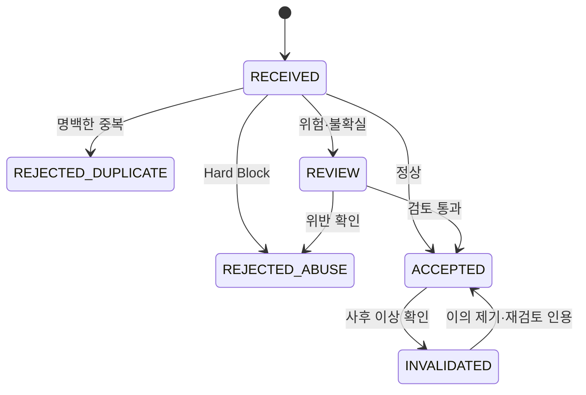

# WHICH 신원 및 투표 무결성 v2.0

- **문서 상태:** 상세 기획 검토본
- **버전:** 2.0
- **기준일:** 2026-08-17
- **기준 문서:**
  - `05_IDENTITY_AND_VOTE_INTEGRITY.md` v1
  - `01_PRODUCT_VISION_AND_PRINCIPLES_v2.md`
  - `02_CORE_UX_AND_USER_JOURNEYS_v2.md`
  - `03_ISSUE_SUPPLY_AND_CONTENT_PIPELINE_v2.md`
  - `04_ISSUE_TAXONOMY_QUALITY_AND_CONTROVERSY_v2.md`
  - `06_INTEREST_ONBOARDING_AND_PERSONALIZATION.md`
  - `07_RECOMMENDATION_AND_ML_ARCHITECTURE.md`
  - `09_MODERATION_AND_GOVERNANCE.md`
  - `10_METRICS_ANALYTICS_AND_EXPERIMENTS.md`
  - `13_GLOSSARY_AND_STATUS_MODEL.md`
- **문서 목적:** 가입 없는 일반 투표 경험을 유지하면서 중복 투표, 자동화, 다중 계정, 계정 탈취, 조직적 유입과 정치 여론조작의 비용을 높이고, 집계 결과를 감사·설명·복구할 수 있는 신원 및 Vote Integrity 체계를 정의한다.
- **문서 비범위:** 최종 물리 DB 스키마, 특정 CAPTCHA·본인확인 사업자 선정, 선거법·개인정보보호법에 대한 최종 법률 판단, 인프라 벤더 계약, 운영자 화면의 시각 디자인은 후속 기술·법률·조달 단계에서 확정한다.
- **법률 고지:** 개인정보·본인확인·정치·선거 관련 항목은 제품 설계 기준이며 법률 자문이 아니다. 실제 출시 전 대한민국 법률과 서비스 운영 범위에 맞춘 전문 검토가 필요하다.

---

## 0. 결정 상태 표기

| 표기 | 의미 |
|---|---|
| **[확정]** | 후속 제품·운영·ML·개발 설계의 기본 전제로 사용한다. |
| **[설계 기준]** | 원칙은 채택하되 세부 구현과 수치는 운영 검증으로 조정할 수 있다. |
| **[초기안]** | 출시 초기 실험 또는 캘리브레이션을 위한 가설이다. |
| **[미정]** | 별도의 명시적 의사결정, 법률 검토 또는 기술 검증이 필요하다. |
| **[금지]** | 제품 신뢰·안전·개인정보 원칙을 해치므로 채택하지 않는다. |

### 0.1 v2 주요 보강 내용

| 영역 | v1 | v2 보강 내용 |
|---|---|---|
| 신원 단계 | Guest / Member / Verified | 사용자 표시 단계는 유지하고, 계정 통제·유일성·신원증명·투표 신뢰를 별도 축으로 분리 |
| 익명 참여 | `anonymous_id` 중심 | 발급·회전·공유 기기·쿠키 삭제·로그아웃·복구 한계까지 수명주기 정의 |
| 투표 처리 | 1 Issue 1 Vote 개념 | Idempotency, 재시도, 동시 요청, Issue Version 결속, 정확한 중복 처리 계약 추가 |
| 투표 상태 | 5개 집계 상태 | 요청 처리 상태와 집계 무결성 상태를 분리하고 전이·사유 코드 정의 |
| 위험 판단 | Vote Risk Score | Feature 그룹, Hard Rule, 위험 구간, 정책 버전, 설명 가능성, False Positive 관리 추가 |
| Challenge | 위험 기반 CAPTCHA | 단계형 Challenge Ladder, 접근성, 재사용 방지, Provider 장애 처리 추가 |
| 조작 대응 | 좌표찍기 단계 대응 | 정상 바이럴과 조직 개입 비교, Issue Integrity State, 추천·결과·집계 동시 제어 추가 |
| 정치 | 강한 제한 원칙 | 기본 비활성, Verified-only 초기안, 실시간 증폭 차단, 집계 고지·잠금·감사 체계 구체화 |
| 개인정보 | 최소 저장 원칙 | 데이터 등급, IP·로그·행태정보, 정치 선택, 보존·삭제·접근통제 정책 구체화 |
| 운영 | KPI 중심 | Integrity Queue, Incident Playbook, Appeal, Audit, SLO, 테스트 시나리오 추가 |
| ML | 후속 Integrity ML | Rule-first, Shadow Mode, Label 품질, 추천 모델과 완전 분리하는 단계별 로드맵 추가 |

### 0.2 기존 문서와의 의존 관계

```text
04 Risk Level / Political Classification
                ↓
05 Identity Eligibility / Vote Integrity
                ↓
02 Vote UX State / Challenge UX
                ↓
07 Recommendation Eligibility / Integrity Penalty
                ↓
09 Moderation Queue / Audit / Incident
                ↓
10 Integrity KPI / Experiment Guardrail
```

이 문서의 정책은 다음 항목에 직접 영향을 준다.

- 어떤 사용자가 어떤 Issue에 투표할 수 있는가
- 투표 요청이 정상 집계에 포함되는가
- 결과에 표시되는 표의 범위가 무엇인가
- 추천 모델이 어떤 Issue와 이벤트를 학습에 사용할 수 있는가
- 정치·선거 Issue가 어떤 조건에서 활성화되는가
- 운영자가 어떤 증거와 사유를 바탕으로 표를 무효화하거나 복구하는가
- 어떤 개인정보·행태정보를 얼마나 저장하는가

---

# 1. 문서의 역할과 핵심 목표

## 1.1 해결하려는 제품 긴장

WHICH에는 서로 충돌하는 두 목표가 있다.

```text
목표 A
가입 없이 한 번 눌러 바로 투표

목표 B
한 사람 또는 한 참여 주체가 같은 Issue에 반복 개입하기 어렵게 함
```

Guest 투표를 허용하면 완전한 사람 단위 `1인 1표`를 기술적으로 보장할 수 없다. 반대로 모든 일반 질문에 휴대전화 본인확인과 CAPTCHA를 요구하면 WHICH의 첫 가치 경험이 무너진다.

따라서 WHICH의 목표는 다음과 같다.

> **정상 사용자는 최소한의 마찰로 참여시키고, 반복·자동·조직적 개입은 더 많은 자원과 비용을 요구하게 하며, 의심 표와 정상 표를 삭제 없이 구분해 감사 가능한 집계를 유지한다.**

## 1.2 한 줄 목표

```text
Low Friction for Normal Users
+
High Cost for Manipulation
+
Auditable and Reversible Tally
```

## 1.3 성공 조건

다음 조건을 함께 만족해야 한다.

1. LOW·일반 Issue의 Guest Vote Conversion이 과도하게 낮아지지 않는다.
2. 같은 브라우저·계정의 명백한 중복 요청은 정상 집계에 두 번 포함되지 않는다.
3. 쿠키 삭제·다중 계정·분산 자동화를 하나의 신호만으로 과신하지 않는다.
4. 정상 바이럴을 즉시 공격으로 오판하지 않는다.
5. 공격이 발생해도 추천 증폭과 논쟁 피드 진입을 빠르게 차단한다.
6. `ACCEPTED`, `REVIEW`, `REJECTED`, `INVALIDATED`의 수를 구분해 재검토할 수 있다.
7. 정치·선거 결과는 Verified와 강화된 무결성 정책 없이 일반 투표처럼 운영되지 않는다.
8. 정치 선택, 로그, 네트워크 정보와 행태정보를 최소한으로 수집하고 접근을 제한한다.
9. False Positive로 정상 사용자가 막혔을 때 복구·이의 제기 경로가 존재한다.
10. 모델·규칙·정책 버전이 모든 투표 결정과 연결된다.

## 1.4 비목표

다음은 이 문서의 목표가 아니다.

- 일반 Guest 투표에서 국가 선거 수준의 법적 `1인 1표` 보장
- IP 하나를 사람 한 명으로 판단
- 모든 VPN·프록시·공유망 사용자를 차단
- A 또는 B의 결과 방향을 근거로 조작 판정
- 사용자의 정치 성향 프로필 생성
- 영구적이고 침습적인 기기 Fingerprint로 사용자를 추적
- CAPTCHA 하나로 모든 자동화 방어
- 무결성 Score를 사용자에게 공개해 공격자가 역설계하도록 함
- 추천 Engagement를 높이기 위해 의심 투표를 정상 Label로 학습
- 블록체인 도입 자체를 무결성 보장의 대체물로 사용

---

# 2. 외부 기준을 반영한 설계 원칙

이 절은 기존 WHICH 합의가 아니라, 2026-08-17 기준 외부 기술·개인정보 기준을 설계에 반영한 부분이다.

## 2.1 신원증명과 인증 강도를 분리한다

**[외부 기준 참고 E1]** NIST Digital Identity Guidelines는 `Identity Proofing`, `Authentication`, `Federation`의 보증 수준을 분리해 위험에 맞게 선택한다.

WHICH도 다음을 같은 개념으로 취급하지 않는다.

```text
계정을 통제하고 있음
≠
현실의 특정 사람임이 확인됨
≠
다른 계정과 중복되지 않는 참여 주체임
≠
이번 투표 요청이 정상임
```

따라서 `Member`라고 해서 사람 단위 유일성을 자동 보장하지 않으며, `Verified Member`라고 해서 모든 요청을 무조건 정상으로 집계하지 않는다.

## 2.2 자동화는 취약점 공격뿐 아니라 정상 기능의 남용이다

**[외부 기준 참고 E2]** OWASP Automated Threats는 정상 웹 기능을 자동화해 기대 행동과 다른 결과를 만드는 행위도 별도 위협으로 분류하며, 결과나 지표를 왜곡하는 `Skewing`, 자동 계정 생성, CAPTCHA 우회 등을 포함한다.

WHICH의 투표 API는 정상 기능이므로 다음도 보안 문제다.

- 정상 Endpoint를 봇이 반복 호출
- 다중 계정을 자동 생성해 각 계정으로 1표씩 행사
- CAPTCHA를 외부 해결 서비스로 우회
- 여러 IP로 분산해 단순 Rate Limit을 회피
- 정상 User-Agent를 흉내 내지만 Issue 소비 흐름 없이 투표만 호출
- 특정 결과를 추천·논쟁·인기 지표까지 증폭

## 2.3 강한 인증은 필요 기능에만 단계적으로 적용한다

**[외부 기준 참고 E1, E3]** 강한 인증과 공개키 기반 인증은 계정 탈취 위험을 줄이는 수단이지만, 현실의 한 사람당 계정 하나를 자동 보장하지는 않는다.

WHICH에서 Passkey 또는 MFA는 다음에 적합하다.

- 계정 탈취 방지
- 정치·Restricted 투표 전 Step-up Authentication
- 운영자·Moderator 계정 보호
- Verification 설정 변경
- 계정 연결·삭제 같은 고위험 행동

그러나 Passkey만으로 `한 사람당 하나의 정치 투표`를 주장하지 않는다.

## 2.4 로그와 온라인 행태정보도 개인정보가 될 수 있다

**[외부 기준 참고 E4]** 대한민국 개인정보 안내 기준에서는 서비스 이용 중 생성되는 로그기록과 이용행태 정보도 개인정보가 될 수 있고, 정치적 견해·정당 활동 등은 특히 민감한 정보 범주로 다뤄질 수 있다.

따라서 다음을 적용한다.

- `anonymous_id`라는 이름이 법적 익명성을 뜻하지 않는다.
- IP를 단순 Hash했다고 익명정보라고 주장하지 않는다.
- 정치 선택은 일반 취향 데이터보다 높은 데이터 등급을 적용한다.
- 추천 목적과 무결성 목적의 행태정보를 논리적으로 구분한다.
- 수집 목적·보존 기간·접근권한을 문서화한다.
- 필요하지 않은 이름·생년월일·주민등록번호를 직접 수집하지 않는다.

---

# 3. 위협 모델

## 3.1 보호할 자산

| 자산 | 설명 | 손상 시 영향 |
|---|---|---|
| 정상 집계 | 실제 정책상 허용된 표의 합계 | 결과 신뢰 붕괴 |
| Issue 결과 | A/B 비율과 참여 수 | 잘못된 사회적 신호 |
| 추천 순위 | 인기·급상승·논쟁·For You | 공격의 자기증폭 |
| 사용자 계정 | 투표 기록·댓글·Verification | 계정 탈취와 대리 투표 |
| 정치 선택 기록 | 개인의 Restricted 선택 | 민감정보 침해 |
| 익명 식별 정보 | `anonymous_id`, Session, Risk Signal | 추적·재식별 위험 |
| 운영 판단 | 무효화·복구·잠금 결정 | 편파 운영 의심 |
| Audit Evidence | 어떤 규칙으로 무엇을 처리했는가 | 사후 검증 불가 |
| Integrity Model | 위험 판정 규칙·Feature·Version | 우회·Data Poisoning |
| Verification Handle | 중복 참여를 제한하는 내부 값 | 계정 연결·프라이버시 위험 |

## 3.2 공격자 유형

| 공격자 | 목표 | 일반 수단 |
|---|---|---|
| 호기심성 중복 참여자 | 같은 Issue에 여러 번 투표 | 쿠키 삭제, 다른 브라우저 |
| 자동화 사용자 | 표 수를 빠르게 증가 | Script, Headless Browser |
| Account Farmer | 다수 계정을 준비 | 일회성 이메일, OAuth 계정 |
| 외부 커뮤니티 집단 | 특정 Issue를 한 방향으로 밀기 | 좌표찍기, 링크 공유 |
| 정치 캠페인·이해관계자 | 결과와 추천을 장기 조작 | 계정·번호·프록시·인력 동원 |
| Credential Attacker | 타인 계정으로 참여 | Credential Stuffing, Session 탈취 |
| 내부 권한 남용자 | 표·상태를 임의 변경 | 관리자 권한 악용 |
| 경쟁 서비스·트래픽 공격자 | 서비스 신뢰와 가용성 훼손 | API Flood, 결과 오염 |
| Model Adversary | Integrity Model 학습 교란 | 의도적 정상·이상 패턴 혼합 |

## 3.3 공격 목표

공격자는 단순히 `표 1개 추가`만 노리지 않을 수 있다.

```text
Vote Skew
→ A/B 결과 왜곡

Popularity Skew
→ 인기 피드 진입

Controversy Skew
→ 50:50 접전으로 조정

Velocity Skew
→ 급상승 신호 생성

Comment / Report Coordination
→ 반대 의견 제거 또는 운영 부담 증가

Data Poisoning
→ 추천·Integrity ML의 학습 Label 오염

Trust Erosion
→ 조작 의혹만으로 WHICH 신뢰 훼손
```

## 3.4 주요 Abuse Case

### A. 같은 브라우저 재투표

```text
투표
→ 새로고침
→ 동일 요청 재전송
```

Idempotency와 Unique Constraint로 처리한다.

### B. 쿠키 삭제 반복

```text
투표
→ Cookie 삭제
→ 새로운 anonymous_id
→ 재투표
```

Guest 모델의 한계다. Network·행동·Device Risk Signal로 비용을 높이되 완전 차단을 주장하지 않는다.

### C. 여러 브라우저·기기 사용

한 사람이 Chrome, Edge, Mobile을 사용해 각각 Guest 투표할 수 있다. 일반 LOW Issue에서는 허용되는 잔여 위험으로 관리할 수 있다.

### D. 다중 계정 생성

OAuth 또는 이메일 계정을 다수 만들어 Member별로 투표한다. 계정 연령·생성 속도·행동 다양성·Verification을 결합한다.

### E. 분산 Botnet

다수 IP와 기기로 정상 사용자처럼 보이게 요청한다. 단일 IP Rate Limit만으로 방어하지 않는다.

### F. 좌표찍기

실제 사람들이 특정 커뮤니티 링크를 타고 한 Issue에 집중한다. 자동화가 아니어도 결과의 대표성을 왜곡하고 추천 증폭을 일으킬 수 있다.

### G. 정상 바이럴

인플루언서 공유로 짧은 시간 대량 유입되지만 실제 사람이 자발적으로 참여한다. 좌표찍기와 구분이 어려우므로 즉시 무효화하지 않는다.

### H. 계정 탈취

정상 Member 또는 Verified 계정을 공격자가 사용한다. 로그인 보안·Step-up·이상 세션 탐지가 필요하다.

### I. Replay

동일한 Vote Request 또는 Challenge Token을 반복 사용한다. Idempotency Key, 만료, Nonce, Server-side Used 상태로 차단한다.

### J. 내부 조작

운영자가 임의로 투표 상태를 바꾸거나 Audit를 삭제한다. 역할 분리, Append-only Audit, 고위험 이중 승인으로 통제한다.

## 3.5 위험도별 허용 가능한 잔여 위험

| Issue Risk | 기본 허용 모델 | 허용 가능한 잔여 위험 |
|---|---|---|
| LOW | Guest Vote | 일부 브라우저·기기 중복 가능 |
| MEDIUM | Guest 또는 Member | 이슈별 강화 조건 적용 |
| HIGH | Member 또는 Verified | 익명 대량 참여 제한 |
| RESTRICTED | 기본 비활성, 활성 시 Verified-only 초기안 | 사람 조직 동원 가능성은 별도 감시 |

**[확정]** 동일한 Integrity 강도를 모든 Issue에 적용하지 않는다.

---

# 4. 핵심 무결성 원칙

## 4.1 일반 영역에서 `완전한 1인 1표`를 과장하지 않는다

Guest 투표 결과에는 다음 의미를 갖는다.

> 해당 정책과 무결성 검사를 통과한 WHICH 참여 요청의 집계

다음 의미를 주장하지 않는다.

> 법적으로 식별된 사람 한 명당 정확히 한 표

## 4.2 IP는 신원이 아니라 위험 신호다

```text
같은 IP = 같은 사람
```

으로 판단하지 않는다.

회사·학교·카페·가정·이동통신망·CGNAT 환경에서는 여러 사람이 같은 공인 IP를 사용할 수 있다.

## 4.3 선택 방향이 아니라 행동을 본다

**[확정]** A가 갑자기 90%가 되었다는 사실만으로 이상 투표로 판단하지 않는다.

다음이 판단 근거다.

- 요청 속도
- 세션 수명
- Issue 소비 흐름
- 계정 생성 패턴
- Network 집중도
- Challenge 결과
- Token 재사용
- 특정 Issue 집중도
- 다수 신호의 조합

## 4.4 정상 사용자에게 기본 CAPTCHA를 요구하지 않는다

Challenge는 위험 기반으로 단계적으로 적용한다.

## 4.5 모든 요청을 보존하되 모든 요청을 집계하지 않는다

```text
Vote Request
≠
Accepted Vote
≠
Displayed Vote
```

삭제보다 상태 분리를 우선한다.

## 4.6 정치·선거는 Fail-Closed로 운영한다

요건이 불완전하면 투표를 열지 않는다.

```text
Verified Provider 장애
→ Guest로 임시 완화
```

는 허용하지 않는다.

```text
Verified Provider 장애
→ Restricted 신규 투표 일시 중단
```

으로 처리한다.

## 4.7 개인정보 최소화가 무결성보다 후순위가 아니다

조작 방지를 이유로 불필요한 장기 추적과 정치 성향 데이터 축적을 정당화하지 않는다.

## 4.8 무결성 결정은 설명·재현 가능해야 한다

각 결정에는 다음을 남긴다.

```text
policy_version
risk_model_version
feature_version
reason_codes[]
decision
decided_at
```

## 4.9 추천보다 Eligibility가 먼저다

```text
Integrity Eligibility
→ ML Ranking
→ Policy Re-ranking
```

의심 상태의 표로 인기·논쟁·급상승이 자동 증폭되지 않게 한다.

## 4.10 Verified도 절대 신뢰하지 않는다

Verified는 유일성 신호를 높일 뿐 다음을 보장하지 않는다.

- 계정 공유가 없음
- 보상 받고 투표하지 않음
- 조직적 캠페인에 참여하지 않음
- 계정이 탈취되지 않음
- Verification 수단이 완벽히 유일함

---

# 5. 신원과 보증 수준의 다축 모델

## 5.1 사용자에게 보이는 단계

기존 제품 언어는 유지한다.

```text
Guest
Member
Verified Member
```

## 5.2 내부적으로 분리할 축

| 축 | 질문 | 예 |
|---|---|---|
| Continuity | 같은 브라우저·세션이 다시 왔는가 | anonymous_id |
| Account Control | 등록 계정을 현재 통제하는가 | OAuth Session, Passkey |
| Uniqueness | 다른 계정과 중복되지 않는 참여 주체인가 | Verification Handle |
| Identity Proofing | 현실의 특정 신원과 연결됐는가 | 외부 본인확인 |
| Request Integrity | 이번 Vote Request가 정상인가 | Risk Score |
| Eligibility | 이 Issue에 투표할 자격이 있는가 | Risk Policy |

## 5.3 내부 보증 상태 초기안

```text
continuity_level:
  NONE
  BROWSER
  RETURNING_BROWSER

account_assurance:
  NONE
  BASIC_SESSION
  RECENT_REAUTH
  STRONG_AUTH

uniqueness_assurance:
  NONE
  ACCOUNT_ONLY
  EXTERNAL_UNIQUENESS_VERIFIED

identity_proofing:
  NONE
  PROVIDER_ASSERTED
  ENHANCED_REVIEW

vote_confidence:
  LOW
  STANDARD
  ELEVATED
  REVIEW_REQUIRED
```

사용자 화면에 모든 내부 값을 노출하지 않는다.

## 5.4 Member와 Verified의 정확한 의미

### Member

```text
계정이 존재하고
현재 세션이 해당 계정을 통제한다는 기본 신뢰
```

Member는 사람 단위 유일성을 의미하지 않는다.

### Verified Member

```text
외부 또는 내부 정책을 통해
정해진 범위의 추가 확인을 통과한 Member
```

`Verified`의 Scope를 저장한다.

```text
verification_scope:
  ACCOUNT_RECOVERY
  AGE
  REGION
  UNIQUENESS
  RESTRICTED_VOTE
```

**[금지]** Verification 목적이 다른데 하나의 `verified=true` Boolean으로 모든 권한을 허용하지 않는다.

---

# 6. 권한 및 Eligibility 정책

## 6.1 기본 권한 매트릭스

| 기능 | Guest | Member | Verified Member |
|---|---:|---:|---:|
| LOW 일반 Issue 읽기 | 허용 | 허용 | 허용 |
| LOW 일반 Issue 투표 | 허용 | 허용 | 허용 |
| MEDIUM Issue 투표 | 기본 허용 | 허용 | 허용 |
| HIGH Issue 투표 | 제한 후보 | 허용 후보 | 허용 |
| RESTRICTED Issue 투표 | 불가 | 불가 초기안 | 허용 후보 |
| 결과 확인 | 허용 | 허용 | 허용 |
| 댓글 읽기 | 허용 | 허용 | 허용 |
| 일반 댓글 작성 | 불가 | 허용 | 허용 |
| HIGH 댓글 작성 | 불가 | 제한 | 허용 |
| RESTRICTED 댓글 작성 | 불가 | 불가 초기안 | 허용 후보 |
| Issue 생성 | 불가 | 허용 | 허용 |
| 정치 Issue 직접 생성 | 불가 | 불가 | 불가 또는 제안만 |
| 투표 기록 기기 간 저장 | 불가 | 허용 | 허용 |
| Creator 팔로우 | 인증 유도 | 허용 | 허용 |

## 6.2 Issue별 Eligibility Contract

각 Published Issue는 게시 전에 다음을 고정한다.

```text
minimum_user_tier
minimum_account_assurance
minimum_uniqueness_assurance
challenge_policy
geo_policy
age_policy
vote_open_at
vote_close_at
integrity_policy_version
```

## 6.3 Risk Level별 초기 정책

### LOW

- Guest Vote 허용
- 추가 Challenge 없음이 기본
- 명백한 중복·자동화만 차단
- 유희형 첫 세션에 적합

### MEDIUM

- Guest Vote 기본 허용
- Issue별 유입 급증 시 Adaptive Challenge
- Source·행동·Network Signal 강화
- 위험 상승 시 신규 Guest Vote 일시 제한 가능

### HIGH

- Member 이상을 기본 후보로 검토
- 신규 계정·낮은 Account Assurance에 Step-up 가능
- 결과·추천의 Integrity Threshold 강화
- 운영자가 사전에 정책을 승인

### RESTRICTED

**[초기안]**

```text
Guest             불가
Member            불가
Verified Member   정책 충족 시 허용
```

정치·선거는 별도 Section 25의 추가 요건을 모두 충족해야 한다.

## 6.4 상태에 따른 Eligibility

| Issue 상태 | 읽기 | 신규 투표 | 결과 |
|---|---:|---:|---:|
| PUBLISHED | 허용 | 정책상 허용 | 허용 |
| LIMITED | 허용 후보 | 제한 | 허용 또는 제한 |
| UNDER_REVIEW | 허용 후보 | 기본 중단 | 잠금 후보 |
| RESULT_LOCKED | 허용 | 정책별 | 정확 비율 잠금 |
| CLOSED | 허용 | 불가 | 허용 |
| REMOVED | 제한 안내 | 불가 | 정책별 |
| ARCHIVED | 허용 | 불가 | 허용 |

---

# 7. Guest 신원 수명주기

## 7.1 `anonymous_id`의 목적

`anonymous_id`는 다음을 위한 First-party 내부 식별자다.

- 같은 브라우저에서 이미 투표한 Issue 확인
- 로그인 전 투표 기록 연결
- 세션 연속성
- 기본 중복 방지
- 추천 관심사와 노출 기록 연결
- 위험 신호 집계

**[중요]** 제품 용어는 `anonymous_id`지만 법적·보안적으로는 가명 또는 온라인 식별자에 가까울 수 있다.

## 7.2 발급 원칙

- 충분히 예측하기 어려운 Random Identifier 사용
- IP·User-Agent·Canvas 값으로 직접 생성하지 않음
- 첫 Party Cookie 또는 안전한 저장소 사용
- 다른 사이트에서 재사용하지 않음
- URL Query에 노출하지 않음
- 로그에 원문을 무분별하게 남기지 않음
- Server-side Subject Key와 분리 가능

개념 예:

```text
browser_cookie_id: 무작위 값
server_anon_subject_id: 내부 매핑 또는 Keyed Derivation
```

## 7.3 Cookie 정책 초기안

```text
Secure
HttpOnly
SameSite=Lax 또는 기능상 필요한 안전 설정
Path=/
```

Client가 반드시 읽어야 하는 별도 상태는 민감한 주체 ID와 분리한다.

## 7.4 수명과 회전

| 상황 | 정책 |
|---|---|
| 신규 방문 | 새 anonymous_id 발급 |
| 정상 재방문 | 기존 ID 유지 |
| 쿠키 만료 | 새 ID 발급 |
| 사용자가 데이터 초기화 | 기존 연계 해제 |
| 로그인 성공 | Member Session 우선, Guest 병합 선택 |
| 로그아웃 | 공유 기기 보호를 위해 Guest ID 회전 후보 |
| 보안 사고 | 특정 범위 ID 강제 회전 |
| 장기 미사용 | 만료·Pseudonymization |

## 7.5 공유 기기 원칙

같은 브라우저를 여러 사람이 사용할 수 있다.

따라서 중복 안내 문구는 다음처럼 표현한다.

> 이 브라우저에서는 이미 이 이슈에 참여했습니다.

다음처럼 표현하지 않는다.

> 당신은 이미 투표했습니다.

로그아웃 시 다음을 검토한다.

```text
Member Session 종료
→ 기존 계정 기록 화면 제거
→ 새 anonymous_id 발급 또는 Guest 상태 초기화
```

## 7.6 Cookie 삭제 한계

쿠키 삭제 후 새 Guest로 투표할 가능성을 완전히 막지 못한다. 이 잔여 위험은 일반 LOW Issue에서 허용할 수 있으나 다음 신호와 결합한다.

- Network Bucket
- Vote Context Token
- 요청 속도
- 같은 Issue 집중
- 세션 행동
- Device Risk Token
- Challenge 이력

## 7.7 Guest 데이터 복구

Guest가 쿠키를 삭제하거나 기기를 바꾸면 투표 기록 복구를 보장하지 않는다.

회원가입 유도 가치는 다음처럼 설명한다.

> 계정으로 시작하면 기기를 바꿔도 투표 기록과 관심 주제를 이어갈 수 있습니다.

---

# 8. Member 인증과 계정 보안

## 8.1 기본 가입 방식

MVP Provider 상태:

```text
Google OIDC — 운영
X OAuth 2.0 + PKCE — 운영
Naver OIDC + PKCE — 코드 제공, Client 등록·검수 후 노출
Apple Sign in — Post-MVP 후보
```

Provider는 로그인 수단일 뿐 유입 출처를 뜻하지 않는다. 예를 들어 네이버로 로그인한 사용자를 자동으로 네이버 채널 유입으로 분류하지 않고, 유입은 별도 `entry_source`와 UTM으로 판정한다.

## 8.2 Social Login 원칙

- Provider의 사용자 식별자를 내부 `identity_link`로 매핑
- 이메일 주소만으로 계정을 자동 병합하지 않음
- Provider별 Subject Identifier를 기준으로 연결
- 계정 연결 전 기존 세션 재인증
- Provider Access Token을 서비스 목적상 필요하지 않으면 장기 저장하지 않음
- Refresh Token 저장이 필요하면 별도 암호화·접근통제
- OAuth Callback의 State, Nonce, PKCE 등 표준 보호 적용
- 탈퇴·연결 해제 시 관계를 명확히 처리

## 8.3 계정 연결 공격 방지

예:

```text
공격자가 자신의 Google 계정으로 로그인
→ 피해자의 기존 WHICH 계정에 임의 연결
```

방지:

- 기존 계정의 최근 인증 요구
- 신규 Provider 소유 확인
- 연결 전·후 알림
- 연결 이력 Audit
- 민감 설정 변경 Cooling-off 후보

## 8.4 Passkey와 MFA

**[설계 기준]** 다음 기능에 Passkey 또는 MFA를 우선 검토한다.

- Moderator·Admin 로그인
- RESTRICTED Vote Step-up
- Verification 변경
- 계정 복구 설정 변경
- 데이터 내보내기·삭제
- 의심 세션 재인증

Passkey는 강한 Account Control 수단이지만 유일한 사람 확인 수단으로 사용하지 않는다.

## 8.5 Session 관리

- 짧은 수명의 Access Session
- 안전한 Refresh Rotation
- 세션별 Device·Network 변화 감시
- `모든 기기에서 로그아웃`
- 활성 세션 목록
- 의심 세션 강제 종료
- 세션 토큰 로그 출력 금지
- 세션 Cookie에 Secure·HttpOnly 적용
- CSRF 방어
- 로그인 후 Session Fixation 방지

## 8.6 계정 탈취 대응

다음 신호를 결합한다.

- 짧은 시간의 원거리·Network 변화
- 새 기기에서 즉시 RESTRICTED 투표
- 다수 Issue에 비현실적 속도로 투표
- 로그인 실패 폭증
- Provider 연결 변경
- Passkey 제거
- Verification 재설정

대응:

```text
일반 읽기 유지
→ 고위험 기능 Step-up
→ 의심 세션 종료
→ 계정 보호 알림
→ 필요 시 투표 REVIEW
```

---

# 9. Verified Member 설계

## 9.1 Verified의 목적

Verified는 다음 문제를 줄이기 위한 수단이다.

- 한 사용자가 다수 계정으로 RESTRICTED 투표
- 신규 계정 대량 생성
- 계정 탈취 후 고위험 참여
- 특정 지역·연령 등 정책상 Eligibility 확인

Verified의 목적은 사용자의 정치 성향을 확인하는 것이 아니다.

## 9.2 Verification 방식 후보

| 방식 | 확인 가능한 것 | 한계 |
|---|---|---|
| 휴대전화 소유 확인 | 번호 또는 기기 접근 | 한 사람이 여러 번호 보유 가능 |
| 외부 본인확인 사업자 | 제공 Scope에 따른 신원·유일성 | 비용·법률·보존 정책 필요 |
| Passkey | 계정 통제 강도 | 사람 단위 유일성 아님 |
| 결제수단 소액 인증 | 결제수단 통제 | 접근성·유일성·민감성 문제 |
| 운영자 Enhanced Review | 특수 사례 | 확장성 낮음 |
| 기관·파트너 자격 Assertion | 특정 그룹 자격 | 일반 사용자에 부적합 |

**[초기 권고]** 정치·선거의 사람 단위 유일성 요구가 있다면 외부 본인확인 또는 이에 준하는 유일성 Assertion 없이는 투표 기능을 열지 않는다.

## 9.3 최소 저장 원칙

가능하면 WHICH는 다음만 저장한다.

```text
verification_provider
verification_scope
verification_status
verified_at
expires_at
provider_transaction_reference
provider_uniqueness_handle
verification_policy_version
```

다음은 기능상 필요하지 않다면 저장하지 않는다.

- 주민등록번호
- 신분증 이미지
- 전체 생년월일
- 전체 실명
- 주소
- 원본 인증 문서

## 9.4 Verification 상태

```text
NONE
PENDING
VERIFIED
EXPIRED
REVOKED
FAILED
MANUAL_REVIEW
```

## 9.5 유일성 제약

**[설계 기준]** 동일 `provider_uniqueness_handle`이 여러 활성 계정에 연결되는 것을 제한한다.

가능한 처리:

```text
기존 계정 존재
→ 신규 계정 Verification 중단
→ 계정 복구 또는 병합 경로 안내
```

공개적으로 어떤 계정이 연결됐는지 노출하지 않는다.

## 9.6 재인증 조건

- Verification 만료
- 고위험 정책 버전 변경
- Provider Revocation
- 장기간 미사용 후 RESTRICTED 참여
- 계정 복구 직후
- 의심 세션
- 핵심 개인정보·연결 설정 변경
- 운영상 Incident

## 9.7 Provider 장애

```text
Verification Provider 장애
→ 신규 Verification 일시 중단
→ 기존 유효 Verification 정책상 사용 여부 판단
→ RESTRICTED Guest/Member 완화 금지
```

## 9.8 접근성·배제 위험

Verification은 다음 사용자를 배제할 수 있다.

- 본인 명의 번호가 없는 사용자
- 해외 체류자
- 미성년자
- Provider 장애 사용자
- 인증 접근성이 낮은 사용자

따라서 일반 LOW Issue는 Verified를 요구하지 않으며, Restricted 서비스의 범위와 가치가 이 배제를 정당화하는지 출시 전에 검토한다.

---

# 10. 데이터 등급과 개인정보 원칙

## 10.1 데이터 분류

| 등급 | 예 | 기본 정책 |
|---|---|---|
| PUBLIC | Issue, 공개 댓글, 집계 결과 | 공개 가능 |
| INTERNAL | Policy Version, 일반 Risk Score | 직원 제한 |
| PERSONAL | user_id, anonymous_id, Session, 로그 | 목적·보존 제한 |
| HIGHLY_RESTRICTED | 정치 선택, Verification Handle, 원본 네트워크 로그 | 최소 인원 접근 |
| SECURITY_SECRET | HMAC Key, Token Signing Key, Provider Secret | Secret Manager |

## 10.2 정치 선택 데이터

**[확정]** 정치·RESTRICTED 선택 기록은 공개 프로필에 노출하지 않는다.

- 본인 전용 기록도 기본 보호
- 내부 조회 권한 제한
- Analytics에서는 최소 집계 단위 사용
- 개인 정치 성향 Feature 생성 금지
- 광고 Targeting 사용 금지
- 외부 판매·제공 금지
- 운영자도 업무상 필요 없이 개별 선택 열람 금지

## 10.3 IP와 Network 정보

원칙:

- IP는 사람 ID가 아니다.
- 원본 IP 장기 보존을 기본값으로 하지 않는다.
- 단순 Hash만으로 익명화를 주장하지 않는다.
- 가능하면 Keyed HMAC와 Key Rotation을 사용한다.
- 원본과 파생 Network Bucket의 접근 권한을 분리한다.
- 도시 단위 이상의 정밀 위치 추론은 필요성 검토 없이 사용하지 않는다.
- VPN·Tor 여부는 단독 차단 근거가 아니다.

## 10.4 Device Risk 정보

**[금지]** 광고 추적 수준의 장기·Cross-site Fingerprint를 구축하지 않는다.

허용 후보:

- First-party Ephemeral Device Risk Token
- Browser Family·OS Major Version 같은 낮은 정밀도
- 자동화 여부 신호
- Token 재사용
- Cookie·Storage 상태
- Challenge 수행 이력

고정밀 Canvas·Font·Audio Fingerprinting은 법률·프라이버시 검토 없이 사용하지 않는다.

## 10.5 목적 분리

```text
추천 목적 Event
무결성 목적 Event
보안 감사 Event
```

를 논리적으로 분리한다.

추천 시스템이 필요로 하지 않는 원본 Network Signal을 추천 Feature로 넘기지 않는다.

## 10.6 접근 통제

- Role-based Access Control
- 정치 선택과 Verification 정보 별도 권한
- 운영자 조회 자체 Audit
- 대량 Export 제한
- Production 직접 Query 최소화
- Break-glass 권한과 사후 검토
- 개발 환경에 원본 개인정보 복제 금지


---

# 11. Vote Contract

## 11.1 Vote의 의미

하나의 Vote는 다음 계약을 갖는다.

```text
특정 Issue Version
+
특정 Choice A 또는 B
+
특정 Eligibility Snapshot
+
특정 Voter Subject
+
정해진 Integrity Policy
```

## 11.2 기본 불변 조건

- Issue에는 A/B 두 Choice만 존재
- 첫 정상 투표 후 A/B 의미와 위치 불변
- 하나의 정책상 Voter Subject는 같은 Issue에 정상 Vote 하나
- Vote는 사용자 명시적 행동으로만 생성
- 화면 노출·클릭·댓글만으로 Vote 생성 금지
- Choice는 `A | B` 외 값 금지
- 서버가 Issue 상태와 Eligibility를 재확인
- Client 값만 신뢰하지 않음

## 11.3 투표 가중치

**[확정]** 일반 공개 결과에서 Accepted Vote는 기본적으로 동일한 1표다.

Verified라고 가중치를 높이지 않는다.

필요하다면 다음처럼 완전히 분리해 표시한다.

```text
전체 정책상 정상 참여 결과
Verified 참여자 결과
```

그러나 두 값을 섞어 가중 평균으로 보여주지 않는다.

## 11.4 투표 변경 정책

**[초기 권고]** MVP에서는 `ACCEPTED` 후 Choice 변경을 허용하지 않는다.

이유:

- 중복·변경 Event를 단순화
- 결과 조작 전략 감소
- 첫 선택의 독립성 유지
- Audit 용이
- UX와 집계 계약 명확

대신 오투표를 줄이기 위해 `선택 즉시 제출`과 `확인 제출`을 프로토타입으로 검증한다.

향후 변경을 허용한다면 다음 조건이 필요하다.

- 투표 종료 전
- 변경 횟수 제한
- 이전 선택 Audit 유지
- 최종 선택만 집계
- 결과를 본 후 변경할 수 있는 편향 검토
- RESTRICTED에서는 별도 금지 또는 Cooling-off

## 11.5 Issue 종료

다음 이후에는 신규 Vote를 받지 않는다.

- `vote_close_at` 도달
- Issue `CLOSED`
- `UNDER_REVIEW` 정책상 잠금
- Source 전제 붕괴
- Integrity Incident
- 정치 운영 결정

## 11.6 Eligibility Snapshot

투표 당시 다음을 기록한다.

```text
user_tier
account_assurance
uniqueness_assurance
issue_risk_level
eligibility_policy_version
verification_scope
```

나중에 사용자 상태가 변해도 당시 정책을 재현할 수 있어야 한다.

---

# 12. 투표 요청 처리 흐름

## 12.1 정상 흐름

```text
Issue 실제 노출
→ Vote Context Token 발급
→ 사용자 A/B 선택
→ vote_attempt_id 생성
→ POST Vote
→ Issue·Choice·Eligibility 확인
→ Idempotency 확인
→ Duplicate 확인
→ Hard Rule
→ Risk Evaluation
→ 필요 시 Challenge
→ Transactional Write
→ Aggregate Update
→ 결과 응답
→ Event 기록
```

## 12.2 Vote Context Token

**[설계 기준]** 투표 요청에는 짧은 수명의 Server-signed Context Token을 포함한다.

포함 후보:

```text
issue_id
issue_version
session_id 또는 subject binding
issued_at
expires_at
nonce
policy_version
```

목적:

- Issue 페이지를 거치지 않은 API 직접 호출 비용 증가
- 다른 Issue Token 재사용 방지
- 오래된 Issue Version 투표 방지
- Replay 탐지

Token만으로 사람 여부를 보장하지 않는다.

## 12.3 Idempotency

Client는 각 투표 의도에 `vote_attempt_id` 또는 `Idempotency-Key`를 생성한다.

동일 Key 재요청:

```text
첫 요청 결과 반환
새 Vote 생성 금지
```

Network Timeout이 발생해도 사용자가 같은 선택을 다시 누를 때 두 표가 생성되지 않게 한다.

## 12.4 서버 검증 순서 초기안

1. Request 형식 검증
2. Issue 존재·Version 검증
3. Issue 상태·투표 기간
4. Choice가 해당 Issue에 속하는지 확인
5. Session·Authentication 검증
6. Eligibility 확인
7. Context Token 검증
8. Idempotency 조회
9. Voter Subject 중복 조회
10. Hard Abuse Rule
11. Risk Score
12. Challenge 필요 여부
13. Transaction Write
14. Aggregate·Event 처리

## 12.5 동시 요청

두 Tab에서 동시에 A와 B를 제출할 수 있다.

서버는 DB Transaction과 Unique Constraint로 하나만 Accepted 처리한다.

두 번째 요청은:

```text
REJECTED_DUPLICATE
+
기존 Accepted Choice 반환 정책
```

으로 처리한다.

## 12.6 성공 여부 불명확

Client Timeout 시:

```text
POST 실패처럼 보임
→ GET /vote-status 또는 동일 Idempotency 재요청
→ 기존 결과 확인
```

무조건 새 Vote를 생성하지 않는다.

## 12.7 Replay 방지

- Context Token 만료
- Nonce 또는 Token 사용 상태
- Idempotency Key
- Issue Version Binding
- Session Binding
- Challenge Token 1회 사용
- Signed Payload 검증

## 12.8 오류 응답의 안정성

공개 API는 공격자가 내부 규칙을 세밀하게 역설계하지 못하도록 Reason을 적절히 추상화한다.

운영 내부에는 상세 Reason Code를 남긴다.

---

# 13. Voter Subject와 중복 기준

## 13.1 Guest Voter Subject

기본:

```text
issue_id + anonymous_subject_id
```

## 13.2 Member Voter Subject

기본:

```text
issue_id + user_id
```

## 13.3 Verified Voter Subject

정치·RESTRICTED 초기안:

```text
issue_id + verified_uniqueness_handle
```

실제 Vote 레코드는 `user_id`와 연결하되, 동일 Verification Handle이 여러 계정으로 중복 Accepted되지 않게 한다.

## 13.4 중복 유형

| 유형 | 예 | 처리 |
|---|---|---|
| Request Replay | 같은 attempt_id 재전송 | 기존 결과 반환 |
| Browser Duplicate | 같은 anonymous_id 재투표 | REJECTED_DUPLICATE |
| Account Duplicate | 같은 user_id 재투표 | REJECTED_DUPLICATE |
| Verified Duplicate | 같은 uniqueness handle의 다른 계정 | REJECTED_DUPLICATE / REVIEW |
| Merge Duplicate | Guest와 Member 기록 병합 | 하나만 Accepted |
| Race Duplicate | 동시 요청 | Transaction으로 하나만 Accepted |
| Policy Duplicate | 여러 Guest ID지만 동일 공격 Cluster | REVIEW 또는 INVALIDATED |

## 13.5 IP 중복은 Vote Unique Key가 아니다

같은 Network에서 여러 정상 사용자가 투표할 수 있으므로:

```text
issue_id + ip
```

를 Unique Constraint로 사용하지 않는다.

## 13.6 브라우저 한계 고지

Guest 중복 방지는 `브라우저 기준`이다. 사용자에게 필요 시 다음을 설명한다.

> 로그인하지 않은 투표는 이 브라우저를 기준으로 중복을 제한합니다.

---

# 14. Guest → Member 기록 병합

## 14.1 병합 목표

- 로그인 전 참여 기록 보존
- 같은 Vote가 Guest와 Member로 두 번 집계되는 것 방지
- 공유 기기의 다른 사람 기록을 무단 연결하지 않음

## 14.2 병합 원칙

**[설계 기준]**

- 자동으로 모든 장기 Guest 기록을 계정에 붙이지 않음
- 현재 브라우저·최근 활동 범위만 후보
- 사용자에게 기록 저장 의도 설명
- 계정에 기존 Vote가 있으면 충돌 처리
- 병합 전후 Audit 유지
- 정치·RESTRICTED Guest Vote는 애초에 허용하지 않음

## 14.3 병합 시나리오

### 계정에 Vote 없음, Guest Vote 있음

```text
Guest Vote 연결
→ user_id 부여
→ anonymous 링크 최소화 또는 별도 Merge Audit
→ 집계 수 변화 없음
```

### 계정과 Guest가 같은 Choice로 투표

```text
계정 Vote 유지
Guest Vote를 MERGED_DUPLICATE로 연결
집계 수 변화 없음
```

### 계정과 Guest가 다른 Choice로 투표

**[초기안]**

- 기존 계정 Accepted Vote 유지
- Guest Vote는 병합하지 않거나 Conflict Queue
- 사용자에게 결과를 바꾸도록 허용하지 않음
- 집계 수 변화 없음

### 공유 기기 의심

- 장기 다중 프로필
- 서로 다른 로그인 계정 반복
- Guest Vote와 계정 활동 시간 불일치

자동 병합하지 않는다.

## 14.4 병합 동의 UX

예:

> 이 브라우저에서 참여한 최근 투표를 계정에 저장할까요?

```text
[최근 기록 저장]
[건너뛰기]
```

정치·민감 선택이 포함되지 않는지 별도 정책을 적용한다.

## 14.5 로그아웃 후

공유 기기 보호를 위해 다음을 검토한다.

```text
계정 Session 종료
→ 계정 Vote History UI 제거
→ Guest Identifier 회전
```

---

# 15. Vote 상태 모델

## 15.1 요청 처리 상태와 집계 상태 분리

### Vote Request Processing State

```text
RECEIVED
VALIDATING
CHALLENGE_REQUIRED
CHALLENGE_PASSED
PROCESSING
COMPLETED
FAILED_RETRYABLE
FAILED_FINAL
```

### Vote Integrity State

기존 공통 상태를 유지한다.

```text
ACCEPTED
REVIEW
REJECTED_DUPLICATE
REJECTED_ABUSE
INVALIDATED
```

추가 동작은 상태가 아니라 Action으로 기록한다.

```text
RESTORED
MERGED
RECLASSIFIED
```

## 15.2 상태 의미

### ACCEPTED

- 정책상 정상 집계
- 표시 결과 후보
- 추천·논쟁 계산에 사용 가능

### REVIEW

- 위험 신호가 충분해 즉시 정상 집계하기 어려움
- 기본적으로 표시 결과에서 제외하는 초기안
- 인간 또는 자동 재평가 대기

### REJECTED_DUPLICATE

- 같은 정책상 Voter Subject의 중복
- 집계 제외
- 공격으로 단정하지 않음

### REJECTED_ABUSE

- Hard Rule 또는 높은 확률의 자동화·남용
- 집계 제외
- 계정·세션 추가 조치 가능

### INVALIDATED

- 처음 Accepted됐으나 사후 검토로 무효화
- 집계에서 제거
- 사유와 조치 Audit 필수

## 15.3 상태 전이



마지막 전이는 물리 상태 덮어쓰기보다 `RESTORED` Action과 새 Decision Revision으로 표현하는 것이 좋다.

## 15.4 REVIEW 집계 정책

**[초기안]**

```text
REVIEW Vote
→ 공개 A/B 비율에서 제외
→ 운영 화면 별도 표시
→ 검토 완료 후 Accepted 또는 Rejected
```

Issue 결과가 잠긴 경우 Review와 별개로 전체 비율 표시를 중단할 수 있다.

## 15.5 Reason Code

상세 사유 예:

```text
DUPLICATE_IDEMPOTENCY
DUPLICATE_ANONYMOUS_SUBJECT
DUPLICATE_USER
DUPLICATE_VERIFICATION_HANDLE
CONTEXT_TOKEN_INVALID
CONTEXT_TOKEN_REPLAY
ISSUE_VERSION_MISMATCH
ISSUE_CLOSED
ELIGIBILITY_NOT_MET
RATE_LIMIT_EXCEEDED
AUTOMATION_HIGH_CONFIDENCE
ACCOUNT_TAKEOVER_SUSPECTED
BRIGADING_CLUSTER
VERIFICATION_REVOKED
MANUAL_INVALIDATION
```

---

# 16. 집계 및 결과 신뢰 모델

## 16.1 카운터 구분

```text
vote_request_count
accepted_vote_count
review_vote_count
rejected_duplicate_count
rejected_abuse_count
invalidated_vote_count
displayed_vote_count
```

## 16.2 Source of Truth

- 개별 Vote Decision Record가 원장
- Aggregate Counter는 성능 최적화
- Counter와 원장이 불일치하면 재계산 가능
- 운영자가 Counter만 직접 수정하지 않음

## 16.3 표시 집계

기본:

```text
displayed_vote_count
=
현재 유효한 ACCEPTED Vote
```

REVIEW와 INVALIDATED는 제외한다.

## 16.4 결과 Snapshot

결과 화면과 공유 카드에는 다음을 연결한다.

```text
tally_snapshot_id
calculated_at
accepted_a
accepted_b
displayed_total
integrity_state
```

## 16.5 Eventual Consistency

투표는 Accepted됐지만 Aggregate 갱신이 지연될 수 있다.

UX:

```text
투표 저장 성공
→ 개인 선택 표시
→ 결과 잠시 갱신 중
```

투표 실패처럼 표현하지 않는다.

## 16.6 대량 무효화

무효화로 결과가 의미 있게 바뀌면 다음을 제공한다.

- 마지막 재계산 시점
- `비정상 참여 검토로 집계가 조정됨` 고지
- 이전 Snapshot 내부 보존
- 정치·Restricted는 강화된 공지
- 공개 세부 공격 신호는 제한

## 16.7 결과 신뢰 상태

```text
NORMAL
MONITORING
DEGRADED
UNDER_REVIEW
RESULT_LOCKED
CORRECTED
```

## 16.8 결과 잠금

`RESULT_LOCKED` 시:

- 신규 Vote 허용 여부는 별도
- 정확한 A/B 비율 숨김 후보
- `무결성 검토 중` 표시
- 인기·급상승·논쟁 제외
- 공유 카드 생성 제한
- 운영 Queue Critical

---

# 17. Vote Risk Engine

## 17.1 구성

```text
Hard Rules
+
Heuristic Risk Score
+
Reputation / History
+
Issue-level Anomaly
+
Future Integrity ML
+
Policy Decision
```

## 17.2 Rule-first 원칙

MVP에서는 설명 가능한 Rule을 기준선으로 사용한다.

예:

- 동일 Idempotency Key
- 동일 Subject 중복
- 유효하지 않은 Context Token
- 폐쇄 Issue
- Verification 불충족
- 비현실적 요청 빈도
- Challenge Token 재사용

## 17.3 Risk Score 범위

```text
0 ───────────────────────── 100
낮은 위험                     매우 높은 위험
```

Score 자체보다 Decision Policy가 중요하다.

## 17.4 초기 Risk Band

| Band | 범위 예시 | 기본 조치 |
|---|---:|---|
| R0 | 0~19 | 허용 |
| R1 | 20~39 | 허용 + 모니터링 |
| R2 | 40~59 | 추가 검증 |
| R3 | 60~79 | Challenge + REVIEW 후보 |
| R4 | 80~100 | 차단·REVIEW·Incident 후보 |

정확한 임계값은 Shadow Mode와 실제 Label로 보정한다.

## 17.5 Hard Rule과 Score 관계

다음은 Score 합산 전에 즉시 처리할 수 있다.

```text
Issue Closed
Invalid Choice
Invalid Signature
Known Replay
Duplicate Unique Key
Revoked Verification
```

## 17.6 정책 버전

모든 Vote Decision에 저장:

```text
integrity_policy_version
rule_set_version
risk_feature_version
risk_model_version
challenge_policy_version
```

## 17.7 설명 가능성

운영 화면에는 다음 수준을 제공한다.

```text
Risk Score 73
Primary Reasons:
- ISSUE_ONLY_SESSION
- REFERRER_CONCENTRATION
- HIGH_REQUEST_VELOCITY
```

사용자에게는 공격 우회에 도움이 되지 않는 일반 문구를 사용한다.

## 17.8 Score의 금지 사용

- 사용자 공개 Reputation 점수
- 정치 성향 평가
- 의견 방향의 신뢰도 평가
- 광고 Targeting
- 직원의 자의적 차별
- 한 신호만으로 영구 계정 정지

---

# 18. Risk Feature 사전

## 18.1 Identity Feature

- Guest / Member / Verified
- Account Age
- Verification Age
- Verification Scope
- Active Account Count per Uniqueness Handle
- 최근 계정 복구
- 최근 Provider 연결 변경
- 과거 Challenge 성공률

## 18.2 Request Feature

- Endpoint
- Issue ID
- Attempt ID 재사용
- Context Token 상태
- Token Age
- Choice Payload 유효성
- Header 일관성
- 요청 크기
- Retry 패턴

## 18.3 Session Feature

- Session Age
- Issue View 후 Vote까지 시간
- 이전 Impression 존재
- Session 내 다른 Issue 탐색
- Vote-only Session 여부
- Skip·Result View·Next 행동
- 한 세션의 Vote 속도
- Background·Source 열람 여부는 약한 신호

## 18.4 Network Feature

- 짧은 시간 Network Bucket 요청 수
- 동일 Issue 집중도
- IP Reputation
- Hosting / Data Center 가능성
- ASN 수준 집중도 후보
- Network 변경 빈도
- 동일 Network의 정상 사용자 다양성
- CGNAT·공유망 추정

Network Feature는 단독 결정에 사용하지 않는다.

## 18.5 Device·Browser Feature

- Ephemeral Device Risk Token
- Cookie 지속성
- Headless·Automation Signal
- Storage 재생성 패턴
- Browser·OS Major Version
- Challenge 수행 환경
- Token 복제 의심

## 18.6 Behavioral Feature

- 비현실적 일정 간격
- 동일한 Pointer·Timing 패턴의 대량 반복
- 화면 상태와 맞지 않는 API 호출 순서
- Result View 없이 계속 Vote
- 한 Issue만 보고 Session 종료
- 다수 계정에서 동일 Sequence
- Human-like 변장 패턴은 보조 신호

## 18.7 Referrer·Campaign Feature

- 특정 Referrer 비중
- UTM Campaign 집중
- Link Shortener
- 외부 공유 시각과 Vote Burst 관계
- 신규 사용자 비율
- 한 Campaign에서 여러 Issue 참여 여부

## 18.8 Issue Feature

- Risk Level
- Political / Restricted
- Current Integrity State
- 최근 Vote Velocity
- A/B Balance
- Review 비중
- Share Burst
- 외부 언급 급증
- 기존 Attack History

## 18.9 금지 또는 제한 Feature

- A/B 선택 방향 단독 사용
- 추론된 정치 성향
- 인종·종교·장애 등 민감 특성 추론
- Cross-site 광고 식별자
- 정확한 위치의 불필요한 수집
- 연락처·주소록
- 개인 메시지 내용
- 댓글의 정치 입장 자체를 Risk로 사용

---

# 19. Rate Limit 체계

## 19.1 다차원 Rate Limit

하나의 Key에만 의존하지 않는다.

```text
endpoint
+
anonymous_id / user_id
+
session_id
+
network_bucket
+
device_risk_token
+
issue_id
+
verification_handle
```

## 19.2 Endpoint별 분리

| Endpoint | 특성 |
|---|---|
| Issue Read | 비교적 높은 허용 |
| Vote Context Token | 세션·Issue 기준 |
| Vote Submit | 강한 제한 |
| Challenge Verify | 재시도 제한 |
| Login / OAuth Callback | 인증 보호 |
| Verification Start | 비용·남용 보호 |
| Comment Create | 도배 방지 |
| Report Create | 조직적 신고 방지 |

## 19.3 알고리즘 후보

- Token Bucket
- Sliding Window
- Fixed Window + Burst Control
- Distributed Counter

정확한 구현은 인프라 설계에서 결정한다.

## 19.4 공유 Network 오탐 방지

같은 Network에서 많은 요청이 발생해도:

- 서로 다른 장기 Member
- 다양한 Issue 소비
- 정상 세션 수명
- Challenge 성공
- 과거 정상 이력

이 있으면 완화할 수 있다.

## 19.5 응답

- 일반 오류와 Rate Limit을 구분
- `Retry-After` 제공 후보
- 투표가 이미 Accepted됐는지 먼저 확인
- 무한 재시도 방지
- 공격자에게 내부 임계값 비공개

## 19.6 Graceful Degradation

Rate Limit 인프라 장애 시:

- LOW Read는 제한적으로 유지
- Vote는 보수적 Local Limit 또는 임시 지연
- RESTRICTED Vote는 Fail-Closed
- Counter 불일치 시 REVIEW 경로
- 장애 Audit

---

# 20. Risk-based Challenge Ladder

## 20.1 단계

```text
C0  No Challenge
C1  Invisible Server Validation
C2  Friction Delay / Re-confirm
C3  CAPTCHA or Equivalent
C4  Recent Re-authentication
C5  Strong Authentication / Passkey
C6  Uniqueness Verification
C7  Temporary Deny / Human Review
```

## 20.2 C1 — Invisible Validation

- Context Token
- JS 실행 여부는 보조
- Token Binding
- Sequence 검증
- Rate Limit
- Request Signature 후보

정상 사용자에게 보이지 않는다.

## 20.3 C2 — 재확인

예:

> 비정상적으로 빠른 요청이 감지되어 선택을 한 번 더 확인합니다.

공격 Detection 상세는 공개하지 않는다.

## 20.4 C3 — CAPTCHA

- 위험 요청에만 표시
- 접근 가능한 대체 수단 제공
- CAPTCHA 성공을 영구 신뢰로 간주하지 않음
- Token 1회 사용
- 짧은 만료
- Provider 장애 처리
- CAPTCHA 자체 우회 가능성을 전제

## 20.5 C4 — 최근 재인증

Member Session이 오래됐거나 민감 설정 변경 후:

```text
OAuth 재인증
Passkey
MFA
```

## 20.6 C5 — Strong Authentication

정치·Restricted에서 Account Takeover 위험을 줄이기 위해 사용한다.

## 20.7 C6 — Uniqueness Verification

Issue 정책이 사람 단위 유일성을 요구할 때만 사용한다.

## 20.8 C7 — 임시 거절·검토

- 매우 높은 Risk
- Challenge 반복 실패
- Known Attack Cluster
- Revoked Verification
- Incident Mode

## 20.9 Challenge 최소화 원칙

- 같은 정상 세션에 반복 Challenge 금지
- 성공 후 일정한 신뢰 TTL
- Risk가 다시 상승하면 재검증
- 장애인 접근성 대안
- 모바일 WebView 호환성
- Provider 로딩 실패 시 명확한 복구

## 20.10 Challenge 결과

```text
PASSED
FAILED
EXPIRED
CANCELLED
PROVIDER_ERROR
REPLAYED
```

---

# 21. Anti-automation 설계

## 21.1 서버 중심

Client-side Detection만으로 투표를 허용하지 않는다.

서버가 다음을 재확인한다.

- Issue 상태
- Token
- Session
- Duplicate
- Eligibility
- Rate Limit
- Risk
- Challenge

## 21.2 정상 흐름 결속

```text
실제 Issue Impression
→ Context Token
→ 사용자 선택
→ Vote
```

API만 직접 호출하는 Bot의 비용을 높인다.

## 21.3 Headless Signal

Headless 여부는 단독 차단 근거가 아니다.

- 자동화 테스트
- 접근성 도구
- Privacy Browser

도 비슷한 신호를 낼 수 있다.

## 21.4 Honey Signal

숨은 Field·비정상 Endpoint 호출 같은 신호를 보조적으로 사용할 수 있으나 정상 브라우저 오류와 구분한다.

## 21.5 Token 재사용·복제

같은 Context Token이 여러 Session·Network·Account에서 사용되면:

- 해당 요청 REVIEW
- Token Cluster 조사
- 필요 시 Issue-level Incident

## 21.6 Bot 비용 상승

단일 방어가 아니라 조합한다.

```text
Rate Limit
+ Context Token
+ Session Sequence
+ Challenge
+ Account Assurance
+ Uniqueness
+ Anomaly Detection
```

---

# 22. Account Abuse 및 다중 계정

## 22.1 자동 계정 생성

신호:

- 짧은 시간 대량 가입
- 동일 Device Risk Token
- 동일 Network·Provider 패턴
- 가입 직후 한 Issue만 투표
- 프로필·관심사·탐색 없음
- 동일한 행동 Sequence

대응:

- 신규 계정 Vote Limit
- Step-up
- Verification 요구
- REVIEW
- 계정 생성 Endpoint 보호

## 22.2 Credential Stuffing

- OAuth 우선으로 자체 Password 표면 축소 후보
- 자체 Password 사용 시 MFA·Rate Limit·유출 Password 방어
- 로그인 실패 패턴
- 계정별·Network별 제한
- 사용자 알림
- 세션 철회
- 운영자 계정 Strong Auth 필수

## 22.3 계정 농장

오래전에 만들어 둔 계정도 동원될 수 있다.

따라서 Account Age만으로 신뢰하지 않는다.

- 장기간 비활성 후 특정 Issue 집중
- 다수 계정의 동일 Referrer
- 동일 Verification 수단
- 동일 Device Cluster
- 동시 행동

## 22.4 Verified 농장

휴대전화·본인확인이 있어도 대가를 받고 여러 사람이 조직적으로 참여할 수 있다.

Verified-only는 방어층 중 하나이며 다음이 여전히 필요하다.

- Referrer·Campaign 분석
- Vote Velocity
- Session Diversity
- 정치 Exposure 제한
- Human Review
- Result Disclaimer

## 22.5 계정 제재 단계

```text
OBSERVE
CHALLENGE_REQUIRED
HIGH_RISK_ACTION_BLOCKED
VOTE_REVIEW
TEMPORARY_RESTRICTION
ACCOUNT_SUSPENDED
VERIFICATION_REVOKED
```

일반 읽기까지 항상 차단할 필요는 없다.

---

# 23. Device·Network Risk 정책

## 23.1 Device Risk Token

First-party 범위의 단기 Token을 사용한다.

포함하지 않거나 최소화할 항목:

- 정밀 Hardware 식별
- Cross-site ID
- 장기 광고 ID
- 연락처
- 정확한 위치

## 23.2 Token 회전

- 일정 기간
- Browser Storage 초기화
- 보안 사고
- 로그아웃
- 정책 버전 변경

## 23.3 Network Bucket

원본 IP 대신 운영 계산용 파생값을 사용할 수 있다.

예:

```text
Keyed HMAC(IP + Rotation Epoch)
```

단, 이것도 개인 관련 정보일 수 있으므로 보호한다.

## 23.4 VPN·Tor

정책:

```text
VPN / Tor
→ Risk Signal 상승 가능
→ 자동 차단 아님
```

정치·Restricted에서는 추가 Challenge 또는 제한을 적용할 수 있다.

## 23.5 Data Center Network

Bot 가능성이 높을 수 있으나 기업 Proxy·Cloud Browser 등 정상 사례도 있으므로 다른 신호와 결합한다.

## 23.6 모바일 Network

CGNAT로 많은 사용자가 같은 IP를 공유할 수 있다. Network-only Limit을 보수적으로 설정한다.

## 23.7 지역 제한

Issue가 특정 국가·지역 정책을 요구할 때만 사용한다.

- 정확한 GPS 요구 금지
- Provider Assertion 또는 거친 Region 확인 후보
- VPN 사용자 처리
- 법률·공정성 검토
- 사용자에게 자격 조건 명시

---

# 24. 좌표찍기와 정상 바이럴

## 24.1 Brigading 정의

> 외부 집단이 특정 Issue, Choice, 댓글, 신고 또는 추천 신호에 조직적으로 집중해 자연스러운 서비스 소비와 다른 영향을 만들려는 행위

자동화가 없어도 Brigading일 수 있다.

## 24.2 정상 바이럴과의 공통점

- 짧은 시간 대량 유입
- 특정 Referrer
- 특정 Issue 집중
- 신규 사용자 비중 증가
- 결과 편향

따라서 이것만으로 조작을 확정하지 않는다.

## 24.3 구분 보조 신호

| 신호 | 정상 바이럴 가능성 | Brigading 가능성 |
|---|---|---|
| 여러 Choice 분포 | 상대적으로 다양 | 한 방향 집중 가능 |
| 다음 Issue 참여 | 존재 | 거의 없음 |
| Session 체류 | 다양 | 매우 짧음 |
| 외부 문구 | 질문 공유 | 특정 선택 지시 |
| 계정 분포 | 기존·신규 혼합 | 신규·휴면 계정 집중 |
| 행동 다양성 | 댓글·결과·다음 | Vote-only |
| 반복 캠페인 | 일회성 | 여러 Issue에 반복 |
| Challenge | 정상 성공 | 실패·우회 집중 |

A/B 방향 집중은 보조 신호일 뿐 단독 판정 근거가 아니다.

## 24.4 Issue Integrity State

```text
NORMAL
OBSERVING
ANOMALY_DETECTED
CHALLENGE_MODE
RANKING_FROZEN
RESULT_LOCKED
HUMAN_REVIEW
CORRECTED
```

## 24.5 단계적 대응

### Level 1 — Observe

- Window별 지표 강화
- Referrer·Session 분석
- 운영 알림

### Level 2 — Reduce Exposure

- 인기·급상승 가중치 제거
- For You 상한
- Exploration 제외

### Level 3 — Challenge Mode

- 신규 Guest 추가 검증
- 신규 Member Step-up
- Rate Limit 강화

### Level 4 — Freeze Ranking

- 인기·논쟁·급상승 제외
- 기존 직접 링크는 유지 가능

### Level 5 — Result Lock

- 정확 비율 표시 잠금
- 신규 Vote 중단 후보
- Critical Queue

### Level 6 — Human Review

- Cluster 분석
- Source·Campaign 확인
- 정상 바이럴·공격 판단

### Level 7 — Invalidate / Restore

- 확인된 이상 Vote 분리
- 정상 Vote 복구
- 결과 재계산
- 고지

## 24.6 콘텐츠 삭제와 분리

Issue 내용이 정책 위반이 아니라면 Brigading 때문에 자동 삭제하지 않는다.

```text
콘텐츠 적격성
≠
투표 무결성
```

## 24.7 공유 링크 추적

개인 식별이 아닌 Campaign 단위로 다음을 기록할 수 있다.

```text
share_token
source_channel
campaign_id
created_at
```

공개 Share Token이 Vote 권한을 부여하지 않는다.


---

# 25. 정치·선거 및 RESTRICTED 특별 정책

## 25.1 기본 상태

**[확정]** 정치·선거 투표는 서비스 초기 기본 기능으로 자동 활성화하지 않는다.

다음 요건이 갖춰진 경우 Issue 단위로 활성화한다.

- 정치 전용 Editorial Pipeline
- 법률 검토
- Verified 수단
- Strong Authentication
- Integrity Monitoring
- Moderator Coverage
- Incident Playbook
- 사용자 고지
- Audit 보존
- 추천 격리

## 25.2 초기 Eligibility 권고

```text
Guest             투표 불가
Member            투표 불가
Verified Member   정책 충족 시 투표 가능
```

Member까지 허용하는 안은 운영 데이터와 법률 검토 후 별도 결정한다.

## 25.3 Verification 요건

RESTRICTED 투표용 Verification은 최소 다음을 확인해야 한다.

- 현재 계정 통제
- 정책상 유일성
- Verification 유효성
- 필요 시 Region·Age Scope
- Revocation 여부

## 25.4 Step-up

투표 직전 최근 Strong Authentication을 요구할 수 있다.

```text
Verified 상태
+
최근 재인증
+
Context Token
+
Issue-specific Eligibility
```

## 25.5 정치 선택 비공개

- 공개 프로필 비노출
- 팔로워에게 비노출
- Creator에게 개별 사용자 선택 비노출
- 공유 카드에 개인 선택 기본 비공개
- 추천 정치 성향 Feature 생성 금지
- 외부 광고·데이터 제공 금지

## 25.6 추천 격리

- 일반 인기·급상승 자동 진입 금지
- 일반 논쟁 탭 자동 진입 금지
- Exposure Cap
- 정치 전용 Eligibility
- 외부 Burst 시 자동 Ranking Freeze
- Engagement만으로 증폭 금지

## 25.7 결과 표시

항상 다음 의미를 명확히 한다.

> WHICH의 자발적 참여자 중 정책상 유효한 투표 결과이며, 무작위 표본을 이용한 대표 여론조사가 아닙니다.

추가 표시 후보:

- 참여 자격
- 정상 집계 수
- 마지막 검토 시각
- Integrity 상태
- 결과 조정 이력
- 투표 기간

## 25.8 금지 기능

- 실시간 지역별 세밀한 정치 선택 지도
- 소규모 집단의 정치 성향 Breakdown
- 개별 사용자 정치 선택 검색
- 정치 성향 유사 사용자 추천
- 정치 선택 기반 광고 Targeting
- 공개 Raw Vote Stream API
- 정치 Issue를 바이럴 Engagement A/B Test에 포함
- `국민의 선택`, `민심` 같은 대표성 암시 문구

## 25.9 선거 기간 특별 모드 후보

**[미정·법률 검토 필요]**

- 후보·정당·선거 Issue 신규 게시 제한
- 실시간 결과 지연
- 외부 공유 카드 제한
- 광고·캠페인 링크 차단
- 운영 승인 인원 확대
- 24시간 Incident 대응
- 결과 API 제한
- 투표 종료·보존 정책 강화

## 25.10 정치 Incident

다음은 Critical Incident다.

- 조직적 Verified 계정 동원
- Verification Provider 우회
- 특정 캠페인의 대량 계정 확보
- 결과가 외부 언론에서 대표 여론으로 오용
- 운영자 편파 조작 의혹
- 정치 선택 데이터 유출

---

# 26. 추천·ML과 Integrity 연결

## 26.1 Eligibility Filter

다음 Issue는 Ranker 후보에서 제외하거나 제한한다.

- `RESULT_LOCKED`
- `UNDER_REVIEW`
- Severe Integrity Alert
- RESTRICTED 정책 불충족
- Accepted보다 Review 비중이 과도함
- Known Brigading Campaign

## 26.2 Ranking Penalty

```text
final_score
=
recommendation_score
× integrity_factor
```

단, Severe 상태는 Penalty가 아니라 제외다.

## 26.3 인기·급상승

`vote_request_count`가 아니라 `accepted_vote_count`와 신뢰 가능한 Velocity를 사용한다.

## 26.4 논쟁 피드

다음 모두 필요하다.

- 최소 Accepted 표본
- 50:50 근접
- Integrity Factor
- Stability
- 정치 일반 논쟁 제외
- Review·Invalidated 비중 기준

## 26.5 학습 데이터

추천 모델의 Positive Label에는 기본적으로 `ACCEPTED` Vote만 사용한다.

- REVIEW 제외
- INVALIDATED 제거 또는 Negative Data Quality Label
- Attack Window 격리
- Exploration Source 표시
- Policy Version 저장

## 26.6 Data Poisoning 방지

- 공격 기간 Event를 Training Set에서 격리
- Integrity Correction 후 Dataset 재생성
- Model Version별 학습 Data Snapshot
- 정치 선택 방향 Feature 금지
- Integrity Model과 Recommendation Model Feature Store 논리 분리

---

# 27. Integrity 운영 시스템

## 27.1 Admin 영역

```text
Integrity Overview
Issue Anomaly Queue
Vote Review Queue
Account Risk Queue
Verification Queue
Brigading Cases
Result Lock Center
Invalidation Jobs
Appeals
Audit Logs
Policy Versions
Integrity Analytics
```

## 27.2 Queue 우선순위

| 우선순위 | 예 |
|---|---|
| Critical | 정치·선거, 대량 Result 왜곡, Verification 우회 |
| High | 봇 Cluster, Account Takeover, 급상승 오염 |
| Medium | 특정 Issue Review 증가, 공유망 오탐 |
| Low | 개별 중복·경미한 자동화 |

## 27.3 운영자 화면 필수 정보

- Issue와 Risk Level
- Integrity State
- Accepted / Review / Invalidated
- 시간대별 Velocity
- Referrer 집중
- Account·Guest·Verified 비율
- Challenge 결과
- Network·Device Cluster 요약
- Choice 분포는 참고로만
- 추천 노출 변화
- 관련 신고
- 과거 Incident
- Rule·Model·Policy Version

## 27.4 운영 Action

```text
MONITOR
ENABLE_CHALLENGE
TIGHTEN_RATE_LIMIT
REDUCE_EXPOSURE
FREEZE_RANKING
LOCK_RESULT
PAUSE_VOTING
MOVE_TO_REVIEW
INVALIDATE_CLUSTER
RESTORE_CLUSTER
REQUIRE_REVERIFICATION
RESTRICT_ACCOUNT
CLOSE_INCIDENT
```

## 27.5 역할 분리

- Analyst: 조사·제안
- Moderator: 제한·검토
- Senior Reviewer: 대량 무효화 승인
- Security Operator: 공격 대응
- Privacy Officer: 민감정보 접근 검토
- Publisher: 사용자 고지

정치 대량 무효화는 가능하면 2인 이상 승인한다.

---

# 28. Audit와 Evidence

## 28.1 Audit 원칙

- Append-only
- 변경보다 새 Revision
- 관리자 조치도 Audit
- 조회 자체도 민감 영역에서 Audit
- 시간 동기화
- Policy Version 연결
- 삭제·보존 정책 명시

## 28.2 Audit Record

```text
audit_id
actor_type
actor_id
action
target_type
target_id
before_state_reference
after_state_reference
reason_codes[]
policy_version
evidence_snapshot_id
created_at
approval_chain
```

## 28.3 Evidence Snapshot

- 시간대별 Aggregate
- Cluster Summary
- Challenge Stats
- Referrer Distribution
- Rule Hits
- Model Output
- 관련 Source
- 운영 메모

원본 개인정보를 무조건 복제하지 않고 Reference와 최소 Snapshot을 사용한다.

## 28.4 내부 권한 남용 방지

- Production 직접 수정 제한
- 대량 조치 Approval
- 고위험 Query Alert
- 정치 선택 대량 조회 차단
- Export Watermark·승인
- 퇴사·역할 변경 즉시 권한 회수
- 정기 Access Review

## 28.5 블록체인 비의존

Audit의 신뢰는 다음으로 확보한다.

- Append-only Storage
- 접근통제
- 서명·Hash Chain 후보
- 별도 Backup
- 승인 워크플로
- 독립 모니터링

블록체인은 필수 요건이 아니다.

---

# 29. 사용자 투명성 UX

## 29.1 중복 투표

Guest:

> 이 브라우저에서는 이미 이 이슈에 참여했습니다. 기존 결과를 보여드릴게요.

Member:

> 이 계정으로 이미 참여한 이슈입니다.

## 29.2 추가 검증

> 비정상적인 자동 요청을 줄이기 위해 추가 확인이 필요합니다.

정치:

> 조직적 중복 참여를 줄이기 위해 확인된 계정만 참여할 수 있습니다.

## 29.3 일시 제한

> 현재 이 이슈의 신규 투표가 일시적으로 제한되어 있습니다. 질문과 출처는 계속 확인할 수 있습니다.

## 29.4 결과 검토

> 비정상 참여 가능성을 검토하고 있어 정확한 결과 표시를 잠시 중단했습니다.

## 29.5 Vote REVIEW

사용자에게 내부 Risk Score를 노출하지 않는다.

필요 시:

> 투표 요청을 확인 중입니다. 검토가 끝나면 기록에 반영됩니다.

다만 일반 Issue에서 REVIEW를 빈번하게 노출하면 신뢰와 UX가 악화되므로 정책을 보수적으로 사용한다.

## 29.6 대표성 고지

정치·공공정책:

> 이 결과는 WHICH 참여자의 자발적 투표이며 전체 인구의 의견을 대표하지 않습니다.

## 29.7 개인 기록

- 전체 Vote History 본인 전용
- 정치 선택 별도 보호
- 공개 여부 개별 선택 기능도 초기에는 제공하지 않는 방향
- 삭제·내보내기 정책 제공
- Guest 기록은 브라우저 한정임을 설명

---

# 30. 이의 제기와 복구

## 30.1 Appeal 대상

- 계정 Restriction
- Verified Status Revocation
- Vote Invalidated
- 반복 Challenge
- 정치 투표 자격 거절
- 잘못된 Duplicate 판정

## 30.2 Appeal 흐름

```text
조치 안내
→ Appeal 제출
→ 기존 처리자와 다른 Reviewer 후보
→ Evidence 검토
→ UPHOLD / RESTORE / MODIFY
→ 사용자 통지
→ Audit
```

## 30.3 Vote 복구

Invalidated Vote가 정상으로 판정되면:

- 기존 Vote ID 유지 또는 Revision 연결
- `RESTORED` Action
- Aggregate 재계산
- 추천 학습 데이터 수정
- 대량 결과 변경 시 고지

## 30.4 공격자 정보 노출 제한

Appeal 답변에는 구체적인 탐지 Threshold·내부 Feature를 노출하지 않는다.

## 30.5 SLA 초기안

| Priority | 내부 목표 |
|---|---|
| 정치·Critical | 즉시 Triage |
| 대량 결과 영향 | 당일 검토 후보 |
| 일반 계정 제한 | 영업일 기준 Queue |
| 개별 중복 문의 | 자동 안내 우선 |

정확한 시간은 운영 인력 확정 후 결정한다.

---

# 31. Incident Response Playbook

## 31.1 Severity

```text
SEV-1  정치 결과·대규모 집계·민감정보
SEV-2  다수 Issue 조작·계정 탈취 Cluster
SEV-3  단일 Issue 이상·Provider 장애
SEV-4  개별 중복·경미한 오탐
```

## 31.2 공통 절차

```text
Detect
→ Contain
→ Preserve Evidence
→ Assess
→ Correct
→ Communicate
→ Recover
→ Postmortem
```

## 31.3 Bot Wave

1. Vote Endpoint Limit 강화
2. Challenge Mode
3. 공격 Cluster REVIEW
4. 인기·논쟁 제외
5. Signature·Token Rotation 후보
6. 무효화
7. Rule 보강

## 31.4 Brigading

1. 정상 바이럴 여부 분석
2. 추천 증폭 중단
3. 신규 유입 Challenge
4. Campaign·Referrer Cluster
5. 결과 잠금 여부
6. 인간 검토
7. 조정 고지

## 31.5 Verification Provider 장애

- 신규 Verification 중단
- Existing Verification Cache 정책 확인
- RESTRICTED Fail-Closed
- Provider Status 공지
- 복구 후 Replay·중복 점검

## 31.6 Risk Engine 오탐

- 새 Policy Rollback
- Shadow Version 비교
- Challenge 완화
- Vote REVIEW 재처리
- 사용자 영향 분석
- 학습·Rule 수정

## 31.7 계정 탈취 Cluster

- 의심 Session 종료
- 고위험 Vote REVIEW
- 재인증
- 사용자 알림
- OAuth Link 검토
- Vote 복구

## 31.8 정치 데이터 유출

- 즉시 접근 차단
- 법률·Privacy Incident 절차
- 영향 범위
- Key Rotation
- 사용자·기관 통지 요건 검토
- 외부 조사
- 장기 보존·접근 정책 재검토

---

# 32. 데이터 보존·삭제 초기안

정확한 기간은 법률·운영 검토 후 확정한다. 아래는 설계용 초기 범위다.

## 32.1 보존 매트릭스

| 데이터 | 초기 범위 | 비고 |
|---|---|---|
| 원본 IP Security Log | 7~30일 후보 | Incident Hold 시 연장 |
| Rotating Network HMAC | 30~90일 후보 | 원본과 Key 분리 |
| Session Risk Event | 90~180일 후보 | 모델·오탐 분석 |
| Challenge Log | 약 90일 후보 | Provider·오탐 분석 |
| Guest anonymous_id Mapping | 활동·동의 정책에 따른 제한 | 장기 미사용 만료 |
| Accepted Vote Record | Issue 결과·감사 정책에 필요한 기간 | 사용자 연결 최소화 |
| REVIEW / Invalidated Evidence | 일반보다 길게 | Appeal·감사 |
| 정치 Vote Linkage | 최소 기간·최소 접근 | 법률 검토 필수 |
| Verification Reference | Verification 유효기간 + 필요 범위 | 원본 신원 최소화 |
| Moderation Audit | 1~3년 후보 | Risk·법률별 차등 |
| Security Secret | 현행 Key + Rotation Archive | 엄격 통제 |

## 32.2 계정 삭제

초기 정책 후보:

```text
user_id 연결 제거
→ 공개 프로필·댓글 정책 처리
→ 개인 Vote History 삭제 또는 Unlink
→ Aggregate 결과는 비식별·집계 형태 유지 후보
→ 보안·법률 Hold 별도
```

정치 Vote는 민감성 때문에 일반 Vote보다 더 보수적으로 처리한다.

## 32.3 Guest 데이터 초기화

사용자가 Browser Data를 지우면:

- Local 기록 제거
- Server Link 복구 불가 가능
- 장기 Server Pseudonymous Record는 보존 정책에 따라 만료

서비스 내 `내 브라우저 기록 초기화` 기능을 검토한다.

## 32.4 Incident Hold

보안 사고 조사 중에는 자동 삭제를 일시 보류할 수 있다.

- Hold 사유
- 범위
- 승인자
- 만료일
- 해제 Audit

## 32.5 Key Rotation

Network HMAC Key, Signing Key, Session Key를 용도별로 분리한다.

Key Rotation 후 과거 파생 ID를 장기적으로 연결할 수 있는 범위를 최소화한다.

---

# 33. 보안 아키텍처 기준선

## 33.1 전송·저장

- HTTPS Only
- HSTS 후보
- 민감 데이터 At-rest Encryption
- Secret Manager
- Backup Encryption
- Log Secret Masking

## 33.2 Cookie·Session

- Secure
- HttpOnly
- 적절한 SameSite
- Session Rotation
- CSRF Protection
- Logout Revocation
- Session Fixation 방지

## 33.3 API

- Server-side Authorization
- Input Validation
- Choice·Issue 관계 검증
- Idempotency
- Rate Limit
- Replay Protection
- CORS 최소화
- 오류 정보 최소화

## 33.4 운영자 계정

- Strong MFA 또는 Passkey
- IP Allowlist만 단독 의존 금지
- 짧은 Session
- 고위험 Action 재인증
- 역할 분리
- Access Review
- Break-glass Audit

## 33.5 공급망

- CAPTCHA·Verification·OAuth Provider 장애·침해 대응
- SDK 최소화
- Third-party Script Inventory
- Subresource Integrity 후보
- Dependency Update
- Vendor Data Flow 문서화

## 33.6 테스트

- Abuse Case Test
- Replay Test
- Race Condition Test
- CSRF Test
- Session Fixation Test
- OAuth Account Linking Test
- Rate Limit Bypass Test
- Bot Simulation
- Shared Network False Positive Test
- Political Incident Tabletop

---

# 34. 관측성, KPI 및 SLO

## 34.1 핵심 제품·무결성 지표

| 지표 | 의미 |
|---|---|
| Vote Conversion | 노출 대비 정상 투표 |
| Accepted Vote Rate | 요청 대비 Accepted |
| Duplicate Attempt Rate | 중복 요청 비율 |
| Challenge Rate | 추가 검증 요구 비율 |
| Challenge Pass Rate | Challenge 성공률 |
| Review Rate | REVIEW 비율 |
| Invalidated Vote Share | 사후 무효화 비율 |
| False Positive Rate | 정상 사용자를 이상으로 처리 |
| Appeal Restore Rate | Appeal 후 복구 비율 |
| Brigading Incident Count | 조직적 유입 사건 |
| Time to Detect | 이상 시작부터 탐지 |
| Time to Contain | 탐지부터 추천·투표 제한 |
| Result Correction Count | 공개 결과 조정 |
| Political Integrity Incident | 정치 영역 사고 |

## 34.2 세그먼트

지표를 다음으로 나눈다.

- Guest / Member / Verified
- LOW / MEDIUM / HIGH / RESTRICTED
- Mobile / Desktop
- 신규 / Returning
- Referrer Channel
- Issue Experience Mode
- Challenge Type
- Policy Version

Choice A/B 방향별로 무결성 품질을 비교할 수 있으나 특정 방향을 기본 위험으로 간주하지 않는다.

## 34.3 Guardrail

Integrity가 좋아져도 다음이 과도하게 악화되면 실패다.

- First Vote Conversion
- Median Time to Vote
- Votes per Session
- 정상 공유망 사용자 성공률
- 접근성 사용자 Challenge 성공률
- 로그인·Verification 이탈률
- 정치 외 일반 Issue의 불필요한 마찰

## 34.4 SLO 후보

- Vote Submit API 가용성
- Duplicate 정확 처리
- Accepted 후 결과 조회 성공
- Integrity Decision 지연
- Critical Alert 전달
- Aggregate 재계산 완료
- Audit Write 성공

정확한 수치는 인프라 용량 계획에서 확정한다.

## 34.5 Dashboard

```text
Real-time Vote Health
Issue Anomaly
Challenge Funnel
Account Abuse
Verification Health
Political Integrity
False Positive
Result Correction
Policy Comparison
```

---

# 35. Integrity ML 로드맵

## 35.1 추천 ML과 완전 분리

```text
Recommendation Model
→ 무엇을 보여줄까?

Integrity Model
→ 요청·계정·Issue 행동이 정상인가?
```

Model Registry, Feature Scope, 권한, 학습 Label을 분리한다.

## 35.2 v0 — Rule Engine

출시 전·MVP:

- Duplicate
- Idempotency
- Context Token
- Rate Limit
- Account Age
- Session Sequence
- Referrer Burst
- Issue-level Threshold
- Manual Review

## 35.3 v1 — Shadow Anomaly Model

- 운영 결정 Label 수집
- Production Decision에는 영향 없음
- Rule과 비교
- False Positive 분석
- Segment별 Calibration

모델 후보:

- Gradient Boosting
- Isolation 계열 보조
- Time-window Aggregate Model

## 35.4 v2 — Assisted Decision

- R2·R3 Challenge 선택
- Review 우선순위
- Issue Anomaly 탐지
- Human Override
- Reason Code 제공

## 35.5 v3 — Sequence·Graph

데이터가 충분할 때:

- 계정·Session·Device·Referrer Graph
- 시간 Sequence
- Campaign Cluster
- Coordinated Behavior

개인 정치 성향 Graph는 만들지 않는다.

## 35.6 Label

| Label | 출처 |
|---|---|
| NORMAL | 장기간 문제 없이 유지된 Accepted |
| DUPLICATE | Unique·Idempotency 확정 |
| AUTOMATED_ABUSE | 운영 검토·명확한 Bot |
| BRIGADING | Incident Review |
| ACCOUNT_TAKEOVER | 보안 조사 |
| FALSE_POSITIVE | Appeal·재검토 복구 |
| UNKNOWN | 판단 불충분 |

UNKNOWN을 억지로 Negative 또는 Positive로 사용하지 않는다.

## 35.7 평가

- Precision / Recall
- PR-AUC
- False Positive by Segment
- Time-to-Detect
- Challenge Reduction
- Attack Containment
- Calibration
- Drift

Accuracy만 사용하지 않는다.

## 35.8 안전장치

- 정치 Model 자동 무효화 금지 초기안
- 대량 Action 인간 승인
- Shadow Deployment
- Rollback
- Versioned Feature
- Attack Window Dataset 격리
- 주기적 Red Team
- Fairness·Accessibility 점검

---

# 36. 실험과 캘리브레이션

## 36.1 가능한 실험

- Guest Vote Challenge Threshold
- Challenge 유형
- Context Token TTL
- 신규 Member Step-up 시점
- 공유 Network 완화 Rule
- Result Lock 문구
- 정치 재인증 TTL
- REVIEW 자동 재평가 시간

## 36.2 Shadow Mode

새 Rule·Model은 먼저:

```text
기존 Decision 유지
+
새 Decision 기록
+
차이 분석
```

후 승격한다.

## 36.3 Holdout

일부 정상 Traffic을 보호된 Holdout으로 두어 Challenge·Risk 변화의 제품 영향을 측정할 수 있다.

공격이 명백한 경우 Holdout보다 안전을 우선한다.

## 36.4 금지 실험

- 정치 Issue에서 대량 바이럴 최적화
- 사용자 몰래 정치 선택 공개
- CAPTCHA를 모든 사용자에게 무작위 강제
- 한쪽 Choice를 더 엄격하게 검증
- 대표성 오해를 유도하는 결과 문구
- Verification을 일반 LOW Issue에 강제해 전환만 측정

## 36.5 Golden Scenarios

정상·이상 시나리오를 고정 Regression Set으로 유지한다.

- 회사 공유망의 100명 정상 투표
- 한 브라우저 재시도
- Cookie 삭제 반복
- 신규 계정 1,000개
- 인플루언서 정상 바이럴
- 외부 선택 지시형 좌표찍기
- Verification Provider 장애
- Passkey 재인증 실패
- Botnet 분산 요청
- 정치 Result Lock

---

# 37. 구현 단계

## 37.1 Phase 0 — 설계·정책

- Guest·Member·Verified 정의
- Risk Level별 권한 승인
- Vote Status 고정
- 개인정보 Data Map
- 정치 기본 비활성 결정
- Incident Owner 지정
- 외부 Provider 검토

## 37.2 MVP — Integrity v0

필수:

```text
anonymous_id
session_id
user_id
issue_id + subject Unique
Idempotency Key
Vote Context Token
ACCEPTED / REVIEW / REJECTED_DUPLICATE / REJECTED_ABUSE / INVALIDATED
기본 Rate Limit
Issue-level Anomaly
Admin Review
Audit Log
```

정치·선거 투표는 비활성 권고.

## 37.3 v1

- Risk Score
- Adaptive Challenge
- Guest→Member Merge
- Account Security
- Result Lock
- Brigading Detection v1
- Verification Provider
- Verified Member
- RESTRICTED Pilot

## 37.4 v2

- Passkey / Strong Auth
- Integrity ML Shadow
- Advanced Campaign Cluster
- Automated Review Priority
- Privacy Dashboard
- Appeal Workflow
- Network HMAC Rotation 자동화

## 37.5 v3

- Sequence·Graph Integrity
- 실시간 Policy Engine
- 다지역 Incident
- 외부 Transparency Report
- 고급 Result Confidence
- Independent Audit 후보

## 37.6 의존성

```text
Identity Provider
→ Session Security
→ Vote Subject
→ Duplicate Control
→ Risk Engine
→ Challenge
→ Verification
→ Restricted Vote
```


---

# 38. 개념 API 계약

물리 API는 후속 기술 문서에서 확정한다.

## 38.1 Vote Context

```http
POST /issues/{issue_id}/vote-context
```

응답 개념:

```json
{
  "issue_id": "ISS-123",
  "issue_version": 4,
  "context_token": "signed-short-lived-token",
  "expires_at": "2026-08-17T20:15:00+09:00",
  "eligibility": {
    "can_vote": true,
    "required_tier": "GUEST"
  }
}
```

## 38.2 Vote Submit

```http
POST /issues/{issue_id}/votes
Idempotency-Key: <vote_attempt_id>
```

```json
{
  "choice": "A",
  "issue_version": 4,
  "context_token": "..."
}
```

성공:

```json
{
  "vote_status": "ACCEPTED",
  "selected_choice": "A",
  "result": {
    "total": 14821,
    "a_percentage": 63.2,
    "b_percentage": 36.8,
    "calculated_at": "2026-08-17T20:10:02+09:00"
  },
  "integrity_state": "NORMAL"
}
```

Challenge:

```json
{
  "vote_status": "CHALLENGE_REQUIRED",
  "challenge_type": "CAPTCHA",
  "challenge_token": "...",
  "expires_at": "..."
}
```

Duplicate:

```json
{
  "vote_status": "REJECTED_DUPLICATE",
  "existing_choice": "A",
  "result_available": true
}
```

## 38.3 Vote Status

```http
GET /vote-attempts/{vote_attempt_id}
```

Network Timeout 복구에 사용한다.

## 38.4 Verification Status

```http
GET /me/verifications
POST /me/verifications/{scope}/start
POST /me/verifications/{scope}/complete
```

## 38.5 공개 Error Code

```text
VOTE_ALREADY_EXISTS
VOTE_NOT_ELIGIBLE
VOTE_CHALLENGE_REQUIRED
VOTE_TEMPORARILY_LIMITED
ISSUE_NOT_OPEN
ISSUE_UNDER_REVIEW
REQUEST_EXPIRED
```

내부 Reason Code보다 추상화한다.

---

# 39. 이벤트 및 관측 계약

## 39.1 핵심 이벤트

```text
ANONYMOUS_ID_ISSUED
SESSION_STARTED
VOTE_CONTEXT_ISSUED
VOTE_SELECTED
VOTE_SUBMITTED
VOTE_ACCEPTED
VOTE_REVIEWED
VOTE_REJECTED_DUPLICATE
VOTE_REJECTED_ABUSE
VOTE_INVALIDATED
VOTE_RESTORED
CHALLENGE_REQUIRED
CHALLENGE_COMPLETED
VERIFICATION_STARTED
VERIFICATION_COMPLETED
VERIFICATION_REVOKED
BRIGADING_ALERT
RANKING_FROZEN
RESULT_LOCKED
RESULT_CORRECTED
APPEAL_SUBMITTED
APPEAL_RESOLVED
```

## 39.2 공통 필드

```text
event_id
event_type
occurred_at
issue_id
vote_id
vote_attempt_id
session_id
anonymous_id_reference
user_id_reference
policy_version
model_version
reason_codes
metadata
```

원본 민감값을 Event metadata에 무분별하게 넣지 않는다.

## 39.3 Impression 연결

Vote는 다음과 연결한다.

```text
recommendation_request_id
impression_id
position
candidate_source
```

실제 Impression이 없어도 외부 딥링크 투표는 가능하므로 `entry_source`를 별도 기록한다.

`identity_provider`와 `entry_source`는 서로 독립된 축이다. OAuth/OIDC Provider는 Member 인증의 Source of Truth이고, 네이버 CHOICE·카페·클립·블로그·홈피드 광고 같은 유입 채널은 세션 Attribution의 Source of Truth다. 로그인 토큰을 채널 게시 자동화에 재사용하지 않는다.

## 39.4 Data Quality

- 중복 Event ID
- 시간 역전
- Missing Policy Version
- Aggregate 불일치
- Vote와 Issue Version 불일치
- Orphan Challenge
- Orphan Verification
- Invalid State Transition

을 감시한다.

---

# 40. Acceptance Criteria 및 테스트 시나리오

## 40.1 정상 Guest 투표

```gherkin
Given 신규 Guest가 LOW Issue를 실제로 열었고
And 유효한 Vote Context Token을 받았으며
When A를 한 번 제출하면
Then Vote는 ACCEPTED가 되고
And 같은 브라우저에서 결과가 표시되며
And 추가 CAPTCHA는 나타나지 않는다.
```

## 40.2 Network 재시도

```gherkin
Given 첫 Vote 요청이 서버에서 ACCEPTED됐지만
And Client가 Timeout을 경험했고
When 같은 Idempotency Key로 재요청하면
Then 새 Vote를 생성하지 않고
And 기존 ACCEPTED 결과를 반환한다.
```

## 40.3 동시 A/B 요청

```gherkin
Given 같은 Member가 두 Tab에서 같은 Issue를 열었고
When A와 B를 거의 동시에 제출하면
Then 하나만 ACCEPTED되고
And 다른 요청은 REJECTED_DUPLICATE가 되며
And Aggregate는 1표만 증가한다.
```

## 40.4 공유 Network

```gherkin
Given 회사 Network에서 100명의 서로 다른 정상 Member가
When 서로 다른 Session과 행동으로 같은 Issue에 투표하면
Then IP가 같다는 이유만으로 99명이 차단되지 않는다.
```

## 40.5 Cookie 삭제 반복

```gherkin
Given 한 사용자가 Cookie를 반복 삭제하고
When 같은 Issue에 짧은 시간 여러 Guest Vote를 시도하면
Then Network·행동·Token 신호에 따라 Challenge 또는 REVIEW가 증가하고
And 모든 요청이 자동 ACCEPTED되지 않는다.
```

## 40.6 정상 바이럴

```gherkin
Given 인기 Creator가 Issue 링크를 공유했고
When 실제 사용자 유입이 급증하지만
And 세션과 다음 Issue 행동이 다양하면
Then 즉시 모든 Vote를 무효화하지 않고
And Observe 또는 Reduce Exposure 단계에서 검토한다.
```

## 40.7 좌표찍기

```gherkin
Given 외부 게시물이 특정 Choice 선택을 지시했고
When 신규·휴면 계정이 한 Issue에 집중하면
Then Issue Integrity State가 상승하고
And 인기·논쟁 추천이 동결되며
And 추가 Challenge와 인간 검토가 시작된다.
```

## 40.8 Guest→Member 동일 Choice

```gherkin
Given Guest가 A에 투표했고
And 로그인한 계정에는 해당 Vote가 없으며
When 사용자가 최근 Guest 기록 저장에 동의하면
Then Guest Vote는 계정과 연결되고
And Aggregate는 증가하지 않는다.
```

## 40.9 Guest→Member 충돌

```gherkin
Given Guest는 A에 투표했고
And 계정은 이미 B에 투표했으며
When 로그인 병합이 실행되면
Then 계정의 기존 Accepted Vote를 유지하고
And Guest Vote를 추가 집계하지 않는다.
```

## 40.10 RESTRICTED Guest

```gherkin
Given Guest가 정치 RESTRICTED Issue를 열었고
When 투표를 시도하면
Then 투표는 생성되지 않고
And Verified 자격 요건과 목적을 설명한다.
```

## 40.11 Verification Provider 장애

```gherkin
Given RESTRICTED Issue는 Verified-only이고
And Verification Provider가 장애 상태일 때
When 미검증 Member가 투표를 시도하면
Then Guest 또는 Member로 완화하지 않고
And 신규 투표를 일시 중단한다.
```

## 40.12 Result Lock

```gherkin
Given 대량 Brigading 의심으로 Result가 잠겼을 때
When 사용자가 Issue를 열면
Then 정확한 A/B 비율 대신 검토 중 안내가 표시되고
And Issue는 일반 인기·논쟁 피드에 노출되지 않는다.
```

## 40.13 Appeal 복구

```gherkin
Given Vote가 INVALIDATED됐고
When Appeal 검토에서 정상으로 판정되면
Then RESTORED Action이 기록되고
And Aggregate와 학습 데이터가 재계산되며
And Audit가 유지된다.
```

## 40.14 관리자 내부 조작

```gherkin
Given 운영자가 대량 Vote 상태를 변경하려 할 때
When 승인 요건을 충족하지 못하면
Then Action이 실행되지 않고
And 시도 자체가 Audit된다.
```

## 40.15 정치 선택 프라이버시

```gherkin
Given Verified Member가 정치 Issue에 투표했을 때
When 다른 사용자가 해당 프로필을 열면
Then 정치 선택 기록은 표시되지 않는다.
```

---

# 41. 운영 Reason Code 카탈로그

## 41.1 Duplicate

```text
DUPLICATE_IDEMPOTENCY
DUPLICATE_ANONYMOUS_SUBJECT
DUPLICATE_USER
DUPLICATE_VERIFICATION_HANDLE
DUPLICATE_MERGE_CONFLICT
DUPLICATE_RACE_CONDITION
```

## 41.2 Eligibility

```text
USER_TIER_TOO_LOW
ACCOUNT_ASSURANCE_TOO_LOW
VERIFICATION_REQUIRED
VERIFICATION_EXPIRED
VERIFICATION_REVOKED
REGION_NOT_ELIGIBLE
AGE_NOT_ELIGIBLE
ISSUE_NOT_OPEN
ISSUE_CLOSED
```

## 41.3 Token·Request

```text
CONTEXT_TOKEN_MISSING
CONTEXT_TOKEN_INVALID
CONTEXT_TOKEN_EXPIRED
CONTEXT_TOKEN_REPLAY
CHALLENGE_TOKEN_INVALID
CHALLENGE_TOKEN_REPLAY
ISSUE_VERSION_MISMATCH
INVALID_CHOICE
INVALID_REQUEST_SEQUENCE
```

## 41.4 Abuse

```text
RATE_LIMIT_EXCEEDED
AUTOMATION_HIGH_CONFIDENCE
ACCOUNT_CREATION_CLUSTER
ACCOUNT_TAKEOVER_SUSPECTED
DEVICE_TOKEN_CLUSTER
NETWORK_BURST
REFERRER_CONCENTRATION
ISSUE_ONLY_SESSION
BRIGADING_CLUSTER
KNOWN_ATTACK_CAMPAIGN
```

## 41.5 Manual

```text
MANUAL_REVIEW_REQUIRED
MANUAL_INVALIDATION
MANUAL_RESTORATION
LEGAL_HOLD
PRIVACY_RESTRICTION
POLITICAL_INCIDENT
```

---

# 42. 초기 정책 결정 요약

## 42.1 확정

- 일반 LOW Issue는 Guest 투표를 허용한다.
- Guest 투표에서 법적 사람 단위 1인 1표를 과장하지 않는다.
- IP는 신원이나 Unique Key가 아니라 위험 신호로만 사용한다.
- 투표 선택 방향은 단독 무결성 판단 근거가 아니다.
- Vote Request, Accepted Vote, Displayed Vote를 분리한다.
- 정상 사용자에게 CAPTCHA를 기본 노출하지 않는다.
- `anonymous_id`는 First-party 연속성 식별자이며 법적 익명성을 의미하지 않는다.
- Member와 Verified의 의미를 분리한다.
- 정치 선택 기록은 공개 프로필과 추천 정치 성향 Feature에 사용하지 않는다.
- 정치·선거는 일반 추천·논쟁·급상승과 격리한다.
- 정치·선거는 운영 준비가 없으면 투표를 열지 않는다.
- 모든 고위험 결정은 Policy·Model·Reason·Audit를 남긴다.
- Recommendation Model과 Integrity Model을 분리한다.
- 첫 정상 투표 후 Issue와 A/B 의미를 변경하지 않는다.

## 42.2 설계 기준

- 짧은 수명의 Vote Context Token
- Idempotency Key
- Guest→Member 명시적 병합
- REVIEW는 공개 결과에서 제외
- Risk-based Challenge Ladder
- Keyed·Rotating Network HMAC
- RESTRICTED에 Strong Authentication
- 대량 무효화 다중 승인
- Append-only Audit
- 공격 기간 학습 데이터 격리

## 42.3 초기안

- MVP Accepted 후 Vote 변경 불가
- RESTRICTED는 Verified Member만 투표
- Risk Band R0~R4
- 원본 IP 7~30일 후보
- Network HMAC 30~90일 후보
- Security Event 90~180일 후보
- 정치·Restricted는 초기 기본 비활성
- 정치 결과 실시간·공유 제한 후보

## 42.4 금지

- IP 하나당 1표
- 모든 사용자 CAPTCHA
- Verified Vote 가중치 부여
- 정치 Choice 기반 개인화
- 장기 Cross-site Device Fingerprint
- 정치 Guest Vote
- 의심 Vote로 추천 학습
- 결과 조작 의심만으로 Issue 자동 삭제
- 운영자의 Counter 직접 수정
- 정치 결과를 대표 여론처럼 표현

---

# 43. 미결정 사항

## 43.1 인증·Verification

- 실제 Social Login Provider 범위
- Passkey 도입 시점
- 휴대전화 인증과 외부 본인확인 중 선택
- Verification Provider
- `UNIQUENESS` Handle의 정확한 형태
- Verification 만료 기간
- 미성년자와 해외 사용자의 처리
- 본인확인 실패 Appeal

## 43.2 Guest 정책

- anonymous_id 만료 기간
- 로그아웃 시 ID 강제 회전
- Guest 기록 병합 범위
- 브라우저 기록 초기화 기능
- Guest Medium Issue 허용 범위

## 43.3 Vote 계약

- A/B 선택 즉시 제출 또는 확인 제출
- 투표 변경 허용 여부 최종 확정
- Issue별 투표 종료 정책
- REVIEW의 자동 재평가 시간
- 결과 표시 최소 표본
- Verified 결과 별도 표시 여부

## 43.4 위험·Challenge

- Risk Band 실제 임계값
- CAPTCHA Provider
- 접근성 대체 Challenge
- VPN·Tor 정책
- Data Center IP 정책
- 공유 Network 완화 기준
- Device Risk Signal 허용 범위
- Integrity ML 승격 기준

## 43.5 정치·선거

- 정치 Issue를 어느 출시 단계에서 허용할지
- 선거 기간 특별 모드
- Member 참여 가능성
- 실시간 결과 지연 여부
- 정치 댓글 Verified 범위
- 결과 공개 종료 시점
- 외부 공유 카드 제한
- 법률·선거 관리 체계
- 외부 독립 감사 여부

## 43.6 개인정보·보존

- 원본 IP 실제 보존 기간
- Vote Record의 사용자 연결 보존
- 탈퇴 후 Aggregate 유지 방식
- 정치 Vote의 삭제·보존
- Audit 보존 기간
- Incident Hold 정책
- 국외 Provider 데이터 이전
- 개인정보 처리방침과 선택 동의 구조

---

# 44. 문서 완료 체크리스트

- [ ] Guest·Member·Verified 정의 승인
- [ ] 신원증명과 Account Authentication 분리 승인
- [ ] Risk Level별 권한 승인
- [ ] RESTRICTED 기본 비활성 정책 승인
- [ ] RESTRICTED Verified-only 초기안 승인
- [ ] Vote 변경 금지 초기안 승인
- [ ] Vote Status와 전이 승인
- [ ] REVIEW 공개 집계 제외 승인
- [ ] anonymous_id 발급·회전 정책 승인
- [ ] Guest→Member Merge 정책 승인
- [ ] Idempotency·Context Token 요구 승인
- [ ] Rate Limit·Challenge Ladder 승인
- [ ] IP·Device Risk 개인정보 원칙 승인
- [ ] 정치 선택 비공개 정책 승인
- [ ] Brigading 단계 대응 승인
- [ ] 추천·논쟁 Integrity 연결 승인
- [ ] Audit·Appeal·Incident 구조 승인
- [ ] 보존 기간 법률 검토 계획 수립
- [ ] MVP 구현 범위 승인
- [ ] Golden Scenario Regression 준비

---

# 부록 A. 권한 매트릭스 확장본

| 기능 | LOW Guest | LOW Member | MEDIUM Guest | HIGH Member | RESTRICTED Verified |
|---|---:|---:|---:|---:|---:|
| Issue 읽기 | O | O | O | O | O |
| 배경·출처 | O | O | O | O | O |
| 투표 | O | O | O 후보 | O 후보 | 정책 충족 시 O |
| 결과 | O | O | O | O | O + 고지 |
| 댓글 읽기 | O | O | O | O | O |
| 댓글 작성 | X | O | X | 제한 | 제한 O |
| 공유 | O | O | O | O | 개인 선택 기본 비공개 |
| Vote History | Browser | Account | Browser | Account | Account 보호 |
| Challenge | Risk-based | Risk-based | 강화 | 강화 | Strong Auth |
| 추천 | 일반 | 개인화 | Risk 예산 | 상한 | 별도 피드 |
| 논쟁 피드 | 적격 시 | 적격 시 | Integrity 충족 | 제한 | 일반 탭 X |

---

# 부록 B. 위험 판단 예시

## B.1 정상 유희형 Guest

```text
Issue: 붕어빵은 머리부터 먹는다 vs 꼬리부터 먹는다
Guest
오래 유지된 anonymous_id
정상 Issue View
3초 후 Vote
다음 Issue 이동
Network Burst 없음
```

결정:

```text
Risk R0
ACCEPTED
Challenge 없음
```

## B.2 같은 브라우저 재시도

```text
같은 vote_attempt_id
Network Timeout 후 재요청
```

결정:

```text
기존 ACCEPTED 결과 반환
새 Vote 없음
```

## B.3 회사 공유망

```text
동일 IP
100 Member
각기 다른 장기 계정
다양한 Session
```

결정:

```text
Network Burst는 관찰
개별 Vote 정상 처리
IP 기준 차단 금지
```

## B.4 Cookie 삭제 반복

```text
새 anonymous_id 다수
같은 Issue
짧은 시간
비슷한 Device Risk
```

결정:

```text
R2~R3
Challenge
일부 REVIEW
Issue 관찰
```

## B.5 인플루언서 바이럴

```text
한 Referrer에서 10,000명
Choice 65:35
다음 Issue 참여 존재
계정·Guest 혼합
Challenge 성공
```

결정:

```text
OBSERVING
추천 속도 상한
즉시 무효화 금지
```

## B.6 선택 지시 좌표찍기

```text
외부 문구: 가서 B를 눌러라
신규·휴면 계정 집중
Vote-only
다음 Issue 없음
```

결정:

```text
ANOMALY_DETECTED
FREEZE_RANKING
CHALLENGE_MODE
HUMAN_REVIEW
```

## B.7 정치 Verified Cluster

```text
Verified 다수
한 Campaign Link
동일 시각 집중
Strong Auth 성공
```

결정:

```text
Verified이므로 자동 ACCEPTED 아님
Political Incident Review
Result Lock 후보
```

---

# 부록 C. 데이터 보존 검토표

| 데이터 | 목적 | 최소화 | 삭제 Trigger | 특수 보호 |
|---|---|---|---|---|
| anonymous_id | Guest 연속성·중복 | Random First-party | 만료·초기화 | Pseudonymous |
| session_id | 세션 분석 | 짧은 수명 | Session 만료 | 일반 개인정보 |
| raw_ip | 보안·공격 조사 | 단기 | 기간 만료 | 제한 접근 |
| network_hmac | Rate·Cluster | 회전 Key | Epoch 만료 | Key 분리 |
| device_risk_token | 자동화 탐지 | Ephemeral | 기간 만료 | Cross-site 금지 |
| vote_choice | 결과 집계 | Issue별 최소 | 삭제·Unlink 정책 | 정치 Choice 강화 |
| verification_handle | 유일성 | Provider 파생값 | 해제·기간 만료 | Highly Restricted |
| challenge_result | 오탐·공격 | 결과만 | 보존 만료 | Provider 정보 최소 |
| audit_log | 감사 | 변경 최소 | 정책 기간 | Append-only |

---

# 부록 D. 외부 기준 참고

## E1. NIST SP 800-63-4 Digital Identity Guidelines

설계 반영:

- Risk에 따른 보증 수준 선택
- Identity Proofing과 Authentication 분리
- Continuous Evaluation
- Strong Authentication의 목적 구분

## E2. OWASP Automated Threats to Web Applications

설계 반영:

- 정상 기능의 자동 남용도 보안 위협
- Skewing
- Account Creation
- CAPTCHA Defeat
- Anti-automation 다층 방어

## E3. W3C Web Authentication Level 3

설계 반영:

- Origin에 결속된 공개키 Credential
- Strong Account Authentication 후보
- User Consent 기반 Credential 생성

## E4. 대한민국 개인정보보호위원회·개인정보 포털 기준

설계 반영:

- 서비스 이용 로그·온라인 행태정보도 개인정보가 될 수 있음
- 정치적 견해와 같은 정보의 높은 민감성
- 목적에 필요한 최소 수집
- 기술적·관리적 보호조치
- 가명처리도 추가 정보와 결합 가능성을 고려

---

# 부록 E. 후속 문서 연결

| 후속 문서 | 이 문서에서 전달할 결정 |
|---|---|
| `06_INTEREST_ONBOARDING_AND_PERSONALIZATION` | Guest·Member 신원 병합, 정치 Choice Feature 금지 |
| `07_RECOMMENDATION_AND_ML_ARCHITECTURE` | Accepted-only Label, Integrity Eligibility, Attack Window 격리 |
| `08_SOCIAL_AND_COMMUNITY` | 댓글 권한, Vote History 비공개, Verified 표시 범위 |
| `09_MODERATION_AND_GOVERNANCE` | Integrity Queue, Result Lock, Invalidation, Appeal |
| `10_METRICS_ANALYTICS_AND_EXPERIMENTS` | False Positive, Challenge, Brigading, Political Guardrail |
| `11_MVP_ROADMAP_AND_OPEN_DECISIONS` | Integrity v0 범위, 정치 기본 비활성 |
| `12_DECISION_LOG` | Verified-only 초기안, Vote 변경 금지 초기안 |
| `13_GLOSSARY_AND_STATUS_MODEL` | 다축 Assurance, Request State, Integrity State |
| 후속 Data Architecture | Vote Subject, Unique Constraint, Audit, Retention |
| 후속 API 설계 | Idempotency, Context Token, Challenge, Verification |

---

# 최종 요약

WHICH의 Vote Integrity는 단순히 `IP당 1표`를 구현하는 문제가 아니다.

```text
Guest Continuity
+
Member Account Control
+
Verified Uniqueness
+
Request Risk Evaluation
+
Issue-level Anomaly Detection
+
Recommendation Containment
+
Auditable Tally
+
Privacy Minimization
```

를 결합해야 한다.

MVP의 가장 중요한 기준은 다음이다.

1. LOW Issue의 Guest Vote는 유지한다.
2. Idempotency와 Subject Unique로 명백한 중복을 막는다.
3. IP는 보조 신호로만 사용한다.
4. 모든 Vote Request와 집계 상태를 분리한다.
5. 이상 유입이 추천·논쟁을 자동 증폭하지 않게 한다.
6. 정치·선거는 기본 비활성이고, 활성 시 Verified·Strong Auth·인간 운영을 적용한다.
7. 정치 선택과 행태정보를 최소 수집하고 공개·개인화에 사용하지 않는다.
8. 대량 무효화와 복구는 Audit와 Appeal이 가능해야 한다.
9. Rule-first로 시작하고 Integrity ML은 Shadow Mode부터 도입한다.
10. 무결성을 높이면서 정상 사용자의 첫 투표 경험을 훼손하지 않는지 함께 측정한다.
