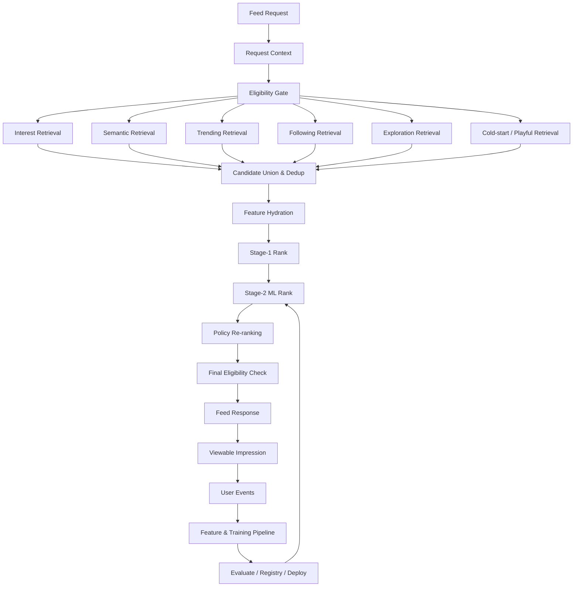

# WHICH 추천 및 머신러닝 아키텍처 v2.0

- **문서 상태:** 상세 기획 검토본
- **버전:** 2.0
- **기준일:** 2026-08-17
- **기준 문서:**
  - `01_PRODUCT_VISION_AND_PRINCIPLES_v2.md`
  - `02_CORE_UX_AND_USER_JOURNEYS_v2.md`
  - `03_ISSUE_SUPPLY_AND_CONTENT_PIPELINE_v2.md`
  - `04_ISSUE_TAXONOMY_QUALITY_AND_CONTROVERSY_v2.md`
  - `05_IDENTITY_AND_VOTE_INTEGRITY_v2.md`
  - `06_INTEREST_ONBOARDING_AND_PERSONALIZATION_v2.md`
  - `07_RECOMMENDATION_AND_ML_ARCHITECTURE.md` v1
  - `08_SOCIAL_AND_COMMUNITY.md`
  - `09_MODERATION_AND_GOVERNANCE.md`
  - `10_METRICS_ANALYTICS_AND_EXPERIMENTS.md`
  - `13_GLOSSARY_AND_STATUS_MODEL.md`
- **주요 벤치마크:** YouTube, X, Instagram의 공개된 공식 추천·랭킹 구조
- **문서 목적:** WHICH의 첫 출시부터 사용할 콘텐츠 기반 추천과 이후 행동 기반 지도학습 Ranker를 하나의 일관된 시스템으로 설계하고, Guest 외부 유입·유희형 초기 경험·다양성·정치 세이프라인·투표 무결성이 추천 성능보다 우선하도록 데이터, 모델, 정책, 실험, 운영 계약을 정의한다.
- **문서 비범위:** 물리 DB DDL, 최종 클라우드·MLOps 벤더, 특정 임베딩 API 계약, 실제 모델 소스 코드, 개인정보 법률 검토 결과, UI 시각 디자인은 후속 기술 설계에서 확정한다.

---

## 0. 결정 상태 표기

| 표기 | 의미 |
|---|---|
| **[확정]** | 후속 데이터·API·ML·운영 설계의 기본 전제로 사용한다. |
| **[설계 기준]** | 원칙은 채택하되 세부 구현과 수치는 실제 운영 데이터로 조정할 수 있다. |
| **[초기안]** | 출시 초기 Calibration과 A/B Test를 위한 가설이다. |
| **[미정]** | 별도 기술 검증·법률 검토·제품 결정을 거쳐야 한다. |
| **[금지]** | 제품 신뢰, 외부 유입, 안전, 개인정보 원칙을 해치므로 채택하지 않는다. |

### 0.1 v2 주요 보강 내용

| 영역 | v1 | v2 보강 내용 |
|---|---|---|
| 추천 목표 | 투표·다음 이슈·깊은 참여 | 단기 참여, 세션 연속성, 장기 만족, 유희성, 다양성, 안전을 분리한 다목적 Objective 계약 |
| 벤치마크 | YouTube·X·Instagram 개념 요약 | 공식 자료별 구조, WHICH 채택 요소, 비채택 요소, 플랫폼 규모 차이에 따른 축소 원칙 |
| Guest | 일반 Feature 대상 | 외부 딥링크 첫 투표 보호, Guest 전용 Cold-start, Prompt 비차단, 유입 소스별 Candidate Mix |
| 초기 ML | Embedding·Similarity | ML v0 Baseline Score, 후보 소스별 Budget, Playfulness·Cold-start·Fallback 규칙 구체화 |
| 학습 Label | `P(VOTE)`, `P(NEXT)` | Impression 기준 Label Window, Qualified Vote, Skip 판정, Session Continuation, Delayed Label 정의 |
| 편향 | Position Bias 기록 | 노출 편향, 선택 편향, 탐색 Traffic, Counterfactual Log, Negative Sampling, Propensity 기록 추가 |
| Re-ranking | 다양성·안전 필터 | Category·Topic·Experience Mode·Creator·Semantic Cluster별 Budget과 MMR형 재정렬 설계 |
| 논쟁 | 50:50 근접 | 최소 표본·Integrity·안정성·정치 격리와 결합된 전용 후보·랭킹 계약 |
| 정치 | Exposure Cap | 추천 Eligibility 자체 분리, 일반 Ranker 배제, 성향 Feature 금지, Incident 시 Fail-Closed |
| 무결성 | Penalty | ACCEPTED Vote만 학습, 공격 기간 격리, Risk 상태별 추천 동결, Aggregate 재학습 보정 |
| MLOps | Registry·A/B Test | Model Card, Feature Contract, Shadow·Canary·Rollback, Data Quality Gate, Drift·Calibration 운영 |
| 비용·성능 | 개념 수준 | Feed API 단계별 Latency Budget, Cache, Batch/Online Feature, Graceful Degradation 정의 |

### 0.2 핵심 결정 요약

1. **[확정]** 추천의 최상위 목적은 클릭이나 투표 수 단독 극대화가 아니라 `유효 투표 → 결과 소비 → 다음 Issue → 만족스러운 반복 참여`다.
2. **[확정]** 외부 딥링크 Guest의 첫 Issue는 추천 시스템이 홈으로 우회시키거나 온보딩으로 차단하지 않는다.
3. **[확정]** 신규 사용자의 첫 피드는 유희·취향·생활 공감형 Issue를 중심으로 구성한다.
4. **[확정]** 추천은 `Eligibility → Retrieval → Ranking → Policy Re-ranking → Serving`의 다단계 구조로 설계한다.
5. **[확정]** 안전·정치·무결성·사용자 차단 정책은 ML Score보다 우선하며 모델이 우회할 수 없다.
6. **[확정]** 어떤 주제에 참여했는지는 관심 Feature로 사용할 수 있지만 A/B 선택 방향을 정치·이념 성향 Feature로 만들지 않는다.
7. **[확정]** 학습 데이터의 기본 단위는 실제로 화면에 노출된 `Viewable Impression`이다.
8. **[확정]** `Vote Request`가 아니라 `ACCEPTED Vote`만 추천 학습의 긍정 Label로 사용한다.
9. **[확정]** ML v0부터 Issue Embedding·관심사 Vector·콘텐츠 유사도를 사용하되, 행동 데이터가 충분하기 전에는 학습 Ranker의 성능을 과장하지 않는다.
10. **[설계 기준]** 초기 지도학습 Ranker는 Logistic Regression 또는 LightGBM 계열을 우선 검증한다.
11. **[확정]** 모델 추천 노출과 Exploration 노출을 로그에서 구분한다.
12. **[확정]** 정치·선거 Issue는 일반 For You·인기·논쟁 Ranker에 자동 진입하지 않는다.
13. **[확정]** 개인화는 관심사 적합성뿐 아니라 다양성, Exploration, Playfulness, 품질, 신선도와 함께 구성한다.
14. **[확정]** 오프라인 ML 지표가 좋아도 Guest 첫 투표 전환, Votes per Session, 안전 Guardrail이 악화되면 모델을 승격하지 않는다.

---

# 1. 문서의 역할과 제품 문제

## 1.1 WHICH 추천이 해결해야 하는 문제

WHICH는 영상·사진·장문의 게시글이 아니라 다음 단위를 연속 소비하게 한다.

```text
짧은 질문
+
A/B 선택
+
결과
+
선택 이유 댓글
```

이 구조는 사용자가 짧은 시간에 많은 Issue를 소비할 수 있다는 장점이 있지만, 추천이 잘못되면 다음 문제가 매우 빠르게 누적된다.

- 관심 없는 질문이 반복돼 즉시 Skip한다.
- 같은 카테고리·같은 갈등 소재가 연속되어 피로해진다.
- 자극적인 정치·젠더·사건 이슈가 단기 Engagement를 장악한다.
- 외부 SNS 유입 사용자가 원래 보러 온 Issue보다 플랫폼 온보딩을 먼저 만나 이탈한다.
- 인기 Issue만 반복 노출되어 신규 Issue가 학습 기회를 얻지 못한다.
- 모델이 자신이 노출한 데이터만 다시 학습해 기존 편향을 강화한다.
- 조직적 투표나 봇 Traffic이 인기·논쟁 Score를 오염시킨다.
- A/B 선택 방향으로 민감한 정치·이념 Profile이 형성될 수 있다.

따라서 추천은 단순한 정렬 기능이 아니라 다음 시스템의 교차점이다.

```text
Issue Supply
+
Interest Profile
+
Session Context
+
Vote Integrity
+
Safety / Governance
+
Product UX
+
Experimentation
```

## 1.2 한 줄 목표

> **사용자가 부담 없이 첫 질문에 참여하고, 결과를 본 뒤 다음에도 참여하도록 하되, 자극성·반복성·조작이 추천의 승자가 되지 않게 한다.**

## 1.3 추천이 제공해야 하는 사용자 가치

### Guest

- 외부에서 보러 온 Issue를 바로 소비한다.
- 가입하지 않아도 다음 질문을 자연스럽게 발견한다.
- 행동 데이터가 적어도 유희성·인기·다양성이 보장된 Feed를 받는다.

### Member

- 관심사와 실제 행동에 맞는 Issue를 더 자주 본다.
- 명시적으로 `덜 보기`, `관심 없음`, `팔로우`를 통해 Feed를 조정한다.
- 여러 기기에서 일관된 관심 Profile을 사용한다.

### Creator

- 좋은 질문이 신규 사용자와 적절한 관심 사용자에게 노출될 기회를 얻는다.
- 단순 팔로워 수나 자극성만으로 노출이 결정되지 않는다.

### 운영자

- 콘텐츠 재고, 카테고리 균형, Risk Budget, 추천 사고를 추적한다.
- 모델 버전과 정책 버전을 분리해 원인을 설명하고 롤백한다.

## 1.4 비목표

- YouTube, X, Instagram의 알고리즘을 코드 수준으로 복제
- Vote Conversion 하나만 최대화
- 정치적 입장·정체성 추론
- 광고 타게팅용 Cross-site Profile 구축
- 로그인하지 않은 Guest를 기기 Fingerprint로 장기 추적
- 모델이 게시·모더레이션 Eligibility를 결정하도록 위임
- 모델 Score를 운영자가 해석할 수 없는 절대 진실로 취급
- 첫 출시부터 대규모 Deep Learning·실시간 Streaming Stack 구축
- 인기 콘텐츠만 노출해 Exploration을 제거
- 사용자에게 알리지 않고 명시적 관심사를 자동 삭제

---

# 2. 벤치마킹 원칙과 공식 근거

## 2.1 벤치마킹 범위

WHICH는 다음 세 플랫폼의 공개된 추천 구조에서 각기 다른 장점을 참고한다.

```text
YouTube
→ 만족도와 다음 콘텐츠 소비

X
→ 실시간성, 네트워크 밖 발견, 다양한 후보 소스

Instagram
→ 다단계 Retrieval·Ranking·Re-ranking, 다양성, 사용자 제어
```

**[확정]** 벤치마킹은 공식 Help, Engineering, Transparency, 공개 코드·논문이 설명하는 원리를 참고하는 수준이다. 비공개 가중치나 내부 정책을 추측해 사실처럼 사용하지 않는다.

## 2.2 YouTube에서 참고할 구조

YouTube 공식 설명은 추천에 시청 기록, 검색 기록, 구독, 좋아요·싫어요, `관심 없음`, 만족도 설문 등 다양한 신호가 사용되며, 단순 시청 시간뿐 아니라 사용자가 가치 있다고 평가한 경험을 측정하려 한다고 설명한다.

Google의 공개 연구는 대규모 추천을 다음 두 단계로 분리해 설명한다.

```text
Candidate Generation
→ Ranking
```

또한 다음 콘텐츠 추천에서는 여러 목적을 함께 최적화하는 Multi-task Ranking 문제가 공개적으로 다뤄져 있다.

### WHICH 채택 요소

- 단일 `P(VOTE)`가 아니라 결과 소비와 다음 Issue까지 함께 본다.
- `관심 없음`, `덜 보기` 같은 명시적 부정 피드백을 강하게 반영한다.
- 세션이 끝난 뒤 후회하게 만드는 자극적 질문을 장기 만족으로 보지 않는다.
- Candidate Generation과 Ranking을 분리한다.
- 일부 사용자 대상의 가벼운 만족도 질문을 향후 검토한다.

### WHICH 비채택 요소

- 영상 Watch Time을 그대로 체류 시간으로 대체
- 길게 머문 시간을 무조건 만족으로 해석
- 재생 시간 최적화를 Votes per Session 최적화로 단순 치환
- 사용자에게 계속 질문을 밀어 세션 종료 의사를 무시

## 2.3 X에서 참고할 구조

X 공식 Help와 공개 추천 코드에서는 For You가 팔로우 네트워크 안팎의 콘텐츠를 여러 Candidate Source에서 가져오고, Feature Hydration, ML Scoring, Author Diversity, In-network·Out-of-network Balance, Feedback Fatigue, Deduplication, Visibility Filtering 등을 거치는 구조를 설명한다.

X의 Trends 설명은 오래 누적된 인기보다 현재 부상하는 주제를 찾는 데 초점을 둔다.

### WHICH 채택 요소

- 관심사·팔로잉 기반 후보와 네트워크 밖 발견 후보를 섞는다.
- 누적 투표 수와 현재 Velocity를 분리한다.
- Candidate Source별로 로그와 Budget을 남긴다.
- Creator Diversity, Feedback Fatigue, Seen Filter를 Re-ranking에 둔다.
- 외부 유입이 급증해도 정상 바이럴과 좌표찍기를 분리해 판단한다.

### WHICH 비채택 요소

- 정치·시사 실시간성을 전체 Feed의 기본 중심으로 설정
- 강한 반응을 만든 Issue를 무조건 급상승으로 증폭
- 팔로워·네트워크 규모가 작은 Creator를 구조적으로 배제
- 공격적 Reply·논쟁량을 의미 있는 대화의 대리 지표로 단순 사용

## 2.4 Instagram에서 참고할 구조

Instagram 공식 Engineering 자료는 Explore 추천을 다음과 같은 다단계 Funnel로 설명한다.

```text
Retrieval
→ First-stage Ranking
→ Second-stage Ranking
→ Final Re-ranking
```

공식 설명은 Feed, Explore, Reels 등 Surface마다 서로 다른 목적과 신호를 사용한다는 점을 강조한다. Meta의 공개 Engineering 자료는 기본 Engagement Score 위에 별도 Diversity Layer를 두고 최근 노출과 유사한 후보를 감점하는 방식도 설명한다. Instagram은 추천 Reset과 관심사 조정 같은 사용자 통제 기능도 제공한다. 2025년 Meta Engineering 공개 자료는 Instagram의 각 Surface가 Sourcing, Early-stage Ranking, Late-stage Ranking 같은 Funnel을 운영하고, 모델 수가 증가할수록 Model Registry, Launch Tooling, Model Stability SLO가 중요해진다고 설명한다. 같은 해 공개된 다양성 인지 Ranking 사례는 기존 모델 위에 별도 Diversity Layer를 두어 최근 발송·노출과 너무 유사한 후보를 감점하는 구조를 보여준다.

### WHICH 채택 요소

- Surface별 Objective를 분리한다.
- 큰 Candidate Pool을 여러 단계에서 점차 줄인다.
- 최종 단계에서 Semantic·Category·Creator Diversity를 강제한다.
- 관심사 수정·덜 보기·추천 재설정 기능을 제품 계약으로 둔다.
- 미래의 Two-Tower Retrieval이 들어갈 수 있도록 User·Issue Representation을 분리한다.

### WHICH 비채택 요소

- 초기에 수백·수천 Model Fleet를 모방
- 대규모 GPU 기반 Deep Ranker를 데이터 없이 선도입
- Reels의 연속 영상 소비를 그대로 WHICH의 질문 Feed에 적용
- 미디어 형식 다양성 중심의 정책을 텍스트 Issue에 기계적으로 복제

## 2.5 벤치마크 종합

| 목표 | YouTube 참고 | X 참고 | Instagram 참고 | WHICH 적용 |
|---|---|---|---|---|
| 첫 참여 | 개인 취향 신호 | 관심 Topic | 관심 기반 추천 | Guest Cold-start + Playfulness |
| 연속 소비 | 다음 영상·만족 | For You Timeline | Reels·Explore Chaining | `P(NEXT_ISSUE)` |
| 후보 발굴 | Candidate Generation | In/Out Network Sources | Retrieval | 다중 Candidate Source |
| 실시간성 | Fresh content | Trends | Recent Activity | Velocity Candidate |
| 다양성 | 부정 피드백 | Author Balance | Diversity Re-ranking | 다축 Diversity Budget |
| 사용자 제어 | Not Interested | Topic Interests | Reset Suggestions | 관심 없음·덜 보기·Reset |
| 안전 | 책임 있는 추천 | Visibility Filtering | Recommendation Guidelines | Eligibility·Risk·Integrity Gate |

## 2.6 공식 참고자료

- [YouTube Help — How YouTube recommendations work](https://support.google.com/youtube/answer/16089387)
- [YouTube Blog — On YouTube's recommendation system](https://blog.youtube/inside-youtube/on-youtubes-recommendation-system/)
- [Google Research — Deep Neural Networks for YouTube Recommendations](https://research.google/pubs/deep-neural-networks-for-youtube-recommendations/)
- [Google Research — Recommending What Video to Watch Next: A Multitask Ranking System](https://research.google/pubs/recommending-what-video-to-watch-next-a-multitask-ranking-system/)
- [X Help — For You Home Timeline Recommendations](https://help.x.com/en/resources/recommender-systems/for-you-home-timeline-recommendations)
- [X Help — Trends Recommendations](https://help.x.com/en/resources/recommender-systems/trends-recommendations)
- [X Help — Explore Recommendations](https://help.x.com/en/resources/recommender-systems/explore-recommendations)
- [X Open Source — the-algorithm](https://github.com/twitter/the-algorithm)
- [X Open Source — Home Mixer](https://github.com/twitter/the-algorithm/blob/main/home-mixer/README.md)
- [Instagram — Ranking Explained](https://about.instagram.com/blog/announcements/instagram-ranking-explained)
- [Meta Engineering — Scaling the Instagram Explore recommendations system](https://engineering.fb.com/2023/08/09/ml-applications/scaling-instagram-explore-recommendations-system/)
- [Meta Engineering — Journey to 1000 models: Scaling Instagram's recommendation system](https://engineering.fb.com/2025/05/21/production-engineering/journey-to-1000-models-scaling-instagrams-recommendation-system/)
- [Meta Engineering — A New Ranking Framework for Better Notification Quality on Instagram](https://engineering.fb.com/2025/09/02/ml-applications/a-new-ranking-framework-for-better-notification-quality-on-instagram/)
- [Meta Engineering — On the value of diversified recommendations](https://engineering.fb.com/2020/12/17/ml-applications/diversified-recommendations/)
- [Instagram — Reset Content Suggestions](https://about.instagram.com/blog/announcements/reset-instagram-content-suggestions)

---

# 3. 추천 Surface와 목적 분리

## 3.1 Surface 목록

| Surface | 주요 사용자 | 핵심 목적 | 개인화 수준 |
|---|---|---|---|
| 외부 딥링크 Issue | Guest 중심 | 원래 보러 온 Issue 투표 | 현재 Issue는 추천하지 않음 |
| 딥링크 이후 Next Feed | Guest·Member | 두 번째 투표 전환 | 약한 개인화·유희 우선 |
| For You | Guest·Member | 지속 참여와 만족 | 가장 강함 |
| 인기 | 전체 | 현재 반응이 큰 정상 Issue 발견 | 약함 |
| 논쟁 | 전체 | 50:50 접전 Issue 발견 | 전용 정책 |
| 최신 | 전체 | 최근 게시 Issue 발견 | 거의 없음 |
| 팔로잉 | Member | Creator·Topic 기반 Feed | 명시적 Graph 중심 |
| 카테고리 | 전체 | 특정 주제 탐색 | Category 중심 |
| 검색 결과 | 전체 | 명시적 Query 충족 | Search Relevance 중심 |
| 댓글 추천 | Member·Guest | 양쪽 이유 탐색 | 별도 Comment Ranker |

## 3.2 Surface별 Objective

### 외부 딥링크

```text
Primary   = First Vote Conversion
Secondary = First Result View
Guardrail = Time to First Vote, Pre-vote Bounce
```

**[금지]** 딥링크 Issue를 개인화 후보로 교체하지 않는다.

### 딥링크 이후 Next Feed

```text
Primary   = Next Issue Rate
Secondary = Second Accepted Vote
Guardrail = Guest Exit, Prompt-induced Exit
```

### For You

```text
Primary   = Qualified Votes per Session
Secondary = Next Issue Rate, Return, Satisfaction
Guardrail = Diversity, Safety, Integrity, Hide Rate
```

### 인기

```text
Primary   = 현재 정상 참여 증가 속도
Guardrail = Burst Integrity, 오래된 누적 인기 독점 방지
```

### 논쟁

```text
Primary   = 50:50 근접도
Required  = 최소 Accepted 표본 + 안정성 + Integrity
Guardrail = 정치 자동 혼합 금지
```

### 최신

```text
Primary   = published_at DESC
Required  = Eligibility 통과
Guardrail = 동일 Creator·Category 도배 제한
```

## 3.3 Surface 간 독립성

다음은 같은 Ranker를 그대로 공유하지 않는다.

```text
For You Score
≠
Popularity Score
≠
Controversy Score
≠
Search Score
```

공통 Feature Service는 사용할 수 있지만 Objective와 Policy는 별도 버전으로 관리한다.

---

# 4. 전체 추천 파이프라인

## 4.1 논리 구조



## 4.2 단계별 책임

| 단계 | 책임 | 모델 여부 |
|---|---|---:|
| Request Context | 사용자·세션·Surface 파악 | 없음 |
| Eligibility Gate | 게시·안전·권한·무결성 제외 | 정책 |
| Retrieval | 넓은 후보 검색 | ML 또는 규칙 |
| Candidate Union | 후보 병합·중복 제거 | 규칙 |
| Feature Hydration | 최신 Feature 결합 | 없음 |
| Stage-1 Rank | 빠른 Score로 후보 축소 | 규칙·경량 모델 |
| Stage-2 Rank | 사용자-이슈 적합성 예측 | ML |
| Policy Re-ranking | 다양성·유희·Risk Budget | 정책·최적화 |
| Final Check | Serve 직전 상태 확인 | 정책 |
| Logging | 노출·버전·Propensity 기록 | 없음 |

## 4.3 모델과 정책의 경계

### 모델이 결정할 수 있는 것

- 사용자에게 참여 가능성이 높은 후보의 상대 순서
- Topic·Embedding 적합성
- `P(VOTE)`, `P(NEXT)`, `P(DEEP)` 예측
- 새로운 관심사 발견 후보의 우선순위

### 모델이 결정할 수 없는 것

- BLOCKED·REMOVED Issue 노출
- Guest에게 RESTRICTED Issue 권한 부여
- 정치 Exposure Cap 해제
- 사용자 차단 Creator 재노출
- Integrity Incident 중인 Issue의 자동 급상승
- 민감 Choice를 이념 Profile로 변환
- 필수 출처·모더레이션 요건 우회

---

# 5. Feed Request Context

## 5.1 요청 객체

```text
feed_request
├─ recommendation_request_id
├─ subject_id
├─ user_id
├─ anonymous_subject_id
├─ session_id
├─ surface
├─ entry_source
├─ referrer_class
├─ locale
├─ timezone
├─ device_class
├─ network_quality_class
├─ page_cursor
├─ seen_issue_ids
├─ current_issue_id
├─ interest_profile_version
├─ experiment_assignments
└─ requested_at
```

## 5.2 Subject 우선순위

```text
로그인 Member
→ user_id 기준 Profile

Guest
→ anonymous_subject_id 기준 Profile

아무 연속성 없음
→ Pure Cold-start Profile
```

IP 주소를 추천 Subject ID로 사용하지 않는다.

## 5.3 Session Context

Session Feature 후보:

- 이번 세션의 Accepted Vote 수
- 최근 5개 Category·Topic
- 최근 Experience Mode
- 연속 Skip 수
- 최근 Comment Open 여부
- 외부 유입 여부
- 첫 Issue인지 여부
- 관심사 Prompt 노출 여부
- 현재 세션의 피로도 추정
- 네트워크 품질
- Feed 내 위치

## 5.4 Entry Source

```text
DIRECT_HOME
EXTERNAL_SOCIAL
SEARCH_ENGINE
SHARED_RESULT_CARD
NOTIFICATION
CREATOR_PROFILE
CATEGORY_LINK
INTERNAL_NEXT
```

외부 유입 보호를 위해 `EXTERNAL_SOCIAL`, `SEARCH_ENGINE`, `SHARED_RESULT_CARD`는 첫 Issue 이전에 다른 Candidate로 치환하지 않는다.

---

# 6. Eligibility Gate

## 6.1 추천 전 필수 조건

후보 Issue는 다음을 모두 만족해야 한다.

```text
status = PUBLISHED
publication_window_active = true
surface_eligible = true
locale_match = true
not_removed = true
not_blocked_by_user = true
not_hidden_by_user = true
rights_status_valid = true
risk_policy_satisfied = true
integrity_state_allows_serving = true
```

## 6.2 위험도별 Eligibility

| Risk | 일반 For You | 외부 딥링크 | 인기 | 논쟁 | 최신 |
|---|---:|---:|---:|---:|---:|
| LOW | 허용 | 허용 | 허용 | 허용 | 허용 |
| MEDIUM | 허용 | 허용 | 허용 | 허용 | 허용 |
| HIGH | 제한·검수 | 직접 URL 정책별 | 제한 | 별도 검토 | 제한 |
| RESTRICTED | 일반 자동 혼합 금지 | 권한 충족 시 | 일반 인기 제외 | 일반 논쟁 제외 | 별도 Surface |

## 6.3 사용자별 제외

- 이미 투표한 Issue를 재투표 후보로 노출하지 않음
- 사용자가 숨긴 Issue
- 차단한 Creator
- `이 주제 덜 보기`의 강한 제외 조건
- 법적 연령·지역 요건 불충족
- Verified가 필요한 Issue에서 미인증 사용자

`이미 투표한 Issue`는 필요하면 결과 재방문·댓글 Surface에서 보여줄 수 있지만, 신규 투표 Feed 후보와 분리한다.

## 6.4 Issue 상태 변화

추천 요청 중 Issue가 `UNDER_REVIEW`, `RESULT_LOCKED`, `REMOVED`로 바뀔 수 있다.

따라서 다음 두 번 확인한다.

```text
Retrieval 전 Eligibility
+
Serve 직전 Final Eligibility
```

---

# 7. Candidate Retrieval 구조

## 7.1 Retrieval 목표

전체 Active Issue 중 사용자에게 의미 있을 가능성이 있는 약 `100~300개` 후보를 빠르게 가져온다.

정확한 수치는 Active Inventory와 Latency에 따라 조정한다.

## 7.2 Candidate Source 코드

```text
INTEREST_EXPLICIT
INTEREST_INFERRED
SEMANTIC_RECENT
SEMANTIC_PROFILE
TRENDING_GLOBAL
TRENDING_CATEGORY
FOLLOWING_CREATOR
FOLLOWING_TOPIC
POPULAR_GLOBAL
CONTROVERSY_ELIGIBLE
FRESH
PLAYFUL_COLDSTART
EXPLORATION_RANDOM
EXPLORATION_ADJACENT
EDITORIAL_FEATURED
FALLBACK_SAFE
```

각 후보는 하나 이상의 Source를 가질 수 있다.

## 7.3 후보 공통 필드

```text
candidate
├─ issue_id
├─ candidate_sources[]
├─ retrieval_scores{}
├─ retrieval_rank_by_source{}
├─ source_budget_slot
├─ exploration_probability
├─ eligibility_snapshot
├─ retrieved_at
└─ retrieval_version
```

## 7.4 Explicit Interest Retrieval

사용자가 직접 선택한 관심사 카드와 내부 Category·Topic Mapping을 사용한다.

```text
Interest Card
→ Taxonomy Mapping
→ Category / Subcategory / Topic Candidate
```

명시적 관심사는 초기 Candidate Recall을 높이는 데 사용하되 같은 3개 관심사만 반복하지 않는다.

## 7.5 Inferred Interest Retrieval

다음 행동으로 형성된 Topic Affinity를 사용한다.

- ACCEPTED Vote
- 댓글 열람
- 양쪽 댓글 열람
- 공유
- Creator·Topic Follow
- 반복 Skip
- 관심 없음

무효화된 Vote, 공격 Session, 정치 Choice 방향은 사용하지 않는다.

## 7.6 Semantic Recent Retrieval

최근 적극 참여한 Issue의 Embedding과 가까운 Issue를 가져온다.

예:

```text
최근 참여:
AI가 신입 개발자의 업무를 크게 줄일까?

후보:
학교에서 생성형 AI 사용을 허용해야 할까?
```

단순 문장 중복이 아니라 의미 관련성을 탐색하되 Semantic Cluster 연속 노출은 Re-ranking에서 제한한다.

## 7.7 Semantic Profile Retrieval

사용자의 장기 Topic·Content Vector와 Issue Embedding의 유사도를 이용한다.

```text
similarity(user_interest_vector, issue_embedding)
```

ML v0에서는 이 값이 주요 Score 중 하나다.

## 7.8 Trending Retrieval

최근 짧은 기간의 정상 반응 증가 속도를 사용한다.

```text
accepted_vote_velocity
comment_open_velocity
share_velocity
unique_session_velocity
```

누적 투표가 오래 많은 Issue와 현재 급상승 Issue를 구분한다.

## 7.9 Following Retrieval

Member에게만 적용한다.

```text
Followed Creator의 신규 Issue
+
Followed Topic의 신규·인기 Issue
```

팔로잉 후보가 전체 Feed를 과점하지 않도록 별도 Budget을 둔다.

## 7.10 Playful Cold-start Retrieval

행동 데이터가 부족한 Guest·신규 Member에게 다음 조건의 Issue를 가져온다.

```text
Experience Mode = PLAYFUL_QUICK 또는 HYPOTHETICAL_CHOICE
Risk = LOW 중심
Playfulness Score 높음
Quality Gate 통과
표현 이해가 빠름
다른 카테고리와 중복되지 않음
```

첫 10개 Feed의 유희성 계약은 4번·6번 문서를 따른다.

## 7.11 Exploration Retrieval

사용자가 아직 소비하지 않은 Topic·Category에서 안전한 후보를 가져온다.

종류:

```text
Random Safe Exploration
Adjacent Topic Exploration
New Creator Exploration
New Issue Exploration
Underexposed Quality Exploration
```

완전 무작위 전체 Issue에서 가져오지 않는다.

## 7.12 Editorial Featured Retrieval

운영자가 공급 균형, 캠페인, 중요 공지, 고품질 Issue를 위해 제한적으로 사용한다.

**[금지]** Editorial Featured를 유료·정치적 편향 노출로 숨겨서 사용하지 않는다.

## 7.13 Fallback Safe Retrieval

Feature Service나 Ranker가 실패해도 다음 후보를 제공한다.

```text
LOW Risk
High Quality
Recent
Playful / Relatable
Integrity Normal
Category Diverse
```

---

# 8. Candidate Budget

## 8.1 초기 Candidate Mix

신규 Guest 초기안:

| Source | 후보 수 후보 |
|---|---:|
| Playful Cold-start | 80 |
| Global Popular | 40 |
| Fresh | 30 |
| Low-risk Controversy | 20 |
| Exploration | 30 |
| Editorial Safe | 10 |
| **합계 전 중복 제거** | **210** |

관심사 설정 사용자 초기안:

| Source | 후보 수 후보 |
|---|---:|
| Explicit Interest | 80 |
| Inferred Interest | 60 |
| Semantic | 50 |
| Trending | 40 |
| Following | 30 |
| Exploration | 30 |
| **합계 전 중복 제거** | **290** |

## 8.2 후보 Source 독점 방지

후보 생성 단계부터 한 Source가 전체를 독점하지 않도록 한다.

```text
max_source_share
min_exploration_candidates
min_playful_candidates_for_coldstart
min_fresh_candidates
```

정확한 값은 실험한다.

## 8.3 Inventory 부족

후보가 부족할 때의 순서:

```text
동일 관심사 범위 확장
→ 인접 Topic 확장
→ Global Safe Popular
→ Playful Fallback
→ 명시적 Feed End
```

저품질·고위험 Issue를 강제로 채우지 않는다.

---

# 9. Issue Representation

## 9.1 Issue Feature 그룹

```text
issue_features
├─ taxonomy
├─ content_embedding
├─ experience_mode
├─ lifecycle
├─ quality
├─ playfulness
├─ popularity
├─ controversy
├─ freshness
├─ creator
├─ source
├─ risk
├─ integrity
└─ inventory
```

## 9.2 텍스트 Embedding 입력

```text
질문
+
선택지 A
+
선택지 B
+
짧은 배경
+
Category / Subcategory
+
Controlled Topics
```

출처 원문 전문이나 불필요한 개인정보를 Embedding 입력에 넣지 않는다.

## 9.3 Embedding Version

```text
embedding_model_id
embedding_dimension
embedding_created_at
embedding_input_version
normalization_version
```

모델을 변경하면 기존 Vector와 혼합해 직접 비교하지 않도록 Version Space를 분리한다.

## 9.4 Taxonomy Feature

- Primary Category
- Subcategory
- Controlled Topics
- Experience Mode
- Question Archetype
- Risk Level
- Sensitivity Flags
- Lifecycle Type

## 9.5 Quality Feature

- Total Quality Score
- Binary Fit
- Clarity
- Choice Symmetry
- Neutrality
- Source Sufficiency
- Duplicate Similarity
- Language Naturalness

## 9.6 Playfulness Feature

- Playfulness Score
- Immediate Comprehension
- Personal Relevance
- Result Curiosity
- Harmless Surprise
- Shareability
- Series Extensibility

유희성은 Safety Gate 통과 후에만 가점으로 사용한다.

## 9.7 Popularity Feature

```text
accepted_votes_5m
accepted_votes_1h
accepted_votes_6h
accepted_votes_24h
unique_sessions_1h
comment_opens_1h
shares_1h
next_issue_rate_from_issue
```

로그 변환, Category Normalization, Age Decay를 적용할 수 있다.

## 9.8 Controversy Feature

```text
balance_score
sample_confidence
integrity_factor
stability_factor
freshness_factor
controversy_tier
```

## 9.9 Creator Feature

- Creator Reputation Band
- Published Issue Count
- Recent Rejection Rate
- Report Rate
- Duplicate Rate
- Creator Freshness
- Follower Count는 낮은 Weight 또는 별도 후보 Source로 제한

## 9.10 Source Feature

- Source Trust Class
- Official / Primary 여부
- Source Freshness
- Correction History
- Source Count
- Rights Status

## 9.11 Risk·Integrity Feature

- Risk Level
- Moderation Status
- Integrity State
- Anomaly Score Band
- Result Locked 여부
- Ranking Frozen 여부

심각한 상태는 Feature Penalty가 아니라 Eligibility 차단으로 처리한다.

---

# 10. User Representation

## 10.1 User Feature 그룹

```text
user_features
├─ explicit_interests
├─ inferred_interests
├─ negative_preferences
├─ follow_graph
├─ behavior_rates
├─ recency
├─ diversity_preference
├─ session_depth
├─ profile_maturity
└─ eligibility
```

## 10.2 Explicit Interest

- 온보딩에서 선택한 관심사
- 설정에서 수동 추가한 관심사
- 팔로우한 Topic
- 팔로우한 Creator

명시적 Interest는 시스템 추론보다 별도 저장한다.

## 10.3 Inferred Interest

- Category Affinity
- Topic Affinity
- Experience Mode Affinity
- Creator Affinity
- Freshness Affinity
- Exploration Acceptance

A/B Choice Direction은 제외한다.

## 10.4 Negative Preference

- Issue Hide
- Similar Issue Less
- Topic Less
- Creator Less
- Creator Block
- Repeated Skip

명시적 강한 Negative는 긍정 추론보다 우선한다.

## 10.5 Behavior Rate

```text
accepted_vote_rate
result_view_rate
comment_open_rate
opposite_comment_open_rate
share_rate
skip_rate
next_issue_rate
return_rate
```

각 Rate의 분모는 실제 Viewable Impression 또는 적격 Event로 정의한다.

## 10.6 Profile Maturity

| 단계 | 조건 예 | 추천 방식 |
|---|---|---|
| P0 Pure Cold-start | 행동 없음 | Playful·Global·Exploration |
| P1 Early | 1~5 Accepted Votes | Session 중심 |
| P2 Emerging | 관심사 + 5~30 Votes | 관심사·행동 혼합 |
| P3 Mature | 충분한 행동 | ML Ranker 중심 |
| P4 Dormant Return | 장기 미접속 | 명시적 관심사 + Fresh 재탐색 |

수치 기준은 초기안이다.

## 10.7 Guest Feature 제한

Guest에게 허용:

- 현재 브라우저의 명시적 관심사
- 현재·최근 세션 행동
- Topic Affinity
- 부정 설정

Guest에게 금지:

- IP 기반 장기 Profile
- Cross-site 광고 ID
- 정밀 Fingerprint 기반 복원
- 민감한 정치 Choice Profile

---

# 11. Session Representation

## 11.1 세션 Feature

- Session Issue Count
- Accepted Vote Count
- Consecutive Skip Count
- 최근 3·5개 Category
- 최근 3·5개 Semantic Cluster
- 최근 Experience Mode
- Result View Depth
- Comment Open 여부
- Session Start Entry Source
- Session Duration Band

## 11.2 Session Intent

정적 관심 Profile과 현재 세션 의도를 분리한다.

예:

```text
장기 관심사: IT·게임·직장
현재 세션: 월드컵 스포츠 질문 연속 참여
```

현재 세션에서는 스포츠 후보를 빠르게 늘릴 수 있지만 장기 Profile을 즉시 스포츠 중심으로 덮어쓰지 않는다.

## 11.3 Session Fatigue

피로 신호 후보:

- 연속 Skip 증가
- Result View 없이 빠른 이동
- 같은 Category 반복 노출
- Session 깊이 증가 후 반응 감소
- Comment Open 감소

대응:

```text
Playful Issue 삽입
Category 전환
Exploration 축소 또는 확대
명시적 Feed End 제안
```

---

# 12. User × Issue Interaction Feature

## 12.1 핵심 Feature

```text
explicit_interest_match
inferred_topic_affinity
embedding_similarity
experience_mode_affinity
creator_affinity
freshness_preference_match
already_seen
already_voted
previous_skip_same_cluster
same_category_recent_count
same_topic_recent_count
same_creator_recent_count
semantic_cluster_recent_count
issue_age
position_context
candidate_source
entry_source
```

## 12.2 Cross Feature 예시

- 신규 Guest × Playful Issue
- Mature Member × Followed Creator
- 외부 Social Entry × Next Feed
- 반복 Skip × 동일 Topic
- 낮은 Network Quality × Background가 긴 Issue
- Dormant Return × Fresh Popular Issue

## 12.3 민감 Cross Feature 금지

```text
Political Choice × Candidate Party
Gender × Political Topic
Religion × Policy Preference
IP Region × Political Choice
```

이와 유사한 민감 조합을 만들지 않는다.

---

# 13. ML v0 — 출시 시점 추천

## 13.1 목적

행동 Label이 거의 없어도 작동하고, 이후 ML 학습에 필요한 비교적 균형 잡힌 Impression 데이터를 만든다.

## 13.2 v0 Score 초기안

```text
v0_score =
  0.30 × explicit_interest_match
+ 0.20 × semantic_similarity
+ 0.15 × quality_score
+ 0.10 × playfulness_score
+ 0.10 × freshness_score
+ 0.05 × popularity_score
+ 0.05 × exploration_bonus
+ 0.05 × source_trust_score
```

Cold-start Guest에서는 다음처럼 변경할 수 있다.

```text
coldstart_score =
  0.30 × playfulness_score
+ 0.20 × quality_score
+ 0.15 × freshness_score
+ 0.15 × global_popularity
+ 0.10 × category_diversity_bonus
+ 0.10 × exploration_bonus
```

정확한 가중치는 `[초기안]`이다.

## 13.3 Hard Rule 우선

다음은 Score 계산 전에 제외한다.

- Eligibility 실패
- 사용자 차단
- 이미 투표
- HIGH·RESTRICTED 정책 미충족
- Integrity Freeze
- Semantic Exact Duplicate

## 13.4 v0의 한계

- 실제 `P(VOTE)`를 학습한 모델이 아니다.
- 가중치는 제품 가설이다.
- Popularity Bias가 발생할 수 있다.
- 사용자별 세밀한 상호작용을 충분히 반영하지 못한다.

따라서 v0은 출시 가능한 기준선이면서 v1 비교군이다.

---

# 14. ML v1 — 초기 지도학습 Ranker

## 14.1 도입 조건

다음 조건을 충족한 뒤 도입한다.

- Viewable Impression Log 안정화
- Accepted Vote와 Skip Label 정제
- Position·Candidate Source 기록
- 공격·테스트 Traffic 제외
- 충분한 사용자·Issue 다양성
- v0 Baseline Online Metric 확보

정확한 최소 Sample은 데이터 분포를 보고 결정한다.

## 14.2 초기 모델 후보

### Logistic Regression

장점:

- 매우 설명 가능
- Calibration이 비교적 쉬움
- Data Leakage 점검 용이
- Serving 단순

### LightGBM 계열

장점:

- 범주형·수치형 Feature Interaction
- 적은 데이터에서도 실용적
- 빠른 학습과 추론
- Feature Importance·SHAP 분석 가능

### 초기 권고

```text
Logistic Regression Baseline
+
LightGBM Candidate
→ Offline 비교
→ Shadow
→ Online A/B
```

## 14.3 Ranker 출력

초기에는 다음 Head를 분리하거나 각각 모델로 운영할 수 있다.

```text
P(VOTE)
P(NEXT_ISSUE | VOTE)
P(COMMENT_OPEN | VOTE)
P(SHARE | VOTE)
P(NEGATIVE_FEEDBACK)
```

## 14.4 최종 Base Score

```text
base_rank_score =
  α × calibrated_P_vote
+ β × calibrated_P_next
+ γ × calibrated_P_deep
+ δ × long_term_value_proxy
- ε × P_negative_feedback
```

Quality는 모델 Feature와 최종 Policy 둘 다에 사용할 수 있지만, Safety Hard Gate는 모델에 숨기지 않는다.

---

# 15. Multi-objective Ranking

## 15.1 Objective 계층

### Primary

- Qualified Vote
- Next Issue

### Secondary

- Result View
- Comment Open
- Opposite-side Comment Open
- Share
- Return

### Negative

- Immediate Skip
- Not Interested
- Topic Less
- Hide
- Report
- Prompt-induced Exit

### Guardrail

- Risk Exposure
- Integrity Incident
- Category Concentration
- Political Exposure
- Guest First Vote Conversion

## 15.2 단기와 장기 가치

다음 두 사용자를 구분한다.

```text
사용자 A
자극적 질문에 10개 빠르게 투표 후 즉시 이탈·숨김

사용자 B
6개 투표, 결과·댓글 소비, 다음날 재방문
```

단순 Votes per Session만 보면 A가 높을 수 있으나 장기 만족은 B가 높을 수 있다.

## 15.3 Long-term Proxy 초기안

- 세션 후 `관심 없음`이 낮음
- 다음날·7일 재방문
- 자발적 Home 방문
- 관심사 설정 유지
- 추천 Reset 비율이 낮음
- 다양한 Category에서 정상 참여

충분한 데이터 전에는 장기 Objective를 과도하게 가중하지 않는다.

## 15.4 Multi-task 전환

데이터가 충분하면 Shared Representation과 여러 Prediction Head를 가진 Multi-task Model을 검토한다.

```text
Shared User-Issue Representation
├─ Vote Head
├─ Next Head
├─ Deep Engagement Head
├─ Negative Feedback Head
└─ Return Head
```

초기에는 운영 복잡도를 줄이기 위해 모델별·목표별 독립 학습도 허용한다.

---

# 16. Label 정의

## 16.1 Impression 기본 단위

**[확정]** 학습 예제의 기본 단위는 실제 화면에 보인 `ISSUE_VIEWABLE_IMPRESSION`이다.

```text
1 Viewable Impression
→ 1 User-Issue Training Example 후보
```

Prefetch, Cache, DOM 생성만으로 Impression을 기록하지 않는다.

## 16.2 Viewable Impression 초기 조건

모바일 후보:

- Issue Card가 Viewport의 일정 비율 이상 표시
- 최소 연속 노출 시간 충족
- App이 Foreground
- 화면 전환 Animation 종료

정확한 비율과 시간은 UX 계측 실험으로 확정한다.

## 16.3 Vote Label

```text
vote_label = 1
if ACCEPTED Vote within label window
```

다음은 0 또는 제외를 구분한다.

- 명시적 Skip → 0
- 충분히 노출 후 무행동 → 0 후보
- App Crash·Network Error → 학습 제외
- Challenge 실패 → 추천 선호 Label에서 제외
- REVIEW·INVALIDATED Vote → 제외

## 16.4 Qualified Vote

단순 A/B Tap보다 다음을 만족하는 Vote를 제품 KPI에서 우선한다.

```text
ACCEPTED Vote
+
Result View 확인
+
Integrity 정상
```

정확한 Qualified 정의는 10번 지표 문서와 맞춘다.

## 16.5 Next Issue Label

```text
next_label = 1
if user moves to another eligible Issue after result
```

구분:

```text
SKIP
= 투표 전 이동

NEXT_ISSUE
= 투표·결과 후 이동
```

## 16.6 Deep Engagement Label

다음 중 하나 이상을 후보로 한다.

- Comment Open
- Opposite-side Comment Open
- Comment Create
- Share Complete
- Creator Follow

각 행동을 하나의 Binary로 합칠지 별도 Head로 둘지는 실험한다.

## 16.7 Negative Label

- `NOT_INTERESTED`
- `TOPIC_LESS`
- `ISSUE_HIDE`
- `CREATOR_BLOCK`
- Report는 관심 Negative보다 Safety Event로 분리

## 16.8 Label Window

초기 후보:

| Label | Window 후보 |
|---|---:|
| Vote | Impression 후 수분 이내 |
| Next Issue | Vote 후 수분 이내 |
| Comment Open | Result 후 수분 이내 |
| Share | Result 후 30분 이내 |
| Return | 1일·7일 |

정확한 Window는 실제 행동 분포로 정한다.

## 16.9 Session End

마지막 Issue가 0 Label로 잘못 처리되지 않도록 Session 종료 원인을 구분한다.

```text
USER_EXIT
APP_BACKGROUND
NETWORK_LOSS
CRASH
AUTH_REDIRECT
FEED_EXHAUSTED
INACTIVITY_TIMEOUT
```

---

# 17. 학습 데이터 편향

## 17.1 Position Bias

상단 Position은 더 많이 보이고 반응도 높다.

반드시 기록:

```text
position
viewport_order
surface
page_cursor
```

초기에는 Position Feature를 모델에 넣고, Exploration Traffic에서 위치를 일부 통제한다.

## 17.2 Exposure Bias

모델이 보여준 것만 반응 데이터를 얻는다.

대응:

- Exploration Slot
- Source별 Propensity 기록
- Underexposed Quality Candidate 노출
- 모델·탐색 Traffic 분리
- 오프라인 평가 시 Logged Policy 고려

## 17.3 Popularity Bias

인기 Issue는 더 노출되고 다시 인기해진다.

대응:

- Velocity를 Category·Age별 정규화
- 신규 Issue Exploration Budget
- 누적 수치의 Log Transform
- Creator·Issue Exposure Cap

## 17.4 Selection Bias

온보딩을 완료한 사용자는 원래 더 적극적인 사용자일 수 있다.

관심사 온보딩 완료 그룹의 높은 Vote Rate를 Interest Feature 효과로 단정하지 않는다.

## 17.5 Survivorship Bias

게시·추천된 Issue만 학습하면 거절된 후보와 저노출 후보의 품질을 알기 어렵다.

Candidate Review 데이터는 추천 학습과 별도로 Editorial Quality 개선에 사용한다.

## 17.6 Feedback Loop

```text
AI Issue 추천
→ AI Vote 증가
→ AI 관심 증가로 학습
→ AI만 더 추천
```

대응:

- Diversity Re-ranking
- Exploration
- 명시적 관심사와 추론 분리
- 최근 같은 Topic 노출 수 Feature
- Topic Saturation Penalty

---

# 18. Negative Sampling과 학습 예제 구성

## 18.1 Positive

- ACCEPTED Vote
- Next Issue
- Deep Engagement

## 18.2 Observed Negative

- Viewable Impression 후 Skip
- 충분한 노출 후 무행동
- 명시적 Not Interested

## 18.3 제외 예제

- Prefetch만 발생
- Network Error
- Integrity REVIEW
- Invalidated Vote
- 좌표찍기 Incident Window
- 운영·QA Account
- Bot·Crawler
- Issue가 노출 직후 Removed

## 18.4 Class Imbalance

Vote Rate가 높거나 낮은 Surface마다 비율이 다를 수 있다.

대응 후보:

- Class Weight
- Downsampling
- Focal Loss는 후순위
- Surface별 모델 또는 Feature
- Calibration

## 18.5 Hard Negative

Embedding상 비슷하지만 사용자가 반복 Skip한 후보를 Hard Negative로 사용할 수 있다.

단, 한 번 Skip만으로 강한 Negative를 만들지 않는다.

---

# 19. Exploration Policy

## 19.1 목적

- 신규 Topic 발견
- 신규 Creator 발견
- 신규 Issue 학습 기회
- 추천 편향 보정
- Counterfactual 평가 데이터 확보

## 19.2 초기 비율

```text
추천 80~90%
탐색 10~20%
```

Surface·Profile Maturity에 따라 다르게 한다.

| Profile | Exploration 후보 |
|---|---:|
| Pure Cold-start | 15~25% |
| Early | 15~20% |
| Mature | 10~15% |
| Dormant Return | 15~20% |

정확한 값은 실험한다.

## 19.3 Exploration 안전 조건

탐색 후보도 다음을 통과해야 한다.

- Quality Gate
- Safety Eligibility
- LOW·MEDIUM 중심
- 사용자 차단·덜 보기 반영
- Semantic Duplicate 제외
- 정치 일반 탐색 제외

## 19.4 Exploration 유형

### Adjacent Topic

현재 관심 Topic의 상위·인접 Taxonomy에서 선택한다.

### New Creator

고품질이지만 노출이 적은 Creator를 선택한다.

### New Issue

게시 후 데이터가 적은 Issue를 선택한다.

### Serendipity

관심 Profile과 거리가 있지만 Global 반응과 Playfulness가 높은 안전 후보를 선택한다.

## 19.5 Exploration 로그

```text
is_exploration
exploration_type
selection_probability
baseline_policy
```

향후 Contextual Bandit이나 Off-policy Evaluation에 사용할 수 있다.

---

# 20. Contextual Bandit 로드맵

## 20.1 적합성

WHICH는 한 세션 안에서 반복적으로 다음 결정을 내린다.

```text
현재 Context
→ 다음 Issue 선택
→ Vote·Skip Reward
→ 다음 Context 갱신
```

따라서 Contextual Bandit과 궁합이 좋다.

## 20.2 도입 전제

- 안정적인 Exploration Log
- Propensity 기록
- 충분한 Traffic
- Reward 정의 합의
- 안전한 Policy Boundary
- Offline Replay 또는 Shadow 평가

## 20.3 금지

정치·RESTRICTED Exposure를 Bandit이 자유롭게 탐색하게 하지 않는다.

## 20.4 초기 후보

- Epsilon-greedy를 단순 탐색 기준선으로 사용
- Thompson Sampling·LinUCB는 충분한 Feature 안정화 후 검토
- Deep Bandit은 후순위

---

# 21. Stage-1 Ranking

## 21.1 목적

후보 100~300개를 빠르게 약 50~100개로 축소한다.

## 21.2 초기 Score

- Eligibility
- Interest Match
- Embedding Similarity
- Quality
- Freshness
- Source Score
- Basic Popularity
- Basic Negative Penalty

## 21.3 비용 제한

Stage-1에서는 계산 비용이 큰 Sequence Model이나 복잡한 Cross Feature를 사용하지 않는다.

## 21.4 Cache

Issue Static Feature와 Embedding은 Cache 가능하다. User·Session Dynamic Feature는 짧은 TTL을 사용한다.

---

# 22. Stage-2 ML Ranking

## 22.1 목적

상위 후보를 사용자·세션 Context에 맞춰 세밀하게 정렬한다.

## 22.2 Feature 범위

- User Feature
- Issue Feature
- User×Issue Cross
- Session Context
- Candidate Source
- Position 예상
- Surface
- Experiment

## 22.3 Calibration

여러 Model Head의 확률을 결합하려면 Calibration을 확인한다.

후보:

- Platt Scaling
- Isotonic Regression
- 모델 자체 Calibration 평가

## 22.4 Score 해석

Ranker Score는 사용자에게 직접 노출하지 않는다. 운영자에게는 다음 정도를 설명한다.

```text
주요 관심사 적합
최근 행동 적합
현재 인기
신규 탐색
팔로잉
```

정치 성향·민감 특성 설명은 제공하지 않는다.

---

# 23. Policy Re-ranking

## 23.1 목적

ML Ranker 상위 결과를 제품 원칙에 맞는 최종 목록으로 만든다.

```text
Relevance
+
Diversity
+
Playfulness
+
Freshness
+
Safety
+
Integrity
+
User Control
```

## 23.2 Hard Filter

- Eligibility 재확인
- User Block
- Already Voted
- Removed·Review
- Ranking Freeze
- Restricted 권한

## 23.3 Soft Demotion

- 동일 Category 과다
- 동일 Topic 과다
- 동일 Creator 과다
- 동일 Semantic Cluster
- 반복적인 공공 논쟁
- Feedback Fatigue
- 오래된 Issue

## 23.4 MMR형 개념

최종 목록을 순차적으로 선택할 때 다음을 고려할 수 있다.

```text
final_candidate_value =
  relevance_score
- λ × similarity_to_selected_items
```

Similarity 축:

- Semantic Embedding
- Category
- Topic
- Creator
- Experience Mode
- Source

초기에는 설명 가능한 Rule-based Penalty로 시작하고 MMR형 최적화를 실험한다.

---

# 24. 다양성 Budget

## 24.1 기본 제한 초기안

```text
최근 5개 중 동일 관심 영역 최대 3개
동일 대분류 연속 최대 2개
동일 Creator 연속 노출 금지
동일 Semantic Cluster 한 세션 1개 우선
PUBLIC_DELIBERATION 연속 최대 2개
RESTRICTED 일반 혼합 금지
```

## 24.2 다양성 축

- Interest Card
- Primary Category
- Subcategory
- Controlled Topic
- Experience Mode
- Creator
- Lifecycle
- Source Type
- Semantic Cluster
- Risk Level

## 24.3 다양성과 관련성 충돌

관련성이 조금 낮더라도 반복 피로를 줄이고 새로운 주제를 발견하게 만드는 후보를 일부 유지한다.

다만 다양성을 위해 명백히 관심 없는 Topic을 강제로 반복하지 않는다.

## 24.4 사용자별 다양성 선호

향후 사용자의 Exploration Acceptance와 Category Breadth를 Feature로 사용할 수 있다.

```text
Narrow Preference User
→ 관심사 중심 + 낮은 Exploration

Broad Explorer
→ 더 넓은 Topic Mix
```

정치 Exposure는 이 값과 별개로 정책 제한한다.

---

# 25. Playfulness Re-ranking

## 25.1 목적

초기 세션과 피로 구간에서 재미·즉답 가능성이 높은 질문을 배치한다.

## 25.2 적용 대상

- Pure Cold-start
- 외부 딥링크 이후 첫 Next Feed
- 연속 Skip 증가
- 장기 미접속 후 복귀
- 첫 10개 Feed

## 25.3 Playfulness Slot 초기안

```text
첫 5개 중 2~3개
첫 10개 중 4~5개
```

단, 사용자가 명시적으로 실용·사회 Topic을 선택한 경우 관심사 안의 가벼운 질문으로 조정한다.

## 25.4 유희성 남용 방지

다음은 Playfulness 가점을 받지 않는다.

- 개인·집단 조롱
- 혐오·모욕
- 비극·범죄의 밈화
- 정치인 조롱 밸런스 게임
- 허위 사실 기반 질문
- 선택자를 부끄럽게 만드는 문구

---

# 26. 인기와 급상승 Ranking

## 26.1 인기와 급상승 구분

```text
Popular
= 일정 기간의 안정적 정상 참여

Trending / Hot
= 최근 짧은 기간의 정상 참여 증가 속도
```

## 26.2 Popularity Score 초기안

```text
popularity_score =
  w1 × normalized_accepted_votes
+ w2 × unique_voters
+ w3 × comment_open_rate
+ w4 × share_rate
+ w5 × next_issue_rate
- w6 × age_decay
```

## 26.3 Hot Score 초기안

```text
hot_score =
  velocity
× freshness
× integrity_factor
× quality_factor
× source_diversity_factor
```

## 26.4 Velocity 정규화

큰 카테고리와 작은 카테고리를 직접 비교하면 큰 카테고리가 독점한다.

다음 정규화를 검토한다.

- Category 내 Percentile
- Issue Age Cohort
- Log Scale
- Unique Session 기준

## 26.5 Burst 대응

외부 Referrer Burst 발생 시:

```text
정상 바이럴 가능성
→ 관찰

Anomaly 증가
→ Trending 제외
→ Ranking Freeze
→ Challenge Mode
```

Vote 수가 증가했다는 이유만으로 자동 인기 승격하지 않는다.

---

# 27. 논쟁 Feed Ranking

## 27.1 정의

`논쟁`은 신고·댓글 싸움·정치성의 의미가 아니라 정상 A/B 결과가 50:50에 가까운 접전이다.

## 27.2 Eligibility

```text
accepted_vote_count >= tier minimum
balance within threshold
integrity_state = NORMAL 또는 허용 상태
stability sufficient
risk policy satisfied
not political general feed
```

## 27.3 Score

```text
controversy_score =
  balance_score
× sample_confidence
× integrity_factor
× stability_factor
× freshness_factor
```

## 27.4 Tier

| Tier | 최소 Accepted Vote 초기안 | 비율 조건 |
|---|---:|---|
| Emerging Close | 50 | 45:55 이내 |
| Qualified Close | 200 | 45:55 이내 |
| Very Close | 500 | 48:52 이내 |
| Featured Close | 1,000 또는 카테고리 상위 표본 | 47:53 이내 |

## 27.5 유희형 논쟁

논쟁 Feed는 무거운 사회 이슈만 보여주지 않는다.

- 음식 취향
- 계획형 vs 즉흥형
- 몰아보기 vs 주간 공개
- 재택 vs 출근
- 작은 스마트폰 vs 큰 스마트폰

LOW Risk 접전 Issue를 우선 섞는다.

## 27.6 투표 전 표시

정확한 비율은 숨기고 다음 정도만 제공할 수 있다.

```text
🔥 현재 접전 중
```

투표 후 정확한 결과를 보여준다.

---

# 28. 정치·RESTRICTED 추천 정책

## 28.1 기본 원칙

정치·선거는 일반 추천의 또 하나의 Category가 아니라 별도 Restricted Surface다.

## 28.2 일반 Feed 금지

- Pure Cold-start Feed 자동 포함 금지
- External Deep-link 이후 자동 Next 후보 금지
- 일반 인기 자동 포함 금지
- 일반 논쟁 자동 포함 금지
- 일반 Exploration 금지

## 28.3 참여 조건

- 운영자 승인
- Verified Eligibility
- 최근 재인증 후보
- Integrity Policy 활성
- 대표성 고지

## 28.4 Personalization 제한

허용:

```text
사용자가 정치·공공정책 Topic을 명시적으로 팔로우
→ 정치 Surface 내 관심 주제 정렬
```

금지:

```text
후보 A 선택
→ 후보 A 계열 콘텐츠 추천

정책 찬성 선택
→ 이념 성향 추론
```

## 28.5 Incident 대응

```text
Anomaly Detected
→ 정치 Ranking 즉시 동결
→ 신규 추천 중단
→ 직접 URL은 상태 안내
→ Result Lock 후보
→ Human Review
```

## 28.6 Fail-Closed

Verification·Integrity·Moderation 시스템 장애 시 정치 추천을 줄이는 것이 아니라 닫는다.

---

# 29. Integrity 시스템 연결

## 29.1 학습 가능한 Vote

```text
ACCEPTED
+
Incident Window 아님
+
정상 Subject
```

## 29.2 제외

- REVIEW
- REJECTED_DUPLICATE
- REJECTED_ABUSE
- INVALIDATED
- 공격 기간의 의심 Event
- QA·운영 Account

## 29.3 Issue Integrity Factor

```text
NORMAL       = 1.0 후보
OBSERVING    = 경미한 감점
ANOMALY      = Trending·논쟁 제외
RANKING_FROZEN = 신규 추천 제외
RESULT_LOCKED  = 추천 제외
```

정확한 수치는 5번 무결성 정책과 맞춘다.

## 29.4 사후 무효화

Vote가 사후 `INVALIDATED`되면 다음을 재계산한다.

- Issue Aggregate
- Popularity Velocity
- Controversy Score
- User Interest Signal
- Training Dataset
- Offline Evaluation Snapshot

## 29.5 정상 복구

False Positive로 Vote가 RESTORED되면 Aggregate와 학습 데이터도 복원한다.

---

# 30. Social·Creator Feature 연결

## 30.1 Creator Follow

팔로우는 의견 진영이 아니라 좋은 질문 Creator를 발견하는 구조로 사용한다.

```text
followed_creator_new_issue
creator_affinity
creator_quality_band
```

## 30.2 Topic Follow

명시적 관심사로 강하게 사용한다.

## 30.3 댓글 행동

- Comment Open → Topic 관심 신호
- Opposite-side Comment Open → 깊은 탐색 신호
- Comment Create → 강한 참여

댓글에서 A/B 방향을 장기 이념 Feature로 만들지 않는다.

## 30.4 Social Proof

향후 다음 표현을 제한적으로 사용할 수 있다.

```text
팔로우한 작성자의 질문
관심 Topic에서 인기
```

친구가 어떤 A/B를 선택했는지 대규모 공개하는 구조는 별도 개인정보 검토 전 사용하지 않는다.

---

# 31. 외부 딥링크 Guest 계약

## 31.1 첫 Issue

```text
External URL의 issue_id
→ 그대로 표시
```

추천 모델은 해당 Issue를 대체하지 않는다.

## 31.2 첫 투표 이전 금지

- 관심사 전면 Prompt
- 회원가입 Gate
- For You Redirect
- 추천 카드 Overlay
- 정치·무거운 연속 후보 선로딩으로 인한 지연

## 31.3 첫 Next Candidate

첫 투표 후에는 다음을 우선한다.

```text
원 Issue와 너무 동일하지 않음
LOW Risk
높은 Quality
높은 Playfulness 또는 Relatability
Global 반응 정상
```

## 31.4 유입 Source별 보정

외부 Referrer의 Topic은 현재 Session Context로 약하게 사용할 수 있다.

예:

```text
게임 관련 X 링크 유입
→ 다음 후보에 게임·문화 일부 가점
```

그러나 한 번의 유입을 장기 명시적 관심사로 저장하지 않는다.

## 31.5 Guardrail

- External First Vote Conversion
- First Result View Rate
- Second Vote Conversion
- Prompt-induced Exit
- Time to First Vote

추천 개선으로 이 지표가 악화되면 롤백한다.

---

# 32. Cold-start 정책

## 32.1 Pure Cold-start

데이터 없음:

```text
Playfulness
+
Quality
+
Freshness
+
Global Safe Popularity
+
Diversity
+
Exploration
```

## 32.2 관심사만 있음

```text
Explicit Interest
+
Playful within Interest
+
Global Popular
+
Adjacent Exploration
```

## 32.3 소수 행동 있음

현재 Session 행동을 빠르게 반영하되 장기 Profile Confidence는 낮게 둔다.

## 32.4 신규 Issue Cold-start

행동이 없는 신규 Issue는 다음 Feature로 평가한다.

- Content Embedding
- Category·Topic
- Quality
- Playfulness
- Creator Reputation Band
- Source Trust
- Editorial Slot

## 32.5 신규 Creator Cold-start

Follower가 없어도 높은 Quality Issue는 Exploration 기회를 얻는다.

Creator Reputation이 없다는 이유만으로 0점 처리하지 않는다.

---

# 33. Fallback과 Graceful Degradation

## 33.1 장애 시 우선순위

```text
Stage-2 ML 실패
→ Stage-1 Score

Feature Service 일부 실패
→ Cached Feature

User Profile 실패
→ Cold-start Safe Feed

Vector Search 실패
→ Category·Popular Retrieval

전체 추천 실패
→ Editorial Safe Fallback
```

## 33.2 금지

장애 시 다음을 하지 않는다.

- RESTRICTED 정책 우회
- 차단 Creator 재노출
- Removed Issue Cache 노출
- 빈 Feed를 숨기기 위해 저품질 Issue 자동 게시

## 33.3 Fallback 표기

사용자에게 기술 오류 상세를 노출하지 않되, 개인화가 일시적으로 제한됐으면 일반 Feed를 제공한다.

---

# 34. Event Logging

## 34.1 핵심 Event

```text
RECOMMENDATION_REQUEST
CANDIDATE_RETRIEVED
CANDIDATE_FILTERED
RANKING_COMPLETED
FEED_SERVED
ISSUE_VIEWABLE_IMPRESSION
VOTE_SELECT
VOTE_SUBMIT
VOTE_ACCEPTED
RESULT_VIEW
COMMENT_OPEN
COMMENT_SIDE_A_OPEN
COMMENT_SIDE_B_OPEN
COMMENT_CREATE
SHARE_COMPLETE
SKIP
NOT_INTERESTED
TOPIC_LESS_SET
NEXT_ISSUE
SESSION_END
```

## 34.2 Recommendation Request 필드

```text
recommendation_request_id
subject_id
session_id
surface
entry_source
model_version
feature_version
retrieval_version
policy_version
experiment_ids
requested_at
```

## 34.3 Impression 필드

```text
impression_id
recommendation_request_id
issue_id
position
candidate_sources
base_score
final_score_band
is_exploration
selection_probability
viewable_at
issue_feature_version
user_feature_version
```

Raw Score의 사용자 공개는 하지 않지만 Debug·Audit용 접근을 제한적으로 보존한다.

## 34.4 Action 연결

모든 Action은 가능한 경우 `impression_id`에 연결한다.

```text
Impression
→ Vote
→ Result View
→ Comment Open
→ Next Issue
```

## 34.5 Prefetch 분리

```text
ISSUE_PREFETCH
≠
ISSUE_VIEWABLE_IMPRESSION
```

---

# 35. Feature Architecture

## 35.1 논리 Feature Store

```text
user_features
issue_features
session_features
user_issue_features
aggregate_features
feature_snapshots
```

초기에는 일반 DB·Batch Table로 구현할 수 있다.

## 35.2 Offline Feature

- 장기 Interest Affinity
- 7일·30일 Behavior Rate
- Issue Quality
- Creator Reputation
- 장기 Popularity
- Embedding

## 35.3 Online Feature

- 최근 Session Topic
- 최근 Skip
- 현재 Velocity
- Issue Integrity State
- User Block
- 실시간 Eligibility

## 35.4 Point-in-time Correctness

학습 시 미래 정보를 사용하지 않는다.

예:

```text
8월 1일 Impression 예제
→ 8월 1일 당시 Feature만 사용
```

현재 누적 Vote 수를 과거 예제에 붙이면 Leakage가 발생한다.

## 35.5 Feature Contract

각 Feature에는 다음을 기록한다.

```text
feature_name
data_type
owner
source
calculation
freshness_sla
null_policy
privacy_class
version
training_serving_parity
```

---

# 36. Training Pipeline

## 36.1 초기 흐름

```text
Event Store
→ Data Quality Check
→ Eligible Impression Dataset
→ Point-in-time Feature Join
→ Label Build
→ Train / Validation / Test Split
→ Train
→ Offline Evaluate
→ Model Card
→ Registry
→ Shadow
→ A/B Test
```

## 36.2 Split 방식

Random Split만 사용하면 시간 Leakage가 발생할 수 있다.

권고:

```text
과거 기간 = Train
그다음 기간 = Validation
최신 기간 = Test
```

필요하면 User 단위 Holdout도 병행한다.

## 36.3 Training 주기

초기 후보:

- Issue·Popularity Feature: 시간·일 단위 갱신
- User Interest Batch: 일 단위
- Ranker 재학습: 주 1~수회
- 충분한 Traffic 이후 더 자주 검토

정확한 주기는 비용·Drift로 결정한다.

## 36.4 Dataset Version

```text
dataset_version
label_definition_version
feature_version
exclusion_policy_version
incident_exclusion_version
```

## 36.5 Data Quality Gate

- Impression 중 Issue 누락률
- Action 연결률
- Duplicate Event
- Position 누락률
- Candidate Source 누락률
- Label 분포 변화
- Integrity 제외율
- Feature Null Rate

Gate 실패 시 자동 배포하지 않는다.

---

# 37. Offline Evaluation

## 37.1 Ranking Metric

- NDCG@K
- MRR
- Precision@K
- Recall@K
- MAP 후보

## 37.2 Probability Metric

- Log Loss
- ROC-AUC
- PR-AUC
- Brier Score
- Calibration Error

## 37.3 Slice Evaluation

- Guest vs Member
- Pure Cold-start vs Mature
- 외부 유입 vs Direct Home
- Category
- Experience Mode
- Device
- 신규 Issue
- 신규 Creator
- LOW vs MEDIUM
- 언어·지역

정치·RESTRICTED는 별도 평가한다.

## 37.4 Diversity Offline Metric

- Category Coverage@K
- Topic Coverage@K
- Intra-list Similarity
- Creator Concentration
- Experience Mode Entropy
- Long-tail Exposure

## 37.5 Bias·Safety Slice

민감 Choice Direction을 평가 Feature로 사용하지 않되, 특정 Risk·Source·Creator가 모델에서 과도하게 노출되는지 확인한다.

---

# 38. Online Evaluation과 A/B Test

## 38.1 Primary Product Metric

- Qualified Votes per Session
- Next Issue Rate

## 38.2 Secondary

- Vote Conversion
- Second Vote Conversion
- Result View Rate
- Comment Open Rate
- Opposite-side Comment Open Rate
- Share Rate
- Session Depth
- 1일·7일 Return

## 38.3 Guardrail

- External First Vote Conversion
- Time to First Vote
- Skip Rate
- Not Interested Rate
- Topic Less Rate
- Recommendation Reset Rate
- Report Rate
- Integrity Incident Rate
- Normal User Challenge Rate
- Political Exposure Rate
- Category Concentration
- Creator Concentration

## 38.4 승격 기준

다음 조건을 모두 만족해야 한다.

```text
Primary 개선 또는 비열화 없음
+
Guest 외부 유입 Guardrail 유지
+
Safety·Integrity 악화 없음
+
Diversity 최소 기준 충족
+
Operational Latency·Error 기준 충족
```

## 38.5 실험 단위

추천 실험은 같은 사용자가 Session마다 다른 모델을 받지 않도록 Subject 단위 고정 배정을 우선한다.

Guest는 anonymous_subject_id 기준으로 가능한 범위에서 고정한다.

## 38.6 금지 실험

- 정치 Issue Engagement 폭발 실험
- 결과를 숨겨 가입을 강제하는 실험
- A/B 버튼 시각 비대칭
- Safety Gate 완화
- User Block 무시
- Guest 첫 투표 전 관심사 강제

---

# 39. Satisfaction Measurement

## 39.1 필요성

Engagement만으로 실제 만족을 완전히 알 수 없다.

향후 작은 표본에 다음 질문을 검토한다.

> 방금 본 질문들이 흥미로웠나요?

또는:

```text
매우 흥미로움
보통
별로였음
```

## 39.2 표시 시점

- 첫 투표 전 금지
- 매 세션 금지
- Challenge·오류 직후 금지
- 충분한 참여 후 낮은 빈도

## 39.3 활용

Survey Label을 전체 사용자에게 직접 적용하지 않고, 응답을 예측하는 만족도 모델 또는 모델 평가 기준으로 사용할 수 있다.

## 39.4 위험

응답자는 적극 사용자에 편향될 수 있으므로 무응답 편향을 고려한다.

---

# 40. Model Registry와 Model Card

## 40.1 Registry 필드

```text
model_id
model_version
model_type
training_dataset_version
feature_version
label_version
trained_at
offline_metrics
approved_by
deployment_status
rollback_target
```

## 40.2 Model Card 필수 항목

- 목적
- 학습 대상
- 제외 Traffic
- Feature 목록
- 민감 Feature 금지 확인
- Label 정의
- Offline 성능
- Slice 성능
- Calibration
- Known Limitation
- Safety·Political Policy 관계
- 승인자

## 40.3 Policy Version 분리

```text
model_version
≠
ranking_policy_version
≠
retrieval_version
≠
feature_version
```

모델은 같아도 다양성 Budget이나 정치 Exposure Policy가 바뀔 수 있다.

---

# 41. Serving Architecture

## 41.1 추천 API 개념

```http
GET /feed/for-you
```

요청 Context를 바탕으로 `recommendation_request_id`와 Issue 목록을 반환한다.

## 41.2 응답 필드 후보

```text
recommendation_request_id
surface
items[]
  issue_id
  position
  feed_reason_code
  impression_token
  policy_labels
next_cursor
model_version
policy_version
```

내부 Score는 클라이언트에 노출하지 않는다.

## 41.3 Latency Budget 초기안

| 단계 | 후보 Budget |
|---|---:|
| Request Context | 10~20ms |
| Retrieval 병렬 | 40~100ms |
| Feature Hydration | 20~60ms |
| Ranking | 20~50ms |
| Re-ranking | 10~30ms |
| Serialization | 10~20ms |
| **서버 전체 후보** | **150~300ms** |

실제 인프라 검증 후 확정한다.

## 41.4 Pagination

Cursor는 다음 정보를 안전하게 포함한다.

- Session
- 요청 순서
- 이미 선택된 후보 Snapshot
- Expiry
- 서명

클라이언트가 Position을 임의 변경해 로그를 오염시키지 않도록 한다.

## 41.5 Cache

- Issue Static Feature Cache
- Eligibility Cache는 짧은 TTL
- User Feature Cache
- Candidate Source Cache
- Popularity Cache

Removed·Ranking Freeze 상태는 Cache보다 우선하도록 Invalidation 경로가 필요하다.

---

# 42. Observability

## 42.1 서비스 지표

- Feed API Latency P50·P95·P99
- Error Rate
- Empty Feed Rate
- Fallback Rate
- Retrieval Source Timeout
- Feature Null Rate
- Ranker Timeout
- Re-ranking Failure

## 42.2 추천 품질 지표

- Source별 Exposure
- Model vs Exploration Exposure
- Position별 Vote Rate
- Category Concentration
- Creator Concentration
- Fresh Issue Exposure
- Long-tail Exposure

## 42.3 Incident Alert

- 정치 Issue 일반 Feed 누출
- Removed Issue 노출
- Blocked Creator 노출
- 특정 Source 90% 이상 과점
- External First Vote 급락
- Fallback 폭증
- Integrity Incident Issue 급상승
- Feature Distribution 급변

---

# 43. Drift 관리

## 43.1 Data Drift

- Category Mix 변화
- User Profile Maturity 변화
- Event 누락
- Popularity 분포 변화
- Device·Referrer 변화

## 43.2 Concept Drift

같은 Feature가 다른 행동을 의미하게 될 수 있다.

예:

```text
서비스 초기에 Share
→ 강한 만족 신호

특정 이벤트 기간 Share
→ 캠페인 참여 신호
```

## 43.3 Calibration Drift

예측 `P(VOTE)=0.7`인 후보가 실제 0.4만 투표된다면 재교정이 필요하다.

## 43.4 대응

- Re-train
- Re-calibrate
- Feature 비활성화
- Policy Budget 변경
- v0 Baseline 롤백

---

# 44. 개인정보와 민감 Feature 정책

## 44.1 데이터 최소화

추천에 직접 필요하지 않은 개인정보를 수집하지 않는다.

## 44.2 금지 Feature

- 추론된 정치 성향
- 정당·후보 지지 Score
- 인종·종교·장애 추론
- 정밀 위치 기반 민감 관심
- 연락처·주소록
- 개인 메시지 내용
- Cross-site 광고 Profile

## 44.3 A/B Choice 사용

허용:

```text
어떤 Topic의 Issue에 참여했는지
```

제한·금지:

```text
어떤 정치 선택을 했는지로 미래 콘텐츠 방향 결정
```

LOW 취향형 Choice Direction도 초기 추천에서는 불필요하게 세밀한 성격 Profile로 만들지 않는다.

## 44.4 삭제·Reset

추천 Reset 또는 개인화 데이터 삭제 시 다음을 재생성·삭제한다.

- Inferred Interest
- Recommendation Cache
- User Embedding
- Profile Snapshot

법적·보안 목적의 Audit Log는 별도 정책에 따른다.

---

# 45. Admin·운영 도구

## 45.1 추천 운영 화면

```text
Recommendation Overview
Candidate Source Monitor
Model Registry
Experiment Dashboard
Diversity Monitor
Cold-start Monitor
External Entry Monitor
Political Leakage Monitor
Integrity Impact
Feature Health
Fallback Monitor
```

## 45.2 Issue Debug

운영자는 특정 Issue에 대해 다음을 확인할 수 있다.

- Eligibility
- Candidate Source
- Feature Snapshot
- Base Rank Band
- Re-ranking Demotion 이유
- Integrity State
- Exposure History
- Model·Policy Version

## 45.3 User Debug

개인정보 접근을 최소화한 상태로 다음을 확인한다.

- Profile Maturity
- Explicit Interest
- Negative Preference
- 추천 Reason Code
- 실험 배정

정치 Choice History를 운영 추천 Debug 화면에 노출하지 않는다.

---

# 46. 실패·사고 Playbook

## 46.1 추천 전체 장애

```text
ML Ranker 중단
→ v0 Baseline
→ Editorial Safe Feed
→ 복구 후 Shadow 검증
```

## 46.2 특정 Category 과점

```text
원인 확인
→ Source Budget 조정
→ Diversity Penalty 강화
→ Popularity Feature 검토
→ A/B Test 또는 긴급 Policy 수정
```

## 46.3 External First Vote 급락

- 첫 Issue Redirect 확인
- Prompt 노출 여부
- Feed API가 초기 페이지를 지연시키는지 확인
- 실험 즉시 중단 후보
- 이전 UX·추천 정책 롤백

## 46.4 정치 콘텐츠 누출

```text
즉시 해당 Policy Version 중단
→ 노출 Issue 식별
→ Cache Invalidate
→ Audit
→ 사용자 영향 검토
→ 재발 방지 Test 추가
```

## 46.5 좌표찍기 Issue 급상승

- Trending·논쟁 제외
- Ranking Freeze
- Integrity Incident 연결
- 공격 기간 Event 학습 제외
- 정상 바이럴 여부 인간 검토

## 46.6 모델이 자극적 콘텐츠를 과추천

- Negative Feedback·Report Slice 확인
- Quality·Risk Feature 영향 분석
- 모델 Score보다 Policy Demotion 강화
- Satisfaction·Return 지표 검토
- 필요 시 v0 롤백

## 46.7 Embedding 모델 오류

- Vector Retrieval 비활성화
- Category·Topic Retrieval Fallback
- 잘못 생성된 Vector Version 격리
- 재생성 후 품질 검증

---

# 47. 단계별 구현 로드맵

## 47.1 Recommendation v0 — 출시 준비

필수:

- Issue Feature
- Embedding 생성
- 관심사 Mapping
- Playful Cold-start
- Global Popular·Fresh
- Exploration
- Eligibility Gate
- Rule-based Re-ranking
- Viewable Impression Log
- Model·Policy Version

## 47.2 Recommendation v1 — 초기 행동 Ranker

- Logistic Regression Baseline
- LightGBM Candidate
- P(VOTE)
- P(NEXT)
- Position·Source Feature
- Offline Evaluation
- Shadow
- A/B Test

## 47.3 Recommendation v1.5 — 다목적·다양성 강화

- Negative Feedback Head
- Comment·Share Objective
- MMR형 Re-ranking
- User별 Diversity Preference
- Satisfaction Survey Pilot

## 47.4 Recommendation v2 — Retrieval ML

- Two-Tower 후보 검토
- ANN Vector Retrieval
- User·Issue Embedding 학습
- Hard Negative
- 신규 Issue Content Feature

## 47.5 Recommendation v3 — Sequence·Bandit

- Session Sequence Model
- Contextual Bandit
- Propensity 기반 평가
- 더 빠른 Online Feature
- Multi-task Ranking

정치·안전 Policy는 버전이 올라가도 모델 외부 Hard Boundary로 유지한다.

---

# 48. MVP 상세 범위

## 48.1 필수

```text
Surface별 Feed 구분
외부 딥링크 보호
Guest Cold-start
유희형 Initial Mix
Interest·Popular·Fresh·Exploration Retrieval
Issue Embedding
v0 Score
Eligibility Gate
Diversity Rule
Seen·Voted Filter
Political 일반 Feed 제외
Integrity State 반영
Viewable Impression
Accepted Vote Label
Version Logging
Fallback Feed
```

## 48.2 초기 데이터 확보 후

```text
Logistic Regression
LightGBM
P(VOTE)
P(NEXT)
Shadow
A/B Test
Calibration
```

## 48.3 MVP 제외 후보

- Deep Neural Ranker
- Two-Tower 학습 Retrieval
- 실시간 Feature Streaming Platform
- Contextual Bandit 자동 배포
- 강화학습
- 정치 개인화
- 대규모 Model Fleet
- Cross-device Guest Fingerprinting

---

# 49. 완료 기준

이 문서를 구현 기준으로 승격하기 위해 다음이 필요하다.

- [ ] Feed Surface별 Product Owner 합의
- [ ] External Guest First Vote Guardrail 확정
- [ ] ML v0 가중치 실험안 확정
- [ ] Viewable Impression 정의 확정
- [ ] Vote·Next·Skip Label Window 확정
- [ ] Candidate Source별 Budget 초기값 확정
- [ ] Embedding 모델 기술 검증
- [ ] Feature Contract 초안 작성
- [ ] 정치·RESTRICTED Eligibility API 계약
- [ ] Integrity 상태와 추천 상태 Mapping 확정
- [ ] Diversity Budget UX 검토
- [ ] Fallback Feed 재고 확보
- [ ] Model Registry·Experiment 최소 기능 정의
- [ ] 개인정보 Feature Review
- [ ] QA Test Case 작성

---

# 50. 미결정 사항

## 50.1 제품

- For You와 홈의 기본 Surface가 동일한지
- Guest가 관심사를 선택하지 않았을 때 개인화 강도
- 만족도 Survey 도입 시점
- Feed End를 언제 명시적으로 보여줄지

## 50.2 모델

- 최초 Embedding 모델
- Vector 저장소
- Logistic Regression과 LightGBM의 최종 도입 순서
- Multi-objective 가중치
- Label Window
- 최소 학습 Sample
- Calibration 방식

## 50.3 운영

- 추천 재학습 주기
- Online Feature TTL
- Model 승격 승인자
- 정책 긴급 변경 권한
- 정치 Surface 출시 여부와 시점

## 50.4 인프라

- Event Store
- Batch Orchestrator
- Model Registry
- Experiment Assignment 시스템
- Feature Store 도입 시점
- ANN Search 도입 시점

---

# 부록 A. Feed 생성 의사코드

```python
def build_for_you_feed(request):
    context = load_request_context(request)

    eligibility = build_eligibility_policy(context)

    candidate_sets = parallel_fetch([
        retrieve_explicit_interest(context, eligibility),
        retrieve_inferred_interest(context, eligibility),
        retrieve_semantic(context, eligibility),
        retrieve_trending(context, eligibility),
        retrieve_following(context, eligibility),
        retrieve_playful_coldstart(context, eligibility),
        retrieve_exploration(context, eligibility),
    ])

    candidates = union_and_deduplicate(candidate_sets)
    candidates = apply_hard_eligibility(candidates, eligibility)

    features = hydrate_features(context, candidates)
    stage1 = fast_rank(features)
    top_stage1 = take_top(stage1, limit=100)

    if ranker_available(context):
        ranked = ml_rank(context, top_stage1)
    else:
        ranked = v0_rank(context, top_stage1)

    reranked = apply_policy_reranking(
        ranked,
        diversity=True,
        playfulness=context.needs_playful_mix,
        integrity=True,
        political_policy=True,
        user_controls=True,
    )

    final_items = final_eligibility_check(reranked)

    if not final_items:
        final_items = load_safe_fallback(context)

    response = create_feed_response(final_items, context)
    log_recommendation_request(response, context, candidate_sets)
    return response
```

---

# 부록 B. Feature Dictionary 초기안

## B.1 User

| Feature | 유형 | 설명 | 민감도 |
|---|---|---|---|
| `profile_maturity` | category | P0~P4 | 낮음 |
| `explicit_interest_ids` | list | 직접 선택 관심사 | 중간 |
| `topic_affinity_30d` | vector | 최근 Topic 관심 | 중간 |
| `experience_mode_affinity` | vector | 유희·실용 소비 선호 | 중간 |
| `vote_rate_30d` | float | 실제 노출 대비 Accepted Vote | 낮음 |
| `skip_rate_7d` | float | 실제 노출 대비 Skip | 낮음 |
| `next_rate_30d` | float | Vote 후 다음 이동 | 낮음 |
| `exploration_acceptance` | float | 탐색 후보 반응 | 낮음 |
| `blocked_creator_ids` | list | 차단 | 중간 |
| `topic_less_ids` | list | 덜 보기 | 중간 |

## B.2 Issue

| Feature | 유형 | 설명 |
|---|---|---|
| `primary_category` | category | 대분류 |
| `subcategory` | category | 하위 분류 |
| `topic_ids` | list | Controlled Topic |
| `experience_mode` | category | 질문 경험 유형 |
| `quality_score` | float | 0~100 |
| `playfulness_score` | float | 0~100 |
| `freshness_score` | float | 시간 감쇠 |
| `popularity_velocity` | float | 최근 정상 참여 속도 |
| `controversy_score` | float | 접전 점수 |
| `risk_level` | category | LOW~RESTRICTED |
| `integrity_state` | category | 정상·관찰·동결 등 |
| `creator_reputation_band` | category | 내부 구간 |
| `source_trust_class` | category | 출처 등급 |

## B.3 Interaction

| Feature | 유형 | 설명 |
|---|---|---|
| `explicit_match` | float | 관심사 매칭 |
| `embedding_similarity` | float | 의미 유사도 |
| `topic_affinity` | float | Topic 적합성 |
| `same_category_recent_count` | int | 최근 반복 수 |
| `same_cluster_recent_count` | int | 의미 중복 수 |
| `creator_affinity` | float | Creator 관심 |
| `already_seen` | bool | 노출 이력 |
| `previous_cluster_skip` | bool | 유사 질문 Skip |
| `candidate_source` | category | 후보 경로 |
| `entry_source` | category | 현재 유입 |

---

# 부록 C. Event 예시

```json
{
  "event_type": "ISSUE_VIEWABLE_IMPRESSION",
  "event_id": "evt_01...",
  "impression_id": "imp_01...",
  "recommendation_request_id": "rec_01...",
  "subject_id": "anon_01...",
  "session_id": "ses_01...",
  "issue_id": "iss_23891",
  "surface": "FOR_YOU",
  "position": 3,
  "candidate_sources": ["PLAYFUL_COLDSTART", "POPULAR_GLOBAL"],
  "is_exploration": false,
  "model_version": "ranker_v0.1",
  "feature_version": "feature_v1",
  "policy_version": "feed_policy_v1",
  "issue_feature_version": "issue_feature_v3",
  "user_feature_version": "guest_profile_v1",
  "viewable_at": "2026-08-17T18:00:00+09:00"
}
```

```json
{
  "event_type": "VOTE_ACCEPTED",
  "event_id": "evt_02...",
  "impression_id": "imp_01...",
  "issue_id": "iss_23891",
  "vote_id": "vote_01...",
  "integrity_status": "ACCEPTED",
  "accepted_at": "2026-08-17T18:00:05+09:00"
}
```

---

# 부록 D. 추천 Reason Code

사용자에게 제한적으로 노출 가능한 이유:

```text
BECAUSE_EXPLICIT_INTEREST
BECAUSE_RECENT_TOPIC_ACTIVITY
BECAUSE_FOLLOWED_CREATOR
BECAUSE_FOLLOWED_TOPIC
BECAUSE_POPULAR_NOW
BECAUSE_CLOSE_RESULT
BECAUSE_NEW_TOPIC_EXPLORATION
BECAUSE_PLAYFUL_COLDSTART
```

내부 전용 이유:

```text
INTEGRITY_DEMOTION
POLITICAL_EXPOSURE_LIMIT
DIVERSITY_CATEGORY_PENALTY
DIVERSITY_SEMANTIC_PENALTY
FEEDBACK_FATIGUE
FALLBACK_SAFE
```

내부 Risk·정치 추론 사유를 사용자에게 세밀하게 노출하지 않는다.

---

# 부록 E. QA 시나리오

## E.1 외부 Guest

- [ ] X 링크로 Issue 진입 시 그대로 표시
- [ ] 첫 투표 전 관심사 Prompt 없음
- [ ] Accepted Vote 후 결과 표시
- [ ] 다음 후보는 LOW Risk·유희형 포함
- [ ] 로그인 없이 두 번째 투표 가능

## E.2 관심사 설정 Member

- [ ] 선택한 관심사가 Candidate에 반영
- [ ] 같은 Category만 연속되지 않음
- [ ] 덜 보기 Topic 감소
- [ ] 추천 Reset 후 추론 Profile 초기화

## E.3 Integrity

- [ ] REVIEW Vote는 Popularity에 미반영
- [ ] Ranking Frozen Issue는 추천 제외
- [ ] INVALIDATED Vote 사후 Aggregate 재계산

## E.4 정치

- [ ] 일반 Cold-start에 정치 없음
- [ ] 일반 논쟁 Feed에 정치 자동 없음
- [ ] 미인증 사용자는 Restricted 후보 미노출
- [ ] 정치 Choice Direction Feature 생성 없음

## E.5 장애

- [ ] ML Ranker Timeout 시 v0 Fallback
- [ ] Vector Search 장애 시 Category Retrieval
- [ ] User Profile 장애 시 Safe Cold-start
- [ ] Removed Issue Cache Invalidate

---

# 부록 F. 결정 요약

## F.1 확정

- 외부 딥링크 첫 Issue 보호
- 유희형 Cold-start
- 다단계 추천 파이프라인
- Viewable Impression 기준 학습
- Accepted Vote만 Positive
- Exploration 로그 분리
- 정책이 모델보다 우선
- 정치 일반 추천 격리
- Choice 방향 기반 정치 성향 Feature 금지
- 다양성 Re-ranking
- Fallback Feed
- Model·Feature·Policy Version 분리

## F.2 설계 기준

- 초기 LightGBM 검토
- 100~300 Candidate
- 10~20% Exploration
- MMR형 Diversity
- Satisfaction Survey Pilot
- Latency 150~300ms 후보

## F.3 초기안

- ML v0 가중치
- Candidate Source별 Budget
- Label Window
- Playfulness Slot
- Controversy Tier 표본
- 재학습 주기

## F.4 미정

- Embedding 모델·Vector DB
- 최소 학습 Sample
- 최종 Multi-objective 가중치
- Feature Store 벤더
- Bandit 도입 시점
- 정치 Surface 출시 여부

---

# 결론

WHICH의 추천 시스템은 다음 순서로 이해한다.

```text
사용자가 볼 수 있는 안전한 Issue만 남긴다
        ↓
관심사·의미·인기·팔로잉·탐색에서 후보를 넓게 가져온다
        ↓
사용자와 현재 세션에 맞춰 참여 가능성을 예측한다
        ↓
유희성·다양성·신선도·피로도를 조정한다
        ↓
정치·안전·무결성 정책을 다시 강제한다
        ↓
실제 노출과 행동을 정확히 기록한다
        ↓
편향과 사고 Traffic을 제거한 데이터로 학습한다
```

추천의 성공은 사용자가 더 많이 누르게 만드는 것만으로 판단하지 않는다.

```text
첫 투표가 쉬운가
결과가 보상으로 느껴지는가
다음 질문에도 참여하는가
피드가 반복적이지 않은가
유해·조작 콘텐츠가 증폭되지 않는가
다시 돌아오는가
```

이 조건을 함께 만족할 때 WHICH의 추천 시스템이 제품의 핵심 소비 루프를 강화한다고 본다.
