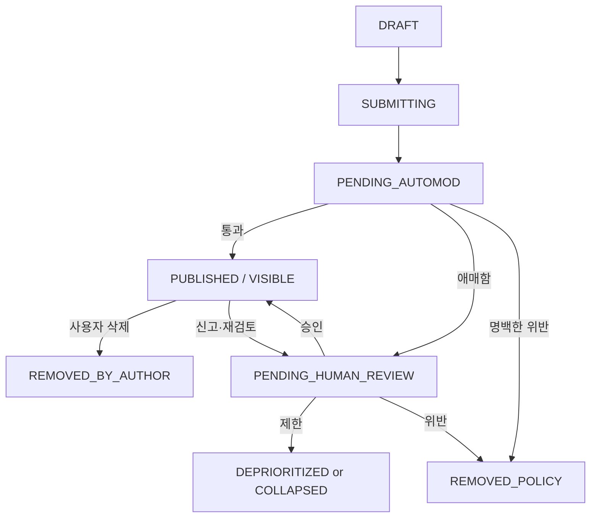

# WHICH 소셜 및 커뮤니티 v2.0

- **문서 상태:** 상세 기획 검토본
- **버전:** 2.0
- **기준일:** 2026-08-17
- **기준 문서:**
  - `01_PRODUCT_VISION_AND_PRINCIPLES_v2.md`
  - `02_CORE_UX_AND_USER_JOURNEYS_v2.md`
  - `03_ISSUE_SUPPLY_AND_CONTENT_PIPELINE_v2.md`
  - `04_ISSUE_TAXONOMY_QUALITY_AND_CONTROVERSY_v2.md`
  - `05_IDENTITY_AND_VOTE_INTEGRITY_v2.md`
  - `06_INTEREST_ONBOARDING_AND_PERSONALIZATION_v2.md`
  - `07_RECOMMENDATION_AND_ML_ARCHITECTURE_v2.md`
  - `08_SOCIAL_AND_COMMUNITY.md` v1
  - `09_MODERATION_AND_GOVERNANCE.md`
  - `10_METRICS_ANALYTICS_AND_EXPERIMENTS.md`
  - `13_GLOSSARY_AND_STATUS_MODEL.md`
- **문서 목적:** WHICH의 회원·Creator Profile, 투표 기록 공개 범위, A/B 댓글, 답글, 공감, Creator·Topic Follow, Reputation, Badge, 알림, 신고·차단·숨기기, 정치·고위험 커뮤니티 제한을 하나의 일관된 제품·데이터·운영 계약으로 정의한다.
- **문서 비범위:** 최종 개인정보·청소년·선거 법률 검토, 물리 DB DDL, 최종 UI 시각 디자인, 자동 모더레이션 모델 세부 구현, 고객지원 조직 설계, 수익 배분·광고 상품, DM·그룹 커뮤니티는 후속 문서에서 다룬다.

---

## 0. 결정 상태 표기

| 표기 | 의미 |
|---|---|
| **[확정]** | 후속 UX·DB·API·추천·모더레이션 설계의 기본 전제로 사용한다. |
| **[설계 기준]** | 원칙은 채택하되 세부 구현과 수치는 실제 운영 데이터로 조정할 수 있다. |
| **[초기안]** | MVP 또는 초기 실험을 위한 가설이며 출시 전 프로토타입·운영 검증이 필요하다. |
| **[미정]** | 별도 제품·기술·법률 결정을 거쳐야 한다. |
| **[금지]** | 제품 정체성, 안전, 개인정보, 정치 세이프라인을 해치므로 채택하지 않는다. |

### 0.1 v2 주요 보강 내용

| 영역 | v1 | v2 보강 내용 |
|---|---|---|
| 소셜 목적 | 좋은 질문과 의견 소비 | Issue 중심 Social Graph, Guest 외부 유입 보호, First Value 이후 소셜 전환 계약 |
| 프로필 | Creator Profile 중심 | 공개·비공개 데이터 매트릭스, 검색·발견 범위, 닉네임·핸들·인증 표시 정책 |
| 투표 기록 | 전체 기록 비공개 | Issue 문맥 A/B 배지, 명시적 공유, 댓글·프로필 간 비연결 원칙, 정치 선택 격리 |
| 댓글 | 작성·A/B 표시 | 작성 자격, Accepted Vote 연계, 상태 머신, 수정·삭제·Draft·실패 복구 계약 |
| 댓글 랭킹 | 품질·공감·다양성 | Eligibility, 품질 Score, A/B Slate Re-ranking, 신규 댓글 Exploration, 정치 전용 정책 |
| 공감 | 단순 공감 | 중복 방지, 취소, 조작 탐지, 공개 Count, Reaction Feature 제한 |
| 답글 | 제한된 Depth | Thread 모델, 최대 UI Depth, Reply 대상, 잠금·삭제·정렬·알림 계약 |
| 팔로우 | Creator·Topic Follow | Following Feed, 알림, 차단 충돌, Count 노출, 신규 Creator 발견, Opinion Graph 금지 |
| Reputation | 내부 신뢰 점수 후보 | 다축 Reputation, 최소 표본, 신규 Creator 보정, 외부 비공개, 운영 적용·복구 |
| Badge | 명예 보상 | Badge 유형·지급·회수·정치 및 자극성 Game 금지 |
| 신고·차단 | 기본 도구 | Report·Hide·Less·Mute·Block의 의미 분리와 개인화·모더레이션 연결 |
| 알림 | 초기 후보 | 우선순위, Digest, Frequency Cap, 분노·정치 재참여 알림 금지 |
| 고위험 영역 | Verified 후보 | 댓글 기본 비활성, Verified·재인증·Slow Mode, Incident Freeze, Fail-Closed |
| 데이터 | 개념 수준 | Social Object, Event, State, API 계약과 추천·무결성 Feature 경계 |
| 운영 | 후속 | Admin Queue, Creator Support, Audit, Incident Playbook, KPI·A/B Guardrail 추가 |

### 0.2 핵심 결정 요약

1. **[확정]** WHICH의 소셜 기능은 사람의 일상이나 팔로워 경쟁이 아니라 `좋은 질문 → 선택 이유 → 다음 질문`을 강화한다.
2. **[확정]** 외부 SNS·검색·공유 링크에서 들어온 Guest의 첫 투표를 프로필·댓글·팔로우·가입 Prompt가 막지 않는다.
3. **[확정]** 댓글은 독립 게시판이 아니라 특정 Issue에서 A/B를 선택한 이유를 설명하는 보조 콘텐츠다.
4. **[설계 기준]** 일반 Issue의 최상위 댓글 작성은 `Member + 정상 ACCEPTED Vote`를 기본 자격으로 한다.
5. **[확정]** 댓글의 A/B 배지는 해당 Issue 안에서만 표시하며 공개 프로필에서 사용자의 과거 선택을 집계하지 않는다.
6. **[확정]** 본인의 전체 투표 기록은 기본 비공개다.
7. **[확정]** 개별 Issue의 선택 공개는 사용자가 직접 공유를 선택한 경우에만 허용한다.
8. **[확정]** 공개 프로필은 `Creator Profile`에 가깝고, 작성한 Issue와 질문 품질이 중심이다.
9. **[설계 기준]** 초기 공개 프로필에서는 전체 댓글 이력과 전체 공감 이력을 한곳에 모아 제공하지 않는다.
10. **[확정]** Creator Follow는 그 사람의 정치·사회적 입장이 아니라 그 사람이 만드는 질문을 팔로우하는 기능이다.
11. **[확정]** Topic Follow는 명시적 관심사이며 추천에서 강한 신호로 사용할 수 있다.
12. **[금지]** A 선택자끼리, B 선택자끼리 자동 연결하는 Opinion Graph를 만들지 않는다.
13. **[금지]** 연락처 업로드·친구 추천·DM·그룹 채팅을 MVP에 포함하지 않는다.
14. **[설계 기준]** 댓글 랭킹은 공감 수 단독이 아니라 품질·신선도·안전·A/B 다양성을 함께 사용한다.
15. **[확정]** A/B 방향 자체는 댓글 품질 점수나 작성자 Reputation의 긍정·부정 기준이 아니다.
16. **[설계 기준]** 전체 댓글 탭은 양쪽의 일정 품질 이상 댓글을 발견할 수 있게 하되, 낮은 품질 댓글을 기계적으로 50:50 할당하지 않는다.
17. **[초기안]** MVP 공개 Reaction은 `공감` 하나로 시작하고, 비공감·분노·조롱 Reaction은 제공하지 않는다.
18. **[설계 기준]** 답글 UI Depth는 2단계를 기본으로 하고 더 깊은 관계는 같은 Thread 안에서 평탄화한다.
19. **[확정]** Creator Reputation은 내부 운영 신호이며 단일 도덕 점수나 외부 공개 숫자로 사용하지 않는다.
20. **[확정]** 신규 Creator는 Reputation이 없다는 이유만으로 노출 기회를 잃지 않으며 별도 Exploration을 받는다.
21. **[확정]** 신고는 정책 위반 주장이고 `관심 없음`은 개인 선호이므로 서로 다른 시스템으로 처리한다.
22. **[확정]** 사용자 차단은 즉시 개인 Feed·댓글·알림·팔로우 관계에 적용하며 신고와 독립적으로 동작한다.
23. **[확정]** 정치·선거·RESTRICTED 댓글은 초기 기본 비활성 또는 Verified-only Fail-Closed 정책을 사용한다.
24. **[확정]** 정치적 분노·진영 충돌을 재참여시키는 알림을 만들지 않는다.
25. **[확정]** 추천은 댓글 열람·작성·Creator Follow를 관심 신호로 사용할 수 있지만 댓글의 A/B 방향으로 정치·이념 Profile을 만들지 않는다.
26. **[확정]** 현금·수익 배분보다 품질·성과·명예 보상을 먼저 사용한다.
27. **[확정]** 소셜 기능의 모든 주요 제재와 Reputation 변경은 이유와 정책 버전을 Audit할 수 있어야 한다.

---

# 1. 문서의 역할과 제품 문제

## 1.1 소셜 기능이 해결해야 하는 문제

WHICH의 핵심 경험은 다음과 같다.

```text
질문 확인
→ A/B 선택
→ 결과 확인
→ 같은 의견과 다른 의견의 이유 확인
→ 다음 Issue
```

투표 결과만 제공하면 사용자는 분포는 알 수 있지만 다음을 알기 어렵다.

- 왜 사람들이 A를 골랐는가
- 왜 사람들이 B를 골랐는가
- 내가 놓친 조건은 무엇인가
- 같은 질문을 더 잘 만드는 Creator는 누구인가
- 관심 주제에서 다음 질문을 어떻게 발견할 것인가

반대로 일반 SNS 구조를 그대로 붙이면 다음 문제가 발생할 수 있다.

- 사람과 팔로워 수가 질문보다 중요해진다.
- 사용자의 과거 A/B 선택이 공개 성향 Profile로 축적된다.
- 다수 의견의 댓글이 공감 수를 독점한다.
- 자극적인 정치·젠더 질문 Creator가 성장한다.
- Quote·Reply·알림이 분노 재참여를 반복시킨다.
- 조직적 공감·신고·팔로우 조작이 Reputation과 추천을 오염시킨다.
- 외부 Guest가 첫 투표 전에 가입·프로필 요구를 만나 이탈한다.

따라서 WHICH의 소셜 시스템은 다음 두 목표를 동시에 달성해야 한다.

```text
선택의 이유를 발견하게 한다
+
사람 중심 진영화와 성향 추적은 제한한다
```

## 1.2 한 줄 목표

> **사람을 팔로우하는 SNS가 아니라, 좋은 질문과 선택 이유를 통해 다음 Issue를 발견하는 커뮤니티를 만든다.**

## 1.3 소셜 기능의 제품 가치

### 참여자

- 자신의 선택과 다른 사람의 이유를 비교한다.
- 반대 의견을 공격받지 않고 탐색한다.
- 관심 없는 사용자·주제·댓글을 직접 숨긴다.
- 전체 투표 이력을 공개하지 않고도 해당 Issue에서 의견을 설명한다.

### Creator

- 자신이 만든 질문에 실제 참여와 이유가 쌓인다.
- 질문 품질과 성실한 운영으로 발견 기회를 얻는다.
- 단순 팔로워 수보다 Issue 성과와 품질을 확인한다.
- 게시·검수·제한 상태를 투명하게 확인한다.

### 운영자

- 댓글·Creator·Follow·Reaction 조작을 추적한다.
- 질문 품질과 커뮤니티 피해를 분리해 대응한다.
- 정치·고위험 영역을 일반 소셜 증폭에서 격리한다.
- 제재·복구·Reputation 변화를 Audit한다.

## 1.4 비목표

- 일상 사진·영상 중심 SNS
- 개인 메시지와 단체 채팅
- 연락처 기반 친구 찾기
- A/B 선택자별 친구 추천
- 정당·후보 지지자 커뮤니티
- 공개 정치 성향 점수
- 공개 전체 투표·댓글 활동 로그
- 팔로워 수 경쟁을 중심으로 한 Creator Economy
- 분노·조롱 Reaction
- Quote-post를 통한 공개 조리돌림
- 댓글 체류시간 단독 극대화
- 신고 수만으로 자동 삭제
- Reputation을 하나의 영구적인 신뢰·도덕 점수로 사용
- Guest 첫 투표 전 소셜 가입 강제

---

# 2. 소셜 설계 원칙

## 2.1 Issue First

**[확정]** 사람보다 Issue가 정보 계층의 중심이다.

```text
Issue
├─ A/B Vote
├─ Result
├─ Comments
├─ Creator
└─ Related Issues
```

Creator Profile은 Issue를 발견한 뒤 필요할 때 진입하는 보조 경로다.

## 2.2 Reason Before Relationship

사용자는 먼저 선택 이유를 읽고, 그 후 질문 Creator를 발견한다.

```text
좋은 댓글
→ 해당 Issue 이해

좋은 질문
→ Creator Follow
```

댓글 작성자 간 친분 관계를 제품의 핵심 성장 축으로 두지 않는다.

## 2.3 Contextual Identity

A/B 선택은 특정 Issue 문맥에서만 표시한다.

```text
[A] 사용자명
이 Issue에서 A를 선택함
```

이를 다음처럼 확장하지 않는다.

```text
이 사용자는 항상 A 성향
이 사용자는 정치적으로 어느 편
이 사용자는 특정 집단
```

## 2.4 Explicit Control

사용자는 다음을 직접 제어할 수 있어야 한다.

- 관심 Topic
- Follow Creator
- Unfollow
- 이슈 숨기기
- 주제 덜 보기
- 사용자 차단
- 알림 끄기
- 추천 재설정
- 개별 선택 공개 여부

## 2.5 Risk-proportional Friction

LOW Issue의 소셜 기능에는 낮은 마찰을 유지한다.

HIGH·RESTRICTED는 다음 마찰을 강화할 수 있다.

- Verified Member
- 최근 재인증
- Slow Mode
- 댓글 사전 검토
- Thread 잠금
- 결과·댓글 임시 정지

## 2.6 Quality over Outrage

다음은 성공 신호로 보지 않는다.

- 욕설 답글 수
- 분노 Reaction
- 신고 폭증
- 같은 진영의 집단 공감
- 정치적 Quote 확산
- 한 사용자에 대한 집중 답글

## 2.7 Guest Acquisition Guardrail

외부 Guest의 첫 가치 도달은 다음이다.

```text
첫 ACCEPTED Vote
+
첫 Result View
```

이전에는 다음을 기본 노출하지 않는다.

- 프로필 완성
- Creator Follow Prompt
- 알림 권한
- 댓글 작성 강제
- 관심사 전면 온보딩
- 회원가입 Modal

## 2.8 Policy over Popularity

댓글·Creator·Issue의 Engagement가 높아도 다음을 우회할 수 없다.

- 차단
- 모더레이션 상태
- 정치 Eligibility
- Integrity Freeze
- 개인정보·권리 제한
- 사용자 Hide

## 2.9 Auditability

다음 변경은 Audit 대상이다.

- 댓글 제거·복구
- Creator 게시 제한
- Reputation Band 변경
- Badge 회수
- Follow 조작 정리
- Reaction 무효화
- 정치 Thread 잠금
- 대량 신고 사건 처리

---

# 3. 사용자 역할과 권한 모델

## 3.1 역할 구분

| 역할 | 의미 |
|---|---|
| `Guest` | 계정 없이 First-party 익명 Subject로 투표·열람하는 사용자 |
| `Member` | 계정을 가진 일반 사용자 |
| `Verified Member` | 추가 본인 확인 또는 유일성 정책을 통과한 Member |
| `Creator` | 하나 이상의 Issue를 생성·제출한 Member 역할 |
| `Trusted Creator` | 내부 Reputation과 운영 이력을 충족한 Creator Band |
| `Moderator` | 신고·댓글·Issue를 검토하는 운영자 |
| `Senior Moderator` | 정치·고위험·대량 제재를 승인하는 운영자 |
| `System Actor` | 자동 필터·추천·알림·무결성 Job |

**[확정]** `Creator`와 `Verified Member`는 서로 다른 축이다.

```text
Creator
= 콘텐츠 생산 역할

Verified Member
= 특정 기능의 신원·유일성 보증 수준
```

## 3.2 일반 권한 매트릭스

| 기능 | Guest | Member | Verified Member | Creator |
|---|---:|---:|---:|---:|
| 일반 Issue 투표 | 허용 | 허용 | 허용 | 허용 |
| 결과 확인 | 허용 | 허용 | 허용 | 허용 |
| 댓글 읽기 | 허용 | 허용 | 허용 | 허용 |
| 일반 댓글 작성 | 불가 | 허용 | 허용 | 허용 |
| 댓글 공감 | 불가 초기안 | 허용 | 허용 | 허용 |
| 답글 작성 | 불가 | 허용 | 허용 | 허용 |
| Issue 신고 | 세션 제한 허용 후보 | 허용 | 허용 | 허용 |
| 댓글 신고 | 세션 제한 허용 후보 | 허용 | 허용 | 허용 |
| Creator Follow | 불가 | 허용 | 허용 | 허용 |
| Topic Follow | 익명 관심사로 대체 | 허용 | 허용 | 허용 |
| 공개 Profile | 없음 | 선택적 최소 Profile | 선택적 | Creator Profile |
| Issue 생성 | 불가 | 허용 | 허용 | 허용 |
| 정치·RESTRICTED 댓글 | 불가 | 불가 초기안 | 정책 충족 시 허용 | Verified일 때만 후보 |

Guest에게 신고를 허용할지 여부는 Abuse 방어와 안전 접근성 사이의 실험 대상이다. 단, 안전 신고를 위해 무조건 회원가입을 요구하면 피해 신고가 줄어들 수 있으므로 First-party Session, Rate Limit, Challenge를 결합한 제한적 Guest 신고를 우선 검토한다.

## 3.3 자격과 상태의 분리

기능 자격은 다음 조건의 결합으로 판단한다.

```text
Role
+
Account State
+
Issue Risk
+
Vote State
+
Moderation State
+
Integrity State
+
Recent Authentication
```

## 3.4 계정 상태

```text
ACTIVE
LIMITED
COMMENT_COOLDOWN
CREATOR_PREMODERATION
CREATOR_SUSPENDED
ACCOUNT_SUSPENDED
DELETION_PENDING
DELETED
```

계정 상태와 콘텐츠 상태를 분리한다.

---

# 4. Guest 외부 유입과 소셜 전환 계약

## 4.1 첫 Issue 보호

외부 SNS·검색·공유 링크에서 들어온 Guest에게는 다음 순서를 보장한다.

```text
딥링크 Issue
→ A/B 투표
→ 결과
→ 댓글 읽기
→ 다음 Issue
```

첫 투표 전에 로그인·프로필·팔로우·댓글 작성·알림·관심사 선택으로 우회하지 않는다.

## 4.2 Guest가 사용할 수 있는 소셜 가치

로그인하지 않은 Guest도 다음을 경험할 수 있다.

- A/B 댓글 읽기
- 양쪽 대표 댓글 미리보기
- Creator Profile 열람
- 댓글·Issue 신고 후보
- 링크 공유
- 다음 Issue 이동

## 4.3 Just-in-time 인증

| 행동 | 인증 제안 가치 |
|---|---|
| 댓글 작성 | 작성한 이유 게시와 답글 알림 |
| 공감 | 반응 중복 방지와 여러 기기 동기화 |
| Creator Follow | 새 Issue 알림과 Following Feed |
| Issue 생성 | 검수·성과 관리 |
| 투표 기록 저장 | 브라우저 밖 기록 보존 |

## 4.4 Draft 보존

Guest가 댓글 입력을 시작한 뒤 로그인하는 UX를 제공한다면 다음을 보존한다.

- Issue ID와 Version
- Draft 본문
- Reply Target
- 입력 시작 시각
- 인증 이전 선택 상태

**[초기안]** Draft는 브라우저 로컬에 짧게 저장하고, 사용자의 명시적 동의 없이 인증 전 본문을 장기 서버 저장하지 않는다.

## 4.5 소셜 Prompt 빈도

초기안:

- 한 세션 전면 Prompt 최대 1개
- 거절한 Follow·알림 Prompt는 같은 세션 재노출 금지
- 첫 Result View 전 소셜 Prompt 금지
- 오류·CAPTCHA 직후 소셜 Prompt 금지

---

# 5. 계정 표시와 닉네임 정책

## 5.1 기본 원칙

**[설계 기준]** WHICH는 일반 콘텐츠에서 실명 공개를 요구하지 않는다.

사용자는 다음으로 표시될 수 있다.

```text
display_name
handle
profile_image
```

Verified 상태가 있더라도 법적 이름을 공개 Profile에 자동 노출하지 않는다.

## 5.2 Display Name

초기안:

- 2~20자
- Unicode 지원
- 앞뒤 공백 제거
- 줄바꿈·제어문자 금지
- 혼동 문자와 사칭 위험 검사
- 금칙어·혐오·개인정보 검사
- 변경 Cooldown 적용 후보

## 5.3 Handle

초기안:

- 영문·숫자·밑줄 중심
- 대소문자 비구분
- 3~30자
- 예약어 차단
- 사칭·상표·공식 계정 오인 방지
- 변경 이력 Audit
- 이전 Handle Redirect 보존 기간 후보

## 5.4 프로필 이미지

직접 업로드는 이미지 모더레이션·권리 범위가 증가하므로 **[초기안]** MVP에서는 Provider 이미지 또는 기본 Avatar를 우선한다.

## 5.5 Bio

초기안:

- 선택 항목
- 0~160자
- 외부 링크 0~1개 후보
- 민감정보 경고
- 정치 Campaign 링크는 별도 정책 전 제한
- 검색 Index 여부 별도 설정

## 5.6 Verification 표시

**[확정]** Verified Member는 Restricted 참여 자격을 위한 내부 보증 수준이지 일반적인 권위 인증과 동일하지 않다.

공개 표시가 필요하다면 문맥별 최소 라벨로 제한한다.

## 5.7 사칭과 공식 계정

공식 기관·언론·공인 Profile 제도가 필요해지면 다음을 별도 축으로 둔다.

```text
identity_verification
≠
official_entity_verification
```


---

# 6. 프로필 정보 구조

## 6.1 Profile 유형

```text
Member Profile
Creator Profile
Private Me Profile
Moderator View
```

### Member Profile

Issue 생성 이력이 없는 일반 Member의 최소 공개 Profile이다.

### Creator Profile

작성한 Issue와 질문 성과를 보여주는 공개 Profile이다.

### Private Me Profile

본인만 볼 수 있는 투표 기록·Draft·설정·제재·알림 영역이다.

### Moderator View

정상 운영을 위해 필요한 신고·제재·Reputation·Integrity 정보가 보이는 제한된 운영 화면이다.

## 6.2 공개 Creator Profile

공개 후보:

- Display Name
- Handle
- Avatar
- 짧은 Bio
- 관심 Topic 또는 주로 다루는 Topic
- 가입 월·연도 후보
- 게시된 Issue 수
- 받은 정상 투표 수
- 대표 Issue
- 최근 Issue
- 공개 Badge
- Follow 버튼
- 신고·차단 메뉴

## 6.3 초기 비공개 항목

- 전체 투표 선택 내역
- 정치·사회 Issue별 선택
- 전체 댓글 이력의 Profile 집계
- 전체 공감·신고 활동
- 팔로우한 Creator 전체 목록 후보
- Follower 개별 목록 후보
- 이메일·전화번호
- Provider UID
- Verification 증빙
- IP·Device·Risk 정보
- 내부 Reputation Raw Score
- 모더레이션 이력
- 개인화 Vector
- 추천 Segment
- 계정 복구 정보

## 6.4 댓글 이력 공개 제한

댓글은 각 Issue에서 공개될 수 있지만 초기 공개 Profile에 다음 화면을 제공하지 않는다.

```text
이 사용자가 지금까지 쓴 모든 댓글
+
각 댓글의 A/B Badge
```

이 기능은 사용자의 장기 정치·사회적 선택을 쉽게 수집하는 성향 Profile이 될 수 있다.

향후 댓글 이력 공개를 검토하더라도 다음이 필요하다.

- 사용자의 명시적 Opt-in
- 정치·RESTRICTED 댓글 제외
- 검색 엔진 Index 제한
- 선택 Badge 제거 또는 문맥 전용
- 기간·Topic 범위 제어

## 6.5 Profile 검색

초기안:

- 정확한 Handle 검색
- Display Name 검색
- 인기 Creator 발견
- Topic별 Creator 발견

금지:

- 이메일·전화번호 검색
- 연락처 업로드 친구 찾기
- A/B 선택 기준 사용자 검색
- 정치 성향·댓글 내용 기반 사람 검색
- 지역·학교·직장 조합 검색

## 6.6 Follower Count

팔로워 수를 전면 노출하면 다음 문제가 생길 수 있다.

- 사람 중심 인기 경쟁
- 신규 Creator 불리
- Follow Farm
- 자극적 질문 보상
- Reputation과 인기 혼동

따라서 초기안은 다음 중 하나다.

```text
A. 정확한 수 비공개
B. 구간 표시: 100+, 1천+, 1만+
C. Creator 본인에게만 정확한 수 제공
```

MVP 권고는 `C + 필요 시 B`다.

## 6.7 Profile의 빈 상태

Member가 아직 Issue를 만들지 않았다면 다음을 강조하지 않는다.

```text
팔로워 0
게시물 0
```

대신 다음을 제공한다.

- 관심 Topic 설정
- 첫 Issue 만들기
- 투표 기록 보기
- Creator 기능 안내

---

# 7. 공개·비공개 데이터 매트릭스

| 데이터 | 본인 | 다른 사용자 | 운영자 | 추천 시스템 |
|---|---:|---:|---:|---:|
| Display Name·Handle | 허용 | 허용 | 허용 | 최소 사용 |
| 작성 Issue | 허용 | 허용 | 허용 | 사용 가능 |
| 공개 Badge | 허용 | 허용 | 허용 | 제한 사용 |
| 전체 투표 기록 | 허용 | 불가 | 제한 접근 | Topic 관심 신호만 |
| 개별 A/B 선택 | 허용 | 해당 Issue 댓글·명시적 공유만 | 제한 접근 | 방향은 민감 Feature 금지 |
| 전체 댓글 이력 | 허용 후보 | 기본 비공개 | 허용 | Topic·품질 신호 |
| 정치 댓글 이력 | 허용 | Profile 집계 불가 | 강화 접근 | 방향 Feature 금지 |
| Follow Creator | 허용 | 기본 비공개 후보 | 허용 | 명시적 관심 신호 |
| Topic Follow | 허용 | 선택 공개 후보 | 허용 | 강한 관심 신호 |
| Reputation Raw Score | 제한 요약 | 불가 | 허용 | Band만 사용 |
| 신고 이력 | 허용 요약 후보 | 불가 | 허용 | 선호 Feature 사용 금지 |
| Block 목록 | 허용 | 불가 | 제한 접근 | Hard Filter |
| Verification 정보 | 상태만 | 기본 비공개 | 필요 범위 | Eligibility만 |
| 이메일·전화번호 | 허용 | 불가 | 최소 접근 | 사용 금지 |
| IP·Device Risk | 불가 | 불가 | 보안 역할만 | 추천 Feature 금지 |

---

# 8. 투표 기록과 소셜 공개 경계

## 8.1 본인용 투표 기록

본인에게는 다음을 제공할 수 있다.

```text
참여 Issue 수
최근 참여
카테고리별 참여
다수·소수 의견 비율
저장한 Issue
개별 결과 재방문
```

이 기록은 공개 Profile과 분리한다.

## 8.2 개별 선택 공유

사용자가 결과 공유 시 다음을 직접 선택할 수 있다.

```text
[ ] 내가 고른 선택도 표시
```

초기 기본값:

- 일반 LOW Issue: 비공개
- 사회·HIGH Issue: 비공개
- 정치·RESTRICTED Issue: 강한 비공개, 별도 경고 또는 기능 제한

## 8.3 댓글 A/B Badge

댓글의 선택 방향은 서버의 정상 Vote에서 파생한다.

```text
comment.side
=
accepted_vote.choice_position
```

사용자가 댓글 작성 시 A/B를 임의 선택하지 않는다.

## 8.4 A/B Badge의 범위

허용:

- 해당 Issue 댓글
- 해당 Issue 답글
- 해당 Issue의 댓글 미리보기

금지:

- 공개 Profile의 누적 A/B 통계
- 같은 선택 사용자 추천
- 정치 성향 추론
- 검색 엔진 Snippet의 선택 방향
- 외부 Bulk Export
- Creator Dashboard의 개별 사용자 선택 목록

## 8.5 Vote 무효화와 댓글

댓글 작성자의 Vote가 사후 `REVIEW` 또는 `INVALIDATED`가 되면 다음 정책을 적용한다.

```text
REVIEW
→ 댓글 Ranking 제외 또는 제한
→ A/B Badge 내부 검토 상태

INVALIDATED_ABUSE
→ 댓글 자동 제한 후보
→ 조직적 행위와 연결해 인간 검토

RESTORED
→ 댓글과 Ranking 복구
```

단순 Vote 무효화만으로 의견 내용을 정책 위반으로 간주하지 않는다.

```text
Vote Integrity
≠
Comment Content Eligibility
```

## 8.6 데이터 Export 제한

사용자 본인은 자신의 기록을 Export할 수 있어야 하지만 다음을 제한한다.

- 타인의 A/B 선택 Bulk Export
- 정치 Issue별 사용자 명단
- 공개 댓글에서 A/B를 대량 수집하는 공식 API
- Creator에게 개별 투표자 목록 제공
- 제3자 광고 타게팅 Export

---

# 9. 소셜 정보 구조와 Surface

## 9.1 주요 Surface

```text
Issue Result
├─ Comment Preview
├─ Full Comments
├─ A Comments
├─ B Comments
└─ Creator Entry

Creator Profile
├─ Representative Issues
├─ Recent Issues
├─ Topic
├─ Badge
└─ Follow

Following Feed
├─ Followed Creator
└─ Followed Topic

Me
├─ Vote History
├─ My Issues
├─ Drafts
├─ Comments
├─ Notifications
├─ Following
├─ Hidden / Blocked
└─ Settings
```

## 9.2 Comment Surface

| Surface | 목적 |
|---|---|
| Result Preview | 양쪽 이유가 존재함을 빠르게 보여줌 |
| All | 품질과 A/B 다양성을 함께 탐색 |
| A Side | A 선택자의 이유만 탐색 |
| B Side | B 선택자의 이유만 탐색 |
| Replies | 특정 논점의 대화 |
| Latest | 최신 댓글 발견 후보 |
| My Comments | 본인 관리용, 공개 Profile과 분리 |

## 9.3 Creator Surface

Creator Profile은 다음 질문에 답해야 한다.

- 어떤 Topic의 질문을 만드는가
- 대표 질문은 무엇인가
- 최근 게시 상태는 어떠한가
- 품질 관련 공개 성과가 있는가
- 팔로우할 가치가 있는가

다음 질문에 답하도록 만들지 않는다.

- 어느 정치 진영인가
- 과거 모든 Issue에서 무엇을 골랐는가
- 누구와 친한가
- 어떤 이용자를 싫어하는가

---

# 10. 댓글의 제품 계약

## 10.1 댓글의 역할

댓글은 다음을 위한 콘텐츠다.

```text
내 선택의 이유 설명
조건과 예외 제시
반대 선택의 논리 이해
질문의 전제·출처 보완
```

댓글은 다음을 위한 독립 공간이 아니다.

- 무관한 일상 게시
- Creator 홍보
- 정당·집단 조직화
- 링크 도배
- 특정 사용자 추적
- 투표 방향 지시 Campaign

## 10.2 최상위 댓글 작성 자격

**[설계 기준]** 일반 Issue의 최상위 댓글은 다음을 충족해야 한다.

```text
Member
+
Issue에 ACCEPTED Vote 존재
+
Account 상태 정상
+
Comment Thread Open
+
Rate Limit 통과
+
자동 안전 검사 통과
```

이 구조는 댓글을 실제 참여 이유와 연결하고 외부 좌표찍기의 댓글 진입 비용을 높인다.

## 10.3 답글 작성 자격

초기안:

```text
Member
+
해당 Issue에 ACCEPTED Vote
+
Thread Open
```

답글에도 해당 Issue의 A/B Badge가 붙는다.

대안:

- 답글은 Vote 없이 허용
- Top-level만 Vote 필수

MVP 권고는 모든 댓글·답글에 Accepted Vote를 요구하는 방식이다. 운영 데이터로 진입 장벽과 대화 품질을 비교한다.

## 10.4 투표 없이 댓글을 쓰려는 사용자

다음 안내를 제공한다.

> 먼저 A 또는 B를 선택하면 댓글로 이유를 남길 수 있습니다.

결과를 본 뒤 댓글만 쓰기 위해 억지 Vote를 유도할 위험이 있으므로 댓글은 투표 전 결과를 노출하지 않는다.

## 10.5 Issue 상태와 댓글

| Issue 상태 | 읽기 | 작성 |
|---|---:|---:|
| `PUBLISHED` | 허용 | 허용 |
| `CLOSED` | 허용 후보 | 종료 정책 |
| `UNDER_REVIEW` | 허용 또는 제한 | 기본 중단 |
| `RESULT_LOCKED` | 제한 후보 | 중단 |
| `LIMITED` | 정책별 | 정책별 |
| `REMOVED` | 제한 안내 | 불가 |
| `ARCHIVED` | 허용 후보 | 불가 초기안 |

## 10.6 결과와 댓글 순서

**[확정]** 댓글을 쓰려면 먼저 Vote가 정상 접수되어야 한다.

```text
Vote Accepted
→ Result
→ Comment
```

## 10.7 댓글 작성자 표시

댓글에는 다음을 표시한다.

- A/B Badge
- Display Name
- Avatar 후보
- 작성 시각
- 수정됨 표시
- 공개 Badge 일부 후보
- 공감 수
- 답글 수

표시하지 않는다.

- 전체 Vote 수
- 정치 성향
- 내부 Reputation
- Verification 증빙
- IP·지역
- 팔로워 수를 댓글마다 강조

---

# 11. 댓글 객체와 데이터 구조

## 11.1 Comment 논리 객체

```text
comment_id
issue_id
issue_version
author_user_id
author_profile_snapshot_id
accepted_vote_id
choice_position
parent_comment_id
thread_root_id
body
body_format
language
status
visibility
moderation_state
integrity_state
reply_count
reaction_count
created_at
edited_at
deleted_at
version
```

## 11.2 Author Profile Snapshot

닉네임 변경 후 과거 댓글 표시 정책을 위해 다음 중 하나를 선택할 수 있다.

```text
A. 현재 Profile을 항상 표시
B. 작성 시점 Snapshot을 표시
C. 현재 이름 + Audit용 Snapshot 보관
```

초기 권고는 `C`다.

## 11.3 Comment Revision

```text
comment_revision_id
comment_id
revision_number
previous_body
new_body
edit_reason
editor_user_id
moderation_required
created_at
```

모든 수정 내용을 영구 공개할 필요는 없지만 운영자는 Revision을 확인할 수 있어야 한다.

## 11.4 Reply 관계

```text
thread_root_id
parent_comment_id
reply_to_user_id
display_depth
```

실제 저장 구조는 임의 깊이를 허용할 수 있지만 UI는 제한된 Depth로 평탄화한다.

## 11.5 Reaction

```text
comment_reaction_id
comment_id
user_id
reaction_type
integrity_state
created_at
removed_at
```

초기 `reaction_type`:

```text
HELPFUL
```

---

# 12. 댓글 상태 머신

## 12.1 작성 처리 상태

```text
DRAFT
SUBMITTING
PENDING_AUTOMOD
PENDING_HUMAN_REVIEW
PUBLISHED
FAILED
```

## 12.2 공개·모더레이션 상태

```text
VISIBLE
DEPRIORITIZED
COLLAPSED
HIDDEN
REMOVED_BY_AUTHOR
REMOVED_POLICY
LOCKED
```

작성 처리 상태와 공개 상태를 분리한다.

## 12.3 기본 상태 전이



## 12.4 댓글 수정

초기안:

- 게시 후 10분 이내 자유 수정 후보
- 첫 답글 이후 수정 시 `수정됨` 표시
- HIGH·RESTRICTED 댓글 수정은 재검토
- 링크 추가·실질 의미 변경은 재검토
- 삭제된 금칙 표현을 우회해 다시 넣는 수정은 제한

댓글 수정으로 A/B Badge를 바꿀 수 없다.

## 12.5 댓글 삭제

사용자 삭제 시:

- 답글이 없으면 본문 제거
- 답글이 있으면 `삭제된 댓글입니다` Placeholder 후보
- 공감·답글 집계 재계산
- 정책·감사 목적의 내부 보존은 별도 기간 적용

정책 제거 시 사용자에게 가능한 범위에서 이유와 이의 제기 경로를 제공한다.

## 12.6 댓글 잠금

다음 경우 Thread 또는 Issue 댓글을 잠글 수 있다.

- 정치·고위험 Incident
- 특정 사용자 집중 괴롭힘
- 대량 Spam
- 좌표찍기
- 출처 정정·Issue 검토
- 시스템 장애

잠금은 기존 댓글 삭제와 구분한다.

---

# 13. 댓글 작성 UX

## 13.1 기본 흐름

```text
결과 확인
→ 댓글 작성
→ 자격 검사
→ 입력
→ 안전 안내
→ 제출
→ 자동 검사
→ 게시 또는 검토
→ 원래 위치 복귀
```

## 13.2 입력 계약

초기안:

- 최소 2자
- 최대 1,000자
- Plain Text 우선
- 줄바꿈 허용
- 이미지·파일 첨부 없음
- 외부 링크 0~1개 후보
- 링크 Preview 없음 또는 안전 검사 후 제한
- @Mention 최소화
- Markdown 제한 또는 미지원

이미지·GIF·영상 댓글은 MVP에서 제외한다.

## 13.3 작성 도움

입력창은 다음 Prompt를 제공할 수 있다.

```text
왜 그렇게 선택했나요?
조건이나 경험을 짧게 적어주세요.
```

다음 Prompt는 피한다.

```text
반대편을 설득해보세요.
왜 상대방이 틀렸나요?
```

## 13.4 자동 안전 검사

- 욕설·모욕
- 혐오·차별
- 위협
- 개인정보
- 링크 Spam
- 반복 복붙
- 무관한 홍보
- 특정 사용자 집중 공격
- 외부 투표 지시
- 정치 Campaign 문구
- 자동 생성 대량 댓글 패턴

## 13.5 수정 제안

예:

```text
원문:
B 고른 사람들은 생각이 없나?

제안:
저는 B보다 A가 현실적이라고 봅니다. 이유는 ...
```

## 13.6 실패 복구

네트워크 실패 시:

- Draft 유지
- 중복 제출 방지
- Idempotency Key 사용
- 재시도 가능
- 실제 게시 여부 확인
- 로그인 만료 시 Draft 복구

## 13.7 로그인 전 Draft

Guest가 댓글 입력창을 열 수 있게 하는 경우:

1. 본문 작성
2. 등록 버튼
3. 로그인 요청
4. 인증 후 Draft 복원
5. Vote·Issue 상태 재검증
6. 제출

Issue가 그 사이 잠겼다면 Draft를 복사할 수 있게 하고 게시 불가 이유를 안내한다.

---

# 14. A/B 댓글 구조

## 14.1 탭

```text
[전체] [A 의견] [B 의견]
```

## 14.2 A/B Badge 문구

선택지 문구가 짧으면 다음을 사용할 수 있다.

```text
[A] 민폐다
[B] 상관없다
```

선택지가 길면 Badge는 `A` 또는 `B`로 표시하고 전체 선택지 문구는 접근성 Label로 제공한다.

## 14.3 Badge 색상

색상만으로 구분하지 않는다.

- 문자 `A`·`B`
- 선택지 축약 문구
- 형태·아이콘
- 접근성 Label

정치·민감 Issue에서 진영 색상으로 오인될 수 있는 고정 색상 사용을 피한다.

## 14.4 댓글 수 표시

표시 후보:

```text
전체 381
A 241
B 140
```

Side별 댓글 수는 결과 이후에만 표시한다.

## 14.5 한쪽 댓글이 없는 경우

```text
아직 B 의견의 이유가 없습니다.
B를 선택했다면 첫 번째 이유를 남겨보세요.
```

사용자가 선택하지 않은 쪽에 댓글을 쓰도록 유도하지 않는다.

---

# 15. 댓글 랭킹 시스템

## 15.1 목표

- Issue와 관련 있는 이유를 상단에 배치
- 욕설·도배·Spam 감점
- 양쪽의 이해 가능한 이유 발견
- 신규 고품질 댓글에 기회 제공
- 다수 의견의 공감 독점 완화
- 정치·고위험 Engagement 증폭 방지

## 15.2 댓글 Ranking Pipeline

```text
Comment Eligibility
→ Feature Hydration
→ Base Quality Score
→ Safety / Integrity Adjustment
→ Side-aware Re-ranking
→ User Block / Hide
→ Final Comment Slate
```

## 15.3 Eligibility

다음 댓글은 공개 Ranking 대상에서 제외한다.

- `REMOVED_POLICY`
- `HIDDEN`
- `PENDING_HUMAN_REVIEW`
- 현재 사용자가 차단한 작성자
- 현재 사용자가 숨긴 댓글
- Integrity Incident 연결 댓글
- 중복·Spam Cluster

## 15.4 Base Score 초기안

```text
Base Comment Score
=
Relevance
+ Reason Quality
+ Clarity
+ Helpful Reaction
+ Constructive Replies
+ Freshness
+ Author Reliability
+ New Comment Exploration
- Safety Penalty
- Spam Penalty
- Repetition Penalty
```

A 또는 B 선택 방향은 Base Score에 포함하지 않는다.

## 15.5 품질 신호

### 긍정 후보

- 질문과 직접 관련됨
- 이유·조건·경험을 설명함
- 출처나 근거를 적절히 제공함
- 모욕 없이 반대 의견을 다룸
- 다른 사용자가 `공감`함
- 의미 있는 답글이 이어짐
- 신고율이 낮고 안전 검사를 통과함

### 부정 후보

- 선택만 반복
- 욕설·비꼼
- 무관한 정치·광고
- 동일 문구 복붙
- 외부 투표 지시
- 특정 사용자 호출 공격
- 링크 도배
- 답글 수만 많은 싸움

## 15.6 Side-aware Re-ranking

전체 탭의 최종 Slate는 다음 원칙을 사용한다.

```text
품질 Threshold를 통과한 A 댓글
+
품질 Threshold를 통과한 B 댓글
+
전체 Base Score 상위
```

**[확정]** 기계적인 50:50 할당은 하지 않는다.

## 15.7 Result Preview Slate

결과 화면 미리보기 초기안:

```text
A 대표 댓글 1개
B 대표 댓글 1개
```

조건:

- 각 댓글이 최소 품질 기준 통과
- 정책·신고·Integrity 정상
- 사용자가 차단하지 않은 작성자
- 서로 의미적으로 중복되지 않음

한쪽에 적격 댓글이 없으면 반대쪽 댓글을 두 개 채우기보다 한 개와 빈 상태를 표시한다.

## 15.8 신규 댓글 Exploration

공감 수가 없는 신규 댓글도 일정 비율로 노출한다.

- 각 Side 최신 고품질 댓글 Slot
- 작성 후 일정 시간 Exploration
- 신규 Member·Creator에게 별도 최소 기회
- 반복 Spam Account 제외

## 15.9 Ranking Feedback Loop

다음을 기록한다.

- Comment Impression
- Position
- Surface
- Ranking Version
- Reaction Rate
- Expand Rate
- Reply Rate
- Hide·Report Rate
- Side

## 15.10 정치 댓글 Ranker

정치·RESTRICTED는 일반 Comment Ranker와 분리한다.

- 공감·답글 Engagement 가중치 제한
- Quality·Civility·Source·Integrity 우선
- 외부 Burst 발생 시 Ranking Freeze
- 신규 댓글 사전 검토 후보
- 정치 Choice 방향을 장기 User Feature로 저장하지 않음


---

# 16. 공감과 Reaction

## 16.1 MVP Reaction

**[초기안]** 공개 Reaction은 `공감` 하나로 시작한다.

내부 코드:

```text
HELPFUL
```

사용자 문구 후보:

```text
공감
도움이 됐어요
생각해볼 만해요
```

프로토타입에서 가장 직관적인 문구를 선택한다.

## 16.2 제공하지 않는 Reaction

초기에는 다음을 제공하지 않는다.

- 싫어요
- 화나요
- 조롱
- 폭소
- 상대편 패배
- 정치 진영 Emoji
- Ratio 기능

이 Reaction들은 분노·조롱·진영 경쟁을 보상할 수 있다.

## 16.3 Reaction 권한

초기안:

| 사용자 | 공감 |
|---|---:|
| Guest | 불가 |
| Member | 허용 |
| Verified | 허용 |

Guest 공감은 조작 비용과 중복 방지 문제가 크므로 MVP에서는 Member 전용을 권고한다. Guest의 첫 Vote에는 영향을 주지 않는다.

## 16.4 중복과 취소

```text
comment_id + user_id
```

당 하나의 활성 Reaction만 허용한다.

- 다시 누르면 취소
- Idempotency 적용
- 여러 탭 동시 클릭 Transaction 처리
- 계정 정지 Reaction 무효화 후보

## 16.5 Reaction Count 표시

초기안:

- 0은 생략 가능
- 낮은 Count는 정확히 표시
- 대규모 Count는 축약 가능
- 내부 유효 Reaction만 집계
- `REVIEW` Reaction 제외
- 무효화 후 재계산

## 16.6 Reaction 조작

탐지 후보:

- 짧은 시간 특정 댓글 집중
- 신규 계정 대량 Reaction
- 동일 Network Burst
- Follow Farm 연계
- 댓글 작성 직후 비정상 급증
- 특정 Side 댓글만 조직적 Reaction

조작 의심 시 다음을 분리한다.

```text
댓글 내용 Eligibility
≠
Reaction Integrity
```

Reaction을 무효화해도 댓글 자체를 자동 삭제하지 않는다.

---

# 17. 답글과 Thread 구조

## 17.1 목적

답글은 특정 이유에 대한 질문·보완·반론을 위한 기능이다.

Issue 자체보다 Thread가 커뮤니티를 압도하지 않도록 제한한다.

## 17.2 Depth

**[초기안]** UI 최대 Depth는 2단계다.

```text
최상위 댓글
└─ 답글
   └─ 추가 답글은 같은 답글 목록에 평탄화
```

저장 구조는 원래 Parent를 유지해 문맥을 잃지 않는다.

## 17.3 Reply 대상

화면에는 필요 시 다음을 표시한다.

```text
@사용자에게 답글
```

대량 Mention, 여러 사용자 동시 호출, 외부 Mention 알림은 제한한다.

## 17.4 답글 정렬

초기 후보:

- 기본: 작성 시각 + 품질
- 작성자 답변 강조 후보
- 공감 상위 답글 일부
- 최신 답글 접기·펼치기
- 정책 제한 답글 Collapse

답글 수가 많아도 처음부터 전부 펼치지 않는다.

## 17.5 삭제된 Parent

Parent가 사용자 삭제되면:

```text
삭제된 댓글입니다.
└─ 기존 답글 유지
```

Parent가 정책 위반으로 제거된 경우 답글도 문맥·피해를 검토한다.

## 17.6 Thread Lock

운영자는 다음 범위로 잠글 수 있다.

- 개별 댓글 Thread
- 특정 Side 댓글
- 전체 Issue 댓글

Side 단위 잠금은 차별적 운영으로 보일 수 있으므로 명확한 Abuse 근거와 Audit가 필요하다.

## 17.7 Slow Mode

고위험 또는 Burst 상황에서 다음을 적용할 수 있다.

```text
댓글 간 30초
1분
5분
```

Slow Mode는 투표 속도와 별도다.

---

# 18. Creator Follow

## 18.1 의미

Creator Follow는 다음 의미다.

> 이 사람이 만드는 질문을 앞으로도 보고 싶다.

다음 의미가 아니다.

> 이 사람과 정치·사회 의견이 같다.

## 18.2 Follow 객체

```text
follower_user_id
creator_user_id
status
source_surface
created_at
updated_at
```

상태 후보:

```text
ACTIVE
MUTED
REMOVED
BLOCKED
INVALIDATED
```

## 18.3 Follow UX

진입 후보:

- Creator Profile
- Issue 작성자 영역
- Issue 게시 후 Creator 추천 후보
- Following Feed 빈 상태

첫 외부 Guest 투표 전에는 Follow Prompt를 강조하지 않는다.

## 18.4 Follow와 알림

Follow 후 즉시 모든 알림을 켜지 않는다.

기본:

```text
Following Feed 포함
+
알림은 별도 Opt-in 또는 낮은 빈도
```

알림 선택:

- 새 Issue마다
- 주요 Issue만
- 주간 Digest
- 알림 끄기

## 18.5 Unfollow와 Mute

```text
Unfollow
→ Following Feed에서 제거
→ Creator 알림 제거

Mute
→ Follow 관계 유지 가능
→ 알림만 끔
```

## 18.6 Block 충돌

사용자 A가 Creator B를 차단하면:

- Follow 관계 종료
- B의 Issue Feed 제외
- B 댓글 숨김
- B 알림 제거
- B Profile 직접 접근 제한 또는 경고
- B가 A를 Follow 중이라면 관계 처리 정책 적용

## 18.7 Follow Count

정확한 Count 공개는 미정이다.

MVP 권고:

- Creator 본인 Dashboard에는 정확한 수
- 공개 Profile에는 비공개 또는 구간
- 댓글에는 팔로워 수 표시 금지
- Ranking에 Raw Follower Count 직접 우선 사용 금지

## 18.8 신규 Creator 발견

신규 Creator는 Follower가 없어도 다음 후보가 된다.

- Issue Quality 통과
- 낮은 신고·중복 위험
- Editorial Exploration
- Topic 적합성
- 신규 Creator Slot

---

# 19. Topic Follow

## 19.1 의미

Topic Follow는 사용자의 명시적 관심사다.

```text
AI
게임
직장문화
음식
여행
```

## 19.2 Interest와의 관계

```text
Topic Follow
>
Onboarding Interest
>
Behavior Inference
```

와 같은 강한 명시적 신호로 사용할 수 있다. 정확한 Weight는 추천 문서에서 조정한다.

## 19.3 Following Feed 구성

```text
Followed Creator의 신규 Issue
+
Followed Topic의 신규·고품질 Issue
+
소량의 Discovery
```

Following Feed도 다음 정책을 통과한다.

- 차단
- 안전
- Risk Eligibility
- 중복 제거
- 동일 Creator 과다 제한
- 정치 격리

## 19.4 정치 Topic

정치·선거 Topic Follow는 MVP 기본 카탈로그에서 제외한다.

향후 제공하려면:

- 별도 Surface
- 명확한 비대표성·안전 안내
- 정치 Choice 기반 세분화 금지
- 일반 Feed와 분리
- 조직 동원 알림 금지

---

# 20. Opinion Graph 금지 경계

## 20.1 금지 구조

```text
A 선택자끼리 Follow 추천
B 선택자끼리 그룹 생성
같은 정치 선택 사용자 추천
반대편 사용자 호출
친구의 A/B 선택 자동 노출
```

## 20.2 허용 구조

```text
같은 Topic에 관심
좋은 질문 Creator를 Follow
같은 Issue의 A/B 이유 탐색
팔로우한 Creator의 신규 Issue
```

## 20.3 연락처와 친구 그래프

MVP에서는 다음을 제공하지 않는다.

- 연락처 업로드
- 전화번호 친구 찾기
- SNS 친구 Import
- 자동 지인 추천
- 위치 기반 사용자 추천
- 학교·직장 기반 연결

## 20.4 DM·그룹·Quote-post

MVP 제외:

- Direct Message
- Group Chat
- Private Community
- Quote-post
- Mass Mention
- 사용자 간 선물·후원

Quote-post는 특정 의견을 공개적으로 조리돌림하는 수단이 될 수 있으므로 별도 안전 설계 전 제공하지 않는다.

---

# 21. Creator Profile과 Dashboard

## 21.1 공개 Profile 목적

공개 Profile은 다음을 보여준다.

- 어떤 질문을 만드는가
- 어느 Topic을 주로 다루는가
- 대표 Issue가 무엇인가
- 품질 관련 공개 성과가 있는가
- 새 Issue를 팔로우할 가치가 있는가

## 21.2 공개 성과 후보

```text
게시 Issue 수
받은 정상 Vote 수
대표 Issue
최근 Issue
공개 Badge
Topic 분포
```

다음은 기본 비공개다.

- 개별 투표자 명단
- 개별 Referrer 원본
- 정치 선택별 사용자 목록
- 신고자 정보
- 내부 Quality Score
- Integrity Risk
- Moderation 상세 이력

## 21.3 Creator Dashboard

Creator 본인에게 제공할 수 있는 지표:

- Issue Impression
- Vote Conversion
- Accepted Vote
- Result View
- Next Issue Rate
- 댓글 수
- 공유 수
- Follow 증가
- 카테고리 내 상대적 성과 후보
- 검수 상태
- 신고·제한 요약
- 출처 정정 요청
- Badge 진행 상황

## 21.4 지표 지연

실시간 숫자는 조작을 유도할 수 있으므로 다음 지연을 검토한다.

- Accepted Vote: 거의 실시간
- 추천 Impression: 수분~시간 지연
- Referrer: 집계 구간
- 신고: 구체 수 대신 상태
- Integrity Review: 검토 완료 후 반영
- 정치·고위험: 더 큰 지연 또는 제한

## 21.5 Creator가 볼 수 없는 분석

- 사용자별 선택 목록
- 정밀 IP·기기 정보
- 정치 성향 추론
- 인구통계 추론
- 차단한 사용자 명단
- 신고자 신원
- 다른 Creator의 내부 Reputation

## 21.6 Issue 성과와 보상

초기 보상은 다음 중심이다.

```text
노출
정상 Vote
댓글
공유
품질 Badge
Editor Pick
```

현금 보상은 다음 위험 검토 전 도입하지 않는다.

- 자극적 질문
- 중복 도배
- 봇 Vote
- 정치 Campaign
- 출처 무단 복제
- 신고 조작

---

# 22. Creator Reputation

## 22.1 목적

Reputation은 다음 운영 결정을 보조한다.

- 검수 우선순위
- 게시 빈도
- 신규 Issue Exploration
- 사전 검수 필요 여부
- 반복 위반 대응
- 공개 Badge 자격 후보

## 22.2 단일 점수 금지

**[확정]** 하나의 `신뢰도 83점`으로 모든 것을 표현하지 않는다.

논리 축:

```text
QUALITY
COMPLIANCE
RELIABILITY
ORIGINALITY
SOURCE_PRACTICE
COMMUNITY_SAFETY
```

## 22.3 신호 후보

### Quality

- 질문 명확성
- Binary Fit
- 선택지 대칭성
- 편집 승인률
- 정상 Vote Conversion
- Next Issue Rate

### Compliance

- 정책 위반
- 수정 요청 준수
- 삭제·제한 비율
- 반복 경고

### Reliability

- 출처 정정 빈도
- 게시 후 중대한 오류
- 검수 응답
- 계정 연속성

### Originality

- 의미 중복률
- 복붙
- 타 Creator 질문 모방
- 시리즈 품질

### Community Safety

- 댓글 갈등 유발 패턴
- 신고 적중률
- 조작 Traffic 연계
- 특정 집단 표적화

## 22.4 Reputation Band

초기 예:

```text
NEW
ESTABLISHING
STANDARD
TRUSTED
RESTRICTED
SUSPENDED
```

`TRUSTED`는 유명함이 아니라 일정 기간 품질·준수 기록을 충족했다는 내부 Band다.

## 22.5 최소 표본

Issue 1개가 크게 성공했다고 바로 Trusted로 승격하지 않는다.

초기 후보:

- 최소 게시 Issue 수
- 최소 운영 기간
- 최소 정상 Vote
- 중대한 위반 없음
- 여러 Topic·시점에서 일관성

## 22.6 신규 Creator 보정

```text
Reputation 없음
≠
낮은 품질
```

- 기본 Neutral Prior
- Issue 자체 Quality 우선
- 신규 Creator Exploration
- 소량 게시 한도
- 초기 검수 강화
- 성과가 쌓이면 Band 갱신

## 22.7 Reputation 감소와 복구

중대한 위반 또는 반복 저품질이 있으면 Band가 내려갈 수 있다.

복구 조건 후보:

- 일정 기간 정상 운영
- 수정 요청 준수
- 신규 Issue 품질
- 이의 제기 성공
- False Positive 복구

모든 변경은 이유 코드와 Snapshot을 남긴다.

## 22.8 외부 공개 금지

공개하지 않는다.

```text
Reputation Raw Score
Report Accuracy
Moderation Risk
Integrity Risk
Creator Trust Probability
```

## 22.9 추천 Feature

추천에는 Raw Score보다 안정된 Band와 Issue 품질을 사용한다.

```text
creator_reputation_band
creator_issue_quality_history
creator_freshness
new_creator_flag
```

Follower Count를 Reputation 대리값으로 사용하지 않는다.

---

# 23. Badge와 비금전 보상

## 23.1 Badge 목적

- 좋은 질문 생산 동기
- 성과 확인
- 품질 기준 설명
- 지속적 참여 보상

## 23.2 Badge 유형

### 성과 Badge

```text
1천 표 달성
1만 표 달성
10만 표 달성
```

정상 `ACCEPTED Vote` 기준으로 계산한다.

### 품질 Badge

```text
좋은 질문 작성자
균형 잡힌 선택지
출처를 잘 제시한 질문
```

### 지속성 Badge

```text
연속 활동
여러 Topic의 고품질 Issue
정정 요청 성실 대응
```

### 편집 Badge

```text
오늘의 Issue
이번 주 Editor Pick
유희형 질문 추천
```

## 23.3 금지 Badge

- 특정 정치 선택 Badge
- 후보·정당 지지 Badge
- 상대편을 이긴 Badge
- 신고를 많이 받은 `논쟁왕`
- 댓글 싸움 수 Badge
- 극단적 소수 의견 Badge
- 좌표 유입 성과 Badge

## 23.4 Badge 회수

다음 경우 회수할 수 있다.

- Vote 무효화로 기준 미달
- 표절·중복 확인
- 출처 조작
- 중대한 정책 위반
- 운영 오류

회수는 Audit하고 Creator에게 사유를 안내한다.

## 23.5 Badge의 추천 영향

Badge는 작은 보조 Feature일 수 있으나 자동 상위 노출권이 아니다.

```text
Badge
≠
추천 보장
≠
정책 면제
```

---

# 24. 신고·숨기기·덜 보기·Mute·Block

## 24.1 의미 분리

| 행동 | 의미 | 대상 시스템 |
|---|---|---|
| 신고 | 정책 위반 가능성 주장 | Moderation |
| 이 댓글 숨기기 | 나에게만 댓글 감춤 | 개인 UX |
| 이 Issue 숨기기 | 나에게만 Issue 감춤 | 추천 Hard Filter |
| 이 주제 덜 보기 | 유사 Topic 감소 | 개인화 |
| Creator Mute | 알림·노출 일부 감소 | Follow·알림 |
| 사용자 Block | 상호 노출·상호작용 차단 | Social Hard Filter |

## 24.2 신고

신고 대상:

- Issue
- Comment
- Profile
- Display Name·Avatar
- Creator
- Reaction 조작 후보

신고 수만으로 자동 삭제하지 않는다.

## 24.3 Guest 신고

**[초기안]** Guest도 안전 신고는 할 수 있게 한다.

방어:

- Session 단위 한도
- Rate Limit
- CAPTCHA 후보
- 동일 Target 반복 신고 방지
- 연락처 제공 선택적
- Abuse Pattern 감시

## 24.4 댓글 숨기기

- 해당 사용자에게 즉시 사라짐
- 작성자에게 알림 없음
- Global Ranking에 직접 감점하지 않음
- 반복 Hide는 개인 추천 신호 후보
- Undo 제공

## 24.5 사용자 Block

Block 시:

- 상대 댓글 기본 숨김
- 상대 Issue Feed 제외 후보
- Follow 관계 종료
- 상호 알림 중단
- Reply·Mention 제한
- Profile 접근 제한 후보
- 이미 작성된 Thread는 Placeholder 또는 접기

Block이 신고를 자동 생성하지 않는다.

## 24.6 Block의 비대칭성

안전상 Block은 상대에게 상세 이유를 알리지 않는다.

상대가 직접 Profile에 접근할 때는 다음 정도만 표시할 수 있다.

```text
이 Profile과 상호작용할 수 없습니다.
```

## 24.7 작성자 Issue 덜 보기

Creator 자체를 Block하지 않고 그 Creator의 Issue만 추천에서 줄일 수 있는 중간 제어를 제공한다.

```text
이 작성자 덜 보기
```

## 24.8 조직적 신고

다음 신호를 감시한다.

- 동일 Referrer 집단
- 짧은 시간 대량 신고
- 같은 Side 집중
- 신규 계정 중심
- 과거 허위 신고
- 여러 Target에 동일 문구

조직적 신고는 Target 자동 삭제가 아니라 신고 Reliability와 Queue 우선순위를 조정한다.

---

# 25. 알림

## 25.1 목적

알림은 다음을 지원한다.

- 내가 시작한 대화의 후속
- 팔로우한 Creator의 신규 질문
- 내 Issue의 의미 있는 성과
- 검수·제재·복구 상태
- 선택한 Topic의 제한된 주요 Issue

알림은 분노와 진영 충돌을 재점화하는 장치가 아니다.

## 25.2 알림 유형

### 대화

```text
COMMENT_REPLY
COMMENT_HELPFUL_MILESTONE
THREAD_LOCKED
COMMENT_MODERATION_RESULT
```

### Creator

```text
CREATOR_NEW_ISSUE
CREATOR_ISSUE_PUBLISHED
CREATOR_ISSUE_EDIT_REQUEST
CREATOR_ISSUE_MILESTONE
CREATOR_BADGE_GRANTED
```

### Topic

```text
TOPIC_HIGHLIGHT
TOPIC_WEEKLY_DIGEST
```

### 계정·안전

```text
ACCOUNT_SECURITY
VERIFICATION_REQUIRED
REPORT_RESULT
APPEAL_RESULT
```

## 25.3 기본값

초기 권고:

- 댓글 답글: In-app On
- 내 Issue 게시·검수: In-app On
- Follow Creator 새 Issue: In-app On, Push Off
- Topic 추천: Off 또는 Digest
- 성과 Milestone: 제한된 단계만
- 정치·RESTRICTED 재참여: Off

## 25.4 Frequency Cap

초기안:

- 같은 Thread 답글 알림 묶음
- 같은 Creator 신규 Issue 알림 하루 상한
- 성과 Milestone 단계화
- Topic 알림 주간 Digest 우선
- 한 세션 중 연속 Push 금지
- 야간 Quiet Hours 지원

## 25.5 금지 알림

- “당신과 반대편이 몰려왔습니다.”
- “당신의 의견이 지고 있습니다.”
- “B 선택자들이 당신 댓글을 공격 중입니다.”
- “지금 가서 A를 눌러주세요.”
- “이 정치 Issue가 뜨겁습니다.”
- 신고 수를 분노 유도 문구로 표시
- 상대편 Quote·조롱 알림

## 25.6 알림 Permission 요청

Push Permission은 첫 Vote 전 요청하지 않는다.

Just-in-time 예:

```text
Creator를 Follow함
→ 새 질문 알림을 받을까요?
```

## 25.7 알림에서 이동

알림 클릭은 정확한 문맥으로 이동한다.

- 답글 → 해당 Thread
- Issue 게시 → 해당 Issue
- 수정 요청 → Creator Draft
- Report 결과 → 신고 내역
- Badge → Creator Dashboard


---

# 26. 정치·고위험 커뮤니티 정책

## 26.1 기본 상태

**[확정]** 정치·선거·RESTRICTED 댓글은 초기 기본 비활성으로 시작하는 것이 권고안이다.

```text
투표 기능도 준비되지 않음
→ 댓글도 활성화하지 않음
```

## 26.2 활성화 조건

다음이 모두 필요하다.

- 정치 Issue 전용 편집 파이프라인
- Verified 참여 자격
- 최근 재인증
- 별도 댓글 정책
- Slow Mode
- 인간 Moderation Queue
- 좌표찍기 탐지
- Ranking Freeze
- 결과 비대표성 고지
- 법률 검토

## 26.3 권한 초기안

| 기능 | Guest | Member | Verified |
|---|---:|---:|---:|
| 정치 댓글 읽기 | 제한적 허용 후보 | 허용 후보 | 허용 |
| 정치 댓글 작성 | 불가 | 불가 | 정책 충족 시 허용 |
| 공감 | 불가 | 불가 | 제한 허용 후보 |
| 답글 | 불가 | 불가 | Slow Mode |
| 공유 | 제한 | 제한 | 제한 |

## 26.4 정치 Profile 보호

금지:

- 정치 댓글을 Profile에 모아 공개
- 정치 Creator 추천을 A/B 선택으로 개인화
- 같은 후보 지지자 Follow 추천
- 정당별 Follower 커뮤니티
- 정치 댓글 공감 Leaderboard
- 지역별 정치 사용자 지도

## 26.5 정치 댓글 랭킹

정치 댓글은 다음을 우선한다.

```text
Quality
Civility
Source Support
Freshness
Integrity
```

다음 가중치를 제한한다.

```text
Raw Helpful Count
Reply Volume
External Share
Follower Count
```

## 26.6 Incident Mode

좌표찍기·위협·조작 시:

```text
Observe
→ Slow Mode 강화
→ 신규 댓글 사전 검토
→ Reaction Freeze
→ Comment Ranking Freeze
→ Thread Lock
→ Result Lock 연계
→ Human Review
```

## 26.7 정치 알림

정치·RESTRICTED는 다음 알림을 기본 비활성화한다.

- 급상승
- 접전
- 상대편 반응
- 댓글 충돌
- 선택 결과 변화
- 외부 Share 유도

---

# 27. 소셜 Abuse와 무결성

## 27.1 Abuse 유형

- 댓글 Spam
- 반복 복붙
- 자동 생성 대량 댓글
- Reaction Farm
- Follow Farm
- 다중 계정
- 좌표찍기
- 조직적 신고
- 특정 사용자 괴롭힘
- 사칭
- 개인정보 노출
- 외부 투표 지시
- 정치 Campaign
- Creator 성과 조작

## 27.2 Social Integrity 상태

```text
NORMAL
OBSERVING
RATE_LIMITED
CHALLENGE_REQUIRED
REVIEW
INVALIDATED
SUSPENDED
RESTORED
```

## 27.3 댓글 Rate Limit

초기 후보:

- 계정당 분당 댓글 수
- 동일 Issue 댓글 수
- 동일 Thread 답글 수
- 링크 포함 댓글 한도
- 신규 계정 한도
- HIGH·RESTRICTED 강화

정확한 값은 Abuse Test로 조정한다.

## 27.4 Reaction Rate Limit

- 댓글당 계정 하나
- 신규 계정 Burst 감시
- 동일 Network 집중 감시
- 계정 정지 시 Reaction 재분류
- 대량 무효화 Audit

## 27.5 Follow Farm

신호 후보:

- 짧은 시간 대량 Follow
- 상호 Follow Ring
- 동일 생성 시점 계정
- Follow 후 행동 없음
- Creator Milestone 직전 급증
- 외부 Incentive

Follower Count 조작이 확인되면 공개 Count와 Reputation을 재계산한다.

## 27.6 괴롭힘

다음 패턴을 별도 탐지한다.

- 한 사용자에 대한 반복 Reply
- 여러 계정의 집중 Mention
- Profile과 여러 Issue를 따라다니는 공격
- 개인정보 공유
- 차단 우회
- 별명·Handle 변형 사칭

대응:

```text
Warning
→ Reply Cooldown
→ Interaction Limit
→ Comment Suspension
→ Account Suspension
```

## 27.7 사칭

사용자는 Profile 신고에서 사칭을 선택할 수 있다.

검토 요소:

- Handle·Display Name
- Avatar
- Bio
- 외부 공식 링크
- 반복 행동
- 피해자 증빙

## 27.8 무결성과 콘텐츠 분리

```text
Reaction 조작
≠
댓글 내용 위반

Follow Farm
≠
Creator Issue 내용 위반

조직 신고
≠
Target가 정상이라는 자동 결론
```

각 객체를 독립 검토한다.

---

# 28. 개인정보와 데이터 보호

## 28.1 목적 제한

Social 데이터는 다음 목적으로만 사용한다.

- 댓글·답글 제공
- Follow·알림
- Creator 성과
- 추천 개인화
- 안전·무결성
- 법적 의무

광고 Cross-site Tracking이나 제3자 정치 Targeting에 사용하지 않는다.

## 28.2 데이터 최소화

MVP에서 수집하지 않거나 제한한다.

- 실명
- 정밀 위치
- 주소록
- 학교·직장
- 정치 성향
- 종교·인종·건강 추론
- DM 내용
- 타 SNS 친구 Graph

## 28.3 공개 선택과 동의

개별 Vote 선택을 공유할 때:

- 기본 Off
- 공유 Preview
- 대상 Issue 표시
- 삭제·링크 만료 정책 안내
- 정치·RESTRICTED 제한

## 28.4 Account 삭제

초기 정책 후보:

사용자는 다음 중 선택할 수 있다.

```text
A. 내 댓글·Issue도 삭제 요청
B. 계정만 삭제하고 콘텐츠는 익명화
```

법률·분쟁·Audit 보존은 별도 안내한다.

Creator Issue 삭제는 이미 쌓인 투표 계약과 출처 기록 때문에 즉시 물리 삭제가 어려울 수 있으므로 `게시 중단·익명화·Archive` 절차를 제공한다.

## 28.5 댓글 Export

본인은 자신의 댓글과 Vote 기록을 Export할 수 있다.

다른 사용자의 선택 방향이 포함된 Bulk Export는 제공하지 않는다.

## 28.6 Search Engine Index

초기 권고:

- Issue 페이지: Index 후보
- Creator Profile: Opt-in 또는 제한 Index
- 댓글 Thread: 기본 Noindex 후보
- 정치 댓글: Noindex
- 삭제·제한 Profile: Noindex

## 28.7 접근 권한

운영자도 역할에 따라 분리한다.

- 일반 Moderator: 댓글·신고
- Integrity Operator: 조작 신호
- Senior Reviewer: 정치·고위험
- Privacy 역할: 계정·삭제 요청
- 개발자: 원본 개인정보 최소 접근

---

# 29. 미성년자와 취약 사용자

## 29.1 현재 상태

최종 서비스 연령 정책과 관할 법률은 **[미정]**이다.

다만 다음 설계는 연령 정책과 관계없이 우선 적용한다.

- DM 없음
- 정밀 위치 공개 없음
- 연락처 친구 찾기 없음
- 공개 전체 활동 로그 없음
- 사용자 차단
- 개인정보 신고
- 성적·위협 콘텐츠 제한
- 미성년자 식별 이미지 제한

## 29.2 추가 검토 항목

- 최소 가입 연령
- 보호자 동의
- 청소년 Profile 공개 기본값
- 성인·청소년 상호작용 제한
- 학교·학급·지역 노출
- 연애·성적 Topic의 연령 구분
- 법정대리인 삭제 요청

## 29.3 피해자·민감 사건

실제 사건 피해자, 미성년자, 일반 개인을 대상으로 한 선택형 질문과 댓글은 3·4·9번 문서의 HIGH Risk 정책을 따른다.

유희성이나 논쟁성을 이유로 피해자 평가를 허용하지 않는다.

---

# 30. 소셜 객체 모델

## 30.1 Profile

```text
profiles
- user_id
- handle
- display_name
- avatar_type
- avatar_url
- bio
- profile_visibility
- creator_status
- created_at
- updated_at
```

## 30.2 Comments

```text
comments
- id
- issue_id
- issue_version
- author_user_id
- accepted_vote_id
- choice_position
- parent_comment_id
- thread_root_id
- body
- status
- visibility
- moderation_state
- integrity_state
- created_at
- edited_at
- version
```

## 30.3 Reactions

```text
comment_reactions
- id
- comment_id
- user_id
- reaction_type
- integrity_state
- created_at
- removed_at
```

## 30.4 Creator Follow

```text
creator_follows
- follower_user_id
- creator_user_id
- status
- source_surface
- created_at
- updated_at
```

## 30.5 Topic Follow

```text
topic_follows
- user_id
- topic_id
- status
- created_at
- updated_at
```

## 30.6 Reputation

```text
creator_reputation_snapshots
- creator_user_id
- quality_band
- compliance_band
- reliability_band
- originality_band
- safety_band
- overall_operational_band
- sample_size
- feature_version
- policy_version
- calculated_at
```

## 30.7 Badge

```text
badges
- badge_id
- badge_code
- badge_type
- public_name
- description
- criteria_version
- active
```

```text
user_badges
- user_id
- badge_id
- granted_at
- revoked_at
- grant_reason
- revoke_reason
```

## 30.8 Blocks와 Mutes

```text
user_blocks
- blocker_user_id
- blocked_user_id
- created_at
- removed_at
```

```text
creator_mutes
- user_id
- creator_user_id
- mute_type
- created_at
- removed_at
```

## 30.9 Notifications

```text
notifications
- id
- recipient_user_id
- notification_type
- actor_user_id
- issue_id
- comment_id
- payload
- priority
- created_at
- read_at
- delivered_channels
```

## 30.10 Notification Preference

```text
notification_preferences
- user_id
- notification_type
- in_app_enabled
- push_enabled
- email_enabled
- digest_mode
- quiet_hours
- updated_at
```

---

# 31. API 계약 후보

## 31.1 댓글

```http
GET /issues/{issue_id}/comments?side=ALL&sort=RECOMMENDED
POST /issues/{issue_id}/comments
PATCH /comments/{comment_id}
DELETE /comments/{comment_id}
POST /comments/{comment_id}/replies
```

댓글 생성 요청 후보:

```json
{
  "body": "강제 참석이라면 업무의 일부라고 봅니다.",
  "parent_comment_id": null,
  "idempotency_key": "..."
}
```

서버가 `accepted_vote_id`와 `choice_position`을 결정한다.

## 31.2 공감

```http
PUT /comments/{comment_id}/reaction
DELETE /comments/{comment_id}/reaction
```

## 31.3 Follow

```http
PUT /creators/{creator_id}/follow
DELETE /creators/{creator_id}/follow
PUT /topics/{topic_id}/follow
DELETE /topics/{topic_id}/follow
```

## 31.4 Profile

```http
GET /profiles/{handle}
PATCH /me/profile
GET /me/votes
GET /me/comments
GET /me/issues
GET /me/following
```

`GET /profiles/{handle}/votes` 같은 공개 API는 제공하지 않는다.

## 31.5 Block·Hide·Report

```http
PUT /users/{user_id}/block
DELETE /users/{user_id}/block
PUT /comments/{comment_id}/hide
PUT /issues/{issue_id}/hide
POST /reports
```

## 31.6 Notifications

```http
GET /me/notifications
POST /me/notifications/{id}/read
PATCH /me/notification-preferences
```

## 31.7 공통 응답 필드

- Request ID
- Policy Version
- Moderation State
- Eligibility Reason
- Retry 가능 여부
- 사용자 표시용 메시지 코드

내부 Risk Score와 탐지 Rule은 사용자 응답에 그대로 노출하지 않는다.

---

# 32. 이벤트 계측

## 32.1 Profile Event

```text
PROFILE_VIEW
PROFILE_EDIT_START
PROFILE_EDIT_COMPLETE
CREATOR_PROFILE_VIEW
CREATOR_FOLLOW
CREATOR_UNFOLLOW
CREATOR_MUTE
USER_BLOCK
USER_UNBLOCK
```

## 32.2 Comment Event

```text
COMMENT_PREVIEW_IMPRESSION
COMMENT_LIST_OPEN
COMMENT_SIDE_TAB_OPEN
COMMENT_VIEWABLE_IMPRESSION
COMMENT_DRAFT_START
COMMENT_SUBMIT
COMMENT_PUBLISHED
COMMENT_REVIEW
COMMENT_EDIT
COMMENT_DELETE
COMMENT_HIDE
COMMENT_REPORT
REPLY_DRAFT_START
REPLY_PUBLISHED
```

## 32.3 Reaction Event

```text
COMMENT_REACTION_ADD
COMMENT_REACTION_REMOVE
COMMENT_REACTION_INVALIDATED
```

## 32.4 Follow Event

```text
TOPIC_FOLLOW
TOPIC_UNFOLLOW
FOLLOWING_FEED_OPEN
FOLLOWED_CREATOR_ISSUE_VIEW
```

## 32.5 Notification Event

```text
NOTIFICATION_CREATED
NOTIFICATION_DELIVERED
NOTIFICATION_OPEN
NOTIFICATION_DISMISSED
NOTIFICATION_PREFERENCE_CHANGE
```

## 32.6 공통 Context

```text
user_id
anonymous_id
session_id
issue_id
issue_version
comment_id
creator_id
surface
entry_source
position
model_version
ranking_policy_version
moderation_policy_version
integrity_policy_version
timestamp
```

## 32.7 Viewable Comment Impression

댓글도 단순 API 반환이 아니라 실제 화면에 보인 경우에만 Impression으로 기록한다.

초기 후보:

- 화면 안에 50% 이상
- 500ms 이상
- Foreground Tab
- 숨김·접힘 상태 아님

정확한 기준은 웹 성능과 분석 설계에서 확정한다.

---

# 33. 추천·ML 연결

## 33.1 허용 신호

- Comment Open
- A·B 양쪽 Comment Open
- Comment Create
- Helpful Reaction
- Creator Follow
- Topic Follow
- Creator Mute
- User Block
- Comment Hide

## 33.2 해석

```text
댓글 열람
→ 해당 Topic에 깊은 관심

양쪽 댓글 열람
→ 관점 탐색

댓글 작성
→ 강한 참여

Creator Follow
→ 질문 생산자 선호
```

## 33.3 금지 신호

- 댓글 A/B 방향을 정치 성향 Feature로 사용
- Block을 정치 반대편 회피로 해석
- 신고를 Topic 비선호로 해석
- Follower Count로 품질을 대체
- 욕설 Reply 수를 Engagement 품질로 사용
- 조직적 Reaction을 학습 Label로 사용

## 33.4 Comment Ranker 분리

Issue Ranker와 Comment Ranker를 분리한다.

```text
Issue Recommendation
→ 어떤 질문을 보여줄까

Comment Recommendation
→ 이 Issue에서 어떤 이유를 먼저 보여줄까
```

## 33.5 Creator Feature

Issue 추천에 사용할 수 있는 Creator Feature:

- Reputation Band
- Topic History
- Issue Quality History
- New Creator Flag
- 최근 노출 피로
- User Follow
- User Mute·Block

사용하지 않는 Feature:

- 정치 선택 방향
- 민감한 개인 특성
- Raw Follower Count 단독
- 신고 수 원값
- 외부 SNS 인기 원값

---

# 34. Admin과 운영 도구

## 34.1 주요 화면

```text
Comment Moderation Queue
Profile Report Queue
Creator Reputation
Reaction Integrity
Follow Integrity
Blocked Interaction Audit
Notification Operations
Political Thread Center
Badge Administration
Appeals
Audit Logs
```

## 34.2 댓글 Queue 필드

- Comment 본문
- Issue 질문과 A/B
- 작성자 선택 Side
- Parent·Thread 문맥
- 신고 사유
- 자동 탐지
- 작성자 이력
- Reaction Burst
- 외부 유입
- Block·괴롭힘 관계
- Policy Version

## 34.3 Creator 운영

운영자는 다음을 확인한다.

- 게시 이력
- 수정 요청
- 중복률
- 출처 문제
- 신고 적중
- 조작 Traffic 연계
- Reputation Snapshot
- Badge
- Posting Limit

## 34.4 운영 Action

```text
COMMENT_ALLOW
COMMENT_DEPRIORITIZE
COMMENT_COLLAPSE
COMMENT_HIDE
COMMENT_REMOVE
THREAD_LOCK
THREAD_UNLOCK
REACTION_INVALIDATE
FOLLOW_INVALIDATE
CREATOR_LIMIT
CREATOR_PREMODERATION
CREATOR_SUSPEND
BADGE_GRANT
BADGE_REVOKE
PROFILE_LIMIT
PROFILE_REMOVE
RESTORE
ESCALATE
```

## 34.5 이의 제기

다음 대상에 Appeal을 제공할 수 있다.

- 댓글 제거
- 댓글 작성 제한
- Creator 게시 제한
- Badge 회수
- Profile 제한
- 계정 정지

조직적 Abuse에 악용되지 않도록 빈도 제한과 독립 검토를 적용한다.

---

# 35. 핵심 지표

## 35.1 댓글 소비

- Result → Comment Open Rate
- A·B 양쪽 Comment Open Rate
- Comment Preview Expand Rate
- Comments Viewed per Vote
- Comment Surface Exit Rate
- Next Issue after Comment Rate

## 35.2 댓글 생산

- Qualified Comment Rate
- Draft → Publish Rate
- Login Conversion from Comment Draft
- Comment Review Rate
- Comment Removal Rate
- Reply Rate
- Helpful Reaction Rate

## 35.3 Social Graph

- Creator Follow Rate
- Topic Follow Rate
- Followed Creator Issue View Rate
- Following Feed Open Rate
- Unfollow Rate
- Mute Rate
- Block Rate

## 35.4 Creator

- Active Creator
- Published Issues per Creator
- Creator 7·30일 유지
- New Creator Exploration Exposure
- Candidate-to-Publish Rate
- Duplicate·Rejection Rate
- Reputation Band 이동
- Badge 획득·회수

## 35.5 안전·무결성

- Comment Report Rate
- Report Precision
- Harassment Incident
- Reaction Invalid Rate
- Follow Farm Incident
- Coordinated Report Incident
- Political Thread Freeze
- False Positive Restore Rate
- Appeal Overturn Rate

## 35.6 개인정보 Guardrail

- 공개 투표 기록 노출 사고
- Block 우회
- 댓글 A/B Profile 집계 노출
- 정치 Feature 생성 위반
- Guest Draft 무동의 저장
- 삭제 요청 처리 실패
- 운영자 과도 접근

## 35.7 Acquisition Guardrail

소셜 기능 도입 전후 다음을 반드시 본다.

- External First Vote Conversion
- Time to First Vote
- Deep-link Bounce Before Vote
- First Result View Rate
- Next Issue Rate

댓글·팔로우 전환이 좋아져도 첫 투표가 감소하면 실패다.


---

# 36. 실험 체계

## 36.1 댓글 Preview

후보:

```text
A 1개 + B 1개
vs
전체 상위 2개
vs
Preview 없음
```

성공 조건:

- Comment Open 증가
- Next Issue 유지
- 신고·Block 증가 없음
- 한쪽 Side 과다 노출 없음

## 36.2 댓글 작성 자격

후보:

```text
Top-level·Reply 모두 Vote 필수
vs
Top-level만 Vote 필수
```

Guardrail:

- Spam
- 외부 좌표 댓글
- Qualified Comment
- Guest First Vote
- Login Drop

## 36.3 Reaction 문구

```text
공감
도움이 됐어요
생각해볼 만해요
```

분노·진영화 지표를 함께 본다.

## 36.4 Follow Count 표시

```text
비공개
구간 표시
정확한 수
```

Creator Follow 전환뿐 아니라 신규 Creator 불이익과 Follow Farm을 평가한다.

## 36.5 댓글 정렬

```text
품질 중심
품질 + Side Diversity
최신 혼합
```

단순 공감순은 Baseline 실험용으로만 사용하고 장기 기본값으로 두지 않는다.

## 36.6 알림

- Creator 알림 즉시 vs Digest
- 댓글 답글 묶음 vs 개별
- 성과 Milestone 단계
- Push 요청 시점

## 36.7 금지 실험

- 첫 Vote 전 로그인 강제
- 정치 A/B 기반 사람 추천
- 공개 전체 Vote History
- 상대편 패배·접전 알림
- 욕설 Reply 수로 추천
- 차단 사용자 재노출
- 신고 수만으로 자동 삭제
- 정치 Thread에서 Engagement 가중치 증폭
- DM을 통한 좌표 동원

---

# 37. MVP 범위와 단계

## 37.1 Social MVP 필수

```text
Member Profile 최소 필드
Creator Profile
내 투표 기록 비공개
댓글 읽기
Member 댓글 작성
Accepted Vote 기반 A/B Badge
전체·A·B 댓글 탭
공감 1종
제한된 답글
댓글 신고
사용자 Block
이 댓글 숨기기
내 Issue
Creator Dashboard 기본
Comment·Social Event
Admin Comment Queue
```

## 37.2 v1.1

```text
Creator Follow
Topic Follow
Following Feed
알림
Creator Mute
프로필 검색
댓글 고급 Ranking
신규 댓글 Exploration
```

## 37.3 v1.2

```text
Creator Reputation Band
공개 Badge
Reaction Integrity
Follow Integrity
Creator Exploration 자동화
Comment Ranker ML
```

## 37.4 후순위

```text
공식 기관 Profile
정치 댓글
Profile Index Opt-in
고급 Creator 분석
사용자 선택형 댓글 공개 이력
복수 Reaction
```

## 37.5 명시적 제외

```text
DM
Group
Contact Import
Friend Graph
Quote-post
Live Audio
Subscriber-only Community
현금 Creator 보상
정치 진영 Follow
```

---

# 38. 장애·사고 Playbook

## 38.1 댓글 Spam 급증

```text
Rate Limit 강화
→ 신규 계정 Challenge
→ Link 제한
→ Comment Queue
→ Thread Slow Mode
→ 자동화 Pattern 분석
```

## 38.2 Reaction Farm

```text
Count Freeze
→ 의심 Reaction REVIEW
→ 공개 Count 재계산
→ Creator Reputation 영향 제거
→ 계정·Network 조사
```

## 38.3 Creator Follow Farm

```text
Follower Count 비공개 유지
→ 신규 Follow 무효화
→ Milestone 회수 후보
→ 추천 Feature 재계산
→ Creator 연계 여부 검토
```

## 38.4 조직적 신고

```text
Target 자동 삭제 금지
→ Reporter Cluster 분석
→ Queue Priority 재조정
→ 정상 Target 복구
→ 허위 신고 계정 제한
```

## 38.5 특정 사용자 괴롭힘

```text
피해자 Block 지원
→ Reply·Mention 제한
→ Thread Lock
→ 공격 계정 Cooldown
→ Moderator Review
→ 필요 시 계정 정지
```

## 38.6 정치 좌표찍기

```text
댓글 신규 작성 중단
→ Reaction Freeze
→ Comment Rank Freeze
→ 외부 Referrer 분석
→ Verified 재확인
→ Human Review
→ 복구 또는 제한 유지
```

## 38.7 개인정보 노출

```text
즉시 Hide
→ Moderator Escalation
→ Cache·Search 제거
→ 피해자 통지 후보
→ Audit
→ 재게시 방지 Hash
```

## 38.8 잘못된 제재

```text
Appeal
→ 독립 검토
→ Comment·Profile Restore
→ Reaction·Ranking 복구
→ Reputation 재계산
→ 사용자 통지
```

---

# 39. QA 시나리오

## 39.1 Guest 첫 유입

- 외부 링크가 정확한 Issue를 연다.
- 로그인 없이 Vote 가능하다.
- 결과 전 댓글 비율이 선택 방향을 암시하지 않는다.
- 댓글 읽기가 가능하다.
- 댓글 작성 시점에만 로그인 가치가 표시된다.
- 취소하면 Issue 문맥이 유지된다.

## 39.2 A/B Badge

- Member가 ACCEPTED Vote 후 댓글을 작성한다.
- Badge가 서버 Vote와 동일하다.
- 사용자가 Badge를 임의 변경할 수 없다.
- Profile에서 다른 Issue Badge가 집계되지 않는다.
- Vote REVIEW 시 Comment Ranking이 제한된다.
- RESTORED 시 복구된다.

## 39.3 Block

- A가 B를 차단한다.
- B 댓글이 A에게 숨겨진다.
- Follow가 종료된다.
- 알림이 중단된다.
- 추천에서 B Creator가 제외된다.
- Block 해제 후 복구 범위가 안내된다.

## 39.4 댓글 삭제

- 답글 없는 댓글 삭제
- 답글 있는 댓글 Placeholder
- 정책 제거와 사용자 삭제 문구 구분
- 검색·Cache 반영
- Audit 보존

## 39.5 정치 Thread

- Guest 작성 불가
- Member 작성 불가
- Verified 재인증 확인
- Slow Mode
- Burst 시 Ranking Freeze
- 정치 선택 Profile 집계 없음

## 39.6 신규 Creator

- Follower 0이어도 고품질 Issue가 Exploration 후보가 된다.
- Raw Follower Count가 Ranker를 지배하지 않는다.
- 초기 Reputation이 Neutral이다.
- 첫 Issue의 과도한 성공으로 즉시 Trusted가 되지 않는다.

---

# 40. 후속 문서 의존성과 경계

## 40.1 9번 문서로 넘길 내용

`09_MODERATION_AND_GOVERNANCE_v2.md`에서 최종화할 항목:

- 댓글·Profile 정책 위반 Taxonomy
- 자동·인간 Moderation Threshold
- 신고 Queue와 SLA
- 정치 Thread 운영
- 이의 제기
- 투명성 보고
- 법적 요청
- 미성년자·피해자 보호
- 운영자 권한과 2인 승인

## 40.2 10번 문서로 넘길 내용

- Social North Star
- 댓글 품질 측정
- Creator Cohort
- A/B Test 표본
- Comment Ranker Offline Metric
- 장기 만족도
- 안전 지표와 실험 중단 기준

## 40.3 Data Architecture에서 확정할 내용

- 물리 Table
- Unique Constraint
- Partition·Index
- Event Stream
- Data Retention
- Audit Storage
- Search Index
- Cache
- Block 적용 Latency
- Notification Queue

## 40.4 UX Prototype에서 확정할 내용

- 댓글 작성 Vote 필수 범위
- 댓글 입력 길이
- Reply Depth
- 댓글 기본 탭
- Preview 구조
- Reaction 문구
- 공개 Follower Count
- Profile Index
- Login 전 Draft
- Mobile 댓글 Sheet 여부

---

# 41. 미결정 사항

## 41.1 제품

- Member 일반 Profile을 기본 공개할지
- 공개 Profile에서 댓글 탭을 완전히 제외할지
- Follower Count 공개 방식
- Creator Bio와 외부 링크
- 댓글 최소·최대 길이
- Reply Vote 필수 여부
- 댓글 수정 가능 시간
- 답글 UI Depth
- Comment Default Sort
- `공감` 최종 문구
- Topic Follow의 공개 여부
- Profile 검색 범위
- 공식 계정 제도
- 계정 삭제 시 콘텐츠 익명화·삭제 기본값

## 41.2 안전

- Guest 신고 허용 범위
- 신규 계정 댓글 Cooldown
- 정치 댓글 출시 여부
- 정치 Reaction 허용 여부
- 미성년자 가입 정책
- Profile 이미지 업로드 시점
- 외부 링크 허용 기준
- 사칭 대응 증빙
- Block의 Profile 접근 범위

## 41.3 추천·ML

- Comment Ranker 도입 시점
- Side Diversity Budget
- 신규 댓글 Exploration 비율
- Creator Reputation Feature Weight
- Follower Count 완전 미사용 여부
- Comment Quality Label
- Helpful Reaction 조작 보정
- Following Feed Discovery 비율

## 41.4 운영

- Comment Moderation SLA
- Reputation 계산 주기
- Badge 승인 자동화
- Creator Support 채널
- Appeal 횟수
- 대량 댓글 삭제 2인 승인 범위
- Political Thread 전담 운영

---

# 42. 문서 완료 기준

다음이 충족되면 이 문서를 `확정본`으로 승격할 수 있다.

- [ ] 공개·비공개 Profile 필드 승인
- [ ] Guest First Vote Guardrail 승인
- [ ] 댓글 작성 자격 승인
- [ ] A/B Badge와 Vote Integrity 연결 승인
- [ ] 댓글 상태 머신 승인
- [ ] 댓글 수정·삭제 정책 승인
- [ ] 댓글 Ranking·Side Diversity 정책 승인
- [ ] Reaction 정책 승인
- [ ] Reply Depth 승인
- [ ] Creator·Topic Follow 정책 승인
- [ ] Opinion Graph 금지 범위 승인
- [ ] Creator Reputation Band 승인
- [ ] Badge 정책 승인
- [ ] Report·Hide·Block 의미 승인
- [ ] 알림 금지 문구 승인
- [ ] 정치·RESTRICTED 댓글 Fail-Closed 승인
- [ ] 미성년자·Profile 이미지 정책 검토
- [ ] Event·KPI·Experiment 계약 승인
- [ ] 9번 Moderation 문서와 상태·Reason Code 정합성 검증

---

# 부록 A. 전체 권한 매트릭스

| 기능 | Guest | Member | Verified | Creator | Moderator |
|---|---:|---:|---:|---:|---:|
| 일반 Vote | O | O | O | O | 테스트 계정 분리 |
| Result | O | O | O | O | O |
| 댓글 읽기 | O | O | O | O | O |
| 댓글 작성 | X | O | O | O | 운영 계정 분리 |
| 답글 | X | O | O | O | 운영 계정 분리 |
| 공감 | X 초기안 | O | O | O | 운영 계정 분리 |
| 신고 | 제한 O 후보 | O | O | O | O |
| Creator Follow | X | O | O | O | 운영 계정 분리 |
| Topic Follow | 익명 Interest | O | O | O | 운영 계정 분리 |
| Issue 생성 | X | O | O | O | Editorial 별도 |
| 정치 Vote | X | X 초기안 | 조건부 | Verified 조건 | 정책 테스트 |
| 정치 댓글 | X | X | 조건부 | Verified 조건 | 검수 |
| Block | Guest 제한 후보 | O | O | O | 해당 없음 |
| Profile 생성 | X | O | O | O | 운영 Profile 분리 |
| Badge | X | O 후보 | O 후보 | O | 관리 |
| Appeal | Session 신고 후보 | O | O | O | 검토 |

---

# 부록 B. 공개·비공개 체크리스트

## 공개 전 확인

- [ ] 이 필드가 사용자의 정치·사회 성향을 집계하는가
- [ ] 여러 Issue의 A/B를 연결하는가
- [ ] 검색 엔진이 쉽게 수집할 수 있는가
- [ ] 다른 사용자가 괴롭힘에 활용할 수 있는가
- [ ] Creator 발견에 꼭 필요한가
- [ ] 사용자에게 공개 여부를 제어할 수 있는가
- [ ] 삭제·정정이 가능한가
- [ ] 미성년자에게 위험한가

## 댓글 Badge 확인

- [ ] 해당 Issue에서만 표시되는가
- [ ] 서버 ACCEPTED Vote에서 파생되는가
- [ ] Profile에 집계되지 않는가
- [ ] Bulk API에 포함되지 않는가
- [ ] 정치 Feature로 사용되지 않는가

---

# 부록 C. 댓글 Moderation Reason Code 후보

```text
COMMENT_SPAM
COMMENT_DUPLICATE
COMMENT_OFF_TOPIC
COMMENT_HARASSMENT
COMMENT_HATE
COMMENT_THREAT
COMMENT_PERSONAL_INFO
COMMENT_SEXUAL
COMMENT_ILLEGAL
COMMENT_SCAM
COMMENT_EXTERNAL_COORDINATION
COMMENT_POLITICAL_CAMPAIGN
COMMENT_IMPERSONATION
COMMENT_LINK_ABUSE
COMMENT_AUTOMATION
COMMENT_INTEGRITY_REVIEW
COMMENT_AUTHOR_DELETED
COMMENT_ACCOUNT_DELETED
COMMENT_THREAD_LOCKED
```

Reason Code는 사용자 표시 문구와 내부 탐지 세부 정보를 분리한다.

---

# 부록 D. Social Action Reason Code 후보

```text
PROFILE_IMPERSONATION
PROFILE_HATE_SYMBOL
PROFILE_PERSONAL_INFO
PROFILE_SPAM
PROFILE_OFFICIAL_MISREPRESENTATION

REACTION_DUPLICATE
REACTION_BOT
REACTION_BRIGADING
REACTION_ACCOUNT_INVALID

FOLLOW_FARM
FOLLOW_BOT
FOLLOW_RING
FOLLOW_ACCOUNT_INVALID

CREATOR_LOW_QUALITY_REPEAT
CREATOR_DUPLICATE_REPEAT
CREATOR_SOURCE_VIOLATION
CREATOR_SAFETY_VIOLATION
CREATOR_INTEGRITY_INCIDENT

BADGE_CRITERIA_NOT_MET
BADGE_VOTE_INVALIDATED
BADGE_POLICY_VIOLATION
BADGE_ADMIN_ERROR
```

---

# 부록 E. 알림 정책 표

| 알림 | 기본 | Push | 묶음 | 정치 제한 |
|---|---|---|---|---|
| 내 댓글 답글 | On | Opt-in | Thread 묶음 | 강화 |
| 내 댓글 공감 Milestone | 제한 | Off | 단계별 | Off |
| Follow Creator 신규 Issue | On | Off 기본 | 일일 묶음 | 정치 제외 |
| Topic 주요 Issue | Off | Off | 주간 Digest | 정치 제외 |
| 내 Issue 게시 | On | Opt-in | 개별 | 허용 |
| 내 Issue Milestone | 제한 | Off | 단계별 | 정치 제한 |
| Moderation 결과 | On | Opt-in | 개별 | 허용 |
| Security | On | On 후보 | 개별 | 허용 |

---

# 부록 F. 댓글 Ranking 예시

## F.1 정상 접전 Issue

```text
A Vote 52%
B Vote 48%

A 적격 댓글 40개
B 적격 댓글 35개
```

Preview:

```text
A 고품질 1개
B 고품질 1개
```

전체 탭:

```text
품질 상위
+
A/B 다양성
+
신규 댓글 Exploration
```

## F.2 한쪽 품질 부족

```text
A Vote 80%
B Vote 20%

A 적격 댓글 100개
B 댓글 10개 중 적격 1개
```

처리:

- B 적격 1개를 발견 가능하게 함
- 낮은 품질 B 댓글을 숫자 맞추기로 올리지 않음
- 전체 탭을 50:50으로 강제하지 않음

## F.3 조직적 Reaction

```text
B 댓글 하나에 5분간 신규 계정 공감 5,000개
```

처리:

```text
Reaction Count Freeze
→ 의심 Reaction REVIEW
→ 댓글 내용은 별도 Eligibility
→ Comment Rank 임시 조정
→ 인간 검토
```

---

# 부록 G. 대표 사용자 여정

## G.1 Guest → 댓글 Member

```text
외부 Issue 진입
→ Guest Vote
→ Result
→ A/B 댓글 읽기
→ 댓글 작성
→ 로그인
→ Draft 복원
→ Comment 게시
→ 답글 알림 Opt-in
```

## G.2 참여자 → Creator

```text
여러 Issue 참여
→ 좋은 질문 아이디어
→ Issue 생성
→ AI 수정 보조
→ 검수
→ 게시
→ Vote·댓글 성과
→ Creator Profile
→ Follow 획득
```

## G.3 Creator Follow

```text
Issue 참여
→ 작성자 Profile
→ 대표 Issue 확인
→ Follow
→ Following Feed
→ 새 Issue 참여
```

## G.4 차단

```text
불편한 댓글
→ 사용자 차단
→ 댓글 즉시 숨김
→ Follow·알림 종료
→ Creator Issue 추천 제외
→ 필요 시 별도 신고
```

---

# 부록 H. 확정·설계 기준·초기안·미정 요약

## 확정

- Issue First
- Guest 첫 Vote 비차단
- 투표 기록 기본 비공개
- A/B Badge Issue 문맥 제한
- Opinion Graph 금지
- 정치 A/B Feature 금지
- Report와 개인 선호 분리
- Block Hard Filter
- Reputation Raw Score 비공개
- 정치 Thread Fail-Closed
- 분노·진영 알림 금지

## 설계 기준

- Member + Accepted Vote 댓글 자격
- 댓글 품질·Side-aware Ranking
- 공개 Creator Profile
- Follower Count 제한
- Reply Depth 제한
- 신규 Creator Exploration
- 다축 Reputation
- Guest 안전 신고

## 초기안

- Reaction `공감` 1종
- UI Reply Depth 2
- 댓글 1,000자
- 수정 10분
- Guest Reaction 불가
- 댓글 Thread Noindex
- 정치 댓글 기본 비활성
- Follower Count 본인만 정확히 표시

## 미정

- Profile 공개 기본값
- 공개 댓글 이력
- Reply Vote 필수 범위
- Follower Count 공개 방식
- 정치 댓글 출시
- 미성년자 정책
- Profile 이미지 업로드
- 공식 계정 인증
- 계정 삭제 시 콘텐츠 처리
- Comment Ranker 도입 시점
