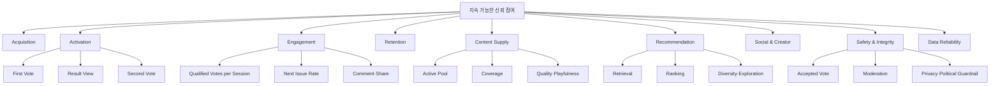

# WHICH 지표·분석 및 실험 체계 v2.0

- **문서 상태:** 상세 기획 검토본
- **버전:** 2.0
- **기준일:** 2026-08-17
- **기준 문서:**
  - `01_PRODUCT_VISION_AND_PRINCIPLES_v2.md`
  - `02_CORE_UX_AND_USER_JOURNEYS_v2.md`
  - `03_ISSUE_SUPPLY_AND_CONTENT_PIPELINE_v2.md`
  - `04_ISSUE_TAXONOMY_QUALITY_AND_CONTROVERSY_v2.md`
  - `05_IDENTITY_AND_VOTE_INTEGRITY_v2.md`
  - `06_INTEREST_ONBOARDING_AND_PERSONALIZATION_v2.md`
  - `07_RECOMMENDATION_AND_ML_ARCHITECTURE_v2.md`
  - `08_SOCIAL_AND_COMMUNITY_v2.md`
  - `09_MODERATION_AND_GOVERNANCE_v2.md`
  - `10_METRICS_ANALYTICS_AND_EXPERIMENTS.md` v1
  - `11_MVP_ROADMAP_AND_OPEN_DECISIONS.md`
  - `13_GLOSSARY_AND_STATUS_MODEL.md`
- **문서 목적:** WHICH의 핵심 소비 루프, 외부 유입, 관심사 온보딩, Issue 공급, 추천·ML, 투표 무결성, 댓글·Creator, 모더레이션을 하나의 측정 체계로 연결하고, 각 지표의 정의·분모·제외 조건·세그먼트·갱신 주기·실험 승격 조건을 실제 구현 가능한 수준으로 정의한다.
- **문서 비범위:** 물리 데이터베이스 DDL, 최종 분석 제품 선정, 최종 통계 패키지 선정, 법률상 보존기간, 최종 광고·수익 지표, 정치·선거 기능 활성화 결정은 후속 데이터·기술·법률 설계에서 확정한다.
- **핵심 원칙:** WHICH는 페이지뷰나 단순 체류시간보다 `신뢰 가능한 선택`, `결과 확인`, `다음 질문 참여`, `다시 방문`, `안전하고 다양한 공급`을 측정한다.

## 0. 결정 상태 표기

| 표기 | 의미 |
| --- | --- |
| **[확정]** | 후속 데이터 모델·이벤트·대시보드·실험 설계의 기본 전제로 사용한다. |
| **[설계 기준]** | 원칙은 채택하되 수치·윈도·구현 방식은 실제 데이터로 조정할 수 있다. |
| **[초기안]** | MVP 또는 초기 실험용 가설이며 출시 전 검증이 필요하다. |
| **[미정]** | 별도 제품·데이터·기술·법률 의사결정이 필요하다. |
| **[금지]** | 제품 정체성, 신뢰, 개인정보, 정치 세이프라인을 훼손하므로 사용하지 않는다. |
| **[운영 지표]** | 실시간 또는 단기 운영 대응을 위한 지표다. |
| **[제품 지표]** | 사용자 가치와 제품 가설을 평가하는 지표다. |
| **[모델 지표]** | 추천·분류·무결성 모델의 성능과 안정성을 평가한다. |

### 0.1 v2 주요 보강 내용

| 영역 | v1 | v2 보강 내용 |
| --- | --- | --- |
| North Star | Qualified Votes per Session + Next Issue Rate 후보 | 정확한 세션·분모·제외 조건·세그먼트·해석 금지사항까지 정의 |
| 외부 유입 | SNS Link Click·Visit-to-Vote | Deep-link Entry부터 First Vote·Result·Second Vote까지 채널 품질 퍼널 정의 |
| Guest 보호 | 회원·비회원 비교 | LOW Risk 외부 Guest의 첫 투표 전환을 전 제품 실험의 공통 Guardrail로 승격 |
| 이벤트 | 핵심 이벤트 목록 | Client·Server Source of Truth, Viewable Impression, Idempotency, Late Event, Version 연결 계약 |
| 추천·ML | 오프라인·온라인 지표 목록 | Retrieval·Ranking·Calibration·Diversity·Exploration·Drift·Segment 평가 체계 |
| 콘텐츠 공급 | Pool·Publish·Duplicate | Effective Active Inventory, Days of Supply, Playfulness, Source·Origin별 성과 연결 |
| 무결성 | Accepted·Duplicate·Invalidated | Vote Attempt Funnel, Challenge 품질, Brigading 탐지·복구·학습 데이터 영향까지 정의 |
| 모더레이션 | SLA·Appeal 지표 | Policy Precision, Side Fairness, Restoration Completeness, Queue Capacity, Incident 지표 |
| 소셜 | 댓글·Follow 지표 | 댓글 소비·생산·Creator·Reaction·알림을 제품 루프와 안전 지표에 연결 |
| 실험 | 원칙과 후보 | 사전등록, Randomization Unit, Exposure, SRM, Power, Ramp, Stop·Rollback·장기 판정 계약 |
| 데이터 품질 | 이벤트 누락률 | Metric Registry, Schema Drift, Freshness, Backfill, Reconciliation, Data Incident 체계 |
| 개인정보 | 비식별화 후속 결정 | 정치 Choice·민감 Feature 접근 분리, Small-cell 억제, 분석 권한 최소화 |

### 0.2 핵심 결정 요약

1. **[확정]** North Star는 `Qualified Votes per Session`과 `Next Issue Rate`를 함께 사용한다. 단일 합성 점수로 숨기지 않는다.

2. **[확정]** `Qualified Vote`는 현재 유효한 `ACCEPTED` Vote이며 `REVIEW`, `REJECTED_*`, `INVALIDATED`, 테스트·운영·공격 격리 트래픽은 제외한다.

3. **[확정]** `Viewable Impression → Vote Submit → Vote Accepted → Result View → Next Issue → Second Vote Accepted`를 핵심 퍼널로 사용한다.

4. **[확정]** 외부 Deep-link Guest는 첫 투표 전에 로그인·관심사·프로필·전면 안전 Prompt로 차단하지 않는다.

5. **[확정]** `External First Vote Conversion`, `Time to First Vote`, `Deep-link Bounce Before Vote`를 모든 온보딩·소셜·추천·안전 실험의 공통 Guardrail로 사용한다.

6. **[확정]** 페이지가 다운로드되거나 Prefetch됐다는 이유로 Impression으로 기록하지 않는다. 실제 Viewable 조건을 충족해야 한다.

7. **[확정]** Vote의 Source of Truth는 Server Event다. `VOTE_SUBMIT`은 참여 시도이며 `VOTE_ACCEPTED`와 동일하지 않다.

8. **[확정]** `SKIP`과 `NEXT_ISSUE`를 분리한다. 전자는 투표하지 않은 이동, 후자는 투표·결과 확인 이후의 연속 소비다.

9. **[확정]** Issue·Vote·추천·Moderation 결과에는 관련 `issue_version`, `model_version`, `feature_version`, `policy_version`을 연결한다.

10. **[확정]** Engagement 개선만으로 실험을 승격하지 않는다. Safety, Integrity, Diversity, Privacy, Guest Acquisition Guardrail을 동시에 충족해야 한다.

11. **[확정]** 정치·선거 트래픽은 일반 추천·실험·성향 분석에서 분리하며, 정치 A/B 선택 방향을 개인화 Feature로 만들지 않는다.

12. **[확정]** 신고 수, 댓글 수, 분노 반응, 외부 Burst를 품질·인기·논쟁의 단독 근거로 사용하지 않는다.

13. **[설계 기준]** Metric 정의는 코드가 아니라 Registry에서 Version 관리하고, 분모·제외 조건·Owner·Freshness·SQL·변경 이력을 기록한다.

14. **[설계 기준]** 분석 결과는 평균만 보지 않고 Entry Source, Guest·Member, 신규·기존, Risk, Category, Experience Mode, Device, Model Version별 Slice를 확인한다.

15. **[초기안]** 일반 웹 세션은 30분 비활성으로 종료하는 방안을 사용하되, 투표·댓글·인증 흐름의 연속성에 맞춰 후속 검증한다.

16. **[금지]** 허위 참여 수, 선택 방향을 유도하는 Metric, 결과를 숨긴 채 가입을 강제하는 실험, 정치 Choice 기반 Segment를 사용하지 않는다.

# 1. 문서의 역할과 측정 문제

## 1.1 WHICH에서 측정이 어려운 이유

WHICH의 핵심 행동은 짧다.

```text
질문 확인
→ A/B 선택
→ 결과 확인
→ 댓글 또는 공유
→ 다음 Issue
```

짧은 행동은 측정하기 쉬워 보이지만 다음 왜곡이 발생할 수 있다.

- 단순 클릭이 정상 투표처럼 보일 수 있다.
- Prefetch된 카드가 실제 노출처럼 집계될 수 있다.
- 외부 SNS의 한 번성 바이럴이 제품 유지율처럼 보일 수 있다.
- 봇·다중 계정·좌표찍기가 인기와 논쟁 점수를 올릴 수 있다.
- 결과를 본 뒤 자동으로 넘긴 행동이 사용자의 자발적 `Next`처럼 보일 수 있다.
- 사용자가 관심사 Prompt 때문에 이탈했는데 완료율만 높게 보일 수 있다.
- 댓글 수가 늘었지만 모욕·분노·진영화가 증가했을 수 있다.
- 추천 모델이 특정 카테고리만 반복 노출해 단기 Vote Rate를 높일 수 있다.
- 모더레이션이 안전해졌지만 정상 Guest의 첫 투표를 과도하게 막을 수 있다.
- 사후 무효화된 Vote가 이미 추천 모델 학습에 들어갔을 수 있다.

따라서 WHICH의 분석 체계는 `행동 수집`, `정상성 판정`, `제품 가치`, `안전`, `운영 복구`를 분리해서 측정해야 한다.

## 1.2 측정 체계의 한 줄 목표

> 사용자가 신뢰 가능한 질문에 부담 없이 참여하고, 결과와 서로 다른 이유를 확인한 뒤 다음 질문과 재방문으로 이어지는지를 측정하되, 조작·유해성·편향·개인정보 침해를 성장으로 오인하지 않는다.

## 1.3 측정 대상 이해관계자

| 이해관계자 | 핵심 질문 | 측정 초점 |
| --- | --- | --- |
| Guest | 외부에서 들어와 첫 가치를 방해 없이 경험하는가? | First Vote, Result View, Next, Challenge, Bounce |
| Member | 기록·댓글·관심사 기능이 반복 사용을 만드는가? | Retention, Comment, Follow, Profile, Merge |
| Creator | 좋은 질문을 반복 생산하고 정상 성과를 얻는가? | Publish, Quality, Repeat, Accepted Vote, Report |
| Editorial Operator | 충분하고 다양한 Issue Pool을 안정적으로 공급하는가? | Pool, Coverage, Time-to-Publish, Correction |
| Moderator | 위험을 빠르고 일관되게 처리하며 오판을 복구하는가? | SLA, Precision, Appeal, Restore, Side Fairness |
| 추천·ML 운영자 | 모델이 참여·발견·다양성을 개선하고 안전을 지키는가? | Retrieval, Ranking, Calibration, Drift, Guardrail |
| 경영·제품 책임자 | 핵심 루프와 신뢰가 함께 성장하는가? | North Star, Retention, Supply, Safety, Data Quality |

## 1.4 비목표

- 페이지뷰, 세션 길이, 댓글 수를 단독 성공 지표로 사용하는 것

- 정상 사용자와 봇·좌표찍기·중복 요청을 같은 Engagement로 합산하는 것

- A/B 중 어느 선택을 했는지로 사용자의 정치·도덕·성향을 평가하는 것

- 평균 수치 하나로 Guest·Member·신규·기존·외부 유입 차이를 숨기는 것

- 통계적 유의성만으로 제품·안전·법률 결정을 자동 승인하는 것

- 대시보드 숫자를 운영자 성과 압박이나 정치적 메시지에 임의로 사용하는 것

- 대표 표본이 아닌 WHICH 참여 결과를 사회 전체의 여론처럼 해석하는 것

# 2. 측정 계층과 Metric Architecture

## 2.1 측정 계층

```text
Raw Event
   ↓
Validated Event
   ↓
Canonical Fact
   ↓
Metric
   ↓
Metric Tree
   ↓
Dashboard / Experiment / Alert
   ↓
Decision
```

| 계층 | 책임 | 예 |
| --- | --- | --- |
| Raw Event | 원시 행동·시스템 사건 보존 | `VOTE_SUBMIT`, `COMMENT_OPEN` |
| Validated Event | 중복·스키마·봇·테스트 정리 | 유효 Client Event, Server Event |
| Canonical Fact | 업무 객체의 신뢰 가능한 사실 | Accepted Vote, Viewable Impression, Published Issue |
| Metric | 정의된 분자·분모·윈도 | Vote Conversion, Next Issue Rate |
| Metric Tree | 목표와 진단 지표 연결 | North Star → Activation → Funnel |
| Dashboard | 역할별 관측 | Product Loop, Integrity, Moderation |
| Experiment | 인과 가설 검증 | 온보딩 시점 A/B Test |
| Alert | 운영 이상 조기 감지 | Event 누락, Challenge 급증 |

## 2.2 지표 등급

| Tier | 용도 | 변경 통제 |
| --- | --- | --- |
| Tier 0 | North Star·안전·개인정보·무결성 핵심 지표 | 변경 전 제품·데이터·안전 승인 |
| Tier 1 | 제품 영역 핵심 KPI | Metric Owner와 Data Reviewer 승인 |
| Tier 2 | 진단·세그먼트 지표 | Owner 검토 후 Registry 변경 |
| Tier 3 | 탐색적 분석·일회성 Query | 의사결정 근거로 승격 시 Registry 등록 |

## 2.3 시간 해상도

| 해상도 | 주요 용도 | 예 |
| --- | --- | --- |
| 실시간~5분 | 안전·Integrity·장애 | Vote Burst, Event Drop, Result Lock |
| 15분~1시간 | 운영 Queue·추천 상태 | Moderation Aging, Feed Fallback |
| 일간 | 제품 Funnel·공급·모델 | QVPS, NIR, Active Pool |
| 주간 | Cohort·Experiment·Creator | D7 Return, Creator Repeat |
| 월간 | 전략·거버넌스 | D30 Return, Transparency, 정책 Drift |

## 2.4 Metric Registry 계약

모든 Tier 0~2 지표는 다음 필드를 가진 Registry 항목으로 관리한다.

```text
metric_id
metric_name_ko
metric_name_en
metric_tier
metric_owner
business_question
numerator_definition
denominator_definition
eligibility
exclusions
aggregation_window
timezone
source_tables_or_facts
allowed_dimensions
forbidden_dimensions
freshness_slo
backfill_policy
privacy_class
metric_version
status
created_at
updated_at
change_reason
```

## 2.5 Naming Convention

- 비율은 `_rate` 또는 `_share`로 끝낸다.
- Count는 `_count`, 평균은 `_avg`, 중앙값은 `_median`, 백분위는 `_p75`, `_p95`로 끝낸다.
- `Qualified`, `Accepted`, `Displayed`, `Attempt`를 혼용하지 않는다.
- Event 이름은 대문자 과거형·완료형보다 현재 계약의 고정 코드로 유지한다.
- 공개 대시보드 표시명과 내부 Metric ID를 분리한다.

예:

```text
external_first_vote_conversion_rate
qualified_votes_per_session
next_issue_rate
invalidated_vote_share
moderation_sla_breach_rate
```

# 3. 공통 분석 단위와 정의

## 3.1 Subject

**[확정]** 분석의 기본 참여 주체는 `subject`다.

```text
로그인 전
subject_id = anonymous_subject_id

로그인 후
subject_id = user_id
```

Guest→Member 병합이 승인되면 별도 Mapping을 통해 분석 연속성을 만들 수 있지만, 과거 데이터를 무조건 소급 통합하지 않는다.

## 3.2 Session

**[초기안]** 일반 Session은 다음 중 하나로 시작한다.

- 외부 Deep-link Issue 진입
- Home·Feed 진입
- 알림·검색·프로필·공유 링크 진입

다음 조건 중 하나로 종료한다.

- 30분 이상 비활성
- 명시적 로그아웃 후 Subject 전환
- 브라우저 종료를 신뢰할 수 있는 경우 종료 신호
- 보안상 Session 강제 만료

다음은 같은 Session으로 유지할 후보이다.

- 투표 후 로그인
- 댓글 작성 중 인증
- 관심사 선택 후 원래 Feed 복귀
- Challenge 완료 후 투표 재개

Session 정의 변경 시 과거 비교가 깨질 수 있으므로 `session_definition_version`을 기록한다.

## 3.3 Qualified Session

`Qualified Session`은 다음을 충족한다.

```text
Viewable Issue Impression 1회 이상
+
테스트·운영·명백한 자동화 트래픽 제외
+
분석 스키마 필수 필드 충족
```

단순 Health Check, Bot Crawler, Prefetch-only, Error-only Session은 분모에서 제외한다.

## 3.4 Viewable Impression

**[설계 기준]** Issue가 API 응답에 포함되거나 화면 밖에 Prefetch됐다는 이유만으로 Impression으로 기록하지 않는다.

초기 Viewable 후보 조건:

```text
화면 영역의 50% 이상
+
500ms 이상
+
Foreground Tab
+
숨김·접힘 상태 아님
```

정확한 기준은 성능과 UX 검증 후 확정한다. Client Event는 중복 방지용 `impression_id`와 `recommendation_request_id`를 포함한다.

## 3.5 Qualified Vote

`Qualified Vote`는 다음을 모두 충족한다.

```text
vote_integrity_status = ACCEPTED
+
현재 무효화되지 않음
+
유효한 Issue Version에 연결
+
정상 Subject·Session
+
테스트·운영 계정 제외
```

다음은 제외한다.

- `REVIEW`
- `REJECTED_DUPLICATE`
- `REJECTED_ABUSE`
- `INVALIDATED`
- 공격 격리 기간의 미확정 Vote

## 3.6 Result View

`RESULT_VIEW`는 결과 영역이 실제로 표시된 사건이다.

- Vote가 Accepted된 뒤의 첫 Result View를 핵심 Funnel에 사용한다.
- `RESULT_REFRESH`는 별도 Event이며 Result View를 중복 증가시키지 않는다.
- 이미 투표한 사용자의 재방문 Result View는 `repeat_result_view`로 분리한다.

## 3.7 Next Issue Opportunity

`Next Issue Opportunity`는 다음 조건을 충족한 사건이다.

```text
Qualified Vote Accepted
+
Result View 가능
+
다음 Eligible Issue가 존재
+
Session이 강제로 종료되지 않음
```

다음 Issue 후보가 없어 이동할 수 없는 경우는 Next Issue Rate의 분모에서 제외하고 `Issue Exhaustion`으로 별도 집계한다.

## 3.8 Entry Source

| 코드 | 의미 |
| --- | --- |
| EXTERNAL_SOCIAL | YouTube·X·Instagram·Threads 등 외부 SNS |
| EXTERNAL_SEARCH | 검색 엔진·SEO |
| SHARED_LINK | 사용자가 복사·공유한 Issue 링크 |
| DIRECT_HOME | 직접 Home 진입 |
| INTERNAL_FEED | For You·인기·논쟁·최신·팔로잉 |
| NOTIFICATION | 이메일·웹·Push 알림 |
| CREATOR_PROFILE | 작성자 공개 Profile |
| CATEGORY_TOPIC | 카테고리·Topic Feed |
| ADMIN_TEST | 운영·QA 전용, 제품 지표에서 제외 |

## 3.9 시간과 기준일

- 운영 기준 시간대는 `Asia/Seoul`을 기본으로 한다.
- 원시 Event는 UTC Timestamp와 원본 Client Offset을 함께 저장한다.
- 일간 지표는 KST 00:00~24:00 기준으로 제공한다.
- 글로벌 확장 시 `reporting_timezone`을 명시하고 국가 간 비교는 UTC 보조 View를 사용한다.
- Event Time과 Processing Time을 분리한다.

# 4. North Star와 Metric Tree

## 4.1 North Star 구조

**[초기안]** WHICH는 두 지표를 나란히 사용한다.

```text
Qualified Votes per Session
+
Next Issue Rate
```

두 지표를 하나의 가중 합으로 숨기지 않는다. 하나가 상승하고 다른 하나가 하락할 때 제품 상태를 명확히 판단하기 위해서다.

## 4.2 Qualified Votes per Session

```text
Qualified Votes per Session
=
기간 내 Qualified Vote 수
÷
기간 내 Qualified Session 수
```

### 분자

- 현재 유효한 `ACCEPTED` Vote
- 동일 Vote의 재전송은 하나만 집계
- Member·Guest 모두 포함 가능

### 분모

- Viewable Issue Impression이 1회 이상 있는 Qualified Session

### 제외

- Bot·Crawler·운영·QA
- Prefetch-only Session
- Error-only Session
- 무결성 검토 중 격리 Session

### 해석

- 높을수록 한 방문에서 더 많은 정상 선택이 발생한다.
- 지나치게 높으면서 Result View가 낮으면 무의미한 빠른 클릭 가능성을 점검한다.
- Feed 자동 넘김, 중복 요청, Bot을 포함하면 안 된다.

## 4.3 Next Issue Rate

```text
Next Issue Rate
=
Result View 이후 NEXT_ISSUE가 발생한 Opportunity 수
÷
전체 Next Issue Opportunity 수
```

초기 측정 Window 후보:

```text
Result View 이후 120초 이내
또는
Session 종료 전
```

두 기준을 모두 계산하고 제품 기본값은 실험 후 확정한다.

다음은 분리한다.

- 자동 이동
- 투표 없이 넘긴 `SKIP`
- 뒤로 가기
- 오류로 인한 강제 재시도

## 4.4 Companion Metric

| 지표 | 역할 |
| --- | --- |
| First Vote Success Rate | 첫 가치 도달 |
| First Result View Rate | 투표 보상 전달 |
| Second Vote Rate | 연속 소비의 최소 검증 |
| D1·D7 Return | 반복 사용 |
| Issue Exhaustion Rate | 공급 부족 진단 |
| Category Diversity | 피드 편향 진단 |
| Accepted Vote Rate | 무결성 건강 |
| Model-induced Report Rate | 추천 안전 |

## 4.5 North Star 해석 Matrix

| QVPS | Next Issue Rate | 해석 | 우선 진단 |
| --- | --- | --- | --- |
| 상승 | 상승 | 핵심 소비 루프 개선 가능성 | Retention·Safety·Diversity 확인 |
| 상승 | 하락 | 한정된 Issue 반복 클릭 또는 결과 후 이탈 | Result UX·피드 종료·자동 제출 확인 |
| 하락 | 상승 | 넘김은 많지만 투표 의지가 낮음 | Question Quality·Binary Fit·카테고리 Match |
| 하락 | 하락 | 제품 루프 약화 또는 장애 | Acquisition·Feed·Vote API·Pool 상태 |

## 4.6 Metric Tree



## 4.7 단계별 성공 조건

| 단계 | 핵심 검증 | 대표 지표 |
| --- | --- | --- |
| Phase A — Core Loop | 외부에서 가입 없이 투표하고 결과·다음 Issue까지 이동 | External First Vote, Result View, Second Vote |
| Phase B — Repeat Use | 개인화와 댓글이 재방문을 만듦 | D1/D7, Comment Open, QVPS |
| Phase C — Supply | Issue Pool이 고갈 없이 품질·다양성을 유지 | Days of Supply, Coverage, Correction |
| Phase D — Trust | Guest 마찰을 낮게 유지하면서 조작·피해 통제 | Accepted Vote, Challenge Precision, Appeal Restore |
| Phase E — Creator | 좋은 질문 생산이 반복되고 사용자 생성 비중이 건강하게 증가 | Creator Repeat, Publish, Quality |

# 5. 핵심 Metric Dictionary

## 5.1 Metric Card 읽는 법

각 Metric은 다음을 명시한다.

```text
무엇을 판단하는가
분자
분모
제외 조건
허용 Segment
갱신 주기
결정 상태
```

분모가 없는 Count Metric은 `해당 없음`으로 표시한다. 평균·백분위 Metric은 대상 사례 집합을 분모처럼 설명한다.

## 5.2 Acquisition Metrics

### External Deep-link Sessions (`external_deeplink_session_count`)

- **상태:** [설계 기준]

- **판단 질문:** 외부 링크가 실제 Issue Session으로 연결되는가?

- **분자·대상:** 외부 Entry Source로 시작하고 PRE_VOTE_READY에 도달한 Session 수

- **분모:** 해당 없음

- **제외:** Bot·Crawler·Admin Test

- **허용 차원:** channel, campaign, issue, device, country

- **갱신:** 일간


### External First Vote Conversion (`external_first_vote_conversion_rate`)

- **상태:** [확정]

- **판단 질문:** 외부 Guest가 첫 Issue에서 정상 투표하는가?

- **분자·대상:** 외부 Deep-link Session 중 첫 Issue Qualified Vote 발생 Session

- **분모:** 외부 Deep-link Session 중 PRE_VOTE_READY 도달 Session

- **제외:** Challenge 실패·Issue 비적격·Bot·Test

- **허용 차원:** channel, campaign, risk, issue, device

- **갱신:** 일간


### Deep-link Bounce Before Vote (`deep_link_bounce_before_vote_rate`)

- **상태:** [확정]

- **판단 질문:** 첫 투표 전에 얼마나 이탈하는가?

- **분자·대상:** 외부 Session 중 Vote Accepted 없이 종료된 Session

- **분모:** 외부 Deep-link Session

- **제외:** Issue Removed·Load Failure는 별도 Failure로 분리

- **허용 차원:** channel, issue, device, latency bucket

- **갱신:** 일간


### Share-to-Visit Rate (`share_to_visit_rate`)

- **상태:** [설계 기준]

- **판단 질문:** 공유가 실제 신규 방문을 만드는가?

- **분자·대상:** 유효 Share Token 또는 Attribution으로 연결된 방문

- **분모:** Share Complete 수

- **제외:** Self-click·Bot·중복 Attribution

- **허용 차원:** channel, share type, issue

- **갱신:** 일간


### Visit-to-Vote Rate (`visit_to_vote_rate`)

- **상태:** [설계 기준]

- **판단 질문:** 유입이 참여로 전환되는가?

- **분자·대상:** Entry Session 중 Qualified Vote 발생 Session

- **분모:** Entry Session

- **제외:** Bot·Test·Error-only

- **허용 차원:** entry source, channel, risk

- **갱신:** 일간


### Channel QVPS (`channel_qualified_votes_per_session`)

- **상태:** [설계 기준]

- **판단 질문:** 어떤 유입 채널이 깊은 참여를 만드는가?

- **분자·대상:** 채널별 Qualified Vote 수

- **분모:** 채널별 Qualified Session

- **제외:** Bot·Test·Attack

- **허용 차원:** channel, campaign

- **갱신:** 일간


### Channel D7 Return (`channel_d7_return_rate`)

- **상태:** [설계 기준]

- **판단 질문:** 어떤 채널 사용자가 다시 오는가?

- **분자·대상:** 획득 Cohort 중 Day 7 Window 재방문 Subject

- **분모:** 해당 채널 신규 Subject

- **제외:** Identity 불확실 Guest는 별도 표시

- **허용 차원:** channel, signup state

- **갱신:** 주간


## 5.3 Activation Metrics

### First Vote Success Rate (`first_vote_success_rate`)

- **상태:** [확정]

- **판단 질문:** 첫 투표 시도가 정상 집계되는가?

- **분자·대상:** 첫 Vote Attempt가 Accepted된 Subject·Session

- **분모:** 첫 Vote Submit Subject·Session

- **제외:** Duplicate returning voter는 별도 Segment

- **허용 차원:** entry source, guest/member, risk

- **갱신:** 일간


### Time to First Vote (`time_to_first_vote_median`)

- **상태:** [확정]

- **판단 질문:** 첫 가치까지 얼마나 걸리는가?

- **분자·대상:** PRE_VOTE_READY부터 첫 VOTE_ACCEPTED까지 경과시간 중앙값

- **분모:** 해당 First Vote 사례

- **제외:** Background Tab·장기 비활성

- **허용 차원:** entry source, device, issue mode

- **갱신:** 일간


### First Result View Rate (`first_result_view_rate`)

- **상태:** [확정]

- **판단 질문:** 투표 보상을 실제로 전달하는가?

- **분자·대상:** 첫 Accepted Vote 뒤 Result View 발생

- **분모:** 첫 Accepted Vote

- **제외:** Result API 장애 별도 분리

- **허용 차원:** entry source, device, latency

- **갱신:** 일간


### Second Vote Rate (`second_vote_rate`)

- **상태:** [확정]

- **판단 질문:** 한 번성 투표를 넘어서는가?

- **분자·대상:** 첫 Accepted Vote Session 중 두 번째 Accepted Vote 발생 Session

- **분모:** 첫 Accepted Vote Session

- **제외:** Issue Exhaustion Session

- **허용 차원:** entry source, guest/member, feed

- **갱신:** 일간


### 3-Vote Session Rate (`three_vote_session_rate`)

- **상태:** [설계 기준]

- **판단 질문:** 초기 핵심 루프가 반복되는가?

- **분자·대상:** Qualified Vote 3개 이상 Session

- **분모:** Qualified Session

- **제외:** Attack·Test

- **허용 차원:** entry source, cohort

- **갱신:** 일간


### 5-Vote Session Rate (`five_vote_session_rate`)

- **상태:** [설계 기준]

- **판단 질문:** 깊은 초기 참여가 발생하는가?

- **분자·대상:** Qualified Vote 5개 이상 Session

- **분모:** Qualified Session

- **제외:** Attack·Test

- **허용 차원:** entry source, cohort

- **갱신:** 일간


## 5.4 Engagement Metrics

### Qualified Votes per Session (`qualified_votes_per_session`)

- **상태:** [확정]

- **판단 질문:** 한 방문에서 정상 투표가 몇 번 발생하는가?

- **분자·대상:** Qualified Vote 수

- **분모:** Qualified Session 수

- **제외:** Review·Invalidated·Bot·Test

- **허용 차원:** entry source, feed, guest/member, category

- **갱신:** 일간


### Next Issue Rate (`next_issue_rate`)

- **상태:** [확정]

- **판단 질문:** 결과 확인 뒤 다음 질문으로 이동하는가?

- **분자·대상:** NEXT_ISSUE 발생 Opportunity

- **분모:** 전체 Next Issue Opportunity

- **제외:** Issue Exhaustion·강제 종료

- **허용 차원:** feed, entry source, result state

- **갱신:** 일간


### Result View Rate (`result_view_rate`)

- **상태:** [설계 기준]

- **판단 질문:** 정상 투표 후 결과를 확인하는가?

- **분자·대상:** Accepted Vote 중 Result View 발생

- **분모:** Accepted Vote

- **제외:** Already Voted 재조회 별도

- **허용 차원:** feed, device, latency

- **갱신:** 일간


### Result → Comment Open Rate (`result_to_comment_open_rate`)

- **상태:** [설계 기준]

- **판단 질문:** 결과에서 이유 탐색으로 이어지는가?

- **분자·대상:** Result View 뒤 Comment Open

- **분모:** Result View

- **제외:** 댓글 비활성 Issue

- **허용 차원:** category, side balance, risk

- **갱신:** 일간


### Opposite-side Comment Open Rate (`opposite_side_comment_open_rate`)

- **상태:** [설계 기준]

- **판단 질문:** 반대 의견 이유도 탐색하는가?

- **분자·대상:** 본인 선택과 반대 Side Tab 또는 Comment View

- **분모:** Comment Open with known side

- **제외:** 정치 Choice 분석은 제한된 집계만

- **허용 차원:** category, risk, feed

- **갱신:** 주간


### Share Rate (`share_rate`)

- **상태:** [설계 기준]

- **판단 질문:** 결과·질문을 외부로 확산하는가?

- **분자·대상:** Share Complete

- **분모:** Result View 또는 Share Eligible View

- **제외:** Share Open만 제외

- **허용 차원:** channel, share type, choice included

- **갱신:** 일간


### Skip Rate (`skip_rate`)

- **상태:** [설계 기준]

- **판단 질문:** 질문이 참여 없이 넘겨지는가?

- **분자·대상:** SKIP Event

- **분모:** Viewable Impression

- **제외:** Vote Accepted 후 Next는 제외

- **허용 차원:** category, topic, experience mode, source

- **갱신:** 일간


### Feed Depth Median (`feed_depth_median`)

- **상태:** [설계 기준]

- **판단 질문:** 세션에서 얼마나 많은 Issue를 실제로 보는가?

- **분자·대상:** Session별 고유 Viewable Issue 수의 중앙값

- **분모:** Qualified Session

- **제외:** Prefetch·Repeated View 제외

- **허용 차원:** entry source, feed, device

- **갱신:** 일간


### Session Duration Median (`session_duration_median`)

- **상태:** [설계 기준]

- **판단 질문:** 세션 체류는 어떻게 변하는가?

- **분자·대상:** 첫 Viewable Event부터 마지막 의미 행동까지 시간 중앙값

- **분모:** Qualified Session

- **제외:** Background Idle 제외

- **허용 차원:** entry source, device

- **갱신:** 일간


## 5.5 Retention Metrics

### D1 Return Rate (`d1_return_rate`)

- **상태:** [설계 기준]

- **판단 질문:** 다음날 다시 오는가?

- **분자·대상:** 신규 Subject 중 Day 1 Window 재방문

- **분모:** 신규 Subject Cohort

- **제외:** Bot·Test, identity uncertainty 표시

- **허용 차원:** guest/member, acquisition channel, interest complete

- **갱신:** 일간 코호트


### D7 Return Rate (`d7_return_rate`)

- **상태:** [설계 기준]

- **판단 질문:** 일주일 내 반복 사용이 발생하는가?

- **분자·대상:** 신규 Subject 중 Day 7 Window 재방문

- **분모:** 신규 Subject Cohort

- **제외:** 동일 기준

- **허용 차원:** guest/member, channel, first session depth

- **갱신:** 주간


### D30 Return Rate (`d30_return_rate`)

- **상태:** [설계 기준]

- **판단 질문:** 장기 습관 가능성이 있는가?

- **분자·대상:** 신규 Subject 중 Day 30 Window 재방문

- **분모:** 신규 Subject Cohort

- **제외:** 동일 기준

- **허용 차원:** member, creator, interest segment

- **갱신:** 월간


### Weekly Active Subjects (`weekly_active_subjects`)

- **상태:** [설계 기준]

- **판단 질문:** 주간 활성 규모는 얼마인가?

- **분자·대상:** 7일 내 Qualified Action 1회 이상 고유 Subject

- **분모:** 해당 없음

- **제외:** 단순 Page View만 제외

- **허용 차원:** guest/member, country

- **갱신:** 주간


### Creator 30D Repeat Rate (`creator_30d_repeat_rate`)

- **상태:** [설계 기준]

- **판단 질문:** Creator가 다시 질문을 생산하는가?

- **분자·대상:** 첫 게시 Creator 중 30일 내 추가 Published Issue

- **분모:** 첫 Published Issue Creator

- **제외:** 운영자·테스트 Creator 제외

- **허용 차원:** creator cohort, origin

- **갱신:** 월간


## 5.6 Interest·Personalization Metrics

### Interest Prompt Open Rate (`interest_prompt_open_rate`)

- **상태:** [설계 기준]

- **판단 질문:** 제안이 관심을 끄는가?

- **분자·대상:** Prompt Open

- **분모:** Prompt View

- **제외:** 자동 Open 제외

- **허용 차원:** guest/member, trigger, entry source

- **갱신:** 일간


### Interest Onboarding Completion (`interest_onboarding_complete_rate`)

- **상태:** [설계 기준]

- **판단 질문:** 관심 주제 선택을 완료하는가?

- **분자·대상:** Interest Complete

- **분모:** Interest Prompt Open

- **제외:** Save Failure 별도

- **허용 차원:** guest/member, prompt placement

- **갱신:** 일간


### Interest Onboarding Skip (`interest_onboarding_skip_rate`)

- **상태:** [설계 기준]

- **판단 질문:** 제안을 얼마나 건너뛰는가?

- **분자·대상:** Interest Skip

- **분모:** Prompt View

- **제외:** Dismiss와 Technical Close 분리

- **허용 차원:** guest/member, trigger

- **갱신:** 일간


### Prompt-induced Exit (`prompt_induced_exit_rate`)

- **상태:** [확정]

- **판단 질문:** Prompt가 세션 이탈을 유발하는가?

- **분자·대상:** Prompt View 후 짧은 Window 내 의미 행동 없이 Session 종료

- **분모:** Prompt View

- **제외:** 네트워크 종료·브라우저 Crash 분리

- **허용 차원:** prompt placement, trigger, entry source

- **갱신:** 일간


### Post-interest Vote Lift (`post_interest_vote_lift`)

- **상태:** [설계 기준]

- **판단 질문:** 관심사 설정이 투표 참여를 개선하는가?

- **분자·대상:** 설정 후 Vote Rate 또는 실험 Lift

- **분모:** 비교군 대비

- **제외:** 자기선택 편향으로 관찰값은 인과 해석 금지

- **허용 차원:** cohort, interest count, category

- **갱신:** 실험·주간


### Not Interested Rate (`not_interested_rate`)

- **상태:** [설계 기준]

- **판단 질문:** 추천이 명시적으로 거부되는가?

- **분자·대상:** NOT_INTERESTED

- **분모:** Viewable Impression

- **제외:** 정책 신고와 분리

- **허용 차원:** feed, source, category, model

- **갱신:** 일간


### Exploration Success Rate (`exploration_success_rate`)

- **상태:** [설계 기준]

- **판단 질문:** 새로운 주제 노출이 관심 발견으로 이어지는가?

- **분자·대상:** Exploration Impression 중 Accepted Vote·Deep Engagement

- **분모:** Exploration Viewable Impression

- **제외:** 정치·Restricted 제외

- **허용 차원:** topic, category, model

- **갱신:** 주간


### Personalization Reset Rate (`personalization_reset_rate`)

- **상태:** [설계 기준]

- **판단 질문:** 사용자가 추천을 새로 시작하려 하는가?

- **분자·대상:** Personalization Reset Complete

- **분모:** 활성 개인화 Subject

- **제외:** QA·Test 제외

- **허용 차원:** profile maturity, model version

- **갱신:** 월간


## 5.7 Supply·Quality Metrics

### Effective Active Pool Size (`effective_active_pool_size`)

- **상태:** [설계 기준]

- **판단 질문:** 실제로 추천 가능한 재고가 충분한가?

- **분자·대상:** 현재 Eligibility를 통과한 고유 Published Issue

- **분모:** 해당 없음

- **제외:** Archived·Limited·Seen-only·Region mismatch 제외

- **허용 차원:** category, topic, experience mode, risk

- **갱신:** 시간별


### Days of Supply (`days_of_supply`)

- **상태:** [설계 기준]

- **판단 질문:** 현재 속도로 며칠간 피드를 공급할 수 있는가?

- **분자·대상:** Effective Active Inventory

- **분모:** 일평균 필요한 고유 Issue 소비량

- **제외:** 중복 Cluster·Seen Issue 조정

- **허용 차원:** category, experience mode

- **갱신:** 일간


### Issue Exhaustion Rate (`issue_exhaustion_rate`)

- **상태:** [확정]

- **판단 질문:** 추천 후보 부족이 사용자 경험을 막는가?

- **분자·대상:** 충분한 Eligible unseen candidate를 만들지 못한 Feed Request

- **분모:** 전체 Feed Request

- **제외:** 일시적 API 장애 별도

- **허용 차원:** feed, category, guest/member

- **갱신:** 시간별


### Candidate-to-Publish Rate (`candidate_to_publish_rate`)

- **상태:** [설계 기준]

- **판단 질문:** 후보가 실제 게시 품질을 충족하는가?

- **분자·대상:** Published 또는 Scheduled Candidate

- **분모:** 검토 완료 Candidate

- **제외:** Withdrawn Technical Error 제외

- **허용 차원:** origin, model version, risk

- **갱신:** 주간


### Binary Fit Failure Rate (`binary_fit_failure_rate`)

- **상태:** [설계 기준]

- **판단 질문:** A/B로 만들기 부적합한 후보가 얼마나 되는가?

- **분자·대상:** Binary Fit Hard Failure Candidate

- **분모:** 평가 완료 Candidate

- **제외:** 미평가 제외

- **허용 차원:** origin, category, model

- **갱신:** 주간


### Choice Parity Failure Rate (`choice_parity_failure_rate`)

- **상태:** [설계 기준]

- **판단 질문:** A/B 표현 비대칭이 얼마나 발견되는가?

- **분자·대상:** Choice Parity 실패 Candidate

- **분모:** 평가 완료 Candidate

- **제외:** 미평가 제외

- **허용 차원:** category, creator/editorial

- **갱신:** 주간


### Duplicate Rate (`duplicate_rate`)

- **상태:** [설계 기준]

- **판단 질문:** 의미상 중복 공급이 얼마나 발생하는가?

- **분자·대상:** Duplicate Cluster로 거절·병합된 Candidate

- **분모:** 평가 완료 Candidate

- **제외:** 정상 Successor 제외

- **허용 차원:** origin, category, model

- **갱신:** 주간


### Material Correction Rate (`material_correction_rate`)

- **상태:** [확정]

- **판단 질문:** 게시 후 전제·선택 의미에 영향을 주는 오류가 얼마나 발생하는가?

- **분자·대상:** C2 이상 Correction Published Issue

- **분모:** Published Issue

- **제외:** 단순 오탈자 C0 제외

- **허용 차원:** origin, source class, risk

- **갱신:** 월간


### First-session Playfulness Share (`playfulness_first_session_share`)

- **상태:** [설계 기준]

- **판단 질문:** 초기 Feed가 유희·즉시 참여 중심인가?

- **분자·대상:** 첫 10개 Impression 중 Playful Experience Mode

- **분모:** 첫 10개 Viewable Impression

- **제외:** HIGH·Restricted 제외

- **허용 차원:** entry source, guest/member

- **갱신:** 일간


### Category Coverage (`category_coverage_rate`)

- **상태:** [설계 기준]

- **판단 질문:** 필수 카테고리별 재고가 존재하는가?

- **분자·대상:** 목표 재고 기준 충족 Category

- **분모:** 활성 목표 Category

- **제외:** 비출시 Category 제외

- **허용 차원:** region, language

- **갱신:** 일간


## 5.8 Controversy Metrics

### Qualified Close Issue Count (`qualified_close_issue_count`)

- **상태:** [설계 기준]

- **판단 질문:** 신뢰 가능한 접전 Issue가 충분한가?

- **분자·대상:** 최소 표본·Integrity·Balance 조건 충족 Issue 수

- **분모:** 해당 없음

- **제외:** 정치 일반 Feed 제외

- **허용 차원:** category, time window

- **갱신:** 시간별


### Controversy Feed Vote Rate (`controversy_feed_vote_rate`)

- **상태:** [설계 기준]

- **판단 질문:** 접전 피드가 실제 참여를 만드는가?

- **분자·대상:** Controversy Feed Accepted Vote

- **분모:** Controversy Feed Viewable Impression

- **제외:** Attack·Review Issue 제외

- **허용 차원:** category, balance band

- **갱신:** 일간


### Controversy Integrity Failure (`controversy_integrity_failure_rate`)

- **상태:** [설계 기준]

- **판단 질문:** 접전 피드가 조작에 취약한가?

- **분자·대상:** 논쟁 Eligible 후 Integrity로 제외·동결된 Issue

- **분모:** 논쟁 후보 Issue

- **제외:** 정치 별도

- **허용 차원:** category, source

- **갱신:** 주간


### Side Comment Exposure Balance (`side_comment_exposure_balance`)

- **상태:** [설계 기준]

- **판단 질문:** 댓글에서 양쪽 이유가 발견 가능한가?

- **분자·대상:** A·B 적격 댓글 Impression 분포의 균형 지표

- **분모:** Comment Impression

- **제외:** 적격 댓글 없는 Side는 별도 표시

- **허용 차원:** issue, category, comment ranker

- **갱신:** 주간


## 5.9 Social·Creator Metrics

### Qualified Comment Rate (`qualified_comment_rate`)

- **상태:** [설계 기준]

- **판단 질문:** 정상적이고 게시 가능한 댓글이 얼마나 생성되는가?

- **분자·대상:** Published·Visible Comment

- **분모:** Comment Submit

- **제외:** Spam·Policy Remove·Test 제외

- **허용 차원:** category, side, risk

- **갱신:** 일간


### Comment Draft → Publish (`comment_draft_to_publish_rate`)

- **상태:** [설계 기준]

- **판단 질문:** 작성 의도가 실제 게시로 이어지는가?

- **분자·대상:** Comment Published

- **분모:** Comment Draft Start

- **제외:** Auth Cancel·Policy Review 별도

- **허용 차원:** guest/member, device

- **갱신:** 일간


### Creator Follow Rate (`creator_follow_rate`)

- **상태:** [설계 기준]

- **판단 질문:** 좋은 질문 생산자를 팔로우하는가?

- **분자·대상:** Creator Follow

- **분모:** Creator Profile View 또는 eligible CTA view

- **제외:** Self-follow·invalid follow 제외

- **허용 차원:** creator cohort, source

- **갱신:** 주간


### Topic Follow Rate (`topic_follow_rate`)

- **상태:** [설계 기준]

- **판단 질문:** 명시적 Topic 관심이 형성되는가?

- **분자·대상:** Topic Follow

- **분모:** Topic Follow CTA View

- **제외:** 정치 Topic 제외

- **허용 차원:** topic, surface

- **갱신:** 주간


### New Creator Exploration Share (`new_creator_exploration_share`)

- **상태:** [설계 기준]

- **판단 질문:** 신규 Creator에게 발견 기회를 주는가?

- **분자·대상:** New Creator Issue Impression

- **분모:** 전체 eligible creator Issue Impression

- **제외:** 운영자 제외

- **허용 차원:** feed, category

- **갱신:** 주간


### Reaction Invalid Rate (`reaction_invalid_rate`)

- **상태:** [설계 기준]

- **판단 질문:** 공감 조작이 얼마나 발생하는가?

- **분자·대상:** Invalidated Reaction

- **분모:** Reaction Add

- **제외:** Test 제외

- **허용 차원:** issue, comment, source

- **갱신:** 일간


## 5.10 Vote Integrity Metrics

### Accepted Vote Rate (`accepted_vote_rate`)

- **상태:** [확정]

- **판단 질문:** 투표 요청 중 정상 집계 비율은 얼마인가?

- **분자·대상:** ACCEPTED Vote

- **분모:** 검증 완료 Vote Attempt

- **제외:** Network Failed before receipt 제외

- **허용 차원:** risk, guest/member, issue, channel

- **갱신:** 시간별


### Duplicate Attempt Rate (`duplicate_attempt_rate`)

- **상태:** [설계 기준]

- **판단 질문:** 중복 투표 시도가 얼마나 발생하는가?

- **분자·대상:** REJECTED_DUPLICATE

- **분모:** 검증 완료 Vote Attempt

- **제외:** Idempotent retry 제외

- **허용 차원:** guest/member, issue, channel

- **갱신:** 시간별


### Challenge Rate (`challenge_rate`)

- **상태:** [설계 기준]

- **판단 질문:** 추가 검증이 얼마나 요구되는가?

- **분자·대상:** CHALLENGE_REQUIRED Vote Attempt

- **분모:** Eligible Vote Attempt

- **제외:** Restricted mandatory verification 별도

- **허용 차원:** risk, guest/member, entry source

- **갱신:** 시간별


### Challenge Completion (`challenge_completion_rate`)

- **상태:** [설계 기준]

- **판단 질문:** 정상 사용자가 Challenge를 완료하는가?

- **분자·대상:** Challenge Success 후 Vote 재개

- **분모:** Challenge Start

- **제외:** User Cancel 별도

- **허용 차원:** challenge type, risk

- **갱신:** 일간


### False Challenge Proxy (`false_challenge_proxy_rate`)

- **상태:** [확정]

- **판단 질문:** LOW 정상 Guest에게 불필요한 Challenge가 얼마나 발생하는가?

- **분자·대상:** LOW Guest Challenge 후 정상 성공·추가 위반 없음

- **분모:** LOW Guest Challenge

- **제외:** 정확한 FP Label은 인간 Sample 필요

- **허용 차원:** entry source, rule version

- **갱신:** 주간


### Invalidated Vote Share (`invalidated_vote_share`)

- **상태:** [확정]

- **판단 질문:** 사후 무효화가 얼마나 발생하는가?

- **분자·대상:** INVALIDATED Vote

- **분모:** 한때 ACCEPTED였던 Vote

- **제외:** 복구된 Vote 제외

- **허용 차원:** issue, risk, detection reason

- **갱신:** 일간


### Brigading Incidents (`brigading_incident_count`)

- **상태:** [설계 기준]

- **판단 질문:** 조직적 유입 사고가 얼마나 발생하는가?

- **분자·대상:** 확정 Brigading Incident 수

- **분모:** 해당 없음

- **제외:** 정상 Viral 제외

- **허용 차원:** source, issue, severity

- **갱신:** 월간


### Burst Detection Time P95 (`burst_detection_time_p95`)

- **상태:** [설계 기준]

- **판단 질문:** 이상 유입을 얼마나 빨리 탐지하는가?

- **분자·대상:** Incident 시작 추정부터 Detection까지 P95

- **분모:** 탐지된 Burst Incident

- **제외:** 시작 시점 불명확은 별도

- **허용 차원:** severity, source

- **갱신:** 월간


### Vote Restoration Completeness (`vote_restoration_completeness`)

- **상태:** [설계 기준]

- **판단 질문:** 오탐 복구가 집계·추천·기록에 완전히 반영되는가?

- **분자·대상:** 필수 복구 Component 완료 Case

- **분모:** 복구 승인 Case

- **제외:** 진행 중 제외

- **허용 차원:** incident, issue risk

- **갱신:** 월간


## 5.11 Moderation Metrics

### Moderation Time to Action P95 (`moderation_time_to_action_p95`)

- **상태:** [설계 기준]

- **판단 질문:** 위험 콘텐츠를 얼마나 빨리 제한하는가?

- **분자·대상:** 신고·탐지부터 첫 유효 Action까지 P95

- **분모:** 조치 완료 Case

- **제외:** 중복 Case 병합

- **허용 차원:** queue, severity

- **갱신:** 일간


### Moderation SLA Breach (`moderation_sla_breach_rate`)

- **상태:** [설계 기준]

- **판단 질문:** Queue별 목표 시간을 얼마나 지키는가?

- **분자·대상:** SLA 초과 Case

- **분모:** SLA 대상 Case

- **제외:** 사용자 정보 대기 상태 별도

- **허용 차원:** queue, priority

- **갱신:** 일간


### Appeal Overturn Rate (`appeal_overturn_rate`)

- **상태:** [확정]

- **판단 질문:** 초기 판정 오판이 얼마나 복구되는가?

- **분자·대상:** Partially/Overturned Appeal

- **분모:** 결론 난 Appeal

- **제외:** 철회·중복 Appeal 제외

- **허용 차원:** policy, object, automated/human

- **갱신:** 월간


### Restoration Completeness (`restoration_completeness_rate`)

- **상태:** [확정]

- **판단 질문:** 인용된 Appeal이 모든 파생 데이터에 반영되는가?

- **분자·대상:** 필수 복구 완료 Appeal

- **분모:** Overturned Appeal

- **제외:** 진행 중 제외

- **허용 차원:** object, policy

- **갱신:** 월간


### Policy Precision (`policy_precision`)

- **상태:** [설계 기준]

- **판단 질문:** 제재한 대상이 실제 정책 위반인가?

- **분자·대상:** QA·Appeal에서 정당 판정된 조치

- **분모:** 평가 가능한 조치 Sample

- **제외:** Gold label 없는 Case 제외

- **허용 차원:** policy, model/human

- **갱신:** 월간


### A/B Side Enforcement Gap (`side_enforcement_gap`)

- **상태:** [확정]

- **판단 질문:** 선택 방향에 따라 제재가 불균형한가?

- **분자·대상:** A와 B Side의 조정된 Remove·Overturn 차이

- **분모:** Side별 적격 Comment·Case

- **제외:** 표본 부족 억제

- **허용 차원:** category, policy

- **갱신:** 월간


### High-risk Pre-exposure Block (`high_risk_pre_exposure_block_rate`)

- **상태:** [설계 기준]

- **판단 질문:** 고위험 콘텐츠를 노출 전에 차단하는가?

- **분자·대상:** 최초 Viewable 이전 제한된 High-risk Object

- **분모:** 확정 High-risk Object

- **제외:** 사후 발생 위반 제외

- **허용 차원:** policy, object

- **갱신:** 월간


### Report Brigading Cases (`report_brigading_case_count`)

- **상태:** [설계 기준]

- **판단 질문:** 조직적 신고 공격이 얼마나 발생하는가?

- **분자·대상:** 확정 Report Brigading Case

- **분모:** 해당 없음

- **제외:** 정상 다수 신고 제외

- **허용 차원:** target, source

- **갱신:** 월간


## 5.12 Recommendation·ML Metrics

### Retrieval Recall@K (`retrieval_recall_at_k`)

- **상태:** [설계 기준]

- **판단 질문:** 관련 후보를 Retrieval이 충분히 포함하는가?

- **분자·대상:** Relevant Item 중 Top-K Candidate에 포함

- **분모:** Relevant Item

- **제외:** Label 없는 User 제외

- **허용 차원:** segment, candidate source, model

- **갱신:** 모델 평가


### NDCG@K (`ndcg_at_k`)

- **상태:** [설계 기준]

- **판단 질문:** 상위 순서가 관련성 Label과 일치하는가?

- **분자·대상:** Discounted Cumulative Gain 정규화

- **분모:** 평가 Query

- **제외:** Attack·Leakage 제외

- **허용 차원:** new/existing, guest/member, category

- **갱신:** 모델 평가


### MRR (`mrr`)

- **상태:** [설계 기준]

- **판단 질문:** 첫 관련 Issue가 얼마나 앞에 있는가?

- **분자·대상:** Query별 첫 relevant rank 역수 평균

- **분모:** 평가 Query

- **제외:** 동일

- **허용 차원:** segment, model

- **갱신:** 모델 평가


### Brier Score (`brier_score`)

- **상태:** [설계 기준]

- **판단 질문:** 예측 확률이 실제 결과와 얼마나 일치하는가?

- **분자·대상:** 예측과 Binary Outcome 제곱오차 평균

- **분모:** 평가 Example

- **제외:** Label 지연·무효화 제외

- **허용 차원:** objective, segment, model

- **갱신:** 모델 평가


### Expected Calibration Error (`expected_calibration_error`)

- **상태:** [설계 기준]

- **판단 질문:** 예측 확률이 Calibration됐는가?

- **분자·대상:** Bin별 예측·실제 차이 가중합

- **분모:** 평가 Example

- **제외:** 표본 부족 Bin 제외

- **허용 차원:** objective, segment, model

- **갱신:** 모델 평가


### Catalog Coverage (`catalog_coverage`)

- **상태:** [설계 기준]

- **판단 질문:** 전체 Eligible Issue가 추천 기회를 받는가?

- **분자·대상:** 기간 내 1회 이상 노출된 Eligible Issue

- **분모:** 전체 Eligible Issue

- **제외:** Restricted·Hold 제외

- **허용 차원:** category, creator age

- **갱신:** 주간


### Intra-list Diversity (`intra_list_diversity`)

- **상태:** [설계 기준]

- **판단 질문:** 한 Slate 안의 의미 다양성이 충분한가?

- **분자·대상:** Issue 쌍간 평균 거리

- **분모:** Eligible Slate

- **제외:** 정치 별도

- **허용 차원:** feed, model

- **갱신:** 일간


### Model-induced Report Rate (`model_induced_report_rate`)

- **상태:** [확정]

- **판단 질문:** 특정 모델 노출이 신고를 증가시키는가?

- **분자·대상:** 모델 노출 뒤 Report 발생 Impression

- **분모:** 모델 Viewable Impression

- **제외:** 자연 유입 Report 별도

- **허용 차원:** model, category, risk

- **갱신:** 일간


### Recommendation Fallback Rate (`fallback_rate`)

- **상태:** [설계 기준]

- **판단 질문:** Production Ranker 장애·후보 부족이 얼마나 발생하는가?

- **분자·대상:** Fallback 응답 Feed Request

- **분모:** 전체 Feed Request

- **제외:** 계획된 Shadow 제외

- **허용 차원:** surface, failure reason

- **갱신:** 시간별


### Ranking Latency P95 (`ranking_latency_p95`)

- **상태:** [설계 기준]

- **판단 질문:** 추천 응답 속도가 UX를 지키는가?

- **분자·대상:** Ranking 처리시간 P95

- **분모:** Ranking Request

- **제외:** Client Network 제외

- **허용 차원:** surface, model

- **갱신:** 시간별


### Exploration Regret Proxy (`exploration_regret_proxy`)

- **상태:** [설계 기준]

- **판단 질문:** 탐색이 핵심 참여를 과도하게 희생하는가?

- **분자·대상:** Exploration과 Policy Baseline의 Utility 차이

- **분모:** Exploration Impression

- **제외:** 무작위 확률 기록 필수

- **허용 차원:** segment, topic

- **갱신:** 주간


## 5.13 Data Quality Metrics

### Event Missing Rate (`event_missing_rate`)

- **상태:** [확정]

- **판단 질문:** 필수 Event가 누락되는가?

- **분자·대상:** 예상 Chain에서 누락된 Event

- **분모:** 예상 Event Opportunity

- **제외:** User Cancel 등 정상 미발생 제외

- **허용 차원:** event type, client version

- **갱신:** 시간별


### Event Duplicate Rate (`event_duplicate_rate`)

- **상태:** [설계 기준]

- **판단 질문:** Event 중복이 발생하는가?

- **분자·대상:** 동일 event_id 또는 idempotency 중복

- **분모:** 전체 Event

- **제외:** 정상 Retry 하나로 정규화

- **허용 차원:** event type, SDK version

- **갱신:** 시간별


### Recommendation Linkage Rate (`recommendation_linkage_rate`)

- **상태:** [확정]

- **판단 질문:** 노출·행동이 추천 요청과 연결되는가?

- **분자·대상:** 추천 Impression 중 request_id·model_version 완전 연결

- **분모:** 추천 Impression

- **제외:** Non-personalized 별도

- **허용 차원:** surface, client version

- **갱신:** 시간별


### Session Stitch Error (`session_stitch_error_rate`)

- **상태:** [설계 기준]

- **판단 질문:** Guest·Member·인증 전후 Session이 잘못 연결되는가?

- **분자·대상:** 검증 Sample의 잘못된 Stitch

- **분모:** 검증 Sample

- **제외:** 판정 불가 제외

- **허용 차원:** flow, client version

- **갱신:** 주간


### Metric Freshness Delay (`metric_freshness_delay`)

- **상태:** [설계 기준]

- **판단 질문:** 대시보드가 목표 시간 내 갱신되는가?

- **분자·대상:** Event Time부터 Metric Available까지 지연

- **분모:** Metric Batch

- **제외:** Backfill 별도

- **허용 차원:** metric tier, pipeline

- **갱신:** 시간별


### Server-Client Reconciliation Gap (`server_client_reconciliation_gap`)

- **상태:** [설계 기준]

- **판단 질문:** Client Funnel과 Server Fact가 과도하게 차이나는가?

- **분자·대상:** Client Submit과 Server Receipt·Accepted 차이

- **분모:** Client Submit

- **제외:** Network Fail 분리

- **허용 차원:** client version, device

- **갱신:** 일간


# 6. Acquisition과 외부 유입 분석

## 6.1 Acquisition Funnel

```text
External Link Impression
→ Link Click
→ Deep-link Session
→ PRE_VOTE_READY
→ First Vote Submit
→ First Vote Accepted
→ First Result View
→ Next Issue
→ Second Vote Accepted
→ Return
```

외부 플랫폼의 Link Impression을 직접 받을 수 없는 채널은 Click부터 측정한다. 채널별 API·UTM·Share Token의 한계를 기록한다.

## 6.2 채널 품질 평가

단순 방문 수보다 다음을 함께 본다.

```text
유입량
×
External First Vote Conversion
×
Qualified Votes per Session
×
D7 Return
×
Integrity Confidence
```

이를 하나의 공개 점수로 만들 필요는 없지만, 운영자가 채널별 트래픽 품질을 비교할 수 있어야 한다.

## 6.3 Attribution 원칙

- First-touch와 Last-touch를 모두 보존한다.

- 공유 Token, UTM, Referrer가 충돌하면 우선순위를 명시한다.

- 개인정보 보호 기능이나 앱 In-app Browser로 Referrer가 사라질 수 있음을 `UNKNOWN_EXTERNAL`로 기록한다.

- 동일 사용자의 Self-click과 운영자 QA Click은 제외한다.

- 정치·선거 외부 Campaign은 일반 Acquisition Dashboard에서 분리한다.

- 외부 SNS의 팔로워·노출 수를 WHICH의 활성 사용자로 대체하지 않는다.

## 6.4 Guest Acquisition Guardrail

다음 기능 또는 실험은 모두 이 Guardrail을 통과해야 한다.

- 관심사 Prompt
- 로그인 Prompt
- 댓글 Preview
- Creator Follow CTA
- CAPTCHA·Risk Challenge
- Source·Background UI
- 공유 UI
- 추천 모델 변경
- Moderation Warning

```text
External First Vote Conversion
Time to First Vote
Deep-link Bounce Before Vote
First Result View Rate
Next Issue Rate
Challenge Rate for LOW Guest
```

정상 LOW Guest의 첫 투표가 하락하면 Prompt 위치, Rule Precision, Loading 성능을 우선 재검토한다. 안전 Rule을 무조건 완화하는 방식은 사용하지 않는다.

# 7. Activation과 First Value 분석

## 7.1 First Value Moment

**[확정]** First Value Moment는 다음 두 사건의 결합이다.

```text
첫 Qualified Vote Accepted
+
첫 Result View
```

첫 Vote만 성공하고 결과가 표시되지 않으면 제품 약속이 완성되지 않은 것이다.

## 7.2 Activation Funnel

```text
ISSUE_VIEWABLE_IMPRESSION
→ PRE_VOTE_READY
→ VOTE_SELECT
→ VOTE_SUBMIT
→ VOTE_ACCEPTED
→ RESULT_VIEW
→ NEXT_ISSUE
→ SECOND_VOTE_ACCEPTED
```

각 단계는 Client와 Server Event를 함께 사용한다.

## 7.3 Funnel Drop Reason

| 구간 | 가능한 원인 | 필요 진단 |
| --- | --- | --- |
| Viewable → Select | 질문 불명확·관심 불일치·화면 복잡 | Quality, Category Match, Layout |
| Select → Submit | 확인 버튼 마찰·오선택 우려 | UX Variant, Device |
| Submit → Accepted | 중복·Challenge·API 오류 | Integrity, Latency, Error |
| Accepted → Result | 집계 지연·화면 오류 | Result API, Client Render |
| Result → Next | 보상 부족·CTA 불명확·댓글에 머묾 | Result UX, Comment, Feed |
| Next → Second Vote | 다음 질문 품질·후보 부족 | Recommendation, Exhaustion |

## 7.4 Activation Segment

필수 Segment:

- External Social / Search / Shared Link / Direct Home
- Guest / Member / Verified
- 신규 / 기존
- Mobile / Desktop
- LOW / MEDIUM / HIGH / RESTRICTED
- Playful / Relatable / Practical / Public Deliberation
- Category·Topic
- Issue Origin
- Model·Policy Version

정치·선거 Segment는 일반 집계와 분리한다.

# 8. Engagement와 소비 루프 분석

## 8.1 소비 루프 단계

```text
Vote
→ Result
→ Same-side Reason
→ Other-side Reason
→ Share 또는 Next
→ Vote
```

어느 단계가 제품 가치를 만들고 어느 단계가 단순 체류를 늘리는지 구분한다.

## 8.2 Session Depth Distribution

평균만 보지 않고 다음 분포를 본다.

- 0 Vote Session
- 1 Vote Session
- 2 Vote Session
- 3~5 Vote Session
- 6~10 Vote Session
- 11+ Vote Session

11+ Session은 높은 참여일 수 있지만 자동화·무의미한 클릭 가능성도 함께 점검한다.

## 8.3 Result Consumption

측정 후보:

- Result View Rate
- Result View Duration Median·P75
- Result Details Open
- Result Refresh
- 저표본 안내 확인
- Integrity Warning 확인
- Result Locked Exit

체류시간은 단독 만족도 지표로 사용하지 않는다. 오류·혼란·느린 로딩도 시간을 늘릴 수 있다.

## 8.4 Comment Consumption

댓글 지표는 다음을 구분한다.

```text
Comment Preview Impression
Comment List Open
Same-side Tab Open
Opposite-side Tab Open
Comment Viewable Impression
Reply Expand
Next Issue after Comment
```

반대 의견 열람률이 높더라도 신고·괴롭힘·Thread Lock이 증가하면 건강한 탐색으로 보지 않는다.

## 8.5 Share Quality

다음 세 Share를 분리한다.

- 질문만 공유
- 결과 공유
- 개인 선택 포함 공유

Share 성공은 `SHARE_OPEN`이 아니라 실제 `SHARE_COMPLETE` 또는 Link Copy Success로 집계한다. 공유 이후 신규 방문·Vote·Retention을 Attribution한다.

# 9. Retention과 Cohort 분석

## 9.1 Retention 정의

`Return`은 단순 Page View가 아니라 다음 Qualified Action 중 하나가 발생한 재방문으로 정의한다.

- Viewable Issue Impression
- Qualified Vote
- Result View
- Comment Open·Create
- Creator Dashboard Open
- Issue Create·Edit

Bot·알림 Preview·Background Prefetch는 제외한다.

## 9.2 Retention Window

| 지표 | Window 초기안 | 용도 |
| --- | --- | --- |
| D1 | 획득 다음날 KST 기준 | 초기 가치·기억 |
| D7 | 획득 후 7일째 또는 Rolling 7-day 후보 | 반복 습관 |
| D30 | 획득 후 30일째 또는 Rolling 30-day 후보 | 장기 유지 |
| W1·W4 | 주차 Cohort | 주간 제품 리뷰 |

## 9.3 Guest Retention 한계

Guest Retention은 Browser Cookie와 익명 Subject 연속성에 의존한다.

- Cookie 삭제·Private Mode·기기 변경으로 과소측정될 수 있다.
- Fingerprint나 IP로 강제 복원하지 않는다.
- Guest와 Member Retention을 직접 비교할 때 측정 편향을 표시한다.
- Guest→Member 병합 동의 후에만 계정 Cohort로 연결한다.

## 9.4 Retention Segment

- First Session Vote Depth
- Interest Onboarding 완료 여부
- 첫 Entry Source
- 첫 Issue Experience Mode
- Comment Open 여부
- Share 여부
- Member 전환 여부
- Creator 여부
- 추천 Surface
- Safety Friction 경험 여부

# 10. 관심사·개인화 분석

## 10.1 온보딩 Funnel

```text
Prompt Eligible
→ Prompt View
→ Prompt Open
→ Card Select
→ 3개 도달
→ Complete
→ Save Success
→ Personalized Feed View
```

`Prompt Eligible`을 기록해야 Prompt가 안 보인 사용자를 분모에 잘못 넣지 않는다.

## 10.2 Cold Start 평가

신규 사용자에게 다음 Variant를 비교할 수 있다.

- 비개인화 유희형 Mix
- 온보딩 관심사 기반
- 세션 행동 기반
- 관심사 + 행동 + 인기·탐색 혼합

Primary:

```text
First 10 Impression Vote Rate
Second Vote Rate
Qualified Votes per Session
Next Issue Rate
```

Guardrail:

```text
Prompt-induced Exit
External First Vote Conversion
Category Diversity
Not Interested
Safety·Integrity
```

## 10.3 Profile Maturity

| 단계 | 조건 예 | 평가 초점 |
| --- | --- | --- |
| COLD | 행동 거의 없음 | Playful·Global Mix |
| EARLY | 3~10 Qualified Vote | Explicit Interest와 Session Signal |
| DEVELOPING | 다수 Topic 행동 | Behavior Match·Exploration |
| MATURE | 반복 Session·장기 Profile | Diversity·Drift·User Control |
| RESET | 추천 초기화 직후 | Cold Start 재진입 품질 |

## 10.4 개인화 성공의 조건

개인화는 다음을 함께 충족해야 한다.

```text
참여 증가
+
Next·Return 증가
+
Not Interested 악화 없음
+
카테고리·Experience Mode 다양성 유지
+
정치·민감 Feature 금지 준수
```

# 11. Issue 공급·품질·유희성 분석

## 11.1 Inventory Funnel

```text
Source Item
→ Candidate
→ Quality Evaluated
→ Approved
→ Scheduled
→ Published
→ Eligible Active
→ Viewable Impression
→ Qualified Vote
→ Archive·Successor
```

## 11.2 Effective Inventory

단순 Published Count가 아니라 다음을 사용한다.

```text
Effective Active Inventory
=
Published
- Archived
- Limited·Under Review
- Duplicate Shadow
- Region·Language Mismatch
- Risk Ineligible
- Subject가 이미 본 Issue
```

사용자별 Effective Inventory와 전역 Active Pool은 다를 수 있다.

## 11.3 Origin Performance

Issue Origin별로 다음을 비교한다.

```text
EDITORIAL
AI_ASSISTED_EDITORIAL
EXTERNAL_CURRENT
EXTERNAL_TREND
EVERGREEN
USER_GENERATED
PARTNER
```

비교 지표:

- Candidate-to-Publish
- Human Edit Distance
- Vote Conversion
- Next Issue Rate
- Not Interested
- Report
- Correction
- Duplicate
- Creator Repeat

## 11.4 유희성 KPI

초기 유희형 질문의 목적은 클릭만 늘리는 것이 아니라 첫 가치를 쉽게 만드는 것이다.

측정:

- First-session Playfulness Share
- Playful Vote Conversion
- Playful → Second Vote Rate
- Playful Share Rate
- Playful D1 Return
- Playful Report Rate
- 동일 유형 피로·Skip

유희형 질문이 일반 질문보다 참여가 높아도 Category Diversity와 장기 Retention이 낮아지면 공급 비중을 조정한다.

## 11.5 Correction과 신뢰

정정은 다음 등급으로 나눠 측정한다.

```text
C0 오탈자·링크
C1 부수적 배경
C2 판단 일부 영향
C3 질문 전제 변경
C4 허위·권리·피해 중대
```

C2 이상을 Material Correction으로 본다. 정정 전 노출·투표·추천 학습 영향을 추적한다.

# 12. 인기·급상승·논쟁 Feed 분석

## 12.1 개념 분리

| Feed | 핵심 의미 | 주요 신호 |
| --- | --- | --- |
| 인기 | 현재 많은 정상 참여와 품질이 결합 | Accepted Vote, Next, Freshness |
| 급상승 | 짧은 시간 반응 속도가 증가 | Velocity, Freshness, Integrity |
| 논쟁 | 최소 표본에서 A/B가 50:50에 가까움 | Balance, Sample, Integrity, Stability |
| 최신 | 검수 완료 후 최근 게시 | Published At |

## 12.2 Controversy 계산 계약

```text
Balance Score = 1 - 2 × |p - 0.5|

Controversy Score
=
Balance Score
× Sample Confidence
× Integrity Factor
× Stability Factor
× Freshness Factor
```

A 1표·B 1표는 Balance가 높아도 최소 표본을 충족하지 못하므로 논쟁 Feed에 들어가지 않는다.

## 12.3 논쟁 Feed Guardrail

- 정치·선거를 일반 논쟁 Feed에 자동 편입하지 않는다.

- 신고·욕설·댓글 충돌을 Controversy의 핵심 신호로 사용하지 않는다.

- Integrity 이상 Issue는 Ranking Freeze 또는 제외한다.

- 투표 전 정확한 A/B 비율을 숨기고 접전 Label만 사용할 수 있다.

- 가벼운 취향·생활 질문도 접전이면 논쟁 Feed에 포함할 수 있다.

# 13. Social·Creator 분석

## 13.1 댓글 소비와 생산 분리

```text
소비
Comment Preview → Open → Side Switch → Viewable Comment → Next

생산
Draft → Auth → Submit → Automod → Publish → Reaction·Reply
```

댓글 수만 증가해도 Draft→Publish가 낮거나 Removal·Block이 증가하면 건강한 생산으로 보지 않는다.

## 13.2 Creator Funnel

```text
Create Start
→ Draft Saved
→ Candidate Submit
→ Edit Request
→ Approved
→ Published
→ Accepted Votes
→ Profile View
→ Follow
→ Repeat Create
```

## 13.3 Reputation 분석

Reputation은 외부 공개 점수보다 내부 운영 Band로 사용한다.

분석 항목:

- Quality History
- Compliance
- Originality
- Source Practice
- Community Safety
- Reputation Band 이동
- Appeal로 인한 복구

Follower Count를 품질 대리값으로 사용하지 않는다.

## 13.4 알림 품질

측정:

- Notification Delivered·Open
- Notification-induced Return
- Dismiss·Mute
- Unsubscribe
- Thread Notification Overload
- Creator Digest 성과

분노·접전·상대편 동원을 유도하는 알림은 실험하지 않는다.

# 14. Vote Integrity 분석

## 14.1 Vote Attempt Funnel

```text
VOTE_SUBMIT
→ RECEIVED
→ VALIDATING
→ CHALLENGE_REQUIRED 또는 PROCESSING
→ COMPLETED
→ ACCEPTED / REVIEW / REJECTED_DUPLICATE / REJECTED_ABUSE
→ 사후 INVALIDATED 또는 RESTORED
```

## 14.2 정상 Viral과 Brigading

단순 Burst를 공격으로 판정하지 않는다.

비교 신호:

- 다음 Issue 참여
- Session 행동 다양성
- 신규·기존 계정 혼합
- 특정 Referrer 집중
- Vote-only 비율
- Challenge 성공률
- 동일 Campaign 반복성
- 외부 문구가 질문 공유인지 특정 선택 지시인지

## 14.3 Challenge 품질

Challenge는 공격 차단률뿐 아니라 정상 사용자의 마찰을 함께 측정한다.

```text
Challenge Rate
Challenge Completion
Time Added
LOW Guest False Challenge Proxy
Abandonment after Challenge
Vote Accepted after Challenge
```

정치·Restricted의 의무 인증은 일반 Risk Challenge와 별도 Segment로 집계한다.

## 14.4 복구 분석

오탐 복구 Case는 다음 Component를 확인한다.

- Vote 상태
- A/B Aggregate
- Displayed Result
- User Vote History
- 인기·급상승·논쟁 점수
- Creator Milestone
- 추천 Training Label
- Feature Snapshot
- Audit Log

하나라도 누락되면 `Restoration Incomplete`로 집계한다.

# 15. Moderation·Governance 분석

## 15.1 Queue Health

Queue별로 다음을 본다.

```text
Open Case
Incoming Rate
Reviewer Throughput
Aging
SLA Breach
Escalation
Reopen
Backlog Forecast
```

## 15.2 Accuracy와 Appeal

모더레이션 정확도는 신고 적중률만으로 판단하지 않는다.

- Gold Set Agreement
- Human Agreement
- Policy Precision
- False Negative Sample
- Appeal Overturn
- Restoration Completeness
- Repeat Violation
- A/B Side Enforcement Gap

## 15.3 정치·선거 KPI

정치·선거 기능이 비활성인 동안에도 다음을 측정한다.

- Political Classification Recall Sample
- General Queue Leakage
- General Feed Leakage
- 정치 Choice 접근 로그
- Election Mode 위반
- 외부 Burst 탐지 시간
- 법적 검토 누락

정치 기능 활성화 전에는 이 지표의 운영 담당자·On-call·대시보드가 준비되어야 한다.

## 15.4 Transparency 지표

향후 공개 후보:

- 정책별 신고·조치 수
- 자동·인간 판정 비율
- 평균 처리 시간
- Appeal 인용률
- 대량 복구 Case
- Vote 무효화·복구 Case
- 정치·선거 Incident
- 모델 오류·Rollback

민감한 공격 탐지 Rule이나 개인 정보는 공개하지 않는다.

# 16. Recommendation·ML 평가 체계

## 16.1 평가 계층

```text
Eligibility
→ Retrieval
→ Stage-1 Rank
→ Stage-2 Rank
→ Policy Re-ranking
→ Final Slate
→ Online Outcome
```

각 단계가 다른 문제를 해결하므로 Metric도 분리한다.

## 16.2 Retrieval Metric

- Recall@K: 관련 Issue가 후보군에 포함되는가

- Candidate Source Coverage: 관심사·인기·탐색·유희형 Source가 균형 있게 기여하는가

- Retrieval Latency: 후보 생성 속도

- Duplicate Candidate Rate: 동일 의미 후보 중복

- Eligible Candidate Yield: Policy Filter 후 남는 후보 수

## 16.3 Ranking Metric

- NDCG@K

- MRR

- Precision@K·Recall@K

- Pairwise Accuracy 후보

- Objective별 Brier Score

- Expected Calibration Error

- Log Loss 후보

## 16.4 Multi-objective 평가

모델은 다음을 별도 예측할 수 있다.

```text
P(VOTE_ACCEPTED)
P(RESULT_VIEW)
P(NEXT_ISSUE)
P(DEEP_ENGAGEMENT)
P(RETURN)
P(SKIP)
P(NOT_INTERESTED)
```

하나의 합성 Utility를 사용할 경우 각 가중치와 버전을 기록하며, 최종 의사결정에서는 원래 Objective별 지표를 함께 확인한다.

## 16.5 Diversity·Novelty

측정 축:

- Category Diversity
- Topic Diversity
- Experience Mode Diversity
- Creator Diversity
- Semantic Cluster Diversity
- Lifecycle Diversity
- Catalog Coverage
- New Creator Exposure
- Exploration Success

높은 다양성이 무작위 저품질 노출을 의미하지 않도록 Quality·Eligibility를 먼저 적용한다.

## 16.6 Calibration

Calibration은 다음 이유로 중요하다.

- 여러 Objective를 조합할 때 예측값을 비교 가능하게 함
- Exploration·Policy Budget 결정
- Model Version 간 Threshold 안정성
- Risk·Moderation Model의 인간 검수 Routing

Segment별 Calibration을 확인한다.

- 신규·기존
- Guest·Member
- Mobile·Desktop
- Category·Experience Mode
- 인기·신규 Issue
- 관심사 완료·미완료

## 16.7 Offline Split

기본 원칙:

- 시간 기반 Train·Validation·Test
- 같은 User·Issue의 미래 정보 Leakage 방지
- 공격·무효화 기간 격리
- 신규 User·신규 Issue Cold-start Slice
- Model이 노출한 데이터와 Exploration 데이터를 구분
- 정치·Restricted 데이터 분리

## 16.8 Online 승격 조건

모델은 다음 순서를 따른다.

```text
Offline Validated
→ Shadow
→ Canary
→ Controlled Experiment
→ Production
```

승격 조건:

- Primary Metric 개선 또는 비열등
- External Guest Guardrail 통과
- Safety·Integrity 악화 없음
- Diversity 하한 유지
- Latency·Fallback SLO 충족
- Data Linkage 완전성 충족
- Rollback 검증 완료

## 16.9 Drift

Drift 유형:

- Feature Distribution Drift
- Label Rate Drift
- Calibration Drift
- Candidate Source Mix Drift
- Category·Topic Drift
- Policy Eligibility Drift
- Attack·Bot Traffic Drift
- Seasonal·Event Drift

Drift가 감지되면 자동 재학습보다 원인 분류를 우선한다.

# 17. 이벤트 계약

## 17.1 이벤트 계층

```text
Client UX Event
Server Domain Event
Operational Event
Audit Event
Model Event
```

같은 행동이라도 책임이 다르다.

## 17.2 Source of Truth

| 사실 | Source of Truth | 보조 |
| --- | --- | --- |
| Viewable Issue Impression | Client 검증 Event | Server Recommendation Response |
| Vote Submit | Client + Server Receipt | Client UI State |
| Vote Accepted | Server Vote Domain Event | Client Success Render |
| Displayed Result | Server Aggregate Version + Client View | Cache |
| Published Issue | Server Issue State | Admin UI |
| Comment Published | Server Comment State | Client |
| Moderation Action | Append-only Audit Event | Admin UI |
| Recommendation Served | Server Request Log | Client Impression |

## 17.3 공통 Event Schema

```text
event_id
event_name
event_version
event_time
received_at
subject_id
anonymous_id
user_id
session_id
request_id
correlation_id
issue_id
issue_version
choice_id optional
comment_id optional
surface
entry_source
position
recommendation_request_id
candidate_source
experiment_assignments
model_version
feature_version
ranking_policy_version
integrity_policy_version
moderation_policy_version
client_version
device_class
locale
region
metadata
```

## 17.4 Event Privacy Class

| 등급 | 예 | 접근 |
| --- | --- | --- |
| P0 공개·비식별 운영 | 집계된 Pool Count | 일반 운영 |
| P1 일반 행동 | Impression, Next, Skip | 제품·데이터 |
| P2 계정·사회관계 | Follow, Comment, Profile | 역할 제한 |
| P3 보안·무결성 | IP Risk, Challenge, Device Token | 보안·Integrity 제한 |
| P4 민감 선택 | 정치·선거 Choice, 민감 Topic | 최소 인원·별도 승인 |

## 17.5 핵심 이벤트 카탈로그

| 이벤트 | 정의 | 주체 | 주요 용도 |
| --- | --- | --- | --- |
| ISSUE_OPEN | Issue 진입 시작 | Client | 진입 |
| ISSUE_VIEWABLE_IMPRESSION | 실제 Issue 노출 | Client | 추천 학습 |
| PRE_VOTE_READY | 투표 가능한 상태 | Client | Activation |
| BACKGROUND_OPEN | 배경 펼침 | Client | 맥락 |
| SOURCE_OPEN | 출처 열기 | Client | 신뢰 |
| VOTE_SELECT | A/B 선택 | Client | UX |
| VOTE_SUBMIT | 투표 전송 | Client/Server | 시도 |
| VOTE_RECEIVED | 서버 수신 | Server | 무결성 |
| VOTE_CHALLENGE_START | 추가 검증 시작 | Client/Server | 무결성 |
| VOTE_CHALLENGE_COMPLETE | 추가 검증 완료 | Server | 무결성 |
| VOTE_ACCEPTED | 정상 집계 | Server | 핵심 |
| VOTE_REVIEW | 검토 보류 | Server | 무결성 |
| VOTE_DUPLICATE | 중복 거절 | Server | 무결성 |
| VOTE_REJECTED_ABUSE | 악용 거절 | Server | 무결성 |
| VOTE_INVALIDATED | 사후 무효화 | Audit/Server | 복구 |
| VOTE_RESTORED | 투표 복구 | Audit/Server | 복구 |
| RESULT_VIEW | 결과 실제 표시 | Client | 보상 |
| RESULT_DETAILS_OPEN | 결과 상세 | Client | 신뢰 |
| RESULT_REFRESH | 결과 갱신 | Client | 진단 |
| RESULT_LOCK_VIEW | 잠금 상태 확인 | Client | 운영 |
| SKIP | 투표 전 이동 | Client | 부정 신호 |
| NEXT_ISSUE | 투표 후 다음 이동 | Client | North Star |
| PREVIOUS_ISSUE | 이전 Issue 이동 | Client | UX |
| FEED_TAB_CHANGE | 피드 전환 | Client | 탐색 |
| NOT_INTERESTED | Issue 관심 없음 | Client/Server | 개인화 |
| COMMENT_PREVIEW_IMPRESSION | 댓글 미리보기 노출 | Client | 댓글 소비 |
| COMMENT_LIST_OPEN | 댓글 목록 열기 | Client | 댓글 소비 |
| COMMENT_SIDE_TAB_OPEN | A/B 탭 열기 | Client | 관점 탐색 |
| COMMENT_VIEWABLE_IMPRESSION | 댓글 실제 노출 | Client | 댓글 Rank |
| COMMENT_DRAFT_START | 댓글 작성 시작 | Client | 생산 |
| COMMENT_SUBMIT | 댓글 제출 | Client/Server | 생산 |
| COMMENT_PUBLISHED | 댓글 게시 | Server | 생산 |
| COMMENT_REVIEW | 댓글 검토 | Server | 안전 |
| COMMENT_REPORT | 댓글 신고 | Client/Server | 안전 |
| COMMENT_HIDE | 댓글 숨김 | Client/Server | 개인화 |
| INTEREST_PROMPT_ELIGIBLE | 관심사 제안 자격 | Server | 분모 |
| INTEREST_PROMPT_VIEW | 관심사 제안 노출 | Client | 온보딩 |
| INTEREST_CARD_SELECT | 관심사 선택 | Client | 온보딩 |
| INTEREST_ONBOARDING_COMPLETE | 관심사 완료 | Server | 온보딩 |
| INTEREST_ONBOARDING_SKIP | 관심사 건너뜀 | Client | 온보딩 |
| PERSONALIZATION_RESET_COMPLETE | 추천 초기화 | Server | 제어 |
| AUTH_PROMPT_VIEW | 로그인 제안 | Client | 전환 |
| AUTH_START | 인증 시작 | Client | 전환 |
| AUTH_SUCCESS | 인증 성공 | Server | 전환 |
| AUTH_CANCEL | 인증 취소 | Client | 마찰 |
| ANONYMOUS_HISTORY_MERGE | Guest 기록 병합 | Server | 연속성 |
| SHARE_OPEN | 공유 UI 열기 | Client | 확산 |
| SHARE_CHOICE_TOGGLE | 선택 공개 변경 | Client | 개인정보 |
| SHARE_CHANNEL_SELECT | 공유 채널 선택 | Client | 확산 |
| SHARE_COMPLETE | 공유 완료 | Client/Server | 확산 |
| CREATOR_PROFILE_VIEW | Creator Profile 노출 | Client | 소셜 |
| CREATOR_FOLLOW | Creator 팔로우 | Server | 소셜 |
| CREATOR_UNFOLLOW | 팔로우 해제 | Server | 소셜 |
| TOPIC_FOLLOW | Topic 팔로우 | Server | 개인화 |
| USER_BLOCK | 사용자 차단 | Server | 안전 |
| CANDIDATE_GENERATED | Issue 후보 생성 | Server/Model | 공급 |
| CANDIDATE_APPROVED | Issue 승인 | Audit | 공급 |
| ISSUE_PUBLISHED | Issue 게시 | Server | 공급 |
| ISSUE_LIMITED | Issue 제한 | Audit | 거버넌스 |
| CORRECTION_APPLIED | 정정 적용 | Audit | 신뢰 |
| SUCCESSOR_CREATED | 후속 Issue 생성 | Audit | 정정 |
| REPORT_SUBMITTED | 신고 접수 | Server | 안전 |
| MODERATION_ACTION | 모더레이션 조치 | Audit | 거버넌스 |
| APPEAL_SUBMITTED | 이의 제기 | Server | 거버넌스 |
| APPEAL_OVERTURNED | 제재 복구 | Audit | 거버넌스 |
| RECOMMENDATION_REQUESTED | 추천 요청 | Server | ML |
| CANDIDATES_READY | 후보 생성 완료 | Server | ML |
| RANKED | 랭킹 완료 | Server | ML |
| POLICY_APPLIED | 재정렬·정책 적용 | Server | ML |
| FEED_SERVED | 피드 응답 | Server | ML |
| FEED_FALLBACK | Fallback 응답 | Server | ML |

## 17.6 Event Versioning

- Event 의미가 바뀌면 `event_version`을 증가시킨다.
- Field 추가는 Backward-compatible 여부를 표시한다.
- 삭제·이름 변경은 Migration 기간을 둔다.
- Client 구버전 Event를 별도 품질 Segment로 분석한다.
- 동일 Event 이름에 서로 다른 분모 의미를 숨기지 않는다.

## 17.7 Idempotency와 중복 제거

- 모든 Event는 `event_id`를 가진다.
- Vote·Comment·Follow·Share 등 Domain Write는 별도 Idempotency Key를 가진다.
- Client Retry는 첫 성공 결과에 연결한다.
- Event 중복 제거 Window와 정책을 Registry에 기록한다.
- 중복 제거 후에도 원시 Event는 감사·디버깅 목적으로 제한 보존할 수 있다.

## 17.8 Late Event와 Backfill

- Event Time 기준 Metric을 기본으로 한다.
- 늦게 도착한 Event는 `watermark` 이후 Backfill 정책을 적용한다.
- 일간 지표는 D+1 잠정치, D+3 확정치 같은 상태를 가질 수 있다.
- Vote Invalidated·Restored는 과거 Metric을 재계산할 수 있다.
- 대시보드에 `잠정/확정/재계산` 상태를 표시한다.

# 18. Analytics Data Layer

## 18.1 논리 구조

```text
Application DB
Client Event Stream
Server Domain Event
Audit Log
Model Log
        ↓
Raw Zone
        ↓
Validated·Deduplicated Zone
        ↓
Canonical Facts
        ↓
Metric Mart
        ↓
Dashboard·Experiment·Model Training
```

이 문서는 논리 구조만 정의하며 저장소 제품과 물리 DDL은 후속 Data Architecture에서 확정한다.

## 18.2 Canonical Fact 후보

- `fact_issue_impression`

- `fact_vote_attempt`

- `fact_accepted_vote`

- `fact_result_view`

- `fact_feed_transition`

- `fact_comment_action`

- `fact_interest_action`

- `fact_share_attribution`

- `fact_moderation_case`

- `fact_recommendation_request`

- `fact_experiment_exposure`

## 18.3 Dimension 후보

- `dim_subject` — Guest·Member·Verified·Creator 상태

- `dim_issue` — Category·Topic·Experience Mode·Risk·Origin·Version

- `dim_time` — KST·UTC·주차·Cohort

- `dim_entry_source` — External·Direct·Internal

- `dim_model_version`

- `dim_policy_version`

- `dim_experiment`

- `dim_device_client`

- `dim_creator` — 개인정보를 제외한 운영 Feature

## 18.4 Metric State

| 상태 | 의미 |
| --- | --- |
| PROVISIONAL | Late Event·Invalidation 반영 전 잠정치 |
| FINAL | 정의된 Watermark 이후 확정치 |
| BACKFILLED | 과거 데이터 재계산 |
| DEGRADED | 일부 Event·Pipeline 장애로 품질 저하 |
| RETRACTED | 정의 오류 또는 심각한 데이터 문제로 사용 중단 |

# 19. 데이터 품질·관측성

## 19.1 품질 차원

| 차원 | 질문 |
| --- | --- |
| Completeness | 필수 Event와 Field가 빠지지 않았는가? |
| Uniqueness | 중복 Event·Fact가 없는가? |
| Validity | Schema·Enum·상태 전이가 유효한가? |
| Consistency | Client·Server·Aggregate가 일치하는가? |
| Timeliness | 목표 시간 내 데이터가 도착하는가? |
| Lineage | Metric이 어떤 Source·Version에서 왔는가? |
| Privacy | 허용되지 않은 민감 차원이 노출되지 않았는가? |

## 19.2 필수 Reconciliation

```text
Client VOTE_SUBMIT
↔ Server VOTE_RECEIVED
↔ Vote Completed
↔ Vote Accepted
↔ Displayed Aggregate
```

```text
Recommendation Served
↔ Viewable Impression
↔ User Action
↔ Training Example
```

```text
Moderation Action
↔ Public State
↔ Appeal
↔ Restore
```

## 19.3 Data Quality Alert

- VOTE_ACCEPTED Event 급감 또는 서버 DB Count와 불일치

- recommendation_request_id 연결률 하락

- Client Version별 Impression 누락 급증

- 동일 event_id 중복 증가

- Session Stitch 오류 증가

- Model Version Null 증가

- Metric Freshness SLO 초과

- 정치 Choice가 일반 분석 Mart에 유입

- Small-cell 억제 실패

## 19.4 Data Incident 등급

| 등급 | 예 | 조치 |
| --- | --- | --- |
| D-SEV1 | Vote Aggregate 오류·민감정보 노출·실험 오배정 | 즉시 Metric 중단·Incident |
| D-SEV2 | North Star Event 누락·대규모 Backfill | 대시보드 Degraded·결정 보류 |
| D-SEV3 | 일부 Segment·보조 Event 오류 | Owner 수정·주간 보고 |
| D-SEV4 | 문서·표시 오류 | 일반 수정 |

# 20. 실험 체계

## 20.1 실험 원칙

- 가설, Primary Metric, Guardrail, 분모, Sample, 종료 조건을 시작 전에 등록한다.

- 한 실험은 가능한 한 하나의 주요 제품 가설을 검증한다.

- 실험 할당과 실제 Exposure를 분리 기록한다.

- Intent-to-Treat를 기본 분석으로 사용하고 Exposure 분석은 보조로 사용한다.

- 정치·선거·고위험 기능은 일반 Growth 실험과 분리한다.

- 통계적 유의성과 제품 중요도·안전성을 함께 판단한다.

- 동일 사용자가 여러 Variant를 경험하지 않도록 안정적 Assignment를 사용한다.

- Sample Ratio Mismatch와 Logging 오류를 먼저 확인한다.

- 단기 투표율만으로 장기 Retention·신뢰 실험을 결정하지 않는다.

- 실험 결과가 좋더라도 Rollback 경로가 없으면 Production 승격하지 않는다.

## 20.2 실험 생명주기

```text
IDEA
→ DESIGN
→ PRE_REGISTERED
→ QA
→ RAMPING
→ RUNNING
→ ANALYSIS
→ DECIDED
→ ROLLED_OUT / ROLLED_BACK / INCONCLUSIVE
→ ARCHIVED
```

## 20.3 사전등록 필드

```text
experiment_id
title
owner
hypothesis
surface
population
exclusions
randomization_unit
variants
primary_metric
secondary_metrics
guardrails
minimum_detectable_effect
sample_size_plan
duration_plan
ramp_plan
stop_conditions
analysis_segments
novelty_window
carryover_risk
data_quality_checks
rollback_plan
approvers
```

## 20.4 Randomization Unit

| 단위 | 적합한 실험 | 주의 |
| --- | --- | --- |
| Subject | 추천·온보딩·댓글 UI·로그인 Prompt | Guest Cookie 삭제·기기 변경 |
| Session | 단기 UI Prototype | 재방문·학습 Carryover에는 부적합 |
| Issue | 질문 표현·배경 표시·결과 UI | 동일 Issue에 Variant 혼용 금지 |
| Creator | Creator Dashboard·성과 피드백 | Creator 간 Network Effect |
| Cluster | 알림·소셜·공유 Network 영향 | 표본·분산 계산 복잡 |

## 20.5 Stable Assignment

```text
hash(experiment_id + subject_id)
→ variant
```

- 로그인 전 anonymous Subject와 로그인 후 user_id의 충돌 정책을 정의한다.
- Guest→Member 전환 후 Variant를 바꾸지 않는 방안을 우선한다.
- Issue-level 실험은 `issue_id + experiment_id`로 고정한다.
- 운영·QA 계정은 별도 강제 Variant를 사용하고 제품 지표에서 제외한다.

## 20.6 Exposure

실험에 할당됐다고 실제 노출된 것은 아니다.

```text
ASSIGNED
→ ELIGIBLE
→ EXPOSED
→ ACTED
```

- ITT는 ASSIGNED 기준이다.
- Per-protocol·Exposure 분석은 보조다.
- Exposure Event가 누락되면 실험 결론을 보류한다.

## 20.7 Sample Ratio Mismatch

실험 시작 후 다음을 자동 확인한다.

- 예상 Variant 비율과 실제 할당 비율
- Entry Source·Device·Guest/Member별 비율
- Exposure 비율
- 중복 Subject
- Variant별 Logging 누락

SRM이 발견되면 성과 지표 분석보다 Assignment·Eligibility·Event 문제를 먼저 해결한다.

## 20.8 통계 계획

**[초기안]** 일반 제품 실험은 다음을 사전 정의한다.

- 양측 검정 기본
- 유의수준 후보 5%
- 검정력 후보 80%
- 최소 탐지 효과 MDE
- 최소 실행 기간과 요일 완전성
- 다중 지표·다중 Variant 보정 방식
- 반복 확인 시 Sequential 방식 또는 고정 종료 방식

정확한 방법은 실험 플랫폼과 통계 담당자 검토 후 확정한다. `p < 0.05`만으로 자동 승격하지 않는다.

## 20.9 Ramp 계획

**[초기안]** 위험이 낮은 실험은 다음 단계 Ramp를 사용할 수 있다.

```text
Internal / QA
→ 1%
→ 5%
→ 25%
→ 50%
→ 100%
```

각 단계에서 확인:

- 오류·Latency
- Data Quality
- Guest Guardrail
- Safety·Integrity
- SRM
- Rollback 동작

고위험·정치 실험에는 이 일반 Ramp를 자동 적용하지 않는다.

## 20.10 공통 Stop Condition

- 개인정보·민감정보 노출

- 중대한 안전 Incident

- 정치 일반 Feed Leakage

- External First Vote 급락

- Challenge·False Positive 급증

- Appeal Overturn 급증

- 특정 A/B Side 제재 불균형

- Recommendation·Vote Event 누락

- SRM 또는 Variant 오염

- Latency·Error SLO 초과

- Issue Exhaustion 급증

## 20.11 실험 Decision Matrix

| Primary | Guardrail | 결정 |
| --- | --- | --- |
| 개선 | 모두 통과 | 승격 후보 |
| 개선 | 경미한 악화 | 원인 분석·부분 Rollout·재실험 |
| 개선 | 중대 악화 | 중단·Rollback |
| 비열등 | 운영 비용·성능 개선 | 제품 판단 후 승격 가능 |
| 악화 | Guardrail 통과 | 기본적으로 미승격 |
| 불확실 | 데이터 문제 없음 | 기간·표본·가설 재검토 |
| 불확실 | 데이터 문제 | 결과 폐기·재실험 |

## 20.12 Novelty·Carryover

- 신규 UI 효과가 첫날만 높을 수 있으므로 Day 1과 안정 구간을 분리한다.
- 관심사·추천 실험은 Profile을 바꿀 수 있어 실험 종료 후 Carryover가 남는다.
- 사용자가 Variant를 넘나들지 않게 Washout 또는 Sticky Assignment를 검토한다.
- 알림·공유·Social 실험은 다른 사용자를 영향을 줄 수 있어 Network Effect를 표시한다.

# 21. 초기 실험 포트폴리오

| 실험 ID 후보 | A | B | Primary | Guardrail |
| --- | --- | --- | --- | --- |
| VOTE_SUBMISSION | 선택 즉시 제출 | 선택 후 확인 버튼 | First Vote, Time to Vote | 오투표 문의, Duplicate, Guest Conversion |
| BACKGROUND_DISPLAY | 배경 접힘 | 짧은 기본 노출 | Vote, Source Open, Trust | Time to Vote, Bounce |
| RESULT_FEEDBACK | 다수·소수 중립 문구 | 비율 중심 문구 | Next Issue | 불쾌감 신고, Choice 공개 |
| NEXT_NAV | 명시적 버튼 | 다음 카드 일부 노출 | Next, Second Vote | 실수 Skip, Accessibility |
| INTEREST_TIMING | 3 Qualified Vote 후 | 5 Qualified Vote 후 | Complete, Post-interest Vote | Prompt Exit, External First Vote |
| INTEREST_COUNT | 최소 3개 | 최소 5개 | Completion, Cold Start | 이탈, 선택 품질 |
| COMMENT_PREVIEW | A 1개+B 1개 | 전체 상위 2개 | Comment Open, Opposite-side Open | Report, Side Fairness |
| COMMENT_DEFAULT_TAB | 전체 | 내 선택 Side | Comment Depth | Opposite-side Open, Polarization Proxy |
| AUTH_VALUE_COPY | 투표 기록 저장 | 개인 통계 강조 | Auth Success | First Value 방해 |
| EXPLORATION_BUDGET | 10% | 20% | Discovery, QVPS | Not Interested, Diversity, Safety |
| PLAYFUL_MIX | 초기 유희형 50% | 초기 유희형 35% | First Vote, Second Vote, D1 | Category Fatigue, Report |
| COMMENT_REACTION_COPY | 공감 | 생각해볼 만해요 | Qualified Reaction | Tribal Use, Abuse |
| CREATOR_FOLLOW_COUNT | 비공개 | 구간 표시 | Follow | Follow Farm, New Creator Gap |
| MODEL_V1 | ML v0 | LightGBM v1 | QVPS, Next | Report, Diversity, Latency |

## 21.1 금지 실험

- **[금지]** 결과 일부를 숨기고 가입을 강제

- **[금지]** A/B 버튼 크기·색·문구를 다르게 해 선택 방향 유도

- **[금지]** 허위 참여 수·카운트다운·가짜 긴급성

- **[금지]** 개인 선택을 기본 공개하는 공유 카드

- **[금지]** 정치 A/B Choice 기반 추천·친구·Creator 추천

- **[금지]** 신고 수만으로 자동 삭제

- **[금지]** 고위험 안전 Rule을 완화해 Engagement 증가 측정

- **[금지]** Appeal 경로 숨기기

- **[금지]** 차단 사용자 재노출

- **[금지]** 분노·상대편 패배·접전 동원 알림

- **[금지]** 정치·선거 Issue를 일반 Trending·Controversy 실험에 포함

- **[금지]** 공개 전체 Vote History

# 22. 비실험 분석과 인과 해석

## 22.1 관찰 분석의 한계

다음 관찰은 인과 관계를 보장하지 않는다.

- 관심사 설정 사용자의 Retention이 높음
- 댓글 작성 사용자의 D30이 높음
- 특정 채널 사용자의 QVPS가 높음
- 유희형 Issue의 Share가 높음

적극적인 사용자가 해당 기능을 선택했을 수 있으므로 Self-selection Bias를 표시한다.

## 22.2 사용할 수 있는 분석

- Cohort Analysis

- Funnel Analysis

- Segment Comparison

- Interrupted Time Series

- Difference-in-Differences 후보

- Matched Cohort 후보

- Regression Adjustment 후보

- Event Study 후보

## 22.3 정책·사고 분석

정책 변경이나 Incident 전후에는 다음을 비교한다.

```text
변경 전 기준선
변경 직후
안정화 이후
영향 Segment
대조 가능 Segment
```

예:

- Challenge Rule 변경 전후 LOW Guest First Vote
- Moderation 모델 배포 전후 Appeal Overturn
- Source Pipeline 변경 전후 Material Correction
- 추천 모델 변경 전후 Category Diversity

# 23. Dashboard 설계

## 23.1 Dashboard 공통 계약

모든 Dashboard는 다음을 제공한다.

- Metric 정의 링크
- Data Freshness
- 잠정·확정 상태
- Metric Version
- 주요 Filter
- 전주·전월 비교
- 이상치 Annotation
- Experiment·Model·Policy 배포 Marker
- Drill-down 권한
- 개인정보 등급

## 23.2 Product Loop Dashboard

상단:

```text
Qualified Votes per Session
Next Issue Rate
First Vote Success
First Result View
Second Vote Rate
D1·D7 Return
```

Funnel:

```text
Viewable → Submit → Accepted → Result → Next → Second Vote
```

Filter:

- Entry Source
- Guest·Member
- 신규·기존
- Device
- Category·Experience Mode
- Model·Policy Version

## 23.3 Acquisition Dashboard

- Deep-link Session

- External First Vote Conversion

- Deep-link Bounce Before Vote

- Channel QVPS

- Share-to-Visit

- Channel D7 Return

- Challenge by Channel

- Integrity-adjusted Channel Quality

## 23.4 Content Supply Dashboard

- Effective Active Pool

- Days of Supply

- Issue Exhaustion

- Category·Experience Mode Coverage

- Candidate-to-Publish

- Binary Fit·Parity·Duplicate

- Playfulness Share

- Material Correction

- Queue Aging·SLA

## 23.5 Recommendation Dashboard

- Surface별 Vote·Next·Not Interested

- Candidate Source Mix와 Yield

- Catalog Coverage

- Category·Topic·Creator Diversity

- Exploration Success·Regret

- Calibration

- Latency·Fallback

- Model-induced Report

- Segment Drift

## 23.6 Integrity Dashboard

- Accepted·Review·Duplicate·Abuse·Invalidated

- Challenge Rate·Completion·False Challenge Proxy

- Vote Burst·Referrer Concentration

- Issue Anomaly 상태

- Result Lock·Ranking Freeze

- Brigading Incident

- Detection Time

- Restore Completeness

## 23.7 Moderation Dashboard

- Queue Open·Aging·SLA

- Policy별 Action

- Appeal·Overturn

- Restoration Completeness

- Side Enforcement Gap

- AI vs Human Agreement

- High-risk Exposure Time

- Report Brigading

## 23.8 Political Safety Dashboard

접근 제한 Dashboard로 운영한다.

- Political Classification
- General Queue·Feed Leakage
- Election Mode 상태
- Verified Eligibility 오류
- 정치 Choice 접근 로그
- 외부 Burst
- Result Lock
- Appeal·Legal Review

정치 선택 방향의 개인별·지역별 상세 분석은 제공하지 않는다.

## 23.9 Experiment Dashboard

- Assignment·Exposure·SRM

- Primary·Secondary·Guardrail

- Segment 결과

- Data Quality

- Ramp 단계

- Stop·Rollback 상태

- Novelty·Long-term Window

- 결정 기록

## 23.10 Data Quality Dashboard

- Event Missing·Duplicate

- Client·Server Reconciliation

- Recommendation Linkage

- Session Stitch

- Freshness·Backfill

- Schema Drift

- Privacy Violation

- Metric Degraded 상태

# 24. Alert와 Incident Threshold

## 24.1 Alert 원칙

- 절대 Threshold와 기준선 대비 변화율을 함께 사용한다.
- 표본이 작은 Segment는 Alert를 억제하거나 Bayesian·Confidence 기준을 검토한다.
- 정치·안전·개인정보는 낮은 빈도라도 Severity 기반 Alert를 사용한다.
- Alert마다 Owner, On-call, Runbook, Escalation, 자동 완화 여부를 지정한다.

## 24.2 초기 Alert 후보

| Alert | 조건 예시 | 기본 대응 |
| --- | --- | --- |
| Vote Accepted 급락 | 기준선 대비 유의한 감소 | Vote API·Integrity Rule 확인 |
| LOW Guest Challenge 급증 | Challenge Rate 급증 | Rule Version·False Challenge 점검 |
| Issue Exhaustion | Feed Request 후보 부족 | Editorial Reserve·Fallback |
| Model Fallback | Fallback Rate·Latency 증가 | ML v0 또는 Safe Global |
| Event Missing | 핵심 Event 누락 | Dashboard Degraded·실험 중단 |
| Material Correction | C2+ 정정 증가 | Source·Model·Editor 분석 |
| Appeal Overturn | 정책별 급증 | 모델·Reviewer Calibration |
| A/B Side Gap | 제재율·Overturn 차이 | Blind QA·Policy Review |
| Brigading | Burst·Vote-only·Referrer Cluster | Observe→Challenge→Freeze |
| Political Leakage | 일반 Feed 노출 1건 이상 후보 | Fail-Closed·Incident |
| Privacy | 민감 Dimension 노출 | 즉시 차단·D-SEV1 |

# 25. Metric Governance와 책임

## 25.1 역할

| 역할 | 책임 |
| --- | --- |
| Metric Owner | 의미·의사결정·변경 승인 |
| Data Owner | Source·Pipeline·품질 |
| Product Owner | 제품 가설·해석 |
| Safety·Integrity Owner | Guardrail·Incident |
| Experiment Owner | 사전등록·운영·결론 |
| Privacy Reviewer | 차원·접근·보존 |
| Analytics Engineer | Canonical Fact·Metric Mart |
| ML Owner | Feature·Label·Model Evaluation |

## 25.2 Metric 변경 절차

```text
Change Proposal
→ Impact Analysis
→ Owner Review
→ Data QA
→ Metric Version 증가
→ Backfill 결정
→ Dashboard·Experiment Migration
→ Change Log
```

Tier 0 Metric의 분모·제외 조건을 조용히 바꾸지 않는다.

## 25.3 Metric Deprecation

- 사용 중단 이유를 기록한다.
- 대체 Metric을 연결한다.
- 과거 대시보드와 실험 문서에서 Version을 유지한다.
- 정의 오류가 있으면 RETRACTED 상태를 사용한다.
- 삭제보다 접근 제한과 문서화를 우선한다.

# 26. 개인정보·민감정보 분석 정책

## 26.1 데이터 최소화

추천·제품 분석에 직접 필요하지 않은 개인정보를 수집하지 않는다.

금지 또는 제한:

- 추론된 정치 성향
- 정당·후보 지지 Score
- 민감 특성 추론
- 정밀 위치
- 연락처·주소록
- 개인 메시지
- Cross-site 광고 Profile

## 26.2 A/B Choice 분석

허용:

- Issue별 집계 A/B 비율
- 본인 투표 기록 제공
- 해당 Issue 댓글 Side Badge
- 무결성·집계 감사에 필요한 최소 접근

제한·금지:

- 사용자별 전체 공개 Vote History
- 정치 Choice 기반 추천·광고·친구 추천
- 지역별 소규모 정치 성향 지도
- 정치·민감 Choice의 일반 BI Export

## 26.3 Small-cell Suppression

**[설계 기준]** 민감하거나 재식별 위험이 있는 Dashboard는 최소 집계 단위를 적용한다.

- 작은 Subject 수 Segment는 숨김 또는 상위 범주로 합침
- 정치·민감 Topic은 더 높은 Threshold 적용 후보
- 운영자에게도 Need-to-know 접근
- Raw Export 제한

정확한 최소 표본은 개인정보·법률 검토 후 확정한다.

## 26.4 실험 개인정보

- 실험 Assignment는 내부 ID로 관리한다.
- Variant별 민감 Choice 분포를 일반 분석에 사용하지 않는다.
- 개인정보·안전 기능 실험은 Privacy Review를 거친다.
- 실험 종료 후 불필요한 중간 Feature를 제거한다.

# 27. 단계별 구현 범위

## 27.1 Analytics v0 — 비공개 Alpha

```text
Core Event Schema
Viewable Impression
Vote Submit·Accepted
Result View
Next Issue
Session
External Entry
Basic Dashboard
Event QA
Manual Metric Registry
정치 기능 비활성
```

## 27.2 Analytics v1 — MVP

```text
North Star
Activation Funnel
Guest Acquisition Guardrail
Interest Onboarding
Content Supply
Basic Recommendation Log
Integrity Dashboard
Moderation Queue KPI
Experiment Assignment·Exposure
Data Quality Alert
```

## 27.3 Analytics v1.5

```text
Retention Cohort
Creator·Social
Advanced Attribution
Model Calibration
Exploration·Diversity
Appeal·Restore
Automated Metric Registry
Backfill·Lineage
```

## 27.4 Analytics v2

```text
ML v1 Online Evaluation
Two-Tower·Sequence Model 평가
Contextual Bandit Logging
Causal Analysis
Transparency Report
Advanced Privacy Controls
Cross-region Reporting
```

# 28. 출시 Gate와 완료 정의

## 28.1 MVP Analytics Launch Gate

- [ ] 핵심 Event에 고유 ID·Version·Timestamp가 있다.

- [ ] Viewable Impression과 Prefetch가 분리된다.

- [ ] VOTE_SUBMIT과 VOTE_ACCEPTED가 분리된다.

- [ ] Vote Aggregate와 Accepted Fact가 Reconcile된다.

- [ ] NEXT_ISSUE와 SKIP이 분리된다.

- [ ] External Entry Source와 첫 투표 Funnel이 연결된다.

- [ ] recommendation_request_id·model_version 연결률을 측정한다.

- [ ] Metric Registry에 North Star·Guardrail 정의가 있다.

- [ ] Data Quality Alert와 Degraded 표시가 있다.

- [ ] 운영·테스트·봇 트래픽 제외 규칙이 있다.

- [ ] 정치 Choice가 일반 분석 Mart에 들어가지 않는다.

- [ ] 실험 Assignment·Exposure·SRM을 기록할 수 있다.

- [ ] Rollback과 Backfill 절차가 문서화돼 있다.

## 28.2 문서 완료 조건

- [ ] Tier 0·1 Metric의 분자·분모·제외 조건이 승인됨

- [ ] Session·Active Subject·Retention Window 확정

- [ ] Viewable Impression Threshold 확정

- [ ] 핵심 Event Source of Truth 확정

- [ ] 실험 통계 기준과 Ramp 정책 확정

- [ ] Small-cell·민감정보 접근 정책 확정

- [ ] Dashboard Owner·Freshness SLO 확정

- [ ] Data Architecture와 물리 Schema로 직접 변환 가능

# 29. 미결정 사항

- **[미정]** North Star를 경영 보고에서 어떤 형식으로 표시할지

- **[미정]** 일반 Session 비활성 종료 시간을 30분으로 확정할지

- **[미정]** Viewable Impression의 화면 비율·최소 시간

- **[미정]** Next Issue Rate의 시간 Window

- **[미정]** D1·D7·D30을 Calendar Window와 Rolling Window 중 무엇으로 표준화할지

- **[미정]** Guest Retention의 불확실성 표시 방식

- **[미정]** 분석 저장소와 Event 수집 SDK

- **[미정]** 실시간 Event Pipeline 도입 시점

- **[미정]** Metric Layer·Semantic Layer 구현 방식

- **[미정]** 실험 플랫폼과 Assignment Service

- **[미정]** 유의수준·검정력·MDE 기본값

- **[미정]** Sequential Test·다중 비교 보정 방식

- **[미정]** CUPED·Propensity 보정 도입 시점

- **[미정]** Exploration 확률 로그와 Off-policy Evaluation 방식

- **[미정]** Dashboard Small-cell Threshold

- **[미정]** Guest·IP·Security Event 보존 기간

- **[미정]** 정치·선거 분석 별도 환경과 접근 승인

- **[미정]** 공개 Transparency Report의 주기와 범위

# 부록 A. Metric Definition Template

```yaml
metric_id: external_first_vote_conversion_rate
name_ko: 외부 첫 투표 전환율
tier: 0
owner: product_core
question: 외부 링크로 들어온 사용자가 첫 Issue에서 정상 투표하는가?
numerator: external_deeplink_sessions_with_first_accepted_vote
denominator: external_deeplink_sessions_with_pre_vote_ready
eligibility:
  - issue_risk in [LOW, MEDIUM]
  - valid_subject = true
exclusions:
  - bot
  - admin_test
  - issue_removed_before_ready
dimensions:
  - channel
  - campaign
  - guest_member
  - device_class
forbidden_dimensions:
  - inferred_political_affinity
freshness_slo: D+1
metric_version: 1
status: active
```

# 부록 B. Experiment Pre-registration Template

```yaml
experiment_id: EXP-CORE-001
title: 관심사 Prompt 시점
owner: product_personalization
hypothesis: 3회 투표 후 인라인 Prompt가 5회 후보다 완료율을 높이면서 첫 세션 깊이를 해치지 않는다.
population:
  - external_guest
  - accepted_vote_count >= 3
exclusions:
  - challenge_active
  - high_or_restricted_issue
randomization_unit: subject
variants:
  control: prompt_after_5_votes
  treatment: prompt_after_3_votes
primary_metric: interest_onboarding_complete_rate
secondary_metrics:
  - post_interest_vote_lift
  - next_issue_rate
guardrails:
  - external_first_vote_conversion_rate
  - prompt_induced_exit_rate
  - challenge_rate
  - not_interested_rate
stop_conditions:
  - privacy_incident
  - deep_link_bounce_material_increase
  - event_linkage_failure
ramp_plan:
  - qa
  - 5_percent
  - 25_percent
  - 50_percent
rollback: disable_experiment_flag
```

# 부록 C. Dashboard Review Checklist

- [ ] 지표 이름 옆에 정의 링크가 있는가

- [ ] 분모와 제외 조건이 보이는가

- [ ] 잠정·확정·Degraded 상태가 표시되는가

- [ ] Metric·Model·Policy Version이 확인 가능한가

- [ ] Guest·Member·Entry Source Segment가 있는가

- [ ] 정치·민감 차원이 허용 범위를 벗어나지 않는가

- [ ] 평균 외 분포·백분위가 필요한가

- [ ] 기준선·배포·Incident Annotation이 있는가

- [ ] Alert Owner와 Runbook이 연결되는가

- [ ] 수치가 작을 때 Small-cell 억제가 적용되는가

# 부록 D. Event QA Checklist

- [ ] event_id가 고유한가

- [ ] event_version이 있는가

- [ ] event_time과 received_at이 있는가

- [ ] subject_id·session_id가 정책에 맞게 연결되는가

- [ ] issue_id·issue_version이 정확한가

- [ ] Viewable 조건이 Client Version별로 동일한가

- [ ] Server Domain Event와 Reconcile 가능한가

- [ ] recommendation_request_id가 연결되는가

- [ ] model·feature·policy version이 누락되지 않는가

- [ ] 실험 Assignment·Exposure가 분리되는가

- [ ] 민감 Field가 허용된 Event에만 존재하는가

- [ ] 중복·Retry·Offline Queue가 정상 처리되는가

- [ ] 삭제·무효화·복구 Event가 과거 Metric에 반영되는가

# 부록 E. 결정 상태 요약

## E.1 확정

- **[확정]** Qualified Votes per Session + Next Issue Rate 공동 North Star

- **[확정]** 외부 Guest 첫 투표 Guardrail

- **[확정]** Viewable Impression과 Prefetch 분리

- **[확정]** Vote Submit과 Accepted 분리

- **[확정]** Skip과 Next Issue 분리

- **[확정]** 정상 Accepted Vote만 제품·추천 핵심 Label로 사용

- **[확정]** Engagement와 Safety·Integrity·Diversity 동시 평가

- **[확정]** 정치 Choice 기반 개인화·공개 분석 금지

- **[확정]** Metric·Event·Model·Policy Version 추적

- **[확정]** Appeal 인용 시 파생 Metric·Feature까지 복구

## E.2 설계 기준

- **[설계 기준]** Metric Registry와 Tier 체계

- **[설계 기준]** 30분 Session 초기안 검증

- **[설계 기준]** 500ms·50% Viewable 후보

- **[설계 기준]** D+1 잠정·D+3 확정 후보

- **[설계 기준]** 실험 ITT 기본, Exposure 보조

- **[설계 기준]** 단계적 Ramp와 Stop Condition

- **[설계 기준]** Small-cell 억제와 민감 Dashboard 접근 제한

- **[설계 기준]** 시간 기반 ML Split과 공격 데이터 격리

## E.3 금지

- **[금지]** 페이지뷰·댓글 수 단독 North Star

- **[금지]** 허위 참여 수·가짜 긴급성

- **[금지]** A/B 방향을 선택 유도·사용자 성향 점수로 사용

- **[금지]** 정치 Choice 일반 BI Export

- **[금지]** 신고 수만으로 자동 삭제

- **[금지]** 결과를 숨겨 가입을 강제하는 실험

- **[금지]** 안전 Rule 완화만으로 Engagement 실험

- **[금지]** 데이터 품질 실패를 무시한 실험 결론
