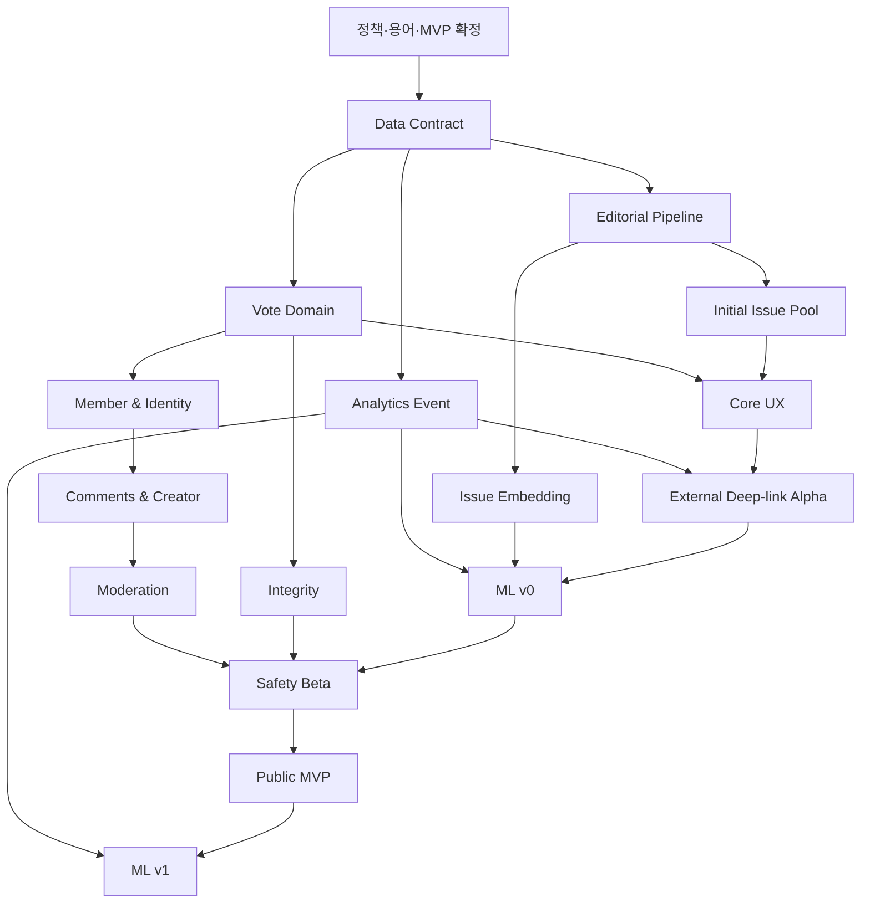

# WHICH MVP 로드맵 및 미결정 사항 v2.0

- **문서 상태:** 상세 기획 검토본
- **버전:** 2.0
- **기준일:** 2026-08-18
- **기준 문서:**
  - `01_PRODUCT_VISION_AND_PRINCIPLES_v2.md`
  - `02_CORE_UX_AND_USER_JOURNEYS_v2.md`
  - `03_ISSUE_SUPPLY_AND_CONTENT_PIPELINE_v2.md`
  - `04_ISSUE_TAXONOMY_QUALITY_AND_CONTROVERSY_v2.md`
  - `05_IDENTITY_AND_VOTE_INTEGRITY_v2.md`
  - `06_INTEREST_ONBOARDING_AND_PERSONALIZATION_v2.md`
  - `07_RECOMMENDATION_AND_ML_ARCHITECTURE_v2.md`
  - `08_SOCIAL_AND_COMMUNITY_v2.md`
  - `09_MODERATION_AND_GOVERNANCE_v2.md`
  - `10_METRICS_ANALYTICS_AND_EXPERIMENTS_v2.md`
  - `11_MVP_ROADMAP_AND_OPEN_DECISIONS.md` v1
  - `12_DECISION_LOG_v2.md`
  - `13_GLOSSARY_AND_STATUS_MODEL_v2.md`
- **문서 목적:** 1~10번 상세 기획을 실제 구현 순서, MVP In/Out, 선행 의존성, 출시 Gate, 운영 준비도, 위험 대응, 의사결정 우선순위로 통합한다.
- **문서 비범위:** 물리 데이터베이스 DDL, 최종 기술 스택, 최종 클라우드 사업자, 확정 일정·인력 계획, 수익모델, 정치·선거 기능 활성화는 후속 문서와 별도 의사결정에서 다룬다.
- **현재 정지 지점:** 본 문서와 12·13번 문서 확정 후 `WHICH Data Architecture & Database Schema v1`로 이동한다.

## 0. 결정 상태 표기
| 표기 | 의미 |
| --- | --- |
| [확정] | 후속 제품·데이터·기술 설계의 기본 전제로 사용한다. |
| [설계 기준] | 방향은 채택하되 수치·세부 UX·기술 방식은 검증 후 조정할 수 있다. |
| [초기안] | Alpha·MVP에서 사용할 가설이며 실험·법률·운영 검증이 필요하다. |
| [미정] | 별도 의사결정이 완료되기 전 구현을 고정하지 않는다. |
| [금지] | 제품 정체성·신뢰·안전·개인정보 원칙상 채택하지 않는다. |
| [법률 확인 필요] | 법률 자문 또는 관할 규정 확인 전 기능을 활성화하지 않는다. |
| [Launch Blocker] | 미해결이면 해당 Release를 공개하지 않는다. |
| [Post-MVP] | 공개 MVP 성공 검증 이후에만 진행한다. |

### 0.1 v2 주요 보강 내용
| 영역 | v1 | v2 보강 |
| --- | --- | --- |
| MVP 정의 | 기능 목록 | 검증 가설, 사용자 약속, 비목표, No-Go 조건까지 연결 |
| 로드맵 | Phase 0~7 | 문서 정합성부터 Public MVP와 Post-MVP ML v1까지 Entry·Exit Gate 정의 |
| Guest 보호 | 기본 비회원 투표 | 외부 Deep-link 첫 투표를 전 Workstream 공통 Guardrail로 승격 |
| 콘텐츠 | Issue Pipeline | 유희형 초기 재고, 수동 시딩, 재고 용량, 정정·Archive 운영까지 포함 |
| ML | ML v0·v1 | ML v0 Launch Contract, 학습 데이터 준비도, Shadow·Canary·Rollback Gate 정의 |
| 안전 | 기본 신고·정치 제한 | 정치·선거 MVP 비활성, Incident Freeze, Appeal·복구·Audit Gate 정의 |
| 분석 | 핵심 이벤트 | Event Source of Truth, Data Quality, Metric Registry, Experiment 준비도 Gate 정의 |
| 미결정 | 주제별 목록 | P0/P1/P2 우선순위, 결정 기한이 되는 Phase, 결정 방법과 영향 범위 연결 |
| 인수인계 | DB 설계 직전 | Data Architecture가 바로 사용할 논리 객체·불변조건·이벤트 산출물 명시 |

### 0.2 핵심 결정 요약
1. **[확정]** MVP의 최상위 가설은 외부에서 유입된 사용자가 가입 없이 정상 투표하고, 결과를 본 뒤 다음 Issue에도 참여하는가이다.
2. **[확정]** 외부 Deep-link Guest의 첫 Issue는 로그인, 관심사 선택, 프로필, 전면 안전 Prompt로 가리지 않는다.
3. **[확정]** 정치·선거 투표, 댓글, 사용자 생성, 일반 인기·논쟁 노출은 공개 MVP에서 비활성화한다.
4. **[확정]** 초기 Issue Pool은 운영자 중심으로 수동 시딩하며 유희·취향·생활 공감형 Issue 비중을 높인다.
5. **[설계 기준]** 사용자 Issue 생성은 공개 MVP 필수 경로가 아니라 승인된 베타 Creator의 제한적 제출로 시작한다.
6. **[확정]** 출시 시점 추천은 임베딩·관심사·품질·유희성·신선도 기반 ML v0를 사용한다.
7. **[확정]** 실제 Viewable Impression과 ACCEPTED Vote가 쌓이기 전 학습 Ranker의 성능을 과장하거나 필수 의존성으로 두지 않는다.
8. **[확정]** 추천 모델은 Eligibility, Safety, Political, Integrity, Block·Hide 정책을 우회할 수 없다.
9. **[확정]** MVP North Star는 Qualified Votes per Session과 Next Issue Rate를 함께 사용한다.
10. **[확정]** 제품 참여가 증가해도 Guest 첫 투표, 안전, 무결성, 다양성, 개인정보 Guardrail이 악화되면 출시 또는 실험을 승격하지 않는다.
11. **[확정]** 첫 ACCEPTED Vote 이후 Issue 질문과 A/B의 핵심 의미를 변경하지 않는다.
12. **[확정]** 댓글 A/B는 해당 Issue의 ACCEPTED Vote에서 파생하며 전체 투표 기록은 기본 비공개다.
13. **[확정]** 신고 수만으로 자동 삭제하지 않고 증거, 맥락, 조직적 신고 가능성을 분리해 검토한다.
14. **[확정]** Appeal이 인용되면 콘텐츠뿐 아니라 Count, Reputation, 추천 Feature, 학습 Label까지 복구한다.
15. **[금지]** 페이지뷰, 댓글 수, 분노, 정치적 진영화, 허위 긴급성을 MVP 성공의 대리 지표로 사용하지 않는다.

# 1. MVP의 역할과 검증 계약
## 1.1 MVP 한 줄 목적
> 외부 사용자가 특정 질문에 반응해 WHICH에 들어오고, 가입 없이 하나의 선택을 완료하고, 신뢰 가능한 결과를 확인한 뒤, 다음 질문에도 자발적으로 참여하는지 검증한다.
## 1.2 MVP는 기능 축소판이 아니다
MVP는 완성 제품의 메뉴를 일부만 구현한 버전이 아니다. 다음 네 가지가 하나의 닫힌 루프로 작동하는지 검증하는 제품이다.

```text
충분한 Issue 공급
→ Guest 첫 투표
→ 결과·댓글·다음 Issue
→ 행동 로그·추천 개선
→ 다시 참여할 Issue 공급
```

어느 하나라도 빠지면 다음 문제가 발생한다.
| 누락 영역 | 발생 문제 |
| --- | --- |
| Issue 공급 | 몇 번 투표한 뒤 재고가 고갈되어 핵심 소비 루프를 검증할 수 없음 |
| Guest 투표 | 외부 유입이 가입 장벽에서 이탈하여 WHICH의 차별점을 검증할 수 없음 |
| 결과·다음 Issue | 단발성 설문과 구분되지 않음 |
| 이벤트·추천 | 왜 사용자가 참여하거나 이탈했는지 학습할 수 없음 |
| 무결성·모더레이션 | 보이는 참여 수와 추천 순위를 신뢰할 수 없음 |

## 1.3 최상위 제품 가설
| 가설 ID | 가설 | 성공 관찰 | 실패 신호 |
| --- | --- | --- | --- |
| H-CORE-01 | 외부 Deep-link Guest는 가입 없이 첫 투표를 완료한다. | External First Vote Conversion과 First Result View가 안정적 | 가입·Prompt·성능·Challenge로 투표 전 이탈 |
| H-CORE-02 | 결과는 투표의 즉각적 보상으로 작동한다. | Vote Accepted 후 Result View 비율이 높음 | 투표 후 결과 확인 전에 이탈 |
| H-CORE-03 | 다음 Issue는 연속 소비를 만든다. | Next Issue Rate와 Second Vote Rate가 상승 | 대부분 1표에서 세션 종료 |
| H-SUPPLY-01 | 유희·생활·취향 중심 초기 Pool이 첫 참여 장벽을 낮춘다. | 첫 세션 Playfulness Share와 Vote Conversion 동반 개선 | 가벼운 질문은 많지만 반복 피로·재방문 저하 |
| H-PERS-01 | 관심사 3개와 ML v0가 Cold Start를 개선한다. | 온보딩 후 Vote·Next·D1 개선, Guest Guardrail 유지 | 온보딩 완료만 늘고 외부 전환·다양성 악화 |
| H-COMM-01 | A/B별 댓글은 결과 이후 깊은 탐색을 만든다. | Comment Open과 반대편 댓글 열람 증가 | 댓글이 갈등·신고만 증가시킴 |
| H-TRUST-01 | 기본 무결성·모더레이션이 참여 신뢰를 유지한다. | Duplicate·Abuse·Appeal 지표 관리 가능 | 조작·오판·복구 불완전 |

## 1.4 First Value Moment
**[확정]** WHICH의 First Value Moment는 다음 두 사건이 모두 완료된 시점이다.

```text
첫 VOTE_ACCEPTED
+
첫 RESULT_VIEW
```

First Value Moment 이전에는 제품 사용에 필수적인 요소만 허용한다.
| 허용 | 기본 비노출 |
| --- | --- |
| 질문, A/B, 필요한 배경·출처, 투표 오류 복구 | 로그인 강제 |
| Risk-proportional 최소 안전 처리 | 관심사 전면 온보딩 |
| Issue 상태와 접근성 정보 | 프로필 완성 |
| 투표 성공 여부 | 알림 권한 요청 |
| 법적·안전상 필수 고지 | 광고 전면창 |

## 1.5 MVP 성공을 의미하지 않는 것
다음 수치가 높아도 MVP 성공으로 간주하지 않는다.
- 페이지뷰만 증가했지만 ACCEPTED Vote가 증가하지 않는 경우
- 한두 개 자극적 Issue가 전체 세션을 끌어올린 경우
- 외부 좌표찍기로 Vote와 댓글이 급증한 경우
- 결과를 숨기거나 가입을 강제해 회원가입률만 높인 경우
- 관심사 Prompt 완료율은 높지만 첫 투표 전환이 떨어진 경우
- 정치·젠더 갈등 Issue가 추천을 과점한 경우
- 신고와 Appeal 오판을 무시한 채 Engagement만 상승한 경우
- Issue Pool이 반복·중복 질문으로 채워진 경우

# 2. Release 전략
## 2.1 Release 단계
| Release | 대상 | 목적 | 외부 공개 | 정치·선거 |
| --- | --- | --- | --- | --- |
| R0 — Documentation Freeze | 기획·데이터·정책 담당 | 용어·불변조건·P0 결정 정합성 확보 | 없음 | 비활성 |
| R1 — Internal Prototype | 내부 팀 | Issue→Vote→Result 핵심 동작 검증 | 없음 | 비활성 |
| R2 — Editorial Alpha | 내부 운영자 | Source→Candidate→Publish와 초기 Pool 검증 | 없음 또는 초대 | 비활성 |
| R3 — Closed Product Alpha | 내부·초대 사용자 | Guest Vote, Result, Next, Event 정합성 검증 | 초대 링크 | 비활성 |
| R4 — External Deep-link Alpha | 제한 채널 유입 | 외부 첫 투표 Funnel과 공유 Loop 검증 | 제한적 | 비활성 |
| R5 — Personalization Alpha | 초대 사용자 | 관심사·ML v0·Exploration 검증 | 제한적 | 비활성 |
| R6 — Community Beta | 초대 Member·Creator | 댓글·공감·신고·제한 UGC 검증 | Closed Beta | 비활성 |
| R7 — Safety & Integrity Beta | 확장 베타 | Challenge·Brigading·Appeal·복구 운영 검증 | Closed Beta | 비활성 |
| R8 — Public MVP | 일반 사용자 | 핵심 가설 공개 검증 | 공개 | 비활성 |
| R9 — Post-MVP Growth | 공개 사용자 | ML v1·Creator·Following·운영 자동화 확장 | 공개 | 별도 Gate |

## 2.2 단계 승격 원칙
Release는 기능 구현 완료만으로 승격하지 않는다. 각 Release는 다음 네 축을 모두 통과해야 한다.

```text
기능 완료
+
데이터 정합성
+
안전·운영 준비
+
Rollback 가능성
```
## 2.3 기능 Flag 원칙
- **[설계 기준]** 정치·선거, 댓글 작성, 사용자 Issue 생성, 추천 Ranker, Challenge, 결과 공유는 독립 Feature Flag로 분리한다.
- **[설계 기준]** Feature Flag Off 상태에서도 Guest Core Vote Loop는 정상 동작해야 한다.
- **[설계 기준]** 정책·모델 장애 시 Safe Fallback을 즉시 활성화할 수 있어야 한다.
- **[설계 기준]** 실험 Variant와 Feature Flag를 혼용하지 않고 목적과 Owner를 구분한다.
- **[설계 기준]** RESTRICTED 기능은 코드가 존재한다는 이유만으로 공개하지 않는다.

# 3. 공개 MVP 제품 계약
## 3.1 Public MVP In
| 영역 | MVP 제공 |
| --- | --- |
| Issue 소비 | 독립 URL, 모바일 우선 Issue 화면, 배경·출처, A/B, 결과, 다음 Issue, 뒤로가기 상태 복원 |
| Guest | LOW·허용된 MEDIUM 일반 Issue 즉시 투표, 결과·댓글 읽기·공유 |
| Member | 소셜 로그인, 닉네임, 비공개 투표 기록, 댓글 작성, 공감, 신고, 차단 |
| 피드 | For You, 인기, 논쟁, 최신의 MVP 버전과 안전한 Fallback |
| 개인화 | Guest·Member 관심사 3개 이상, 덜 보기, 관심 없음, 추천 재설정 |
| ML v0 | Issue Embedding, 관심사 Vector, 유사도·품질·유희성·신선도 후보, Policy Re-ranking |
| 공급 | Source Registry, Source Item, Candidate, 품질·중복·Risk, 인간 승인, Publish Queue |
| 초기 Pool | 유희·취향·생활 공감 중심의 충분한 미노출 재고와 카테고리 다양성 |
| 댓글 | A/B별 읽기, Member+ACCEPTED Vote 작성, 공감 1종, 제한 답글, 신고 |
| 무결성 | anonymous subject, Unique Vote, Idempotency, Vote Context, Rate Limit, Risk 상태 |
| 모더레이션 | Issue·Comment·Profile 신고, Queue, Reason Code, Notice, Appeal, Restore, Audit |
| 분석 | Viewable Impression, Vote Submit·Accepted, Result, Skip, Next, Comment, Share, Interest, Auth |
| 운영 | Admin Queue, Pool Dashboard, Integrity Dashboard, Moderation Dashboard, Incident Freeze |
| 접근성·성능 | 키보드·스크린리더·색상 비의존, 모바일 네트워크 오류 복구, 기본 성능 Budget |

## 3.2 Public MVP Out
| 영역 | MVP 제외 |
| --- | --- |
| 정치·선거 | 후보·정당 지지, 모의투표, 당선 예측, 정치 댓글, 정치 Choice 개인화 |
| 고급 추천 | Two-Tower, Sequence Model, 실시간 Bandit, 실시간 Feature Store |
| 고급 소셜 | DM, Group, 연락처 Import, 친구 Graph, Quote-post, 실시간 채팅 |
| 수익화 | 광고 최적화, 구독, 현금·포인트, Creator 수익 배분 |
| 미디어 | 제3자 기사 이미지 자동 재사용, 사용자 영상 중심 Issue |
| 공식 여론 | 대표 표본, 지역별 정치 성향, 국민 여론 표현, 인증 1인 1표 주장 |
| 자동 운영 | LOW 완전 자동 게시, 완전 자동 영구 제재, 자동 사실 판정 |
| 대규모 UGC | 모든 회원의 즉시 Issue 게시 |
| 다국가 | 다국어·다지역 동시 출시 |
| B2B | 외부 데이터 판매, 기업·언론용 분석 제품 |

## 3.3 제한적 베타로만 허용할 기능
| 기능 | 초기 범위 | 승격 조건 |
| --- | --- | --- |
| Creator Issue 제출 | 승인된 Beta Creator만 제출, 인간 사전 검수 | Spam·Duplicate·Moderation 운영 안정 |
| HIGH 사회 Issue | 운영자 생성, Senior Review, 일반 Cold Start 제외 | 정책 Precision과 Incident 대응 |
| 알림 | 답글·게시 결과 등 제한 알림, Push 권한 후순위 | 피로·분노 증폭 Guardrail |
| Following | Creator·Topic Follow 저장, 기본 Feed 반영 제한 | 추천 다양성과 조작 방어 |
| 추천 ML v1 | Shadow·Canary만 허용 | Impression Dataset·Calibration·Rollback Gate |

# 4. Workstream 구조
| ID | Workstream | 목표 | 주요 기준 문서 |
| --- | --- | --- | --- |
| WS-01 | Product & UX | Deep-link부터 다음 투표까지 핵심 경험 | 02, 06, 08 |
| WS-02 | Data Contract & Domain | 객체·상태·이벤트·불변조건 | 05, 07, 09, 10, 13 |
| WS-03 | Issue Supply & Editorial | 초기 재고와 지속 공급 | 03, 04 |
| WS-04 | Vote & Result | 정상 집계와 결과 계약 | 02, 05, 10 |
| WS-05 | Identity & Account | Guest·Member·Verification 경계 | 05, 08 |
| WS-06 | Interest & Personalization | Cold Start와 사용자 제어 | 06 |
| WS-07 | Recommendation & ML | ML v0와 학습 준비도 | 07, 10 |
| WS-08 | Community & Creator | 댓글·공감·제한 Creator | 08 |
| WS-09 | Moderation & Governance | 정책·신고·Appeal·Incident | 09 |
| WS-10 | Analytics & Experiment | Source of Truth와 실험 | 10 |
| WS-11 | Platform & Security | 성능·보안·권한·관측성 | 05, 09, 10 |
| WS-12 | Legal & Privacy | 보존·민감정보·정치 Legal Gate | 05, 09, 10 |
| WS-13 | Launch Operations | 운영 인력·Runbook·지원 | 03, 05, 09, 10 |

## WS-01 — Product & UX
**목표:** 외부 링크의 첫 화면부터 두 번째 정상 투표까지 마찰 없는 경험을 제공한다.

### 필수 산출물
- Issue 독립 URL과 canonical routing
- PRE_VOTE·SUBMITTING·RESULT·오류 상태
- 모바일 Vertical Feed와 명시적 다음 버튼
- 뒤로가기·로그인 후 상태 복원
- 댓글 읽기·공유·관심사 제안
- 접근성 Keyboard·Screen Reader 흐름

### Exit Acceptance
- [ ] 첫 Issue가 Home이나 가입 화면으로 우회되지 않는다.
- [ ] 중복·네트워크 실패 후 중복 Count가 발생하지 않는다.
- [ ] 투표 후 결과를 보기 전에 자동으로 다음 Issue로 이동하지 않는다.
- [ ] SKIP과 NEXT_ISSUE가 UX와 Event에서 구분된다.
- [ ] Guest Prompt가 첫 결과를 가리지 않는다.

### 이 Workstream의 MVP 비범위
- 고급 애니메이션
- 음성·AR
- 실시간 채팅

## WS-02 — Data Contract & Domain
**목표:** 모든 팀이 동일한 객체, 상태, Source of Truth, Version을 사용하게 한다.

### 필수 산출물
- Issue·Choice·Vote·Comment·Subject 논리 모델
- 상태와 전이·Audit Event
- Idempotency·Unique Constraint 계약
- Event Schema와 Version
- PII·민감 데이터 분류
- Metric·Model·Policy Version 연결

### Exit Acceptance
- [ ] 동일 개념을 여러 status 필드가 모순되게 표현하지 않는다.
- [ ] 첫 ACCEPTED Vote 후 Issue 의미 불변성을 강제할 수 있다.
- [ ] Vote Aggregate와 Fact를 Reconcile할 수 있다.
- [ ] Appeal Restore가 파생 데이터까지 추적 가능하다.

### 이 Workstream의 MVP 비범위
- 최종 DDL
- 최종 클라우드 제품 선택

## WS-03 — Issue Supply & Editorial
**목표:** 저품질·중복·정치 자극 없이 충분한 초기 Issue Pool을 공급한다.

### 필수 산출물
- Source Registry
- Source Item·Candidate Editor
- Binary Fit·Quality·Playfulness·Risk 검사
- Duplicate Cluster
- Human Approval·Publish Calendar
- Archive·Correction·Successor
- 유희형 초기 시딩 Pack

### Exit Acceptance
- [ ] Published Issue는 Source와 Revision을 역추적할 수 있다.
- [ ] RESTRICTED가 일반 Queue에서 자동 게시되지 않는다.
- [ ] 첫 세션에 유희·생활형 재고가 충분하다.
- [ ] Source 철회 시 Issue를 정정·중단할 수 있다.

### 이 Workstream의 MVP 비범위
- 대규모 크롤링
- 제3자 이미지 자동 재사용
- LOW 자동 게시

## WS-04 — Vote & Result
**목표:** 하나의 참여 요청을 정확히 한 번 처리하고 설명 가능한 결과를 제공한다.

### 필수 산출물
- Vote Context Token
- Idempotency Key
- Subject별 Unique Vote
- Vote Processing·Integrity 상태
- Accepted Aggregate
- 저표본·잠금·검토 결과 UI
- Result Version

### Exit Acceptance
- [ ] Retry·다중 탭에서도 Accepted Vote가 하나다.
- [ ] REVIEW·INVALIDATED는 표시 Count에서 제외된다.
- [ ] Aggregate 변경은 Audit 가능하다.
- [ ] 공유 기기에는 정확한 중복 문구를 사용한다.

### 이 Workstream의 MVP 비범위
- 법적 1인 1표 보장
- 투표 변경
- 정치 Verified Vote

## WS-05 — Identity & Account
**목표:** Guest 참여를 보존하면서 Member 기능을 Just-in-time으로 제공한다.

### 필수 산출물
- anonymous_subject_id
- Session
- Social Login
- Guest→Member 명시적 병합
- 로그아웃·삭제 흐름
- Profile 최소 필드
- 권한·RBAC

### Exit Acceptance
- [ ] 로그인 실패·취소 후 현재 Issue와 작성 Draft가 보존된다.
- [ ] Guest 기록이 계정 Vote를 이중 집계하지 않는다.
- [ ] 전체 Vote 기록은 본인만 볼 수 있다.

### 이 Workstream의 MVP 비범위
- 정치 유일성 Verification
- 연락처 친구 찾기
- 공개 실명제

## WS-06 — Interest & Personalization
**목표:** 첫 가치를 방해하지 않고 초기 취향을 수집하며 사용자가 추천을 제어하게 한다.

### 필수 산출물
- 관심사 카드 3개 이상
- Guest·Member Profile
- 명시·추론·세션 관심 분리
- 관심 없음·덜 보기·Reset
- Guest→Member Interest Merge
- Prompt Frequency Cap

### Exit Acceptance
- [ ] 첫 투표 전 Prompt가 없다.
- [ ] 건너뛰어도 모든 Guest 핵심 기능이 유지된다.
- [ ] A/B 방향으로 정치 성향을 만들지 않는다.
- [ ] Reset 후 투표 기록은 유지된다.

### 이 Workstream의 MVP 비범위
- 강제 온보딩
- 민감 관심사 자동 추론

## WS-07 — Recommendation & ML
**목표:** 데이터가 적은 상태에서도 안전하고 다양한 다음 Issue를 제공하고 ML v1 데이터를 준비한다.

### 필수 산출물
- Eligibility Gate
- Interest·Semantic·Popular·Fresh·Playful·Exploration Retrieval
- ML v0 Score
- Diversity Re-ranking
- Fallback Feed
- Recommendation Log
- Embedding Pipeline

### Exit Acceptance
- [ ] 정치·제한 Issue가 일반 Feed에 들어가지 않는다.
- [ ] Prefetch와 Viewable Impression이 분리된다.
- [ ] 모델·Feature·Policy Version이 로그된다.
- [ ] 모델 장애 시 Safe Fallback이 동작한다.

### 이 Workstream의 MVP 비범위
- Two-Tower
- Bandit
- 실시간 재학습

## WS-08 — Community & Creator
**목표:** 질문 중심의 소셜 루프를 제공하되 Opinion Graph와 갈등 증폭을 피한다.

### 필수 산출물
- 댓글 전체·A·B 탭
- ACCEPTED Vote 기반 Side
- 공감 1종
- 제한 답글
- 신고·Block
- Creator Profile 최소
- Beta Creator 제출

### Exit Acceptance
- [ ] 댓글 Side를 사용자가 위조할 수 없다.
- [ ] 프로필에서 전체 Vote 방향을 열람할 수 없다.
- [ ] Block이 Feed·Comment·Follow에 즉시 반영된다.
- [ ] 공감 수만으로 댓글 상단이 독점되지 않는다.

### 이 Workstream의 MVP 비범위
- DM
- 그룹
- Quote-post
- 공개 성향 통계

## WS-09 — Moderation & Governance
**목표:** Issue·Comment·Vote·Profile·추천 노출의 위험을 단계적으로 관리하고 오판을 복구한다.

### 필수 산출물
- Policy Taxonomy·Reason Code
- Automod·Human Queue
- Guest 신고
- Notice·Appeal
- Restore
- Incident Freeze
- 2인 승인 대상
- Append-only Audit

### Exit Acceptance
- [ ] 신고 수만으로 자동 삭제하지 않는다.
- [ ] HIGH·RESTRICTED·대량 무효화는 인간 승인이다.
- [ ] Appeal 인용 후 파생 Count·Feature가 복구된다.
- [ ] 정치·선거 기능은 Flag Off다.

### 이 Workstream의 MVP 비범위
- 완전 자동 영구 제재
- 정치 댓글

## WS-10 — Analytics & Experiment
**목표:** MVP 가설과 Guardrail을 재현 가능한 지표로 판단한다.

### 필수 산출물
- Viewable Impression
- Vote Submit·Accepted
- Result·Next·Skip
- Entry Source
- Metric Registry
- North Star Dashboard
- Data Quality Alert
- Experiment Assignment·Exposure

### Exit Acceptance
- [ ] Vote Aggregate와 Fact가 Reconcile된다.
- [ ] External Deep-link Funnel이 채널별로 보인다.
- [ ] 실험 SRM·Rollback을 확인할 수 있다.
- [ ] 정치 Choice가 일반 Mart에 없다.

### 이 Workstream의 MVP 비범위
- 고급 인과추론
- 실시간 데이터 플랫폼

## WS-11 — Platform & Security
**목표:** 핵심 Loop와 운영 도구를 안전하게 배포·관측·복구한다.

### 필수 산출물
- 환경 분리
- RBAC·Secret
- Rate Limit
- Error Tracking
- Trace·Log
- Backup·Restore
- Feature Flag
- Cache·Fallback
- Security Review

### Exit Acceptance
- [ ] 운영자가 Production 값을 직접 임의 수정하지 않는다.
- [ ] 장애 시 Vote Source of Truth가 손상되지 않는다.
- [ ] 모델·추천 장애가 투표 API 장애로 전파되지 않는다.
- [ ] 권한 변경과 Break-glass 접근이 Audit된다.

### 이 Workstream의 MVP 비범위
- 과도한 마이크로서비스 분리
- 초기 Kafka 필수화

## WS-12 — Legal & Privacy
**목표:** 필요한 데이터만 수집하고 정치·미성년자·자동화 결정의 출시 위험을 통제한다.

### 필수 산출물
- Data Inventory
- 처리 목적·접근 등급
- Retention 초안
- 삭제·Export 흐름
- 정치·선거 Legal Gate
- 미성년자 정책
- 권리 요청 Runbook

### Exit Acceptance
- [ ] 정치·선거는 법률 검토 전 비활성이다.
- [ ] 정치 Choice는 일반 개인화·BI에 사용되지 않는다.
- [ ] IP·보안 로그 접근과 보존이 분리된다.
- [ ] 사용자 삭제 요청의 범위가 설명 가능하다.

### 이 Workstream의 MVP 비범위
- 법률 미검토 정치 기능
- 민감정보 광고 활용

## WS-13 — Launch Operations
**목표:** 콘텐츠·신고·Incident·사용자 지원을 실제 운영할 수 있게 한다.

### 필수 산출물
- Daily Editorial Runbook
- Moderation Queue Owner
- Integrity On-call
- Incident Severity
- Support Template
- Launch Dashboard Review
- Rollback Decision Chain

### Exit Acceptance
- [ ] 각 Queue에 Owner와 Escalation이 있다.
- [ ] Issue Pool 고갈·오보·좌표찍기 Playbook을 실행할 수 있다.
- [ ] 공개 전 Dry Run을 완료한다.
- [ ] No-Go를 선언할 권한이 명확하다.

### 이 Workstream의 MVP 비범위
- 정치 전담 운영
- 24시간 글로벌 운영

# 5. 단계별 구현 로드맵
## Phase 0 — 기획 정합성 및 P0 결정 Closure
**목표:** 1~13번 문서의 용어·정책·상태·MVP 범위를 잠근다.

### Entry Condition
- [ ] 1~10번 상세본 존재

### 주요 산출물
- 12 Decision Log v2
- 13 Glossary·Status v2
- P0 Open Decision 결과
- Data Architecture 입력 목록

### Exit Gate
- [ ] 정치·선거 MVP 비활성 확정
- [ ] Issue·Vote·Comment 핵심 불변조건 승인
- [ ] MVP In/Out 승인
- [ ] Data Architecture 착수 승인

## Phase 1 — Data Contract & Platform Foundation
**목표:** 핵심 객체와 이벤트의 Source of Truth를 구현 가능한 계약으로 만든다.

### Entry Condition
- [ ] Phase 0 Exit

### 주요 산출물
- 논리 ERD
- DB Schema v1
- Event Schema v1
- ID·Version 규칙
- RBAC·Environment·Audit 기반
- Feature Flag 기반

### Exit Gate
- [ ] Issue→Vote→Aggregate Transaction 설계 검증
- [ ] Viewable Impression·Vote Event 계약 검증
- [ ] PII 분류·접근 등급 승인
- [ ] Migration·Rollback 절차 존재

## Phase 2 — Editorial & Issue Pool Alpha
**목표:** 운영자가 안전하고 재미있는 Issue를 지속 공급할 수 있게 한다.

### Entry Condition
- [ ] Source·Candidate·Issue Schema

### 주요 산출물
- Source Registry
- Candidate Editor
- Quality·Playfulness·Risk·Duplicate 검사
- Human Publish Queue
- Archive·Correction
- 초기 Pool Seed

### Exit Gate
- [ ] 정해진 카테고리 Coverage 충족
- [ ] 첫 세션용 유희형 Pack 준비
- [ ] 정치·RESTRICTED 일반 Queue 차단
- [ ] Source→Published Audit 추적 성공
- [ ] Pool 고갈 Dry Run 통과

## Phase 3 — Core Vote Closed Alpha
**목표:** Issue→Guest Vote→Result→Next의 정확성과 UX를 검증한다.

### Entry Condition
- [ ] 초기 Pool
- [ ] Vote Domain Contract

### 주요 산출물
- Issue Page
- Guest Subject
- Vote API
- Result Aggregate
- Next Issue Fallback
- Core Event
- 오류 복구

### Exit Gate
- [ ] Retry·다중 탭 중복 Count 없음
- [ ] 첫 ACCEPTED Vote 후 Issue 의미 잠금
- [ ] Result와 Aggregate Reconciliation
- [ ] SKIP·NEXT 분리
- [ ] 내부 E2E 핵심 시나리오 통과

## Phase 4 — External Deep-link Alpha
**목표:** 실제 외부 링크 유입에서 첫 투표와 공유 Loop를 검증한다.

### Entry Condition
- [ ] Phase 3 안정
- [ ] Entry Attribution

### 주요 산출물
- SNS·검색 Deep-link
- Share Card·Link Copy
- Guest Funnel Dashboard
- 성능·접근성 개선
- Rate Limit 최소

### Exit Gate
- [ ] 첫 Issue 우회·Prompt 없음
- [ ] External First Vote 측정 가능
- [ ] Deep-link 오류 복구
- [ ] LOW Guest False Challenge 허용 범위
- [ ] 채널별 유입 품질 분석 가능

## Phase 5 — Interest Onboarding & ML v0
**목표:** 첫 가치 이후 개인화와 안전한 다음 Issue 품질을 개선한다.

### Entry Condition
- [ ] Viewable Impression
- [ ] Issue Embedding Pipeline

### 주요 산출물
- 관심사 카드
- Guest·Member Interest Profile
- ML v0 Retrieval·Score
- Diversity Re-ranking
- Exploration
- Safe Fallback

### Exit Gate
- [ ] Prompt가 First Value Moment 이후만 노출
- [ ] Guest Guardrail 비악화
- [ ] 추천 Request·Model·Policy Version 연결
- [ ] 정치 일반 Feed 제외
- [ ] Fallback·Reset 검증

## Phase 6 — Member & Community Beta
**목표:** 댓글과 Creator 기능이 핵심 Loop를 강화하는지 검증한다.

### Entry Condition
- [ ] Social Login
- [ ] Moderation Queue 기본

### 주요 산출물
- Member Profile
- 비공개 Vote History
- A/B 댓글
- 공감·답글
- 신고·Block
- Beta Creator 제출

### Exit Gate
- [ ] Comment Side 위조 불가
- [ ] 로그인 전 Draft 보존
- [ ] 신고·Appeal 작동
- [ ] Opinion Graph 없음
- [ ] Creator 제출 사전 검수 통과

## Phase 7 — Integrity & Moderation Hardening
**목표:** 대량 유입·조작·신고 공격·오판에 대응할 수 있게 한다.

### Entry Condition
- [ ] 실제 Alpha·Beta Traffic

### 주요 산출물
- Risk Band
- Challenge Ladder
- Issue Anomaly
- Ranking Freeze·Result Lock
- Report Brigading
- Notice·Appeal·Restore
- Incident Runbook

### Exit Gate
- [ ] Brigading Simulation 통과
- [ ] 대량 무효화 2인 승인
- [ ] 복구 후 Count·Feature 재계산
- [ ] Guest False Challenge 관리
- [ ] Critical Queue Owner·Escalation 존재

## Phase 8 — Public MVP Launch
**목표:** 핵심 제품 가설을 일반 사용자에게 공개 검증한다.

### Entry Condition
- [ ] 모든 Launch Gate 통과

### 주요 산출물
- Public Web
- 운영 Dashboard
- Support·Incident 대응
- Daily Pool 운영
- Experiment 최소 기반

### Exit Gate
- [ ] 초기 관찰 기간 동안 SEV-1 없음
- [ ] North Star·Guardrail 신뢰 가능
- [ ] Pool·Moderation Capacity 유지
- [ ] Rollback 없이 안정적 핵심 Loop

## Phase 9 — Post-MVP ML v1 & Growth
**목표:** 실제 노출 데이터로 경량 Ranker와 Creator·Following을 확장한다.

### Entry Condition
- [ ] 충분한 Viewable Impression·Label
- [ ] MVP 가설 유효

### 주요 산출물
- Logistic/LightGBM Baseline
- Shadow·Canary·A/B
- Advanced Creator Exploration
- Following Feed
- 운영 자동화 후보

### Exit Gate
- [ ] 오프라인·온라인·Guardrail 동시 통과
- [ ] 모델 Rollback 검증
- [ ] 자동화 Sample Audit 통과

# 6. Critical Path와 의존성
## 6.1 최상위 Critical Path
```text
정책·용어 확정
→ Data Contract
→ Issue Supply + Vote Domain
→ Core UX + Event
→ External Deep-link
→ ML v0 + Interest
→ Community + Moderation
→ Integrity Hardening
→ Public MVP
```
## 6.2 병렬 진행 가능한 트랙
| 트랙 | 병렬 가능 시점 | 합류 Gate |
| --- | --- | --- |
| Editorial Tool | Data 논리 객체 승인 후 | Core Alpha 전 초기 Pool |
| Frontend Prototype | Issue UX State 승인 후 | Vote API 통합 |
| Embedding·ML v0 | Issue Text Contract 승인 후 | Phase 5 |
| Moderation Policy·Tool | Policy Taxonomy 승인 후 | 댓글 Beta 전 |
| Analytics | Event Contract 승인 후 모든 Phase | 각 Release Gate |
| Privacy·Legal | Data Inventory 초안부터 | Public MVP 전 |
| Accessibility QA | 핵심 Component Prototype부터 | External Alpha·Public MVP |

## 6.3 선행 의존성 Matrix
| 기능 | 필수 선행 요소 | 최초 허용 단계 |
| --- | --- | --- |
| 독립 Issue URL | Published Issue·Routing | External Deep-link |
| Guest Vote | anonymous subject·Vote Contract | Core Alpha |
| 결과 표시 | Accepted Aggregate·Result Version | Core Alpha |
| 논쟁 피드 | Accepted Vote·Integrity Factor·최소 표본 | ML v0 |
| 댓글 A/B | Member·Accepted Vote·Comment Schema | Community Beta |
| ML v0 | Issue Embedding·Interest Catalog·Eligibility | Personalization Alpha |
| ML v1 | Viewable Impression·Accepted Label·Experiment | Post-MVP |
| Appeal 복구 | Audit·Derived Lineage | Safety Beta |
| 사용자 Issue 생성 | Creator Profile·Premoderation·Supply Queue | Community Beta |
| 정치·선거 | 법률·Verified·Election Mode·2인 승인 | 별도 Release |

## 6.4 Mermaid 의존성

# 7. Public MVP Launch Gate
## GATE-01 — Product Loop
- [ ] 외부 Deep-link가 정확한 Issue로 진입한다.
- [ ] Guest가 첫 투표 전 가입·관심사 강제를 받지 않는다.
- [ ] VOTE_ACCEPTED 후 RESULT_VIEW가 가능하다.
- [ ] NEXT_ISSUE와 두 번째 투표가 작동한다.
- [ ] 뒤로가기·로그인 후 상태 복원이 작동한다.

## GATE-02 — Content Supply
- [ ] 초기 Effective Active Inventory가 승인 기준을 충족한다.
- [ ] 첫 세션 유희·생활·취향 믹스가 준비돼 있다.
- [ ] Source·Candidate·Published Issue가 추적 가능하다.
- [ ] Duplicate·Risk·Quality Gate가 작동한다.
- [ ] 정치·선거·RESTRICTED가 일반 게시 Queue에 없다.
- [ ] Pool Exhaustion Fallback과 Daily 운영 Owner가 있다.

## GATE-03 — Vote Integrity
- [ ] Subject별 Unique Vote와 Idempotency가 검증된다.
- [ ] REVIEW·REJECTED·INVALIDATED가 공개 Count에서 제외된다.
- [ ] Rate Limit·기본 Risk Rule이 작동한다.
- [ ] 공유 Network False Positive 시나리오를 통과한다.
- [ ] Anomaly 발생 시 Trending·Ranking Freeze가 가능하다.

## GATE-04 — Recommendation
- [ ] Eligibility가 Moderation·Risk·Block·Seen을 적용한다.
- [ ] ML v0와 Safe Fallback이 모두 작동한다.
- [ ] 동일 Issue·Semantic Cluster 중복을 제한한다.
- [ ] 정치·선거가 일반 For You·인기·논쟁에 없다.
- [ ] Recommendation Request와 Version 연결률을 확인한다.

## GATE-05 — Community
- [ ] 댓글 Side가 Accepted Vote에서 파생된다.
- [ ] 댓글 신고·Block·Hide가 작동한다.
- [ ] 공개 Profile에서 전체 Vote 선택을 열람할 수 없다.
- [ ] 댓글 Automod·Human Queue와 Notice가 있다.
- [ ] 사용자 Issue 생성은 승인 Beta로 제한된다.

## GATE-06 — Moderation & Governance
- [ ] Critical Policy Queue와 Owner가 있다.
- [ ] 신고 수만으로 자동 삭제하지 않는다.
- [ ] Reason Code·User Notice·Appeal이 작동한다.
- [ ] Restore가 Count·Reputation·Feature에 전파된다.
- [ ] SEV Incident Freeze와 2인 승인 Runbook이 있다.

## GATE-07 — Analytics
- [ ] Viewable Impression과 Prefetch가 분리된다.
- [ ] Vote Submit과 Accepted가 분리된다.
- [ ] Vote Fact와 Aggregate가 Reconcile된다.
- [ ] Guest Entry→First Vote→Result→Next Funnel이 보인다.
- [ ] Metric Registry와 Data Quality Alert가 있다.
- [ ] 정치 Choice가 일반 Mart에 없다.

## GATE-08 — Security & Privacy
- [ ] Production RBAC와 Secret 관리가 있다.
- [ ] PII·Security·Political data 접근 등급이 정의된다.
- [ ] 삭제·Export·탈퇴 최소 흐름이 있다.
- [ ] Backup·Restore와 Audit 접근 검증이 완료된다.
- [ ] 고위험 기능은 Fail-Closed다.

## GATE-09 — Performance & Accessibility
- [ ] 모바일 주요 네트워크 환경에서 승인된 성능 Budget을 충족한다.
- [ ] 질문·A/B·결과가 키보드와 Screen Reader로 사용 가능하다.
- [ ] 색상만으로 A/B와 결과를 구분하지 않는다.
- [ ] 오프라인·Retry·느린 응답에서 중복 투표가 발생하지 않는다.
- [ ] 감소된 Motion과 큰 글자에서 핵심 흐름이 유지된다.

## GATE-10 — Operations
- [ ] Editorial·Moderation·Integrity·Support Owner가 있다.
- [ ] Issue Pool 고갈·Source 철회·좌표찍기·오판 Playbook을 Dry Run했다.
- [ ] Feature Flag·Rollback 권한과 승인 체인이 있다.
- [ ] Launch Day Dashboard와 Review Cadence가 있다.
- [ ] 정치·선거 Feature Flag가 Off이고 별도 활성화 권한이 제한된다.

# 8. No-Go 조건
| ID | No-Go 조건 |
| --- | --- |
| NG-01 | 외부 Deep-link가 Home·가입·온보딩으로 우회된다. |
| NG-02 | Vote Retry 또는 다중 탭에서 이중 Accepted Count가 발생한다. |
| NG-03 | 첫 Accepted Vote 이후 질문 또는 A/B 의미가 수정 가능하다. |
| NG-04 | REVIEW·INVALIDATED Vote가 공개 결과나 추천 Label에 포함된다. |
| NG-05 | 정치·선거 Issue가 일반 Feed·논쟁·급상승에 노출된다. |
| NG-06 | Issue Pool이 승인 기준보다 부족하거나 동일 질문 중복으로 채워진다. |
| NG-07 | 신고·긴급 안전 Queue에 Owner 또는 Escalation이 없다. |
| NG-08 | Appeal 인용 후 콘텐츠는 복구되지만 Count·Feature가 복구되지 않는다. |
| NG-09 | Viewable Impression과 Prefetch를 구분할 수 없다. |
| NG-10 | External First Vote Funnel을 측정할 수 없다. |
| NG-11 | 운영자가 Audit 없이 Production Aggregate를 직접 수정할 수 있다. |
| NG-12 | 정치 Choice·민감정보가 일반 추천 또는 BI에 포함된다. |
| NG-13 | 추천 장애 시 Safe Fallback이 없다. |
| NG-14 | Guest 일반 LOW Issue에 일괄 CAPTCHA가 적용된다. |
| NG-15 | 법률·개인정보 P0 검토가 완료되지 않았다. |

# 9. End-to-End Acceptance 시나리오
| ID | 시나리오 | 흐름 | 통과 기준 |
| --- | --- | --- | --- |
| E2E-01 | 외부 Guest 첫 투표 | SNS 링크→Issue→A 선택→Accepted→Result→Next→두 번째 투표 | 로그인·관심사 전면 Prompt 없음, 모든 Event 연결 |
| E2E-02 | 중복 탭 | 동일 Guest가 두 탭에서 A·B 동시 제출 | 하나만 Accepted, 다른 요청은 Duplicate 또는 기존 결과 |
| E2E-03 | 네트워크 Retry | Submit 응답 손실 후 동일 Idempotency 재시도 | 새 Vote 생성 없이 동일 결과 |
| E2E-04 | Guest→Member 병합 | Guest Vote 후 로그인, 계정에 기존 Vote 있음 | 집계 중복 없음, 충돌 설명 가능 |
| E2E-05 | 관심사 Prompt | 세 번째 Qualified Vote 이후 Inline Prompt | 건너뛰기 가능, 첫 투표 Funnel 영향 없음 |
| E2E-06 | ML Fallback | Ranker Timeout | Safe Global Feed 제공, Vote 기능 정상 |
| E2E-07 | 댓글 Side | A Accepted Member가 댓글 작성 | A Badge 서버 파생, 사용자 수정 불가 |
| E2E-08 | 댓글 신고 | Guest와 Member가 위협 댓글 신고 | Rate Limit 적용, Critical Queue 생성 |
| E2E-09 | Issue 정정 | Source 철회로 핵심 전제 변경 | 신규 투표 중단, Successor 생성, Silent Edit 없음 |
| E2E-10 | Brigading | 특정 Referrer에서 Vote-only Burst | 관찰→Challenge→Ranking Freeze, Issue 자동 삭제 없음 |
| E2E-11 | Appeal 복구 | 댓글 오삭제 Appeal 인용 | 댓글·공감·Reputation·Ranking Feature 복구 |
| E2E-12 | Pool 고갈 | 사용자에게 미노출 후보가 부족 | 저품질 자동 게시 없이 Fallback·운영 Alert |
| E2E-13 | 정치 차단 | 정치 Candidate가 일반 Publish Queue 진입 | Fail-Closed Review, 일반 Feed 노출 없음 |
| E2E-14 | 사용자 삭제 | 회원 탈퇴·개인 데이터 삭제 요청 | 정책상 보존·삭제 범위를 설명하고 처리 |
| E2E-15 | 접근성 | 키보드와 Screen Reader로 첫 투표 | 질문·Choice·Result·Next 완료 가능 |

# 10. MVP 지표와 출시 판단
## 10.1 공동 North Star
```text
Qualified Votes per Session
+
Next Issue Rate
```

두 지표는 합성 점수로 숨기지 않고 함께 보고한다.
## 10.2 Launch 초기에 반드시 볼 지표
| 영역 | Tier 0·1 지표 | 판단 |
| --- | --- | --- |
| 외부 유입 | External First Vote Conversion, Time to First Vote, Deep-link Bounce | 핵심 진입 마찰 |
| Activation | First Vote Success, First Result View, Second Vote | 첫 가치와 연속 소비 |
| Engagement | QVPS, Next Issue, Comment Open, Share, Skip | 소비 루프 품질 |
| Supply | Effective Active Pool, Days of Supply, Exhaustion, Playfulness Share | 재고·유희·다양성 |
| Recommendation | Fallback, Exploration Success, Diversity, Not Interested | ML v0 품질 |
| Integrity | Duplicate, Challenge, Invalidated, Burst Detection | 집계 신뢰 |
| Moderation | Time to Action, Appeal Overturn, Restore Completeness | 운영 품질 |
| Data | Event Missing, Linkage, Aggregate Reconciliation | 의사결정 신뢰 |

## 10.3 수치 목표 확정 원칙
**[미정]** 공개 Launch의 절대 목표 수치는 Internal·External Alpha의 기준선 데이터로 확정한다. 데이터 없이 임의의 성공 수치를 공식 목표로 잠그지 않는다.

수치 목표를 결정할 때 다음을 지킨다.
- 전체 평균뿐 아니라 External·Home, Guest·Member, 신규·기존, Category·Experience Mode별로 본다.
- 초기 유희형 Issue의 높은 전환만 전체 제품 성과로 오해하지 않는다.
- Engagement 목표와 Safety·Integrity·Diversity Guardrail을 함께 정한다.
- Alpha 데이터의 봇·테스트·운영 계정을 제외한다.
- 표본이 작은 Segment는 불확실성을 표시한다.

# 11. 운영 준비도와 역할
## 11.1 최소 역할 체계
| 역할 | 핵심 책임 | Launch 시 필수 |
| --- | --- | --- |
| Product Owner | MVP 범위·실험·No-Go 최종 제품 판단 | 예 |
| Tech Owner | 아키텍처·배포·Rollback·장애 조정 | 예 |
| Editorial Owner | Issue Pool·Source·Publish Calendar | 예 |
| Moderation Owner | 정책 Queue·Appeal·Critical Safety | 예 |
| Integrity Owner | Vote anomaly·Challenge·Result Lock | 예 |
| Data/ML Owner | Event·Metric·Recommendation·모델 Version | 예 |
| Security/Privacy Owner | RBAC·PII·Incident·삭제 요청 | 예 |
| Legal Reviewer | 정치·선거·미성년자·권리 쟁점 | Launch 전 자문 또는 책임 지정 |
| Support Owner | 사용자 문의·통지·Escalation | 예 |

## 11.2 RACI 예시
| 결정·조치 | Responsible | Accountable | Consulted | Informed |
| --- | --- | --- | --- | --- |
| 일반 Issue 게시 | Editorial Operator | Editorial Owner | Moderator | Product |
| HIGH Issue 게시 | Senior Reviewer | Moderation Owner | Editorial·Legal | Product |
| Vote Result Lock | Integrity Operator | Integrity Owner | Moderation·Tech | Product |
| 대량 Vote 무효화 | Integrity Reviewer 2인 | Integrity Owner | Data·Legal | Product·Support |
| 모델 Production 승격 | ML Engineer | Data/ML Owner | Product·Integrity·Data QA | Tech·Support |
| Public Launch | 각 Workstream Owner | Product Owner | Tech·Legal·Operations | 전체 |
| SEV-1 선언 | On-call | Incident Commander | Legal·Security·Product | 전체 |

## 11.3 Launch Review Cadence
- Launch 전: Gate별 Dry Run과 최종 Go/No-Go Review
- Launch 당일: Funnel·Error·Integrity·Moderation·Pool Dashboard 집중 Review
- 초기 안정화: Daily Product·Safety Review
- 안정화 후: Weekly Product Loop, Supply, Recommendation, Integrity Review
- 모델·정책 변경: 배포 Marker와 Experiment Review를 별도 실시

# 12. 위험 Register
| ID | 위험 | 가능성 | 영향 | 예방·완화 | Trigger |
| --- | --- | --- | --- | --- | --- |
| RISK-01 | 첫 투표 전 마찰 | 높음 | 높음 | Deep-link Guardrail, Prompt 후순위, 성능 Budget | External First Vote 급락 |
| RISK-02 | Issue Pool 고갈 | 중간 | 높음 | 수동 시딩, Days of Supply, Reserve | Exhaustion 상승 |
| RISK-03 | 저품질 유희형 과잉 | 중간 | 중간 | Quality Gate, 다양성, 반복 피로 지표 | Skip·Not Interested 증가 |
| RISK-04 | 중복·봇 투표 | 높음 | 높음 | Unique, Idempotency, Rate, Risk | Duplicate·Burst 증가 |
| RISK-05 | 정상 바이럴 오탐 | 중간 | 높음 | 단계적 대응, Challenge Precision, 인간 검토 | False Challenge·Appeal 증가 |
| RISK-06 | 정치 콘텐츠 누출 | 낮음 | 매우 높음 | Fail-Closed, Feature Flag, Queue 분리 | 일반 Feed 정치 노출 |
| RISK-07 | 추천 Feedback Loop | 중간 | 높음 | Exploration, Diversity, Source 로그 | Category Concentration 증가 |
| RISK-08 | 댓글 진영화 | 중간 | 높음 | A/B Side-aware Rank, No Opinion Graph | 신고·상호 공격 증가 |
| RISK-09 | 모더레이션 오판 | 중간 | 높음 | Notice, Appeal, Restore, QA | Appeal Overturn·복구 누락 |
| RISK-10 | 데이터 불신 | 중간 | 매우 높음 | Source of Truth, Reconciliation, Registry | Metric·Aggregate 불일치 |
| RISK-11 | 개인정보 과수집 | 중간 | 매우 높음 | Data minimization, RBAC, retention | 불필요 Field·접근 증가 |
| RISK-12 | 모델 장애 | 중간 | 중간 | ML v0 Fallback, 독립 Vote Domain | Fallback·Latency 증가 |
| RISK-13 | 운영 Capacity 부족 | 중간 | 높음 | Queue Forecast, Owner, Feature 제한 | SLA Breach 증가 |
| RISK-14 | Source 권리·정정 | 중간 | 높음 | 원문 복제 금지, Rights Gate, Correction | 삭제 요청·오보 |
| RISK-15 | 기술 범위 과대 | 높음 | 중간 | MVP Out, Modular Monolith 우선 후보 | Phase 지연·복잡성 |

# 13. Open Decision Register
## 13.1 우선순위 정의
| Priority | 의미 | 결정 기한 |
| --- | --- | --- |
| P0 — Launch Blocker | Data Architecture 또는 Public MVP를 막는 결정 | 해당 구현 Phase 진입 전 |
| P1 — Alpha/Beta Blocker | 실험·운영 품질에 큰 영향을 주는 결정 | 해당 Alpha·Beta 전 |
| P2 — Post-MVP | 핵심 MVP 검증에는 필요하지 않음 | MVP 데이터 확인 후 |

| ID | 우선순위 | 영역 | 결정 질문 | 결정 기한 | 방법 | 현재 Default |
| --- | --- | --- | --- | --- | --- | --- |
| OD-P0-001 | P0 | 시장 | 출시 국가·기본 언어 | Phase 1 | 제품 전략 결정 | 한국·한국어 단일 출시 초기안 |
| OD-P0-002 | P0 | 브랜드 | WHICH 최종 이름·도메인·브랜드 의미 | Phase 4 | 상표·도메인·사용자 테스트 | Working name 유지 |
| OD-P0-003 | P0 | 연령 | MVP 최소 가입 연령과 14세 미만 처리 | Phase 1 | 법률·개인정보 검토 | Member 만 14세 이상 초기안 |
| OD-P0-004 | P0 | 투표 UX | A/B 즉시 제출 vs 확인 제출 | Phase 3 | Prototype usability test | 확인 제출 또는 취소 가능한 짧은 상태 비교 |
| OD-P0-005 | P0 | 투표 | Accepted 후 변경 허용 여부 | Phase 1 | 무결성·UX 결정 | MVP 변경 불가 권고 |
| OD-P0-006 | P0 | Guest | anonymous subject 만료와 로그아웃 회전 | Phase 1 | 개인정보·무결성 Threat Model | 보존 최소화 초기안 |
| OD-P0-007 | P0 | Identity | Social Login Provider | Phase 1 | 시장·운영·보안 검토 | Google 우선 + 추가 Provider 후보 |
| OD-P0-008 | P0 | Data | PII·Security·Audit 보존기간 | Phase 1 | 법률·보안 검토 | 데이터 등급별 차등 |
| OD-P0-009 | P0 | Data | 계정 삭제 시 Vote·Comment·Issue 처리 | Phase 1 | 개인정보·제품 정책 | 개인 식별 분리와 법적 보존 구분 |
| OD-P0-010 | P0 | Analytics | Viewable Impression 기준 | Phase 3 | 프론트·데이터 QA | 50%·500ms 후보 |
| OD-P0-011 | P0 | Analytics | Session 정의와 Retention Window | Phase 3 | 분석 기준선 | 30분 비활성 후보 |
| OD-P0-012 | P0 | Architecture | Frontend·Backend·DB·배포 기본 스택 | Data Architecture | 기술 ADR | 후속 문서에서 결정 |
| OD-P0-013 | P0 | Security | Production RBAC·Break-glass·Audit 정책 | Phase 1 | Security Review | 최소권한·2인 승인 |
| OD-P0-014 | P0 | Content | 초기 Issue Pool 목표와 Category 최소 재고 | Phase 2 | 세션 목표·Days of Supply 모델 | Alpha 예상 트래픽으로 계산 |
| OD-P0-015 | P0 | Content | Published 최소 Quality·Playfulness 기준 | Phase 2 | Golden Set·Editor 평가 | 점수+Hard Gate |
| OD-P0-016 | P0 | Content | 질문·Choice 글자 제한 | Phase 2 | 모바일 Prototype | UX·언어 테스트 |
| OD-P0-017 | P0 | Moderation | MVP Queue별 SLA와 Critical On-call | Phase 6 | 운영 Capacity·Risk | Risk별 차등 |
| OD-P0-018 | P0 | Legal | 명예훼손·권리 요청·임시조치 절차 | Phase 6 | 법률 자문 | Public MVP 전 확정 |
| OD-P0-019 | P0 | Experiment | 기본 유의수준·검정력·Ramp·Stop | Phase 5 | Data/Experiment ADR | 보수적 단계 Ramp |
| OD-P0-020 | P0 | Politics | 정치·선거 Feature Flag와 관리자 권한 | Phase 1 | Security·Policy ADR | 기본 Off·제한 권한 |
| OD-P1-001 | P1 | Onboarding | Guest 관심사 Prompt 시점 | Phase 5 | A/B Test | 3 Qualified Votes 후보 |
| OD-P1-002 | P1 | Onboarding | 관심사 카드 수·최대 선택 수 | Phase 5 | Usability test | 12~16개, 3~8개 후보 |
| OD-P1-003 | P1 | Recommendation | 관심·인기·탐색 Mix | Phase 5 | Offline simulation·A/B | 60/25/15 계열 후보 |
| OD-P1-004 | P1 | Recommendation | Exploration 비율 | Phase 5 | Guarded A/B | 10~20% 후보 |
| OD-P1-005 | P1 | ML | Embedding Model과 Vector 저장 | Phase 5 | 품질·비용 Benchmark | 교체 가능한 추상화 |
| OD-P1-006 | P1 | ML | ML v1 최소 Sample·Label Window | Phase 9 | Learning curve | 데이터 확보 후 결정 |
| OD-P1-007 | P1 | Result | 소수점·저표본·갱신 주기 | Phase 3 | UX·통계 검토 | 저표본 Label 우선 |
| OD-P1-008 | P1 | Controversy | 접전 최소 표본·Stability | Phase 5 | Alpha 분포 분석 | 50/200/500 계층 후보 |
| OD-P1-009 | P1 | Comments | 답글 Vote 자격·Depth·수정 시간 | Phase 6 | Community Beta | Top-level Vote 필수, Depth 2 후보 |
| OD-P1-010 | P1 | Profile | Follower Count 공개 방식 | Phase 6 | Creator 행동·조작 검토 | 정확 수치 비공개 권고 |
| OD-P1-011 | P1 | UGC | Beta Creator 선정·제출 Limit | Phase 6 | 운영 Capacity | Invite-only |
| OD-P1-012 | P1 | Moderation | Auto Hide 정책과 Confidence | Phase 7 | Shadow Evaluation | 중대 명백 위반만 |
| OD-P1-013 | P1 | Integrity | Challenge Provider·접근성 대안 | Phase 7 | 보안·접근성 평가 | Risk-based |
| OD-P1-014 | P1 | Integrity | VPN·Tor·Data Center 정책 | Phase 7 | Traffic Analysis | 단독 차단 금지 |
| OD-P1-015 | P1 | Sharing | 결과·개인 Choice 공유 기본값 | Phase 4 | Privacy UX test | 개인 Choice 기본 Off |
| OD-P1-016 | P1 | Mobile | 댓글 Sheet vs Full Screen | Phase 6 | Prototype test | 기기별 적응 후보 |
| OD-P1-017 | P1 | Desktop | 2열 vs 3열 기본 구조 | Phase 4 | Prototype test | 중앙 Issue 우선 |
| OD-P1-018 | P1 | Supply | Evergreen·Current·Trend 비중 | Phase 2 | Editorial dry run | Evergreen·Playful 우선 |
| OD-P1-019 | P1 | Source | 채널별 공식 수집 방식·Excerpt | Phase 2 | 약관·권리 검토 | 수동·공식 API 우선 |
| OD-P1-020 | P1 | Transparency | 내부·공개 Transparency Report 범위 | Phase 8 | 운영·법률 검토 | 내부 먼저 |
| OD-P2-001 | P2 | Business | 수익모델과 광고 허용 범위 | Post-MVP | 제품 데이터·시장 검증 | MVP 수익화 비핵심 |
| OD-P2-002 | P2 | Social | Following Feed·알림 고도화 | Post-MVP | Community Data | 기본 Follow 저장부터 |
| OD-P2-003 | P2 | Media | 이미지·영상 Issue 지원 | Post-MVP | 권리·Moderation 비용 | 텍스트 우선 |
| OD-P2-004 | P2 | ML | Two-Tower·Sequence·Bandit | Post-MVP | 규모·성능 필요성 | 도입하지 않음 |
| OD-P2-005 | P2 | Politics | 정치·선거 출시 여부와 Verified 방식 | 별도 Release | 법률·운영·보안 Gate | 기본 비활성 |
| OD-P2-006 | P2 | B2B | 기업·언론 파트너·데이터 제공 | Post-MVP | 사업 검증 | 개인 Choice 제공 금지 |
| OD-P2-007 | P2 | Global | 다국어·지역 Topic | Post-MVP | 시장 검증 | 한국어 우선 |
| OD-P2-008 | P2 | Creator | 현금 보상·수익 배분 | Post-MVP | Spam·조작 방어 검증 | 비금전 보상 우선 |

## 13.2 결정 운영 규칙
- P0는 Data Architecture 또는 해당 Phase 진입 전에 `12_DECISION_LOG_v2.md`에 결과를 기록한다.
- 미정 상태에서 구현이 필요한 경우 Default를 Feature Flag 뒤에 두고 데이터 Migration을 피한다.
- 정치·선거·민감정보는 Default Allow가 아니라 Default Deny를 사용한다.
- UX 수치는 Prototype·Alpha 실험으로 결정하되 Guest Guardrail을 함께 본다.
- 모델·Threshold 결정은 Version과 Rollback을 남긴다.
- 결정 변경 시 기존 Decision을 삭제하지 않고 `SUPERSEDED`로 연결한다.

# 14. Definition of Ready와 Definition of Done
## 14.1 Epic Definition of Ready
- [ ] 관련 Decision ID와 기준 문서가 연결돼 있다.
- [ ] 사용자 역할과 Surface가 정의돼 있다.
- [ ] 정상 흐름·오류·권한·안전 상태가 정의돼 있다.
- [ ] Source of Truth와 Event가 정의돼 있다.
- [ ] 개인정보·정치·미성년자 영향이 평가돼 있다.
- [ ] Acceptance Criteria와 Rollback 방법이 있다.
- [ ] 분석 지표와 Guardrail이 있다.
- [ ] 후속 Migration 위험이 식별돼 있다.

## 14.2 Feature Definition of Done
- [ ] 기능 Acceptance Test가 통과한다.
- [ ] 접근성·모바일·느린 네트워크·Retry를 검증했다.
- [ ] Event Schema·Version·Metric Registry가 반영됐다.
- [ ] Rate Limit·Permission·Audit가 적용됐다.
- [ ] Error·Latency·Integrity·Moderation Dashboard에서 관측 가능하다.
- [ ] Feature Flag와 Rollback이 검증됐다.
- [ ] 운영 Runbook과 Owner가 있다.
- [ ] 문서·Decision Log·Glossary가 업데이트됐다.

## 14.3 Public MVP Definition of Done
- [ ] 모든 Public MVP Launch Gate가 승인됐다.
- [ ] No-Go 조건이 0건이다.
- [ ] 초기 Issue Pool과 Reserve가 준비됐다.
- [ ] 외부 Deep-link E2E가 실제 채널에서 검증됐다.
- [ ] Guest 첫 투표 Guardrail의 기준선이 있다.
- [ ] Moderation·Integrity·Support 운영자가 Dry Run을 완료했다.
- [ ] Data Quality와 Aggregate Reconciliation이 승인됐다.
- [ ] 정치·선거 기능이 비활성이고 권한이 제한돼 있다.
- [ ] Rollback·Incident Freeze가 실제 환경에서 검증됐다.

# 15. Data Architecture로 넘길 산출물
본 문서 완료 후 다음 설계는 `WHICH Data Architecture & Database Schema v1`이다. 해당 문서는 아래 산출물을 직접 입력으로 사용해야 한다.
| 입력 | 내용 |
| --- | --- |
| Domain Object | Source Registry, Source Item, Candidate, Issue, Choice, Subject, Vote, Result, Comment, Reaction, Follow, Report, Moderation Case, Appeal |
| State Model | 13번 문서의 상태·전이·독립 상태 축 |
| Invariant | Issue 의미 잠금, Subject별 1 Accepted Vote, Comment Side 파생, 정책이 ML보다 우선 |
| Event | 10번 문서의 Client·Server Source of Truth와 Version |
| Privacy Class | PII, Security, Political Choice, Public Content, Audit Evidence |
| Query Pattern | Issue Deep-link, Feed Retrieval, Vote Transaction, Aggregate, Admin Queue, Dashboard |
| Consistency | Vote Strong Consistency, Feed Eventual Consistency, Audit Append-only |
| Retention | 미정 항목을 Configurable Policy로 설계 |
| Scalability | 초기 단순 구조와 향후 Partition·Vector·Warehouse 분리 경로 |
| Recovery | Backup, Aggregate Rebuild, Appeal Restore, Model Rollback |

# 16. 요구사항 추적 Matrix
| ID | 요구사항 | 기준 문서 | 구현 Phase | 검증 Gate |
| --- | --- | --- | --- | --- |
| REQ-CORE-001 | 외부 Guest 첫 투표 | 01,02,05,10 | Phase 3~4 | GATE-01,07 |
| REQ-CORE-002 | 투표 전 결과 숨김·후 공개 | 01,02,05 | Phase 3 | GATE-01,03 |
| REQ-CORE-003 | Next Issue 반복 참여 | 01,02,07,10 | Phase 3~5 | GATE-01,04,07 |
| REQ-SUP-001 | 운영자 Issue Pipeline | 03,04,09 | Phase 2 | GATE-02,06 |
| REQ-SUP-002 | 유희형 초기 Pool | 03,04,06,07 | Phase 2~5 | GATE-02,04 |
| REQ-INT-001 | Unique·Idempotent Vote | 05 | Phase 1~3 | GATE-03 |
| REQ-INT-002 | Brigading 단계 대응 | 05,09 | Phase 7 | GATE-03,06 |
| REQ-PERS-001 | 관심 주제 3개 | 06 | Phase 5 | GATE-01,04 |
| REQ-ML-001 | ML v0 | 07 | Phase 5 | GATE-04 |
| REQ-SOC-001 | A/B 댓글 | 08 | Phase 6 | GATE-05,06 |
| REQ-GOV-001 | 신고·Appeal·Restore | 09 | Phase 6~7 | GATE-06 |
| REQ-MET-001 | North Star·Event | 10 | Phase 1~8 | GATE-07 |
| REQ-POL-001 | 정치·선거 MVP Off | 04,05,07,08,09,10 | 전체 | GATE-02~10 |
| REQ-PRIV-001 | Vote 기록 비공개 | 05,08,09 | Phase 1~6 | GATE-05,08 |

# 17. 문서 완료 기준
- [ ] Public MVP In·Out이 1~10번 문서와 모순되지 않는다.
- [ ] 정치·선거 MVP 비활성 정책이 모든 Workstream·Gate에 반영됐다.
- [ ] Guest 외부 유입 보호가 UX·추천·안전·분석 Gate에 반영됐다.
- [ ] 초기 유희형 Issue Pool 전략이 Supply·Recommendation·Metric에 연결됐다.
- [ ] ML v0와 ML v1의 경계가 명확하다.
- [ ] 모든 Phase에 Entry·Deliverable·Exit가 있다.
- [ ] No-Go 조건과 Rollback 책임이 명확하다.
- [ ] P0 미결정 사항이 Data Architecture 전에 닫히도록 등록됐다.
- [ ] 12번 Decision Log와 13번 Glossary가 본 문서의 ID·상태를 사용할 수 있다.
- [ ] Data Architecture가 추가 해석 없이 핵심 논리 객체와 불변조건을 도출할 수 있다.

# 18. 최종 로드맵 요약
```text
1~13 문서 정합성
        ↓
Data Contract·DB·Event
        ↓
Editorial Pipeline·유희형 Issue Pool
        ↓
Guest Vote·Result·Next
        ↓
외부 Deep-link 검증
        ↓
관심사·ML v0
        ↓
Member·A/B Comment·제한 Creator
        ↓
Integrity·Moderation·Appeal Hardening
        ↓
Public MVP
        ↓
실제 Impression 기반 ML v1·Creator 확장
```

WHICH 공개 MVP는 기능 수가 많은 서비스가 아니라 다음 계약이 신뢰 가능하게 작동하는 서비스여야 한다.

> 외부 사용자가 재미있고 명확한 질문에 즉시 참여하고, 결과를 확인하고, 다른 의견을 살펴보고, 다음 질문에도 참여한다. 이 과정은 조작·정치적 증폭·개인 성향 노출 없이 측정되고 운영된다.
