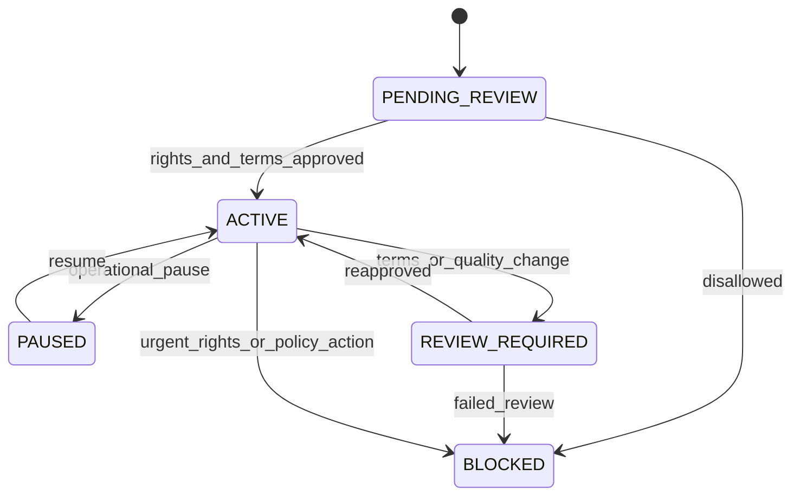
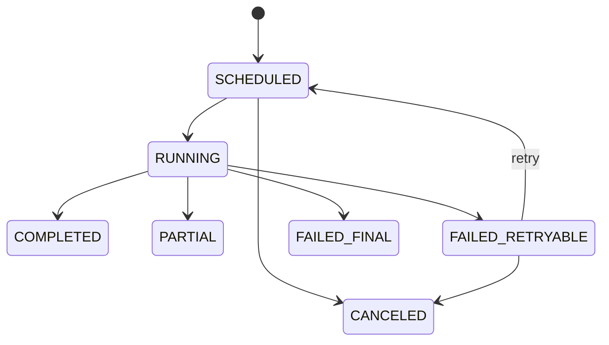
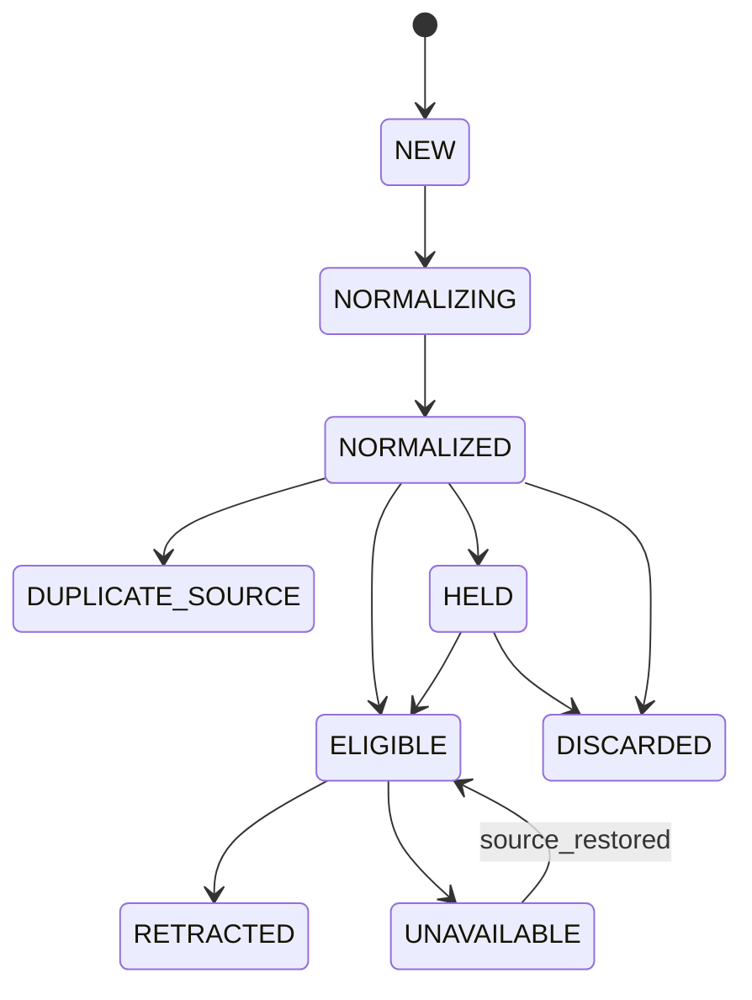
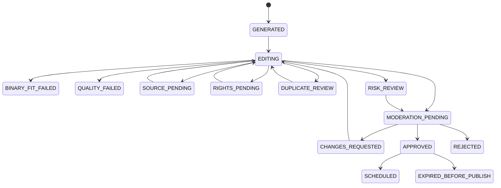
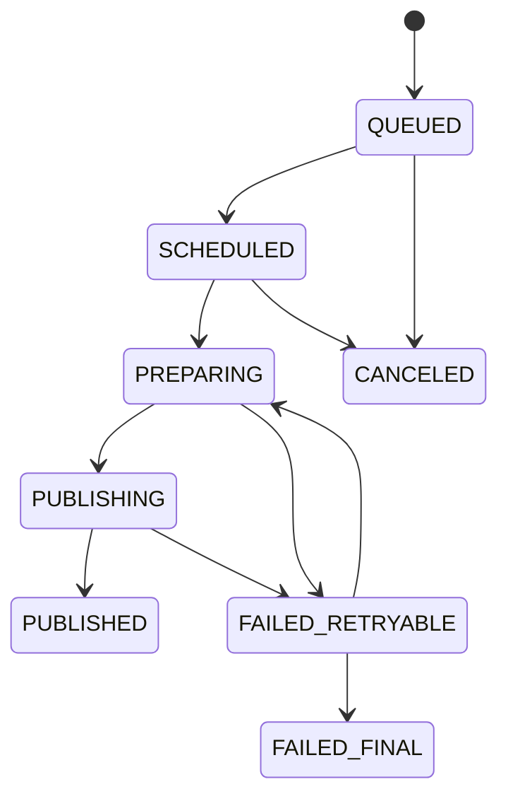
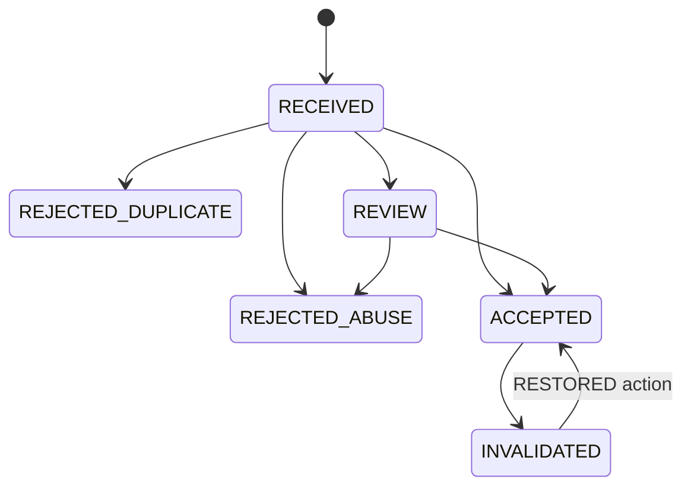
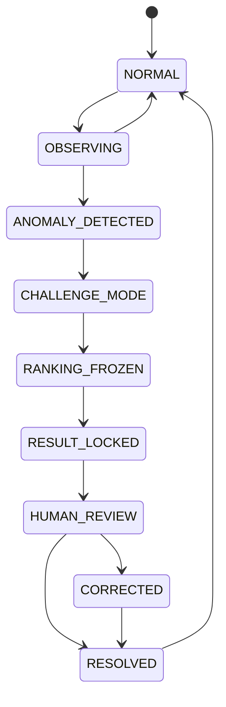
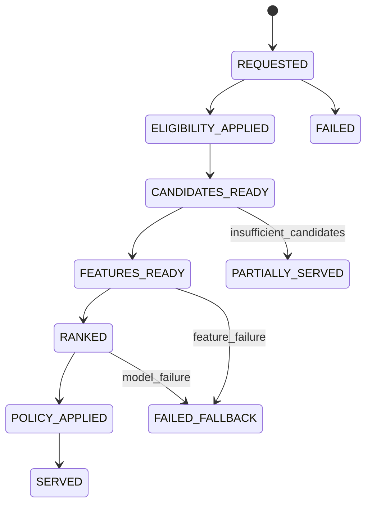
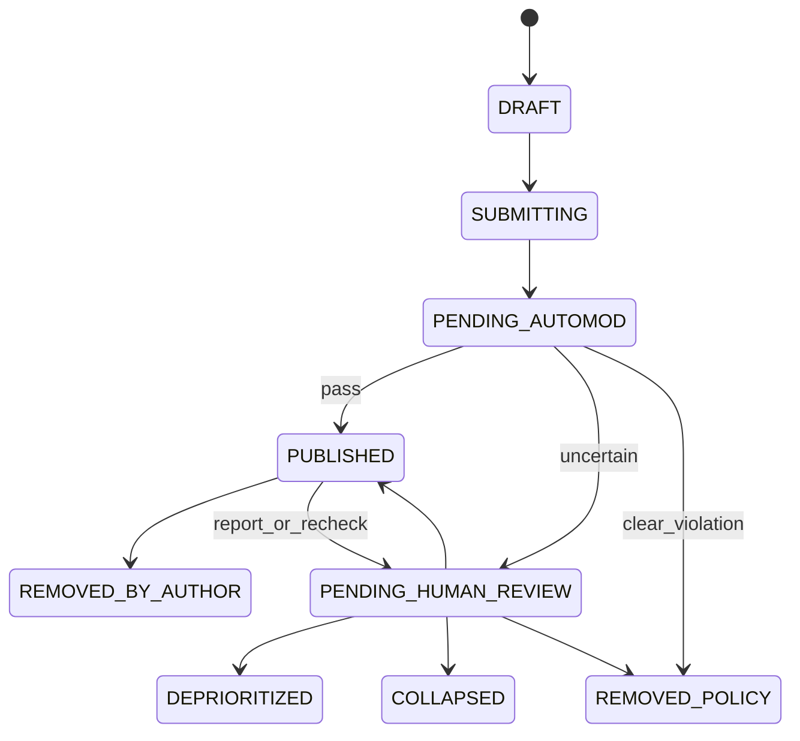
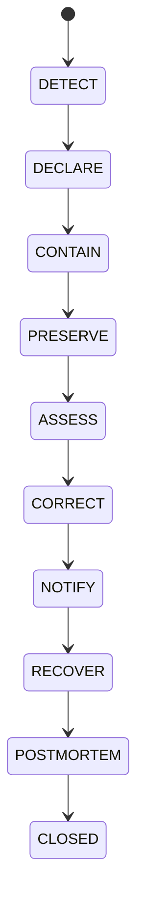

# WHICH 용어집 및 상태 모델 v2.0

- **문서 상태:** 공통 용어·상태 기준본
- **버전:** 2.0
- **기준일:** 2026-08-18
- **기준 문서:** `01`~`12` 상세 기획본
- **문서 목적:** 제품·디자인·데이터·ML·운영·정책·개발에서 같은 단어를 같은 의미로 사용하고, 객체별 상태 축·전이·불변조건·감사 요구를 정의한다.
- **핵심 사용법:** PRD, API, DB, Event, Dashboard, Admin UI에서 본 문서의 Canonical Term과 Enum을 사용한다. 상태를 추가하거나 의미를 변경할 때는 `12_DECISION_LOG_v2.md`의 Decision 또는 Open Decision을 연결한다.
- **문서 비범위:** 최종 물리 Table명, Column Type, Index, Partition, Vendor별 구현은 `WHICH Data Architecture & Database Schema v1`에서 확정한다.

## 0. 핵심 설계 원칙
| 원칙 | 규칙 |
| --- | --- |
| 상태 축 분리 | 하나의 `status`에 게시·모더레이션·투표·결과·추천 의미를 모두 넣지 않는다. |
| 코드와 표시 분리 | Enum Code는 안정적으로 유지하고 사용자 표시 문구는 번역·정책에 따라 변경 가능하게 한다. |
| 이벤트와 상태 분리 | 상태는 현재 사실, Event는 발생한 사실, Action은 수행한 조치다. |
| 불변조건 우선 | 첫 Accepted Vote 후 Issue 의미, Subject별 1 Accepted Vote 등은 UI가 아니라 Domain에서 강제한다. |
| Version 필수 | Issue, Policy, Model, Feature, Metric, Event Schema는 Version을 연결한다. |
| Append-only Audit | 중대한 상태 변경은 기존 기록을 지우지 않고 Actor·Reason·Evidence를 추가한다. |
| Fail-Closed | 정치·선거·RESTRICTED·권리·Source가 불확실하면 허용 상태로 추정하지 않는다. |
| Source of Truth | Client Event, Server Domain Event, Aggregate, ML Log의 책임을 구분한다. |
| 개인정보 최소화 | 식별자와 Risk 신호는 목적별로 분리하고 공개 객체와 혼합하지 않는다. |
| 영문 Canonical | 코드·Schema·Event는 English UPPER_SNAKE_CASE, 사용자 UI는 한국어 표시를 사용한다. |

## 0.1 상태 표기
| 표기 | 의미 |
| --- | --- |
| [확정] | 현재 기준으로 채택된 용어·불변조건 |
| [설계 기준] | 논리 모델은 채택됐으나 실제 Enum 세부 조정 가능 |
| [초기안] | MVP 구현 후보 |
| [미정] | 11번 Open Decision 필요 |
| [금지] | 사용하지 않을 용어·전이·설계 |

## 0.2 v2 주요 보강
| 영역 | v1 | v2 |
| --- | --- | --- |
| 용어 | 핵심 단어 요약 | 콘텐츠·신원·추천·소셜·운영·데이터 전체 Canonical Glossary |
| Issue 상태 | 단일 Lifecycle | Editorial, Visibility, Participation, Result, Feed Eligibility 축 분리 |
| Vote | 5개 Integrity 상태 | Request Processing, Integrity, Challenge, Aggregate 상태 분리 |
| 추천 | 요청 개념 상태 | Request, Candidate, Model Lifecycle, Fallback, Experiment Exposure 연결 |
| 소셜 | 기본 댓글 상태 | 작성 처리와 공개·모더레이션 상태, Follow·Reaction·Reputation 추가 |
| 거버넌스 | Issue·Vote 중심 | Report, Moderation Case, Enforcement, Appeal, Restore, Incident 상태 |
| 데이터 | 일부 Event 용어 | Event Source of Truth, Data Quality, Metric, Experiment 상태 |
| 불변조건 | 서술형 원칙 | 객체 간 강제 규칙과 금지 전이 Matrix |

# 1. Naming Convention
## 1.1 Code·ID·Timestamp
| 유형 | 규칙 | 예 |
| --- | --- | --- |
| Enum | UPPER_SNAKE_CASE | PENDING_HUMAN_REVIEW |
| Logical field | lower_snake_case | issue_version |
| Identifier | <object>_id | issue_id, vote_id |
| Version | <object>_version 또는 정책별 *_version | issue_version, policy_version |
| Timestamp | 행동·상태에 맞는 *_at | published_at, accepted_at |
| Boolean | is_* 또는 has_*를 제한적으로 사용 | is_test_subject |
| Count | 의미가 명확한 *_count | accepted_vote_count |
| Rate | 분자·분모가 Registry에 있는 *_rate | next_issue_rate |
| Reason | reason_code + 선택적 note | DUPLICATE_USER |
| Event | 과거형 또는 완료 사실 UPPER_SNAKE_CASE | VOTE_ACCEPTED |
| Command | 동사 원형의 Application Action | SubmitVote, PublishIssue |

## 1.2 안정적인 ID
| ID | 대상 |
| --- | --- |
| source_registry_id | 등록된 Source 채널 |
| collection_job_id | 수집 실행 |
| source_item_id | 정규화 원자료 |
| discovery_id | 발견 신호 |
| issue_candidate_id | 게시 전 질문 후보 |
| issue_id | 논리 Issue |
| issue_version | 투표 계약 Version |
| choice_id | A 또는 B Choice |
| subject_id | Guest·Member를 추상화한 참여 주체 |
| anonymous_subject_id | 현재 First-party Guest 주체 |
| user_id | Member 계정 |
| verification_id | Verification 기록 |
| vote_attempt_id | 투표 요청 재시도 단위 |
| vote_id | 투표 Domain 기록 |
| result_version | 집계 결과 Version |
| session_id | 연속 사용 세션 |
| recommendation_request_id | Feed 요청 |
| impression_id | 실제 노출 |
| event_id | 분석 Event |
| experiment_id | 실험 |
| comment_id | 댓글 |
| reaction_id | 공감 등 Reaction |
| follow_id | Creator·Topic Follow |
| report_id | 신고 |
| moderation_case_id | 검수 Case |
| appeal_id | 이의 제기 |
| incident_id | 사고 |
| audit_event_id | 감사 Event |

## 1.3 금지되는 모호한 이름
| 금지 또는 제한 | 대신 사용할 이름 | 이유 |
| --- | --- | --- |
| status | lifecycle_status, integrity_status 등 명시적 축 | 서로 다른 상태 의미 충돌 |
| count | accepted_vote_count, displayed_vote_count | 어떤 Count인지 불명확 |
| user_score | creator_reputation_band, vote_risk_score | 도덕·정치 성향 점수 오해 |
| trust_score | source_trust_class, integrity_confidence | 신뢰의 대상 불명확 |
| engagement | vote, result_view, comment_open 등 개별 Event | 분노·스팸까지 섞일 수 있음 |
| view | page_view, viewable_impression, result_view | 다운로드와 실제 노출 혼동 |
| political_score | 사용 금지 | 정치적 견해 추론 금지 |
| verified_user | verified_member + assurance_type | 무엇이 확인됐는지 불명확 |

# 2. 제품·콘텐츠 핵심 용어
| Canonical Term | 한국어 표시·설명 | 엄격한 정의 | 혼동 금지 |
| --- | --- | --- | --- |
| Issue | 이슈 | 사용자가 정확히 A/B 중 하나를 선택하는 논리 질문 단위. Published Issue와 Candidate를 구분한다. | 게시 전 Candidate, 일반 게시글 |
| Choice | 선택지 | Issue Version에 속한 두 선택지 중 하나. position은 A 또는 B다. | 사용자 임의 Side, 3개 이상 Option |
| Background | 배경 | 질문 판단에 필요한 짧고 검증 가능한 맥락. 결과와 달리 투표 전에 숨기지 않는다. | 기사 전문, 유도 설명 |
| Issue Version | 이슈 버전 | 질문·A/B 의미를 고정하는 투표 계약 Version. 첫 ACCEPTED Vote 후 핵심 의미 불변. | 단순 수정번호만 의미하는 Revision |
| First Value Moment | 첫 가치 도달 | 첫 VOTE_ACCEPTED와 첫 RESULT_VIEW가 모두 완료된 시점. | 첫 페이지뷰, 회원가입 |
| Core Consumption Loop | 핵심 소비 루프 | Vote→Result→Comment→Next Issue→Vote의 반복. | 단일 설문 완료 |
| Qualified Vote | 정상 유효 투표 | 현재 ACCEPTED이며 테스트·공격·무효화 대상이 아닌 Vote. | Vote Submit, 모든 Request |
| Issue Pool | 이슈 풀 | 추천·피드에 공급 가능한 Published·Scheduled Issue 재고. Effective Inventory와 Raw Count를 구분. | Candidate 전체 |
| Effective Active Inventory | 유효 활성 재고 | 사용자에게 실제 추천 가능한 미노출·정책 통과 Issue 수. | Published 총수 |
| Successor Issue | 후속 이슈 | 핵심 전제가 변경된 기존 Issue를 대체하는 새 Issue. 이전 집계를 합치지 않는다. | 기존 Issue Silent Edit |
| Evergreen Issue | 상시형 | 시의성이 낮아 장기간 재고로 사용할 수 있는 Issue. | 오래됐다는 이유만의 Archived |
| Current Issue | 시사형 | 현재 뉴스·정책·발표와 연결되고 유효 기간이 있는 Issue. | Trend와 동일 개념 |
| Trend Issue | 급상승 소재형 | 짧은 기간 외부 관심이 증가한 Source에서 출발한 Issue. 사실성은 별도 검증. | Trending Feed |
| Editorial Issue | 운영자 기획 | 운영자가 직접 작성·편집한 Issue. | 자동 생성 Issue |
| User-generated Issue | 사용자 제안 이슈 | Member·Creator가 제출한 Candidate. 승인 전 Published Issue가 아니다. | 즉시 공개 게시글 |
| Playful Issue | 유희형 이슈 | 낮은 인지 비용, 즉답 가능성, 결과 호기심이 있는 무해한 Issue. | 조롱·혐오·피해 유희화 |

# 3. Source·편집·공급 용어
| Canonical Term | 한국어 표시·설명 | 엄격한 정의 | 혼동 금지 |
| --- | --- | --- | --- |
| Source Registry | 출처 등록부 | 수집 가능한 도메인·계정·피드와 허용 방식·권리·운영 상태를 관리하는 객체. | Source Item |
| Discovery Record | 발견 기록 | 아직 수집·정규화되지 않은 URL·아이디어·Trend 신호. | 검증된 사실 |
| Collection Job | 수집 작업 | 허용된 방식으로 Source를 가져오는 실행 단위. | Source 자체 |
| Source Item | 원자료 항목 | 원문 전체가 아니라 URL·제목·발행자·날짜·요약·Provenance가 정규화된 내부 객체. | 사용자 투표 콘텐츠 |
| Canonical URL | 대표 URL | 동일 콘텐츠 중복 판단을 위한 정규화 URL. | 영구 접근 보장 |
| Provenance | 출처 계보 | 어디서·언제·어떤 방식·Version으로 수집·요약됐는지 기록. | Trust 평가만 |
| Source Trust Class | 출처 신뢰 등급 | OFFICIAL, PRIMARY, MEDIA 등 Source 역할을 나타내는 Class. 진실 확률이 아니다. | 단일 Trust Score |
| Source Role | 출처 역할 | 질문의 Background에서 사실, 원발언, 반론, 통계 등 어떤 역할을 하는지. | Source Class |
| Issue Candidate | 이슈 후보 | WHICH 형식으로 변환됐지만 투표 계약으로 승인되지 않은 편집 객체. | Published Issue |
| Candidate Evaluation Bundle | 후보 평가 묶음 | Binary Fit, Quality, Risk, Source, Rights, Duplicate 평가와 Version의 집합. | 최종 승인 자체 |
| Binary Fit | 이지선다 적합성 | 하나의 판단 축에 대해 A/B가 의미 있고 상호 구분되는 정도. | 질문 인기 가능성 |
| Quality Gate | 품질 게이트 | 명확성·대칭성·중립성·맥락·중복을 검사하는 게시 전 Gate. | Safety Gate |
| Hard Blocker | 강제 차단 사유 | 점수가 높아도 게시할 수 없게 하는 허위 전제·권리 미완료 등 조건. | 낮은 품질 Warning |
| Duplicate Cluster | 중복 클러스터 | 의미가 동일하거나 매우 유사한 Candidate·Issue 그룹. | Category |
| Publish Job | 게시 작업 | 승인 Candidate를 특정 Version·시간·정책으로 Published Issue로 전환하는 작업. | 승인 Decision |
| Publish Calendar | 게시 캘린더 | 승인 Candidate의 시점·카테고리 재고·Surface를 계획하는 운영 객체. | Feed Ranking |
| Correction | 정정 | Source·Background·표시의 오류를 감사 가능하게 수정하는 조치. | 질문 의미 Silent Edit |
| Archive | 보관 종료 | 신규 주요 노출·참여를 종료하되 기록과 검색 정책에 따라 보존하는 상태. | Policy Removal |

# 4. 분류·품질·유희성·논쟁 용어
| Canonical Term | 한국어 표시·설명 | 엄격한 정의 | 혼동 금지 |
| --- | --- | --- | --- |
| Primary Category | 주 카테고리 | Issue의 핵심 판단 대상이 속하는 하나의 안정 대분류. | Topic 전체 목록 |
| Subcategory | 하위 분류 | Primary Category 내부의 세부 영역. | 자유 Tag |
| Controlled Topic | 통제 주제 | 추천·분석에 사용하는 Versioned Topic Vocabulary. | 사용자 자유 입력 Tag |
| Free Tag | 자유 태그 | 탐색·편집 보조용 비통제 Tag. 핵심 정책에 단독 사용하지 않는다. | Controlled Topic |
| Entity | 개체 | 인물·기관·제품·지역·작품 등 Issue가 가리키는 식별 대상. | Topic |
| Experience Mode | 경험 모드 | PLAYFUL_QUICK, RELATABLE_DILEMMA 등 사용자가 느끼는 질문 경험. | Category |
| Lifecycle Type | 콘텐츠 수명 유형 | EVERGREEN, CURRENT, TREND, EDITORIAL, USER_GENERATED 등 공급 수명. | Issue 상태 |
| Risk Level | 위험도 | LOW, MEDIUM, HIGH, RESTRICTED. 주제와 별개로 검수·권한을 결정. | Popularity |
| Political Review | 정치성 검토 | 정치 여부가 불명확한 Candidate를 Fail-Closed로 인간 검토하는 상태. | 일반 Risk Review |
| Quality Score | 품질 점수 | 명확성·Binary Fit·대칭성·중립성·맥락 등 게시 품질. | Safety 허용 판정 |
| Playfulness Score | 유희성 점수 | 즉시 이해·관련성·결과 호기심·무해한 의외성·공유성의 평가. | 자극성 |
| Choice Parity | 선택지 대등성 | A/B의 길이·감정 강도·구체성·행위 범위가 균형인 정도. | 결과 50:50 |
| Controversy | 논쟁·접전 | 최소 Accepted 표본을 충족하고 A/B가 50:50에 가까운 상태. | 분노, 신고, 댓글 싸움 |
| Balance Score | 접전 균형 점수 | A/B 비율의 50:50 근접도. 표본·무결성은 별도 Factor. | 최종 Controversy Score |
| Controversy Score | 논쟁 점수 | Balance×Sample Confidence×Integrity×Stability×Freshness의 Eligibility·Ranking 값. | 단순 50:50 계산 |
| Source Strength | 출처 충분성 | 해당 질문의 핵심 Claim을 Source가 얼마나 지지하는지. | Publisher 유명도 |

# 5. 사용자·신원·권한 용어
| Canonical Term | 한국어 표시·설명 | 엄격한 정의 | 혼동 금지 |
| --- | --- | --- | --- |
| Subject | 참여 주체 | 추천·세션·투표에서 Guest와 Member를 추상화한 논리 주체. | 법적 사람 |
| Guest | 비회원 | 로그인하지 않았지만 anonymous_subject_id로 현재 브라우저 연속성을 갖는 사용자. | 완전 익명·추적 불가 |
| Member | 회원 | 계정을 통제하는 인증 사용 주체. 현실 인물 유일성을 의미하지 않는다. | Verified Member |
| Verified Member | 추가 확인 회원 | 특정 Assurance·Uniqueness 절차를 통과한 Member. 무엇이 확인됐는지 Type을 함께 기록. | 공식 계정, 완전 1인 1계정 |
| Creator | 이슈 작성자 역할 | Issue Candidate를 제출하거나 Published Issue를 보유한 Member 역할. | 별도 신원 등급 |
| Anonymous Subject | 익명 주체 | First-party 임의 식별자로 현재 Guest Browser 연속성을 표현. | IP Hash, Cross-site Fingerprint |
| Account Control | 계정 통제 | 로그인 수단을 현재 사용자가 통제한다는 보증. | 현실 신원 |
| Identity Verification | 본인확인 | 현실 신원 속성을 확인하는 절차. | Uniqueness 자동 보장 |
| Uniqueness Handle | 유일성 핸들 | 특정 정책 범위에서 여러 계정 중복을 제한하기 위한 Provider 파생 값. | 공개 주민식별자 |
| Assurance Level | 보증 수준 | 계정·인증·신원·유일성 보장의 강도와 범위. | 사용자 Reputation |
| Session | 세션 | 연속 사용자 활동을 분석·UX 복원 단위로 묶는 기간. | 로그인 Session과 항상 동일 |
| Authentication | 인증 | 계정 접근 권한 확인. | Authorization |
| Authorization | 인가 | 특정 기능·객체에 대한 권한 판정. | 로그인 성공 |
| Eligibility | 참여 적격성 | 사용자·Issue·Risk·정책에 따라 현재 Action을 허용할 수 있는지. | 추천 적합성만 |
| Risk-based Challenge | 위험 기반 추가 확인 | 위험 신호가 있는 요청에만 CAPTCHA·재인증 등을 적용. | 모든 Guest 일괄 CAPTCHA |
| Device Risk Token | 기기 위험 토큰 | First-party·단기 범위의 자동화·재사용 신호. | 장기 광고 Fingerprint |

# 6. 투표·결과·무결성 용어
| Canonical Term | 한국어 표시·설명 | 엄격한 정의 | 혼동 금지 |
| --- | --- | --- | --- |
| Vote Attempt | 투표 시도 | 한 번의 제출·재시도 그룹. vote_attempt_id로 Idempotency를 보장. | 정상 집계 Vote |
| Vote | 투표 기록 | 특정 Issue Version, Choice, Subject, Eligibility, Integrity Policy의 Domain 계약. | 클릭 Event |
| Vote Context Token | 투표 맥락 토큰 | 실제 Issue 노출과 Version·Session·Policy를 묶은 단기 서명 Token. | 사람 인증 |
| Idempotency Key | 멱등 키 | 동일 논리 요청 재시도 시 새 Vote를 만들지 않게 하는 Key. | Duplicate User Detection |
| Vote Request Processing State | 투표 요청 처리 상태 | RECEIVED부터 COMPLETED·FAILED까지 기술 처리 진행. | Integrity State |
| Vote Integrity State | 투표 무결성 상태 | ACCEPTED, REVIEW, REJECTED_DUPLICATE, REJECTED_ABUSE, INVALIDATED. | HTTP 응답 상태 |
| Accepted Vote | 정상 집계 표 | 현재 정책상 결과·추천에 사용할 수 있는 Vote. | 서버가 받은 모든 Vote |
| Review Vote | 검토 표 | 위험·불확실성 때문에 공개 집계에서 기본 제외하고 재평가하는 Vote. | 잠정 Accepted |
| Rejected Duplicate | 중복 제외 | 같은 정책상 Voter Subject의 중복이며 공격으로 단정하지 않는 상태. | Abuse |
| Rejected Abuse | 남용 제외 | 자동화·조작·Hard Rule로 집계하지 않는 상태. | Duplicate |
| Invalidated Vote | 사후 무효 표 | 처음 Accepted됐으나 사후 검토로 집계에서 제거된 Vote. | 삭제된 레코드 |
| Restored Vote | 복구된 표 | 무효화·Review 판단이 뒤집혀 Accepted 효과가 복원된 Action 결과. | 새로운 중복 Vote |
| Vote Aggregate | 투표 집계 | 특정 Issue Version의 Choice별 현재 유효 Count를 계산한 파생 데이터. | Source of Truth Vote Fact |
| Displayed Vote Count | 표시 참여 수 | 현재 공개 결과 정책이 사용자에게 보여주는 Count. | 모든 Request 수 |
| Result Version | 결과 버전 | 어떤 Vote 상태와 집계 시점으로 결과가 만들어졌는지 식별. | Issue Version |
| Vote Integrity | 투표 무결성 | 중복·자동화·다중계정·Brigading을 탐지·제어·복구하는 체계. | 대표 표본 품질 |
| Brigading | 좌표찍기 | 외부 집단이 특정 Issue·Choice·신고에 조직적으로 집중하는 행동. | 정상 바이럴 |
| Vote Velocity | 투표 속도 | 시간당 Accepted·Attempt 증가 속도. 단독으로 Abuse 판정하지 않는다. | Popularity Score |
| Integrity Factor | 무결성 계수 | Issue·Vote의 현재 신뢰도를 Ranking·논쟁 Eligibility에 반영하는 값. | 사용자 정치 성향 |
| Result Lock | 결과 잠금 | 이상·법률·검토 중 공개 A/B 비율을 일시 표시하지 않는 조치. | Vote 삭제 |

# 7. 관심사·개인화 용어
| Canonical Term | 한국어 표시·설명 | 엄격한 정의 | 혼동 금지 |
| --- | --- | --- | --- |
| Interest Card | 관심사 카드 | 온보딩에서 사용자가 선택하는 이해하기 쉬운 주제 묶음. 내부 Taxonomy와 Mapping. | Category Code 자체 |
| Explicit Interest | 명시 관심 | 온보딩·설정·Topic Follow로 사용자가 직접 표현한 관심. | 행동 추론 |
| Inferred Interest | 추론 관심 | Vote·Comment Open·Share 등 정상 행동에서 추론한 관심. | 사용자 명시 설정 |
| Session Interest | 세션 관심 | 현재 세션에서만 일시적으로 강해진 Topic 관심. | 장기 Profile |
| Negative Preference | 부정 선호 | 관심 없음·덜 보기·Block처럼 사용자가 명시한 감소·제외 신호. | Report |
| Interest Profile | 관심 프로필 | 명시·추론·세션·부정 신호와 Confidence·Version의 집합. | 정치 성향 Profile |
| Cold Start | 초기 데이터 부족 | 신규 Subject·Issue에 행동 이력이 없어 관심사·콘텐츠 Feature를 사용하는 상태. | 시스템 장애 |
| Exploration | 탐색 노출 | 아직 확신이 낮은 안전한 Issue를 의도적으로 보여주는 정책. | 무작위 무제한 노출 |
| Personalization Reset | 추천 재설정 | 추론 Profile·Cache를 초기화하는 사용자 Action. | 투표 기록 삭제 |
| Interest Merge | 관심사 병합 | Guest 관심과 Member 관심을 사용자 확인으로 합치는 과정. | 자동 덮어쓰기 |
| Topic Less | 이 주제 덜 보기 | 유사 Topic의 개인 추천 가중치를 강하게 낮추는 명시적 신호. | 정책 신고 |
| Not Interested | 관심 없음 | 현재 Issue·유사 콘텐츠의 개인 추천을 줄이는 신호. | 전역 품질 하락 Vote |

# 8. 추천·ML 용어
| Canonical Term | 한국어 표시·설명 | 엄격한 정의 | 혼동 금지 |
| --- | --- | --- | --- |
| Surface | 추천 화면 위치 | FOR_YOU, NEXT_ISSUE, POPULAR 등 서로 다른 추천 목적의 Context. | 페이지 URL만 |
| Eligibility Gate | 노출 적격 Gate | 모더레이션·Risk·Block·Seen·정치 정책으로 Rank 전 후보를 제한. | Rank Score Threshold |
| Candidate Retrieval | 후보 검색 | 전체 Catalog에서 Rank 대상 Issue를 Source별로 좁히는 단계. | 최종 추천 |
| Candidate Source | 후보 출처 | INTEREST, SEMANTIC, TRENDING, EXPLORATION 등 후보가 온 경로. | 콘텐츠 Source Item |
| Feature Hydration | 피처 결합 | User, Issue, Context, Integrity Feature를 Candidate에 연결. | 학습 |
| Stage-1 Ranking | 1차 랭킹 | 저비용 Score로 많은 후보를 줄이는 단계. | Retrieval |
| Stage-2 Ranking | 2차 랭킹 | 개인별 다목적 예측을 사용한 정밀 Rank. MVP에서는 선택적. | Policy Re-ranking |
| Policy Re-ranking | 정책 재정렬 | 다양성·중복·유희성·안전·정치·무결성으로 Slate를 조정. | 모델 학습 |
| Slate | 추천 목록 | 한 요청에서 순서가 있는 최종 Issue 집합. | 단일 Candidate |
| ML v0 | 초기 콘텐츠 기반 추천 | Embedding·Interest·Quality·Freshness·Playfulness 기반, 학습 Ranker 의존 없음. | 순수 규칙 추천 |
| ML v1 | 초기 학습 Ranker | 실제 Impression과 Accepted Label로 학습하는 경량 Ranker. | 딥러닝 필수 |
| Embedding | 임베딩 | 질문·A/B·Background·Topic의 의미 Vector. | Category ID |
| User Feature | 사용자 피처 | 관심·행동·활동·Context의 모델 입력. 정치 Choice 방향 제외. | 원본 보안 로그 |
| Issue Feature | 이슈 피처 | Embedding, Category, Quality, Playfulness, Freshness, Integrity 등. | 공개 결과만 |
| Interaction Feature | 상호작용 피처 | User와 Issue 관계, 최근 유사 노출·Skip·Affinity. | 전역 Issue 품질 |
| Viewable Impression | 실제 노출 | 승인된 화면 비율·시간·Foreground 조건을 충족한 Issue 노출. | Prefetch, API Serve |
| Prefetch | 사전 로드 | 다음 후보를 화면 전에 다운로드하는 기술 동작. Impression 아님. | 노출 |
| Recommendation Request | 추천 요청 | Subject·Session·Surface·Context에 대한 Feed 생성 단위. | Page View |
| Safe Fallback | 안전 대체 피드 | 모델·Feature 장애 시 정책 통과 Editorial·Popular Feed. | 정책 우회 |
| Model Version | 모델 버전 | Inference 결과를 만든 학습 Artifact Version. | Feature Version |
| Feature Version | 피처 버전 | 동일 Feature의 계산 정의·Schema Version. | Data Timestamp |
| Policy Version | 정책 버전 | Eligibility·Re-ranking·노출 제한을 적용한 규칙 Version. | Model Version |
| Calibration | 보정 | 예측 확률과 실제 발생률의 일치 정도. | Ranking 순서만 |
| Contextual Bandit | 문맥적 밴딧 | Exploration과 Reward로 정책을 순차 개선하는 후속 모델. | MVP 필수 |

# 9. 소셜·댓글·Creator 용어
| Canonical Term | 한국어 표시·설명 | 엄격한 정의 | 혼동 금지 |
| --- | --- | --- | --- |
| Profile | 프로필 | Member의 공개·비공개 표현 객체. 공개 필드는 최소화. | 계정 전체 데이터 |
| Creator Profile | 작성자 프로필 | 작성 Issue·Topic·성과를 중심으로 Creator를 발견하는 공개 Profile. | 일상 SNS 타임라인 |
| Private Vote History | 비공개 투표 기록 | 본인만 볼 수 있는 Issue별 선택 기록. | 공개 Activity Feed |
| Comment | 댓글 | 특정 Issue의 선택 이유를 설명하는 Member 콘텐츠. | 독립 게시판 글 |
| Comment Side | 댓글 A/B | 해당 Issue의 Accepted Vote Choice에서 서버 파생한 Side. | 사용자 입력 Tag |
| Reply | 답글 | Comment Thread 내부 반응. MVP Depth는 제한. | DM |
| Reaction | 반응 | Comment에 대한 HELPFUL 등 제한 Action. | Vote |
| Helpful | 공감 | MVP의 단일 긍정 Reaction. 정책 위반 판단이 아니다. | Like 기반 품질 확정 |
| Creator Follow | 작성자 팔로우 | 그 사람이 만드는 질문을 다시 보기 위한 관계. | 의견 동조 관계 |
| Topic Follow | 주제 팔로우 | 명시적 Topic 관심 관계. | 정치 입장 Follow |
| Block | 차단 | 특정 사용자의 콘텐츠·상호작용을 개인적으로 제한하는 안전 Action. | Report |
| Mute | 뮤트 | Follow를 유지하면서 알림·노출을 줄이는 개인 설정. | 정책 제재 |
| Hide | 숨기기 | 특정 콘텐츠를 개인 화면에서 제거하는 Action. | 전역 Remove |
| Creator Reputation | 작성자 평판 | 품질·준수·독창성·안전의 내부 다축 운영 신호. | 공개 도덕 점수 |
| Reputation Band | 평판 구간 | NEW, STANDARD 등 운영 적용을 위한 Band. | Follower Count |
| Badge | 배지 | 품질·성과 Milestone의 비금전 공개 보상. | 정책 면제 |
| Opinion Graph | 의견 진영 그래프 | A/B 선택 방향으로 사람을 연결하는 구조. WHICH에서 금지. | Topic Follow |

# 10. 모더레이션·거버넌스 용어
| Canonical Term | 한국어 표시·설명 | 엄격한 정의 | 혼동 금지 |
| --- | --- | --- | --- |
| Report | 신고 | 사용자가 정책 위반 가능성을 운영자에게 전달하는 Claim. | 관심 없음, 자동 판결 |
| Report Cluster | 신고 클러스터 | 동일 Target·Campaign·Pattern의 신고 묶음. 조직적 신고 분석에 사용. | 하나의 유효 신고 |
| Moderation Case | 모더레이션 사건 | 하나 이상의 Target·Report·Evidence를 검토하는 운영 작업 단위. | 콘텐츠 상태 자체 |
| Policy Domain | 정책 영역 | HATE, HARASSMENT, PRIVACY 등 위반 유형. | Reason Code |
| Reason Code | 사유 코드 | 특정 Action과 Decision의 표준화된 이유. | 자유 메모만 |
| Severity | 심각도 | 피해 강도. | Confidence |
| Confidence | 확신도 | 판정이 맞을 가능성 또는 증거 충분성. | Severity |
| Reach | 도달 규모 | 노출·공유·참여 규모. | 정책 위반 여부 |
| Enforcement | 집행 | Visibility, Feature, Account, Result에 적용하는 조치. | 정책 분류 |
| Deprioritize | 노출 축소 | 콘텐츠를 삭제하지 않고 Ranking Priority를 낮추는 조치. | 개인 Hide |
| Collapse | 접기 | 본문을 기본 접고 사용자가 열 수 있게 하는 공개 상태. | Remove |
| Remove | 정책 제거 | 공개 접근을 중단하는 전역 조치. | Archive |
| User Notice | 사용자 통지 | 무엇이 왜 조치됐는지와 Appeal 경로를 설명하는 기록·메시지. | 내부 Audit |
| Appeal | 이의 제기 | 사용자가 조치의 재검토를 요청하는 정식 절차. | 일반 고객 문의 |
| Restore | 복구 | 오판 인용 시 콘텐츠·Count·Feature·Reputation·Label을 원상화하는 Action. | 단순 Visibility 변경 |
| Audit Event | 감사 이벤트 | Actor, Before, After, Reason, Evidence, Version을 Append-only로 기록. | 일반 Application Log |
| Evidence Snapshot | 증거 스냅샷 | 판정 당시 콘텐츠·Source·Event·Version의 재현 가능한 묶음. | 무제한 개인정보 복제 |
| Incident | 사고 | 일반 Queue를 넘어 다중 시스템·대규모 피해 대응이 필요한 사건. | 모든 신고 |
| Ranking Freeze | 랭킹 동결 | 이상 Issue의 인기·논쟁·추천 상승을 일시 중지하는 조치. | Issue Remove |
| Thread Lock | 댓글 잠금 | 기존 댓글은 유지하고 신규 댓글·답글을 중단. | 댓글 전체 삭제 |
| Legal Hold | 법적 보존 | 법률상 필요로 일반 삭제·보존정책을 일시 중지하는 상태. | 영구 보존 |
| Political | 정치 | 정부·정당·정치인·의회·외교·안보와 직접 연결된 Governance Domain. | Election과 동일 |
| Election | 선거 | 후보·정당 지지, 당선 예측, 모의투표 등 선거에 직접 영향을 줄 수 있는 Domain. | 일반 Public Policy |
| Election Mode | 선거 특별 운영 모드 | 법률·정책에 따라 게시·공유·결과·댓글을 강화 제한하는 상태. | 일반 Risk Level |

# 11. 지표·실험·데이터 용어
| Canonical Term | 한국어 표시·설명 | 엄격한 정의 | 혼동 금지 |
| --- | --- | --- | --- |
| Page View | 페이지 조회 | 페이지 Route가 열렸다는 Client 사실. | Issue Impression |
| Viewable Impression | 실노출 | 실제 노출 조건을 충족한 Issue Event. | Serve·Prefetch |
| Result View | 결과 조회 | 결과 영역이 실제 사용자에게 표시된 Event. | Result API 성공 |
| Skip | 건너뛰기 | 투표하지 않고 다른 Issue로 이동. | Next Issue |
| Next Issue | 다음 이슈 이동 | Vote와 Result 이후 사용자가 다음 Issue로 이동. | 자동 이동, Skip |
| Qualified Session | 정상 세션 | 봇·테스트·공격 등을 제외하고 분석 가능한 Session. | 모든 Session |
| Qualified Votes per Session | 세션당 정상 투표 | Qualified Vote 수를 Qualified Session으로 나눈 공동 North Star. | Vote Request/Session |
| Next Issue Rate | 다음 이슈 전환율 | Result 이후 Next Opportunity 중 실제 Next 이동 비율. | Feed Depth |
| Entry Source | 진입 출처 | External SNS, Search, Share, Home 등 세션 시작 Context. | Candidate Source |
| Metric Registry | 지표 등록부 | 분자·분모·제외·Owner·SQL·Version을 관리하는 논리 객체. | Dashboard 이름 |
| Guardrail | 안전 지표 | Primary 개선과 함께 악화를 금지하는 Guest·Safety·Integrity·Privacy 지표. | Secondary KPI |
| Experiment Assignment | 실험 할당 | Subject·Issue 등 Randomization Unit을 Variant에 안정적으로 배정. | 실제 Exposure |
| Experiment Exposure | 실험 노출 | 할당 후 실제 Variant 기능을 경험한 Event. | Assignment |
| Sample Ratio Mismatch | 표본 비율 불일치 | 예상 Variant 할당과 실제 수가 통계적으로 불일치하는 데이터 문제. | 성과 차이 |
| Provisional Data | 잠정 데이터 | Late Event·Invalidation·Backfill 전 변경 가능한 지표 상태. | 오류 데이터 |
| Final Data | 확정 데이터 | 정의된 지연·검증 후 해당 Version에서 고정된 지표 상태. | 영구 불변 |
| Backfill | 재처리 | 과거 Event·Logic을 사용해 Fact·Metric를 다시 계산. | 수동 숫자 수정 |
| Reconciliation | 대사 | Server Fact, Aggregate, Client Event의 수량·관계를 검증하는 과정. | 단순 합계 |
| Data Lineage | 데이터 계보 | 원 Event부터 Fact·Feature·Metric까지 변환 관계. | Source Provenance만 |

# 12. Release·운영 용어
| Canonical Term | 한국어 표시·설명 | 엄격한 정의 | 혼동 금지 |
| --- | --- | --- | --- |
| Release | 릴리스 | 정의된 사용자 범위에 기능을 공개하는 단계. | Deploy |
| Deploy | 배포 | 코드·Config를 환경에 반영하는 기술 행위. | Feature 공개 |
| Feature Flag | 기능 플래그 | Deploy와 Release를 분리하는 Runtime 정책. | Experiment Variant |
| Safe Fallback | 안전 대체 | 기능 장애 시 정책을 유지한 단순 경로. | 모든 제한 해제 |
| Rollback | 롤백 | 모델·코드·정책을 이전 승인 Version으로 되돌리는 조치. | 데이터 Restore |
| Launch Gate | 출시 게이트 | Release 승격 전 반드시 통과해야 하는 검증 목록. | 일반 Checklist |
| No-Go | 출시 금지 조건 | 하나라도 존재하면 Release하지 않는 핵심 위반. | 낮은 Priority Bug |
| Runbook | 운영 절차서 | Alert·Incident·Queue 상황별 반복 가능한 대응 절차. | 설명 문서만 |
| On-call | 비상 담당 | 정의된 기간 Incident 대응 책임을 지는 역할. | 모든 운영자 |
| SEV | 사고 심각도 | SEV-1~4 영향 등급. | Issue Risk Level |
| Dry Run | 사전 모의 실행 | 실제 권한·도구·절차로 사고·출시 흐름을 연습. | 문서 읽기 |
| Break-glass | 긴급 권한 | 비상 시 제한적으로 사용하는 고권한 접근. 사후 Audit 필수. | 상시 Admin 권한 |
| RACI | 역할 책임 표 | Responsible, Accountable, Consulted, Informed 관계. | 권한 모델 자체 |

# 13. 상태 모델 공통 규칙
## 13.1 하나의 객체에 여러 상태 축을 둔다
예를 들어 Published Issue에 `status=PUBLISHED`만 저장하면 다음 질문에 답할 수 없다.

- 공개적으로 보이는가
- 신규 Vote를 받을 수 있는가
- 결과를 보여줄 수 있는가
- 추천 Feed에 들어갈 수 있는가
- 모더레이션 검토 중인가
- Source 정정이 필요한가

따라서 논리적으로 다음처럼 독립 축을 사용한다.
| 상태 축 | 예 |
| --- | --- |
| lifecycle_status | PUBLISHED, CLOSED, ARCHIVED |
| visibility_status | VISIBLE, LIMITED, SUSPENDED, REMOVED |
| participation_status | VOTING_OPEN, VOTING_CLOSED, VOTING_SUSPENDED |
| result_status | RESULT_VISIBLE, RESULT_LOCKED |
| feed_eligibility_status | ELIGIBLE, DEPRIORITIZED, EXCLUDED |
| moderation_status | CLEAR, UNDER_REVIEW, ACTIONED |
| integrity_status | NORMAL, ANOMALY_DETECTED, CHALLENGE_MODE |

## 13.2 상태·Action·Event 예
| 구분 | 예 | 의미 |
| --- | --- | --- |
| State | Vote Integrity = INVALIDATED | 현재 유효 상태 |
| Action | RESTORED | 운영자가 수행한 조치 |
| Event | VOTE_RESTORED | 조치가 발생했다는 사실 |
| Reason | FALSE_POSITIVE_REVIEW | 왜 조치했는지 |
| Policy Version | integrity_policy_v3 | 어떤 규칙으로 판단했는지 |

## 13.3 전이 필수 필드
- `target_type·target_id`
- `from_state·to_state`
- `action`
- `actor_type·actor_id`
- `reason_code`
- `policy_version`
- `evidence_snapshot_id`
- `occurred_at`
- `correlation_id`
- `approval_chain`
- `rollback_or_restore_reference`

## 13.4 금지되는 상태 처리
- **[금지]** 상태 값을 물리 삭제해 과거 판정을 잃는 것
- **[금지]** REMOVED와 ARCHIVED를 같은 상태로 사용하는 것
- **[금지]** FAILED와 REJECTED를 같은 의미로 사용하는 것
- **[금지]** REVIEW를 임시 ACCEPTED로 집계하는 것
- **[금지]** Client UI 상태를 Server Domain 상태로 그대로 저장하는 것
- **[금지]** Appeal 인용 시 기존 Action을 삭제하는 것
- **[금지]** 모델 Score만으로 State를 변경하고 Policy Version을 남기지 않는 것

# 14. Source Registry 상태 모델
| State | 의미 | 신규 수집 | 기존 Lineage |
| --- | --- | --- | --- |
| PENDING_REVIEW | 약관·권리·방식 검토 전 | 불가 | 유지 |
| ACTIVE | 승인 방식으로 수집 가능 | 가능 | 유지 |
| PAUSED | 일시 운영 중지 | 불가 | 유지 |
| REVIEW_REQUIRED | 변경·문제로 재검토 필요 | 불가 | 유지 |
| BLOCKED | 신규 수집 금지 | 불가 | 유지·필요 시 Incident |


## 14.1 불변조건
- ACTIVE만 신규 자동·반자동 Collection Job의 Source가 될 수 있다.
- BLOCKED 전환은 기존 Source Item과 Published Issue를 자동 삭제하지 않고 영향 평가를 생성한다.
- REVIEW_REQUIRED에서 수집을 재개하려면 명시적 승인 Event가 필요하다.

# 15. Collection Job 상태 모델
| State | 의미 | Terminal |
| --- | --- | --- |
| SCHEDULED | 실행 대기 | 아니오 |
| RUNNING | 수집 실행 중 | 아니오 |
| PARTIAL | 일부 성공·일부 실패 | 예 또는 재시도 |
| COMPLETED | 정상 완료 | 예 |
| FAILED_RETRYABLE | 재시도 가능한 실패 | 아니오 |
| FAILED_FINAL | 최종 실패 | 예 |
| CANCELED | 운영 취소 | 예 |


# 16. Source Item 상태 모델
| State | 의미 | Candidate 생성 |
| --- | --- | --- |
| NEW | 수집 직후 | 불가 |
| NORMALIZING | 정규화 중 | 불가 |
| NORMALIZED | 메타데이터·Provenance 준비 | 대기 |
| DUPLICATE_SOURCE | 기존 Source Item 중복 | 기본 불가 |
| ELIGIBLE | 후보 추출 가능 | 가능 |
| HELD | 권리·사실·Source 검토 대기 | 불가 |
| DISCARDED | WHICH에 부적합 | 불가 |
| RETRACTED | 원출처 철회·중대 정정 | 신규 불가·영향 평가 |
| UNAVAILABLE | 접근 불가 | 정책에 따라 |


## 16.1 전이 Side Effect
| 전이 | 필수 Side Effect |
| --- | --- |
| ELIGIBLE→RETRACTED | 연결 Candidate·Published Issue Impact Case 생성 |
| ELIGIBLE→UNAVAILABLE | 기존 Snapshot·권리 정책 확인 |
| NORMALIZED→DUPLICATE_SOURCE | canonical_of 또는 duplicate_of 연결 |
| HELD→ELIGIBLE | Reviewer·Reason·Source Version Audit |

# 17. Issue Candidate 상태 모델
| State | 의미 |
| --- | --- |
| GENERATED | AI·운영자 초안 생성 |
| EDITING | 편집 중 |
| BINARY_FIT_FAILED | 이지선다 부적합 |
| QUALITY_FAILED | 품질 Hard Gate 실패 |
| SOURCE_PENDING | 출처 보강 대기 |
| RIGHTS_PENDING | 권리 검토 대기 |
| DUPLICATE_REVIEW | 중복 검토 |
| RISK_REVIEW | 위험 분류 검토 |
| MODERATION_PENDING | 정책 검수 대기 |
| CHANGES_REQUESTED | 작성자·편집자 수정 요청 |
| APPROVED | 게시 승인 |
| SCHEDULED | Publish Job 연결 |
| REJECTED | 게시 거절 |
| EXPIRED_BEFORE_PUBLISH | 게시 전에 시의성 만료 |


## 17.1 Candidate 불변조건
- APPROVED는 Evaluation Bundle과 Human Decision을 가진다.
- RESTRICTED Candidate는 일반 Editorial 승인만으로 APPROVED가 될 수 없다.
- REJECTED Candidate를 게시하려면 새 Revision과 재검토가 필요하다.
- Candidate의 proposed Choice는 Published Choice와 동일 객체가 아니다.

# 18. Publish Job 상태 모델
| State | 의미 |
| --- | --- |
| QUEUED | 승인 후 게시 Queue |
| SCHEDULED | 게시 시각 확정 |
| PREPARING | Embedding·Feature·URL·Policy 준비 |
| PUBLISHING | 원자적 게시 처리 |
| PUBLISHED | Published Issue 생성 완료 |
| FAILED_RETRYABLE | 재시도 가능 |
| FAILED_FINAL | 수동 개입 필요 |
| CANCELED | 게시 취소 |


# 19. Published Issue 상태 축
## 19.1 Editorial Lifecycle
| State | 의미 |
| --- | --- |
| PUBLISHED | 공개 계약 생성·기본 사용 가능 |
| CLOSED | 신규 Vote 종료, 기록 유지 |
| ARCHIVED | 활성 공급 종료·보관 |
| RETIRED | 시스템상 더 이상 활성 운영하지 않음 |

## 19.2 Visibility
| State | 사용자 접근 | 검색·링크 |
| --- | --- | --- |
| VISIBLE | 정상 표시 | 정책상 허용 |
| LIMITED | 라벨·노출·기능 일부 제한 | 제한 |
| UNDER_REVIEW | 검토 문구 또는 제한 상태 | 정책별 |
| SUSPENDED | 임시 공개 중지 | 기본 비노출 |
| REMOVED | 정책·법률 제거 | 비노출 또는 Notice |

## 19.3 Participation
| State | 신규 Vote | 댓글 |
| --- | --- | --- |
| VOTING_OPEN | 허용 | 별도 Comment 상태 |
| VOTING_CHALLENGED | Challenge 통과 시 | 별도 |
| VOTING_SUSPENDED | 불가 | 별도 Lock 가능 |
| VOTING_CLOSED | 불가 | 정책별 읽기만 |

## 19.4 Result Visibility
| State | 의미 |
| --- | --- |
| PRE_VOTE_HIDDEN | 투표 전 정확한 결과 숨김 |
| RESULT_VISIBLE | 적격 사용자에게 집계 표시 |
| RESULT_LOCKED | 이상·법률·검토로 비율 일시 숨김 |
| RESULT_DEGRADED | 일부 집계 지연·오류 표시 |
| RESULT_UNAVAILABLE | 결과 제공 불가 |

## 19.5 Feed Eligibility
| State | 의미 |
| --- | --- |
| ELIGIBLE | 해당 Surface Candidate 가능 |
| DEPRIORITIZED | 노출 점수·빈도 축소 |
| EXCLUDED | 해당 Surface에서 제외 |
| FROZEN | 현재 Rank·급상승 승격 중단 |

## 19.6 상태 조합 예
| 상황 | Lifecycle | Visibility | Participation | Result | Feed |
| --- | --- | --- | --- | --- | --- |
| 정상 활성 | PUBLISHED | VISIBLE | VOTING_OPEN | PRE_VOTE_HIDDEN/RESULT_VISIBLE | ELIGIBLE |
| Source 정정 검토 | PUBLISHED | UNDER_REVIEW | VOTING_SUSPENDED | RESULT_LOCKED | FROZEN |
| 투표 종료 | CLOSED | VISIBLE | VOTING_CLOSED | RESULT_VISIBLE | EXCLUDED 또는 제한 |
| 정책 제거 | PUBLISHED 또는 CLOSED | REMOVED | VOTING_CLOSED | RESULT_UNAVAILABLE | EXCLUDED |
| 과거 보관 | ARCHIVED | VISIBLE 또는 LIMITED | VOTING_CLOSED | RESULT_VISIBLE | EXCLUDED |

## 19.7 Issue 의미 잠금
- **[확정]** 첫 ACCEPTED Vote Transaction과 함께 issue_version.locked_at을 확정한다.
- **[확정]** 잠금 후 질문·Choice 의미·A/B position 변경을 금지한다.
- **[확정]** 물질적 변경은 Successor Issue를 생성한다.
- **[확정]** 오탈자·Source 링크 수정도 Revision·Audit를 남긴다.

# 20. Issue UI 상태 모델
| UI State | 표시 목적 |
| --- | --- |
| LOADING | Issue·Policy·Subject 상태 로드 |
| PRE_VOTE | 투표 가능 질문 표시 |
| SELECTION_READY | A/B 선택 후 제출 전 |
| SUBMITTING | 투표 요청 중 |
| CHALLENGE_REQUIRED | 추가 확인 필요 |
| RESULT_PENDING | Vote 성공·결과 계산 대기 |
| RESULT | 결과 표시 |
| ALREADY_VOTED | 현재 Subject 기존 Vote 결과 |
| AUTH_REQUIRED | Member 기능 인증 필요 |
| VERIFICATION_REQUIRED | 고위험 기능 추가 확인 |
| RATE_LIMITED | 일시 제한 |
| CLOSED | 신규 투표 종료 |
| LIMITED | 일부 기능 제한 |
| UNDER_REVIEW | Issue 검토 |
| RESULT_LOCKED | 결과 잠금 |
| REMOVED | Issue 제거 |
| OFFLINE | 네트워크 없음 |
| ERROR | 복구 가능한 일반 오류 |

## 20.1 UI State 규칙
- UI State는 Server Domain 상태를 조합한 표현이며 영구 Source of Truth가 아니다.
- SUBMITTING 중 Choice를 이중 제출하지 않는다.
- RESULT는 VOTE_ACCEPTED와 RESULT_VIEW를 구분해 Event한다.
- AUTH_REQUIRED 후 취소하면 원래 Issue와 Draft로 복귀한다.

# 21. Vote 상태 모델
## 21.1 Vote Request Processing State
| State | 의미 |
| --- | --- |
| RECEIVED | 서버 요청 수신 |
| VALIDATING | Context·Eligibility·Idempotency 검사 |
| CHALLENGE_REQUIRED | 추가 확인 필요 |
| CHALLENGE_PASSED | 추가 확인 통과 |
| PROCESSING | Transaction·Risk 처리 |
| COMPLETED | 응답 가능한 종료 |
| FAILED_RETRYABLE | 동일 Attempt 재시도 가능 |
| FAILED_FINAL | 최종 처리 실패 |

## 21.2 Vote Integrity State
| State | 공개 집계 | 학습 Label | 설명 |
| --- | --- | --- | --- |
| ACCEPTED | 포함 | 긍정 가능 | 정상 유효 |
| REVIEW | 제외 | 보류 | 재평가 대기 |
| REJECTED_DUPLICATE | 제외 | 제외 | 동일 주체 중복 |
| REJECTED_ABUSE | 제외 | 제외·공격 자료 격리 | 남용 확인 |
| INVALIDATED | 제거 | 제거·Backfill | 사후 무효 |

## 21.3 Vote Action
| Action | 의미 |
| --- | --- |
| RESTORED | 기존 Vote 효력을 Accepted로 복구 |
| MERGED | Guest·Member 중복 기록을 하나의 효력으로 병합 |
| RECLASSIFIED | Review·Reason 판단 변경 |
| AGGREGATE_REBUILT | 파생 집계를 재계산 |


## 21.4 Vote 불변조건
- [ ] Vote는 issue_id와 issue_version을 모두 참조한다.
- [ ] Choice는 해당 issue_version에 속한다.
- [ ] 정책상 voter_subject_key별 ACCEPTED Vote는 최대 하나다.
- [ ] 동일 Idempotency Key는 동일 결과를 반환한다.
- [ ] REVIEW·INVALIDATED는 displayed count에 포함하지 않는다.
- [ ] Vote record를 물리 삭제해 Audit를 잃지 않는다.
- [ ] A/B 방향을 abuse 판단의 단독 Feature로 사용하지 않는다.

# 22. Challenge·Issue Integrity 상태
## 22.1 Challenge
| State | 의미 |
| --- | --- |
| NOT_REQUIRED | 추가 확인 없음 |
| ISSUED | Challenge 발급 |
| PASSED | 통과 |
| FAILED | 실패 |
| EXPIRED | 시간 만료 |
| BYPASSED_ACCESSIBILITY | 승인된 접근성 대안 통과 |

## 22.2 Issue Integrity Incident State
| State | 의미 |
| --- | --- |
| NORMAL | 이상 없음 |
| OBSERVING | 신호 관찰 |
| ANOMALY_DETECTED | 이상 확인 |
| CHALLENGE_MODE | 신규 요청 강화 |
| RANKING_FROZEN | 인기·논쟁·추천 승격 동결 |
| RESULT_LOCKED | 공개 결과 잠금 |
| HUMAN_REVIEW | 인간 검토 |
| CORRECTED | 이상 표 분리·결과 정정 |
| RESOLVED | 정상 운영 복귀 |


# 23. Account·Verification 상태
## 23.1 Account Lifecycle
| State | 로그인 | 읽기 | 쓰기 |
| --- | --- | --- | --- |
| ACTIVE | 가능 | 가능 | 권한상 가능 |
| LIMITED | 가능 | 가능 | 일부 제한 |
| READ_ONLY | 가능 | 가능 | 불가 |
| SUSPENDED | 제한 | 공개 콘텐츠 정책별 | 불가 |
| CLOSED | 불가 | 공개 객체만 | 불가 |
| DELETED | 불가 | 익명화·정책별 | 불가 |

## 23.2 Verification
| State | 의미 |
| --- | --- |
| UNVERIFIED | 추가 확인 없음 |
| PENDING | 절차 진행 |
| VERIFIED | 정의된 Assurance 통과 |
| EXPIRED | 유효 기간 종료 |
| REVOKED | 부정·정책으로 취소 |
| FAILED | 검증 실패 |
| APPEAL_PENDING | 실패·취소 이의 제기 |

## 23.3 Account Risk Action State
| State | 의미 |
| --- | --- |
| OBSERVE | 추가 관찰 |
| CHALLENGE_REQUIRED | 고위험 Action 추가 확인 |
| HIGH_RISK_ACTION_BLOCKED | 특정 Action 차단 |
| VOTE_REVIEW | Vote 강화 검토 |
| TEMPORARY_RESTRICTION | 일시 기능 제한 |
| ACCOUNT_SUSPENDED | 계정 정지 |
| VERIFICATION_REVOKED | 추가 확인 효력 취소 |

# 24. 관심사 온보딩·Profile 상태
## 24.1 Onboarding Session
| State | 의미 |
| --- | --- |
| NOT_ELIGIBLE | First Value 전 또는 Suppression 중 |
| ELIGIBLE | 제안 가능 |
| PROMPTED | Prompt 표시 |
| IN_PROGRESS | 카드 선택 중 |
| COMPLETED | 저장 완료 |
| SKIPPED | 사용자가 나중에 선택 |
| SUPPRESSED | 빈도 제한으로 재노출 억제 |
| FAILED | 저장 실패 |

## 24.2 Interest Profile Maturity
| State | 의미 |
| --- | --- |
| EMPTY | 관심·행동 신호 없음 |
| COLD_START | 명시 관심 또는 소량 행동 |
| LEARNING | 충분한 반복 행동 학습 중 |
| MATURE | 안정 Profile이나 계속 감쇠·갱신 |
| RESET_PENDING | 추천 Reset 처리 중 |
| RESET | 추론 Profile 초기화 완료 |

## 24.3 Guest→Member Merge
| State | 의미 |
| --- | --- |
| NOT_REQUIRED | 병합할 Guest Profile 없음 |
| PROPOSED | 사용자에게 병합 제안 |
| ACCEPTED | 전체 병합 승인 |
| PARTIAL | 일부 관심만 승인 |
| DECLINED | 기존 계정 유지 |
| PROCESSING | 병합 중 |
| COMPLETED | 병합 완료 |
| FAILED | 재시도·복구 필요 |

# 25. Recommendation 상태 모델
## 25.1 Recommendation Request
| State | 의미 |
| --- | --- |
| REQUESTED | Feed 요청 수신 |
| ELIGIBILITY_APPLIED | 노출 적격 필터 완료 |
| CANDIDATES_READY | 후보 집합 준비 |
| FEATURES_READY | Feature 결합 완료 |
| RANKED | 모델·기본 점수 정렬 |
| POLICY_APPLIED | 다양성·안전 재정렬 완료 |
| SERVED | 응답 제공 |
| PARTIALLY_SERVED | 일부 후보로 응답 |
| FAILED_FALLBACK | Fallback 제공 |
| FAILED | Feed 제공 실패 |


## 25.2 Impression
| State | 의미 |
| --- | --- |
| PREFETCHED | 사전 로드, Impression 아님 |
| SERVED_NOT_VIEWABLE | 응답됐지만 노출 조건 미충족 |
| VIEWABLE | 실제 Impression |
| ACTED | Vote·Skip·Comment 등 Action 발생 |
| INVALIDATED | 봇·Logging 오류로 분석 제외 |

## 25.3 Model Lifecycle
| State | 의미 |
| --- | --- |
| IDEA | 모델 제안 |
| DATA_READY | 학습 Data Contract 준비 |
| TRAINED | Artifact 생성 |
| OFFLINE_VALIDATED | 오프라인 Metric·Slice 통과 |
| SHADOW | 사용자 영향 없이 추론 |
| CANARY | 소량 Traffic |
| EXPERIMENT | 통제 A/B |
| PRODUCTION | 기본 모델 |
| ROLLED_BACK | 회귀로 이전 Version 복귀 |
| RETIRED | 사용 종료 |

## 25.4 Model 승격 불변조건
- [ ] Offline Metric과 Calibration이 승인된다.
- [ ] Political·Safety Eligibility를 우회하지 않는다.
- [ ] Viewable Impression·Accepted Label 연결률이 승인된다.
- [ ] Shadow·Canary·Experiment 순서를 거친다.
- [ ] Guest First Vote, Integrity, Diversity Guardrail을 통과한다.
- [ ] Rollback Artifact와 Owner가 존재한다.

# 26. Comment·Reaction·Follow 상태
## 26.1 Comment Processing
| State | 의미 |
| --- | --- |
| DRAFT | 클라이언트 초안 |
| SUBMITTING | 제출 중 |
| PENDING_AUTOMOD | 자동 검사 |
| PENDING_HUMAN_REVIEW | 인간 검수 |
| PUBLISHED | 게시 처리 완료 |
| FAILED | 제출 실패 |

## 26.2 Comment Visibility·Moderation
| State | 의미 |
| --- | --- |
| VISIBLE | 정상 표시 |
| DEPRIORITIZED | 랭킹 축소 |
| COLLAPSED | 기본 접힘 |
| HIDDEN | 임시 비공개 |
| REMOVED_BY_AUTHOR | 작성자 삭제 |
| REMOVED_POLICY | 정책 제거 |
| LOCKED | 수정·답글 제한 |


## 26.3 Reaction
| State | 의미 |
| --- | --- |
| ACTIVE | 정상 공감 |
| REMOVED_BY_USER | 사용자 취소 |
| REJECTED_DUPLICATE | 중복 요청 |
| REJECTED_ABUSE | 조작·남용 |
| INVALIDATED | 사후 무효 |

## 26.4 Follow
| State | 의미 |
| --- | --- |
| ACTIVE | Follow 활성 |
| MUTED | 관계 유지·알림 축소 |
| UNFOLLOWED | 사용자 해제 |
| BLOCKED | Block으로 관계 비활성 |
| INVALIDATED | 조작 Follow 무효 |

## 26.5 Creator Reputation Band
| Band | 의미 |
| --- | --- |
| NEW | 표본 부족 신규 |
| ESTABLISHING | 초기 정상 활동 축적 |
| STANDARD | 기본 운영 Band |
| TRUSTED | 장기 품질·준수 안정 |
| RESTRICTED | 사전 검수·기능 제한 |
| SUSPENDED | Creator 기능 중지 |

# 27. Report·Moderation Case 상태
## 27.1 Report
| State | 의미 |
| --- | --- |
| RECEIVED | 신고 수신 |
| VALIDATING | 대상·Rate·중복 검사 |
| CLUSTERED | 기존 신고 Cluster 연결 |
| TRIAGED | Priority·Policy 분류 |
| IN_REVIEW | Case 검수 중 |
| ACTIONED | 조치에 기여 |
| NO_VIOLATION | 위반 아님 |
| REPORT_ABUSE | 신고 남용 |
| CLOSED | 처리 종료 |

## 27.2 Moderation Case
| State | 의미 |
| --- | --- |
| OPEN | Case 생성 |
| ASSIGNED | Reviewer 할당 |
| IN_REVIEW | 증거·맥락 검토 |
| NEEDS_INFORMATION | Source·사용자·전문 검토 필요 |
| DECIDED | 판정 완료 |
| ACTION_PENDING | 집행 대기 |
| ACTIONED | 조치 완료 |
| APPEAL_ELIGIBLE | 이의 제기 가능 |
| CLOSED | 처리·통지·Audit 완료 |

## 27.3 Enforcement Action
| State | 의미 |
| --- | --- |
| PROPOSED | 조치 제안 |
| APPROVAL_REQUIRED | 2인·Senior 승인 대기 |
| APPROVED | 실행 승인 |
| EXECUTING | 시스템 반영 중 |
| COMPLETED | 반영 완료 |
| FAILED_RETRYABLE | 재시도 |
| FAILED_FINAL | 수동 복구 |
| REVERSED | Appeal·오판으로 되돌림 |

## 27.4 Report 불변조건
- Report 수만으로 Enforcement Decision을 만들지 않는다.
- Report와 Not Interested를 동일 Event로 저장하지 않는다.
- 조직적 신고 의심 시 Target 위반 여부와 Reporter Abuse를 별도 Case로 만든다.
- Guest Report는 Rate·Challenge를 적용할 수 있으나 안전 신고 경로를 완전히 막지 않는다.

# 28. Appeal·Restore 상태
## 28.1 Appeal Lifecycle
| State | 의미 |
| --- | --- |
| ELIGIBLE | 제출 가능 |
| SUBMITTED | 제출 완료 |
| IN_REVIEW | 원 판정과 다른 Reviewer 검토 |
| NEEDS_INFORMATION | 추가 자료 필요 |
| UPHELD | 원 조치 유지 |
| PARTIALLY_OVERTURNED | 일부 완화·복구 |
| OVERTURNED | 원 조치 뒤집음 |
| DISMISSED_DUPLICATE | 중복 Appeal |
| ABUSIVE_APPEAL | 남용 제출 |
| CLOSED | 결과 통지·복구 완료 |

## 28.2 Restore Job
| State | 의미 |
| --- | --- |
| PLANNED | 복구 대상 계산 |
| PROCESSING | 콘텐츠·Count·Feature 복구 |
| PARTIAL | 일부 복구·재시도 필요 |
| COMPLETED | 모든 대상 복구 |
| FAILED | 운영 개입 필요 |
| VERIFIED | Reconciliation 확인 |

## 28.3 완전 복구 대상
- 콘텐츠 Visibility·Thread
- Vote·Reaction·Follower Count
- Creator Reputation·Badge
- 추천 Eligibility·Search Index
- ML Training Label·Feature
- Notification·Account Strike
- 사용자 Private History

# 29. Incident 상태 모델
| State | 의미 |
| --- | --- |
| DETECT | 이상·피해 감지 |
| DECLARE | Incident 공식 선언·SEV 부여 |
| CONTAIN | 노출·기능·모델을 제한 |
| PRESERVE | Evidence Snapshot·Legal Hold |
| ASSESS | 범위·원인·영향 분석 |
| CORRECT | 데이터·콘텐츠·정책 수정 |
| NOTIFY | 사용자·운영·외부 통지 |
| RECOVER | 서비스·Count·Feature 복구 |
| POSTMORTEM | 원인·Action Item·Decision 갱신 |
| CLOSED | 후속 과제 Owner 확정 |


## 29.1 SEV와 Risk Level 구분
| 개념 | 대상 | 예 |
| --- | --- | --- |
| Issue Risk Level | 콘텐츠 주제·피해 가능성 | LOW~RESTRICTED |
| SEV | 실제 Incident 영향 규모 | SEV-1~SEV-4 |
| Vote Risk Score | 개별 요청·Cluster 위험 | R0~R4 등 정책 Version |
| Priority | 운영 Queue 처리 순서 | CRITICAL, HIGH, MEDIUM, LOW |

# 30. Experiment·Data 상태 모델
## 30.1 Experiment Lifecycle
| State | 의미 |
| --- | --- |
| IDEA | 실험 아이디어 |
| DESIGN | 가설·단위·지표 설계 |
| PRE_REGISTERED | 분석 계획 잠금 |
| QA | 기능·Assignment·Event 검증 |
| RAMPING | 단계 Traffic 확대 |
| RUNNING | 정상 실행 |
| ANALYSIS | 결과 분석 |
| DECIDED | 제품 결정 완료 |
| ROLLED_OUT | Variant 승격 |
| ROLLED_BACK | 원상 복귀 |
| INCONCLUSIVE | 결론 보류 |
| ARCHIVED | 기록 보존 |

## 30.2 Assignment·Exposure
| State | 의미 |
| --- | --- |
| ASSIGNED | Variant 배정 |
| ELIGIBLE | 해당 기능을 경험할 조건 충족 |
| EXPOSED | 실제 Variant 경험 |
| ACTED | 관련 사용자 Action 발생 |
| EXCLUDED | 정책·데이터 이유로 분석 제외 |

## 30.3 Data Quality State
| State | 의미 |
| --- | --- |
| PROVISIONAL | Late Event·Review 전 잠정 |
| FINAL | 승인 Window 후 확정 |
| BACKFILLED | 재처리로 변경 |
| DEGRADED | 누락·지연·오류로 제한 사용 |
| RETRACTED | 잘못된 지표·Dataset 사용 중단 |

## 30.4 Metric Lifecycle
| State | 의미 |
| --- | --- |
| DRAFT | 정의 검토 중 |
| ACTIVE | 공식 Registry Metric |
| CHANGED_PENDING_BACKFILL | 정의 변경·과거 재계산 대기 |
| DEPRECATED | 신규 의사결정 사용 중단 |
| RETIRED | Dashboard·Experiment에서 제거 |

# 31. Release·Feature 상태 모델
## 31.1 Release
| State | 의미 |
| --- | --- |
| PLANNED | 범위·Gate 정의 |
| IN_DEVELOPMENT | 구현 중 |
| INTERNAL | 내부 사용 |
| ALPHA | 제한 초대 |
| BETA | 확장 검증 |
| PUBLIC_MVP | 일반 공개 |
| GENERAL_AVAILABILITY | 운영 안정화 이후 |
| ROLLED_BACK | 이전 Release 복귀 |
| RETIRED | 지원 종료 |

## 31.2 Feature Flag
| State | 의미 |
| --- | --- |
| OFF | 모든 일반 사용자 비활성 |
| INTERNAL_ONLY | 운영·QA만 |
| ALLOWLIST | 승인 Subject만 |
| PERCENTAGE_ROLLOUT | 일부 Traffic |
| ON | 대상 전체 |
| KILL_SWITCHED | Incident로 강제 Off |

## 31.3 정치·선거 Flag
- **[확정]** MVP 기본 상태는 OFF다.
- **[확정]** ON으로 변경하려면 Legal Gate, Political Queue, Verification, Election Mode, 2인 승인이 필요하다.
- **[확정]** 일반 Feature Flag 관리자에게 권한을 부여하지 않는다.
- **[확정]** 코드 배포와 기능 활성화를 분리한다.

# 32. 핵심 객체 간 불변조건
| Invariant ID | 규칙 |
| --- | --- |
| INV-001 | Published Issue에는 정확히 두 Choice가 있고 position A와 B가 중복되지 않는다. |
| INV-002 | 첫 ACCEPTED Vote 이후 Issue Version의 질문·Choice 의미·position은 변경되지 않는다. |
| INV-003 | Vote는 반드시 Issue Version과 그 Version의 Choice를 참조한다. |
| INV-004 | 정책상 voter subject key와 issue_id 조합에는 최대 하나의 유효 ACCEPTED Vote가 있다. |
| INV-005 | 동일 vote_attempt_id·Idempotency Key 재시도는 새 Vote를 만들지 않는다. |
| INV-006 | REVIEW·REJECTED·INVALIDATED Vote는 공개 Result와 학습 Positive Label에서 제외된다. |
| INV-007 | Comment Side는 작성자의 해당 Issue ACCEPTED Vote에서 파생하며 수정할 수 없다. |
| INV-008 | 공개 Profile은 전체 Vote Choice History를 제공하지 않는다. |
| INV-009 | 정치 Choice는 일반 Interest Profile, Recommendation Feature, BI Segment에 포함되지 않는다. |
| INV-010 | Eligibility Gate를 통과하지 않은 Issue는 모델 Score와 무관하게 Serve되지 않는다. |
| INV-011 | Prefetch와 API Serve는 Viewable Impression이 아니다. |
| INV-012 | SKIP과 NEXT_ISSUE는 같은 Event가 아니다. |
| INV-013 | Report 수는 Final Enforcement Decision이 아니다. |
| INV-014 | ARCHIVED는 정책 위반 REMOVED와 다른 의미다. |
| INV-015 | Appeal 인용은 파생 Count·Feature·Label까지 Restore해야 완료다. |
| INV-016 | Major Action은 Policy Version·Reason·Actor·Evidence와 Audit된다. |
| INV-017 | Source Item이 RETRACTED돼도 연결 Issue를 Silent Edit하거나 자동 삭제하지 않고 Impact Review한다. |
| INV-018 | 정치·선거 기능은 MVP에서 OFF이며 일반 Feed에 누출되지 않는다. |
| INV-019 | Guest 첫 Issue는 관심사·회원가입 Prompt로 차단하지 않는다. |
| INV-020 | ML 장애가 Vote Source of Truth와 Accepted Aggregate를 손상시키지 않는다. |

# 33. 금지 전이 Matrix
| From | To·Action | 금지 이유 |
| --- | --- | --- |
| Issue Candidate REJECTED | Published Issue | 재검토·새 Revision·승인 없이 직접 게시 금지 |
| Published Issue locked Version | Choice 의미 변경 | Successor 없이 변경 금지 |
| Vote REJECTED_DUPLICATE | ACCEPTED | 새 근거·Merge·Review 없이 단순 상태 변경 금지 |
| Vote INVALIDATED | 물리 삭제 | Audit·Restore 가능성 보존 |
| Comment REMOVED_POLICY | VISIBLE | Appeal·Reviewer Decision 없이 복구 금지 |
| Account SUSPENDED | ACTIVE | 승인·기간 만료·Reason 없이 해제 금지 |
| Report RECEIVED | Target REMOVED | 검수 없이 신고 수만으로 제거 금지 |
| Model OFFLINE_VALIDATED | PRODUCTION | Shadow·Canary·Experiment 없이 승격 금지 |
| Political Feature OFF | ON | Legal·Governance Gate 없이 활성화 금지 |
| Data DEGRADED | Experiment DECIDED | 데이터 품질 해결 없이 결론 금지 |
| Appeal OVERTURNED | CLOSED | Restore Verification 없이 종료 금지 |

# 34. Cross-object Event Chain
## 34.1 외부 Guest 핵심 Loop
```text
ISSUE_VIEWABLE_IMPRESSION
→ VOTE_SELECT
→ VOTE_SUBMIT
→ VOTE_RECEIVED
→ VOTE_ACCEPTED
→ RESULT_VIEW
→ COMMENT_OPEN 또는 SHARE_COMPLETE
→ NEXT_ISSUE
→ SECOND_VOTE_ACCEPTED
```
## 34.2 Issue 게시
```text
SOURCE_ITEM_ELIGIBLE
→ ISSUE_CANDIDATE_GENERATED
→ CANDIDATE_EVALUATED
→ CANDIDATE_APPROVED
→ PUBLISH_SCHEDULED
→ ISSUE_PUBLISHED
→ ISSUE_VERSION_LOCKED_ON_FIRST_ACCEPTED_VOTE
```
## 34.3 Appeal 복구
```text
MODERATION_ACTION_COMPLETED
→ USER_NOTICE_SENT
→ APPEAL_SUBMITTED
→ APPEAL_OVERTURNED
→ RESTORE_JOB_STARTED
→ CONTENT_RESTORED
→ AGGREGATE_REBUILT
→ FEATURES_BACKFILLED
→ RESTORE_VERIFIED
→ APPEAL_CLOSED
```
## 34.4 추천
```text
RECOMMENDATION_REQUEST
→ ELIGIBILITY_APPLIED
→ CANDIDATE_RETRIEVED
→ RANKING_COMPLETED
→ POLICY_APPLIED
→ FEED_SERVED
→ ISSUE_VIEWABLE_IMPRESSION
→ USER_ACTION
→ TRAINING_EXAMPLE_ELIGIBLE
```
# 35. Reason Code Namespace
| Prefix | 영역 | 예 |
| --- | --- | --- |
| SRC_ | Source·권리 | SRC_RIGHTS_UNCLEAR |
| ISSUE_ | 질문·품질 | ISSUE_BINARY_FIT_FAILED |
| POL_ | 정치·선거 | POL_ELECTION_REVIEW_REQUIRED |
| VOTE_ | 투표 처리 | VOTE_DUPLICATE_USER |
| INT_ | 무결성 | INT_BRIGADING_SUSPECTED |
| AUTH_ | 인증·권한 | AUTH_SESSION_EXPIRED |
| REC_ | 추천 | REC_POLICY_EXCLUDED |
| COMMENT_ | 댓글 | COMMENT_HARASSMENT |
| REPORT_ | 신고 | REPORT_COORDINATED_ABUSE |
| MOD_ | 모더레이션 | MOD_HUMAN_REVIEW_REQUIRED |
| APPEAL_ | 이의 제기 | APPEAL_OVERTURNED |
| DATA_ | 데이터 품질 | DATA_EVENT_LINKAGE_FAILED |
| EXP_ | 실험 | EXP_SAMPLE_RATIO_MISMATCH |
| INC_ | Incident | INC_RESULT_LOCKED |

## 35.1 Reason Code 규칙
- 사용자 표시 문구와 내부 Reason Code를 분리한다.
- Reason Code는 삭제하지 않고 Deprecated 처리한다.
- 자유 Note만으로 주요 Action을 완료하지 않는다.
- A/B Choice 방향을 Reason Code에 넣지 않는다.
- 정치·민감 Evidence는 일반 Audit UI에서 최소화한다.

# 36. 혼동 방지 사전
| 혼동 쌍 | 정확한 구분 |
| --- | --- |
| Issue vs Candidate | Candidate는 게시 전 편집 객체, Issue는 투표 계약 |
| Published vs Visible | 게시됐어도 Under Review·Suspended로 보이지 않을 수 있음 |
| Closed vs Removed | Closed는 참여 종료, Removed는 정책·법률 공개 중단 |
| Archived vs Deleted | Archived는 기록 보존, Deleted는 사용자·정책 삭제 처리 |
| Accepted vs Completed | Completed는 요청 처리 종료, Accepted는 집계 적격 |
| Verified vs Unique | Verified 인증도 한 사람 한 계정을 자동 보장하지 않음 |
| Interest vs Opinion | Topic 참여 관심과 A/B 입장은 다름 |
| Popular vs Trending | 인기는 품질 포함 최근 참여, Trending은 증가 속도 |
| Trending vs Trend Issue | Trending은 Feed 상태, Trend Issue는 Source Lifecycle |
| Controversy vs Conflict | 접전 비율과 댓글 싸움은 다름 |
| Report vs Not Interested | 정책 위반 주장과 개인 선호는 다름 |
| Block vs Remove | 개인 관계 제한과 전역 정책 조치는 다름 |
| Page View vs Impression | 페이지 열림과 Issue 실노출은 다름 |
| Serve vs Impression | 서버 응답과 화면 노출은 다름 |
| Vote Submit vs Accepted | 사용자 시도와 정상 집계는 다름 |
| Skip vs Next | 투표 전 이동과 결과 후 이동은 다름 |
| Model Version vs Policy Version | 예측 Artifact와 강제 규칙은 다름 |
| Risk Level vs Risk Score | Issue 주제 위험과 요청 위험 값은 다름 |
| Moderator vs Editorial Operator | 정책 집행과 콘텐츠 편집 역할은 다름 |
| Creator Reputation vs Account Trust | 콘텐츠 품질 이력과 인증·보안은 다름 |
| Political vs Election | 정치 일반과 선거 직접 영향 Domain은 다름 |

# 37. 향후 DB·API 인계 규칙
## 37.1 상태 저장 원칙
- 객체별 독립 상태 축을 Column 또는 별도 상태 객체로 모델링한다.
- 전이마다 Domain Event와 Audit Event의 책임을 구분한다.
- Enum은 Check Constraint 또는 Reference Table로 Version 관리한다.
- 사용자 표시 상태는 여러 Domain 상태를 조합한 Projection으로 만든다.
- Aggregate는 재구축 가능하게 Vote Fact를 Source of Truth로 둔다.
- 정책·모델·Feature Version은 주요 Fact에 연결한다.
- Restore·Backfill Job은 Idempotent하게 설계한다.

## 37.2 API 응답 원칙
| API 영역 | 필수 상태 정보 |
| --- | --- |
| Issue Detail | issue_version, visibility, participation, result, user_action_eligibility |
| Vote Response | attempt_id, processing_state, integrity_state, accepted_choice 또는 existing_vote |
| Feed | recommendation_request_id, item reason category, 정책상 공개 가능한 상태 |
| Comment | processing, visibility, side, editability, replyability |
| Admin | 모든 독립 상태, reason, policy version, audit link |
| Appeal | eligibility, lifecycle, decision, restore completion |

## 37.3 Event 원칙
- Event는 unique event_id와 event_version을 가진다.
- Client Event는 Server Domain Fact를 대체하지 않는다.
- Late·Duplicate Event 처리 규칙을 둔다.
- 민감 Field는 허용 Event에만 포함한다.
- Event 이름 변경은 새 Version 또는 Mapping을 제공한다.

# 38. Open Terminology Decisions
| ID | 결정 질문 | 연결 |
| --- | --- | --- |
| TERM-OPEN-001 | anonymous_id를 외부 문서에서 anonymous_subject_id로 완전히 통일할지 | OD-P0-006 |
| TERM-OPEN-002 | 공개 UI에서 `논쟁`과 `접전` 중 주 표시명 | OD-P1-008 |
| TERM-OPEN-003 | `공감` Reaction의 최종 사용자 문구 | OD-P1-009 |
| TERM-OPEN-004 | Public Policy와 Political의 사용자 표시 경계 | OD-P2-005 |
| TERM-OPEN-005 | Member 최소 연령 관련 UI 용어 | OD-P0-003 |
| TERM-OPEN-006 | Archived Issue의 공개 표시명 | OD-P1-018 또는 후속 |
| TERM-OPEN-007 | Verified Member의 사용자 표시 여부와 문구 | OD-P2-005 |
| TERM-OPEN-008 | Creator Reputation Band의 Admin 표시명 | Post-MVP |
| TERM-OPEN-009 | Result Lock의 사용자 안내 문구 | Integrity UX 결정 |
| TERM-OPEN-010 | MVP Release 이후 GA 용어 사용 시점 | 제품 운영 결정 |

# 39. 문서 사용 Checklist
- [ ] PRD의 주요 객체가 Glossary Canonical Term을 사용한다.
- [ ] API의 status가 어떤 상태 축인지 이름에 드러난다.
- [ ] DB Schema가 Issue Visibility와 Participation을 분리한다.
- [ ] Vote Request와 Integrity State가 분리된다.
- [ ] Comment Processing과 Visibility State가 분리된다.
- [ ] Published와 Visible, Closed와 Removed를 혼용하지 않는다.
- [ ] Prefetch와 Viewable Impression을 구분한다.
- [ ] Skip과 Next Issue를 구분한다.
- [ ] Interest와 Opinion Direction을 구분한다.
- [ ] 정치와 선거를 구분한다.
- [ ] 주요 전이에 Reason·Policy Version·Audit가 있다.
- [ ] Appeal Restore 완료 조건이 파생 데이터까지 포함한다.
- [ ] 새 Enum 추가 시 Decision Log와 본 문서를 갱신한다.

# 40. 최종 상태 구조 요약
```text
Source Registry
→ Collection Job
→ Source Item
→ Issue Candidate
→ Publish Job
→ Published Issue

Published Issue
├─ Editorial Lifecycle
├─ Visibility
├─ Participation
├─ Result Visibility
├─ Feed Eligibility
├─ Moderation
└─ Integrity

Vote
├─ Request Processing
├─ Integrity State
├─ Challenge
└─ Restore / Merge / Reclassify Action

Comment
├─ Processing
└─ Visibility / Moderation

Recommendation
├─ Request Pipeline
├─ Impression State
├─ Model Lifecycle
└─ Experiment Exposure

Governance
├─ Report
├─ Moderation Case
├─ Enforcement Action
├─ Appeal
├─ Restore Job
└─ Incident
```

이 분리 구조는 WHICH의 다음 Data Architecture에서 가장 중요한 기준이다. 단일 상태 값으로 여러 도메인 의미를 압축하지 않고, 각 상태의 Source of Truth와 전이 책임을 명시해야 한다.
