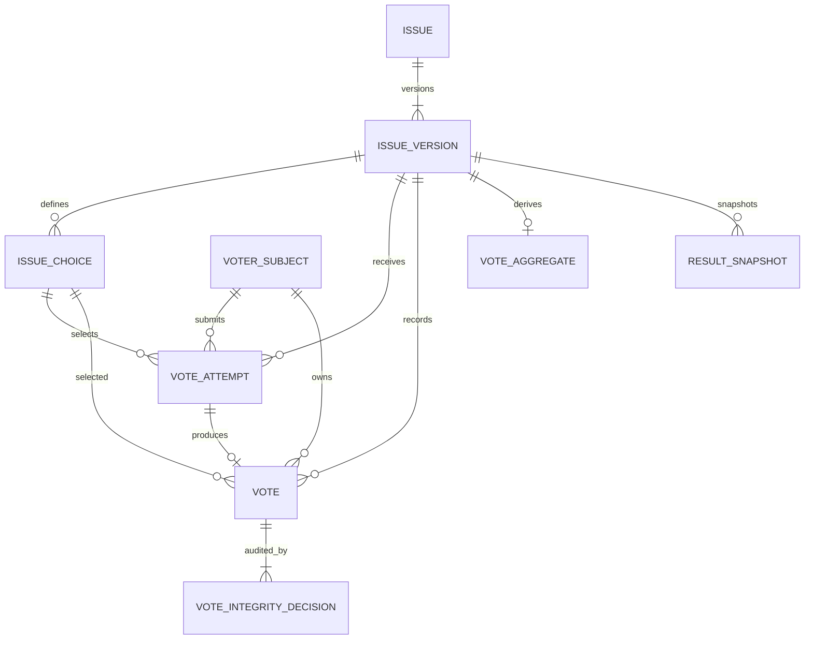

# Data Architecture v1

Status: Implemented baseline  
Branch: `feature/data-architecture-v1`  
Primary decisions: `DEC-SUP-005`, `DEC-SUP-006`, `DEC-ID-003`, `DEC-ID-005`~`009`, `DEC-MET-006`, `DEC-MET-007`, `DEC-RM-008`

## 1. Purpose and scope

This baseline turns the first WHICH core loop into a PostgreSQL contract:

```text
Published Issue Version
→ A/B Choice
→ Voter Subject
→ Idempotent Vote Attempt
→ Vote Fact and Integrity Decision
→ Derived Result Aggregate and Snapshot
→ Transactional Outbox Event
```

The schema deliberately stops before the public vote API. It defines the durable facts and database constraints that the application service must use in the next task.

## 2. Identifier and version rules

| Object               | Rule                                                                                | Reason                                                                        |
| -------------------- | ----------------------------------------------------------------------------------- | ----------------------------------------------------------------------------- |
| Domain IDs           | PostgreSQL UUID with `gen_random_uuid()` unless a trusted client must create the ID | Opaque, globally safe identifiers without a central sequence                  |
| `vote_attempt_id`    | Client-generated UUID                                                               | The same logical submit can be retried after a timeout                        |
| `idempotency_key`    | Unique opaque string, maximum 128 characters                                        | Replays return the stored attempt result instead of creating a vote           |
| `issue_version`      | Positive integer scoped to `issue_id`                                               | A vote always identifies the exact question contract                          |
| `result_version`     | Positive integer scoped to an Issue Version                                         | Snapshots remain reproducible after rebuilds                                  |
| Policy versions      | Stable text such as `v1`                                                            | Eligibility and integrity decisions can be replayed under the original policy |
| Event schema version | Positive integer                                                                    | Consumers can evolve without guessing payload shape                           |

UUIDs are identifiers, not proof of identity. Guest continuity comes from a first-party anonymous subject; member identity and verified uniqueness remain separate concepts.

## 3. Logical ERD



`VOTE` is the source-of-truth fact. `VOTE_AGGREGATE` and `RESULT_SNAPSHOT` are rebuildable projections. `OUTBOX_EVENT` is written in the same transaction as the domain change but published asynchronously.

## 4. Core invariants

### Issue and Choice

- An Issue Version has a positive version and exactly one A and one B before publishing. The current database guarantees at most one of each; the publish service must reject missing choices.
- A Vote Attempt and Vote reference the composite `(issue_id, issue_version, choice_id)`, so a Choice from another version cannot be submitted.
- The first `ACCEPTED` vote transaction sets `issue_versions.locked_at` if it is still null.
- Once locked, question, context, A/B labels, positions, and `content_hash` are immutable. A material correction creates a successor Issue.
- Political Issues must be `RESTRICTED`. Voting remains disabled by the application feature flag for the MVP.

### Subject, attempt, and vote

- A subject has exactly one valid identity shape: Guest, Member, or Verified Member.
- Raw IP is never a subject key and is not stored in the domain schema.
- `idempotency_key` is unique. A repeated key with the same request fingerprint returns the stored response; a different fingerprint is a conflict.
- A partial unique index allows at most one current `ACCEPTED` Vote for `(issue_id, subject_id)`.
- `REVIEW`, `REJECTED_DUPLICATE`, `REJECTED_ABUSE`, and `INVALIDATED` are excluded from displayed results.
- Vote facts are not physically deleted. State changes create an append-only integrity decision revision.

### Aggregate and event

- `accepted_vote_count = accepted_a_count + accepted_b_count`.
- `displayed_vote_count = accepted_vote_count` in v1.
- Counters never become negative.
- Every accepted, invalidated, restored, or rebuilt result writes a versioned Outbox event in the same database transaction.
- A counter mismatch is repaired from Vote facts; an operator never edits only the public count.

## 5. Accepted vote transaction

The application service must execute the following work in one PostgreSQL transaction:

1. Load and lock the requested Issue Version and verify lifecycle, participation, vote window, risk, and feature flags.
2. Validate that the selected Choice belongs to the same Issue Version.
3. Insert or load `vote_attempts` by `idempotency_key`; compare `request_fingerprint` on a replay.
4. Resolve the canonical Voter Subject and evaluate eligibility and integrity policy.
5. Insert the Vote fact. The partial unique index resolves concurrent tabs to one `ACCEPTED` Vote.
6. Insert integrity decision revision 1.
7. For `ACCEPTED`, set `issue_versions.locked_at` with `coalesce(locked_at, now())`.
8. Update the aggregate and create a new result snapshot.
9. Insert `VOTE_ACCEPTED` or the applicable server-domain event into `outbox_events` with `schema_version = 1`.
10. Mark the attempt `COMPLETED` and store the stable response snapshot.

If any step fails, the entire transaction rolls back. A timeout is recovered by retrying the same Idempotency Key, not by creating a new attempt.

## 6. Event schema v1

Every Outbox payload uses this envelope:

```json
{
  "event_id": "uuid",
  "event_type": "VOTE_ACCEPTED",
  "schema_version": 1,
  "occurred_at": "RFC3339 timestamp",
  "aggregate_type": "ISSUE_VERSION",
  "aggregate_id": "issue_id:issue_version",
  "data": {}
}
```

Initial event names are `VOTE_ACCEPTED`, `VOTE_REVIEWED`, `VOTE_REJECTED`, `VOTE_INVALIDATED`, `VOTE_RESTORED`, `RESULT_AGGREGATE_REBUILT`, and `ISSUE_VERSION_LOCKED`. Server-domain events are the analytics source of truth for vote success; client events only describe UI intent and exposure.

## 7. Data classification and retention

| Data                                                 | Class                           | Initial handling                                                            |
| ---------------------------------------------------- | ------------------------------- | --------------------------------------------------------------------------- |
| Issue, Choice, public result                         | PUBLIC                          | Retain with Issue history                                                   |
| Policy version, ordinary integrity state             | INTERNAL                        | Role-limited; retain with Vote audit                                        |
| `user_id`, `anonymous_subject_id`, session linkage   | PERSONAL                        | Purpose-limited; unlink or expire under deletion policy                     |
| Verified uniqueness handle, political choice linkage | HIGHLY_RESTRICTED               | HMAC/reference only, minimum access, no public profile or ad targeting      |
| Raw IP and rotating network HMAC                     | Security store, not this schema | Raw IP 7~~30 day candidate; derived HMAC 30~~90 day candidate               |
| Challenge and session risk evidence                  | INTERNAL/PERSONAL               | 90~180 day candidate, then delete unless incident hold applies              |
| Accepted Vote fact                                   | PERSONAL-linked domain fact     | Retain for result/audit; minimize or unlink subject linkage on deletion     |
| REVIEW/Invalidated evidence                          | Restricted audit                | Longer than ordinary telemetry when appeal or incident evidence requires it |

Exact legal retention periods remain a launch gate. Secrets, raw network data, and provider identity documents must never be copied into these tables or development fixtures.

## 8. Reconciliation, migration, and rollback

### Reconciliation

For each Issue Version, rebuild counts from current Vote integrity states, compare them with `vote_aggregates`, write a new `result_version`, retain a snapshot, and emit `RESULT_AGGREGATE_REBUILT`. The job must be idempotent and report request, accepted, review, rejected, and invalidated deltas separately.

### Migration

- Generate checked-in SQL with `pnpm --filter @which/api db:generate --name=<name>`.
- Review generated constraints and indexes before applying.
- Apply locally with `pnpm --filter @which/api db:migrate` and run `pnpm check`.
- Production migrations are expand-first. Application code must remain compatible until deployment verification completes.

### Rollback

- Before traffic/data: restore the database snapshot or remove the new objects in reverse dependency order.
- After data exists: do not drop Vote facts. Disable the new application path, deploy a forward-compatible fix, and restore aggregates from Vote facts.
- For a failed asynchronous publisher, leave Outbox rows pending and retry after the fix.
- Destructive rollback requires an explicit backup, impact review, and operator approval.

## 9. Implemented artifacts and next work

- Drizzle schema: `apps/api/src/database/schema/`
- Initial migration: `apps/api/migrations/0000_data_architecture_v1.sql`
- Schema contract tests: `apps/api/test/schema.test.ts`

The next feature should implement the transaction service and HTTP contract around these tables. Authentication, challenge providers, comments, recommendation storage, and moderation cases remain separate feature tasks.
